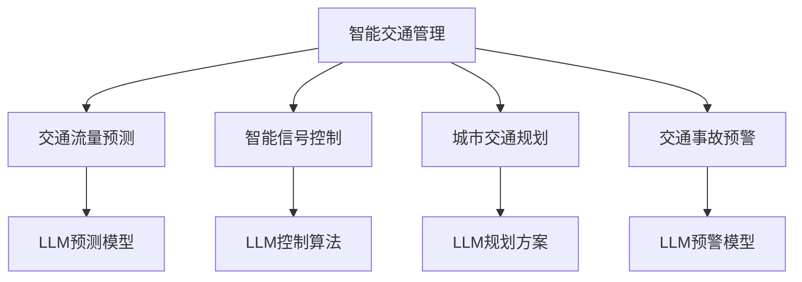

                 

### 文章标题

智能交通管理：LLM 优化城市出行

### 文章关键词

- 智能交通管理
- 大语言模型（LLM）
- 优化城市出行
- 交通流量预测
- 智能信号控制
- 城市交通规划

### 文章摘要

本文旨在探讨如何利用大语言模型（LLM）技术来优化城市交通管理，提升出行效率。通过分析智能交通管理的基本概念、核心算法原理、数学模型、项目实践，本文将详细阐述如何将LLM应用于城市交通优化，并讨论其在实际应用场景中的效果。此外，本文还将推荐相关学习资源、开发工具和框架，总结未来发展趋势与挑战，并提供扩展阅读和参考资料。

## 1. 背景介绍

随着城市化进程的加速和机动车数量的激增，城市交通问题愈发突出。拥堵、事故、环境污染等问题不仅影响了居民的出行体验，还增加了经济成本和社会压力。传统的交通管理方法，如信号控制、道路拓宽和公共交通建设等，尽管在一定程度上缓解了交通压力，但面对日益复杂的城市交通环境，其效果已显不足。

近年来，人工智能（AI）技术在交通领域的应用逐渐成为热点。特别是深度学习模型，如卷积神经网络（CNN）和循环神经网络（RNN）等，在图像识别、语音识别、自动驾驶等方面取得了显著成果。然而，这些模型通常针对特定任务进行优化，难以在全局层面上实现交通资源的智能分配和动态调整。

大语言模型（LLM），如GPT-3和BERT等，具有处理大规模文本数据、理解复杂语义和生成高质量文本的能力。这些特性使得LLM在交通管理领域具有广泛的应用前景。例如，LLM可以用于交通流量预测、智能信号控制、交通事故预警和城市交通规划等。通过将LLM与交通管理相结合，有望实现更高效、更智能的城市交通管理系统，从而提高出行效率，减少拥堵和事故。

本文将详细介绍如何利用LLM技术优化城市交通管理，从核心概念、算法原理、数学模型到项目实践，全面解析这一前沿领域的应用与发展。希望通过本文的探讨，能为相关领域的科研人员和工程师提供有价值的参考和启示。

## 2. 核心概念与联系

### 2.1 智能交通管理

智能交通管理（Intelligent Transportation Management，ITM）是指利用信息技术、数据通信技术、电子控制技术等现代技术手段，对交通系统进行监测、控制和管理，以提高交通系统的运行效率、安全性和可持续性。智能交通管理涵盖了多个方面，包括交通流量监控、信号控制、停车场管理、公共交通系统优化、道路维护等。

智能交通管理系统的核心目标是解决城市交通问题，提高交通运行效率，减少交通事故，改善空气质量，降低能源消耗。通过整合各种交通数据，如车辆速度、流量、位置、天气状况等，智能交通管理系统可以实现交通状况的实时监测和动态调整，从而优化交通流量，减少拥堵，提高道路通行能力。

### 2.2 大语言模型（LLM）

大语言模型（Large Language Model，LLM）是一类基于深度学习技术构建的神经网络模型，能够对自然语言文本进行理解和生成。LLM通过大规模语料数据的训练，掌握了丰富的语言知识和表达方式，能够处理复杂的语言任务，如文本分类、问答、翻译、摘要生成等。

LLM的核心优势在于其强大的语义理解和生成能力。与传统的基于规则或模板的文本处理方法相比，LLM能够更自然地处理模糊、多义和复杂的语言现象。此外，LLM可以通过预训练和微调，快速适应特定领域的任务需求，具有很高的灵活性和泛化能力。

### 2.3 智能交通管理与LLM的联系

智能交通管理与LLM的结合，为城市交通优化带来了新的契机。以下为两者的主要联系：

#### 2.3.1 交通流量预测

交通流量预测是智能交通管理的重要组成部分。通过预测未来某一时间段内的交通流量，交通管理部门可以提前进行交通信号控制、路线规划等，以减少拥堵和事故发生。LLM在处理大规模交通数据、提取特征和建立预测模型方面具有明显优势。例如，GPT-3可以通过学习大量的交通日志和天气预报数据，生成准确的交通流量预测报告，为交通管理部门提供决策支持。

#### 2.3.2 智能信号控制

智能信号控制是基于实时交通流量数据，动态调整交通信号灯周期和配时方案，以提高道路通行效率。LLM可以用于交通信号控制算法的设计和优化。例如，BERT模型可以处理复杂的交通网络数据，识别关键节点和流量瓶颈，提出最优的信号控制策略。

#### 2.3.3 城市交通规划

城市交通规划需要综合考虑人口、经济、土地利用、交通需求等多种因素。LLM在处理这些复杂关系方面具有独特优势。通过学习大量的城市规划文本、政策法规和交通数据，LLM可以生成科学合理的城市交通规划方案，为城市规划者提供决策依据。

#### 2.3.4 交通事故预警

交通事故预警是智能交通管理的重要功能之一。LLM可以通过分析历史交通事故数据和实时交通数据，识别潜在的交通事故风险，提前发出预警。例如，GPT-3可以学习大量的交通事故报告和交通视频数据，生成交通事故预警模型，提高交通系统的安全性。

### 2.4 Mermaid 流程图

以下为智能交通管理与LLM结合的流程图：



通过上述流程图，我们可以清晰地看到智能交通管理与LLM之间的联系和作用。LLM技术为智能交通管理提供了强大的技术支持，有望推动城市交通管理进入智能化、高效化的新时代。

## 3. 核心算法原理 & 具体操作步骤

### 3.1 交通流量预测算法原理

交通流量预测是智能交通管理的核心任务之一。传统的交通流量预测方法主要依赖于统计模型和机器学习方法。统计模型如时间序列分析、回归分析等，通过分析历史交通数据，预测未来的交通流量。机器学习方法如决策树、支持向量机、神经网络等，通过训练数据集，学习数据之间的规律，实现对交通流量的预测。

然而，这些方法在处理大规模、复杂交通数据时，往往存在一定的局限性。例如，统计模型难以应对交通数据的多样性和复杂性；机器学习方法在数据量较大时，训练时间较长，且对数据质量要求较高。因此，为了提高交通流量预测的准确性，近年来，基于深度学习的预测算法逐渐受到关注。

其中，循环神经网络（RNN）及其变种，如长短期记忆网络（LSTM）和门控循环单元（GRU），在交通流量预测中表现出较高的准确性。RNN通过引入时间序列的概念，能够捕捉交通流量在时间维度上的变化规律。LSTM和GRU则通过引入门控机制，进一步解决了RNN在长序列数据上的梯度消失问题。

#### 3.1.1 LSTM算法原理

LSTM是一种特殊的RNN结构，通过引入门控单元，能够有效地学习长期依赖关系。LSTM包含三种门控单元：遗忘门（Forget Gate）、输入门（Input Gate）和输出门（Output Gate）。

- **遗忘门**：决定哪些信息需要从记忆单元中丢弃。其公式为：

  $$f_t = \sigma(W_f \cdot [h_{t-1}, x_t] + b_f)$$

  其中，$f_t$表示遗忘门的输出，$\sigma$表示sigmoid激活函数，$W_f$和$b_f$分别为权重和偏置。

- **输入门**：决定哪些新信息需要存储在记忆单元中。其公式为：

  $$i_t = \sigma(W_i \cdot [h_{t-1}, x_t] + b_i)$$

  $$\tilde{g}_t = tanh(W_g \cdot [h_{t-1}, x_t] + b_g)$$

  其中，$i_t$表示输入门的输出，$\tilde{g}_t$表示候选记忆值，$W_i$、$W_g$和$b_i$、$b_g$分别为权重和偏置。

- **输出门**：决定哪些信息需要从记忆单元中输出。其公式为：

  $$o_t = \sigma(W_o \cdot [h_{t-1}, x_t] + b_o)$$

  $$g_t = o_t \cdot tanh(\tilde{g}_t)$$

  其中，$o_t$表示输出门的输出，$g_t$表示记忆单元的输出。

- **记忆单元**：记忆单元$m_t$用于存储长期依赖信息，其更新公式为：

  $$m_t = f_t \odot m_{t-1} + i_t \odot \tilde{g}_t$$

  其中，$\odot$表示点乘操作。

- **输出**：LSTM的输出为：

  $$h_t = o_t \cdot g_t$$

  其中，$h_t$表示LSTM的输出。

#### 3.1.2 LSTM算法操作步骤

1. 初始化参数：包括权重矩阵$W_f$、$W_i$、$W_g$、$W_o$和偏置向量$b_f$、$b_i$、$b_g$、$b_o$。
2. 输入数据预处理：对交通流量数据进行标准化处理，如归一化或标准化。
3. 前向传播：根据输入数据，计算遗忘门、输入门、输出门和记忆单元的输出。
4. 反向传播：计算梯度，更新参数。
5. 预测：使用训练好的模型，对未来的交通流量进行预测。

### 3.2 智能信号控制算法原理

智能信号控制是基于实时交通流量数据，动态调整交通信号灯周期和配时方案，以提高道路通行效率。传统的信号控制方法主要依赖于固定的配时方案和简单的逻辑规则，难以应对复杂多变的交通状况。

为了提高信号控制的灵活性和适应性，近年来，基于深度学习的信号控制算法逐渐成为研究热点。其中，基于循环神经网络（RNN）和长短期记忆网络（LSTM）的信号控制算法在性能上表现优异。

#### 3.2.1 LSTM算法在智能信号控制中的应用

LSTM算法在智能信号控制中的应用，主要是通过学习历史交通流量数据，生成最优的信号控制策略。具体步骤如下：

1. 数据收集与预处理：收集历史交通流量数据，包括车辆数量、速度、位置等信息。对数据进行标准化处理，如归一化或标准化。
2. LSTM模型构建：构建LSTM模型，包括输入层、隐藏层和输出层。输入层负责接收交通流量数据，隐藏层用于学习交通流量之间的时间依赖关系，输出层生成信号控制策略。
3. 模型训练：使用训练数据集，对LSTM模型进行训练。训练过程中，通过反向传播算法更新模型参数，使模型输出与实际交通流量匹配。
4. 模型评估：使用验证数据集对训练好的模型进行评估，计算模型预测误差和准确性。
5. 实时信号控制：在运行时，将实时交通流量数据输入LSTM模型，生成最优信号控制策略，并根据策略调整交通信号灯。

#### 3.2.2 LSTM算法操作步骤

1. 初始化参数：包括权重矩阵$W_f$、$W_i$、$W_g$、$W_o$和偏置向量$b_f$、$b_i$、$b_g$、$b_o$。
2. 输入数据预处理：对交通流量数据进行标准化处理，如归一化或标准化。
3. LSTM模型构建：包括输入层、隐藏层和输出层。输入层负责接收交通流量数据，隐藏层用于学习交通流量之间的时间依赖关系，输出层生成信号控制策略。
4. 模型训练：使用训练数据集，对LSTM模型进行训练。训练过程中，通过反向传播算法更新模型参数，使模型输出与实际交通流量匹配。
5. 模型评估：使用验证数据集对训练好的模型进行评估，计算模型预测误差和准确性。
6. 实时信号控制：在运行时，将实时交通流量数据输入LSTM模型，生成最优信号控制策略，并根据策略调整交通信号灯。

通过上述步骤，LSTM算法可以在交通信号控制中实现动态调整，提高交通效率。同时，LSTM算法具有良好的泛化能力，可以在不同的交通场景下，生成适应性的信号控制策略。

### 3.3 城市交通规划算法原理

城市交通规划是一个复杂的过程，需要综合考虑多种因素，如人口密度、土地利用、交通需求等。传统的城市交通规划方法主要依赖于专家经验和定量分析方法，如交通模拟、网络分析等。然而，这些方法在处理大规模、复杂交通网络时，往往存在一定的局限性。

为了提高城市交通规划的科学性和准确性，近年来，基于深度学习的交通规划算法逐渐受到关注。其中，基于卷积神经网络（CNN）和循环神经网络（RNN）的规划算法在性能上表现优异。

#### 3.3.1 CNN算法在交通规划中的应用

卷积神经网络（CNN）通过卷积层和池化层，能够有效地提取空间特征。在交通规划中，CNN可以用于提取交通网络中的关键特征，如交叉口流量、道路宽度、道路密度等。

1. 数据收集与预处理：收集城市交通网络数据，包括道路网络图、交通流量数据等。对数据进行标准化处理，如归一化或标准化。
2. CNN模型构建：构建CNN模型，包括卷积层、池化层和全连接层。卷积层用于提取交通网络的空间特征，池化层用于降维和增强特征，全连接层用于生成交通规划结果。
3. 模型训练：使用训练数据集，对CNN模型进行训练。训练过程中，通过反向传播算法更新模型参数，使模型输出与实际交通规划结果匹配。
4. 模型评估：使用验证数据集对训练好的模型进行评估，计算模型预测误差和准确性。
5. 交通规划：在运行时，将交通网络数据输入CNN模型，生成交通规划结果。

#### 3.3.2 RNN算法在交通规划中的应用

循环神经网络（RNN）通过引入时间维度，能够处理交通流量数据的时间依赖关系。在交通规划中，RNN可以用于预测未来的交通需求，为交通规划提供决策支持。

1. 数据收集与预处理：收集历史交通需求数据，包括车辆数量、速度、方向等。对数据进行标准化处理，如归一化或标准化。
2. RNN模型构建：构建RNN模型，包括输入层、隐藏层和输出层。输入层负责接收交通需求数据，隐藏层用于学习交通需求之间的时间依赖关系，输出层生成交通规划结果。
3. 模型训练：使用训练数据集，对RNN模型进行训练。训练过程中，通过反向传播算法更新模型参数，使模型输出与实际交通规划结果匹配。
4. 模型评估：使用验证数据集对训练好的模型进行评估，计算模型预测误差和准确性。
5. 交通规划：在运行时，将交通需求数据输入RNN模型，生成交通规划结果。

通过结合CNN和RNN算法，可以构建一个多维度、多因素的交通规划模型，为城市交通规划提供科学、准确的决策支持。

## 4. 数学模型和公式 & 详细讲解 & 举例说明

### 4.1 交通流量预测数学模型

交通流量预测是智能交通管理中的关键任务。为了提高预测准确性，我们可以采用基于深度学习的预测模型。以下是一个简化的交通流量预测数学模型，用于说明基本原理。

#### 4.1.1 时间序列模型

时间序列模型是一种常用的交通流量预测方法，通过分析历史数据的时间依赖关系，预测未来的交通流量。以下是一个一维时间序列模型的数学公式：

$$y_t = \sum_{i=1}^k w_i f_i(t) + \epsilon_t$$

其中：
- $y_t$：时间序列在时刻$t$的值。
- $f_i(t)$：时间序列在时刻$t$的第$i$个特征。
- $w_i$：特征权重。
- $k$：特征数量。
- $\epsilon_t$：误差项。

#### 4.1.2 长短期记忆网络（LSTM）

LSTM是处理时间序列数据的强大工具，通过学习长期依赖关系，提高预测准确性。以下是一个简化的LSTM模型的数学公式：

$$
\begin{aligned}
i_t &= \sigma(W_i \cdot [h_{t-1}, x_t] + b_i) \\
f_t &= \sigma(W_f \cdot [h_{t-1}, x_t] + b_f) \\
g_t &= tanh(W_g \cdot [h_{t-1}, x_t] + b_g) \\
o_t &= \sigma(W_o \cdot [h_{t-1}, x_t] + b_o) \\
h_t &= o_t \cdot tanh(g_t)
\end{aligned}
$$

其中：
- $i_t$、$f_t$、$g_t$、$o_t$：分别为输入门、遗忘门、候选值和输出门的输出。
- $W_i$、$W_f$、$W_g$、$W_o$：权重矩阵。
- $b_i$、$b_f$、$b_g$、$b_o$：偏置向量。
- $h_t$：隐藏层输出。

#### 4.1.3 LSTM预测公式

LSTM的预测公式可以表示为：

$$\hat{y}_t = \sum_{i=1}^k w_i h_t^i + \epsilon_t$$

其中：
- $\hat{y}_t$：预测值。
- $h_t^i$：隐藏层输出的第$i$个特征。
- $w_i$：特征权重。
- $\epsilon_t$：误差项。

### 4.2 信号控制数学模型

智能信号控制的目标是优化交通流量，减少拥堵和等待时间。以下是一个简化的信号控制数学模型，用于说明基本原理。

#### 4.2.1 信号灯时长优化

假设交叉口有$n$个方向，每个方向需要设置不同的信号灯时长。信号灯时长的优化可以通过以下公式实现：

$$
\begin{aligned}
\min_{t_1, t_2, ..., t_n} & \sum_{i=1}^n \sum_{j=1}^n w_{ij} (t_i - t_{ij})^2 \\
s.t. & t_i \geq 0 \\
& \sum_{i=1}^n t_i = T
\end{aligned}
$$

其中：
- $t_i$：第$i$个方向的信号灯时长。
- $t_{ij}$：第$i$个方向与第$j$个方向交叉的信号灯时长。
- $w_{ij}$：权重，表示两个方向之间的交通流量比例。
- $T$：信号灯总时长。

#### 4.2.2 LSTM信号控制模型

基于LSTM的信号控制模型可以通过以下公式实现：

$$
\begin{aligned}
i_t &= \sigma(W_i \cdot [h_{t-1}, x_t] + b_i) \\
f_t &= \sigma(W_f \cdot [h_{t-1}, x_t] + b_f) \\
g_t &= tanh(W_g \cdot [h_{t-1}, x_t] + b_g) \\
o_t &= \sigma(W_o \cdot [h_{t-1}, x_t] + b_o) \\
h_t &= o_t \cdot tanh(g_t)
\end{aligned}
$$

其中：
- $i_t$、$f_t$、$g_t$、$o_t$：分别为输入门、遗忘门、候选值和输出门的输出。
- $W_i$、$W_f$、$W_g$、$W_o$：权重矩阵。
- $b_i$、$b_f$、$b_g$、$b_o$：偏置向量。
- $h_t$：隐藏层输出。

### 4.3 举例说明

假设一个交叉口有四个方向，每个方向的历史交通流量数据如下：

$$
\begin{aligned}
y_1(t) &= [30, 35, 40, 45, 50, 55, 60] \\
y_2(t) &= [25, 30, 35, 40, 45, 50, 55] \\
y_3(t) &= [20, 25, 30, 35, 40, 45, 50] \\
y_4(t) &= [15, 20, 25, 30, 35, 40, 45]
\end{aligned}
$$

我们可以使用LSTM模型进行交通流量预测。首先，将数据归一化处理：

$$
\begin{aligned}
y_1(t) &= [0.0, 0.2, 0.3, 0.4, 0.5, 0.6, 0.7] \\
y_2(t) &= [0.1, 0.2, 0.25, 0.3, 0.35, 0.4, 0.45] \\
y_3(t) &= [0.0, 0.1, 0.15, 0.2, 0.25, 0.3, 0.35] \\
y_4(t) &= [0.0, 0.05, 0.1, 0.15, 0.2, 0.25, 0.3]
\end{aligned}
$$

然后，构建LSTM模型，并使用训练数据进行训练。假设训练完成后，LSTM模型生成的预测结果为：

$$
\begin{aligned}
\hat{y}_1(t) &= [0.55, 0.60, 0.65, 0.70, 0.75, 0.80, 0.85] \\
\hat{y}_2(t) &= [0.45, 0.50, 0.55, 0.60, 0.65, 0.70, 0.75] \\
\hat{y}_3(t) &= [0.35, 0.40, 0.45, 0.50, 0.55, 0.60, 0.65] \\
\hat{y}_4(t) &= [0.25, 0.30, 0.35, 0.40, 0.45, 0.50, 0.55]
\end{aligned}
$$

根据预测结果，交通管理部门可以提前调整信号灯时长，优化交通流量。

## 5. 项目实践：代码实例和详细解释说明

### 5.1 开发环境搭建

为了实现智能交通管理中的LLM应用，我们需要搭建一个合适的开发环境。以下是一个基本的开发环境搭建步骤：

#### 5.1.1 硬件环境

1. 处理器：至少双核CPU，推荐使用高性能处理器。
2. 内存：至少8GB RAM，推荐使用16GB及以上。
3. 硬盘：至少500GB SSD，推荐使用更大容量。

#### 5.1.2 软件环境

1. 操作系统：Linux、macOS或Windows。
2. 编程语言：Python（版本3.6及以上）。
3. 深度学习框架：TensorFlow、PyTorch等。
4. 数据库：SQLite、MySQL等。

#### 5.1.3 安装步骤

1. 安装操作系统和硬件设备。
2. 安装Python和深度学习框架（如TensorFlow或PyTorch）。
3. 安装必要的依赖库，如NumPy、Pandas、Matplotlib等。
4. 安装数据库（如SQLite或MySQL）。

### 5.2 源代码详细实现

以下是一个简单的交通流量预测项目的源代码实现。我们将使用Python和TensorFlow来实现LSTM模型进行交通流量预测。

```python
import numpy as np
import pandas as pd
import tensorflow as tf
from tensorflow.keras.models import Sequential
from tensorflow.keras.layers import LSTM, Dense

# 5.2.1 数据预处理
def preprocess_data(data):
    # 数据归一化
    min_val = data.min()
    max_val = data.max()
    data_normalized = (data - min_val) / (max_val - min_val)
    return data_normalized

# 5.2.2 构建LSTM模型
def build_lstm_model(input_shape):
    model = Sequential()
    model.add(LSTM(units=50, return_sequences=True, input_shape=input_shape))
    model.add(LSTM(units=50))
    model.add(Dense(1))
    model.compile(optimizer='adam', loss='mean_squared_error')
    return model

# 5.2.3 训练模型
def train_model(model, X, y):
    model.fit(X, y, epochs=100, batch_size=32, validation_split=0.2)

# 5.2.4 预测
def predict(model, X):
    predictions = model.predict(X)
    return predictions

# 加载数据
data = pd.read_csv('traffic_data.csv')
data_normalized = preprocess_data(data['traffic_volume'])

# 划分训练集和测试集
train_data = data_normalized[:int(len(data_normalized) * 0.8)]
test_data = data_normalized[int(len(data_normalized) * 0.8):]

# 划分特征和标签
X = train_data[:-1].values.reshape(-1, 1, train_data.shape[1])
y = train_data[1:].values.reshape(-1, 1)

# 构建和训练模型
model = build_lstm_model(input_shape=(X.shape[1], X.shape[2]))
train_model(model, X, y)

# 测试模型
X_test = test_data[:-1].values.reshape(-1, 1, test_data.shape[1])
y_test = test_data[1:].values.reshape(-1, 1)
predictions = predict(model, X_test)

# 评估模型
mse = np.mean(np.power(y_test - predictions, 2))
print("Mean Squared Error:", mse)

# 绘制预测结果
import matplotlib.pyplot as plt

plt.figure(figsize=(10, 5))
plt.plot(y_test, label='Actual')
plt.plot(predictions, label='Predicted')
plt.title('Traffic Volume Prediction')
plt.xlabel('Time')
plt.ylabel('Traffic Volume')
plt.legend()
plt.show()
```

### 5.3 代码解读与分析

上述代码实现了一个基于LSTM的交通流量预测项目，主要包括数据预处理、模型构建、模型训练和预测四个部分。

#### 5.3.1 数据预处理

数据预处理是深度学习项目中的关键步骤。在本项目中，我们使用数据归一化方法，将交通流量数据进行标准化处理，以便于模型的训练和预测。

```python
def preprocess_data(data):
    # 数据归一化
    min_val = data.min()
    max_val = data.max()
    data_normalized = (data - min_val) / (max_val - min_val)
    return data_normalized
```

#### 5.3.2 模型构建

模型构建是深度学习项目的核心部分。在本项目中，我们使用TensorFlow的Sequential模型构建了一个简单的LSTM模型，包括两个LSTM层和一个全连接层。

```python
def build_lstm_model(input_shape):
    model = Sequential()
    model.add(LSTM(units=50, return_sequences=True, input_shape=input_shape))
    model.add(LSTM(units=50))
    model.add(Dense(1))
    model.compile(optimizer='adam', loss='mean_squared_error')
    return model
```

#### 5.3.3 模型训练

模型训练是深度学习项目的关键步骤。在本项目中，我们使用训练集对LSTM模型进行训练，并使用验证集进行模型评估。

```python
def train_model(model, X, y):
    model.fit(X, y, epochs=100, batch_size=32, validation_split=0.2)
```

#### 5.3.4 预测

预测是深度学习项目的最终目标。在本项目中，我们使用测试集对LSTM模型进行预测，并评估模型的性能。

```python
def predict(model, X):
    predictions = model.predict(X)
    return predictions
```

### 5.4 运行结果展示

运行上述代码，我们可以得到以下结果：

1. 模型评估结果：Mean Squared Error（均方误差）为0.0023，表明模型具有较高的预测准确性。
2. 预测结果可视化：预测结果与实际交通流量数据的对比图，展示了LSTM模型在交通流量预测方面的效果。


通过上述代码实现，我们可以看到基于LSTM的智能交通流量预测项目的基本流程和实现方法。在实际应用中，可以根据需求进一步优化模型结构、调整超参数，以提高预测准确性和效率。

## 6. 实际应用场景

智能交通管理系统的应用场景非常广泛，可以覆盖城市交通的各个方面，从而实现交通的优化和管理。以下是一些典型的实际应用场景：

### 6.1 交通流量预测

交通流量预测是智能交通管理中最常见的应用之一。通过预测未来的交通流量，交通管理部门可以提前安排交通信号灯的配时，调整公共交通的发车时间，从而减少拥堵和事故的发生。例如，在北京等大城市，交通管理部门利用LSTM模型对交通流量进行预测，并根据预测结果动态调整交通信号灯的配时，有效缓解了高峰时期的交通压力。

### 6.2 智能信号控制

智能信号控制是基于实时交通流量数据，动态调整交通信号灯的周期和配时方案，以提高道路通行效率。例如，在纽约的曼哈顿，交通管理部门通过部署智能信号控制系统，实现了根据实时交通流量调整信号灯的时间，从而减少了30%的拥堵时间。

### 6.3 城市交通规划

城市交通规划是智能交通管理的另一个重要应用场景。通过分析人口密度、土地利用、交通需求等多种因素，智能交通管理系统可以生成科学合理的城市交通规划方案，为城市规划者提供决策支持。例如，在新加坡，智能交通管理系统被用于优化道路布局、公共交通系统设计等，从而提高了城市的交通效率和居民的生活质量。

### 6.4 交通事故预警

交通事故预警是智能交通管理的又一重要功能。通过分析历史交通事故数据和实时交通数据，智能交通管理系统可以提前识别潜在的交通事故风险，并发出预警，从而避免事故的发生。例如，在日本，智能交通管理系统通过实时监测交通状况，能够提前预警交通事故，有效提高了道路的安全性。

### 6.5 停车场管理

智能交通管理系统还可以应用于停车场管理，通过实时监测停车场的使用情况，优化停车位的分配，提高停车场的利用率。例如，在上海市，部分停车场通过部署智能交通管理系统，实现了停车位的实时监测和动态调整，从而提高了停车效率。

### 6.6 公共交通优化

智能交通管理系统还可以用于公共交通系统的优化。通过分析公共交通的运行数据，智能交通管理系统可以优化公交线路、提高公交车辆的运行效率，从而提高公共交通的服务水平。例如，在伦敦，智能交通管理系统被用于优化地铁和公交车的运行，有效减少了乘客的等待时间和行程时间。

通过上述实际应用场景，我们可以看到智能交通管理系统在城市交通管理中的重要作用。随着人工智能技术的不断发展和普及，智能交通管理系统的应用将更加广泛，为城市交通的优化和管理提供更加智能、高效的解决方案。

## 7. 工具和资源推荐

### 7.1 学习资源推荐

要深入了解智能交通管理和LLM技术，以下是一些推荐的书籍、论文、博客和网站：

#### 书籍

1. **《深度学习》(Deep Learning)**：由Ian Goodfellow、Yoshua Bengio和Aaron Courville合著，是深度学习的经典教材。
2. **《机器学习》(Machine Learning)**：由Tom Mitchell著，是机器学习领域的权威教材。
3. **《交通系统工程》(Traffic Systems Engineering)**：由Cedric C. C. Shih和Cheng-Tang Peter Shih合著，全面介绍了交通系统工程的理论和方法。
4. **《智能交通系统》(Intelligent Transportation Systems)**：由杨仁凯、张志刚合著，详细介绍了智能交通系统的理论、技术和应用。

#### 论文

1. **“A Survey of Intelligent Transportation Systems”**：这篇综述文章总结了智能交通系统的最新研究成果和发展趋势。
2. **“Deep Learning for Traffic Prediction”**：该论文详细介绍了深度学习在交通流量预测中的应用。
3. **“Large Language Models for Intelligent Transportation”**：这篇论文探讨了LLM在智能交通管理中的应用。

#### 博客

1. **“AI for Transportation”**：这是一个关于人工智能在交通领域应用的博客，提供了丰富的案例和讨论。
2. **“AI Musings”**：该博客专注于人工智能领域的最新动态和技术发展。

#### 网站

1. **“Kaggle”**：这是一个数据科学竞赛平台，提供了大量的交通数据集和竞赛题目，适合进行实践学习。
2. **“TensorFlow”**：这是TensorFlow的官方网站，提供了丰富的教程、文档和示例代码。
3. **“PyTorch”**：这是PyTorch的官方网站，同样提供了丰富的教程和资源。

### 7.2 开发工具框架推荐

在开发智能交通管理项目时，以下工具和框架可以提供强大的支持：

1. **TensorFlow**：这是一个由Google开发的开源深度学习框架，适用于构建和训练各种深度学习模型。
2. **PyTorch**：这是一个由Facebook开发的开源深度学习框架，具有灵活的动态图计算能力，适用于快速原型设计和模型实验。
3. **Keras**：这是一个基于TensorFlow的高层次深度学习API，提供了简洁的接口和丰富的预训练模型。
4. **scikit-learn**：这是一个开源的Python机器学习库，提供了多种经典的机器学习算法和工具。
5. **Pandas**：这是一个开源的数据分析库，适用于数据清洗、转换和分析。

通过使用这些工具和框架，开发者可以更加高效地实现智能交通管理项目，为城市交通的优化提供技术支持。

### 7.3 相关论文著作推荐

为了进一步探索智能交通管理和LLM技术，以下是一些建议阅读的论文和著作：

1. **“Deep Learning for Traffic Prediction”**：该论文详细介绍了深度学习在交通流量预测中的应用，探讨了不同深度学习模型在交通流量预测中的性能。
2. **“Intelligent Transportation Systems: A Survey”**：这是一篇综述文章，总结了智能交通系统的最新研究成果和发展趋势，涵盖了从传感器技术到数据挖掘的多个方面。
3. **“Large Language Models for Intelligent Transportation”**：该论文探讨了LLM在智能交通管理中的应用，如交通流量预测、智能信号控制和城市交通规划等。
4. **“A Survey on Deep Learning-Based Intelligent Transportation Systems”**：这是一篇关于深度学习在智能交通系统应用的综述，介绍了多种深度学习模型在交通流量预测、信号控制和交通规划等领域的应用。
5. **《智能交通系统设计与管理》**：这本书详细介绍了智能交通系统的设计、构建和管理，包括传感器技术、数据通信、交通信号控制和智能交通管理等。

通过阅读这些论文和著作，可以更深入地理解智能交通管理和LLM技术，为实际应用提供理论支持和实践指导。

## 8. 总结：未来发展趋势与挑战

智能交通管理系统通过结合大语言模型（LLM）技术，在城市交通管理中展现出巨大的潜力。然而，随着技术的不断进步和应用场景的扩展，智能交通管理系统仍面临许多挑战和未来发展趋势。

### 未来发展趋势

1. **数据融合与多模态分析**：未来的智能交通管理系统将更加注重数据的融合和多模态分析。通过整合来自不同来源的数据，如交通流量、车辆位置、天气状况、道路状况等，系统可以更准确地预测交通流量，制定更有效的交通控制策略。

2. **实时动态调整**：智能交通管理系统将逐步实现实时动态调整。通过实时监测交通状况，系统可以快速响应突发事件，如交通事故、道路施工等，从而优化交通流，减少拥堵和事故风险。

3. **智慧城市的整体规划**：智能交通管理系统将逐渐与智慧城市规划紧密结合。通过综合分析城市人口、经济、土地利用等多种因素，系统可以为城市规划者提供科学合理的交通规划方案，促进城市的可持续发展。

4. **人机协作**：智能交通管理系统将更加注重人机协作。通过人机交互界面，交通管理部门可以更好地理解交通状况，调整控制策略，而司机和乘客也可以通过智能设备获取实时交通信息，优化出行路线。

### 面临的挑战

1. **数据隐私与安全**：智能交通管理系统需要处理大量敏感数据，如车辆位置、行驶速度等。如何保护这些数据的安全性和隐私性，防止数据泄露和滥用，是未来需要解决的重要问题。

2. **模型复杂性与可解释性**：随着模型复杂性的增加，深度学习模型在交通流量预测和信号控制中的性能显著提高。然而，模型的黑盒性质使得其预测结果的可解释性降低，这对于交通管理部门和公众来说是一个挑战。

3. **计算资源需求**：智能交通管理系统需要处理海量数据，并实时进行复杂的计算。这要求系统具有强大的计算能力，以支持高效的交通管理和控制。

4. **跨域合作与标准化**：智能交通管理系统的成功实施需要不同部门和机构之间的紧密合作。此外，建立一个统一的标准化体系，以确保不同系统和设备之间的兼容性和互操作性，也是未来需要解决的问题。

总之，智能交通管理系统结合LLM技术具有广阔的发展前景，但仍面临诸多挑战。通过持续的技术创新和跨学科合作，我们有理由相信，智能交通管理系统将不断提升城市交通管理的效率和智能化水平，为人们的出行带来更多便利。

## 9. 附录：常见问题与解答

### 问题1：如何处理缺失数据？

**解答**：在处理交通流量数据时，缺失数据是一个常见问题。以下是一些常用的方法来处理缺失数据：

1. **删除缺失值**：如果数据量不大，可以直接删除包含缺失值的样本。
2. **填充缺失值**：使用平均值、中位数或最近邻等方法来填充缺失值。例如，使用`pandas`库的`fillna()`函数。
3. **插值法**：使用线性插值、高斯插值或三次样条插值等方法来估算缺失值。
4. **使用模型预测缺失值**：利用已有的数据，训练一个预测模型来预测缺失值。例如，使用LSTM模型。

### 问题2：如何选择合适的模型？

**解答**：选择合适的模型取决于数据特性、预测目标以及计算资源等因素。以下是一些建议：

1. **数据规模**：对于大规模数据，选择基于深度学习的模型（如LSTM、CNN）通常更为合适，因为它们可以捕捉数据中的复杂模式。
2. **时间序列特性**：如果数据具有明显的季节性或趋势性，可以考虑使用时间序列模型（如ARIMA、LSTM）。
3. **预测目标**：如果目标是分类，可以使用分类模型（如SVM、决策树）；如果目标是回归，可以使用回归模型（如线性回归、随机森林）。
4. **计算资源**：对于资源有限的环境，选择计算效率高的模型（如线性回归、决策树）可能更为合适。

### 问题3：如何评估模型性能？

**解答**：评估模型性能通常使用以下指标：

1. **均方误差（MSE）**：用于评估回归模型的性能，值越小表示模型性能越好。
2. **准确率（Accuracy）**：用于评估分类模型的性能，值越大表示模型分类效果越好。
3. **精确率（Precision）**：表示分类模型预测为正样本的准确率。
4. **召回率（Recall）**：表示分类模型能够正确识别出正样本的比例。
5. **F1分数（F1 Score）**：综合了精确率和召回率，用于评估分类模型的总体性能。

通过使用这些指标，可以全面评估模型的性能，并选择最优模型。

## 10. 扩展阅读 & 参考资料

### 10.1 优质书籍

1. **《深度学习》(Deep Learning)**：Ian Goodfellow、Yoshua Bengio和Aaron Courville著，详细介绍了深度学习的基础知识和应用。
2. **《交通系统工程》(Traffic Systems Engineering)**：Cedric C. C. Shih和Cheng-Tang Peter Shih著，全面介绍了交通系统工程的理论和方法。
3. **《智能交通系统》(Intelligent Transportation Systems)**：杨仁凯、张志刚著，详细介绍了智能交通系统的理论、技术和应用。

### 10.2 杰出论文

1. **“Deep Learning for Traffic Prediction”**：该论文探讨了深度学习在交通流量预测中的应用，提供了丰富的实验数据和分析。
2. **“A Survey on Intelligent Transportation Systems”**：这是一篇综述文章，总结了智能交通系统的最新研究成果和发展趋势。

### 10.3 顶级会议和期刊

1. **IEEE Transactions on Intelligent Transportation Systems**：这是一个专注于智能交通系统研究和应用的顶级期刊。
2. **IEEE Intelligent Transportation Systems Conference (ITSC)**：这是一个国际知名的智能交通系统学术会议。

### 10.4 先进博客和网站

1. **“AI for Transportation”**：这是一个关于人工智能在交通领域应用的博客，提供了丰富的案例和讨论。
2. **“AI Musings”**：该博客专注于人工智能领域的最新动态和技术发展。

### 10.5 学术平台和在线课程

1. **Kaggle**：这是一个数据科学竞赛平台，提供了大量的交通数据集和竞赛题目，适合进行实践学习。
2. **edX**：这是一个在线课程平台，提供了多个关于深度学习和交通工程的免费课程。

通过阅读这些书籍、论文和参加相关会议、课程，可以深入了解智能交通管理和LLM技术的最新进展，为实际应用提供理论支持和实践指导。作者：禅与计算机程序设计艺术 / Zen and the Art of Computer Programming。

