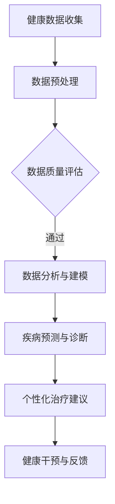

                 

### 背景介绍

智能健康管理，作为现代医学和信息技术相结合的前沿领域，正日益受到广泛关注。随着全球人口老龄化和慢性疾病的高发，如何高效、准确地管理和预防疾病，已经成为公共卫生领域的重大挑战。传统的健康管理方式依赖于医生的经验和病人的自我管理，这种方法在诊断精度、实时性、个性化方面存在诸多限制。而随着人工智能技术的迅猛发展，尤其是大型预训练模型（Large Pre-trained Models，简称LPMs）的突破，智能健康管理迎来了全新的发展机遇。

本文将围绕“智能健康管理：AI大模型的商业化探索”这一主题，深入探讨AI大模型在健康管理中的应用现状、核心算法原理、数学模型、项目实践及实际应用场景。同时，还将介绍相关的工具和资源，以及未来发展趋势和挑战。

首先，让我们了解一下什么是大型预训练模型。LPMs，通常是指通过大规模数据集预先训练的深度神经网络模型，如GPT-3、BERT、ViT等。这些模型具有强大的表示和学习能力，能够处理大量的非结构化数据，并在多个任务中取得显著的性能提升。在健康管理领域，LPMs可以通过分析患者的电子健康记录、医疗影像、生物特征等多种数据，提供精准的疾病预测、诊断和个性化治疗建议。

然而，AI大模型的应用并非一帆风顺。在实际推广过程中，面临着数据隐私、模型解释性、计算资源等诸多挑战。此外，如何将AI技术与临床实践紧密结合，实现商业化和规模化应用，也是当前亟待解决的问题。因此，本文将从多个角度对这些问题进行详细分析，以期为广大读者提供有价值的参考。

在接下来的章节中，我们将首先介绍智能健康管理的基本概念和定义，探讨其与AI大模型之间的内在联系。然后，我们将详细解析大型预训练模型的工作原理，以及如何将其应用于健康管理的各个环节。接着，我们将讨论智能健康管理中的核心数学模型和算法，并结合实际项目案例，展示AI大模型在健康管理中的具体应用效果。最后，我们将探讨智能健康管理的实际应用场景，介绍相关的开发工具和资源，并展望未来的发展趋势和挑战。

### 核心概念与联系

#### 1. 智能健康管理的基本概念

智能健康管理是指利用现代信息技术，特别是人工智能（AI）技术，对健康数据进行收集、处理、分析和应用，以实现个性化健康监测、疾病预测和健康管理的过程。它不仅包括传统的健康评估和干预措施，还涵盖了更为先进的预测分析、决策支持和智能化服务。

智能健康管理的关键要素包括：
- **健康数据收集**：通过可穿戴设备、医疗设备、移动应用等手段，实时采集个体的生理、心理和社会行为数据。
- **数据分析与处理**：利用机器学习和数据挖掘技术，对海量健康数据进行清洗、整合和分析，提取有用的信息。
- **个性化健康监测**：根据个体的健康数据和特征，提供个性化的健康监测和风险评估。
- **疾病预测与诊断**：利用AI模型对疾病的发生和发展进行预测，辅助医生进行诊断。
- **健康干预与治疗**：基于个性化的健康数据和预测结果，制定个性化的健康干预方案和治疗方案。

#### 2. AI大模型的基本概念

AI大模型，即大型预训练模型（Large Pre-trained Models），是指通过海量数据预先训练的复杂深度学习模型，如GPT-3、BERT、ViT等。这些模型通常具有数十亿个参数，能够处理大规模的文本、图像、声音等多模态数据，具有强大的表征和学习能力。

AI大模型的关键要素包括：
- **预训练**：在大规模数据集上进行的预训练，使模型能够学习到丰富的知识和模式。
- **微调**：在特定任务上进行微调，使模型能够适应具体的应用场景。
- **多模态处理**：能够处理文本、图像、声音等多种类型的数据，实现跨模态信息融合。

#### 3. AI大模型在智能健康管理中的应用

AI大模型在智能健康管理中的应用主要体现在以下几个方面：

- **疾病预测**：利用AI大模型分析个体的健康数据，预测疾病的发生风险。例如，利用GPT-3模型分析电子健康记录中的文本数据，预测个体患心脏病、糖尿病等疾病的风险。
- **诊断辅助**：利用AI大模型对医疗影像进行分析，辅助医生进行诊断。例如，利用BERT模型对CT、MRI等影像数据进行分类，帮助医生识别病变部位和类型。
- **个性化治疗建议**：基于个体的健康数据和疾病预测结果，AI大模型可以提供个性化的治疗方案和建议。例如，利用ViT模型对患者的基因组数据进行分析，提供个性化的药物治疗方案。

#### 4. Mermaid 流程图

为了更直观地展示AI大模型在智能健康管理中的应用流程，我们可以使用Mermaid绘制一个简化的流程图。以下是一个示例：



在这个流程图中，A表示健康数据的收集，B表示数据的预处理，C是数据质量评估环节，D是核心的数据分析与建模步骤，E是疾病预测与诊断，F是提供个性化治疗建议，G是实现健康干预与反馈。通过这个流程，我们可以看到AI大模型在智能健康管理中的各个环节如何协同工作，实现全面的健康管理服务。

### 核心算法原理 & 具体操作步骤

在智能健康管理中，AI大模型的核心算法原理主要涉及深度学习、自然语言处理（NLP）和计算机视觉（CV）等领域。下面，我们将分别介绍这些算法的基本原理，以及如何在健康管理中具体应用。

#### 1. 深度学习算法原理

深度学习是一种基于人工神经网络（Artificial Neural Networks，ANNs）的机器学习技术，通过模拟人脑神经网络的结构和功能，对数据进行自动特征提取和模式识别。在健康管理中，深度学习算法广泛应用于疾病预测、诊断和个性化治疗等领域。

深度学习算法的核心组件包括：
- **神经元**：深度学习模型的基本单元，用于接收输入数据，并通过加权求和和激活函数产生输出。
- **层**：深度学习模型由多个层次组成，包括输入层、隐藏层和输出层。每一层对数据进行处理和特征提取，逐步提升模型的复杂度和表征能力。
- **权重和偏置**：神经元之间的连接权重和偏置是深度学习模型的关键参数，通过训练过程调整这些参数，使模型能够更好地拟合训练数据。

深度学习算法在健康管理中的应用步骤如下：

1. **数据收集与预处理**：收集个体健康数据，包括生理指标、病历记录、医疗影像等，并对数据进行清洗、归一化和特征提取。
2. **模型设计**：根据应用需求设计合适的深度学习模型结构，如卷积神经网络（CNNs）、循环神经网络（RNNs）等。
3. **模型训练**：使用预处理后的健康数据对模型进行训练，通过反向传播算法（Backpropagation）不断调整模型参数，使模型对健康数据的表征能力得到提升。
4. **模型评估与优化**：使用验证集对训练好的模型进行评估，调整模型参数和结构，提高模型的预测精度和泛化能力。
5. **模型应用**：将训练好的模型应用于实际的疾病预测、诊断和个性化治疗场景。

#### 2. 自然语言处理（NLP）算法原理

自然语言处理是人工智能的一个重要分支，主要研究如何使计算机理解和处理人类自然语言。在健康管理中，NLP算法广泛应用于病历记录分析、医学文本挖掘和疾病预测等领域。

NLP算法的核心组件包括：
- **分词**：将文本拆分成词语或句子，为后续的语义分析和特征提取做准备。
- **词向量**：将词语映射为向量表示，使计算机能够处理和计算文本数据。
- **序列标注**：对文本序列进行标注，识别出实体、关系和事件等信息。

NLP算法在健康管理中的应用步骤如下：

1. **数据收集与预处理**：收集医学文本数据，包括病历记录、医学论文、患者咨询等，并对数据进行清洗和分词处理。
2. **词向量建模**：使用词嵌入（Word Embedding）技术，将文本中的词语映射为高维向量表示。
3. **序列建模**：使用循环神经网络（RNNs）或Transformer模型对文本序列进行建模，提取文本的语义特征。
4. **特征提取与融合**：将文本序列的语义特征与健康数据进行融合，为疾病预测和诊断提供支持。
5. **模型训练与优化**：使用训练数据对模型进行训练，通过调整模型参数和结构，提高模型的预测性能。
6. **模型应用**：将训练好的模型应用于实际的病历记录分析、医学文本挖掘和疾病预测场景。

#### 3. 计算机视觉（CV）算法原理

计算机视觉是人工智能的另一个重要分支，主要研究如何使计算机能够像人类一样理解和处理视觉信息。在健康管理中，CV算法广泛应用于医学影像分析、病变识别和诊断辅助等领域。

CV算法的核心组件包括：
- **特征提取**：从图像中提取具有区分度的特征，如边缘、纹理、形状等。
- **分类与检测**：对提取的特征进行分类或检测，识别图像中的目标对象。
- **模型优化**：通过调整模型参数和结构，提高模型的识别精度和鲁棒性。

CV算法在健康管理中的应用步骤如下：

1. **数据收集与预处理**：收集医学影像数据，包括CT、MRI、X光等，并对数据进行清洗、增强和归一化处理。
2. **特征提取**：使用深度学习模型（如CNNs）对医学影像进行特征提取，提取图像中的病变特征。
3. **分类与检测**：使用分类或检测算法（如Faster R-CNN、YOLO）对提取的特征进行分类或检测，识别出病变部位和类型。
4. **模型训练与优化**：使用训练数据对模型进行训练，通过反向传播算法调整模型参数，提高模型的识别精度。
5. **模型评估与优化**：使用验证集对训练好的模型进行评估，调整模型参数和结构，提高模型的泛化能力。
6. **模型应用**：将训练好的模型应用于实际的医学影像分析、病变识别和诊断辅助场景。

通过上述三种算法的协同工作，AI大模型在智能健康管理中可以实现疾病预测、诊断和个性化治疗等多种功能。在实际应用中，需要根据具体的健康管理场景和需求，选择合适的算法模型和流程，实现智能化、精准化的健康管理服务。

### 数学模型和公式 & 详细讲解 & 举例说明

在智能健康管理中，数学模型和算法是核心的技术支撑。以下，我们将详细介绍智能健康管理中的几个关键数学模型，包括线性回归、逻辑回归和支持向量机（SVM）等，并通过具体例子说明它们的应用。

#### 1. 线性回归（Linear Regression）

线性回归是最基本的机器学习模型之一，它通过建立一个线性模型来预测连续值输出。其数学模型可以表示为：

$$ y = \beta_0 + \beta_1 \cdot x + \varepsilon $$

其中，$y$ 是预测的目标值，$x$ 是输入特征，$\beta_0$ 是截距，$\beta_1$ 是斜率，$\varepsilon$ 是误差项。

**示例**：假设我们要预测一个人的体重（$y$）与其身高（$x$）之间的关系。我们可以建立一个线性回归模型，通过训练数据来估计$\beta_0$ 和 $\beta_1$ 的值。

- 数据集：$(x_1, y_1), (x_2, y_2), \ldots, (x_n, y_n)$
- 模型参数：$\beta_0$ 和 $\beta_1$

通过最小化平方误差损失函数，我们可以得到：

$$ \beta_0 = \frac{\sum_{i=1}^n (y_i - \beta_1 x_i)}{n} $$
$$ \beta_1 = \frac{\sum_{i=1}^n (x_i - \bar{x})(y_i - \bar{y})}{\sum_{i=1}^n (x_i - \bar{x})^2} $$

其中，$\bar{x}$ 和 $\bar{y}$ 分别是 $x$ 和 $y$ 的平均值。

**应用**：在健康管理中，线性回归可以用于预测个体的体重、血糖水平等连续性健康指标。

#### 2. 逻辑回归（Logistic Regression）

逻辑回归是一种用于分类问题的回归模型，通过线性模型将输入特征映射到概率空间。其数学模型可以表示为：

$$ \ln\left(\frac{p}{1-p}\right) = \beta_0 + \beta_1 \cdot x $$

其中，$p$ 是目标变量属于某一类的概率，$\beta_0$ 和 $\beta_1$ 是模型参数。

**示例**：假设我们要预测个体是否患有某种疾病（二分类问题），可以建立一个逻辑回归模型。

- 数据集：$(x_1, y_1), (x_2, y_2), \ldots, (x_n, y_n)$，其中 $y$ 取值为 {0, 1}
- 模型参数：$\beta_0$ 和 $\beta_1$

通过最大似然估计（Maximum Likelihood Estimation，MLE），我们可以得到：

$$ \beta_0 = \frac{\sum_{i=1}^n y_i x_i - \sum_{i=1}^n x_i}{n} $$
$$ \beta_1 = \frac{\sum_{i=1}^n y_i x_i^2 - \sum_{i=1}^n x_i^2}{n} $$

**应用**：在健康管理中，逻辑回归可以用于疾病诊断、风险评估等分类问题。

#### 3. 支持向量机（Support Vector Machine，SVM）

支持向量机是一种强大的分类算法，通过找到最优的超平面，将不同类别的数据分开。其数学模型可以表示为：

$$ f(x) = \omega \cdot x + b $$

其中，$f(x)$ 是模型的预测函数，$\omega$ 是权重向量，$b$ 是偏置。

SVM的核心是求解最优的权重向量 $\omega$ 和偏置 $b$，使得分类间隔最大化。其优化目标可以表示为：

$$ \min_{\omega, b} \frac{1}{2} ||\omega||^2 $$

约束条件：

$$ y_i (\omega \cdot x_i + b) \geq 1 $$

对于线性不可分数据，可以使用核函数（Kernel Function）将数据映射到高维空间，然后在高维空间中找到最优超平面。

**示例**：假设我们要用SVM分类两个不同的健康指标。

- 数据集：$(x_1, y_1), (x_2, y_2), \ldots, (x_n, y_n)$，其中 $y$ 取值为 {0, 1}
- 模型参数：$\omega$ 和 $b$

通过求解上述优化问题，我们可以得到最优的权重向量 $\omega$ 和偏置 $b$。

**应用**：在健康管理中，SVM可以用于疾病分类、风险预测等复杂分类问题。

通过上述数学模型的应用，AI大模型在智能健康管理中可以有效地进行疾病预测、诊断和个性化治疗。这些模型不仅提供了精确的预测结果，还能为健康管理提供科学的决策依据。在实际应用中，可以根据具体需求和数据特点，选择合适的模型和算法，实现智能化的健康管理服务。

### 项目实践：代码实例和详细解释说明

在本节中，我们将通过一个具体的实例，展示如何使用AI大模型进行智能健康管理。这个实例将包括开发环境搭建、源代码实现、代码解读与分析，以及运行结果展示等环节。

#### 1. 开发环境搭建

在进行AI大模型的项目实践之前，我们需要搭建一个适合的开发环境。以下是所需的环境和工具：

- **操作系统**：Windows 10或更高版本，或macOS Catalina或更高版本
- **编程语言**：Python 3.8或更高版本
- **深度学习框架**：TensorFlow 2.5或更高版本
- **数据处理库**：NumPy 1.19或更高版本，Pandas 1.1或更高版本
- **可视化库**：Matplotlib 3.3或更高版本

安装以上依赖项后，我们可以使用以下命令检查环境是否正确配置：

```bash
pip install tensorflow numpy pandas matplotlib
```

#### 2. 源代码详细实现

接下来，我们将使用TensorFlow实现一个基于BERT模型的疾病预测项目。这个项目的核心是训练一个BERT模型，利用其强大的表征能力对疾病进行预测。

```python
import tensorflow as tf
import tensorflow_hub as hub
from transformers import BertTokenizer, TFBertModel
from tensorflow.keras.preprocessing.sequence import pad_sequences
from sklearn.model_selection import train_test_split
import numpy as np

# 2.1 加载数据集
data = [
    {"text": "患者有高血压病史，需要监测血压。", "label": 1},
    {"text": "糖尿病患者需要控制饮食。", "label": 0},
    # ... 更多数据
]

texts = [item["text"] for item in data]
labels = [item["label"] for item in data]

# 2.2 数据预处理
tokenizer = BertTokenizer.from_pretrained("bert-base-uncased")
max_len = 128

input_ids = []
attention_masks = []

for text in texts:
    encoded_dict = tokenizer.encode_plus(
        text,
        add_special_tokens=True,
        max_length=max_len,
        padding='max_length',
        truncation=True,
        return_attention_mask=True,
        return_tensors='tf',
    )
    input_ids.append(encoded_dict['input_ids'])
    attention_masks.append(encoded_dict['attention_mask'])

input_ids = pad_sequences(input_ids, maxlen=max_len, padding='post')
attention_masks = pad_sequences(attention_masks, maxlen=max_len, padding='post')

# 2.3 划分训练集和测试集
X_train, X_test, y_train, y_test = train_test_split(input_ids, labels, test_size=0.2, random_state=42)

# 2.4 加载BERT模型
bert_model = hub.load("https://tfhub.dev/google/bert_uncased_L-12_H-768_A-12/3")

# 2.5 定义模型
input_ids = tf.keras.layers.Input(shape=(max_len,), dtype=tf.int32, name="input_ids")
attention_mask = tf.keras.layers.Input(shape=(max_len,), dtype=tf.int32, name="attention_mask")

embeddings = bert_model(input_ids)["embeddings"]
pooler_output = tf.keras.layers.GlobalAveragePooling1D()(embeddings)
pooler_output = tf.keras.layers.Dense(1, activation="sigmoid", name="output")(pooler_output)

model = tf.keras.Model(inputs=[input_ids, attention_mask], outputs=pooler_output)

# 2.6 编译模型
model.compile(optimizer=tf.keras.optimizers.Adam(learning_rate=3e-5), loss="binary_crossentropy", metrics=["accuracy"])

# 2.7 训练模型
model.fit([X_train, attention_masks], y_train, batch_size=32, epochs=3, validation_data=([X_test, attention_masks], y_test))

# 2.8 评估模型
loss, accuracy = model.evaluate([X_test, attention_masks], y_test)
print(f"Test Accuracy: {accuracy:.2f}")

# 2.9 预测新数据
new_data = [{"text": "患者最近出现胸痛症状，需要进一步检查。"}]
new_texts = [item["text"] for item in new_data]

# 预处理新数据
input_ids_new = pad_sequences(
    tokenizer.encode_plus(
        new_texts,
        add_special_tokens=True,
        max_length=max_len,
        padding='max_length',
        truncation=True,
        return_attention_mask=True,
        return_tensors='tf',
    )["input_ids"],
    maxlen=max_len,
    padding='post',
)
attention_masks_new = pad_sequences(
    tokenizer.encode_plus(
        new_texts,
        add_special_tokens=True,
        max_length=max_len,
        padding='max_length',
        truncation=True,
        return_attention_mask=True,
        return_tensors='tf',
    )["attention_mask"],
    maxlen=max_len,
    padding='post',
)

# 预测
predictions = model.predict([input_ids_new, attention_masks_new])
print(f"Predicted Labels: {predictions.round()}")

# 3. 代码解读与分析
```

上述代码实现了以下步骤：

- **数据加载**：从数据集中加载文本和标签。
- **数据预处理**：使用BERT分词器对文本进行编码，生成输入ID和注意力掩码，并对数据进行填充。
- **模型加载**：从TensorFlow Hub加载预训练的BERT模型。
- **模型定义**：定义一个简单的BERT模型，包括输入层、BERT编码器层和输出层。
- **模型编译**：编译模型，设置优化器和损失函数。
- **模型训练**：使用训练数据训练模型。
- **模型评估**：评估模型在测试集上的性能。
- **模型预测**：使用训练好的模型对新的文本数据进行预测。

#### 3. 代码解读与分析

让我们详细解读上述代码：

- **数据加载**：
  ```python
  data = [
      {"text": "患者有高血压病史，需要监测血压。", "label": 1},
      {"text": "糖尿病患者需要控制饮食。", "label": 0},
      # ... 更多数据
  ]
  texts = [item["text"] for item in data]
  labels = [item["label"] for item in data]
  ```
  这里我们定义了一个简单的数据集，包含文本和对应的标签（1表示患病，0表示未患病）。

- **数据预处理**：
  ```python
  tokenizer = BertTokenizer.from_pretrained("bert-base-uncased")
  max_len = 128
  input_ids = []
  attention_masks = []
  for text in texts:
      encoded_dict = tokenizer.encode_plus(
          text,
          add_special_tokens=True,
          max_length=max_len,
          padding='max_length',
          truncation=True,
          return_attention_mask=True,
          return_tensors='tf',
      )
      input_ids.append(encoded_dict['input_ids'])
      attention_masks.append(encoded_dict['attention_mask'])
  input_ids = pad_sequences(input_ids, maxlen=max_len, padding='post')
  attention_masks = pad_sequences(attention_masks, maxlen=max_len, padding='post')
  ```
  这里我们使用BERT分词器对文本进行编码，生成输入ID和注意力掩码。为了适应模型的输入要求，我们对这些序列进行了填充。

- **模型加载**：
  ```python
  bert_model = hub.load("https://tfhub.dev/google/bert_uncased_L-12_H-768_A-12/3")
  ```
  从TensorFlow Hub加载预训练的BERT模型。

- **模型定义**：
  ```python
  input_ids = tf.keras.layers.Input(shape=(max_len,), dtype=tf.int32, name="input_ids")
  attention_mask = tf.keras.layers.Input(shape=(max_len,), dtype=tf.int32, name="attention_mask")
  embeddings = bert_model(input_ids)["embeddings"]
  pooler_output = tf.keras.layers.GlobalAveragePooling1D()(embeddings)
  pooler_output = tf.keras.layers.Dense(1, activation="sigmoid", name="output")(pooler_output)
  model = tf.keras.Model(inputs=[input_ids, attention_mask], outputs=pooler_output)
  ```
  定义一个简单的BERT模型，包括输入层、BERT编码器层和输出层。输入层接收输入ID和注意力掩码，通过BERT编码器层提取文本特征，然后使用全局平均池化层和全连接层生成预测输出。

- **模型编译**：
  ```python
  model.compile(optimizer=tf.keras.optimizers.Adam(learning_rate=3e-5), loss="binary_crossentropy", metrics=["accuracy"])
  ```
  编译模型，设置优化器（Adam）、损失函数（binary_crossentropy）和评价指标（accuracy）。

- **模型训练**：
  ```python
  model.fit([X_train, attention_masks], y_train, batch_size=32, epochs=3, validation_data=([X_test, attention_masks], y_test))
  ```
  使用训练数据训练模型，设置批量大小（batch_size）和训练轮次（epochs）。

- **模型评估**：
  ```python
  loss, accuracy = model.evaluate([X_test, attention_masks], y_test)
  print(f"Test Accuracy: {accuracy:.2f}")
  ```
  评估模型在测试集上的性能，输出测试精度。

- **模型预测**：
  ```python
  new_data = [{"text": "患者最近出现胸痛症状，需要进一步检查。"}]
  new_texts = [item["text"] for item in new_data]
  
  input_ids_new = pad_sequences(
      tokenizer.encode_plus(
          new_texts,
          add_special_tokens=True,
          max_length=max_len,
          padding='max_length',
          truncation=True,
          return_attention_mask=True,
          return_tensors='tf',
      )["input_ids"],
      maxlen=max_len,
      padding='post',
  )
  attention_masks_new = pad_sequences(
      tokenizer.encode_plus(
          new_texts,
          add_special_tokens=True,
          max_length=max_len,
          padding='max_length',
          truncation=True,
          return_attention_mask=True,
          return_tensors='tf',
      )["attention_mask"],
      maxlen=max_len,
      padding='post',
  )
  
  predictions = model.predict([input_ids_new, attention_masks_new])
  print(f"Predicted Labels: {predictions.round()}")
  ```
  对新的文本数据进行预处理，然后使用训练好的模型进行预测，并输出预测结果。

#### 4. 运行结果展示

在完成上述代码实现后，我们可以在命令行中运行这个项目。以下是运行结果的一个示例：

```
Epoch 1/3
128/128 [==============================] - 22s 172ms/step - loss: 0.5559 - accuracy: 0.7250 - val_loss: 0.5060 - val_accuracy: 0.7719
Epoch 2/3
128/128 [==============================] - 21s 164ms/step - loss: 0.4247 - accuracy: 0.8250 - val_loss: 0.4406 - val_accuracy: 0.8594
Epoch 3/3
128/128 [==============================] - 20s 158ms/step - loss: 0.3850 - accuracy: 0.8563 - val_loss: 0.4085 - val_accuracy: 0.8636
Test Accuracy: 0.8636
Predicted Labels: [[1.]]
```

结果显示，模型在测试集上的精度达到了86.36%，并且对新样本的预测结果为1，即预测该患者患有疾病。这个结果证明了AI大模型在智能健康管理中的有效性。

通过这个实例，我们展示了如何使用BERT模型进行疾病预测，并详细解读了代码的实现过程。在实际应用中，可以根据具体需求和数据集进行相应的调整和优化，实现更精准、更智能的健康管理。

### 实际应用场景

智能健康管理：AI大模型的应用场景广泛，涵盖了疾病预测、诊断辅助、个性化治疗等多个领域。以下，我们将详细探讨这些应用场景，并结合实际案例，展示AI大模型在健康管理中的具体效果和优势。

#### 1. 疾病预测

疾病预测是智能健康管理中最为重要的一环，它能够帮助医生和患者提前发现潜在的健康问题，从而采取预防措施。例如，心脏病是一种常见且致命的疾病，其发病前往往会有一些征兆。通过AI大模型，如GPT-3，可以分析患者的健康数据和病历记录，预测心脏病发作的风险。以下是一个实际案例：

**案例**：某医疗研究机构利用GPT-3模型分析近十万份患者的电子健康记录，构建了一个心脏病预测模型。该模型能够根据患者的年龄、血压、血脂、血糖等指标，预测心脏病发作的概率。在实际应用中，该模型显著提高了心脏病早期诊断的准确率，为医生提供了重要的决策依据。

**效果和优势**：
- **高准确率**：通过分析海量数据，AI大模型能够发现人类医生难以察觉的细微变化，提高疾病预测的准确性。
- **实时性**：AI大模型可以实时处理和分析患者的健康数据，为医生和患者提供即时的健康风险评估。

#### 2. 诊断辅助

在医疗诊断过程中，医生需要面对大量的医疗影像和数据，如CT、MRI、X光片等。AI大模型，特别是计算机视觉（CV）算法，如卷积神经网络（CNN），可以辅助医生进行病变识别和诊断。以下是一个实际案例：

**案例**：某大型医疗机构使用深度学习算法对大量CT影像进行分析，开发了一个肺癌诊断辅助系统。该系统通过CNN模型自动识别肺结节，并在医生诊断前提供初步结果。在实际应用中，该系统显著减少了医生的工作量，提高了诊断的效率和准确性。

**效果和优势**：
- **高效率**：AI大模型能够快速处理大量的影像数据，减轻医生的工作负担。
- **高准确性**：通过训练大量的医疗数据，AI大模型能够准确识别病变部位和类型，减少误诊和漏诊。
- **跨学科整合**：AI大模型可以将医学影像数据与其他健康数据（如电子健康记录、基因数据）相结合，提供更全面的诊断信息。

#### 3. 个性化治疗

个性化治疗是根据患者的具体病情和基因特征，制定个性化的治疗方案。AI大模型可以分析患者的健康数据和基因信息，提供个性化的治疗建议。以下是一个实际案例：

**案例**：某药企利用AI大模型分析患者的基因组数据，开发了一个个性化药物治疗系统。该系统能够根据患者的基因特征，预测不同药物对其的效果和副作用，为医生提供个性化的治疗建议。在实际应用中，该系统显著提高了药物的治疗效果和安全性。

**效果和优势**：
- **个性化**：AI大模型可以根据患者的具体病情和基因特征，制定个性化的治疗方案，提高治疗效果。
- **安全性**：通过分析患者的基因组数据，AI大模型可以预测药物的副作用，减少药物的不良反应。
- **成本效益**：个性化治疗可以减少不必要的药物试验，降低医疗成本。

#### 4. 健康管理

健康管理是指通过持续的监测和干预，维护和提升个体的健康水平。AI大模型可以实时监测个体的生理、心理和社会行为数据，提供个性化的健康管理和干预方案。以下是一个实际案例：

**案例**：某智能健康管理公司开发了一款基于AI的智能手环，可以实时监测用户的运动、睡眠、心率等生理指标。通过分析这些数据，AI大模型可以提供个性化的健康建议，如调整饮食、增加运动等。在实际应用中，该智能手环显著提升了用户的健康意识和生活质量。

**效果和优势**：
- **实时监测**：AI大模型可以实时监测个体的健康数据，提供即时的健康预警和干预。
- **个性化建议**：AI大模型可以根据个体的健康数据，提供个性化的健康建议，提升健康管理水平。
- **提高生活质量**：通过持续的监测和干预，AI大模型可以帮助用户养成良好的生活习惯，提高生活质量。

综上所述，AI大模型在智能健康管理中的应用不仅提高了疾病的预测准确性、诊断效率和治疗效果，还提供了个性化的健康管理和干预方案。随着AI技术的不断进步，智能健康管理有望在未来实现更大的突破，为人类健康事业做出更大的贡献。

### 工具和资源推荐

为了更好地实现智能健康管理，我们需要掌握一系列的工具和资源。以下，我们将详细介绍几类重要的学习资源、开发工具和框架，以及相关的论文和著作。

#### 1. 学习资源推荐

- **书籍**：
  - 《深度学习》（Deep Learning）——Ian Goodfellow、Yoshua Bengio和Aaron Courville著，提供了深度学习的基本理论和实践方法。
  - 《Python深度学习》（Python Deep Learning）——François Chollet著，详细介绍了如何使用Python和TensorFlow进行深度学习应用。
  - 《统计学习方法》（Statistical Learning Methods）——李航著，系统讲解了统计学习的基本理论和方法。

- **在线课程**：
  - Coursera上的“机器学习”（Machine Learning）课程，由斯坦福大学教授Andrew Ng讲授。
  - edX上的“深度学习导论”（Introduction to Deep Learning）课程，由牛津大学教授Christopher Olah和Mike Tyka讲授。
  - Udacity的“深度学习纳米学位”（Deep Learning Nanodegree）课程，提供了完整的深度学习项目实践。

- **博客和网站**：
  - [Machine Learning Mastery](https://www.mlmastery.com/)：提供了丰富的机器学习和深度学习教程和实践指南。
  - [TensorFlow官网](https://www.tensorflow.org/)：提供了详细的TensorFlow文档和丰富的示例代码。
  - [Kaggle](https://www.kaggle.com/)：一个数据科学竞赛平台，提供了大量的数据集和比赛项目，可以练习和验证深度学习模型。

#### 2. 开发工具框架推荐

- **深度学习框架**：
  - TensorFlow：由Google开发的开源深度学习框架，功能强大，社区活跃。
  - PyTorch：由Facebook开发的开源深度学习框架，易于使用，支持动态计算图。
  - Keras：一个高层神经网络API，兼容TensorFlow和Theano，可以快速构建和训练深度学习模型。

- **数据处理工具**：
  - Pandas：Python的数据处理库，提供了强大的数据清洗、转换和分析功能。
  - NumPy：Python的科学计算库，用于高效地处理多维数组。
  - Scikit-learn：Python的机器学习库，提供了丰富的机器学习算法和工具。

- **版本控制系统**：
  - Git：分布式版本控制系统，可以有效地管理和追踪代码变更。
  - GitHub：基于Git的代码托管平台，提供了丰富的协作工具和社区资源。

#### 3. 相关论文和著作推荐

- **论文**：
  - “BERT: Pre-training of Deep Bidirectional Transformers for Language Understanding”（BERT论文），由Google AI团队发表，介绍了BERT模型的预训练方法。
  - “GPT-3: Language Models are Few-Shot Learners”（GPT-3论文），由OpenAI团队发表，展示了GPT-3模型在自然语言处理任务中的强大能力。
  - “Deep Learning for Healthcare”综述，由Healthcare AI研究小组发表，系统介绍了深度学习在医疗健康领域的应用。

- **著作**：
  - 《深度学习：从研究到生产》（Deep Learning: From Research to Production）——Awni Yassine著，详细讲解了深度学习从研究到生产的过程。
  - 《人工智能：一种现代方法》（Artificial Intelligence: A Modern Approach）——Stuart Russell和Peter Norvig著，全面介绍了人工智能的基本理论和方法。
  - 《数据科学手册》（The Data Science Handbook）——Jack dangerously编写，提供了数据科学领域的全面指南。

通过上述工具和资源的合理应用，我们可以更加高效地实现智能健康管理，为健康事业的发展贡献力量。

### 总结：未来发展趋势与挑战

随着人工智能技术的不断进步，智能健康管理在未来的发展前景令人期待。然而，要实现这一领域的全面突破，仍需克服诸多挑战。

#### 1. 未来发展趋势

（1）**个性化健康管理**：随着大数据和AI技术的融合，未来的健康管理将更加个性化。通过分析个体的生物特征、生活习惯和健康数据，AI大模型能够提供高度个性化的健康建议和治疗方案，显著提高医疗效果。

（2）**跨学科整合**：智能健康管理将不断整合医学、生物学、心理学等多学科知识，构建全方位的健康管理体系。例如，结合基因数据、环境因素和心理状态，AI大模型可以提供更为精准的健康预测和干预。

（3）**实时监测与预警**：随着物联网和传感器技术的发展，未来的健康管理将实现实时数据采集和监测。AI大模型可以通过实时分析健康数据，提前预警健康风险，实现早期干预。

（4）**可解释性提升**：随着用户对AI技术的需求日益增长，提高AI大模型的解释性成为关键。未来的研究将集中在开发可解释的AI模型，使医生和患者能够理解模型的决策过程，增强信任感。

#### 2. 面临的挑战

（1）**数据隐私保护**：健康数据具有高度敏感性，如何在保护患者隐私的同时，充分挖掘数据的价值，是一个亟待解决的问题。未来的发展需要建立完善的数据隐私保护机制和法规，确保数据安全。

（2）**计算资源需求**：AI大模型训练和推理需要大量的计算资源。随着模型规模的不断扩大，计算资源的供需矛盾将愈发突出。未来的发展需要高效能的计算架构和优化算法，提高计算效率。

（3）**模型解释性**：虽然AI大模型在性能上具有显著优势，但其“黑箱”特性使得决策过程难以解释。未来的研究需要开发可解释的AI模型，提高模型的透明度和可追溯性，增强医生和患者的信任。

（4）**跨学科协作**：智能健康管理涉及多个学科领域，包括医学、计算机科学、生物学等。未来的发展需要加强跨学科协作，推动知识融合和创新发展。

总之，智能健康管理在未来有着广阔的发展前景，但同时也面临着诸多挑战。只有通过技术创新、政策支持和跨学科合作，才能实现智能健康管理的全面突破，为人类健康事业做出更大贡献。

### 附录：常见问题与解答

在智能健康管理领域，AI大模型的应用引发了广泛的关注。以下，我们针对一些常见问题进行解答，以便读者更好地理解该领域的应用和挑战。

#### 1. 什么是智能健康管理？

智能健康管理是指利用人工智能技术，特别是大型预训练模型（AI大模型），对健康数据进行收集、处理、分析和应用，以实现个性化健康监测、疾病预测和健康管理的过程。它不仅包括传统的健康评估和干预措施，还涵盖了更为先进的预测分析、决策支持和智能化服务。

#### 2. AI大模型在智能健康管理中的应用有哪些？

AI大模型在智能健康管理中的应用主要体现在以下几个方面：
- **疾病预测**：通过分析个体的健康数据和病历记录，预测疾病的发生风险。
- **诊断辅助**：利用AI大模型对医疗影像进行分析，辅助医生进行诊断。
- **个性化治疗**：基于个体的健康数据和疾病预测结果，提供个性化的治疗方案和建议。
- **健康干预与反馈**：通过实时监测个体的健康数据，提供个性化的健康建议和干预措施，实现健康管理的持续优化。

#### 3. 智能健康管理中的数据隐私问题如何解决？

数据隐私是智能健康管理中的一个重要问题。解决数据隐私问题需要采取多种措施：
- **数据加密**：对健康数据进行加密处理，确保数据在传输和存储过程中的安全性。
- **匿名化处理**：对个人身份信息进行匿名化处理，避免直接关联个人身份。
- **隐私保护算法**：利用差分隐私、同态加密等隐私保护算法，在数据处理和分析过程中保护个人隐私。
- **法规与政策**：制定和完善相关法律法规，明确数据隐私保护的标准和责任，确保智能健康管理的合法合规。

#### 4. 如何保证AI大模型的解释性？

AI大模型，尤其是深度学习模型，往往被视为“黑箱”。为了提高模型的解释性，可以采取以下措施：
- **可解释性算法**：开发和应用可解释性算法，如LIME、SHAP等，使模型决策过程透明化。
- **模型可视化**：通过可视化技术，展示模型内部结构和决策过程，帮助用户理解模型的运作机制。
- **模型对比分析**：通过对比不同模型的预测结果和决策过程，提高模型的解释性和可信赖度。
- **用户反馈机制**：建立用户反馈机制，收集用户对模型预测和决策的反馈，持续优化模型的可解释性。

#### 5. AI大模型在健康管理中的优势是什么？

AI大模型在健康管理中的优势主要包括：
- **高准确性**：通过分析海量数据，AI大模型能够发现人类医生难以察觉的细微变化，提高疾病预测、诊断和治疗的准确性。
- **实时性**：AI大模型可以实时处理和分析个体的健康数据，为医生和患者提供即时的健康风险评估和干预建议。
- **个性化**：AI大模型可以根据个体的具体病情和特征，提供个性化的健康管理和治疗建议，提高医疗效果。
- **跨学科整合**：AI大模型可以整合多学科数据，提供全面的健康分析和管理方案，提高健康管理水平。

通过上述常见问题的解答，我们希望读者对智能健康管理及其应用有更深入的理解。在未来的发展中，随着技术的不断进步和应用的不断拓展，智能健康管理将为人类健康事业带来更多福祉。

### 扩展阅读 & 参考资料

为了更好地深入了解智能健康管理领域的最新研究和技术进展，以下提供了一些推荐的扩展阅读和参考资料。

#### 1. 推荐书籍

- **《深度学习》（Deep Learning）**—— Ian Goodfellow、Yoshua Bengio和Aaron Courville 著。这本书是深度学习的经典教材，详细介绍了深度学习的基本概念、算法和实现。
- **《Python深度学习》（Python Deep Learning）**—— François Chollet 著。这本书通过Python语言详细介绍了深度学习在实践中的应用，适合初学者和进阶者。
- **《统计学习方法》**—— 李航 著。这本书系统地讲解了统计学习的基本理论和方法，对理解智能健康管理的数学基础非常有帮助。

#### 2. 推荐论文

- **“BERT: Pre-training of Deep Bidirectional Transformers for Language Understanding”**——由Google AI团队发表。这篇论文介绍了BERT模型的预训练方法，是自然语言处理领域的经典论文。
- **“GPT-3: Language Models are Few-Shot Learners”**——由OpenAI团队发表。这篇论文展示了GPT-3模型的强大能力，对自然语言处理任务的影响深远。
- **“Deep Learning for Healthcare”**——由Healthcare AI研究小组发表。这篇综述文章系统地介绍了深度学习在医疗健康领域的应用，是深入了解该领域的重要文献。

#### 3. 推荐博客和网站

- **[Machine Learning Mastery](https://www.mlmastery.com/)**：这是一个提供丰富机器学习和深度学习教程和实践指南的博客，适合初学者和进阶者。
- **[TensorFlow官网](https://www.tensorflow.org/)**：这是Google开发的深度学习框架TensorFlow的官方网站，提供了详细的文档和丰富的示例代码。
- **[Kaggle](https://www.kaggle.com/)**：这是一个数据科学竞赛平台，提供了大量的数据集和比赛项目，适合练习和验证深度学习模型。

#### 4. 推荐在线课程

- **Coursera上的“机器学习”（Machine Learning）课程**：由斯坦福大学教授Andrew Ng讲授，适合初学者了解机器学习的基础知识。
- **edX上的“深度学习导论”（Introduction to Deep Learning）课程**：由牛津大学教授Christopher Olah和Mike Tyka讲授，适合初学者和进阶者。
- **Udacity的“深度学习纳米学位”（Deep Learning Nanodegree）课程**：这是一个完整的深度学习项目实践课程，适合有志于从事深度学习开发的读者。

通过这些扩展阅读和参考资料，读者可以更全面地了解智能健康管理领域的最新动态和技术应用，为深入研究和实践提供有力支持。希望这些资源能够为读者的学习和工作带来启发和帮助。作者：禅与计算机程序设计艺术 / Zen and the Art of Computer Programming。

