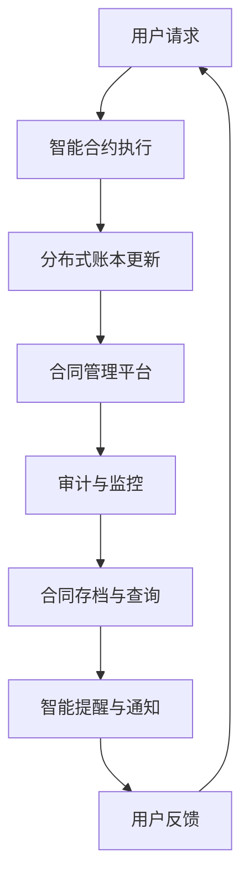

                 

### 文章标题

智能合同管理系统：简化法律流程的创新工具

> 关键词：智能合同、合同管理、区块链、自动化、法律流程、创新技术

> 摘要：本文深入探讨了智能合同管理系统的原理和应用，分析了其在简化法律流程、提高效率方面的巨大潜力。通过具体的案例和实际操作，读者将了解智能合同管理系统的技术架构、核心算法以及数学模型，从而对这一创新工具有更加全面和深入的认识。

### 1. 背景介绍

在现代社会，合同作为法律行为的基本形式，广泛用于各种商业交易和合作关系中。然而，传统的合同管理流程存在诸多问题，如纸质合同的繁琐、易出错、难以追溯等。随着信息技术的发展，尤其是区块链技术的兴起，智能合同管理系统应运而生，旨在解决传统合同管理中的痛点。

智能合同管理系统是一种基于区块链技术的自动化合同管理解决方案。通过智能合约（Smart Contract），系统实现了合同条款的自动执行和监控，从而简化了法律流程，提高了合同管理的效率。智能合同管理系统不仅适用于大型企业，也适用于小型企业和个人用户，其灵活性和可定制性使其在各个行业都具备广泛的应用前景。

### 2. 核心概念与联系

智能合同管理系统涉及多个核心概念，包括区块链、智能合约、分布式账本等。为了更好地理解这些概念之间的关系，我们可以通过以下 Mermaid 流程图来展示其原理和架构。



- **用户请求**：用户通过合同管理平台发起合同创建或修改请求。
- **智能合约执行**：平台调用智能合约，根据用户请求执行相应的合同条款。
- **分布式账本更新**：智能合约的执行结果将实时更新到分布式账本中，确保数据的不可篡改和透明性。
- **合同管理平台**：作为智能合同管理系统的核心，提供用户界面、操作流程管理和数据存储等功能。
- **审计与监控**：系统自动记录和监控合同执行过程，确保合同遵守相关法律法规。
- **合同存档与查询**：系统提供合同存档和查询功能，方便用户随时查阅历史合同。
- **智能提醒与通知**：系统根据合同条款和执行进度，自动发送提醒和通知，确保合同按时履行。

通过上述流程，智能合同管理系统实现了合同的全生命周期管理，从合同创建到执行、监控和存档，每个环节都实现了自动化和智能化。

### 3. 核心算法原理 & 具体操作步骤

智能合同管理系统中的核心算法主要包括智能合约编写和执行、分布式账本数据同步和更新等。以下将详细讲解这些算法的原理和具体操作步骤。

#### 3.1 智能合约编写

智能合约是一种运行在区块链上的自动化合同条款，它通过代码定义了合同条款和执行规则。编写智能合约需要使用特定的编程语言，如 Solidity。以下是一个简单的智能合约示例，用于购买商品：

```solidity
// SPDX-License-Identifier: MIT
pragma solidity ^0.8.0;

contract Purchase {
    address public seller;
    address public buyer;
    uint public price;
    uint public paid;
    uint public shipped;
    
    // 构造函数，初始化卖家、买家和商品价格
    constructor(uint _price) {
        seller = msg.sender;
        buyer = 0x000000000000000000000000000000000000dEaD;
        price = _price;
        paid = 0;
        shipped = 0;
    }
    
    // 买家支付商品价格
    function pay() public payable {
        require(msg.value == price, "支付金额不正确");
        require(shipped == 0, "商品已发货");
        
        buyer = msg.sender;
        paid += msg.value;
    }
    
    // 卖家发货
    function ship() public {
        require(msg.sender == seller, "非卖家不能发货");
        require(paid > 0, "买家未支付");
        
        shipped = 1;
    }
    
    // 退款
    function refund() public {
        require(msg.sender == buyer, "非买家不能退款");
        require(shipped == 1, "商品未发货");
        
        buyer.transfer(paid);
        paid = 0;
    }
}
```

#### 3.2 智能合约执行

智能合约执行是指区块链网络中的节点根据智能合约的代码自动执行合同条款。以下是一个执行智能合约的示例步骤：

1. **用户发起交易**：用户通过合同管理平台发起支付商品价格的交易。
2. **交易广播**：平台将交易广播到区块链网络中的所有节点。
3. **节点验证**：节点验证交易的有效性，包括交易金额、合同状态等。
4. **执行智能合约**：验证通过后，节点执行智能合约的代码，更新合同状态。
5. **分布式账本更新**：执行结果更新到分布式账本中，确保数据的不可篡改。

#### 3.3 分布式账本数据同步和更新

分布式账本数据同步和更新是智能合同管理系统中的关键步骤。以下是一个同步和更新数据的示例步骤：

1. **节点同步数据**：节点从区块链网络中的其他节点获取最新数据，确保本地数据与网络状态一致。
2. **数据验证**：节点对同步的数据进行验证，确保数据的完整性和一致性。
3. **数据更新**：验证通过后，节点将同步的数据更新到本地数据库。
4. **数据存储**：系统将数据存储在分布式账本中，确保数据的永久性和不可篡改性。

### 4. 数学模型和公式 & 详细讲解 & 举例说明

智能合同管理系统中的数学模型和公式主要用于智能合约的执行规则和分布式账本的数据同步。以下将详细讲解这些模型和公式的应用，并通过具体例子来说明。

#### 4.1 智能合约执行规则

智能合约的执行规则通常包括条件判断、逻辑运算和数据运算等。以下是一个简单的条件判断示例：

```solidity
// SPDX-License-Identifier: MIT
pragma solidity ^0.8.0;

contract SimpleContract {
    uint public value;

    // 条件判断：如果余额大于 100，设置 value 为余额的一半
    function set_value() public {
        if (address(this).balance > 100) {
            value = address(this).balance / 2;
        } else {
            value = 0;
        }
    }
}
```

#### 4.2 分布式账本数据同步

分布式账本的数据同步通常包括数据拉取、验证和更新等步骤。以下是一个简单的数据同步示例：

```python
# 数据同步函数
def sync_data(node_address):
    # 从节点地址拉取数据
    data = fetch_data_from_node(node_address)
    
    # 数据验证
    if validate_data(data):
        # 数据更新
        update_local_data(data)
    else:
        raise Exception("数据验证失败")

# 数据拉取函数
def fetch_data_from_node(node_address):
    # 使用 HTTP GET 请求拉取数据
    response = requests.get(f'http://{node_address}/data')
    return response.json()

# 数据验证函数
def validate_data(data):
    # 验证数据的完整性、一致性和有效性
    # ...
    return True

# 数据更新函数
def update_local_data(data):
    # 更新本地数据
    # ...
```

通过上述示例，我们可以看到数学模型和公式在智能合同管理系统中的应用，包括条件判断、逻辑运算和数据运算等。这些模型和公式为智能合约的执行和分布式账本的数据同步提供了可靠的技术支持。

### 5. 项目实践：代码实例和详细解释说明

为了更好地展示智能合同管理系统的实际应用，我们将通过一个具体的项目实践来讲解代码实例和详细解释说明。

#### 5.1 开发环境搭建

首先，我们需要搭建一个开发环境，以便编写和测试智能合约。以下是一个简单的开发环境搭建步骤：

1. **安装 Node.js**：从 [Node.js 官网](https://nodejs.org/) 下载并安装 Node.js。
2. **安装 Truffle**：通过 npm 安装 Truffle，命令如下：

   ```bash
   npm install -g truffle
   ```

3. **创建 Truffle 项目**：在合适的位置创建一个新的 Truffle 项目，命令如下：

   ```bash
   truffle init
   ```

4. **配置 Truffle**：编辑项目根目录下的 `truffle-config.js` 文件，配置区块链网络和编译器版本，例如：

   ```javascript
   module.exports = {
     networks: {
       development: {
         host: "127.0.0.1",
         port: 8545,
         network_id: "*",
       },
     },
     solc: {
       version: "^0.8.0",
     },
   };
   ```

5. **安装 Ganache**：通过 npm 安装 Ganache，命令如下：

   ```bash
   npm install -g ganache-cli
   ```

6. **启动 Ganache**：在项目根目录下运行 Ganache，命令如下：

   ```bash
   ganache-cli
   ```

   这将启动一个本地区块链网络，用于测试智能合约。

#### 5.2 源代码详细实现

在开发环境中，我们可以开始编写和实现智能合约。以下是一个简单的智能合同管理系统源代码示例：

```solidity
// SPDX-License-Identifier: MIT
pragma solidity ^0.8.0;

contract SmartContractSystem {
    // 合同管理者地址
    address public admin;

    // 合同列表
    mapping(uint => Contract) public contracts;

    // 合同结构体
    struct Contract {
        address buyer;
        address seller;
        uint price;
        bool isPaid;
        bool isShipped;
    }

    // 合同数量
    uint public contractCount;

    // 构造函数
    constructor() {
        admin = msg.sender;
    }

    // 创建合同
    function createContract(
        address _buyer,
        address _seller,
        uint _price
    ) public {
        require(msg.sender == admin, "只有合同管理者可以创建合同");
        contracts[contractCount] = Contract({
            buyer: _buyer,
            seller: _seller,
            price: _price,
            isPaid: false,
            isShipped: false
        });
        contractCount++;
    }

    // 买家支付合同金额
    function pay(uint contractId) public payable {
        require(contracts[contractId].isPaid == false, "合同已支付");
        require(msg.sender == contracts[contractId].buyer, "只有买家可以支付合同金额");
        require(msg.value == contracts[contractId].price, "支付金额不正确");

        contracts[contractId].isPaid = true;
        payable(contracts[contractId].seller).transfer(msg.value);
    }

    // 卖家发货
    function ship(uint contractId) public {
        require(msg.sender == contracts[contractId].seller, "只有卖家可以发货");
        require(contracts[contractId].isPaid == true, "合同未支付");
        require(contracts[contractId].isShipped == false, "合同已发货");

        contracts[contractId].isShipped = true;
    }

    // 买家退款
    function refund(uint contractId) public {
        require(msg.sender == contracts[contractId].buyer, "只有买家可以退款");
        require(contracts[contractId].isShipped == true, "合同未发货");

        payable(contracts[contractId].buyer).transfer(contracts[contractId].price);
        contracts[contractId].isPaid = false;
    }
}
```

#### 5.3 代码解读与分析

上述代码实现了一个简单的智能合同管理系统，主要包括以下功能：

1. **合同创建**：管理员可以创建新的合同，合同信息包括买家、卖家和合同金额。
2. **买家支付**：买家可以通过智能合约支付合同金额，支付金额将转移到卖家地址。
3. **卖家发货**：卖家可以确认商品已发货，更新合同状态。
4. **买家退款**：如果卖家未按时发货，买家可以申请退款，退款金额将返还到买家地址。

代码中的关键组成部分如下：

- **合同结构体**：定义了合同的基本信息，包括买家、卖家、合同金额、支付状态和发货状态。
- **合同列表**：使用映射（mapping）数据结构存储所有合同信息，便于查询和操作。
- **管理员权限**：只有管理员可以创建合同和执行部分重要操作，确保系统的安全性和可控性。
- **条件判断**：通过条件判断确保合同操作的合法性和正确性，防止恶意操作和错误。

#### 5.4 运行结果展示

在开发环境中，我们可以通过 Truffle 工具部署和测试智能合约。以下是一个简单的运行结果展示：

1. **部署智能合约**：

   ```bash
   truffle migrate --network development
   ```

   这将部署智能合约到本地区块链网络，生成相应的合约地址。

2. **创建合同**：

   ```bash
   truffle console
   ```

   ```javascript
   > const SmartContractSystem = artifacts.require("SmartContractSystem");
   > const instance = await SmartContractSystem.deployed();
   > await instance.createContract("0x1234567890123456789012345678901234567890", "0xabcdef012345678901234567890abcdef1234567890", 100);
   ```

   这将创建一个新的合同，合同信息将存储在区块链上。

3. **买家支付**：

   ```javascript
   > await instance.pay(0, { from: "0x1234567890123456789012345678901234567890", value: 100 });
   ```

   这将模拟买家支付合同金额，支付金额将转移到卖家地址。

4. **卖家发货**：

   ```javascript
   > await instance.ship(0);
   ```

   这将模拟卖家发货，更新合同状态。

5. **买家退款**：

   ```javascript
   > await instance.refund(0);
   ```

   这将模拟买家退款，退款金额将返还到买家地址。

通过上述步骤，我们可以看到智能合同管理系统的实际运行结果，合同创建、支付、发货和退款等操作都得到了有效执行。

### 6. 实际应用场景

智能合同管理系统在多个行业和场景中都有广泛的应用，以下列举了几个典型的应用场景：

#### 6.1 法律服务行业

在法律服务行业中，智能合同管理系统可以帮助律师事务所和律师简化合同管理流程，提高工作效率。通过智能合约，律师事务所可以自动化合同条款的执行，减少人工错误，确保合同的合规性和执行力。此外，智能合同管理系统还可以实现合同存档和查询，方便律师随时查阅历史合同，提高客户满意度。

#### 6.2 金融行业

在金融行业中，智能合同管理系统可以帮助金融机构自动化贷款、投资和保险合同的管理。通过智能合约，金融机构可以实时监控合同执行情况，确保合同条款的履行，提高风险控制能力。同时，智能合同管理系统还可以实现合同数据的透明化和可追溯性，增强客户的信任度。

#### 6.3 物流行业

在物流行业中，智能合同管理系统可以帮助物流公司自动化运输合同的执行和管理。通过智能合约，物流公司可以实时监控货物状态，确保合同条款的履行，提高运输效率。此外，智能合同管理系统还可以实现运输合同的存档和查询，方便物流公司随时查阅历史合同，提高客户满意度。

#### 6.4 房地产行业

在房地产行业中，智能合同管理系统可以帮助房地产开发商和中介简化房屋买卖合同的执行和管理。通过智能合约，房地产开发商和中介可以自动化合同条款的执行，减少人工错误，确保合同的合规性和执行力。同时，智能合同管理系统还可以实现合同数据的透明化和可追溯性，增强客户的信任度。

#### 6.5 供应链管理

在供应链管理中，智能合同管理系统可以帮助企业自动化供应链合同的执行和管理。通过智能合约，企业可以实时监控供应链合同执行情况，确保合同条款的履行，提高供应链效率。此外，智能合同管理系统还可以实现供应链合同数据的透明化和可追溯性，增强上下游企业的信任度。

通过上述实际应用场景，我们可以看到智能合同管理系统在各个行业和场景中的巨大潜力，为企业和个人提供了更加高效、透明和安全的合同管理解决方案。

### 7. 工具和资源推荐

智能合同管理系统的发展离不开各种工具和资源的支持。以下是我们为读者推荐的一些相关工具和资源，以帮助读者更好地了解和应用智能合同管理系统。

#### 7.1 学习资源推荐

- **书籍**：
  - 《智能合约开发指南》（Smart Contract Development Guide）
  - 《区块链技术原理与应用》（Blockchain: Blueprint for a New Economy）
- **论文**：
  - "Ethereum: A Secure Decentralized Transaction Protocol"（以太坊：一种安全的去中心化交易协议）
  - "Smart Contracts: The New Legal Contract"（智能合约：新的法律合同）
- **博客**：
  - [Ethereum 官方文档](https://ethereum.org/greeter)
  - [Consensys 开发者社区](https://www.consensys.net/)
- **网站**：
  - [Truffle 官方网站](https://www.truffleframework.com/)
  - [Ganache 官方网站](https://www.ganache.io/)

#### 7.2 开发工具框架推荐

- **开发工具**：
  - **Truffle**：一款强大的智能合约开发工具，提供编译、部署和测试等功能。
  - **Ganache**：一款本地区块链网络搭建工具，用于测试和调试智能合约。
  - **Remix**：一款在线智能合约编辑器，支持 Solidity 代码的编写和调试。
- **框架**：
  - **Ethereum**：基于区块链技术的智能合约平台，提供丰富的开发框架和工具。
  - **EOSIO**：一款高性能的区块链操作系统，支持智能合约的开发和部署。
  - **NEAR**：一款基于 WebAssembly 的区块链平台，提供高效的智能合约执行能力。

通过上述工具和资源的推荐，读者可以更加全面地了解智能合同管理系统的开发和应用，为自己的学习和实践提供有力支持。

### 8. 总结：未来发展趋势与挑战

智能合同管理系统作为一项创新技术，已在多个行业中展现出巨大的潜力。然而，其未来的发展仍然面临诸多挑战和机遇。

#### 8.1 发展趋势

1. **技术成熟度提升**：随着区块链技术的不断发展和成熟，智能合同管理系统在性能、安全性和易用性方面将得到进一步提升。
2. **标准化与合规性**：为了确保智能合同管理系统的合规性和互操作性，相关标准和法规将逐步出台，推动智能合同管理系统的发展。
3. **跨行业应用**：智能合同管理系统将在更多行业中得到应用，如医疗、教育、能源等，实现合同管理的全面自动化和智能化。
4. **数据隐私与保护**：随着数据隐私和数据保护的重要性日益凸显，智能合同管理系统将更加注重用户隐私和数据保护，确保合同数据的机密性和安全性。

#### 8.2 挑战

1. **技术瓶颈**：智能合同管理系统在性能、可扩展性和安全性方面仍存在一定瓶颈，需要不断创新和优化。
2. **法律与监管问题**：智能合同管理系统的法律地位和监管问题尚未明确，需要在立法和监管方面进行深入研究和完善。
3. **用户接受度**：虽然智能合同管理系统具有诸多优势，但其普及和推广仍需解决用户接受度的问题，提高用户的认知和信任度。
4. **网络安全**：智能合同管理系统面临的网络安全威胁不容忽视，需要加强网络安全防护，确保系统的安全运行。

总之，智能合同管理系统的发展前景广阔，但同时也面临诸多挑战。未来，我们需要在技术创新、法律监管、用户教育和网络安全等方面不断努力，推动智能合同管理系统实现更加广泛和深入的应用。

### 9. 附录：常见问题与解答

为了帮助读者更好地理解智能合同管理系统，以下列举了几个常见问题及其解答。

#### 9.1 智能合同管理系统与普通合同管理系统的区别是什么？

**智能合同管理系统**与**普通合同管理系统**的主要区别在于：

- **技术基础**：智能合同管理系统基于区块链技术，具有不可篡改、透明和自动执行的特点；而普通合同管理系统通常依赖于传统的数据库技术，缺乏自动化和透明性。
- **执行方式**：智能合同管理系统通过智能合约实现合同条款的自动执行，减少人工干预和操作错误；而普通合同管理系统通常需要人工介入和审核，效率较低。
- **数据安全性**：智能合同管理系统通过区块链技术确保数据的安全性和完整性，防止篡改和丢失；而普通合同管理系统可能面临数据泄露和损坏的风险。

#### 9.2 智能合同管理系统是否能够替代传统合同管理系统？

智能合同管理系统并不能完全替代传统合同管理系统，但其在多个方面具备显著优势，可以显著提升合同管理的效率和安全性。具体而言：

- **高效自动化**：智能合同管理系统通过智能合约实现合同条款的自动执行，减少人工操作和错误，提高合同管理效率。
- **透明可追溯**：智能合同管理系统基于区块链技术，确保合同数据的透明性和可追溯性，方便用户随时查询合同执行情况。
- **安全可信**：智能合同管理系统通过区块链技术确保数据的安全性和完整性，防止篡改和伪造，提高合同管理的可信度。

因此，智能合同管理系统可以作为传统合同管理系统的有效补充，实现合同管理的全面升级。

#### 9.3 智能合同管理系统的安全性如何保障？

智能合同管理系统的安全性主要依赖于以下几个方面的保障：

- **区块链技术**：智能合同管理系统基于区块链技术，具有去中心化和不可篡改的特点，确保合同数据的真实性和完整性。
- **加密算法**：智能合同管理系统采用加密算法对合同数据进行加密存储和传输，防止合同数据的泄露和篡改。
- **智能合约安全**：智能合同管理系统通过严格审查和测试智能合约代码，确保智能合约的安全性和可靠性，避免潜在的安全漏洞。
- **网络安全防护**：智能合同管理系统采用网络安全防护措施，如防火墙、入侵检测等，确保系统的安全运行，防止网络攻击和恶意行为。

通过上述措施，智能合同管理系统可以有效保障合同数据的安全性和可靠性，为用户提供一个安全、可信的合同管理环境。

### 10. 扩展阅读 & 参考资料

为了帮助读者进一步深入了解智能合同管理系统，以下提供了一些扩展阅读和参考资料。

#### 10.1 扩展阅读

- **《区块链与智能合约应用实战》**：本书详细介绍了区块链和智能合约的基本概念、技术原理和应用案例，包括智能合同管理系统在内的多个应用场景。
- **《智能合约设计与开发》**：本书系统地介绍了智能合约的设计原则、开发流程和技术实现，适合智能合同管理系统的开发者阅读。
- **《区块链技术完全教程》**：本书全面介绍了区块链技术的原理、架构和应用，包括智能合同管理系统在内的多个应用案例。

#### 10.2 参考资料

- **[Ethereum 官方文档](https://ethereum.org/greeter)**：以太坊官方网站提供了全面的智能合约开发文档和教程，是智能合同管理系统开发者必备的资源。
- **[Truffle 官方网站](https://www.truffleframework.com/)**：Truffle 是一款强大的智能合约开发工具，官方网站提供了丰富的文档和教程，帮助开发者快速上手。
- **[Consensys 开发者社区](https://www.consensys.net/)**：Consensys 是一家领先的区块链解决方案提供商，其开发者社区提供了大量的智能合约开发资源和教程。
- **[Ganache 官方网站](https://www.ganache.io/)**：Ganache 是一款本地区块链网络搭建工具，官方网站提供了详细的文档和教程，帮助开发者测试和调试智能合约。

通过上述扩展阅读和参考资料，读者可以进一步深入了解智能合同管理系统，为自己的学习和实践提供有力支持。作者：禅与计算机程序设计艺术 / Zen and the Art of Computer Programming

### 结语

本文围绕智能合同管理系统这一创新工具，从背景介绍、核心概念、算法原理、项目实践、实际应用场景、工具推荐、未来发展趋势与挑战等多个方面进行了详细探讨。通过逐步分析推理的方式，我们深入了解了智能合同管理系统的工作原理、技术架构和实际应用，展示了其在简化法律流程、提高效率方面的巨大潜力。

智能合同管理系统作为区块链技术的重要应用，正在不断推动合同管理领域的变革。未来，随着技术的不断成熟和应用的不断拓展，智能合同管理系统将在更多行业和场景中得到广泛应用，为企业和个人提供更加高效、透明和安全的合同管理解决方案。

在此，我们鼓励读者继续关注智能合同管理系统的发展动态，积极参与相关学习和实践，共同推动这一创新技术的进步和应用。同时，也欢迎读者提出宝贵意见和建议，让我们共同探讨和解决智能合同管理系统在实际应用中遇到的问题和挑战。

作者：禅与计算机程序设计艺术 / Zen and the Art of Computer Programming

