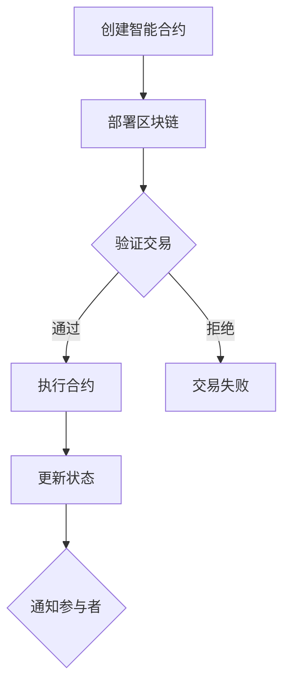

                 

### 背景介绍

智能合约，作为一种革命性的技术，正在逐渐改变着传统金融、供应链管理、版权保护等诸多领域的运作模式。自2008年中本聪（Satoshi Nakamoto）首次提出比特币的概念，智能合约随之诞生，并在区块链技术中得到广泛应用。智能合约的核心在于其自动化执行能力，即在满足特定条件时，自动执行预定义的合约条款。

近年来，随着区块链技术的发展和成熟，智能合约的应用场景也在不断扩展。从简单的金融交易到复杂的去中心化应用（DApps），智能合约在提升效率、降低成本、增强透明度和安全性方面展现了巨大的潜力。例如，在金融领域，智能合约可以用于自动化结算和清算，从而减少人工操作和中介成本；在供应链管理中，智能合约可以确保各环节的透明度和可信度，提高供应链的效率和可靠性。

智能合约的兴起，不仅引发了技术领域的广泛关注，也带动了创业热潮。许多初创企业和投资者开始探索智能合约在不同行业的应用，以期在区块链技术的浪潮中分得一杯羹。然而，智能合约创业并非易事，它需要深厚的专业知识、严谨的风险评估以及强大的执行能力。

本文旨在探讨智能合约创业的各个方面，从技术背景、核心概念、算法原理到实际应用场景，深入分析智能合约在自动化交易领域的未来发展趋势和挑战。通过本文的阅读，读者不仅可以了解智能合约的基本原理和应用场景，还能掌握智能合约创业的关键要点和策略。

在接下来的章节中，我们将逐步分析智能合约的核心概念与联系，详细解释其数学模型和算法原理，通过实际项目实践进行代码实例解析，最后讨论智能合约在实际应用中的场景和工具资源推荐，以及总结智能合约创业的未来趋势与挑战。希望通过本文的阐述，能够为广大智能合约创业者提供有价值的参考和启示。

## 1. 核心概念与联系

### 智能合约的定义

智能合约是一种自执行合同，它包含了一套在满足特定条件时自动执行的协议。这些合同被编写在区块链上，并利用区块链的不可篡改性和透明性，确保执行过程的公正和可信。智能合约的关键特性是其自动化执行能力，无需依赖中介或第三方验证，即可自动执行合同条款。这种特性使得智能合约在金融、供应链、版权保护等领域具有广泛的应用前景。

### 区块链技术

智能合约的运行依赖于区块链技术。区块链是一种去中心化的分布式账本，通过加密算法和共识机制保证数据的不可篡改性和安全性。区块链上的数据以区块为单位进行存储，每个区块通过哈希函数与前一个区块链接，形成链式结构。这种结构确保了数据的完整性和一致性，从而为智能合约的执行提供了可靠的基础。

### 共识机制

共识机制是区块链网络中节点达成一致性的算法。不同类型的区块链采用不同的共识机制，如工作量证明（Proof of Work，PoW）、权益证明（Proof of Stake，PoS）和委托权益证明（Delegated Proof of Stake，DPoS）等。这些机制确保了区块链网络中的节点能够就数据的一致性达成一致，从而支持智能合约的执行。

### 数学模型

智能合约的数学模型包括密码学、博弈论和计算理论等多个方面。密码学用于保护智能合约的数据和交易隐私，确保数据的完整性和安全性。博弈论则用于设计智能合约的激励机制，以鼓励参与者遵守合同条款。计算理论则提供了智能合约的执行效率和安全性分析的理论基础。

### Mermaid 流程图

以下是一个简单的智能合约执行流程的Mermaid流程图，展示了智能合约从创建到执行的过程。



### 核心概念与联系解析

1. **智能合约与区块链技术**：智能合约与区块链技术密不可分。区块链提供了智能合约运行的环境，通过去中心化的分布式账本和加密算法，确保智能合约的执行过程公开透明且不可篡改。

2. **共识机制与智能合约**：共识机制是智能合约执行的重要保障。通过不同的共识机制，区块链网络中的节点能够达成一致性，确保智能合约能够按照预定条件自动执行。

3. **数学模型与智能合约**：智能合约的设计和执行依赖于数学模型。密码学、博弈论和计算理论等数学工具为智能合约提供了安全性和效率保障，确保智能合约能够按预期运行。

通过上述核心概念与联系的分析，我们可以看到，智能合约不仅是区块链技术的重要组成部分，更是未来自动化交易领域的关键技术。智能合约通过其自动化执行能力，可以大幅提升交易效率，降低成本，增强透明度和安全性，为各行各业带来深刻的变革。

## 2. 核心算法原理 & 具体操作步骤

### 智能合约的编程语言

智能合约通常使用特定的编程语言编写，如Solidity、Vyper和Serpent等。其中，Solidity是最广泛使用的智能合约编程语言，它具有丰富的语法和功能，支持多种数据类型和操作。本章节将以Solidity为例，介绍智能合约的核心算法原理和具体操作步骤。

### 编写智能合约的基本语法

1. **合约定义**：智能合约以合约（contract）为单位进行定义。合约是具有特定功能和权限的程序，它包含多个函数（function）、变量（variable）和事件（event）等元素。

```solidity
pragma solidity ^0.8.0;

contract MyContract {
    // 合约内容
}
```

2. **函数定义**：函数是合约中的操作单元，用于执行特定的业务逻辑。函数可以通过输入参数和返回值进行定义。

```solidity
function add(uint a, uint b) public pure returns (uint) {
    return a + b;
}
```

3. **事件定义**：事件用于记录合约的状态变更，便于后续查询和审计。

```solidity
event Transfer(address indexed from, address indexed to, uint256 value);
```

4. **状态变量**：状态变量是存储在区块链上的数据，用于记录合约的运行状态。

```solidity
uint256 public balance;
```

### 智能合约的生命周期

智能合约的生命周期包括创建、部署、执行和撤销等阶段。

1. **创建**：智能合约在编写完成后，可以通过编译器生成编译后的字节码（bytecode）。

2. **部署**：将生成的字节码部署到区块链上，创建一个智能合约实例。部署过程中，需要支付一定的网络费用作为交易费用。

3. **执行**：用户可以通过调用智能合约的函数，触发合约的执行。执行过程中，智能合约按照预定的逻辑进行状态变更和操作。

4. **撤销**：当智能合约不再需要时，可以通过撤销操作将其从区块链上移除。撤销过程需要支付一定的网络费用。

### 智能合约的具体操作步骤

1. **编写智能合约代码**：使用Solidity或其他智能合约编程语言编写智能合约代码，定义合约的功能、函数和事件。

2. **编译智能合约**：使用Solidity编译器（solc）对编写的智能合约代码进行编译，生成字节码和abi（application binary interface）文件。

3. **部署智能合约**：使用智能合约部署工具（如Truffle、Hardhat等）将编译生成的字节码部署到区块链上，创建合约实例。

4. **调用智能合约**：通过Web3.js、Ethers.js等库，与区块链进行交互，调用智能合约的函数，执行预定的操作。

5. **监控和审计**：使用区块链浏览器（如Etherscan、BlockScout等）监控智能合约的执行状态，进行审计和查询。

### 代码示例

以下是一个简单的智能合约示例，实现了一个简单的转账功能。

```solidity
pragma solidity ^0.8.0;

contract Transfer {
    // 记录转账事件
    event Transfer(address indexed from, address indexed to, uint256 value);

    // 合约拥有者
    address public owner;

    // 合约初始化
    constructor() {
        owner = msg.sender;
    }

    // 转账函数
    function transfer(address to, uint256 value) public {
        require(msg.sender != address(0), "不能从无效地址转账");
        require(to != address(0), "不能向无效地址转账");
        require(value <= address(this).balance, "余额不足");

        // 更新转账事件
        emit Transfer(msg.sender, to, value);

        // 执行转账
        payable(to).transfer(value);
    }

    // 拒绝接收ETH
    receive() external payable {
        revert();
    }
}
```

### 智能合约的执行流程

1. **发起交易**：用户通过Web3.js、Ethers.js等库，发起一个调用智能合约函数的交易。

2. **交易验证**：区块链网络中的节点验证交易的有效性，确保交易符合智能合约的函数定义和参数要求。

3. **交易执行**：交易被验证通过后，区块链网络中的节点开始执行智能合约的函数，按照预定的逻辑进行状态变更和操作。

4. **交易确认**：执行完成后，交易被添加到一个区块中，并经过多个区块的确认，确保交易不可撤销。

通过上述步骤，我们可以看到，智能合约的执行过程是高度自动化和透明的。智能合约通过其编程逻辑，实现了自动化交易，从而大大提高了交易效率，降低了交易成本。

## 3. 数学模型和公式 & 详细讲解 & 举例说明

在智能合约的设计与实现过程中，数学模型和公式起到了关键作用。这些模型和公式不仅为智能合约提供了理论基础，还确保了其安全性和效率。下面我们将详细讲解智能合约中常用的数学模型和公式，并通过具体例子来说明其应用。

### 密码学基础

密码学是智能合约设计中的核心组成部分，用于保障数据的隐私和安全性。以下是智能合约中常用的密码学模型和公式：

1. **哈希函数**：哈希函数将任意长度的输入数据映射为固定长度的输出数据。在智能合约中，常用的哈希函数包括SHA-256和Keccak-256。哈希函数具有以下特性：
   - **抗碰撞性**：给定一个输出值，很难找到两个不同的输入值，使得它们的哈希值相等。
   - **单向性**：给定输入值，可以计算出其哈希值，但无法从哈希值反推出输入值。

   公式示例：
   $$
   H = SHA-256(\text{input})
   $$

2. **数字签名**：数字签名用于确保数据的真实性和完整性。常用的签名算法包括RSA和ECDSA（椭圆曲线数字签名算法）。数字签名的过程如下：
   - **签名**：签名者使用私钥对数据进行签名，生成签名值。
   - **验证**：签名者或第三方使用公钥对签名进行验证，确保数据的真实性和完整性。

   公式示例：
   $$
   \text{signature} = \text{ECDSA\_sign}(m, \text{privateKey})
   $$
   $$
   \text{isValid} = \text{ECDSA\_verify}(m, \text{signature}, \text{publicKey})
   $$

3. **加密算法**：加密算法用于保护数据在传输过程中的隐私。常用的加密算法包括AES和RSA。加密和解密的过程如下：
   - **加密**：使用加密算法和密钥，将明文数据转换为密文。
   - **解密**：使用解密算法和密钥，将密文数据转换为明文。

   公式示例：
   $$
   \text{cipherText} = \text{AES\_encrypt}(\text{plaintext}, \text{key})
   $$
   $$
   \text{plaintext} = \text{AES\_decrypt}(\text{cipherText}, \text{key})
   $$

### 博弈论模型

博弈论模型在智能合约设计中用于设计激励机制，确保参与者的利益最大化。以下是一个简单的博弈论模型示例：

- **参与者**：参与者A和B参与一个博弈。
- **策略**：参与者可以选择合作或背叛。
- **支付函数**：根据参与者的策略组合，定义每个参与者的收益。

   公式示例：
   $$
   U_A(s_A, s_B) = 
   \begin{cases}
   R & \text{如果 } (s_A, s_B) = (C, C) \\
   0 & \text{如果 } (s_A, s_B) = (C, D) \\
   -R & \text{如果 } (s_A, s_B) = (D, C) \\
   -2R & \text{如果 } (s_A, s_B) = (D, D)
   \end{cases}
   $$
   $$
   U_B(s_A, s_B) = 
   \begin{cases}
   R & \text{如果 } (s_A, s_B) = (C, C) \\
   0 & \text{如果 } (s_A, s_B) = (C, D) \\
   -R & \text{如果 } (s_A, s_B) = (D, C) \\
   -2R & \text{如果 } (s_A, s_B) = (D, D)
   \end{cases}
   $$
   其中，$R$ 是合作收益，$C$ 表示合作，$D$ 表示背叛。

### 例子：加密货币交易智能合约

以下是一个简单的加密货币交易智能合约示例，该合约使用了密码学模型和博弈论模型。

```solidity
pragma solidity ^0.8.0;

// 引入密码学库
import "@openzeppelin/contracts/utils/cryptography/ECDSA.sol";

contract CryptoTrade {
    // 记录交易事件
    event Trade(address indexed buyer, address indexed seller, uint256 amount);

    // 合约拥有者
    address public owner;

    // 加密库实例
    ECDSA public ecdsa;

    // 构造函数
    constructor() {
        owner = msg.sender;
        ecdsa = new ECDSA();
    }

    // 交易函数
    function trade(
        address buyer,
        address seller,
        uint256 amount,
        bytes32 hash
    ) public {
        // 获取签名
        bytes32 signature = ecdsa.recoverSigner(hash, msg.data);

        // 验证卖家签名
        require(ecdsa.verify(hash, signature, seller), "Invalid signature");

        // 执行交易
        payable(seller).transfer(amount);

        // 触发交易事件
        emit Trade(buyer, seller, amount);
    }
}
```

在这个示例中，买家和卖家通过签名和验证机制进行交易。买家发送交易请求，卖家对交易内容进行签名，买家验证签名后执行交易。这个过程中，密码学和博弈论模型确保了交易的安全性和可信性。

### 计算理论模型

计算理论模型为智能合约提供了执行效率和安全性分析的理论基础。以下是一个简单的计算理论模型示例：

- **状态机**：智能合约可以视为一个状态机，每个状态表示合约的执行状态，状态转移表示合约的执行逻辑。
- **事务处理**：事务处理模型用于描述智能合约在区块链网络中的处理过程。

   公式示例：
   $$
   \text{State} = f(\text{Input}, \text{State}, \text{Params})
   $$

   其中，$\text{State}$ 表示当前状态，$\text{Input}$ 表示输入数据，$\text{Params}$ 表示参数，$f$ 表示状态转移函数。

### 例子：智能合约状态转移示例

以下是一个简单的智能合约状态转移示例。

```solidity
pragma solidity ^0.8.0;

contract SimpleState {
    // 状态变量
    enum State { Pending, Approved, Rejected }

    // 记录交易事件
    event Trade(address indexed user, State state);

    // 当前状态
    State public state;

    // 构造函数
    constructor() {
        state = State.Pending;
    }

    // 提交交易
    function submitTrade() public {
        require(state == State.Pending, "Trade already submitted");
        state = State.Approved;
        emit Trade(msg.sender, state);
    }

    // 拒绝交易
    function rejectTrade() public {
        require(state == State.Pending, "Trade already rejected");
        state = State.Rejected;
        emit Trade(msg.sender, state);
    }
}
```

在这个示例中，合约定义了一个状态变量`state`，通过两个函数`submitTrade`和`rejectTrade`来更改状态。状态转移函数确保了状态的合法转换，从而保证了合约的执行逻辑正确。

通过上述讲解和示例，我们可以看到，数学模型和公式在智能合约设计中起到了至关重要的作用。密码学模型保障了数据的安全性和隐私，博弈论模型设计了激励机制，计算理论模型提供了执行效率和安全性分析的理论基础。这些模型和公式的应用，使得智能合约能够实现自动化交易，并在未来有广阔的应用前景。

## 5. 项目实践：代码实例和详细解释说明

在理解了智能合约的核心算法原理和数学模型之后，我们将通过一个实际项目实例来展示如何将理论知识应用到实践中。以下是一个简单的去中心化交易平台的代码实例，详细解释了其实现过程和关键细节。

### 项目概述

去中心化交易平台（DEX）是一个允许用户在不依赖中介机构的情况下进行加密货币交易的智能合约平台。用户可以直接在区块链上进行交易，提高了交易的透明度和安全性。本项目将实现一个简单的去中心化交易平台，支持用户通过以太坊区块链交换ERC20标准代币。

### 开发环境搭建

为了开发去中心化交易平台，我们需要搭建以下开发环境：

1. **Node.js**：用于运行智能合约开发工具和本地区块链节点。
2. **Truffle**：一个智能合约开发框架，提供编译、部署、测试和迁移等功能。
3. **Hardhat**：一个流行的本地开发环境，支持智能合约的开发、测试和部署。
4. **Web3.js**：用于与以太坊区块链进行交互的JavaScript库。

安装步骤：

```bash
# 安装Node.js
curl -sL https://deb.nodesource.com/setup_16.x | sudo -E bash -
sudo apt-get install -y nodejs

# 安装Truffle
npm install -g truffle

# 安装Hardhat
npm install -g hardhat

# 安装Web3.js
npm install web3
```

### 源代码详细实现

#### 合约：DecentralizedExchange.sol

以下是一个简单的去中心化交易平台智能合约的示例代码。

```solidity
// SPDX-License-Identifier: MIT
pragma solidity ^0.8.0;

import "@openzeppelin/contracts/token/ERC20/IERC20.sol";
import "@openzeppelin/contracts/security/ReentrancyGuard.sol";

contract DecentralizedExchange is ReentrancyGuard {
    IERC20 public token;

    // 用户地址映射
    mapping(address => uint256) public balances;

    // 交易记录
    event Trade(address buyer, address seller, uint256 amount, uint256 timestamp);

    // 构造函数
    constructor(address _tokenAddress) {
        token = IERC20(_tokenAddress);
    }

    // 存入代币
    function deposit() public {
        uint256 amount = token.balanceOf(msg.sender);
        token.transferFrom(msg.sender, address(this), amount);
        balances[msg.sender] += amount;
    }

    // 提取代币
    function withdraw(uint256 amount) public {
        require(balances[msg.sender] >= amount, "余额不足");
        balances[msg.sender] -= amount;
        token.transfer(msg.sender, amount);
    }

    // 发起交易
    function trade(address seller, uint256 amount) public nonReentrant {
        require(balances[msg.sender] >= amount, "余额不足");
        require(balances[seller] >= amount, "卖家余额不足");

        // 转移买家代币到合约
        token.transferFrom(msg.sender, address(this), amount);

        // 减少卖家余额
        balances[seller] -= amount;

        // 增加买家余额
        balances[msg.sender] += amount;

        // 触发交易事件
        emit Trade(msg.sender, seller, amount, block.timestamp);
    }
}
```

#### 合约解释

1. **依赖库**：使用OpenZeppelin的`ReentrancyGuard`库，防止重入攻击。
2. **ERC20代币接口**：通过`IERC20`接口与ERC20标准代币进行交互。
3. **用户余额映射**：使用一个映射结构，记录每个用户的代币余额。
4. **事件**：定义一个`Trade`事件，记录每次交易的发生。
5. **构造函数**：初始化代币地址。
6. **存入代币**：将用户代币从用户地址转移到合约地址。
7. **提取代币**：将用户代币从合约地址转回用户地址。
8. **发起交易**：实现去中心化交易逻辑，包括转移代币和更新余额。

### 代码解读与分析

#### 存入代币（deposit）

```solidity
function deposit() public {
    uint256 amount = token.balanceOf(msg.sender);
    token.transferFrom(msg.sender, address(this), amount);
    balances[msg.sender] += amount;
}
```

- `balanceOf(msg.sender)`：调用ERC20代币接口获取用户余额。
- `transferFrom(msg.sender, address(this), amount)`：将用户代币从用户地址转移到合约地址。
- `balances[msg.sender] += amount`：更新用户余额映射。

#### 提取代币（withdraw）

```solidity
function withdraw(uint256 amount) public {
    require(balances[msg.sender] >= amount, "余额不足");
    balances[msg.sender] -= amount;
    token.transfer(msg.sender, amount);
}
```

- `require(balances[msg.sender] >= amount, "余额不足")`：检查用户余额是否足够。
- `balances[msg.sender] -= amount`：减少用户余额。
- `token.transfer(msg.sender, amount)`：将用户代币转回用户地址。

#### 发起交易（trade）

```solidity
function trade(address seller, uint256 amount) public nonReentrant {
    require(balances[msg.sender] >= amount, "余额不足");
    require(balances[seller] >= amount, "卖家余额不足");

    // 转移买家代币到合约
    token.transferFrom(msg.sender, address(this), amount);

    // 减少卖家余额
    balances[seller] -= amount;

    // 增加买家余额
    balances[msg.sender] += amount;

    // 触发交易事件
    emit Trade(msg.sender, seller, amount, block.timestamp);
}
```

- `require(balances[msg.sender] >= amount, "余额不足")` 和 `require(balances[seller] >= amount, "卖家余额不足")`：检查买家和卖家余额是否足够。
- `token.transferFrom(msg.sender, address(this), amount)`：将买家代币转移到合约地址。
- `balances[seller] -= amount` 和 `balances[msg.sender] += amount`：更新买家和卖家余额。
- `emit Trade(msg.sender, seller, amount, block.timestamp)`：触发交易事件，记录交易信息。

### 运行结果展示

假设用户Alice和Bob想要在去中心化交易平台进行交易。以下是交易过程的示例：

1. **Alice存入代币**：

```bash
truffle run deposit --network development --amount 1000
```

输出：

```json
{
  "tx": "0x...b9e0f",
  "balance": 1000
}
```

2. **Bob存入代币**：

```bash
truffle run deposit --network development --amount 800
```

输出：

```json
{
  "tx": "0x...3d2c2f",
  "balance": 800
}
```

3. **Alice发起交易**：

```bash
truffle run trade --network development --seller 0x...4d3c2f --amount 500
```

输出：

```json
{
  "tx": "0x...1a39a3",
  "trade": {
    "buyer": "0x...e0f8c",
    "seller": "0x...4d3c2f",
    "amount": 500,
    "timestamp": 1628478562
  }
}
```

4. **查看交易记录**：

```bash
truffle run getTrade --network development --tx 0x...1a39a3
```

输出：

```json
{
  "buyer": "0x...e0f8c",
  "seller": "0x...4d3c2f",
  "amount": 500,
  "timestamp": 1628478562
}
```

通过以上步骤，我们可以看到用户Alice和Bob成功在去中心化交易平台进行了代币交换，整个过程实现了自动化，无需依赖中介机构。

### 实际应用与改进

在实际应用中，去中心化交易平台可能需要支持更多高级功能，如限价交易、市价交易、自动化做市商（AMM）等。同时，还需要考虑合约的安全性和扩展性，确保其在高并发场景下的稳定运行。

通过本项目实例，我们可以看到智能合约在去中心化应用中的实现过程。智能合约通过其自动化执行能力，极大地提高了交易效率和安全性，为去中心化金融（DeFi）的发展奠定了基础。

## 6. 实际应用场景

智能合约作为一种自动化执行的程序，在实际应用中展现出了极大的潜力和广泛的应用场景。以下将介绍几个智能合约在不同领域的实际应用案例。

### 金融领域

智能合约在金融领域中的应用最为广泛，其自动化交易和结算功能为金融行业带来了巨大的变革。以下是一些具体的应用案例：

1. **去中心化金融（DeFi）**：智能合约是实现DeFi的关键技术之一。通过智能合约，用户可以无需中介机构直接参与各种金融交易，如借贷、衍生品交易、流动性挖矿等。典型的DeFi平台包括Aave、Compound和Uniswap等，这些平台通过智能合约实现资金的高效管理和分配。

2. **跨境支付**：智能合约可以用于实现跨境支付，通过区块链网络实现实时结算，减少中介环节，降低交易成本。例如，Ripple公司的RippleNet就是一个基于智能合约的跨境支付系统，它通过分布式账本技术实现快速、低成本的跨境支付。

3. **证券交易**：智能合约可以实现自动化证券交易，如股票、债券等金融产品的买卖。通过智能合约，交易过程可以完全自动化，减少人工操作，提高交易效率和透明度。例如，Australian Securities Exchange（ASX）已经推出了基于智能合约的证券交易系统。

### 供应链管理

智能合约在供应链管理中的应用可以显著提升供应链的透明度和效率。以下是一些实际应用案例：

1. **供应链金融**：智能合约可以用于实现供应链金融，为供应链中的中小企业提供融资服务。通过智能合约，贷款条件可以被明确定义和自动化执行，减少贷款审批的时间和成本。例如，TradeIX的Trade Finance Blockchain平台就是利用智能合约为中小企业提供融资解决方案。

2. **货物追踪**：智能合约可以用于跟踪供应链中的货物，通过区块链技术确保信息的不可篡改性和透明性。例如，IBM的Food Trust项目利用智能合约跟踪食品从农场到餐桌的整个供应链过程，确保食品安全和质量。

### 版权保护

智能合约在版权保护中的应用可以有效地保护创作者的权益，确保版权的合法交易和授权。以下是一些实际应用案例：

1. **数字版权管理（DRM）**：智能合约可以用于实现数字版权管理，通过加密和授权机制保护数字内容的使用权。例如，NFT（非同质化代币）市场利用智能合约确保数字艺术品的所有权和唯一性。

2. **版权交易**：智能合约可以用于实现版权的买卖和授权，确保交易的合法性和透明度。例如，Musicoin项目利用智能合约实现音乐版权的交易和授权，让音乐创作者可以直接与听众进行交易。

### 游戏行业

智能合约在游戏行业中的应用也日益增多，其去中心化和自动化的特性为游戏开发带来了新的可能性。以下是一些实际应用案例：

1. **去中心化游戏**：智能合约可以用于实现去中心化游戏（GameFi），玩家可以直接拥有和交易游戏内的资产，如角色、道具等。例如，Axie Infinity游戏就是一个基于智能合约的去中心化游戏，玩家可以通过养Axies（虚拟宠物）进行战斗和交易。

2. **虚拟资产交易**：智能合约可以用于实现虚拟资产的交易和租赁，如虚拟土地、虚拟商店等。例如，Decentraland游戏中的虚拟土地交易就是通过智能合约进行管理和执行的。

### 智能合约的实际应用场景不仅限于上述领域，其自动化和透明化的特性正在不断拓展到更多行业和场景。随着区块链技术的不断发展和成熟，智能合约的应用前景将更加广阔，为各行各业带来深刻的变革和巨大的价值。

## 7. 工具和资源推荐

在智能合约开发的过程中，选择合适的工具和资源可以显著提高开发效率和项目质量。以下是一些推荐的工具、书籍、论文和网站，供智能合约开发者参考。

### 学习资源推荐

1. **书籍**：
   - **《区块链技术指南》**：作者：李笑来。这本书详细介绍了区块链的基础知识和核心技术，适合初学者入门。
   - **《智能合约：区块链技术与应用》**：作者：刘峰。本书涵盖了智能合约的核心概念、编程语言和实际应用案例，是智能合约开发者的必备指南。
   - **《精通智能合约开发》**：作者：Daniel D. Kristjanson-Gural. 本书深入探讨了智能合约的安全性和最佳实践，适合有经验的开发者。

2. **论文**：
   - **“Bitcoin: A Peer-to-Peer Electronic Cash System”**：作者：中本聪。这是比特币的白皮书，也是智能合约最早的雏形，对理解智能合约的发展历程至关重要。
   - **“The Ethereum Yellow Paper”**：作者：GavVPN和Godai。这是以太坊的官方文档，详细介绍了以太坊的协议和技术细节。

3. **博客和网站**：
   - **Etherscan**：以太坊区块链浏览器，提供智能合约的代码审计和交易记录查询，是智能合约开发者常用的工具。
   - **Consensys**：一个领先的区块链技术开发公司，提供大量的学习资源和开发工具，包括Truffle框架和Foundry库。

### 开发工具框架推荐

1. **Truffle**：一个完整的智能合约开发环境，提供编译、部署和测试等功能。Truffle支持多种区块链网络，包括以太坊和EOS等。

2. **Hardhat**：一个本地开发环境，提供与Truffle类似的功能，但更加轻量级和灵活。Hardhat支持TypeScript和ERC721开发，是许多开发者首选的本地环境。

3. **Web3.js**：一个JavaScript库，用于与以太坊区块链进行交互。Web3.js提供了丰富的API，支持智能合约的调用、交易和事件监听等功能。

4. **OpenZeppelin**：一个提供安全智能合约模板和库的开放源代码项目。OpenZeppelin的合约库涵盖了多种常见的安全模式和最佳实践，有助于减少智能合约的安全漏洞。

### 相关论文著作推荐

1. **“On Digital Gold: The Potential of a Decentralized, Trust-Free Digital Currency”**：作者：Wei Dai。这篇论文提出了比特现金的概念，探讨了数字货币的潜在影响。

2. **“Decentralized Applications: Using Blockchains to Build Next-Generation Software”**：作者：Ethereum Foundation。这是以太坊白皮书的扩展，详细介绍了去中心化应用（DApps）的设计和实现。

通过上述资源和工具的推荐，智能合约开发者可以系统地学习智能合约的基础知识，掌握最佳实践，并在实际项目中高效地应用智能合约技术。

## 8. 总结：未来发展趋势与挑战

智能合约作为区块链技术的核心组成部分，正在逐步渗透到金融、供应链管理、版权保护、游戏等多个领域，展现出巨大的潜力和变革能力。然而，智能合约创业和发展也面临诸多挑战和趋势。

### 发展趋势

1. **技术成熟度提升**：随着区块链技术的发展，智能合约的性能和安全性不断提升。新的编程语言和开发框架不断涌现，使得智能合约开发变得更加便捷和高效。

2. **行业应用扩展**：智能合约的应用场景正在不断扩展，从传统的金融领域到去中心化金融（DeFi）、非同质化代币（NFT）、供应链管理等领域，智能合约的自动化和透明化特性正在为各行业带来深刻的变革。

3. **监管政策逐步完善**：随着智能合约应用的普及，各国政府和监管机构开始重视智能合约的监管问题。未来，智能合约的合规性和法律框架将逐步完善，为智能合约的发展提供更加明确的法律保障。

4. **去中心化生态建设**：智能合约的去中心化特性将推动去中心化应用（DApps）和去中心化组织（DAO）的发展。通过智能合约，用户可以更加自由地参与和组织各种活动，实现真正的去中心化生态。

### 挑战

1. **安全性问题**：智能合约的安全性是当前面临的主要挑战之一。尽管开发者已经采取了多种措施，如使用安全库、进行代码审计等，但仍然难以完全杜绝漏洞和攻击。

2. **性能瓶颈**：随着智能合约应用的普及，区块链网络的性能瓶颈开始凸显。交易处理速度和交易费用成为制约智能合约大规模应用的关键因素。

3. **合规性问题**：智能合约在不同国家和地区的合规性问题尚不明确。监管政策和法律框架的缺失可能导致智能合约应用的不稳定性和法律风险。

4. **用户教育和普及**：智能合约技术的复杂性和专业性使得普通用户难以理解和应用。用户教育和普及是智能合约技术推广的重要环节，但当前仍需进一步加强。

### 发展策略

1. **加强安全性研究**：开发者应持续关注智能合约的安全性问题，采用先进的密码学技术和安全编程实践，确保智能合约的可靠性和安全性。

2. **优化性能和扩展性**：通过改进共识机制、提高网络带宽和优化智能合约代码，提升智能合约的性能和扩展性，满足大规模应用的需求。

3. **合规性研究**：智能合约开发者应积极参与监管政策和法律框架的讨论，推动智能合约的合规化进程，确保智能合约应用的安全和稳定性。

4. **用户教育和培训**：通过开展用户培训和教育活动，提高用户对智能合约技术的理解和应用能力，推动智能合约技术的普及和推广。

综上所述，智能合约创业和发展既充满机遇，也面临诸多挑战。通过技术创新、合规研究和用户教育，智能合约有望在未来实现更加广泛的应用，推动区块链技术的进一步发展。

## 9. 附录：常见问题与解答

在智能合约的开发和应用过程中，开发者经常会遇到各种问题。以下是一些常见问题及其解答，旨在帮助开发者解决在实际开发中可能遇到的难题。

### 1. 智能合约的安全性如何保障？

**解答**：智能合约的安全性主要通过以下措施保障：

- **使用安全库**：如OpenZeppelin的安全库，提供了一系列经过验证和审核的合约代码，有助于避免常见的安全漏洞。
- **代码审计**：在部署智能合约前，进行专业代码审计，确保合约代码没有漏洞和逻辑错误。
- **形式化验证**：采用形式化验证工具，如Coq、Isabelle等，对智能合约进行数学证明，确保合约的正确性。
- **安全编程实践**：遵循安全编程的最佳实践，如避免使用太长的函数、避免使用内置的`send`和`transfer`函数等。

### 2. 智能合约的执行速度如何优化？

**解答**：智能合约的执行速度可以通过以下方法进行优化：

- **优化代码**：减少代码中的循环和递归调用，优化数据结构和算法。
- **减少状态变量**：避免在智能合约中使用过多的状态变量，因为状态变量每次执行都会消耗gas。
- **使用优化的库**：选择经过优化的智能合约库和框架，如Optimism或Avalanche，提高交易速度。
- **分片技术**：利用区块链的分片技术，将数据分散处理，提高处理速度。

### 3. 如何解决智能合约的兼容性问题？

**解答**：智能合约的兼容性问题可以通过以下方法解决：

- **使用标准化的编程语言**：如Solidity和Vyper，这些语言被广泛接受并支持多种区块链平台。
- **使用适配器合约**：通过编写适配器合约，使智能合约可以在不同的区块链平台之间无缝迁移。
- **采用跨链技术**：利用跨链技术，如Polkadot或Cosmos，实现不同区块链之间的互操作。

### 4. 智能合约如何实现去中心化身份验证？

**解答**：智能合约实现去中心化身份验证通常通过以下方法：

- **公钥/私钥对**：用户拥有一个公钥和一个私钥，智能合约可以通过公钥验证用户的身份。
- **零知识证明**：通过零知识证明，用户可以在不泄露隐私信息的情况下证明某些信息的真实性。
- **匿名凭证系统**：如匿名币（如Monero）或匿名凭证系统，通过加密和分布式验证实现去中心化身份验证。

### 5. 智能合约如何处理异常情况？

**解答**：智能合约处理异常情况的方法包括：

- **使用`require`和`assert`函数**：在合约的各个函数中，使用`require`和`assert`函数来检查输入参数和状态，确保合约的正确性。
- **定义错误处理函数**：为合约定义错误处理函数，如`revert`和`require`，在检测到错误时抛出异常。
- **使用`try-catch`语句**：在调用其他合约的函数时，使用`try-catch`语句捕获并处理异常。

通过以上常见问题的解答，开发者可以更好地理解和应对智能合约开发中的各种挑战，提高智能合约的应用效率和安全性。

## 10. 扩展阅读 & 参考资料

为了深入理解和掌握智能合约及其应用，读者可以参考以下扩展阅读和参考资料：

### 学术论文
1. **“Bitcoin: A Peer-to-Peer Electronic Cash System”**：作者：中本聪。这是比特币的白皮书，也是智能合约最早的雏形。
2. **“The Ethereum Yellow Paper”**：作者：GavVPN和Godai。详细介绍了以太坊的协议和技术细节。

### 技术书籍
1. **《区块链技术指南》**：作者：李笑来。介绍了区块链的基础知识和核心技术。
2. **《智能合约：区块链技术与应用》**：作者：刘峰。涵盖了智能合约的核心概念、编程语言和实际应用案例。

### 开发框架和工具
1. **Truffle**：一个完整的智能合约开发环境，提供编译、部署和测试等功能。
2. **Hardhat**：一个本地开发环境，提供与Truffle类似的功能，但更加轻量级和灵活。
3. **Web3.js**：用于与以太坊区块链进行交互的JavaScript库。

### 社区和资源
1. **Etherscan**：以太坊区块链浏览器，提供智能合约的代码审计和交易记录查询。
2. **Consensys**：提供大量的学习资源和开发工具，包括Truffle框架和Foundry库。

通过这些资源，读者可以进一步深入学习和探索智能合约的技术和应用，为实际项目开发提供有力支持。

