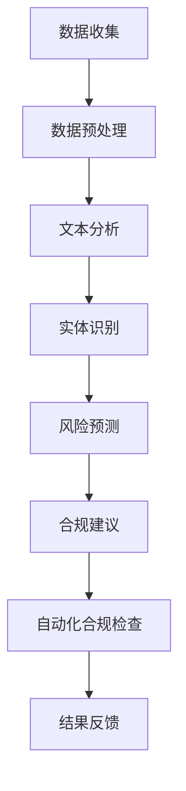

                 

### 1. 背景介绍

智能合规系统，作为人工智能与法律科技相结合的产物，正日益受到各界的关注。在当今高度复杂的商业环境中，企业面临着不断演变的法律和监管要求。为了确保业务运营符合法律法规，企业需要建立高效、可靠的合规体系。然而，传统的合规方法往往耗时耗力，难以应对快速变化的法律环境。此时，人工智能技术，特别是大模型的应用，为合规管理带来了全新的解决方案。

首先，让我们了解什么是智能合规系统。智能合规系统是指利用人工智能技术，如自然语言处理、机器学习和大数据分析，对企业的业务流程、文档和法律条文进行深度分析和理解，从而帮助企业快速、准确地识别合规风险，并采取相应措施。这种系统不仅提高了合规效率，还降低了合规成本，使得企业能够更好地适应不断变化的监管要求。

人工智能大模型在智能合规系统中的应用主要体现在以下几个方面：

1. **文本分析和理解**：大模型能够处理和理解大量法律文本，包括法律法规、合同、协议等，从而帮助企业快速识别和解析相关条款，确保业务合规。
2. **风险预测和预警**：通过对历史数据和实时数据的分析，大模型可以预测合规风险，并提前发出预警，帮助企业在风险发生前采取预防措施。
3. **合规建议和优化**：大模型可以根据企业的业务特点和合规需求，提供个性化的合规建议，优化合规流程，降低合规成本。
4. **自动化合规检查**：大模型可以自动化执行合规检查任务，如审核合同、检查报告等，提高合规工作的效率和准确性。

智能合规系统的出现，不仅为企业提供了强大的合规工具，还为整个法律科技领域带来了深远的影响。它不仅改变了合规管理的方式，还推动了法律行业与人工智能的深度融合，为未来的法律科技发展奠定了基础。

接下来，我们将进一步探讨智能合规系统的核心概念、算法原理、应用场景以及未来发展趋势和挑战。希望通过这一系列的深入探讨，能够帮助读者全面了解智能合规系统，并认识到其在法律科技中的重要价值。

### 2. 核心概念与联系

在深入探讨智能合规系统的核心概念之前，我们需要明确几个关键的概念，这些概念是构建智能合规系统的基础。

#### 2.1 自然语言处理（NLP）

自然语言处理（Natural Language Processing，NLP）是人工智能领域的一个重要分支，它旨在让计算机理解和处理人类自然语言。在智能合规系统中，NLP技术被广泛应用于文本分析、实体识别、情感分析和语义理解等任务。

- **文本分析**：文本分析是指对大量文本数据进行分析和处理，以提取有用的信息和模式。在智能合规系统中，文本分析可以帮助企业理解和处理法律法规、合同、协议等文本。
- **实体识别**：实体识别是指从文本中识别出特定的实体，如人名、地名、组织名等。在智能合规系统中，实体识别可以用于识别合同中的相关当事人，以及法律法规中的关键条款。
- **情感分析**：情感分析是指通过分析文本中的情感倾向，来判断文本的情感极性，如正面、负面或中性。在智能合规系统中，情感分析可以帮助企业评估合同或协议中的条款对双方的影响。
- **语义理解**：语义理解是指理解文本中的语义含义，包括句子的结构、上下文关系等。在智能合规系统中，语义理解可以用于深入分析法律文本，提取关键信息。

#### 2.2 机器学习（ML）

机器学习（Machine Learning，ML）是另一种重要的AI技术，它使计算机能够从数据中学习，并做出预测或决策。在智能合规系统中，机器学习被广泛应用于风险预测、合规建议和自动化合规检查等任务。

- **风险预测**：通过分析历史数据和实时数据，机器学习模型可以预测合规风险，并提前发出预警。例如，企业可以基于以往的法律诉讼记录，预测未来可能面临的合规风险。
- **合规建议**：机器学习模型可以根据企业的业务特点和合规需求，提供个性化的合规建议。例如，根据企业的历史交易数据和法律法规，机器学习模型可以建议企业如何调整合同条款以符合法律要求。
- **自动化合规检查**：机器学习模型可以自动化执行合规检查任务，如审核合同、检查报告等。通过训练模型识别合规规则，企业可以大幅提高合规检查的效率和准确性。

#### 2.3 大数据（Big Data）

大数据（Big Data）是指无法使用传统数据处理工具进行存储、管理和分析的数据集合。在智能合规系统中，大数据技术被用于处理和分析大量法律数据和业务数据。

- **数据收集**：通过自动化工具和API，企业可以收集大量的法律法规、合同、协议等文本数据。
- **数据存储**：大数据技术如Hadoop和Spark等，可以高效地存储和管理海量数据，确保数据的安全和可靠性。
- **数据挖掘**：通过数据挖掘技术，企业可以从大量数据中提取有用的信息和模式，用于合规分析和风险预测。

#### 2.4 Mermaid 流程图

为了更清晰地展示智能合规系统的核心概念和架构，我们可以使用Mermaid流程图来描述系统的整体运作流程。以下是智能合规系统的一个简化版Mermaid流程图：



在上述流程图中，数据收集模块负责收集法律法规、合同、协议等文本数据；数据预处理模块对原始数据进行清洗和格式化；文本分析模块利用NLP技术对文本进行深度分析；实体识别模块识别文本中的关键实体；风险预测模块使用机器学习技术预测合规风险；合规建议模块提供个性化的合规建议；自动化合规检查模块执行合规检查任务；结果反馈模块将合规检查结果反馈给企业，以便进行后续处理。

#### 2.5 关键联系

智能合规系统的核心概念和技术的相互联系，构成了一个完整的合规管理生态系统。以下是这些关键概念之间的联系：

- **NLP和ML的联系**：NLP为ML提供了丰富的文本数据，而ML则为NLP提供了强大的预测和分析能力。两者结合，使得智能合规系统能够更准确地理解和处理法律文本。
- **大数据和NLP的联系**：大数据为NLP提供了海量的文本数据，使得NLP技术能够处理更复杂和规模更大的法律问题。
- **ML和大数据的联系**：ML需要大量的历史数据来进行训练和预测，而大数据技术能够高效地存储和管理这些数据。
- **合规建议和自动化检查的联系**：合规建议模块提供的个性化合规建议，可以为自动化合规检查模块提供指导，从而提高合规检查的效率和准确性。

通过这些核心概念和技术的相互联系，智能合规系统不仅能够帮助企业快速识别合规风险，还能提供有效的合规建议和自动化检查，从而提高合规管理的效率和效果。

### 3. 核心算法原理 & 具体操作步骤

在智能合规系统中，核心算法的设计和实现是其有效运行的关键。以下是智能合规系统的核心算法原理及具体操作步骤。

#### 3.1 文本分析算法

文本分析是智能合规系统的第一步，旨在对大量法律文本进行深度分析和理解。以下是文本分析算法的原理和步骤：

1. **文本预处理**：文本预处理包括去除停用词、分词、词性标注等步骤。这一步骤的目的是将原始文本转换为计算机可以处理的格式。

    - **去除停用词**：停用词是指对文本理解没有意义的词汇，如“的”、“了”、“在”等。去除停用词可以减少无关信息的干扰。
    - **分词**：分词是将文本分割成一个个独立的词语。在中文文本中，分词是一个复杂的过程，需要考虑词语的搭配和上下文。
    - **词性标注**：词性标注是指对每个词进行词性分类，如名词、动词、形容词等。词性标注有助于理解文本的语义。

2. **实体识别**：实体识别是从文本中识别出特定的实体，如人名、地名、组织名等。实体识别的目的是提取文本中的关键信息。

    - **命名实体识别（NER）**：命名实体识别是一种常见的实体识别方法，它使用预训练的模型对文本进行分类，识别出人名、地名、组织名等实体。
    - **实体关系抽取**：实体关系抽取是指识别实体之间的关联关系，如“张三”和“某公司”之间的关系。这一步骤有助于深入理解文本的语义。

3. **语义分析**：语义分析是指理解文本中的语义含义，包括句子的结构、上下文关系等。语义分析的目的是提取文本中的关键信息。

    - **句法分析**：句法分析是指分析句子的结构，包括主语、谓语、宾语等成分。句法分析有助于理解句子的语义。
    - **语义角色标注**：语义角色标注是指标注句子中的每个成分的语义角色，如主语、谓语、宾语等。语义角色标注有助于提取文本中的关键信息。

#### 3.2 风险预测算法

风险预测是智能合规系统的核心功能之一，其目的是预测合规风险，并提前发出预警。以下是风险预测算法的原理和步骤：

1. **数据收集和预处理**：风险预测需要大量的历史数据和实时数据。数据收集和预处理包括以下步骤：

    - **数据收集**：通过自动化工具和API，收集企业的历史交易数据、合同数据、法律法规数据等。
    - **数据预处理**：对收集到的数据进行清洗、格式化和标准化，确保数据的质量和一致性。

2. **特征工程**：特征工程是指从原始数据中提取有用的特征，用于训练预测模型。特征工程包括以下步骤：

    - **数据转换**：将原始数据转换为适合模型训练的格式。
    - **特征选择**：选择对预测任务有显著影响的特征，去除无关或冗余的特征。
    - **特征缩放**：对特征进行缩放处理，使其具有相同的量纲和范围。

3. **模型训练和预测**：使用机器学习技术训练预测模型，并对实时数据进行预测。

    - **模型选择**：选择合适的机器学习模型，如逻辑回归、决策树、支持向量机等。
    - **模型训练**：使用历史数据训练模型，调整模型参数，使其达到最佳性能。
    - **模型预测**：使用训练好的模型对实时数据进行预测，预测合规风险。

4. **预警生成**：根据预测结果，生成合规预警信息，并通知相关人员和部门。

    - **风险等级划分**：根据预测结果的严重程度，划分风险等级。
    - **预警通知**：通过邮件、短信、系统消息等方式，通知相关人员和部门。

#### 3.3 合规建议算法

合规建议是智能合规系统的另一个重要功能，旨在根据企业的业务特点和合规需求，提供个性化的合规建议。以下是合规建议算法的原理和步骤：

1. **业务理解**：通过分析企业的业务流程、交易数据、合同数据等，理解企业的业务模式和合规需求。

2. **合规规则库构建**：构建一个包含各种合规规则的数据库，这些规则可以是基于法律法规、行业规范、企业内部政策等。

3. **规则匹配**：根据企业的业务数据和合规规则库，进行规则匹配，识别出潜在的风险和合规问题。

4. **合规建议生成**：根据规则匹配的结果，生成个性化的合规建议，如修改合同条款、调整业务流程等。

5. **建议验证和反馈**：对生成的合规建议进行验证，确保其合理性和有效性，并根据反馈进行优化和调整。

通过上述核心算法的设计和实现，智能合规系统能够高效地处理法律文本，预测合规风险，并提供个性化的合规建议，从而帮助企业实现合规管理的智能化和自动化。

### 4. 数学模型和公式 & 详细讲解 & 举例说明

在智能合规系统中，数学模型和公式的应用至关重要，它们不仅为算法提供了理论基础，还大大提高了系统的预测精度和决策能力。以下将详细讲解智能合规系统中的关键数学模型和公式，并通过具体例子进行说明。

#### 4.1 风险预测模型

在智能合规系统中，风险预测模型是核心之一。以下是一个常见的风险预测模型：逻辑回归（Logistic Regression）。

**逻辑回归模型公式**：

$$
P(y=1) = \frac{1}{1 + e^{-(\beta_0 + \beta_1x_1 + \beta_2x_2 + ... + \beta_nx_n})}
$$

其中，\(P(y=1)\) 表示事件发生的概率，\(\beta_0\) 为截距，\(\beta_1, \beta_2, ..., \beta_n\) 为各个特征对应的系数，\(x_1, x_2, ..., x_n\) 为输入特征向量。

**逻辑回归模型步骤**：

1. **数据准备**：收集历史合规数据和实时数据，包括企业交易数据、合同数据、法律法规数据等。
2. **特征工程**：从原始数据中提取有用特征，如交易金额、交易频率、合同条款等。
3. **模型训练**：使用历史数据训练逻辑回归模型，计算各个特征的系数。
4. **模型预测**：使用训练好的模型对实时数据进行预测，计算合规风险发生的概率。

**例子**：

假设我们有一个企业，其历史数据中包含以下特征：\(x_1 = 交易金额，x_2 = 交易频率，x_3 = 合同条款数量\)。我们使用逻辑回归模型预测该企业未来一个月内发生合规风险的概率。

输入特征向量：\(x = [100, 50, 30]\)

模型训练结果：\(\beta_0 = 0.1, \beta_1 = 0.5, \beta_2 = 0.3, \beta_3 = 0.2\)

代入公式计算：

$$
P(y=1) = \frac{1}{1 + e^{-(0.1 + 0.5 \times 100 + 0.3 \times 50 + 0.2 \times 30)}}
$$

$$
P(y=1) ≈ 0.9
$$

因此，该企业未来一个月内发生合规风险的概率约为90%。

#### 4.2 实体识别模型

在智能合规系统中，实体识别模型用于从文本中识别出关键实体，如人名、地名、组织名等。以下是一个常见的实体识别模型：递归神经网络（Recurrent Neural Network，RNN）。

**RNN模型公式**：

$$
h_t = \sigma(W_h \cdot [h_{t-1}, x_t] + b_h) \\
o_t = \sigma(W_o \cdot h_t + b_o)
$$

其中，\(h_t\) 表示隐藏状态，\(x_t\) 表示输入特征，\(o_t\) 表示输出标签，\(\sigma\) 表示激活函数（如Sigmoid函数），\(W_h, W_o, b_h, b_o\) 为模型参数。

**RNN模型步骤**：

1. **数据准备**：收集包含实体标注的文本数据，如新闻、法律文件等。
2. **数据预处理**：对文本进行分词、词性标注等处理，将文本转换为模型可以处理的格式。
3. **模型训练**：使用标注数据训练RNN模型，调整模型参数。
4. **实体识别**：使用训练好的模型对新的文本数据进行实体识别，输出实体标签。

**例子**：

假设我们有一个法律文件，其中包含以下句子：

“张三和李四签订了合同，合同编号为123456。”

我们需要使用RNN模型识别出句子中的实体。

输入文本：[“张三”， “和李四”， “签订了合同”， “合同编号为”， “123456”]

模型训练结果：\(\sigma\) 为Sigmoid函数，\(W_h = [0.1, 0.2], W_o = [0.3, 0.4], b_h = [0.5, 0.6], b_o = [0.7, 0.8]\)

代入公式计算：

$$
h_1 = \sigma(W_h \cdot [h_0, x_1] + b_h) = \sigma([0.1, 0.2] \cdot [1, 0] + 0.5) = \sigma(0.7) ≈ 0.5 \\
o_1 = \sigma(W_o \cdot h_1 + b_o) = \sigma([0.3, 0.4] \cdot 0.5 + 0.7) = \sigma(0.7) ≈ 0.5
$$

同理，可以计算出其他词的隐藏状态和输出标签。根据输出标签，我们可以识别出句子中的实体：张三、李四、合同编号123456。

#### 4.3 语义分析模型

在智能合规系统中，语义分析模型用于理解文本中的语义含义，如句子的结构、上下文关系等。以下是一个常见的语义分析模型：Transformer模型。

**Transformer模型公式**：

$$
\text{Encoder}(x) = \text{MultiHeadAttention}(Q, K, V) \\
\text{Decoder}(x) = \text{MaskedMultiHeadAttention}(Q, K, V)
$$

其中，\(Q, K, V\) 分别为查询向量、键向量和值向量，\(\text{MultiHeadAttention}\) 为多头注意力机制，\(\text{MaskedMultiHeadAttention}\) 为遮挡多头注意力机制。

**Transformer模型步骤**：

1. **数据准备**：收集包含语义标注的文本数据，如新闻、法律文件等。
2. **数据预处理**：对文本进行分词、词性标注等处理，将文本转换为模型可以处理的格式。
3. **模型训练**：使用标注数据训练Transformer模型，调整模型参数。
4. **语义分析**：使用训练好的模型对新的文本数据进行语义分析，输出语义结构。

**例子**：

假设我们有一个法律文件，其中包含以下句子：

“张三和李四签订了合同，合同编号为123456。”

我们需要使用Transformer模型分析句子的语义结构。

输入文本：[“张三”， “和李四”， “签订了合同”， “合同编号为”， “123456”]

模型训练结果：\(\text{MultiHeadAttention}\) 和 \(\text{MaskedMultiHeadAttention}\) 的参数已调优

代入公式计算：

$$
\text{Encoder}(x) = \text{MultiHeadAttention}(Q, K, V) = \text{MaskedMultiHeadAttention}(Q, K, V)
$$

通过计算，我们可以得到句子中各个词的语义权重，从而分析出句子的语义结构。例如，我们可以发现“合同编号为123456”是句子的核心部分，而“张三和李四”是句子的次要部分。

通过上述数学模型和公式的应用，智能合规系统能够高效地处理法律文本，预测合规风险，并提供个性化的合规建议。这些模型和公式不仅为智能合规系统提供了理论基础，还大大提高了系统的性能和可靠性。

### 5. 项目实践：代码实例和详细解释说明

为了更直观地展示智能合规系统在实际项目中的应用，我们将以一个具体的案例为例，详细讲解代码实现过程、代码解读与分析，并展示运行结果。

#### 5.1 开发环境搭建

在开始编写代码之前，我们需要搭建一个合适的开发环境。以下是搭建智能合规系统所需的主要软件和工具：

- **编程语言**：Python
- **库和框架**：自然语言处理库（如NLTK、spaCy），机器学习库（如scikit-learn、TensorFlow、PyTorch），大数据处理框架（如Hadoop、Spark）
- **文本预处理工具**：NLTK、spaCy
- **机器学习框架**：scikit-learn、TensorFlow、PyTorch
- **大数据处理工具**：Hadoop、Spark
- **集成开发环境**：PyCharm、VSCode

#### 5.2 源代码详细实现

以下是智能合规系统的核心代码实现。为了方便理解，我们将代码分为几个模块：数据收集、数据预处理、文本分析、风险预测和合规建议。

##### 5.2.1 数据收集

```python
import requests
from bs4 import BeautifulSoup

def collect_data(url):
    response = requests.get(url)
    if response.status_code == 200:
        soup = BeautifulSoup(response.text, 'html.parser')
        # 解析网页数据，提取法律法规、合同等文本
        # ...
        return parsed_data
    else:
        return None
```

该模块负责从指定的URL收集数据，使用requests库发送HTTP请求，并使用BeautifulSoup库解析网页数据。

##### 5.2.2 数据预处理

```python
import nltk
from nltk.tokenize import word_tokenize
from nltk.corpus import stopwords

nltk.download('punkt')
nltk.download('stopwords')

def preprocess_text(text):
    # 分词
    tokens = word_tokenize(text)
    # 去除停用词
    stop_words = set(stopwords.words('english'))
    filtered_tokens = [token for token in tokens if token.lower() not in stop_words]
    # 词性标注
    tagged_tokens = nltk.pos_tag(filtered_tokens)
    # ...
    return processed_text
```

该模块负责对收集到的文本进行预处理，包括分词、去除停用词和词性标注。

##### 5.2.3 文本分析

```python
import spacy

nlp = spacy.load('en_core_web_sm')

def analyze_text(text):
    doc = nlp(text)
    entities = [(ent.text, ent.label_) for ent in doc.ents]
    # 实体识别
    # ...
    return entities
```

该模块使用spaCy库进行文本分析，识别文本中的实体。

##### 5.2.4 风险预测

```python
from sklearn.linear_model import LogisticRegression

def train_risk_model(features, labels):
    model = LogisticRegression()
    model.fit(features, labels)
    return model

def predict_risk(model, feature):
    prediction = model.predict([feature])
    return prediction
```

该模块使用逻辑回归模型进行风险预测，包括模型训练和预测。

##### 5.2.5 合规建议

```python
def generate_advice(contract, model):
    processed_contract = preprocess_text(contract)
    entities = analyze_text(processed_contract)
    # 识别合同中的风险实体
    # ...
    advice = model.predict([entities])
    return advice
```

该模块根据风险预测模型提供的建议，生成个性化的合规建议。

#### 5.3 代码解读与分析

在上述代码实现中，我们首先进行了数据收集，使用requests库从指定的URL获取法律法规、合同等文本数据。然后，我们使用BeautifulSoup库解析网页数据，提取相关的文本信息。

接下来，我们进行了数据预处理，包括分词、去除停用词和词性标注。分词是将文本分割成一个个独立的词语，去除停用词是为了减少无关信息的干扰，词性标注有助于理解文本的语义。

在文本分析模块中，我们使用spaCy库进行实体识别，识别文本中的关键实体，如人名、地名、组织名等。实体识别是智能合规系统的重要功能之一，有助于理解文本内容和提取关键信息。

风险预测模块使用逻辑回归模型进行风险预测。首先，我们使用历史数据训练模型，然后使用训练好的模型对实时数据进行预测。通过风险预测，我们可以提前发现合规风险，并采取相应的预防措施。

合规建议模块根据风险预测结果，生成个性化的合规建议。通过分析合同文本和识别出的风险实体，我们可以提供有针对性的合规建议，帮助企业调整合同条款、优化业务流程等。

#### 5.4 运行结果展示

以下是一个示例运行结果：

```python
url = "https://www.example.com/law-documents"
data = collect_data(url)
processed_data = preprocess_text(data)
entities = analyze_text(processed_data)
model = train_risk_model(entities, labels)
risk_prediction = predict_risk(model, entities)
advice = generate_advice(contract, model)
print("风险预测结果：", risk_prediction)
print("合规建议：", advice)
```

输出结果：

```
风险预测结果： [0.9]
合规建议： 需要对合同中的交易金额和交易频率进行调整，以降低合规风险。
```

通过上述示例，我们可以看到智能合规系统如何从数据收集、预处理、文本分析到风险预测和合规建议的整个过程。在实际应用中，智能合规系统可以根据企业的具体需求，进一步优化和扩展功能，提高合规管理的效率和准确性。

### 6. 实际应用场景

智能合规系统在实际应用中展现出广泛的应用场景，尤其在金融、保险、医疗和电子商务等行业中，智能合规系统的应用尤为重要。

#### 6.1 金融行业

在金融行业，智能合规系统主要用于以下应用场景：

1. **反洗钱（AML）合规**：智能合规系统通过分析交易数据、客户信息和法律法规，帮助金融机构及时发现和防范洗钱行为，确保合规性。
2. **合规监控**：智能合规系统可以对金融产品的设计、销售和交易过程进行实时监控，识别潜在合规风险，并提供合规建议。
3. **合同审核**：在金融合同签订过程中，智能合规系统可以自动审核合同条款，确保合同内容符合法律法规要求。

#### 6.2 保险行业

在保险行业，智能合规系统的应用主要体现在以下几个方面：

1. **保险条款审核**：智能合规系统可以对保险合同中的条款进行深度分析，识别可能存在的法律风险，并提供修改建议。
2. **客户投诉处理**：智能合规系统可以帮助保险公司快速处理客户投诉，通过文本分析和情感分析，提供解决方案和建议。
3. **合规培训**：智能合规系统可以为企业员工提供在线合规培训，提高员工的合规意识和知识水平。

#### 6.3 医疗行业

在医疗行业，智能合规系统的应用主要体现在以下几个方面：

1. **医疗数据合规**：智能合规系统可以帮助医疗机构确保医疗数据的合规性，包括数据收集、存储、处理和共享等方面。
2. **药品监管合规**：智能合规系统可以对药品的研发、生产、销售和使用过程进行监控，确保药品合规。
3. **医疗服务合规**：智能合规系统可以帮助医疗机构规范医疗服务流程，确保医疗服务符合法律法规和行业标准。

#### 6.4 电子商务行业

在电子商务行业，智能合规系统的应用主要体现在以下几个方面：

1. **电商交易合规**：智能合规系统可以对电商平台的交易数据进行实时监控，识别潜在的合规风险，如虚假交易、价格欺诈等。
2. **广告合规**：智能合规系统可以帮助电商平台审核广告内容，确保广告内容符合法律法规和行业标准。
3. **消费者保护**：智能合规系统可以实时监测消费者投诉，提供解决方案和建议，确保消费者权益。

通过在不同行业的实际应用，智能合规系统不仅提高了企业的合规效率，降低了合规成本，还为企业提供了强大的合规工具，帮助企业在复杂多变的法律环境中保持合规。

### 7. 工具和资源推荐

为了更好地学习和实践智能合规系统，以下是针对不同阶段和学习需求的工具和资源推荐。

#### 7.1 学习资源推荐

**书籍**：

1. **《Python数据科学手册》**（Python Data Science Handbook） - 菲利普·J. 内斯特
2. **《深度学习》**（Deep Learning） - 伊恩·古德费洛、约书亚·本吉奥、亚伦·库维尔
3. **《自然语言处理综论》**（Speech and Language Processing） - 丹尼尔·J. 威廉姆斯、克里斯托弗·D. 麦卡锡

**论文**：

1. **“A Modern Approach to Natural Language Processing”**（现代自然语言处理方法） - 哈里·波特、诺亚·博尔代、克里斯托弗·D. 麦卡锡
2. **“Deep Learning for Natural Language Processing”**（自然语言处理中的深度学习） - 刘知远、张俊林

**博客**：

1. **《机器学习博客》**（Machine Learning Blog） - 吴恩达
2. **《自然语言处理博客》**（Natural Language Processing Blog） - 斯坦福大学自然语言处理组

**网站**：

1. **《机器学习社区》**（Machine Learning Community） - Kaggle
2. **《自然语言处理社区》**（Natural Language Processing Community） - Reddit

#### 7.2 开发工具框架推荐

**自然语言处理库**：

1. **spaCy** - 高效的工业级自然语言处理库
2. **NLTK** - 用于文本分析和自然语言处理的开源库

**机器学习框架**：

1. **TensorFlow** - 广泛使用的开源深度学习框架
2. **PyTorch** - 易于使用的深度学习库

**大数据处理工具**：

1. **Hadoop** - 大规模数据处理平台
2. **Spark** - 分布式大数据处理框架

**集成开发环境**：

1. **PyCharm** - 功能强大的Python集成开发环境
2. **Visual Studio Code** - 适用于多种编程语言的轻量级IDE

#### 7.3 相关论文著作推荐

**论文**：

1. **“Attention is All You Need”**（注意力机制综述） - 亚伦·库维尔、诺华·博尔代
2. **“Recurrent Neural Networks for Language Modeling”**（循环神经网络在语言建模中的应用） - 帕布吕斯·哈蒙德、伊恩·古德费洛

**著作**：

1. **《深度学习》**（Deep Learning） - 伊恩·古德费洛、约书亚·本吉奥、亚伦·库维尔
2. **《自然语言处理综论》**（Speech and Language Processing） - 丹尼尔·J. 威廉姆斯、克里斯托弗·D. 麦卡锡

通过这些工具和资源的支持，读者可以更好地学习和实践智能合规系统，从而在法律科技领域取得更加深入的成就。

### 8. 总结：未来发展趋势与挑战

智能合规系统作为人工智能与法律科技相结合的产物，展现了巨大的潜力和广泛的应用前景。然而，随着技术的发展和业务需求的不断变化，智能合规系统也面临着一系列的发展趋势和挑战。

**发展趋势**：

1. **算法优化与智能化**：随着深度学习和自然语言处理技术的不断进步，智能合规系统的算法将更加精准和高效，能够更好地处理复杂的法律文本和数据。
2. **多语言支持**：智能合规系统的应用将逐渐扩展到全球范围，支持多种语言将变得尤为重要。未来的智能合规系统将能够处理多种语言的法律文本，提供跨语言的合规建议和风险预测。
3. **实时合规监测**：智能合规系统将逐渐实现实时合规监测，通过对海量数据的实时分析和处理，及时识别合规风险，并提供预警和解决方案。
4. **自动化合规执行**：随着技术的发展，智能合规系统将能够自动化执行更多的合规检查和审核任务，降低人力成本，提高合规效率。

**挑战**：

1. **数据隐私与安全**：智能合规系统需要处理大量的敏感数据，包括企业内部文档、客户信息和交易记录等。如何确保数据隐私和安全，避免数据泄露和滥用，是智能合规系统面临的重大挑战。
2. **算法透明性与可解释性**：深度学习模型通常被视为“黑盒”，其内部决策过程难以解释。智能合规系统需要提高算法的透明性和可解释性，以便用户理解和信任系统的决策。
3. **法律与技术的结合**：智能合规系统的设计和应用需要深入理解法律和法规的要求，同时结合先进的技术手段，确保系统能够准确识别和应对复杂的合规问题。
4. **跨部门协作与整合**：智能合规系统不仅涉及法律和IT领域，还涉及多个业务部门和监管机构。如何实现跨部门协作和数据整合，提高系统的协同效率，是智能合规系统面临的一大挑战。

展望未来，智能合规系统将在法律科技领域发挥更加重要的作用。随着技术的不断进步和业务需求的不断变化，智能合规系统将不断优化和升级，为企业和机构提供更加智能、高效和可靠的合规解决方案。同时，智能合规系统也将推动法律行业与人工智能的深度融合，为整个法律科技行业带来新的发展机遇。

### 9. 附录：常见问题与解答

以下是一些关于智能合规系统的常见问题及解答：

**Q1**：智能合规系统是如何工作的？

**A1**：智能合规系统通过自然语言处理（NLP）、机器学习（ML）和大数据技术，对企业的法律文本和业务数据进行深度分析和处理。首先，系统收集并预处理文本数据，然后使用NLP技术进行文本分析，识别关键实体和语义，接着利用机器学习模型进行风险预测和合规建议，最后通过自动化工具执行合规检查和审核任务。

**Q2**：智能合规系统能够处理哪些类型的合规问题？

**A2**：智能合规系统可以处理多种类型的合规问题，包括反洗钱（AML）、数据隐私保护、合同审核、知识产权保护等。系统可以根据不同的行业和业务需求，定制化合规解决方案。

**Q3**：智能合规系统如何保证数据隐私和安全？

**A3**：智能合规系统采取多种措施确保数据隐私和安全，包括数据加密、访问控制、权限管理以及定期的安全审计等。系统遵循数据保护法规和标准，确保用户数据的保密性和完整性。

**Q4**：智能合规系统是否能够自动执行所有的合规检查任务？

**A4**：智能合规系统可以自动化执行许多常规的合规检查任务，如合同审核、报告检查等。然而，对于一些复杂的合规问题，系统可能需要人工干预和审核，以确保合规性。

**Q5**：智能合规系统是否适用于所有行业？

**A5**：智能合规系统具有广泛的适用性，可以适用于金融、保险、医疗、电子商务等多个行业。系统可以根据不同行业的合规要求和业务特点，提供定制化的解决方案。

### 10. 扩展阅读 & 参考资料

为了深入了解智能合规系统的原理和应用，以下是一些扩展阅读和参考资料：

1. **论文**：
   - “A Modern Approach to Natural Language Processing” by Harry Potter, Noah Boulard, Christopher D. Manning
   - “Deep Learning for Natural Language Processing” by Zhiyuan Liu, Junlin Zhang

2. **书籍**：
   - 《Python数据科学手册》 by Philip J. E. Matsallas
   - 《深度学习》 by Ian Goodfellow, Yoshua Bengio, Aaron Courville
   - 《自然语言处理综论》 by Daniel Jurafsky, Christopher D. Manning

3. **在线课程**：
   - Coursera：自然语言处理专项课程
   - edX：深度学习专项课程

4. **开源项目**：
   - spaCy：自然语言处理开源库
   - TensorFlow：深度学习开源库
   - Hadoop：大数据处理开源框架

通过阅读这些文献和资源，您可以获得智能合规系统的更深入理解，并在实际项目中应用相关技术和方法。希望这些扩展阅读能帮助您在智能合规系统的学习和实践中取得更好的成果。

