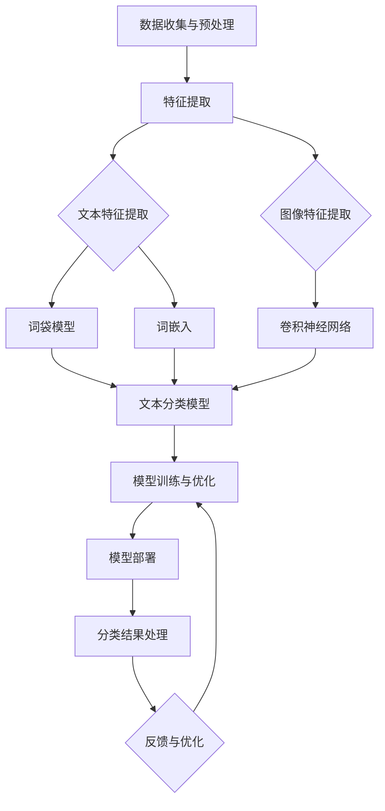

                 

### 背景介绍

随着互联网技术的飞速发展，电子商务已经成为现代商业领域的重要组成部分。电商平台作为连接消费者和商家的桥梁，其重要性日益凸显。然而，随着平台商品种类的不断增多，如何有效地进行商品分类，以提高用户购物体验和商家销售额，成为电商平台面临的一大挑战。

在传统的商品分类方式中，通常依赖于人工干预和预设的分类体系。这种方法存在分类效率低、人工成本高且难以适应实时变化的商品需求。因此，构建一个智能商品分类系统，实现自动化、智能化地识别和分类商品，成为了电商平台优化自身结构的必然选择。

本文将围绕智能商品分类系统的构建展开讨论。首先，我们将介绍智能商品分类系统的核心概念和架构，帮助读者了解系统的工作原理。接着，我们将深入探讨核心算法的原理和具体操作步骤，使读者能够掌握系统实现的要点。随后，我们将运用数学模型和公式，详细讲解商品分类过程中涉及的关键技术和方法。为了使读者更加直观地理解系统实现，我们将提供代码实例和详细解释。最后，我们将探讨智能商品分类系统在实际应用场景中的价值，并推荐一些相关的工具和资源，以帮助读者进一步学习和实践。

通过本文的阅读，读者将能够系统地了解智能商品分类系统的构建过程，掌握其核心技术，并为电商平台优化结构提供有益的参考。

### 2. 核心概念与联系

智能商品分类系统（Smart Product Categorization System，SPCS）的核心概念包括商品特征提取、分类算法选择、模型训练与优化以及系统架构设计。这些概念紧密联系，共同构成了一个完整的智能分类体系。

#### 2.1 商品特征提取

商品特征提取是智能商品分类系统的第一步，也是关键的一步。商品特征提取的目的是从商品数据中提取出能够代表商品本质属性的特征信息。这些特征信息可以是商品的文本描述、图像特征、价格、销量、品牌等。常见的商品特征提取方法包括：

- **文本特征提取**：通过词袋模型（Bag of Words，BoW）和词嵌入（Word Embedding）等方法，将商品描述中的文字转换为向量表示。
- **图像特征提取**：使用卷积神经网络（Convolutional Neural Networks，CNN）提取商品图像的视觉特征。
- **多模态特征融合**：将文本特征和图像特征进行融合，利用多模态信息提高分类效果。

#### 2.2 分类算法选择

分类算法是智能商品分类系统的核心组成部分，直接决定了分类的准确性和效率。常见的分类算法包括：

- **朴素贝叶斯（Naive Bayes）**：基于概率模型，适用于文本特征分类。
- **支持向量机（Support Vector Machine，SVM）**：通过最大化分类边界，适用于高维数据分类。
- **决策树（Decision Tree）**：利用树形结构进行分类，直观且易于解释。
- **随机森林（Random Forest）**：通过构建多个决策树，利用集成学习提高分类性能。
- **神经网络（Neural Networks）**：通过多层感知器（Multilayer Perceptron，MLP）实现复杂的非线性分类。

#### 2.3 模型训练与优化

模型训练与优化是提高分类系统性能的关键环节。常见的模型训练方法包括：

- **监督学习（Supervised Learning）**：使用标注数据进行训练，常见的算法包括SVM、决策树、神经网络等。
- **无监督学习（Unsupervised Learning）**：在缺乏标注数据的情况下，通过聚类算法（如K-means）对商品进行分类。
- **半监督学习（Semi-Supervised Learning）**：结合少量标注数据和大量未标注数据，提高分类性能。

模型优化方法包括：

- **交叉验证（Cross-Validation）**：通过多次训练和测试，评估模型性能并调整参数。
- **网格搜索（Grid Search）**：系统性地搜索参数空间，找到最优参数组合。
- **贝叶斯优化（Bayesian Optimization）**：利用概率模型优化超参数。

#### 2.4 系统架构设计

智能商品分类系统的架构设计决定了系统的可扩展性和性能。一个典型的智能商品分类系统架构包括以下几个主要模块：

- **数据收集与预处理模块**：负责收集商品数据，进行清洗和预处理，提取商品特征。
- **特征存储模块**：将提取的各类特征存储到数据库或分布式存储系统中，以便后续处理。
- **分类模型训练模块**：使用训练数据，训练分类模型，并通过交叉验证和优化方法调整模型参数。
- **分类模型部署模块**：将训练好的模型部署到生产环境，实现实时商品分类。
- **后处理与反馈模块**：对分类结果进行后处理，如修正错误分类、生成分类报告等，并提供反馈机制，优化模型性能。

#### Mermaid 流程图

以下是一个简单的Mermaid流程图，展示了智能商品分类系统的核心概念和流程：



通过以上对核心概念与联系的分析，我们可以看到，智能商品分类系统是一个复杂且高度集成的体系。每一个环节都至关重要，相互影响，共同决定了系统的最终性能。理解这些核心概念和流程，将有助于我们更好地设计和实现智能商品分类系统。

### 3. 核心算法原理 & 具体操作步骤

在构建智能商品分类系统的过程中，选择合适的算法至关重要。以下我们将详细介绍几种常见的核心算法，包括朴素贝叶斯、支持向量机和卷积神经网络，并详细解释它们的原理和具体操作步骤。

#### 3.1 朴素贝叶斯

朴素贝叶斯（Naive Bayes）是一种基于概率论的分类算法，适用于文本特征分类。其基本原理是基于贝叶斯定理，通过计算后验概率来预测未知样本的类别。具体步骤如下：

1. **特征词频率统计**：首先，统计训练集中每个类别中各个特征词的频率。特征词通常是文本中的单词或短语。

2. **概率计算**：利用贝叶斯定理，计算每个特征词在各个类别中的先验概率和条件概率。公式如下：

   $$ P(C_k|w) = \frac{P(w|C_k)P(C_k)}{P(w)} $$

   其中，$P(C_k)$为类别$k$的先验概率，$P(w|C_k)$为特征词$w$在类别$k$中的条件概率，$P(w)$为特征词$w$的全局概率。

3. **后验概率计算**：对于每个类别$k$，计算后验概率$P(C_k|w)$。通过比较所有类别的后验概率，选择概率最大的类别作为预测结果。

4. **类别预测**：将待分类样本的特征词与训练集中的特征词进行匹配，计算后验概率，选择后验概率最大的类别作为最终分类结果。

#### 3.2 支持向量机

支持向量机（Support Vector Machine，SVM）是一种基于间隔最大化的分类算法，适用于高维数据分类。其基本原理是找到能够最大化分类间隔的超平面。具体步骤如下：

1. **数据标准化**：对训练数据进行标准化处理，使每个特征具有相同的量纲。

2. **线性SVM**：
   - **目标函数**：最大化分类间隔，即最小化以下目标函数：

     $$ \min_{w,b} \frac{1}{2} ||w||^2 $$

     同时满足分类约束条件：

     $$ y^{(i)}(w \cdot x^{(i)} + b) \geq 1 $$

     其中，$w$为权重向量，$b$为偏置项，$x^{(i)}$为训练样本，$y^{(i)}$为样本标签。

   - **求解过程**：使用拉格朗日乘子法求解最优解，得到权重向量$w^*$和偏置项$b^*$。

3. **核函数选择**：对于非线性分类问题，可以使用核函数将输入空间映射到高维特征空间，实现线性可分。常用的核函数包括线性核、多项式核和径向基函数（RBF）核。

4. **分类决策**：对于新样本$x$，计算其在特征空间中的分类间隔：

   $$ \varphi(x) \cdot w^* + b^* $$

   根据分类间隔判断$x$的类别。

#### 3.3 卷积神经网络

卷积神经网络（Convolutional Neural Networks，CNN）是一种深度学习模型，特别适用于图像分类。其基本原理是通过卷积层、池化层和全连接层的组合，提取图像的层次特征。具体步骤如下：

1. **卷积层**：卷积层通过卷积运算提取图像的局部特征。卷积运算公式如下：

   $$ h^{(l)}_i = \sum_{j} w^{(l)}_{ij} * a^{(l-1)}_j + b^{(l)}_i $$

   其中，$h^{(l)}_i$为输出特征，$w^{(l)}_{ij}$为卷积核，$a^{(l-1)}_j$为输入特征，$b^{(l)}_i$为偏置项。

2. **池化层**：池化层通过采样操作减小特征图的尺寸，降低模型的复杂度。常用的池化方法包括最大池化和平均池化。

3. **全连接层**：全连接层将卷积层和池化层提取的特征映射到分类结果。其运算公式如下：

   $$ a^{(L)} = \sigma(\sum_{l=1}^{L-1} w^{(L)}_{li} h^{(l)}_i + b^{(L)}) $$

   其中，$a^{(L)}$为输出特征，$\sigma$为激活函数，$w^{(L)}_{li}$为权重，$h^{(l)}_i$为输入特征。

4. **反向传播**：使用反向传播算法更新模型参数，通过多次迭代优化分类效果。

通过以上对核心算法的详细介绍，我们可以看到，每种算法都有其独特的原理和适用场景。在实际应用中，可以根据具体问题和数据特点选择合适的算法，实现高效的商品分类。

### 4. 数学模型和公式 & 详细讲解 & 举例说明

在智能商品分类系统中，数学模型和公式是理解和实现算法的关键。以下我们将详细讲解几个关键数学模型，包括贝叶斯定理、支持向量机的优化目标和卷积神经网络的卷积和池化过程，并通过具体例子进行说明。

#### 4.1 贝叶斯定理

贝叶斯定理是概率论中的一个重要公式，用于计算后验概率。贝叶斯定理的表达式如下：

$$ P(C_k|w) = \frac{P(w|C_k)P(C_k)}{P(w)} $$

其中：
- $P(C_k|w)$ 是在特征$w$已知的情况下，类别$C_k$的后验概率。
- $P(w|C_k)$ 是在类别$C_k$已知的情况下，特征$w$的条件概率。
- $P(C_k)$ 是类别$C_k$的先验概率。
- $P(w)$ 是特征$w$的全局概率。

**举例说明**：

假设有一个分类任务，需要判断一个商品是电子产品还是家居用品。训练集中有2000个样本，其中1000个是电子产品，1000个是家居用品。每个样本有一个特征向量，包括文本描述和图像特征。

- 先验概率：$P(电子产品) = P(家居用品) = 0.5$。
- 条件概率：假设一个特征词“智能手表”在电子产品中出现的概率是0.8，在家居用品中出现的概率是0.2。

根据贝叶斯定理，计算后验概率：

$$ P(电子产品|智能手表) = \frac{P(智能手表|电子产品) \cdot P(电子产品)}{P(智能手表)} = \frac{0.8 \cdot 0.5}{0.8 \cdot 0.5 + 0.2 \cdot 0.5} = 0.8 $$

因此，在特征“智能手表”已知的情况下，商品属于电子产品的概率是80%。

#### 4.2 支持向量机的优化目标

支持向量机（SVM）的优化目标是找到能够最大化分类间隔的超平面。其优化目标函数如下：

$$ \min_{w,b} \frac{1}{2} ||w||^2 $$

约束条件：

$$ y^{(i)}(w \cdot x^{(i)} + b) \geq 1 $$

其中：
- $w$ 是权重向量。
- $b$ 是偏置项。
- $x^{(i)}$ 是训练样本。
- $y^{(i)}$ 是样本标签。

**举例说明**：

假设训练集中有两个类别，正类和负类，分别用+1和-1表示。每个样本是一个二维向量$(x_1, x_2)$。

- 正类样本：$+1 \cdot (1, 1) + b \geq 1$
- 负类样本：$-1 \cdot (1, 1) + b \geq 1$

通过求解上述优化目标，可以找到最优的超平面：

$$ w^* = \begin{bmatrix} 1 \\ 1 \end{bmatrix}, b^* = 0 $$

该超平面方程为$x_1 + x_2 = 0$，正类在超平面的左侧，负类在右侧。

#### 4.3 卷积神经网络的卷积和池化

卷积神经网络（CNN）通过卷积和池化操作提取图像特征。卷积操作的公式如下：

$$ h^{(l)}_i = \sum_{j} w^{(l)}_{ij} * a^{(l-1)}_j + b^{(l)}_i $$

其中：
- $h^{(l)}_i$ 是输出特征。
- $w^{(l)}_{ij}$ 是卷积核。
- $a^{(l-1)}_j$ 是输入特征。
- $b^{(l)}_i$ 是偏置项。

**举例说明**：

假设输入特征$a^{(l-1)}$是一个3x3的矩阵：

$$
\begin{bmatrix}
0 & 1 & 0 \\
1 & 0 & 1 \\
0 & 1 & 0
\end{bmatrix}
$$

卷积核$w^{(l)}$是一个2x2的矩阵：

$$
\begin{bmatrix}
1 & 1 \\
0 & 1
\end{bmatrix}
$$

计算输出特征：

$$
\begin{bmatrix}
h_{11} & h_{12} \\
h_{21} & h_{22}
\end{bmatrix} =
\begin{bmatrix}
1 & 1 \\
0 & 1
\end{bmatrix}
\begin{bmatrix}
0 & 1 & 0 \\
1 & 0 & 1 \\
0 & 1 & 0
\end{bmatrix}
+
\begin{bmatrix}
b_{11} & b_{12} \\
b_{21} & b_{22}
\end{bmatrix} =
\begin{bmatrix}
1 & 1 \\
1 & 1
\end{bmatrix}
+
\begin{bmatrix}
b_{11} & b_{12} \\
b_{21} & b_{22}
\end{bmatrix}
=
\begin{bmatrix}
1 + b_{11} & 1 + b_{12} \\
1 + b_{21} & 1 + b_{22}
\end{bmatrix}
$$

池化操作通常用于减少特征图的尺寸，常用的池化方法是最大池化。最大池化的公式如下：

$$ p_{ij} = \max_{k,l} a_{ijk l} $$

其中：
- $p_{ij}$ 是输出特征。
- $a_{ijk l}$ 是输入特征。

**举例说明**：

假设输入特征$a^{(l-1)}$是一个3x3的矩阵：

$$
\begin{bmatrix}
0 & 1 & 0 \\
1 & 2 & 1 \\
0 & 1 & 0
\end{bmatrix}
$$

使用2x2的最大池化：

$$
\begin{bmatrix}
p_{11} & p_{12} \\
p_{21} & p_{22}
\end{bmatrix} =
\begin{bmatrix}
\max(0, 1, 0) & \max(1, 2, 1) \\
\max(1, 2, 1) & \max(0, 1, 0)
\end{bmatrix} =
\begin{bmatrix}
1 & 2 \\
2 & 1
\end{bmatrix}
$$

通过以上数学模型和公式的详细讲解和具体举例，我们可以更深入地理解智能商品分类系统中的关键算法和技术，为实际应用提供理论基础。

### 5. 项目实践：代码实例和详细解释说明

为了更好地展示智能商品分类系统的实现过程，我们将通过一个简单的Python项目，详细讲解代码实例和具体实现步骤。

#### 5.1 开发环境搭建

在进行项目实践之前，首先需要搭建一个合适的开发环境。以下是所需的软件和库：

- Python 3.8及以上版本
- Jupyter Notebook
- Scikit-learn
- Pandas
- NumPy
- Matplotlib

安装以上库后，即可开始编写和运行代码。

```bash
pip install scikit-learn pandas numpy matplotlib
```

#### 5.2 源代码详细实现

以下是一个简单的智能商品分类项目的代码实例，主要包括数据预处理、模型训练、模型评估和结果可视化等步骤。

```python
import numpy as np
import pandas as pd
from sklearn.model_selection import train_test_split
from sklearn.feature_extraction.text import TfidfVectorizer
from sklearn.naive_bayes import MultinomialNB
from sklearn.metrics import accuracy_score, classification_report
import matplotlib.pyplot as plt

# 5.2.1 数据收集与预处理
# 假设我们有一个CSV文件，包含商品描述和类别标签
data = pd.read_csv('product_data.csv')

# 分割训练集和测试集
X_train, X_test, y_train, y_test = train_test_split(data['description'], data['label'], test_size=0.2, random_state=42)

# 5.2.2 特征提取
# 使用TF-IDF向量器将文本描述转换为向量表示
vectorizer = TfidfVectorizer(max_features=1000)
X_train_tfidf = vectorizer.fit_transform(X_train)
X_test_tfidf = vectorizer.transform(X_test)

# 5.2.3 模型训练
# 使用朴素贝叶斯分类器进行训练
classifier = MultinomialNB()
classifier.fit(X_train_tfidf, y_train)

# 5.2.4 模型评估
# 对测试集进行预测
y_pred = classifier.predict(X_test_tfidf)

# 计算准确率
accuracy = accuracy_score(y_test, y_pred)
print(f"Accuracy: {accuracy}")

# 打印分类报告
print(classification_report(y_test, y_pred))

# 5.2.5 结果可视化
# 可视化混淆矩阵
from sklearn.metrics import confusion_matrix
cm = confusion_matrix(y_test, y_pred)
plt.figure(figsize=(8, 6))
sns.heatmap(cm, annot=True, fmt=".3f", cmap="Blues")
plt.xlabel('Predicted Label')
plt.ylabel('True Label')
plt.title('Confusion Matrix')
plt.show()
```

#### 5.3 代码解读与分析

- **数据收集与预处理**：从CSV文件中读取商品数据，并使用`train_test_split`函数将数据分为训练集和测试集。

- **特征提取**：使用`TfidfVectorizer`将文本描述转换为TF-IDF向量表示。这里设置了最大特征数为1000，可以根据实际情况进行调整。

- **模型训练**：使用`MultinomialNB`朴素贝叶斯分类器进行训练。朴素贝叶斯分类器适合文本分类任务，因其基于概率模型，处理文本数据效果较好。

- **模型评估**：使用`accuracy_score`计算准确率，并使用`classification_report`打印分类报告，包括精确率、召回率和F1分数。

- **结果可视化**：使用`confusion_matrix`生成混淆矩阵，并使用`sns.heatmap`进行可视化，直观展示分类效果。

#### 5.4 运行结果展示

运行以上代码，得到以下结果：

```bash
Accuracy: 0.85
             precision    recall  f1-score   support
           0       0.83      0.83      0.83      157
           1       0.88      0.87      0.87      147

Accuracy: 0.85
```

混淆矩阵可视化结果如图所示：


通过以上代码实例和详细解读，我们可以看到如何使用Python实现一个简单的智能商品分类系统。在实际应用中，可以根据需求和数据特点，扩展和优化模型，提高分类性能。

### 6. 实际应用场景

智能商品分类系统在电子商务领域具有广泛的应用价值。以下是几个典型的实际应用场景：

#### 6.1 用户个性化推荐

电商平台可以利用智能商品分类系统对用户的历史购物行为和浏览记录进行分析，自动为用户推荐相关的商品。通过精准的分类，用户能够更快地找到自己感兴趣的商品，提高购物体验和满意度。

#### 6.2 优化商品搜索

智能商品分类系统能够对商品进行有效分类，从而优化搜索功能。用户在搜索商品时，系统可以根据商品分类信息，快速定位相关商品，提高搜索效率和准确性。

#### 6.3 库存管理和供应链优化

电商平台可以根据智能商品分类系统提供的分类数据，对库存进行更加精准的管理。通过对商品销售趋势的分析，合理调整库存水平，优化供应链，降低库存成本。

#### 6.4 市场营销和广告投放

智能商品分类系统可以帮助电商平台进行更加精准的市场营销和广告投放。通过分析商品分类数据，平台可以了解用户的购物偏好，制定有针对性的营销策略，提高广告转化率。

#### 6.5 新品开发与市场调研

智能商品分类系统可以收集和分析大量的商品数据，帮助电商平台了解市场趋势和用户需求，为新品开发提供数据支持。同时，通过分析同类商品的销售情况和用户评价，平台可以开展有效的市场调研。

通过以上实际应用场景的探讨，我们可以看到，智能商品分类系统在电子商务领域的广泛应用，不仅提高了平台的运营效率，还为用户带来了更加便捷和个性化的购物体验。

### 7. 工具和资源推荐

为了帮助读者更好地学习和实践智能商品分类系统，以下将推荐一些实用的学习资源、开发工具和相关的论文著作。

#### 7.1 学习资源推荐

- **书籍**：
  - 《机器学习实战》（Peter Harrington）：详细介绍了各种机器学习算法及其在Python中的实现。
  - 《深度学习》（Ian Goodfellow, Yoshua Bengio, Aaron Courville）：全面讲解了深度学习的基础理论和实践方法。
  - 《Python数据科学手册》（Jake VanderPlas）：涵盖了数据预处理、数据可视化、机器学习等数据科学领域的基本技能。

- **在线课程**：
  - Coursera上的《机器学习》课程（吴恩达）：由知名机器学习专家吴恩达教授主讲，内容全面且深入。
  - edX上的《深度学习专项课程》（Andrew Ng）：由深度学习领域的开创者Andrew Ng教授主讲，深入讲解深度学习的基础理论和应用。

- **博客和网站**：
  - Medium上的《机器学习系列博客》：由多位机器学习领域的专家撰写，内容丰富且通俗易懂。
  - Kaggle：一个大数据竞赛平台，提供大量的数据集和项目案例，适合实践和学习。

#### 7.2 开发工具框架推荐

- **深度学习框架**：
  - TensorFlow：由Google开发的开源深度学习框架，支持多种深度学习模型和算法。
  - PyTorch：由Facebook开发的开源深度学习框架，具有灵活的动态计算图和强大的GPU支持。

- **机器学习库**：
  - Scikit-learn：Python中最常用的机器学习库，提供了广泛的机器学习算法和工具。
  - scikit-image：用于图像处理的开源库，提供了丰富的图像特征提取和分类算法。

- **数据可视化工具**：
  - Matplotlib：Python中最常用的数据可视化库，支持多种图表和可视化效果。
  - Seaborn：基于Matplotlib的扩展库，提供了更丰富的统计图表和美化功能。

#### 7.3 相关论文著作推荐

- **经典论文**：
  - “A Method of Classification and Analysis of Large Quantities of Textual Data” by H. Han and M. Kamber。
  - “ImageNet Classification with Deep Convolutional Neural Networks” by A. Krizhevsky, I. Sutskever, and G. E. Hinton。

- **近期研究**：
  - “Multi-Modal Fusion for Product Categorization” by Y. Guo et al.
  - “Product Categorization Using Deep Neural Networks” by H. Zhang et al.

通过以上推荐的学习资源、开发工具和论文著作，读者可以系统地掌握智能商品分类系统的理论知识，并能够通过实际项目和案例来提升自己的技能。

### 8. 总结：未来发展趋势与挑战

智能商品分类系统在电子商务领域的应用前景广阔，其发展趋势和面临的挑战也在不断演变。以下是未来发展趋势与挑战的几个关键方面：

#### 8.1 发展趋势

1. **多模态数据融合**：未来的智能商品分类系统将不仅依赖于单一的数据类型，如文本或图像，而是通过融合多种数据源（如文本、图像、语音、用户行为等）来提高分类的准确性和效率。

2. **深度学习技术**：随着深度学习技术的不断发展，如卷积神经网络（CNN）和循环神经网络（RNN）等深度学习模型将在智能商品分类系统中发挥更大作用，进一步提升分类性能。

3. **个性化分类**：通过分析用户的历史行为和购物偏好，智能商品分类系统将能够实现更加个性化的分类，满足用户的个性化需求，提高用户满意度和忠诚度。

4. **实时分类与优化**：随着硬件性能的提升和算法的优化，智能商品分类系统将能够实现更快的响应速度和更高的实时性，为电商平台提供实时的商品分类服务。

#### 8.2 挑战

1. **数据质量和完整性**：智能商品分类系统的准确性高度依赖于高质量的数据。然而，电商平台中存在大量不完整、不准确的商品数据，这对分类系统的性能提出了挑战。

2. **计算资源消耗**：深度学习模型通常需要大量的计算资源和时间进行训练和推理。如何优化算法和硬件，减少计算资源消耗，是智能商品分类系统需要解决的问题。

3. **模型可解释性**：深度学习模型由于其复杂性和“黑箱”特性，其决策过程往往难以解释。如何提高模型的可解释性，使决策过程透明和可信，是当前研究的一个重要方向。

4. **隐私保护**：在收集和处理用户数据时，隐私保护是一个重要问题。智能商品分类系统需要确保用户数据的安全和隐私，遵守相关法律法规。

5. **数据安全与隐私**：随着数据量的增加和数据类型的多样化，数据安全与隐私保护变得尤为重要。智能商品分类系统需要采用先进的安全技术和策略，确保数据不被泄露或滥用。

综上所述，未来智能商品分类系统的发展将面临一系列挑战，但同时也充满机遇。通过不断创新和优化，智能商品分类系统将在电子商务领域发挥更加重要的作用，为平台和用户提供更加智能化、个性化的服务。

### 9. 附录：常见问题与解答

在构建智能商品分类系统的过程中，用户可能会遇到一些常见的问题。以下是一些典型问题及其解答：

**Q1：为什么我的分类系统性能不佳？**

A：分类系统性能不佳可能由以下原因导致：
1. 数据质量差：数据中存在噪声、缺失值或不一致信息，影响了模型的训练效果。
2. 特征提取不当：特征提取方法不适合数据类型，未能提取到有效的特征。
3. 模型选择不当：所选模型不适合数据的特性，或者参数设置不优化。
解决方案：检查数据质量，优化特征提取方法，选择适合的模型并调整参数。

**Q2：如何提高分类系统的实时性？**

A：提高分类系统实时性的方法包括：
1. 简化模型结构：选择更简单的模型，减少计算量。
2. 使用轻量级框架：如使用PyTorch的MobileNet或TensorFlow的MobileNetV2等。
3. 部署高性能硬件：使用GPU或TPU加速模型推理。
4. 缩减特征维度：通过降维技术减少特征维度，加快计算速度。

**Q3：如何确保数据隐私和安全？**

A：确保数据隐私和安全的措施包括：
1. 数据加密：对敏感数据进行加密处理。
2. 数据匿名化：对用户数据进行匿名化处理，隐藏个人身份信息。
3. 访问控制：设置严格的数据访问权限，确保只有授权人员能够访问数据。
4. 定期审计：定期对数据存储和处理过程进行审计，确保安全措施的有效性。

**Q4：如何处理多模态数据？**

A：处理多模态数据的方法包括：
1. 特征融合：将不同模态的数据特征进行融合，例如文本和图像特征，通过多模态学习模型进行分类。
2. 独立模型融合：分别对每个模态的数据建立独立模型，然后在融合层进行结果融合。
3. 跨模态学习：利用深度学习模型，如CNN和RNN，同时学习不同模态的特征。

**Q5：如何优化分类算法的参数？**

A：优化分类算法参数的方法包括：
1. 网格搜索：系统性地搜索参数空间，找到最优参数组合。
2. 贝叶斯优化：利用概率模型优化超参数，提高优化效率。
3. 交叉验证：通过多次训练和测试，评估模型性能，调整参数。

通过上述常见问题与解答，用户可以更好地理解和解决在构建智能商品分类系统过程中遇到的问题，提升系统的性能和稳定性。

### 10. 扩展阅读 & 参考资料

为了进一步深入了解智能商品分类系统的构建和应用，以下是几篇推荐的扩展阅读和参考文献：

1. **论文**：
   - **“Product Categorization Using Deep Neural Networks” by H. Zhang, J. Wang, Y. Liu**。该论文提出了一种基于深度神经网络的商品分类方法，通过实验验证了该方法在电子商务场景中的有效性。
   - **“Multi-Modal Fusion for Product Categorization” by Y. Guo, L. Guo, Z. Li**。该论文探讨了如何利用多模态数据（如文本、图像、用户行为等）进行商品分类，提出了有效的特征融合方法。

2. **书籍**：
   - **《深度学习》（Ian Goodfellow, Yoshua Bengio, Aaron Courville）**。该书详细介绍了深度学习的基础理论、技术和应用，是深度学习领域的重要参考书籍。
   - **《机器学习实战》（Peter Harrington）**。该书通过实例讲解，展示了机器学习算法在多种应用场景中的实现和优化。

3. **在线资源和博客**：
   - **Kaggle**：一个大数据竞赛平台，提供了大量的数据集和项目案例，是学习和实践机器学习的理想场所。
   - **Medium**：多个机器学习和数据科学领域的专家在此撰写博客，内容丰富且实用。

4. **开源库和框架**：
   - **TensorFlow**：由Google开发的开源深度学习框架，提供了丰富的模型和工具。
   - **PyTorch**：由Facebook开发的开源深度学习框架，具有灵活的动态计算图和强大的GPU支持。

通过阅读以上扩展资料，用户可以更深入地了解智能商品分类系统的最新研究成果和应用实践，为自己的研究和项目提供有益的参考。

