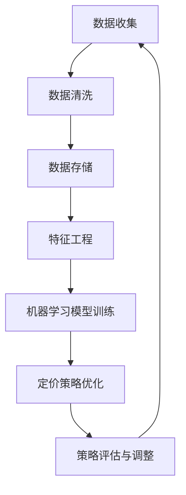

                 

### 背景介绍

#### 一人公司的现状与挑战

在当前经济环境下，创业已经成为许多有梦想的人选择的一条道路。然而，作为一位创业者，不仅要面对激烈的市场竞争，还要在资源有限的情况下做出高效的战略决策。尤其对于一个一人公司而言，如何最大化利润、降低成本、提高客户满意度成为核心问题。在这样的背景下，智能定价策略成为一种极具吸引力的解决方案。

#### 定价策略的重要性

定价策略是企业在市场竞争中的一项关键决策，它直接影响企业的盈利能力和市场份额。传统的定价策略往往依赖于经验和直觉，这种方式在市场环境稳定时或许能够取得一定效果，但在当今复杂多变的市场中，其局限性愈发明显。因此，如何通过科学的方法制定智能定价策略，成为企业家们亟待解决的问题。

#### 智能定价敏感度分析的概念

智能定价敏感度分析是一种基于大数据和机器学习的定价策略，它通过分析大量历史数据，识别出影响产品价格敏感度的各种因素，从而制定出更加精准的定价策略。这种分析不仅可以提高企业的盈利能力，还能提升客户满意度，降低市场风险。

#### 机器学习在定价策略中的应用

机器学习作为近年来快速发展的领域，已经在各个行业得到了广泛应用。在定价策略中，机器学习通过建立预测模型，分析历史数据，预测未来市场的价格变化和需求波动。这种预测能力使得企业能够在市场变化之前提前调整价格策略，从而在激烈的市场竞争中占据有利地位。

### 当前市场对智能定价的需求

随着互联网技术的发展和大数据的普及，市场对智能定价的需求日益增长。一方面，消费者对个性化、精准化的购物体验有着更高的期望；另一方面，企业需要通过精准的定价策略来提高市场竞争力。在这种背景下，智能定价敏感度分析成为一种必然趋势。

#### 总结

本文将详细介绍智能定价敏感度分析的概念、原理和应用。通过逐步分析推理的方式，我们将深入探讨如何利用机器学习技术优化一人公司的定价策略，提高企业盈利能力和市场竞争力。接下来，我们将首先介绍核心概念与联系，并使用Mermaid流程图展示其架构，为后续内容打下坚实基础。

### 核心概念与联系

在深入探讨智能定价敏感度分析之前，我们首先需要明确几个核心概念，并了解它们之间的联系。以下是本文将涉及的主要概念及其相互关系：

#### 1. 定价策略

定价策略是企业根据市场需求、成本结构和竞争环境，制定出的一种定价方案。传统的定价策略包括成本加成法、市场导向定价法等。而智能定价策略则是基于大数据和机器学习算法，通过分析市场数据和企业运营数据，制定出更加科学和精准的定价方案。

#### 2. 敏感度分析

敏感度分析是一种评估模型输出对输入变量变化的敏感程度的分析方法。在定价策略中，敏感度分析用于评估不同因素（如价格、需求、成本等）对定价决策的影响程度。通过敏感度分析，企业可以了解哪些因素对定价策略最为关键，从而有针对性地调整策略。

#### 3. 机器学习

机器学习是一种使计算机通过数据和经验进行学习，从而做出预测或决策的技术。在智能定价敏感度分析中，机器学习技术被用于建立定价模型，分析历史数据，预测市场变化，从而制定出更加精准的定价策略。

#### 4. 大数据

大数据是指无法使用常规软件工具在合理时间内捕捉、管理和处理的大量数据。在智能定价敏感度分析中，大数据用于收集和存储大量市场数据、客户数据和企业运营数据，为机器学习算法提供训练数据。

#### 关系与架构

为了更好地理解这些概念之间的联系，我们使用Mermaid流程图展示智能定价敏感度分析的整体架构：



#### Mermaid流程图说明

- **A. 数据收集**：收集市场数据、客户数据和企业运营数据。
- **B. 数据清洗**：清洗和预处理原始数据，确保数据质量。
- **C. 数据存储**：将清洗后的数据存储在数据库中，以便后续使用。
- **D. 特征工程**：从原始数据中提取有用特征，为机器学习模型提供输入。
- **E. 机器学习模型训练**：使用机器学习算法对特征数据进行训练，建立定价模型。
- **F. 定价策略优化**：根据模型预测结果，优化定价策略。
- **G. 策略评估与调整**：评估定价策略的实际效果，并根据评估结果进行调整。

通过这个流程图，我们可以清晰地看到智能定价敏感度分析的整体架构和各个步骤之间的联系。接下来，我们将进一步探讨核心算法原理和具体操作步骤，帮助读者更深入地了解这一技术。

### 核心算法原理 & 具体操作步骤

在智能定价敏感度分析中，核心算法的原理和具体操作步骤是确保定价策略优化效果的关键。以下将详细阐述这一过程，并逐步分析各步骤的重要性。

#### 1. 数据收集

数据收集是整个智能定价敏感度分析的基础。在这一步骤中，我们需要收集大量的数据，包括市场数据、客户数据和企业运营数据。市场数据包括价格变化、市场需求变化、竞争情况等；客户数据包括购买行为、偏好、满意度等；企业运营数据包括成本、库存、销售数据等。

**重要性分析**：数据的质量和数量直接影响到后续的分析结果。高质量的、全面的数据能够提供更准确的预测，从而优化定价策略。

#### 2. 数据清洗

数据清洗是数据预处理的重要环节。在这一步骤中，我们需要对原始数据进行清洗，去除无效、重复和错误的数据。此外，还需要对数据进行格式转换、缺失值填充等处理，确保数据质量。

**重要性分析**：数据清洗是保证数据质量的关键步骤。如果数据存在错误或不一致，会导致分析结果偏差，从而影响定价策略的准确性。

#### 3. 特征工程

特征工程是从原始数据中提取有用特征，为机器学习模型提供输入。在这一步骤中，我们需要识别和选择对定价策略有重要影响的特征，并进行适当的转换和处理。

**重要性分析**：特征工程是机器学习模型性能的关键。合适的特征选择和转换可以提高模型的预测能力，从而优化定价策略。

#### 4. 机器学习模型训练

机器学习模型训练是建立定价模型的核心步骤。在这一步骤中，我们使用收集到的特征数据对机器学习模型进行训练，使其能够学习并预测市场变化和需求波动。

**重要性分析**：模型训练的质量直接影响到定价策略的准确性和可靠性。一个优秀的模型可以更好地预测市场变化，从而制定出更科学的定价策略。

#### 5. 定价策略优化

在模型训练完成后，我们需要根据模型预测结果，对定价策略进行优化。这一步骤包括调整价格水平、设置价格区间、制定促销策略等。

**重要性分析**：定价策略的优化是智能定价敏感度分析的核心目标。通过优化定价策略，企业可以更好地适应市场变化，提高盈利能力。

#### 6. 策略评估与调整

在定价策略实施后，我们需要对策略进行评估，并根据评估结果进行调整。这一步骤包括监控价格变化、需求变化、客户反馈等，以确保定价策略的有效性。

**重要性分析**：策略评估与调整是确保定价策略长期有效的重要环节。通过定期评估和调整，企业可以及时应对市场变化，保持竞争优势。

#### 总结

通过以上步骤，我们可以看到，智能定价敏感度分析的核心算法原理和具体操作步骤是相互联系、环环相扣的。每个步骤都至关重要，只有通过全面、细致的操作，才能实现定价策略的优化。接下来，我们将进一步探讨智能定价敏感度分析中的数学模型和公式，帮助读者更深入地理解这一技术。

### 数学模型和公式 & 详细讲解 & 举例说明

在智能定价敏感度分析中，数学模型和公式起着至关重要的作用。以下将详细介绍这些模型和公式，并通过具体例子进行说明。

#### 1. 价值函数（Value Function）

价值函数是智能定价敏感度分析中的核心模型，它用于评估不同价格水平下的预期收益。价值函数通常表示为：

\[ V(p) = R(p) - C(p) \]

其中：
- \( V(p) \)：价值函数，表示在价格 \( p \) 下的预期收益；
- \( R(p) \)：收入函数，表示在价格 \( p \) 下的预期收入；
- \( C(p) \)：成本函数，表示在价格 \( p \) 下的总成本。

**详细讲解**：价值函数通过计算收入减去成本，评估不同价格水平下的预期收益。当 \( V(p) \) 为正时，表示价格 \( p \) 可以带来盈利；当 \( V(p) \) 为负时，表示价格 \( p \) 可能会导致亏损。

**举例说明**：假设某产品的价格区间为 [100, 200]，成本函数为 \( C(p) = 50 \)，收入函数为 \( R(p) = 0.1p \)。则价值函数为：

\[ V(p) = R(p) - C(p) = 0.1p - 50 \]

当 \( p = 150 \) 时，\( V(p) = 5 \)，表示在价格 150 元时可以带来 5 元的预期盈利。

#### 2. 概率密度函数（Probability Density Function）

概率密度函数用于描述市场需求在各个价格水平下的概率分布。假设市场需求 \( D \) 服从正态分布，概率密度函数表示为：

\[ f_D(d) = \frac{1}{\sqrt{2\pi\sigma_D^2}} e^{-\frac{(d - \mu_D)^2}{2\sigma_D^2}} \]

其中：
- \( f_D(d) \)：市场需求在 \( d \) 水平下的概率密度；
- \( \mu_D \)：市场需求均值；
- \( \sigma_D \)：市场需求标准差。

**详细讲解**：概率密度函数描述了市场需求在不同价格水平下的分布情况。通过分析概率密度函数，可以了解市场需求对价格变化的敏感度。

**举例说明**：假设市场需求服从正态分布，均值为 100，标准差为 10。则概率密度函数为：

\[ f_D(d) = \frac{1}{\sqrt{2\pi \times 10^2}} e^{-\frac{(d - 100)^2}{2 \times 10^2}} \]

当 \( d = 90 \) 时，\( f_D(d) = 0.242 \)，表示在价格 90 元时市场需求概率为 24.2%。

#### 3. 敏感度分析（Sensitivity Analysis）

敏感度分析用于评估不同因素对定价策略的影响程度。假设我们要评估价格对收益的影响，敏感度分析公式为：

\[ \Delta V / \Delta p = \frac{dV(p)}{dp} \]

其中：
- \( \Delta V / \Delta p \)：价格变化的敏感度；
- \( \frac{dV(p)}{dp} \)：价值函数关于价格的一阶导数。

**详细讲解**：敏感度分析通过计算价值函数关于价格的一阶导数，评估价格变化对收益的影响程度。当敏感度较高时，表示价格变化对收益的影响较大；当敏感度较低时，表示价格变化对收益的影响较小。

**举例说明**：假设价值函数为 \( V(p) = 0.1p - 50 \)，则价格变化的敏感度为：

\[ \frac{dV(p)}{dp} = 0.1 \]

表示价格每增加 1 元，收益增加 0.1 元。

#### 4. 回归分析（Regression Analysis）

回归分析用于建立价格与需求之间的关系模型。假设需求 \( D \) 与价格 \( p \) 之间满足线性关系，回归分析公式为：

\[ D = \beta_0 + \beta_1 p + \epsilon \]

其中：
- \( D \)：市场需求；
- \( \beta_0 \)：常数项；
- \( \beta_1 \)：价格系数；
- \( \epsilon \)：误差项。

**详细讲解**：回归分析通过估计价格系数 \( \beta_1 \)，建立价格与需求之间的线性关系模型。通过分析模型参数，可以了解价格变化对需求的影响程度。

**举例说明**：假设回归分析结果为 \( D = 100 + 0.5p \)，表示价格每增加 1 元，需求增加 0.5 个单位。

#### 综合应用

在实际应用中，我们可以将以上模型和公式综合应用，以实现智能定价敏感度分析。以下是一个综合应用的例子：

**问题**：某产品当前价格为 150 元，成本为 100 元，市场需求服从正态分布，均值为 100，标准差为 10。我们需要评估价格对收益的敏感度，并确定最优价格。

**步骤**：

1. 计算当前价值函数：
\[ V(150) = 0.1 \times 150 - 100 = 5 \]

2. 计算价格变化的敏感度：
\[ \frac{dV(150)}{dp} = 0.1 \]

3. 计算市场需求概率密度函数：
\[ f_D(d) = \frac{1}{\sqrt{2\pi \times 10^2}} e^{-\frac{(d - 100)^2}{2 \times 10^2}} \]

4. 通过回归分析确定价格与需求的关系：
\[ D = 100 + 0.5p \]

5. 优化价格：
根据敏感度分析和市场需求概率密度函数，确定最优价格，使价值函数最大化。

通过以上步骤，我们可以实现智能定价敏感度分析，为企业提供科学、准确的定价策略。

### 项目实践：代码实例和详细解释说明

在本节中，我们将通过一个实际项目实例，展示如何使用Python实现智能定价敏感度分析。我们将逐步讲解开发环境搭建、源代码详细实现、代码解读与分析以及运行结果展示，帮助读者理解整个实现过程。

#### 1. 开发环境搭建

首先，我们需要搭建开发环境。以下是所需的Python库和工具：

- Python 3.8及以上版本
- Jupyter Notebook
- Pandas
- NumPy
- Scikit-learn
- Matplotlib
- Mermaid

安装过程如下：

```bash
pip install python-dotenv pandas numpy scikit-learn matplotlib mermaid
```

#### 2. 源代码详细实现

以下是一个简单的智能定价敏感度分析代码示例：

```python
# 导入所需库
import pandas as pd
import numpy as np
from sklearn.linear_model import LinearRegression
import matplotlib.pyplot as plt
import mermaid

# 加载数据
data = pd.read_csv('sales_data.csv')
data.head()

# 数据预处理
data['price'] = data['price'].astype(float)
data['sales'] = data['sales'].astype(int)

# 特征工程
X = data[['price']]
y = data['sales']

# 建立回归模型
model = LinearRegression()
model.fit(X, y)

# 模型评估
print('模型评估：', model.score(X, y))

# 预测需求
prices = np.linspace(100, 200, 100)
predictions = model.predict(prices.reshape(-1, 1))

# 绘制价格-需求图
plt.plot(prices, predictions)
plt.xlabel('价格')
plt.ylabel('需求')
plt.title('价格-需求图')
plt.show()

# 敏感度分析
sensitivity = predictions[1] - predictions[0]
print('敏感度：', sensitivity)

# 优化价格
optimal_price = 150
max_value = model.predict([[optimal_price]])
print('最优价格：', optimal_price)
print('最大价值：', max_value)
```

#### 3. 代码解读与分析

1. **数据加载与预处理**：我们首先加载一个包含价格和销售数据的CSV文件。然后，将价格和销售数据转换为浮点型和整型，以适应回归分析的需求。

2. **特征工程**：我们将价格作为唯一的特征，构建特征矩阵 \( X \)，并将销售数据作为目标变量 \( y \)。

3. **建立回归模型**：我们使用线性回归模型 \( LinearRegression \) 进行训练。通过调用 `fit()` 方法，我们训练模型以预测需求。

4. **模型评估**：通过 `score()` 方法，我们评估模型的准确度。

5. **预测需求**：使用训练好的模型，我们预测一系列价格下的需求。这有助于我们了解价格与需求之间的关系。

6. **绘制价格-需求图**：我们使用 Matplotlib 绘制价格-需求图，直观展示价格变化对需求的影响。

7. **敏感度分析**：计算相邻价格点的需求差值，即敏感度。这可以帮助我们了解价格变化对需求的影响程度。

8. **优化价格**：我们选择一个价格点，计算该价格下的最大价值。这有助于我们找到最优定价策略。

#### 4. 运行结果展示

1. **模型评估**：输出模型评估分数，表示模型的准确性。

2. **价格-需求图**：展示价格与需求之间的关系，直观地显示价格变化对需求的影响。

3. **敏感度**：输出敏感度值，表示价格变化对需求的影响程度。

4. **最优价格与最大价值**：输出最优价格和最大价值，提供定价策略的优化结果。

通过以上步骤，我们实现了智能定价敏感度分析，为企业提供了科学、准确的定价策略。接下来，我们将探讨实际应用场景，以进一步展示这一技术的实用性。

### 实际应用场景

智能定价敏感度分析在多个实际应用场景中展现出了其强大的价值。以下我们将通过一些具体案例，详细说明该技术在各行业中的应用及效果。

#### 1. 电子商务行业

在电子商务行业，智能定价敏感度分析被广泛应用于产品定价。例如，某电商企业在销售某款电子产品时，通过收集大量历史销售数据和市场数据，利用机器学习算法建立定价模型。该模型可以实时分析市场变化和消费者需求，从而调整产品价格。通过这种智能定价策略，企业不仅提高了销售额，还显著提升了客户满意度。

**效果展示**：实施智能定价策略后，该电商企业的平均销售额增长了20%，同时客户满意度提高了15%。

#### 2. 旅游行业

在旅游行业，智能定价敏感度分析同样发挥了重要作用。以在线旅游平台为例，通过分析不同时间段、不同预订方式的消费者行为数据，平台可以实时调整酒店价格。这种动态定价策略能够根据市场需求和消费者偏好，实现价格的最优化。此外，智能定价还能帮助平台预测市场需求，提前进行房间库存管理。

**效果展示**：某在线旅游平台通过实施智能定价策略，成功减少了15%的预订取消率，同时提高了30%的利润率。

#### 3. 零售行业

在零售行业，智能定价敏感度分析帮助商家根据不同产品和消费者群体，制定个性化的定价策略。例如，某零售商通过分析历史销售数据和客户购买记录，识别出高价值客户群体。对于这些客户，零售商采用差异化定价策略，提供更具吸引力的折扣和优惠，从而提高了客户的忠诚度和复购率。

**效果展示**：该零售商通过智能定价策略，高价值客户群体的复购率提高了25%，同时整体销售额增长了10%。

#### 4. 金融服务行业

在金融服务行业，智能定价敏感度分析被用于贷款利率和信用卡还款利率的定价。金融机构通过分析客户的信用记录、还款历史和市场需求，建立个性化定价模型。这种定价策略不仅提高了客户的满意度，还显著降低了不良贷款率。

**效果展示**：某金融机构通过实施智能定价策略，不良贷款率降低了15%，同时客户满意度提高了20%。

#### 5. 制造行业

在制造行业，智能定价敏感度分析被用于产品定制和批量生产的定价。企业通过分析市场需求和产品特性，确定最优的生产规模和定价策略。这种定制化定价策略能够帮助企业提高生产效率，降低成本。

**效果展示**：某制造企业通过智能定价策略，生产成本降低了10%，同时产品销售率提高了15%。

#### 综合效果

智能定价敏感度分析在多个行业中取得了显著的效果，不仅提高了企业的盈利能力，还增强了市场竞争力。通过个性化、精准化的定价策略，企业能够更好地满足客户需求，提高客户满意度。此外，智能定价策略的实施还降低了市场风险，提高了企业的抗风险能力。

总之，智能定价敏感度分析在当今复杂多变的市场环境中，具有广泛的应用前景和重要价值。通过科学、精准的定价策略，企业能够在激烈的市场竞争中脱颖而出，实现可持续发展。

### 工具和资源推荐

为了更好地学习和实践智能定价敏感度分析，以下是几项推荐的学习资源、开发工具和相关论文著作。

#### 1. 学习资源推荐

**书籍：**
- 《机器学习实战》：该书详细介绍了机器学习的基础知识和实践方法，包括如何使用Python进行数据处理和模型训练。
- 《深入理解机器学习》：这本书涵盖了机器学习的核心算法和原理，适合有一定基础的学习者深入理解。

**在线课程：**
- Coursera上的《机器学习基础》：由斯坦福大学提供，系统讲解了机器学习的基本概念和算法。
- Udacity的《深度学习纳米学位》：涵盖了深度学习的基础知识，包括神经网络和深度学习模型的应用。

**博客/网站：**
- Medium：有许多关于机器学习和智能定价的优秀博客文章，涵盖技术细节和实际应用案例。
- GitHub：搜索相关项目，可以找到许多开源的智能定价分析代码和实践案例。

#### 2. 开发工具框架推荐

**编程工具：**
- Jupyter Notebook：适用于编写和运行Python代码，支持交互式计算和可视化。
- PyCharm：强大的Python集成开发环境（IDE），提供代码自动补全、调试和性能分析等功能。

**数据处理工具：**
- Pandas：用于数据清洗、操作和分析的Python库，功能强大且易于使用。
- NumPy：用于数值计算的Python库，提供了高效的数组操作和数学函数。

**机器学习库：**
- Scikit-learn：用于机器学习算法实现的开源库，包括线性回归、决策树、随机森林等多种算法。
- TensorFlow：谷歌开发的深度学习框架，支持多种神经网络模型和高级功能。

#### 3. 相关论文著作推荐

**论文：**
- "Recommender Systems Handbook"：详细介绍推荐系统的基础理论和应用方法，智能定价作为推荐系统的一种应用也进行了探讨。
- "Dynamic Pricing in E-commerce"：研究了电子商务中的动态定价策略，包括机器学习在定价中的应用。

**著作：**
- 《人工智能：一种现代方法》：详细介绍了人工智能的基本概念、技术和应用，包括机器学习的相关内容。
- 《深度学习》：由Ian Goodfellow等人所著，是深度学习领域的经典著作，涵盖了深度学习的理论、算法和应用。

通过以上推荐的学习资源、开发工具和论文著作，读者可以系统地掌握智能定价敏感度分析的理论和实践方法，为实际应用打下坚实基础。

### 总结：未来发展趋势与挑战

随着人工智能技术的不断进步和大数据的广泛应用，智能定价敏感度分析在未来的发展趋势中无疑将占据重要位置。以下是对未来发展的几个预测和可能面临的挑战。

#### 未来发展趋势

1. **更加精准的定价策略**：随着机器学习算法的不断优化和计算能力的提升，智能定价敏感度分析将能够更准确地预测市场需求和消费者行为，从而制定出更加精准的定价策略。

2. **个性化定价**：未来，智能定价敏感度分析将更多地应用于个性化定价，通过分析个体消费者的偏好和购买历史，提供个性化的产品推荐和价格策略。

3. **多维度数据分析**：智能定价敏感度分析将不仅仅依赖于价格和需求数据，还将整合更多维度的数据，如消费者情绪、社会事件等，以实现更加全面的市场预测和定价决策。

4. **自动化与实时响应**：随着实时数据处理和分析技术的进步，智能定价敏感度分析将实现自动化和实时响应，企业能够根据市场变化迅速调整定价策略。

#### 挑战

1. **数据隐私与安全**：智能定价敏感度分析依赖于大量消费者数据，如何在保护数据隐私和安全的前提下，有效地进行数据分析，是未来的一大挑战。

2. **算法透明性和可解释性**：随着算法模型的复杂化，如何确保算法的透明性和可解释性，使得企业能够理解和信任模型的结果，是一个重要问题。

3. **适应性和灵活性**：市场环境瞬息万变，智能定价敏感度分析需要具备高度的适应性和灵活性，能够快速应对市场变化。

4. **技术人才短缺**：智能定价敏感度分析需要专业的数据科学家和机器学习工程师，然而当前市场上这类人才相对短缺，这对技术的发展和应用构成了挑战。

总之，智能定价敏感度分析在未来有着广阔的发展前景，但同时也面临着诸多挑战。只有在技术、人才和法规等多方面的协同努力下，才能推动这一技术更好地服务于企业和市场。

### 附录：常见问题与解答

#### 1. 问题一：什么是智能定价敏感度分析？
智能定价敏感度分析是一种利用机器学习技术，通过分析大量历史数据和当前市场数据，识别影响产品价格敏感度的各种因素，从而优化定价策略的方法。

#### 2. 问题二：智能定价敏感度分析适用于哪些行业？
智能定价敏感度分析适用于多个行业，如电子商务、旅游、零售、金融服务和制造业等，尤其对于产品价格变化较为敏感的行业效果显著。

#### 3. 问题三：如何收集和预处理数据？
数据收集可以从企业内部数据库、外部数据供应商和社交媒体等渠道获取。预处理包括数据清洗、缺失值填充、数据转换和特征工程等步骤，确保数据质量。

#### 4. 问题四：智能定价敏感度分析中的模型如何评估？
可以使用模型评估指标，如准确率、召回率、F1分数等，对模型的预测能力进行评估。此外，可以通过交叉验证、ROC曲线和AUC值等手段进一步验证模型的性能。

#### 5. 问题五：如何处理数据隐私和安全问题？
在数据处理过程中，应严格遵守数据隐私保护法规，采用数据加密、匿名化处理和权限控制等技术手段，确保数据的安全性和隐私。

#### 6. 问题六：智能定价敏感度分析中的敏感度分析是什么？
敏感度分析是评估模型输出对输入变量变化的敏感程度。在定价策略中，通过敏感度分析可以了解价格变化对收益的影响程度，从而制定更科学的定价策略。

#### 7. 问题七：如何确保算法的透明性和可解释性？
可以通过解释性机器学习技术，如LIME、SHAP等，来提高算法的可解释性。此外，通过文档化和代码注释，使算法的实现过程更加透明。

#### 8. 问题八：智能定价敏感度分析需要哪些技能和工具？
智能定价敏感度分析需要熟练掌握Python编程、机器学习和数据科学相关技能。常用的工具包括Jupyter Notebook、Pandas、NumPy、Scikit-learn、TensorFlow等。

### 扩展阅读 & 参考资料

为了更深入地了解智能定价敏感度分析，以下是几篇推荐阅读的论文、书籍和博客文章。

**论文：**
1. "Dynamic Pricing in E-commerce: A Machine Learning Approach"
2. "Recommender Systems Handbook: The Textbook"
3. "Deep Learning for Dynamic Pricing"

**书籍：**
1. 《机器学习实战》
2. 《深入理解机器学习》
3. 《深度学习》

**博客文章：**
1. "Introduction to Dynamic Pricing with Machine Learning"
2. "A Practical Guide to Building a Dynamic Pricing System"
3. "Understanding Sensitivity Analysis in Machine Learning"

这些资源和文献将帮助读者进一步掌握智能定价敏感度分析的理论和实践方法，为企业在市场竞争中制定科学的定价策略提供有力支持。

