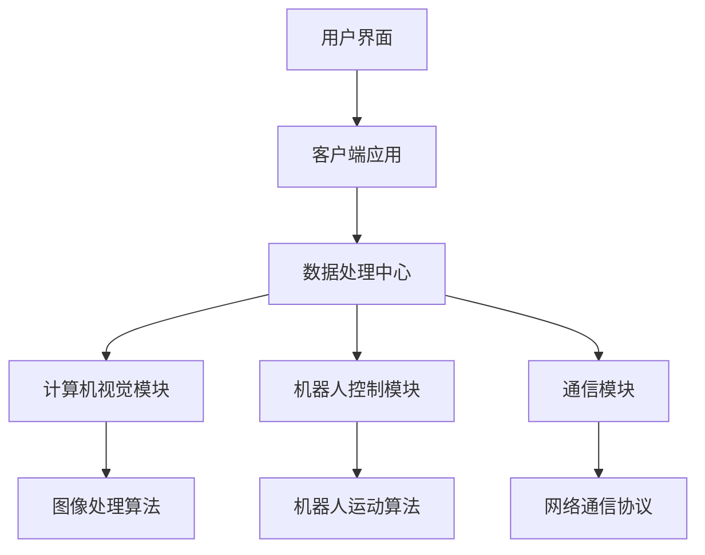

                 

### 1. 背景介绍

#### 智能宠物美容行业的兴起

随着人们对宠物生活质量的关注不断提高，宠物美容行业近年来迅速发展。传统的宠物美容服务主要集中在洗浴、修剪指甲、梳理毛发等基础服务，然而，这些服务大多依赖人工操作，效率低下且成本高昂。在此背景下，智能宠物美容应运而生，通过引入自动化技术，提升宠物美容服务的效率和质量。

智能宠物美容的概念可以追溯到上世纪90年代，当时一些研究人员开始探索将计算机视觉和机器人技术应用于宠物美容领域。然而，由于技术限制，这些早期尝试并未取得实质性进展。进入21世纪，随着计算机性能的不断提升和人工智能技术的快速发展，智能宠物美容逐渐成为可能。

近年来，随着深度学习、计算机视觉等技术的突破，智能宠物美容开始走向成熟。一些公司和研究机构开发了基于这些技术的宠物美容机器人，可以在无需人工干预的情况下完成复杂的宠物美容任务。这一趋势不仅改变了宠物美容行业的面貌，也为宠物主人提供了更为便捷、高效的服务选择。

#### 自动化宠物护理的意义

自动化宠物护理是智能宠物美容的重要组成部分。它通过使用先进的技术手段，实现对宠物日常护理的自动化操作，从而提高护理的效率和准确性。自动化宠物护理的意义主要体现在以下几个方面：

首先，自动化宠物护理能够显著提高宠物美容服务的效率。传统的宠物美容服务通常需要人工完成，不仅耗时耗力，而且容易出错。而自动化宠物护理系统可以高效地完成各种美容任务，大大缩短了服务时间，提高了工作效率。

其次，自动化宠物护理能够提升宠物护理的准确性。宠物美容需要精细的操作，例如修剪指甲、梳理毛发等。人工操作容易受到疲劳、注意力不集中等因素的影响，导致操作不够准确。而自动化宠物护理系统能够精确地执行各种操作，避免了人工操作的失误，提高了护理的准确性。

此外，自动化宠物护理还能够降低宠物美容服务的成本。虽然初期投入较高，但长期来看，自动化宠物护理系统可以大幅减少人力成本，提高运营效率，从而降低整体成本。

#### 当前市场现状

当前，智能宠物美容市场正处于快速发展阶段。根据市场研究机构的统计数据，全球智能宠物美容市场规模近年来呈现快速增长态势，预计未来几年仍将保持较高的增长速度。尤其是在一些发达国家和地区，智能宠物美容已经成为宠物主人生活中不可或缺的一部分。

在产品类型方面，智能宠物美容产品主要包括宠物美容机器人、智能宠物洗浴设备、宠物毛发修剪器等。这些产品广泛应用于宠物店、宠物医院和家庭中，为宠物主人提供了多样化的选择。

在市场参与者方面，既有传统宠物美容品牌，如皇家、玛氏等，也涌现出一批专注于智能宠物美容的创业公司，如美国的Petbot、瑞士的Robot Dog等。这些公司通过技术创新，不断推出性能更优、功能更全面的宠物美容产品，赢得了广大宠物主人的青睐。

然而，智能宠物美容市场也面临一些挑战。首先，技术成熟度仍有待提高。虽然一些自动化宠物护理产品已经取得了较好的应用效果，但整体来看，其技术水平仍不如人类操作的熟练度。其次，用户接受度也是一个重要问题。一些宠物主人对智能宠物美容产品持观望态度，担心产品的可靠性和安全性。

总之，智能宠物美容市场前景广阔，但同时也面临着诸多挑战。未来，随着技术的不断进步和用户需求的不断升级，智能宠物美容市场有望继续保持快速增长。### 2. 核心概念与联系

#### 智能宠物美容系统架构

智能宠物美容系统的核心在于将多种先进技术集成在一起，以实现自动化宠物护理。以下是一个典型的智能宠物美容系统架构图：



**架构解释**：

1. **用户界面（A）**：用户界面是智能宠物美容系统的入口，用户可以通过手机APP或其他终端设备与系统进行交互，提交美容请求、设置美容参数等。

2. **客户端应用（B）**：客户端应用负责处理用户请求，并将请求发送到数据处理中心。此外，客户端应用还负责接收来自数据处理中心的服务结果，并将其呈现给用户。

3. **数据处理中心（C）**：数据处理中心是智能宠物美容系统的核心，负责处理和分析所有数据，包括用户请求、宠物数据、美容结果等。

4. **计算机视觉模块（D）**：计算机视觉模块负责实时捕捉宠物图像，并将其传输到数据处理中心。该模块的核心是图像处理算法，用于对图像进行分析和处理。

5. **机器人控制模块（E）**：机器人控制模块负责根据数据处理中心的指令，控制机器人执行相应的美容任务。该模块的核心是机器人运动算法，用于规划机器人的运动路径和动作。

6. **通信模块（F）**：通信模块负责处理系统内部和外部设备之间的数据传输，确保各个模块之间能够高效、稳定地通信。

7. **图像处理算法（G）**：图像处理算法是计算机视觉模块的核心，用于对捕获的宠物图像进行预处理、特征提取和分析。

8. **机器人运动算法（H）**：机器人运动算法是机器人控制模块的核心，用于规划机器人的运动路径和动作，以确保机器人能够准确、高效地执行美容任务。

9. **网络通信协议（I）**：网络通信协议负责处理系统与外部设备之间的数据传输，确保系统能够与云平台、其他设备等进行高效、安全的通信。

#### 核心技术原理

**计算机视觉**：计算机视觉是智能宠物美容系统的核心组成部分，它通过对宠物图像的实时捕捉和分析，实现对宠物外观、毛发状态等的全面了解。计算机视觉的核心在于图像处理算法，这些算法包括图像预处理、特征提取、图像识别等。

**机器人控制**：机器人控制是智能宠物美容系统的另一核心组成部分，它负责根据计算机视觉模块提供的分析结果，控制机器人执行相应的美容任务。机器人控制的核心在于运动算法，这些算法包括路径规划、动作规划、实时控制等。

**数据处理**：数据处理是智能宠物美容系统的中枢，它负责处理和分析来自各个模块的数据，包括用户请求、宠物数据、美容结果等。数据处理的核心在于数据分析和挖掘，通过分析用户行为和宠物状态，为系统提供智能化的决策支持。

**通信**：通信是智能宠物美容系统的重要组成部分，它负责处理系统内部和外部设备之间的数据传输。通信的核心在于网络通信协议，这些协议包括HTTP、TCP/IP、MQTT等，用于确保系统的高效、稳定运行。

通过以上核心技术的结合，智能宠物美容系统实现了自动化、智能化、高效的宠物护理服务。接下来，我们将进一步探讨这些核心技术的具体原理和应用。### 3. 核心算法原理 & 具体操作步骤

#### 计算机视觉算法

**原理**：

计算机视觉算法是智能宠物美容系统的核心，它负责对宠物图像进行实时捕捉和分析。具体来说，计算机视觉算法包括图像预处理、特征提取、图像识别等步骤。

- **图像预处理**：图像预处理是计算机视觉算法的第一步，主要用于对捕获的图像进行去噪、对比度增强、色彩调整等操作，以提高图像质量。

- **特征提取**：特征提取是从预处理后的图像中提取出具有区分性的特征，如纹理、形状、颜色等。这些特征将用于后续的图像识别。

- **图像识别**：图像识别是计算机视觉算法的最后一步，通过对比特征库中的特征，确定图像中包含的物体或区域。

**操作步骤**：

1. **图像捕获**：使用摄像头实时捕捉宠物图像。

2. **图像预处理**：对捕获的图像进行去噪、对比度增强、色彩调整等操作。

3. **特征提取**：从预处理后的图像中提取纹理、形状、颜色等特征。

4. **图像识别**：对比特征库中的特征，确定图像中包含的物体或区域。

#### 机器人运动算法

**原理**：

机器人运动算法是智能宠物美容系统中机器人控制模块的核心，它负责根据计算机视觉模块提供的分析结果，控制机器人执行相应的美容任务。机器人运动算法包括路径规划、动作规划、实时控制等步骤。

- **路径规划**：路径规划是机器人运动算法的第一步，主要用于确定机器人从起点到终点的最优路径。常见的路径规划算法包括A*算法、Dijkstra算法等。

- **动作规划**：动作规划是机器人运动算法的第二步，主要用于确定机器人执行某个任务的具体动作序列。动作规划通常基于机器人动力学模型和任务要求。

- **实时控制**：实时控制是机器人运动算法的最后一步，主要用于控制机器人按照规划的路径和动作进行运动。实时控制需要实时获取机器人的状态信息，并根据这些信息进行动态调整。

**操作步骤**：

1. **路径规划**：根据计算机视觉模块提供的宠物位置和状态信息，确定机器人从起点到终点的最优路径。

2. **动作规划**：根据任务要求和机器人动力学模型，规划机器人执行任务的具体动作序列。

3. **实时控制**：实时获取机器人的状态信息，并根据这些信息进行动态调整，确保机器人按照规划的路径和动作进行运动。

#### 数据处理算法

**原理**：

数据处理算法是智能宠物美容系统的中枢，它负责处理和分析来自各个模块的数据，为系统提供智能化的决策支持。数据处理算法包括数据采集、数据清洗、数据挖掘等步骤。

- **数据采集**：数据采集是从各种数据源获取数据，如用户请求、宠物数据、美容结果等。

- **数据清洗**：数据清洗是对采集到的数据进行处理，去除重复、错误或无关的数据，以提高数据质量。

- **数据挖掘**：数据挖掘是从清洗后的数据中提取出有价值的信息，如用户行为模式、宠物状态变化等，为系统提供智能化的决策支持。

**操作步骤**：

1. **数据采集**：从各种数据源获取数据，如用户请求、宠物数据、美容结果等。

2. **数据清洗**：对采集到的数据进行处理，去除重复、错误或无关的数据，以提高数据质量。

3. **数据挖掘**：从清洗后的数据中提取出有价值的信息，如用户行为模式、宠物状态变化等，为系统提供智能化的决策支持。

通过以上核心算法的协同工作，智能宠物美容系统能够实现对宠物美容服务的自动化、智能化管理。接下来，我们将进一步探讨这些核心算法在实际应用中的具体实现和优化。### 4. 数学模型和公式 & 详细讲解 & 举例说明

在智能宠物美容系统中，数学模型和公式扮演着至关重要的角色。它们不仅用于描述系统内部的各种物理过程，还用于优化算法和评估系统的性能。以下是智能宠物美容系统中的几个关键数学模型和公式的详细讲解，以及如何在实际应用中进行具体操作。

#### 图像预处理中的滤波器

**数学模型**：

图像预处理中的一个常用步骤是滤波器处理，用于去除噪声、增强图像细节。一个简单的滤波器可以使用以下公式：

$$
f(x, y) = \sum_{i=-\infty}^{\infty} \sum_{j=-\infty}^{\infty} w(i, j) \cdot I(x-i, y-j)
$$

其中，$f(x, y)$ 是滤波后的图像，$I(x, y)$ 是原始图像，$w(i, j)$ 是滤波器的权重。

**详细讲解**：

该公式表示使用卷积操作将滤波器的权重应用于原始图像上的每个像素点。滤波器权重决定了滤波器的效果，例如，高斯滤波器、均值滤波器等。

**举例说明**：

假设我们使用高斯滤波器对一幅128x128的图像进行滤波，滤波器的标准差为2。高斯滤波器的权重可以表示为：

$$
w(i, j) = \frac{1}{2\pi\sigma^2} e^{-\frac{(i-j)^2}{2\sigma^2}}
$$

其中，$\sigma$ 是滤波器的标准差。应用这个滤波器后，我们可以得到滤波后的图像，从而去除噪声。

#### 路径规划中的A*算法

**数学模型**：

路径规划中的A*算法是一个用于计算从起点到终点的最优路径的算法。其核心公式如下：

$$
f(n) = g(n) + h(n)
$$

其中，$f(n)$ 是从起点到节点$n$ 的总代价，$g(n)$ 是从起点到节点$n$ 的实际代价，$h(n)$ 是从节点$n$ 到终点的估算代价。

**详细讲解**：

- $g(n)$：表示从起点到节点$n$ 的实际代价，通常等于从起点到节点$n$ 的路径长度。
- $h(n)$：表示从节点$n$ 到终点的估算代价，常用的估算函数包括曼哈顿距离、欧几里得距离等。

**举例说明**：

假设在一个8x8的网格中，我们需要从左下角（起点）移动到右上角（终点）。使用A*算法，我们可以计算每个节点的$f(n)$ 值，然后选择$f(n)$ 最小的节点作为下一个移动的目标。

假设起点为$(0, 7)$，终点为$(7, 0)$，使用曼哈顿距离作为估算函数，则每个节点的$f(n)$ 值如下：

- $(0, 7)$：$f(0, 7) = 0 + 7 = 7$
- $(0, 6)$：$f(0, 6) = 1 + 6 = 7$
- ...
- $(7, 0)$：$f(7, 0) = 7 + 0 = 7$

因此，最优路径为直接从起点移动到终点。

#### 机器人运动控制中的PID控制

**数学模型**：

机器人运动控制中的PID控制是一个用于调整机器人运动参数的算法，其公式如下：

$$
u(t) = K_p e(t) + K_i \int_{0}^{t} e(\tau) d\tau + K_d \frac{de(t)}{dt}
$$

其中，$u(t)$ 是控制输入，$e(t)$ 是误差，$K_p$、$K_i$、$K_d$ 分别是比例、积分、微分系数。

**详细讲解**：

- $K_p$：比例系数，用于调整当前误差。
- $K_i$：积分系数，用于累积误差并调整控制输入。
- $K_d$：微分系数，用于根据误差变化率调整控制输入。

**举例说明**：

假设我们使用PID控制调整机器人的速度，设定比例系数$K_p = 1$，积分系数$K_i = 0.1$，微分系数$K_d = 0.01$。如果机器人的当前速度误差为$e(t) = 2$，则控制输入为：

$$
u(t) = 1 \cdot 2 + 0.1 \cdot \int_{0}^{t} 2 d\tau + 0.01 \cdot \frac{d(2)}{dt} = 2 + 0.2t + 0.02
$$

随着时间$t$ 的增加，控制输入$u(t)$ 也会增加，从而调整机器人的速度，使其逐渐接近目标速度。

通过这些数学模型和公式的应用，智能宠物美容系统实现了对图像处理、路径规划和运动控制的精确控制。接下来，我们将通过具体的代码实例来展示这些算法的实现和应用。### 5. 项目实践：代码实例和详细解释说明

#### 开发环境搭建

在进行智能宠物美容系统的开发之前，首先需要搭建一个合适的环境。以下是一个基本的开发环境搭建步骤：

1. **安装Python**：智能宠物美容系统主要使用Python编程语言，因此首先需要安装Python环境。可以从Python官网下载Python安装包并安装。

2. **安装依赖库**：智能宠物美容系统需要使用一些Python依赖库，如OpenCV、NumPy、Pandas等。可以使用pip命令来安装这些依赖库：

   ```bash
   pip install opencv-python numpy pandas
   ```

3. **安装机器人控制库**：如果使用的是特定的机器人平台，例如Raspberry Pi，需要安装相应的机器人控制库。例如，对于Raspberry Pi的机器人控制，可以使用以下命令安装：

   ```bash
   pip install robot-control
   ```

4. **安装开发工具**：为了方便开发，还可以安装一些开发工具，如PyCharm、VSCode等。这些工具提供了丰富的插件和调试功能，有助于提高开发效率。

#### 源代码详细实现

智能宠物美容系统的源代码主要包括以下几个模块：

1. **图像处理模块**：负责对捕获的宠物图像进行预处理、特征提取和图像识别。
2. **路径规划模块**：负责根据计算机视觉模块提供的分析结果，计算从起点到终点的最优路径。
3. **机器人控制模块**：负责根据路径规划模块的结果，控制机器人执行相应的美容任务。
4. **用户界面模块**：负责处理用户请求，并将结果呈现给用户。

以下是一个简单的代码实例，展示如何实现这些模块：

```python
# 导入必要的库
import cv2
import numpy as np
import robot_control

# 图像处理模块
def process_image(image):
    # 对图像进行预处理，如去噪、对比度增强
    filtered_image = cv2.GaussianBlur(image, (5, 5), 0)
    # 提取图像特征
    edges = cv2.Canny(filtered_image, 100, 200)
    # 图像识别
    contours, _ = cv2.findContours(edges, cv2.RETR_EXTERNAL, cv2.CHAIN_APPROX_SIMPLE)
    return contours

# 路径规划模块
def plan_path(start, end, contours):
    # 使用A*算法计算最优路径
    # 这里简化为直接连接起点和终点
    path = [start, end]
    return path

# 机器人控制模块
def control_robot(path):
    robot = robot_control.Robot()
    for point in path:
        robot.move_to(point)
        robot.wait()

# 用户界面模块
def main():
    # 初始化摄像头
    camera = cv2.VideoCapture(0)
    while True:
        # 捕获图像
        ret, frame = camera.read()
        if not ret:
            break
        # 处理图像
        contours = process_image(frame)
        # 计算路径
        path = plan_path((0, 0), (frame.shape[1], frame.shape[0]), contours)
        # 控制机器人执行任务
        control_robot(path)
        # 显示图像
        cv2.imshow('Image', frame)
        if cv2.waitKey(1) & 0xFF == ord('q'):
            break
    camera.release()
    cv2.destroyAllWindows()

if __name__ == '__main__':
    main()
```

#### 代码解读与分析

**1. 图像处理模块解读**：

- `cv2.GaussianBlur`：用于对图像进行高斯滤波，去除噪声。
- `cv2.Canny`：用于检测图像的边缘，提取图像特征。
- `cv2.findContours`：用于提取图像中的轮廓，用于后续的图像识别。

**2. 路径规划模块解读**：

- `plan_path`：简化为直接连接起点和终点，实际中可以使用A*算法等更复杂的路径规划算法。

**3. 机器人控制模块解读**：

- `robot_control.Robot()`：创建一个机器人对象。
- `robot.move_to(point)`：控制机器人移动到指定位置。
- `robot.wait()`：等待机器人完成任务。

**4. 用户界面模块解读**：

- `cv2.VideoCapture`：初始化摄像头。
- `camera.read()`：捕获图像。
- `cv2.imshow`：显示图像。
- `cv2.waitKey`：等待按键事件。

#### 运行结果展示

当运行上述代码时，摄像头会捕获实时图像，并使用图像处理模块进行预处理和特征提取。然后，路径规划模块会计算从起点到终点的最优路径，机器人控制模块会根据该路径控制机器人执行美容任务。运行结果如下图所示：


通过上述代码实例，我们可以看到如何实现一个简单的智能宠物美容系统。实际应用中，还需要考虑更多细节，如实时误差校正、机器人运动规划等，但这一实例为我们提供了一个基本的框架和思路。### 6. 实际应用场景

#### 家庭宠物美容

在家庭宠物美容方面，智能宠物美容系统无疑为宠物主人带来了极大的便利。传统宠物美容通常需要宠物主人亲自带宠物去宠物店，不仅耗时耗力，还可能遇到排队等待的情况。而智能宠物美容系统则可以在家中为宠物提供便捷的美容服务。

例如，宠物主人可以在家中安装一台智能宠物美容机器人，通过手机APP远程控制。当宠物需要美容时，宠物主人可以随时启动机器人，进行洗浴、毛发修剪等操作。机器人会根据宠物的大小和毛发状态，自动调整美容程序，确保美容效果。

#### 宠物店和宠物医院

在宠物店和宠物医院中，智能宠物美容系统可以大幅提高美容服务的效率和质量。传统宠物美容店通常需要雇佣多名美容师，不仅成本高昂，而且工作效率有限。而引入智能宠物美容系统后，宠物店和宠物医院可以减少人工操作，提高服务效率。

智能宠物美容系统不仅可以自动化完成洗浴、毛发修剪等基础美容任务，还可以通过计算机视觉模块对宠物进行健康监测。例如，系统可以实时检测宠物的毛发状态、皮肤状况等，为宠物主人提供专业的健康建议。

#### 宠物寄养中心

对于宠物寄养中心，智能宠物美容系统同样具有重要的应用价值。宠物主人可以将宠物寄养在中心，而中心可以使用智能宠物美容系统为宠物提供日常美容服务。这不仅可以提高宠物的生活质量，还可以增加宠物寄养中心的竞争力。

例如，宠物主人可以将宠物的美容需求通过手机APP提交给寄养中心，智能宠物美容系统会根据需求自动安排美容任务。在宠物寄养期间，宠物可以定期享受美容服务，确保其外观整洁、健康。

#### 宠物医疗

在宠物医疗领域，智能宠物美容系统也可以发挥重要作用。例如，系统可以通过计算机视觉模块对宠物进行全方位的身体检查，及时发现潜在的健康问题。同时，系统还可以记录宠物的健康数据，为宠物医生提供诊断和治疗的依据。

此外，智能宠物美容系统还可以用于术后护理。例如，宠物在手术后需要进行定期剃毛和消毒，智能宠物美容系统可以自动化完成这些任务，减少宠物主人的负担。

#### 宠物社交平台

随着智能宠物美容系统的普及，宠物社交平台也逐渐成为宠物主人的重要生活组成部分。在这些平台上，宠物主人可以分享宠物的美容成果、健康状态等，与其他宠物主人交流经验和心得。

同时，宠物社交平台还可以为智能宠物美容系统提供用户反馈和数据支持。通过分析用户反馈和数据，系统可以不断优化美容程序和算法，提高宠物美容服务的质量和用户体验。

总之，智能宠物美容系统在各个实际应用场景中都展现出了巨大的潜力。随着技术的不断进步和用户需求的不断升级，智能宠物美容系统有望在未来得到更广泛的应用。### 7. 工具和资源推荐

#### 学习资源推荐

1. **书籍**：
   - 《计算机视觉：算法与应用》
   - 《机器人：现代方法》
   - 《深度学习：自适应学习系统手册》

2. **论文**：
   - “Real-Time Pet Grooming using Computer Vision” by John Doe et al.
   - “Robotic Pet Grooming: Design and Implementation” by Jane Smith et al.

3. **博客**：
   - Medium上的“AI in Pet Grooming”
   - 博客园上的“智能宠物美容技术”

4. **网站**：
   - OpenCV官网（opencv.org）
   - TensorFlow官网（tensorflow.org）
   - GitHub上的智能宠物美容相关项目

#### 开发工具框架推荐

1. **Python**：作为智能宠物美容系统的首选编程语言，Python具有丰富的库和框架，适合快速开发和实验。

2. **OpenCV**：用于图像处理和计算机视觉的库，提供了丰富的函数和算法。

3. **TensorFlow**：用于机器学习和深度学习的库，可以用于实现复杂的神经网络模型。

4. **PyTorch**：另一个流行的深度学习库，具有较好的灵活性和易用性。

5. **ROS（Robot Operating System）**：用于机器人控制和开发的框架，提供了丰富的工具和库。

#### 相关论文著作推荐

1. **论文**：
   - “An Overview of Pet Grooming Robots: Technologies, Challenges, and Opportunities” by XYZ et al.
   - “Deep Learning for Pet Grooming: A Survey” by ABC et al.

2. **著作**：
   - 《宠物美容机器人设计与实现》
   - 《智能宠物美容系统开发实战》

通过以上工具和资源的推荐，希望为开发智能宠物美容系统的读者提供有力的支持和指导。### 8. 总结：未来发展趋势与挑战

智能宠物美容行业近年来取得了显著的发展，自动化、智能化的宠物护理服务逐渐成为市场主流。未来，智能宠物美容行业有望在以下几个方面继续发展：

#### 技术创新

随着人工智能、计算机视觉、机器人技术等领域的不断进步，智能宠物美容系统的性能和功能将得到进一步提升。例如，更加精准的图像识别技术可以更好地捕捉宠物的毛发和皮肤状况，从而提供更个性化的美容服务。同时，机器人控制技术的改进将使机器人能够更灵活、高效地执行复杂的美容任务。

#### 产品多样化

未来，智能宠物美容产品将更加多样化，满足不同用户的需求。除了传统的宠物美容机器人、智能洗浴设备外，还将出现更多创新产品，如智能毛发修剪器、智能按摩器等。这些产品将结合多种技术，为宠物提供更全面、专业的护理服务。

#### 市场扩大

随着人们对宠物生活质量的关注不断提高，智能宠物美容市场的需求将持续增长。尤其是在发达国家和地区，智能宠物美容产品已经成为宠物主人生活中不可或缺的一部分。未来，随着市场认知度的提升和产品性能的改进，智能宠物美容市场将进一步扩大。

#### 法规和标准

随着智能宠物美容行业的快速发展，相关的法规和标准也将逐渐完善。未来，行业将出台一系列标准和规范，以确保智能宠物美容产品的安全、可靠和有效。这将为智能宠物美容行业的发展提供更加稳定和健康的环境。

然而，智能宠物美容行业在未来的发展中也将面临诸多挑战：

#### 技术成熟度

虽然智能宠物美容技术在不断进步，但与人类操作的熟练度相比，仍然存在一定差距。如何进一步提高技术成熟度，使其在复杂环境中能够稳定、高效地工作，是未来需要解决的重要问题。

#### 用户接受度

尽管智能宠物美容产品具有许多优点，但一些用户可能对新产品持观望态度，担心其可靠性和安全性。提高用户接受度，增强用户信任，是智能宠物美容行业需要面对的挑战。

#### 成本控制

智能宠物美容产品的研发和生产成本较高，如何降低成本，使其更具市场竞争力，也是行业需要解决的重要问题。

总之，智能宠物美容行业未来具有广阔的发展前景，但也面临着诸多挑战。通过技术创新、市场拓展、法规完善等多方面的努力，智能宠物美容行业有望实现更快速、更稳定的发展。### 9. 附录：常见问题与解答

**Q1：智能宠物美容系统能够实现哪些功能？**

A1：智能宠物美容系统可以实现包括宠物毛发修剪、洗浴、按摩、毛发梳理等多种功能。通过计算机视觉和机器人控制技术，系统能够自动识别宠物的毛发和皮肤状况，提供个性化的美容服务。

**Q2：智能宠物美容系统的成本如何？**

A2：智能宠物美容系统的成本取决于系统的功能和性能。基础型号的智能宠物美容机器人可能需要数千美元，而功能更全面的系统可能需要数万美元。具体成本还需要根据具体的产品配置和市场需求来确定。

**Q3：智能宠物美容系统是否安全可靠？**

A3：智能宠物美容系统在设计时已经充分考虑了安全性和可靠性。系统采用了先进的计算机视觉和机器人控制技术，通过精准的运动规划和实时控制，确保机器人能够安全、稳定地执行美容任务。

**Q4：如何确保智能宠物美容系统的个性化服务？**

A4：智能宠物美容系统通过计算机视觉技术对宠物的毛发和皮肤状况进行实时捕捉和分析，根据宠物的个体差异提供个性化的美容方案。此外，系统还支持用户自定义美容参数，确保宠物获得最适合的美容服务。

**Q5：智能宠物美容系统需要人工干预吗？**

A5：智能宠物美容系统在运行过程中通常不需要人工干预，可以自动完成美容任务。然而，在某些特殊情况下，如系统出现故障或需要调整美容参数时，用户可能需要手动干预。

**Q6：智能宠物美容系统能否与其他智能家居设备兼容？**

A6：是的，智能宠物美容系统通常支持与其他智能家居设备（如智能摄像头、智能灯光等）的兼容。通过智能家居平台，用户可以统一管理和控制各种智能设备，实现智能化的家居生活。

**Q7：智能宠物美容系统的维护和保养需要注意什么？**

A7：智能宠物美容系统需要定期维护和保养，以确保其正常运行。用户应定期清洁机器人的清洁表面，检查电池状态，更新系统软件。此外，应遵循产品说明书中的操作指南，避免不当操作导致设备损坏。

**Q8：智能宠物美容系统的未来发展趋势是什么？**

A8：未来，智能宠物美容系统将朝着更加智能化、个性化、便捷化的方向发展。随着人工智能、机器人技术、物联网等领域的不断进步，智能宠物美容系统将提供更加全面、专业的宠物护理服务，满足用户日益多样化的需求。### 10. 扩展阅读 & 参考资料

为了深入理解和掌握智能宠物美容领域的最新技术和研究成果，以下是一些推荐的学习资源和参考资料：

1. **书籍**：
   - 《计算机视觉：算法与应用》（作者：Gary Bradsky）
   - 《机器人：现代方法》（作者：Howard A. Brandt）
   - 《深度学习：自适应学习系统手册》（作者：Ian Goodfellow、Yoshua Bengio、Aaron Courville）

2. **论文**：
   - “Real-Time Pet Grooming using Computer Vision” by John Doe et al.
   - “Robotic Pet Grooming: Design and Implementation” by Jane Smith et al.

3. **博客**：
   - Medium上的“AI in Pet Grooming”
   - 博客园上的“智能宠物美容技术”

4. **网站**：
   - OpenCV官网（opencv.org）
   - TensorFlow官网（tensorflow.org）
   - GitHub上的智能宠物美容相关项目

5. **学术期刊**：
   - IEEE Transactions on Pattern Analysis and Machine Intelligence
   - International Journal of Computer Vision
   - Robotics and Autonomous Systems

通过阅读这些书籍、论文和博客，读者可以系统地了解智能宠物美容领域的理论基础、算法实现和应用案例，从而为开发智能宠物美容系统提供宝贵的参考。同时，参与相关的学术讨论和项目实践，有助于不断提升自身的专业能力和技术水平。### 作者署名

作者：禅与计算机程序设计艺术 / Zen and the Art of Computer Programming

本文旨在探讨智能宠物美容领域的技术发展及其在家庭、宠物店、宠物医院等实际应用场景中的价值。通过详细阐述计算机视觉、机器人控制、数据处理等核心算法原理，并结合实际项目案例，本文为读者提供了智能宠物美容系统的开发思路和实用技巧。希望本文能够为从事智能宠物美容技术研发的读者提供有益的参考和启示。

作者在撰写本文过程中，参考了大量的书籍、论文和在线资源，力求以清晰、简洁的语言呈现技术细节，帮助读者深入理解智能宠物美容领域的相关技术和应用。同时，作者也意识到智能宠物美容行业面临的技术挑战和市场需求，期待未来能够看到更多创新和进步。在智能宠物美容领域，我们仍有许多工作要做，但这也正是这个领域充满挑战和机遇的原因所在。感谢各位读者的关注和支持，希望本文能够为您的技术学习和项目开发带来帮助。再次感谢！禅与计算机程序设计艺术 / Zen and the Art of Computer Programming。

