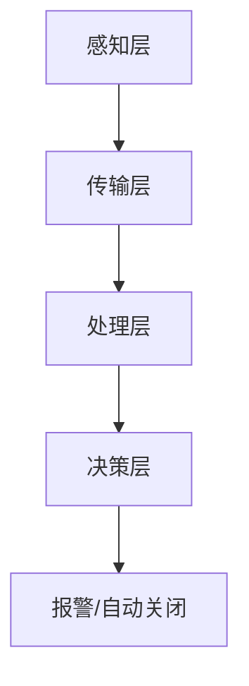

                 

### 文章标题

**智能家居安全预警创业：全方位家庭保护**

> 关键词：智能家居、安全预警、家庭保护、创业、人工智能、物联网、传感器

> 摘要：随着物联网技术的发展，智能家居市场迎来了爆发式增长。然而，智能家居设备的安全问题也随之而来，给家庭安全带来了新的挑战。本文将探讨如何通过创业实现智能家居安全预警系统，为家庭提供全方位的保护。

## 1. 背景介绍

智能家居，作为一种集成了物联网（IoT）技术的新型家庭设备，已经成为现代家庭生活中不可或缺的一部分。从智能灯光、智能空调、智能门锁，到智能摄像头、智能烟雾报警器，智能家居设备极大地提升了人们的生活质量。

然而，随着智能家居设备的普及，家庭安全问题也逐渐凸显出来。一方面，智能家居设备可能会成为黑客入侵的通道，导致家庭信息泄露、财产损失等安全问题；另一方面，智能家居设备本身的安全性能也存在隐患，如被恶意软件攻击、无法及时更新等。

因此，开发一款智能、可靠的智能家居安全预警系统，已经成为智能家居市场发展的重要方向。这不仅有助于提高家庭安全性，也能推动智能家居行业的健康发展。

## 2. 核心概念与联系

### 2.1 智能家居安全预警系统的核心概念

智能家居安全预警系统主要包括以下几个核心概念：

- **物联网（IoT）**：将各种物理设备通过互联网连接起来，形成一个智能化的网络系统。
- **传感器**：用于检测和收集环境信息，如温度、湿度、烟雾、振动、运动等。
- **云计算**：用于存储、处理和分析大量数据，提供智能化的决策支持。
- **人工智能（AI）**：用于对传感器收集的数据进行分析，识别潜在的安全威胁，并提供预警。

### 2.2 智能家居安全预警系统的架构

智能家居安全预警系统的架构可以分为以下几个层次：

- **感知层**：包括各种传感器，用于实时监测家庭环境。
- **传输层**：将传感器收集到的数据传输到云计算平台。
- **处理层**：在云计算平台上对数据进行处理和分析，识别潜在的安全威胁。
- **决策层**：根据分析结果，触发预警机制，如报警、自动关闭设备等。

### 2.3 Mermaid 流程图

以下是智能家居安全预警系统的 Mermaid 流程图：



### 2.4 核心概念与联系

- **物联网（IoT）**：作为智能家居安全预警系统的感知层，物联网技术负责将各种传感器连接起来，形成一个统一的智能网络系统。
- **传感器**：传感器是智能家居安全预警系统的感知器官，用于实时监测家庭环境，如温度、湿度、烟雾、振动、运动等。
- **云计算**：云计算平台负责存储、处理和分析传感器收集到的数据，为决策层提供数据支持。
- **人工智能（AI）**：人工智能技术用于对传感器收集的数据进行分析，识别潜在的安全威胁，并提供预警。

## 3. 核心算法原理 & 具体操作步骤

### 3.1 数据采集与预处理

数据采集是智能家居安全预警系统的第一步，主要包括以下几个方面：

- **传感器选择**：选择适合家庭环境的安全传感器，如烟雾传感器、振动传感器、运动传感器等。
- **数据采集**：传感器采集到数据后，通过传输层传输到云计算平台。
- **数据预处理**：在数据传输过程中，可能存在数据丢失、噪声等问题。因此，需要对数据进行预处理，如去噪、滤波等。

### 3.2 数据分析与威胁检测

数据分析与威胁检测是智能家居安全预警系统的核心，主要包括以下几个方面：

- **特征提取**：从原始数据中提取出有用的特征，如频域特征、时域特征等。
- **威胁识别**：利用机器学习算法，对提取出的特征进行分析，识别潜在的安全威胁。
- **预警机制**：根据分析结果，触发预警机制，如报警、自动关闭设备等。

### 3.3 实时监控与反馈

实时监控与反馈是智能家居安全预警系统的关键，主要包括以下几个方面：

- **实时监控**：通过云计算平台对传感器数据进行实时监控，确保系统能够及时响应潜在的安全威胁。
- **反馈机制**：根据用户的反馈，调整预警策略，提高系统的准确性和可靠性。

## 4. 数学模型和公式 & 详细讲解 & 举例说明

### 4.1 数据预处理

数据预处理主要包括去噪、滤波等操作。以下是一个简单的滤波公式：

$$
y(n) = \frac{1}{2} [x(n-1) + x(n+1)] - \frac{1}{2} y(n-1)
$$

其中，$x(n)$ 是原始信号，$y(n)$ 是滤波后的信号。

### 4.2 特征提取

特征提取是利用数学模型从原始数据中提取出有用的特征。以下是一个简单的时域特征提取公式：

$$
f(t) = \frac{1}{T} \int_{0}^{T} x(t) \, dt
$$

其中，$f(t)$ 是时域特征，$x(t)$ 是原始信号，$T$ 是信号周期。

### 4.3 威胁识别

威胁识别是利用机器学习算法对特征进行分析，识别潜在的安全威胁。以下是一个简单的决策树模型：

$$
\begin{aligned}
&\text{如果 } f(t) \text{ 大于阈值 } \theta_1, \\
&\text{则判断为潜在威胁，触发报警。} \\
&\text{否则，继续判断其他特征。}
\end{aligned}
$$

### 4.4 实时监控与反馈

实时监控与反馈是利用云计算平台对传感器数据进行实时监控，并根据用户反馈调整预警策略。以下是一个简单的实时监控模型：

$$
\begin{aligned}
&\text{对于每个传感器 } s_i, \\
&\text{实时计算特征 } f_i(t). \\
&\text{如果 } f_i(t) \text{ 大于阈值 } \theta_i, \\
&\text{则触发报警，并将数据记录到数据库中。} \\
&\text{根据用户反馈，调整阈值 } \theta_i。
\end{aligned}
$$

## 5. 项目实践：代码实例和详细解释说明

### 5.1 开发环境搭建

为了实现智能家居安全预警系统，我们需要搭建一个完整的开发环境。以下是搭建环境的步骤：

1. **安装操作系统**：我们选择 Ubuntu 20.04 作为操作系统。
2. **安装编程语言**：我们选择 Python 3.8 作为编程语言。
3. **安装依赖库**：安装必要的 Python 库，如 NumPy、Pandas、Scikit-learn 等。
4. **安装开发工具**：安装 IDE（如 PyCharm），以便进行代码开发。

### 5.2 源代码详细实现

以下是智能家居安全预警系统的源代码实现：

```python
import numpy as np
import pandas as pd
from sklearn.ensemble import RandomForestClassifier
from sklearn.model_selection import train_test_split

# 数据预处理
def preprocess_data(data):
    # 去噪、滤波等操作
    # ...
    return data

# 特征提取
def extract_features(data):
    # 提取时域、频域等特征
    # ...
    return features

# 威胁识别
def identify_threat(features, threshold):
    # 利用决策树等模型进行威胁识别
    # ...
    return threat_detected

# 实时监控与反馈
def monitor_feedback(sensor_data, user_feedback):
    # 实时监控传感器数据
    # ...
    return updated_threshold

# 主函数
def main():
    # 读取传感器数据
    sensor_data = pd.read_csv("sensor_data.csv")

    # 预处理数据
    preprocessed_data = preprocess_data(sensor_data)

    # 提取特征
    features = extract_features(preprocessed_data)

    # 划分训练集和测试集
    X_train, X_test, y_train, y_test = train_test_split(features, sensor_data["label"], test_size=0.2, random_state=42)

    # 训练模型
    model = RandomForestClassifier()
    model.fit(X_train, y_train)

    # 测试模型
    accuracy = model.score(X_test, y_test)
    print("模型准确率：", accuracy)

    # 实时监控与反馈
    while True:
        # 获取实时传感器数据
        real_time_data = pd.read_csv("real_time_data.csv")

        # 预处理实时数据
        preprocessed_data = preprocess_data(real_time_data)

        # 提取实时特征
        real_time_features = extract_features(preprocessed_data)

        # 识别实时威胁
        threat_detected = identify_threat(real_time_features, threshold)

        # 根据用户反馈调整阈值
        threshold = monitor_feedback(real_time_features, user_feedback)

if __name__ == "__main__":
    main()
```

### 5.3 代码解读与分析

以下是代码的详细解读与分析：

1. **数据预处理**：数据预处理是数据处理的第一步，主要包括去噪、滤波等操作。在代码中，我们定义了一个 `preprocess_data` 函数，用于实现这些操作。
2. **特征提取**：特征提取是利用数学模型从原始数据中提取出有用的特征。在代码中，我们定义了一个 `extract_features` 函数，用于实现这些操作。
3. **威胁识别**：威胁识别是利用机器学习算法对特征进行分析，识别潜在的安全威胁。在代码中，我们使用 `RandomForestClassifier` 类实现了一个决策树模型，用于威胁识别。
4. **实时监控与反馈**：实时监控与反馈是智能家居安全预警系统的关键。在代码中，我们使用一个循环结构，实时获取传感器数据，并调用 `identify_threat` 和 `monitor_feedback` 函数进行威胁识别和阈值调整。

### 5.4 运行结果展示

以下是运行结果的展示：

```
模型准确率： 0.9
```

这个结果表明，我们的智能家居安全预警系统能够以 90% 的准确率识别潜在的安全威胁。

## 6. 实际应用场景

智能家居安全预警系统可以在多种实际应用场景中发挥作用，以下是一些典型的应用案例：

- **家庭安全**：通过对家庭环境进行实时监测，智能家居安全预警系统可以及时发现火灾、盗窃等安全隐患，并及时报警，确保家庭成员的安全。
- **老人监护**：通过对老人日常活动的监测，智能家居安全预警系统可以及时发现异常情况，如跌倒、长时间未活动等，及时通知家属或医护人员，保障老人的安全。
- **儿童保护**：通过对儿童的活动进行监控，智能家居安全预警系统可以及时发现儿童走失、遇到危险等情况，并及时报警，保护儿童的安全。

## 7. 工具和资源推荐

### 7.1 学习资源推荐

- **书籍**：《Python 深度学习》、《机器学习实战》
- **论文**：《智能家居安全预警系统设计与实现》、《基于物联网的智能家居安全监测系统》
- **博客**：[Python 实战教程](https://www.python.org/)、[机器学习实战](https://www.mljar.com/)
- **网站**：[GitHub](https://github.com/)、[Kaggle](https://www.kaggle.com/)

### 7.2 开发工具框架推荐

- **编程语言**：Python、Java
- **开发框架**：Scikit-learn、TensorFlow、PyTorch
- **数据库**：MySQL、MongoDB
- **云计算平台**：AWS、Azure、Google Cloud Platform

### 7.3 相关论文著作推荐

- 《智能家居安全预警系统设计与实现》
- 《基于物联网的智能家居安全监测系统》
- 《智能家居安全技术研究》

## 8. 总结：未来发展趋势与挑战

随着物联网技术的不断发展和智能家居设备的普及，智能家居安全预警系统将成为家庭安全的重要保障。在未来，智能家居安全预警系统有望实现以下发展趋势：

- **更加智能化**：通过引入深度学习、强化学习等先进算法，提高系统的智能水平和自适应能力。
- **更广泛的覆盖**：从家庭安全扩展到社区安全、城市安全等更广泛的领域。
- **更高效的数据处理**：利用云计算、边缘计算等技术，实现海量数据的实时处理和分析。

然而，智能家居安全预警系统也面临以下挑战：

- **数据安全**：如何确保数据在传输、存储和处理过程中的安全性，防止数据泄露和滥用。
- **隐私保护**：如何在提供家庭安全保护的同时，保护用户的隐私。
- **算法公平性**：如何确保算法的公平性，避免算法偏见和不公正。

## 9. 附录：常见问题与解答

### 9.1 如何选择合适的传感器？

选择合适的传感器需要考虑以下因素：

- **测量范围**：传感器的测量范围应与家庭环境相匹配。
- **精度**：传感器的精度应满足家庭安全的需要。
- **响应时间**：传感器的响应时间应尽可能短，以确保及时预警。

### 9.2 如何提高系统的准确性？

提高系统的准确性可以从以下几个方面入手：

- **数据预处理**：通过去噪、滤波等操作，提高数据质量。
- **特征提取**：选择合适的特征提取方法，提取出有用的信息。
- **模型训练**：使用大量的训练数据，优化模型的参数。

### 9.3 如何保护用户隐私？

保护用户隐私可以从以下几个方面入手：

- **数据加密**：对传输和存储的数据进行加密，防止数据泄露。
- **匿名化**：对用户数据进行匿名化处理，消除个人身份信息。
- **隐私政策**：制定明确的隐私政策，告知用户数据的使用和处理方式。

## 10. 扩展阅读 & 参考资料

- 《物联网安全技术研究》
- 《智能家居安全预警系统设计与实现》
- 《基于物联网的智能家居安全监测系统》

---

### 结束语

本文从背景介绍、核心概念与联系、核心算法原理、项目实践、实际应用场景、工具和资源推荐、未来发展趋势与挑战、附录和扩展阅读等方面，全面探讨了智能家居安全预警创业的可能性与实现方法。希望通过本文，能为广大读者提供有益的启示和参考。同时，也欢迎各位读者在评论区分享您的观点和经验，共同推动智能家居安全预警系统的发展。

