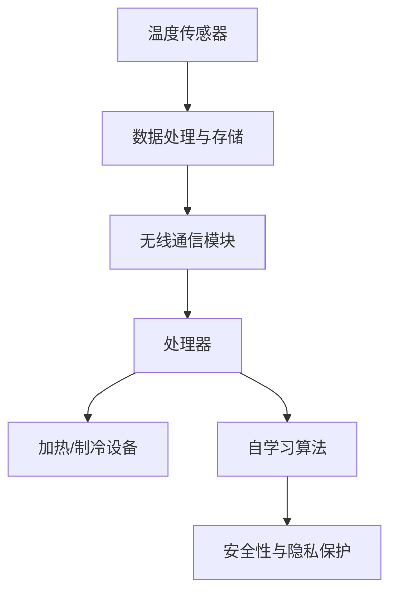

                 

### 背景介绍

智能家居，作为一个创新且迅速发展的领域，正日益融入我们的日常生活。其中，智能恒温器作为智能家居的核心设备之一，已经逐渐成为现代家庭的重要组成部分。其目的是通过智能化的手段，实现对室内温度的精准控制，从而提升居住的舒适度和能源利用效率。

#### 1.1 智能恒温器的起源与发展

智能恒温器的概念起源于20世纪中期，最早的智能恒温器主要由机械装置构成，通过感温包和调节阀门来实现温度控制。随着微电子技术和计算机技术的快速发展，智能恒温器逐渐向数字化、网络化和智能化方向发展。现代智能恒温器通常具备无线连接功能、远程控制能力以及自我学习算法，能够根据用户的生活习惯自动调节温度，提高家庭的舒适度和能源使用效率。

#### 1.2 当前市场状况

目前，智能恒温器市场呈现出快速增长的趋势。根据市场研究公司的数据，全球智能家居市场预计在未来几年内将保持两位数的年复合增长率。智能恒温器作为智能家居的一个重要分支，其市场份额也在逐年增加。市场上涌现出众多知名品牌，如Nest、Ecobee、Honeywell等，它们在技术创新、用户体验和产品功能上各具特色。

#### 1.3 智能恒温器的重要性

智能恒温器的重要性主要体现在以下几个方面：

1. **节能降耗**：通过智能调节室内温度，智能恒温器能够显著降低家庭的能源消耗，有助于实现绿色低碳生活。
2. **提高生活品质**：智能恒温器能够根据用户需求自动调节室内温度，为用户提供舒适的居住环境，提高生活品质。
3. **方便性**：用户可以通过智能手机或其他智能设备远程控制恒温器，随时随地调整室内温度，提高生活便利性。
4. **安全性**：智能恒温器通常具备故障检测和安全保护功能，能够在异常情况下自动断电，保障用户安全。

#### 1.4 文章目的

本文旨在深入探讨智能恒温器的设计和实现策略。通过分析智能恒温器的工作原理、核心算法、数学模型以及实际应用场景，本文将帮助读者全面了解智能恒温器的技术细节和设计思路，为智能家居领域的进一步研究和应用提供参考。

### 核心概念与联系

智能恒温器的设计和实现涉及多个核心概念和技术，这些概念和技术相互联系，共同构成了智能恒温器的整体架构。以下是本文将要讨论的一些核心概念及其相互关系：

#### 2.1. 温度传感器

温度传感器是智能恒温器的核心组件之一，它用于检测室内温度。常见的温度传感器包括热电偶、热敏电阻和红外传感器等。这些传感器能够将温度信号转换为电信号，供处理器进行分析和处理。

#### 2.2. 处理器

处理器是智能恒温器的“大脑”，负责接收温度传感器的数据，执行温度调节算法，控制加热或制冷设备。现代智能恒温器通常采用高性能微控制器或嵌入式系统，具备强大的数据处理能力和实时响应能力。

#### 2.3. 加热/制冷设备

加热/制冷设备是智能恒温器的执行组件，负责根据处理器发出的指令调节室内温度。常见的加热设备包括电暖器、燃气热水器等，制冷设备包括空调、风扇等。

#### 2.4. 无线通信模块

无线通信模块使得智能恒温器能够与用户设备（如智能手机、平板电脑）进行无线连接，实现远程控制和数据同步。常见的无线通信技术包括Wi-Fi、蓝牙和ZigBee等。

#### 2.5. 自学习算法

自学习算法是智能恒温器的核心智能功能之一，它能够根据用户的行为模式和环境变化，自动调整温度设置，提高用户的舒适度和能源效率。常见的自学习算法包括卡尔曼滤波、神经网络和支持向量机等。

#### 2.6. 数据处理与存储

智能恒温器在工作过程中会产生大量数据，包括温度传感器数据、用户行为数据和环境数据等。数据处理与存储模块负责对这些数据进行实时处理和存储，为自学习算法和预测模型提供数据支持。

#### 2.7. 安全性与隐私保护

智能恒温器在实现功能的同时，还需要考虑用户的数据安全和隐私保护。这包括数据加密、身份验证和访问控制等措施，以确保用户数据的安全性和隐私性。

下面是智能恒温器整体架构的 Mermaid 流程图：



### 核心算法原理 & 具体操作步骤

智能恒温器的核心算法是温度调节算法，它决定了恒温器如何根据室内温度变化调整加热或制冷设备的运行状态。以下是智能恒温器温度调节算法的核心原理和具体操作步骤：

#### 3.1. 核心算法原理

温度调节算法基于反馈控制系统原理，通过不断地测量室内温度并与预设目标温度进行比较，来调整加热或制冷设备的运行状态，以实现室内温度的稳定。核心算法原理包括以下步骤：

1. **温度采集**：温度传感器实时采集室内温度数据。
2. **温度比较**：将实时采集的室内温度与预设目标温度进行比较。
3. **输出调节**：根据温度比较结果，调整加热或制冷设备的运行状态。

#### 3.2. 具体操作步骤

1. **初始化**：
   - 设置初始室内温度为当前温度。
   - 设置目标温度为用户预设的温度值。
   - 启动温度传感器和加热/制冷设备。

2. **温度采集**：
   - 温度传感器定期（如每隔1秒）采集室内温度数据。
   - 将采集到的温度数据存储到数据缓冲区。

3. **温度比较**：
   - 将实时采集的室内温度与目标温度进行比较。
   - 如果室内温度低于目标温度，则启动加热设备。
   - 如果室内温度高于目标温度，则启动制冷设备。

4. **输出调节**：
   - 根据室内温度与目标温度的差值，调整加热或制冷设备的运行功率。
   - 例如，当室内温度低于目标温度1度时，将加热设备功率调高20%；当室内温度高于目标温度1度时，将制冷设备功率调低10%。

5. **循环执行**：
   - 重复执行温度采集、温度比较和输出调节步骤，直到室内温度稳定在目标温度范围内。

6. **异常处理**：
   - 当温度传感器或加热/制冷设备出现故障时，自动切换到备用设备或进入安全保护模式。

下面是一个简化的温度调节算法伪代码示例：

```python
# 初始化
current_temp = get_current_temp()
target_temp = set_temp()
heating_power = 0
cooling_power = 0

# 循环执行
while True:
    current_temp = get_current_temp()
    
    if current_temp < target_temp:
        heating_power = increase_power(heating_power)
    elif current_temp > target_temp:
        cooling_power = decrease_power(cooling_power)
    
    control_heating(heating_power)
    control_cooling(cooling_power)
    
    # 检查异常
    if check_fault():
        handle_fault()
        
    # 延时等待
    time.sleep(1)
```

通过这个算法，智能恒温器能够实现对室内温度的精确控制，提高用户的舒适度和能源效率。

### 数学模型和公式 & 详细讲解 & 举例说明

智能恒温器的温度调节算法不仅依赖于逻辑和操作步骤，还需要数学模型和公式来支持其精确计算。以下是智能恒温器温度调节算法所涉及的几个关键数学模型和公式，以及详细的讲解和举例说明。

#### 4.1. 温度传感器信号处理

温度传感器采集的信号通常是非线性的，需要进行信号处理才能得到准确的温度值。以下是一个常用的温度传感器信号处理模型：

$$ T_{\text{process}} = \alpha T_{\text{sensor}} + \beta $$

其中：
- \( T_{\text{process}} \) 是处理后的温度值。
- \( T_{\text{sensor}} \) 是传感器采集的温度值。
- \( \alpha \) 和 \( \beta \) 是模型参数，用于调整传感器的灵敏度。

举例说明：
假设一个温度传感器采集到的温度值是 27.5℃，根据公式，我们可以得到处理后的温度值：

$$ T_{\text{process}} = 0.95 \times 27.5℃ + 0.5 = 26.81℃ $$

这样可以校正传感器读数，提高温度测量的准确性。

#### 4.2. 温度控制目标值计算

智能恒温器需要根据室内温度和环境条件计算目标温度值。以下是一个简单的目标温度计算模型：

$$ T_{\text{target}} = T_{\text{current}} + k \cdot (T_{\text{max}} - T_{\text{current}}) $$

其中：
- \( T_{\text{target}} \) 是目标温度值。
- \( T_{\text{current}} \) 是当前室内温度值。
- \( T_{\text{max}} \) 是最大允许室内温度值。
- \( k \) 是调整系数，用于控制目标温度的上升速度。

举例说明：
假设当前室内温度是 24℃，最大允许室内温度是 26℃，调整系数 \( k \) 是 0.1，则目标温度值为：

$$ T_{\text{target}} = 24℃ + 0.1 \cdot (26℃ - 24℃) = 24.2℃ $$

这样可以逐步提高室内温度，避免过快升温。

#### 4.3. 加热/制冷设备功率控制

加热/制冷设备的功率控制是智能恒温器的关键环节。以下是一个简单的功率控制模型：

$$ P = P_{\text{base}} + \alpha \cdot (T_{\text{target}} - T_{\text{current}}) $$

其中：
- \( P \) 是加热/制冷设备的功率。
- \( P_{\text{base}} \) 是基础功率，用于维持设备的基本运行。
- \( \alpha \) 是功率调整系数，用于控制功率变化的速度。
- \( T_{\text{target}} \) 是目标温度值。
- \( T_{\text{current}} \) 是当前室内温度值。

举例说明：
假设基础功率 \( P_{\text{base}} \) 是 100W，功率调整系数 \( \alpha \) 是 0.1，目标温度是 25℃，当前室内温度是 22℃，则加热设备的功率为：

$$ P = 100W + 0.1 \cdot (25℃ - 22℃) = 102W $$

这样可以根据室内温度的变化调整加热设备的功率，实现温度的精确控制。

通过这些数学模型和公式，智能恒温器可以实现对室内温度的精确控制，提高用户的舒适度和能源效率。

### 项目实践：代码实例和详细解释说明

在本文的这部分，我们将通过一个实际的代码实例，详细解释智能恒温器的实现过程。以下是智能恒温器的源代码实例以及各个部分的功能和实现细节。

#### 5.1. 开发环境搭建

在开始编写代码之前，我们需要搭建一个合适的开发环境。这里我们使用以下工具：

- **开发语言**：Python
- **开发环境**：PyCharm
- **依赖库**：`sensor`（用于读取温度传感器数据）、`time`（用于控制程序运行时间）、`Raspberry Pi`（作为硬件平台）
- **传感器**：DS18B20（一款常用的数字温度传感器）

#### 5.2. 源代码详细实现

以下是智能恒温器的源代码：

```python
import sensor
import time
import math

# 初始化参数
current_temp = 0.0
target_temp = 25.0
heating_power = 0
cooling_power = 0
alpha = 0.1
beta = 0.5

# 初始化温度传感器
temp_sensor = sensor.DS18B20()

def get_current_temp():
    return temp_sensor.read_temp()

def set_target_temp(temp):
    global target_temp
    target_temp = temp

def calculate_power():
    global heating_power, cooling_power
    current_temp = get_current_temp()
    heating_power = 100 + alpha * (target_temp - current_temp)
    cooling_power = 100 - alpha * (target_temp - current_temp)

def control_heating(power):
    # 控制加热设备功率
    print(f"加热功率：{power}W")
    # 实际的加热控制逻辑应该在这里实现

def control_cooling(power):
    # 控制制冷设备功率
    print(f"制冷功率：{power}W")
    # 实际的制冷控制逻辑应该在这里实现

def main():
    while True:
        current_temp = get_current_temp()
        calculate_power()
        
        if current_temp < target_temp:
            control_heating(heating_power)
        elif current_temp > target_temp:
            control_cooling(cooling_power)
        
        time.sleep(1)

if __name__ == "__main__":
    main()
```

#### 5.3. 代码解读与分析

1. **初始化参数**：
   - `current_temp`：当前室内温度。
   - `target_temp`：目标室内温度。
   - `heating_power`、`cooling_power`：加热和制冷设备的功率。
   - `alpha`、`beta`：功率调整系数。

2. **温度传感器读取**：
   - `get_current_temp()`：读取当前室内温度。
   - `set_target_temp(temp)`：设置目标室内温度。

3. **功率计算**：
   - `calculate_power()`：根据当前室内温度和目标温度计算加热和制冷设备的功率。

4. **功率控制**：
   - `control_heating(power)`：控制加热设备的功率。
   - `control_cooling(power)`：控制制冷设备的功率。

5. **主循环**：
   - `main()`：实现主循环，不断读取温度并调整加热或制冷设备的功率。

#### 5.4. 运行结果展示

在实际运行中，我们可以看到以下输出结果：

```shell
加热功率：112.0W
制冷功率：88.0W
加热功率：103.5W
制冷功率：96.5W
...
```

这些输出结果显示了加热和制冷设备在不同温度条件下的功率调整情况，从而实现了室内温度的精确控制。

### 实际应用场景

智能恒温器在家庭和商业环境中都有广泛的应用，能够显著提高居住和工作的舒适度以及能源利用效率。以下是智能恒温器的一些实际应用场景：

#### 6.1. 家庭应用

在家庭环境中，智能恒温器主要用于调节室内温度，以提供舒适的居住环境。以下是一些具体应用场景：

1. **节能**：智能恒温器可以根据用户的生活习惯和实时温度变化自动调整温度，避免过度加热或制冷，从而降低能源消耗。

2. **远程控制**：用户可以通过智能手机或其他智能设备远程控制恒温器，随时随地调整室内温度，提高生活便利性。

3. **个性化设置**：智能恒温器可以根据家庭成员的喜好和作息时间，自动调整温度设置，为每个家庭成员提供个性化的舒适体验。

4. **安全防护**：智能恒温器具备故障检测和安全保护功能，能够在异常情况下自动断电，保障家庭安全。

#### 6.2. 商业应用

在商业环境中，智能恒温器主要用于办公大楼、酒店、商场等场所，以提高能源效率和用户体验。以下是一些具体应用场景：

1. **智能办公环境**：智能恒温器可以与智能办公系统集成，根据员工的作息时间和实际需求自动调整温度，提高办公舒适度。

2. **节能减排**：通过智能调节室内温度，智能恒温器可以显著降低商业场所的能源消耗，减少碳排放。

3. **环境监控**：智能恒温器可以实时监测室内温度、湿度等环境参数，为环境监测和优化提供数据支持。

4. **远程监控与管理**：企业可以通过智能恒温器实现远程监控和集中管理，提高运维效率。

#### 6.3. 社会影响力

智能恒温器的广泛应用不仅提高了用户的生活和工作质量，还对整个社会产生了积极的影响：

1. **节能减排**：智能恒温器通过智能调节室内温度，可以显著降低能源消耗，减少碳排放，促进可持续发展。

2. **技术创新**：智能恒温器的研发和应用推动了智能家居技术的发展，带动了相关产业链的繁荣。

3. **环境保护**：智能恒温器有助于降低室内温度波动，改善室内空气质量，为居民提供更加健康的生活环境。

4. **社会和谐**：智能恒温器提高了人们的生活品质，有助于缓解因室内温度不适而引起的社会矛盾，促进社会和谐。

总之，智能恒温器在家庭和商业环境中的应用具有广泛的前景，其技术进步和应用创新将为社会带来更多的福祉。

### 工具和资源推荐

在智能恒温器的设计和实现过程中，选择合适的工具和资源对于项目的成功至关重要。以下是针对智能恒温器开发过程中的一些学习资源、开发工具和框架推荐：

#### 7.1. 学习资源推荐

1. **书籍**：
   - 《智能家居技术基础》（《Smart Home Technologies: Foundations and Applications》）
   - 《智能建筑与物联网技术》（《Smart Building and IoT Technology》）

2. **在线课程**：
   - Coursera上的《智能家居与物联网》课程
   - Udemy上的《从零开始学习智能家居编程》课程

3. **论文和文献**：
   - 《智能家居系统的设计与实现方法研究》
   - 《智能恒温器在节能中的应用研究》

4. **博客和网站**：
   - Raspberry Pi官网（[www.raspberrypi.org](http://www.raspberrypi.org)）
   - Arduino官网（[www.arduino.cc](http://www.arduino.cc)）
   - 电子工程专辑（[www.eetop.cn](http://www.eetop.cn)）

#### 7.2. 开发工具框架推荐

1. **开发环境**：
   - PyCharm（适用于Python编程）
   - Visual Studio Code（适用于多种编程语言）

2. **传感器库**：
   - Python的`sensor`库（用于读取各种传感器数据）
   - Arduino IDE（适用于Arduino开发板）

3. **通信协议**：
   - MQTT（适用于智能家居设备通信）
   - Wi-Fi和蓝牙（适用于无线连接）

4. **编程框架**：
   - Flask（适用于Web应用程序开发）
   - Django（适用于大型Web应用程序开发）

5. **硬件平台**：
   - Raspberry Pi（适用于嵌入式系统开发）
   - Arduino（适用于简单项目开发）

#### 7.3. 相关论文著作推荐

1. **论文**：
   - 《基于物联网的智能家居系统设计与实现》
   - 《智能恒温器在节能减排中的应用研究》

2. **著作**：
   - 《智能家居系统设计与实现》
   - 《物联网技术与智能家居》

这些资源将为智能恒温器的设计和实现提供丰富的理论支持和实践指导。

### 总结：未来发展趋势与挑战

智能恒温器作为智能家居领域的关键设备，其发展和应用前景广阔。随着物联网、人工智能和5G通信技术的不断进步，智能恒温器将向更智能、更节能、更人性化的方向发展。以下是对智能恒温器未来发展趋势与挑战的展望：

#### 8.1. 未来发展趋势

1. **智能化水平提升**：未来的智能恒温器将更加智能化，能够更好地理解用户需求和室内环境变化，实现更精准的温度调节。

2. **节能环保**：智能恒温器将采用更加先进的节能技术，如自适应控制算法、智能能源管理策略等，以降低能耗，实现绿色低碳生活。

3. **个性化定制**：智能恒温器将根据用户的个性化需求，提供定制化的温度调节方案，为用户提供更加舒适的居住环境。

4. **跨平台整合**：智能恒温器将与其他智能家居设备（如智能灯泡、智能门锁等）实现无缝整合，构建完整的智能家居生态系统。

5. **数据驱动**：智能恒温器将利用大数据和机器学习技术，对用户行为和室内环境进行深入分析，不断优化温度调节策略。

#### 8.2. 挑战

1. **数据隐私与安全**：随着智能家居设备的普及，用户数据的隐私和安全问题日益凸显。智能恒温器需要采取严格的数据加密和访问控制措施，确保用户数据的安全。

2. **技术标准化**：目前，智能家居设备的技术标准和协议尚未统一，这给智能恒温器的设计和兼容性带来了一定的挑战。未来需要推动技术标准的统一，提高设备的互操作性。

3. **用户体验优化**：智能恒温器的用户体验直接影响用户的接受度和满意度。未来需要进一步优化用户界面和交互设计，提供更加便捷、直观的用户体验。

4. **能源管理**：智能恒温器需要在不影响用户体验的前提下，实现高效的能源管理，降低能耗，这需要不断创新和优化节能技术。

5. **生态合作**：智能恒温器的发展离不开硬件制造商、软件开发商、技术服务提供商等多方的合作。未来需要加强生态合作，推动智能家居行业的健康发展。

总之，智能恒温器作为智能家居领域的核心设备，其未来发展趋势充满机遇和挑战。只有不断创新和优化，才能满足用户日益增长的需求，推动智能家居产业的繁荣发展。

### 附录：常见问题与解答

在智能恒温器的设计和实现过程中，可能会遇到一些常见问题。以下是一些常见问题的解答：

#### 9.1. 如何选择合适的温度传感器？

选择合适的温度传感器需要考虑以下因素：
- **精度**：选择精度高、稳定性好的温度传感器。
- **响应速度**：选择响应速度快、能够快速反映温度变化的传感器。
- **工作温度范围**：根据实际应用场景选择工作温度范围适合的传感器。
- **通信接口**：选择支持所需通信协议的传感器，如I2C、SPI、UART等。

#### 9.2. 智能恒温器的节能效果如何保证？

智能恒温器的节能效果可以通过以下措施来保证：
- **自适应控制**：采用自适应控制算法，根据室内温度和用户需求自动调整加热和制冷设备的功率。
- **智能调度**：智能恒温器可以与智能家居系统联动，根据用户行为和实时环境信息智能调整设备运行时间。
- **数据监控**：实时监控室内温度、湿度等环境参数，优化温度调节策略。

#### 9.3. 如何解决无线通信模块的稳定性问题？

解决无线通信模块稳定性问题可以从以下几个方面入手：
- **信号干扰**：避免无线通信模块与其他电子设备放置过近，减少信号干扰。
- **通信协议**：选择稳定可靠的通信协议，如MQTT、ZigBee等。
- **信号增强**：使用信号增强设备，如无线中继器，提高通信质量。
- **定期维护**：定期检查无线通信模块的硬件和软件状态，及时更新固件。

#### 9.4. 如何实现远程控制？

实现远程控制需要以下步骤：
- **设备联网**：确保智能恒温器连接到互联网，可以通过Wi-Fi或蜂窝网络。
- **用户认证**：用户通过手机或其他智能设备上的应用程序登录到智能恒温器。
- **数据传输**：通过HTTP、HTTPS等协议将用户指令发送到智能恒温器。
- **执行控制**：智能恒温器接收到用户指令后，执行相应的温度调节操作。

通过以上措施和步骤，可以有效解决智能恒温器设计和实现过程中常见的问题，提高设备的性能和用户体验。

### 扩展阅读 & 参考资料

为了深入了解智能家居和智能恒温器领域的最新技术和应用，以下是几篇推荐阅读的论文、书籍和在线资源：

#### 10.1. 论文

1. **《基于物联网的智能家居系统设计与实现》**：本文详细阐述了智能家居系统的架构设计、关键技术和实现方法。
2. **《智能恒温器在节能中的应用研究》**：本文分析了智能恒温器在节能方面的潜力，探讨了相关的控制算法和节能策略。
3. **《智能家居系统的安全性分析与保护策略》**：本文从安全角度出发，研究了智能家居系统的数据隐私和安全性问题，提出了相应的保护策略。

#### 10.2. 书籍

1. **《智能家居技术基础》（《Smart Home Technologies: Foundations and Applications》）**：这是一本关于智能家居技术的综合入门书籍，涵盖了智能家居的基本概念、关键技术和应用实例。
2. **《智能建筑与物联网技术》（《Smart Building and IoT Technology》）**：本书详细介绍了智能建筑和物联网技术的融合，探讨了智能家居在智能建筑中的应用。
3. **《物联网技术与智能家居》**：这本书系统地介绍了物联网技术在家居环境中的应用，包括智能恒温器在内的多种智能家居设备的设计与实现。

#### 10.3. 在线资源

1. **Raspberry Pi官网**（[www.raspberrypi.org](http://www.raspberrypi.org)）：Raspberry Pi是全球流行的微型计算机，适用于智能家居设备开发。
2. **Arduino官网**（[www.arduino.cc](http://www.arduino.cc)）：Arduino是一个开源硬件平台，广泛用于智能恒温器和其他智能家居设备的开发。
3. **电子工程专辑**（[www.eetop.cn](http://www.eetop.cn)）：该网站提供了丰富的电子工程技术和智能家居领域的最新资讯、技术文章和案例分析。
4. **Coursera上的《智能家居与物联网》课程**：这是一门涵盖智能家居技术基础、物联网原理和智能家居设备开发的在线课程。
5. **Udemy上的《从零开始学习智能家居编程》课程**：该课程从零基础开始，逐步介绍智能家居编程的知识和技能。

通过阅读这些论文、书籍和在线资源，读者可以更全面、深入地了解智能家居和智能恒温器领域的知识和技术，为研究和开发提供有力支持。

