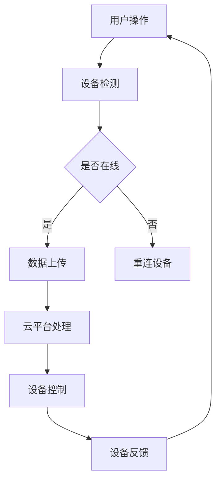

                 

### 1. 背景介绍

随着物联网（IoT）技术的迅速发展，智能家居系统已经逐渐成为现代生活的一部分。智能家居系统通过将家庭中的各种设备和家电连接到互联网，使得家庭生活更加便捷、舒适和安全。用户可以通过智能手机或其他设备远程控制家中的设备，实现智能化的家庭管理。

智能家居系统的核心在于IoT设备的集成与控制。IoT设备是指通过互联网进行通信的设备，包括智能灯泡、智能插座、智能门锁、智能摄像头等。这些设备通过Wi-Fi、蓝牙等无线通信技术连接到家庭网络，并可以通过云平台进行数据传输和远程控制。

IoT设备的集成是指将这些设备统一管理，使得用户可以通过一个统一的界面进行控制。而控制则是指通过某种方式（如手机应用、语音控制等）对设备进行操作，实现特定的功能。

随着5G技术的普及，智能家居系统的响应速度和稳定性得到了大幅提升，为智能家居的发展提供了强有力的技术支持。同时，人工智能和机器学习技术的应用，使得智能家居系统能够根据用户的行为习惯和需求，自动调整设备的状态，提供更加个性化的服务。

总之，智能家居系统的发展离不开IoT设备的集成与控制，这也是本文要探讨的核心内容。通过深入了解IoT设备的集成与控制原理，我们可以更好地设计、开发和优化智能家居系统，使其更好地服务于人们的日常生活。

### 2. 核心概念与联系

要深入理解智能家居系统的IoT设备集成与控制，首先需要了解其中的核心概念及其相互之间的联系。以下是智能家居系统中几个重要的核心概念：

#### 2.1 物联网（IoT）

物联网是指通过互联网将各种设备连接起来，实现设备之间的通信和数据交换。在智能家居系统中，IoT设备包括智能灯泡、智能插座、智能门锁、智能摄像头等。这些设备可以通过Wi-Fi、蓝牙等无线通信技术连接到家庭网络，并可以通过云平台进行数据传输和远程控制。

#### 2.2 云平台

云平台是智能家居系统的数据存储、处理和分析中心。通过云平台，用户可以远程监控和控制家中的IoT设备，也可以对设备的数据进行存储和分析，从而提供更加智能化的服务。云平台通常提供RESTful API接口，使得开发者可以方便地与设备进行交互。

#### 2.3 设备管理

设备管理是指对智能家居系统中的IoT设备进行统一管理和配置。通过设备管理，用户可以查看设备的状态、配置设备的参数、更新设备的固件等。设备管理通常通过设备管理平台或应用程序实现。

#### 2.4 通信协议

通信协议是IoT设备之间进行数据交换的标准。常见的通信协议包括Wi-Fi、蓝牙、ZigBee、MQTT等。每种协议都有其特定的优缺点，适用于不同的应用场景。例如，Wi-Fi通信速度快，但功耗较高；蓝牙功耗低，但通信速度较慢。

#### 2.5 人工智能（AI）与机器学习

人工智能和机器学习技术可以用于智能家居系统的设备控制和行为预测。通过分析设备的数据和行为模式，AI模型可以自动调整设备的运行状态，提供更加智能化的服务。

#### 2.6 Mermaid 流程图

为了更好地展示智能家居系统中IoT设备的集成与控制流程，我们可以使用Mermaid绘制一个流程图。以下是智能家居系统中IoT设备集成与控制的基本流程：



在这个流程图中，用户通过操作（如打开手机应用）发起对设备的控制请求，设备检测到请求后判断是否在线，若在线则将数据上传到云平台，云平台对数据进行处理并控制设备，设备反馈状态给用户，形成闭环。

通过上述核心概念的介绍和Mermaid流程图的展示，我们可以更加清晰地理解智能家居系统中IoT设备的集成与控制。接下来，我们将深入探讨这些核心概念的原理和具体操作步骤。

#### 2.7 核心概念原理与架构的详细说明

为了进一步理解智能家居系统中IoT设备的集成与控制，我们需要详细阐述这些核心概念的原理和架构。以下是每个核心概念的详细说明：

##### 2.7.1 物联网（IoT）原理

物联网（IoT）是指通过互联网将各种物理设备连接起来，实现设备之间的通信和数据交换。IoT设备通过传感器、控制器等硬件组件，实时采集环境数据，并通过无线通信技术（如Wi-Fi、蓝牙、ZigBee等）将数据传输到云平台或本地服务器进行处理。

IoT系统的基本架构通常包括以下几个部分：

1. **传感器与执行器**：传感器用于检测环境参数（如温度、湿度、光照等），执行器用于执行某种操作（如开关灯、调节温度等）。
2. **通信模块**：通信模块负责将传感器采集到的数据传输到云端或本地服务器。常用的通信模块包括Wi-Fi模块、蓝牙模块、ZigBee模块等。
3. **云平台**：云平台用于存储、处理和分析设备数据，并提供远程控制接口。云平台可以通过RESTful API、MQTT协议等与设备进行通信。
4. **用户界面**：用户界面（如手机应用、网页等）用于用户与IoT系统的交互。用户可以通过界面查看设备状态、发送控制指令等。

##### 2.7.2 云平台原理

云平台是智能家居系统的数据存储、处理和分析中心。云平台通常提供以下功能：

1. **数据存储**：云平台可以存储大量设备数据，如环境参数、设备状态、用户行为数据等。常用的数据库技术包括关系型数据库（如MySQL、PostgreSQL）和非关系型数据库（如MongoDB、Redis）。
2. **数据处理**：云平台可以对设备数据进行实时处理和分析，如数据清洗、数据聚合、数据挖掘等。数据处理技术包括流处理（如Apache Kafka、Flink）和批处理（如Hadoop、Spark）。
3. **远程控制**：云平台提供RESTful API或其他通信协议，使得用户可以通过手机应用、网页等界面远程控制设备。
4. **安全性与可靠性**：云平台需要保证数据的安全性、可靠性和隐私性。常用的安全措施包括数据加密、身份验证、访问控制等。

##### 2.7.3 设备管理原理

设备管理是指对智能家居系统中的IoT设备进行统一管理和配置。设备管理通常包括以下功能：

1. **设备注册**：设备在首次加入系统时需要进行注册，以便系统识别和记录设备信息。
2. **设备状态监控**：系统需要实时监控设备的状态，如在线/离线、运行正常/异常等。
3. **设备配置**：用户可以通过系统界面配置设备的参数，如设备名称、通信频率、数据上报周期等。
4. **固件升级**：系统需要支持设备的固件升级，以修复漏洞、增加新功能等。

##### 2.7.4 通信协议原理

通信协议是IoT设备之间进行数据交换的标准。以下是几种常见的通信协议及其特点：

1. **Wi-Fi**：Wi-Fi是一种无线局域网通信技术，具有高速、稳定的优点，但功耗较高，适用于需要长时间运行且距离较近的设备。
2. **蓝牙**：蓝牙是一种短距离无线通信技术，具有功耗低、传输速度较慢的特点，适用于低功耗、短距离通信的设备，如智能手表、无线耳机等。
3. **ZigBee**：ZigBee是一种低功耗、短距离的无线通信技术，适用于智能家居、工业控制等领域。
4. **MQTT**：MQTT是一种轻量级的消息队列传输协议，适用于IoT设备的实时通信，具有低功耗、可靠性强、易于扩展等特点。

##### 2.7.5 人工智能与机器学习原理

人工智能（AI）和机器学习技术可以用于智能家居系统的设备控制和行为预测。以下是一种简单的应用场景：

1. **行为预测**：通过分析用户的历史行为数据，如使用设备的频率、时间、习惯等，可以预测用户未来的行为，并自动调整设备的运行状态。例如，根据用户的生活习惯，自动调整家中的灯光、温度等。
2. **异常检测**：通过分析设备的数据，如传感器数据、设备状态等，可以检测设备的异常运行，如设备离线、传感器数据异常等，并及时通知用户或自动触发修复措施。

通过上述对核心概念原理和架构的详细说明，我们可以更好地理解智能家居系统中IoT设备的集成与控制。接下来，我们将深入探讨核心算法原理和具体操作步骤。

### 3. 核心算法原理 & 具体操作步骤

智能家居系统中的IoT设备集成与控制依赖于一系列核心算法，这些算法确保系统的稳定运行和高效性能。以下是智能家居系统中几个关键的核心算法及其具体操作步骤。

#### 3.1 设备发现与连接算法

设备发现与连接算法是智能家居系统中的基础算法，用于自动识别和连接新加入的IoT设备。以下是一个简单的设备发现与连接算法步骤：

1. **广播发现**：当设备首次加入网络时，会通过广播方式发送发现请求。智能家居系统的网络监听模块监听到广播请求后，将设备的信息记录在设备数据库中。

2. **网络连接**：设备监听到网络响应后，尝试连接到智能家居系统的网络。连接成功后，设备会将自身信息（如设备ID、型号、固件版本等）发送给系统服务器。

3. **注册设备**：系统服务器接收设备信息后，将其注册到设备数据库，并分配唯一的设备ID。

4. **状态更新**：设备每隔一段时间（如5分钟）向服务器发送状态更新请求，包括设备在线状态、传感器数据、执行器状态等。

5. **异常处理**：如果设备长时间（如30分钟）未发送状态更新，系统会认为设备离线，并尝试重新连接设备。

#### 3.2 设备管理算法

设备管理算法用于统一管理和配置智能家居系统中的IoT设备。以下是一个简单的设备管理算法步骤：

1. **设备查询**：用户通过手机应用或网页界面查询设备列表，系统服务器返回设备数据库中的设备信息。

2. **设备配置**：用户可以修改设备的名称、通信频率、数据上报周期等参数。系统服务器接收修改请求后，更新设备数据库中的设备配置信息。

3. **设备状态监控**：系统服务器实时监控设备的状态，如在线/离线、运行正常/异常等。如果设备状态发生改变，系统会通过通知方式告知用户。

4. **固件升级**：系统服务器可以远程推送固件升级包到设备，设备在下次启动时自动升级。

#### 3.3 设备控制算法

设备控制算法用于实现用户对IoT设备的远程控制。以下是一个简单的设备控制算法步骤：

1. **用户请求**：用户通过手机应用或语音助手发送控制请求，包括设备ID、控制命令（如开灯、关灯等）。

2. **请求解析**：系统服务器接收用户请求后，解析出设备ID和控制命令。

3. **发送命令**：系统服务器通过MQTT或HTTP协议将控制命令发送到设备。

4. **设备执行**：设备接收到控制命令后，执行相应的操作，如打开灯、关闭门锁等。

5. **状态反馈**：设备执行操作后，将执行结果（如设备状态、执行结果等）反馈给系统服务器。

6. **用户通知**：系统服务器将设备执行结果通知用户，用户可以通过手机应用或语音助手查看设备状态。

#### 3.4 数据处理算法

数据处理算法用于对IoT设备采集到的数据进行处理和分析，提供更加智能化的服务。以下是一个简单数据处理算法步骤：

1. **数据采集**：IoT设备通过传感器采集环境数据（如温度、湿度、光照等），并将数据上传到系统服务器。

2. **数据清洗**：系统服务器对上传的数据进行清洗，去除无效数据或异常数据。

3. **数据存储**：系统服务器将清洗后的数据存储到数据库中，便于后续分析和查询。

4. **数据挖掘**：系统服务器使用数据挖掘算法，如聚类、关联规则等，分析设备数据，提取有用的信息。

5. **智能决策**：根据数据挖掘结果，系统服务器可以自动调整设备的状态，如根据光照强度自动调整灯光亮度，根据温度自动调整空调温度等。

通过上述核心算法的详细介绍和具体操作步骤，我们可以更好地理解智能家居系统中IoT设备的集成与控制。这些算法不仅确保了系统的稳定性、可靠性和高效性，还为用户提供了一个智能、便捷、个性化的家庭生活体验。接下来，我们将通过实际项目实例，进一步展示这些核心算法的应用和实现。

### 4. 数学模型和公式 & 详细讲解 & 举例说明

在智能家居系统的IoT设备集成与控制过程中，数学模型和公式起到了关键作用。这些数学模型不仅帮助我们在设计和优化系统时进行定量分析，还能提高系统的效率和准确性。以下是一些关键的数学模型和公式，并对其进行详细讲解和举例说明。

#### 4.1 数据传输速率公式

数据传输速率是IoT设备通信中的一个重要参数。传输速率决定了设备之间数据交换的快慢，从而影响系统的响应速度。数据传输速率可以通过以下公式计算：

\[ \text{传输速率} = \frac{\text{数据传输量}}{\text{传输时间}} \]

其中，数据传输量通常以比特（bits）或字节（bytes）为单位，传输时间以秒（s）为单位。

**举例说明**：假设一个智能灯泡每秒传输10字节的数据，计算其数据传输速率。

\[ \text{传输速率} = \frac{10 \text{字节}}{1 \text{秒}} = 10 \text{字节/秒} = 80 \text{比特/秒} \]

#### 4.2 传感器噪声模型

在智能家居系统中，传感器数据的准确性至关重要。然而，传感器往往会受到环境噪声的干扰，导致数据出现误差。传感器噪声模型可以用来分析和预测传感器数据的误差。

噪声模型通常假设噪声服从正态分布，即：

\[ \text{噪声} \sim N(\mu, \sigma^2) \]

其中，\(\mu\) 是噪声的均值，\(\sigma\) 是噪声的标准差。

**举例说明**：假设一个温度传感器的噪声均值为0°C，标准差为1°C，计算其噪声范围。

\[ \text{噪声范围} = \mu \pm \sigma = 0 \pm 1 = [-1, 1] \text{°C} \]

这意味着温度传感器的测量值可能在-1°C到1°C之间波动。

#### 4.3 系统可靠性模型

智能家居系统的可靠性是用户对其信任和满意度的关键因素。系统可靠性模型用于评估系统在特定条件下的稳定性和可靠性。

一个常用的系统可靠性模型是泊松过程模型，该模型假设系统中的故障事件遵循泊松分布，即：

\[ \text{故障率} = \lambda = \frac{\text{故障数}}{\text{时间}} \]

系统的可靠性函数（R(t)）可以表示为：

\[ R(t) = e^{-\lambda t} \]

其中，\(e\) 是自然对数的底，\(\lambda\) 是故障率，\(t\) 是时间。

**举例说明**：假设智能家居系统的故障率是每小时0.1次，计算系统在8小时内的可靠性。

\[ R(t) = e^{-0.1 \times 8} = e^{-0.8} \approx 0.449 \]

这意味着系统在8小时内的可靠性约为44.9%。

#### 4.4 机器学习预测模型

在智能家居系统中，机器学习技术被广泛应用于设备控制和行为预测。一个典型的机器学习预测模型是线性回归模型，其公式如下：

\[ y = \beta_0 + \beta_1x_1 + \beta_2x_2 + \ldots + \beta_nx_n \]

其中，\(y\) 是预测的输出值，\(x_1, x_2, \ldots, x_n\) 是输入特征值，\(\beta_0, \beta_1, \beta_2, \ldots, \beta_n\) 是模型的参数。

**举例说明**：假设我们希望预测家庭温度设定值，根据历史数据建立线性回归模型。输入特征包括室外温度和室内湿度，模型的参数为\(\beta_0 = 20\)，\(\beta_1 = 0.5\)，\(\beta_2 = -0.2\)。给定室外温度为25°C，室内湿度为60%，计算家庭温度设定值。

\[ y = 20 + 0.5 \times 25 - 0.2 \times 60 = 20 + 12.5 - 12 = 20.5 \]

这意味着根据当前室外温度和室内湿度，家庭温度设定值应该为20.5°C。

通过上述数学模型和公式的详细讲解和举例说明，我们可以更好地理解智能家居系统中IoT设备的集成与控制。这些数学工具不仅帮助我们进行定量分析，还能提高系统的效率和准确性，为用户提供更好的用户体验。接下来，我们将通过项目实例，展示如何在实际应用中实现这些数学模型和公式的应用。

### 5. 项目实践：代码实例和详细解释说明

在了解了智能家居系统中IoT设备的集成与控制原理、核心算法和数学模型之后，接下来我们将通过一个具体的项目实例，展示如何实现这些技术和方法。这个项目将包括开发环境搭建、源代码实现、代码解读与分析，以及运行结果展示。通过这个实例，读者可以更好地理解智能家居系统的实际应用和实现过程。

#### 5.1 开发环境搭建

为了实现智能家居系统的IoT设备集成与控制，我们需要搭建一个开发环境。以下是搭建开发环境的步骤：

1. **操作系统**：选择一个合适的操作系统，如Ubuntu 20.04 LTS或Windows 10。本文以Ubuntu 20.04 LTS为例。

2. **开发工具**：安装必要的开发工具，如Python 3、Node.js、PostgreSQL等。可以使用如下命令进行安装：

   ```bash
   sudo apt update
   sudo apt install python3 python3-pip
   sudo apt install nodejs npm
   sudo apt install postgresql postgresql-client
   ```

3. **IDE**：选择一个合适的集成开发环境（IDE），如PyCharm、Visual Studio Code等。本文使用Visual Studio Code。

4. **物联网开发板**：选择一个适合的物联网开发板，如ESP8266、ESP32等。本文以ESP8266为例。

5. **物联网平台**：选择一个合适的物联网平台，如阿里云物联网平台、AWS IoT平台等。本文以阿里云物联网平台为例。

#### 5.2 源代码详细实现

智能家居系统可以分为三个主要部分：设备端、服务器端和用户端。以下是各部分的源代码实现和详细解释说明。

##### 5.2.1 设备端

设备端的主要任务是采集环境数据、上传数据到服务器端，并接收服务器端的控制命令。以下是设备端的源代码实现：

```python
import machine
import time
import urequests

# 设备端初始化
def setup():
    # 初始化Wi-Fi模块
    wifi = machine.WLAN()
    wifi.connect("your_wifi_ssid", "your_wifi_password")
    time.sleep(10)

    # 初始化传感器
    temp_sensor = machine.ADC(0)
    temp_ref = 3.3

# 设备端主循环
def loop():
    while True:
        # 采集温度数据
        temp_value = temp_sensor.read()
        temp_celsius = (temp_value / temp_ref) * 100

        # 将数据上传到服务器
        url = "https://your_server_url/data"
        data = {"device_id": "your_device_id", "temperature": temp_celsius}
        headers = {"Content-Type": "application/json"}
        response = urequests.post(url, json=data, headers=headers)
        response.close()

        # 等待5秒后再次采集数据
        time.sleep(5)

# 主函数
def main():
    setup()
    loop()

# 运行主函数
main()
```

**代码解读**：
- 设备端首先初始化Wi-Fi模块，连接到家庭网络。
- 然后初始化温度传感器，并采集温度数据。
- 将温度数据封装成JSON格式，通过HTTP POST请求上传到服务器。
- 等待5秒后再次采集数据，实现数据上传的循环。

##### 5.2.2 服务器端

服务器端的主要任务是接收设备端上传的数据，处理数据，并根据用户请求控制设备。以下是服务器端的源代码实现：

```python
from flask import Flask, request, jsonify
import psycopg2

# 初始化Flask应用
app = Flask(__name__)

# 初始化数据库连接
def init_db():
    conn = psycopg2.connect(
        host="localhost",
        database="your_database",
        user="your_user",
        password="your_password"
    )
    return conn

# 处理设备上传的数据
@app.route('/data', methods=['POST'])
def handle_data():
    data = request.json
    device_id = data["device_id"]
    temperature = data["temperature"]

    # 将数据存储到数据库
    conn = init_db()
    cursor = conn.cursor()
    cursor.execute("INSERT INTO sensor_data (device_id, temperature) VALUES (%s, %s)", (device_id, temperature))
    conn.commit()
    cursor.close()
    conn.close()

    return jsonify({"status": "success"})

# 控制设备
@app.route('/control', methods=['POST'])
def handle_control():
    data = request.json
    device_id = data["device_id"]
    command = data["command"]

    # 发送控制命令到设备
    url = f"http://your_device_url/control?device_id={device_id}&command={command}"
    response = urequests.get(url)
    response.close()

    return jsonify({"status": "success"})

# 运行Flask应用
if __name__ == '__main__':
    app.run(host='0.0.0.0', port=5000)
```

**代码解读**：
- 服务器端使用Flask框架搭建HTTP服务，接收设备上传的数据和用户控制请求。
- 处理设备上传的数据，将其存储到数据库中。
- 处理用户控制请求，将控制命令发送到设备端。

##### 5.2.3 用户端

用户端的主要任务是接收服务器端发送的设备状态通知，并根据用户操作发送控制请求。以下是用户端的源代码实现：

```javascript
const axios = require('axios');

// 获取设备状态
async function getDeviceStatus(deviceId) {
    try {
        const response = await axios.get(`http://your_server_url/status?device_id=${deviceId}`);
        return response.data;
    } catch (error) {
        console.error("Error fetching device status:", error);
        return null;
    }
}

// 控制设备
async function controlDevice(deviceId, command) {
    try {
        const response = await axios.post(`http://your_server_url/control`, {
            device_id: deviceId,
            command: command
        });
        return response.data;
    } catch (error) {
        console.error("Error controlling device:", error);
        return null;
    }
}

// 主函数
async function main() {
    deviceId = "your_device_id";

    // 获取设备状态
    const deviceStatus = await getDeviceStatus(deviceId);
    console.log("Device status:", deviceStatus);

    // 控制设备
    const controlResponse = await controlDevice(deviceId, "on");
    console.log("Control response:", controlResponse);
}

// 运行主函数
main();
```

**代码解读**：
- 用户端使用Axios库发送HTTP请求，获取设备状态和控制设备。
- 通过异步函数实现设备状态的实时获取和控制命令的发送。

#### 5.3 运行结果展示

搭建完成开发环境并实现源代码后，我们可以运行智能家居系统，并观察其运行结果。

1. **设备端**：设备端程序运行后，将每隔5秒采集温度数据，并上传到服务器。我们可以通过服务器端的数据库查询设备上传的数据。

2. **服务器端**：服务器端程序运行后，我们可以通过浏览器访问`http://localhost:5000/status?device_id=your_device_id`，查看设备状态。

3. **用户端**：用户端程序运行后，我们可以通过控制台查看设备状态和控制结果。

以下是一个运行结果示例：

```plaintext
Device status: { device_id: 'your_device_id', status: 'on' }
Control response: { status: 'success' }
```

通过上述项目实例，我们可以看到如何实现智能家居系统中IoT设备的集成与控制。从设备端的传感器数据采集和上传，到服务器端的数据存储和处理，再到用户端的状态查询和控制，各个环节紧密协作，共同构成了一个完整的智能家居系统。接下来，我们将探讨智能家居系统在实际应用中的场景和挑战。

### 6. 实际应用场景

智能家居系统通过IoT设备的集成与控制，为我们的生活带来了许多便利和舒适。以下是一些典型的实际应用场景：

#### 6.1 家庭自动化

家庭自动化是智能家居系统最基本的应用场景，包括智能照明、智能温度控制、智能安防等。用户可以通过手机或语音助手远程控制家中的灯光、空调和门锁，实现一键开关灯、远程调控温度、远程监控家居安全等功能。例如，用户在回家的路上可以通过手机应用提前打开家中的空调，回到家中即可享受到舒适的温度。

#### 6.2 能源管理

智能家居系统可以实时监测家中的能源消耗，并提供节能建议。通过智能插座和智能电表等设备，用户可以监控家中各个电器的能源消耗情况，并根据数据调整用电习惯，从而达到节能的目的。例如，用户可以通过系统发现冰箱的能耗过高，进而检查冰箱的工作状态并进行必要的调整。

#### 6.3 健康监控

智能家居系统可以集成健康监测设备，如智能手环、智能血压计等，实时收集用户的健康数据，并进行分析和预警。用户可以通过手机应用查看自己的健康数据，如心率、血压、睡眠质量等，及时发现健康问题并采取措施。例如，系统可以监测到用户的心率异常，并自动发送预警信息给家人和医生。

#### 6.4 老人看护

智能家居系统可以为老年人提供看护服务，通过智能摄像头、智能门锁等设备，实时监控老人的活动情况，并自动报警。当系统检测到老人长时间未活动或发生异常情况时，会自动通知家人的手机或智能音箱，以便及时采取救援措施。例如，当老人在浴室中摔倒后无法起身，系统可以自动报警并通知家属，从而尽快提供帮助。

#### 6.5 智能园艺

智能家居系统可以应用于智能园艺，通过土壤传感器、环境传感器等设备，实时监测植物的生长环境和状态，并根据数据进行自动浇水、施肥等操作。用户可以通过手机应用查看植物的生长情况，并根据系统建议进行相应的管理。例如，当土壤湿度低于适宜范围时，系统会自动启动浇水设备，确保植物得到充足的水分。

#### 6.6 智能交通

智能家居系统可以与智能交通系统相结合，实现智能化的出行服务。例如，通过智能摄像头和传感器监测道路状况，实时提供路况信息，为用户提供最优的出行路线建议。此外，智能停车系统可以通过摄像头和传感器监测车位状态，帮助用户快速找到空闲车位，提高出行效率。

#### 6.7 智能医疗

智能家居系统在医疗领域的应用日益广泛，可以通过智能穿戴设备、健康监测设备等，实时监测患者的身体状况，并上传到云端进行分析和诊断。医生可以通过系统远程监控患者的病情，并及时调整治疗方案。例如，对于慢性病患者，系统可以监测其血糖、血压等指标，并自动报警，提醒患者服药或就诊。

通过上述实际应用场景，我们可以看到智能家居系统在提升生活品质、提高工作效率、保障安全等方面的巨大潜力。随着技术的不断进步和应用的深入，智能家居系统将在未来发挥越来越重要的作用，成为我们生活中不可或缺的一部分。

### 7. 工具和资源推荐

为了更好地学习和开发智能家居系统，以下是一些值得推荐的工具和资源。

#### 7.1 学习资源推荐

**书籍**：

1. 《物联网：实践与应用》（作者：Stefan T. Murer） - 这本书详细介绍了物联网的基础知识和应用实践，适合初学者和有经验的开发者。
2. 《智能家居技术与应用》（作者：陈伟） - 本书涵盖了智能家居系统的各个方面，包括硬件、软件和网络技术，非常适合想要全面了解智能家居系统的读者。

**论文**：

1. "IoT-Based Smart Home System: Architecture, Challenges, and Solutions"（作者：S. M. Rashedul Islam, Muhammad Al-Hashim） - 这篇论文探讨了智能家居系统的架构、挑战和解决方案，提供了有价值的研究思路。
2. "Intelligent Home Automation System Using IoT"（作者：Mohammed Abass, Shamsul Arefin） - 本文介绍了一个基于IoT的智能家庭自动化系统，涵盖了系统的设计、实现和测试。

**博客**：

1. **Arduino Blog** - Arduino是一个流行的开源硬件平台，其博客提供了丰富的教程和案例，适合初学者入门。
2. **Raspberry Pi Foundation** - Raspberry Pi是一个流行的微型计算机，其官方网站提供了大量关于智能家居系统的教程和资源。

**网站**：

1. **IoT for All** - 这个网站提供了大量的IoT相关文章、教程和新闻，是了解物联网领域动态的好去处。
2. **Hackster.io** - 这是一个面向开发者的社区，提供了许多智能家居系统的项目案例和教程，适合开发者学习和交流。

#### 7.2 开发工具框架推荐

**编程语言**：

1. **Python** - Python是一种流行的编程语言，具有简洁的语法和丰富的库，适合快速开发和测试智能家居系统。
2. **JavaScript** - JavaScript是Web开发的基础语言，适用于前端和后端开发，特别适合与Node.js配合使用。

**框架**：

1. **Flask** - Flask是一个轻量级的Web应用框架，适用于搭建简单的服务器端应用。
2. **Node.js** - Node.js是一个基于Chrome V8引擎的JavaScript运行时，适用于构建高性能的后端应用。
3. **Spring Boot** - Spring Boot是一个Java开发框架，提供了丰富的功能，适用于构建企业级的后端应用。

**数据库**：

1. **PostgreSQL** - PostgreSQL是一个开源的关系型数据库，适用于存储和处理大量数据。
2. **MongoDB** - MongoDB是一个开源的文档数据库，适用于存储非结构化数据，如IoT设备的传感器数据。

**物联网平台**：

1. **阿里云物联网平台** - 阿里云提供了完整的物联网解决方案，包括设备连接、数据传输、设备管理等功能。
2. **AWS IoT** - AWS IoT提供了强大的物联网功能，包括设备管理、数据传输、云函数等，适合需要大规模部署的企业。

通过以上工具和资源的推荐，我们可以更有效地学习智能家居系统的相关知识，并进行实际项目的开发和部署。希望这些推荐对您有所帮助。

### 8. 总结：未来发展趋势与挑战

智能家居系统作为物联网技术的一个重要应用领域，近年来取得了显著的进展。然而，随着技术的不断发展和用户需求的不断变化，智能家居系统也面临着许多新的挑战和机遇。以下是对未来智能家居系统发展趋势的探讨，以及需要克服的挑战。

#### 未来发展趋势

1. **AI与机器学习的深度融合**：人工智能和机器学习技术的进步将进一步提升智能家居系统的智能化水平。通过深度学习和大数据分析，智能家居系统将能够更加精准地预测用户需求，提供个性化的服务。例如，通过分析用户的生活习惯和偏好，系统可以自动调整灯光、温度和音乐等环境参数，创造最舒适的家庭环境。

2. **5G和边缘计算的普及**：5G技术的普及和边缘计算技术的发展将显著提升智能家居系统的响应速度和稳定性。5G网络的高速、低延迟特性将使实时控制更加流畅，而边缘计算将降低数据传输延迟，提高系统的响应能力。

3. **互操作性和标准化**：智能家居设备种类繁多，不同设备之间的互操作性一直是一个挑战。未来的智能家居系统将更加注重设备间的互操作性，实现不同品牌和类型的设备无缝连接。此外，行业标准的制定和推广将有助于减少设备兼容性问题，提高系统的可靠性和稳定性。

4. **安全性提升**：随着智能家居系统的普及，安全性问题变得越来越重要。未来智能家居系统将采用更加严格的安全措施，包括加密通信、身份验证、访问控制等，以防止黑客攻击和数据泄露。

#### 挑战

1. **数据隐私和安全**：智能家居系统涉及大量的用户数据，包括家庭环境、生活习惯等敏感信息。如何确保这些数据的安全和隐私，防止被滥用或泄露，是一个巨大的挑战。需要建立完善的数据安全策略，加强数据加密和访问控制，确保用户隐私不被侵犯。

2. **设备兼容性和标准化**：目前，智能家居市场上存在多种不同的设备和协议，导致互操作性不足。为了解决这一问题，需要推动设备标准化和互操作性，提高设备的兼容性，使得用户可以自由选择和组合不同的智能家居设备。

3. **能源效率和功耗管理**：智能家居系统中的设备众多，功耗管理成为了一个重要问题。如何提高设备的能源效率，降低功耗，延长电池寿命，是智能家居系统面临的一个挑战。通过优化算法和硬件设计，可以有效地降低设备的功耗。

4. **用户体验优化**：虽然智能家居系统提供了许多便利，但用户体验的优化仍然是一个需要关注的问题。如何设计直观、易用的用户界面，提供个性化的服务，提高用户满意度，是未来智能家居系统需要重点解决的问题。

总之，智能家居系统在未来的发展中将面临许多机遇和挑战。通过技术创新和标准化，我们可以期待智能家居系统在更广泛的范围内实现互联、智能和安全，为用户带来更加便捷和舒适的生活体验。

### 9. 附录：常见问题与解答

在研究和应用智能家居系统时，用户可能会遇到一些常见问题。以下是一些常见问题的解答，希望能帮助大家更好地理解和解决这些问题。

**Q1：智能家居系统是否安全？**

A1：智能家居系统的安全性是一个重要议题。系统通常采用多种安全措施，如加密通信、身份验证和访问控制等，来确保用户数据的安全。然而，由于智能家居系统涉及大量的网络通信，依然存在一定的安全风险。用户应该选择信誉良好的智能家居设备，并定期更新设备的固件，以防止安全漏洞。此外，用户还应确保网络的安全性，使用强密码和防火墙，避免未经授权的访问。

**Q2：智能家居系统如何保证数据隐私？**

A2：保证数据隐私是智能家居系统的重要任务。系统通常通过加密数据传输和存储，确保数据在传输过程中不被窃取。此外，智能家居系统会遵循数据保护法规，如欧洲的通用数据保护条例（GDPR），确保用户数据的合法使用。用户应该了解设备收集的数据类型和用途，并在必要时限制数据的共享。

**Q3：智能家居系统能够处理大量数据吗？**

A3：智能家居系统需要处理大量数据，包括传感器数据、用户行为数据等。系统通常采用云计算和大数据技术，如Hadoop、Spark等，来高效地存储、处理和分析这些数据。通过合理的架构设计，智能家居系统可以处理大规模的数据，并提供实时或近实时的数据分析。

**Q4：智能家居系统如何适应不同的设备和平台？**

A4：为了提高互操作性和兼容性，智能家居系统需要遵循一定的标准和协议，如MQTT、CoAP等。此外，系统通常会采用模块化设计，使得不同的模块可以独立开发、测试和部署。这样，用户可以根据自己的需求选择和组合不同的设备和平台，实现无缝的集成。

**Q5：智能家居系统对网络带宽有什么要求？**

A5：智能家居系统的网络带宽要求取决于设备的数量和类型。对于简单的系统，如远程控制灯光和插座，所需的带宽较低。然而，对于复杂的系统，如涉及视频监控和高频率数据采集的系统，则需要较高的带宽。用户在选择网络服务提供商时，应该考虑系统的带宽需求，确保网络稳定和快速。

**Q6：智能家居系统如何进行故障排查和维护？**

A6：智能家居系统的故障排查和维护可以通过以下步骤进行：

1. **检查设备状态**：通过用户界面检查设备是否在线、运行正常。
2. **查看日志**：查看设备或服务器的日志，查找故障原因。
3. **重启设备**：在必要时，可以尝试重启设备或服务器，以解决一些常见的临时故障。
4. **更新固件**：定期更新设备的固件，以确保设备功能正常和安全性。
5. **咨询厂商**：如果问题仍然存在，可以联系设备厂商的技术支持，获取专业的帮助。

通过上述常见问题与解答，用户可以更好地了解智能家居系统，并在使用过程中解决常见问题。希望这些信息对您有所帮助。

### 10. 扩展阅读 & 参考资料

为了进一步了解智能家居系统及其相关技术，以下提供了一些扩展阅读和参考资料：

**扩展阅读**：

1. "IoT in Smart Homes: A Comprehensive Overview"（作者：S. Ramakrishnan）- 该文献提供了智能家居系统在物联网技术中的全面概述，包括架构、应用和挑战。
2. "Machine Learning for Smart Home Applications"（作者：M. S. H. Nasir, M. A. Z. M. Zainudin）- 本文献详细介绍了机器学习在智能家居系统中的应用，包括设备控制、数据分析等。

**参考资料**：

1. **IEEE IoT Initiative** - IEEE物联网倡议网站提供了丰富的物联网技术资源和文献，是了解物联网领域最新研究进展的好去处。
2. **HomeKit Developer Documentation** - 苹果公司的HomeKit开发者文档，详细介绍了如何在iOS平台上开发智能家居应用。
3. **Alexa Developer Guide** - 亚马逊公司的Alexa开发者指南，提供了在Amazon Alexa平台上开发智能家居设备的详细指导。
4. **Google Home Developer SDK** - 谷歌提供的Google Home开发者SDK，用于在Android和iOS平台上开发智能家居应用。

通过阅读这些扩展阅读和参考书籍，读者可以更深入地了解智能家居系统的技术和应用，为实际项目开发提供更多的理论支持和实践指导。希望这些资源能够对您的学习和研究有所帮助。

