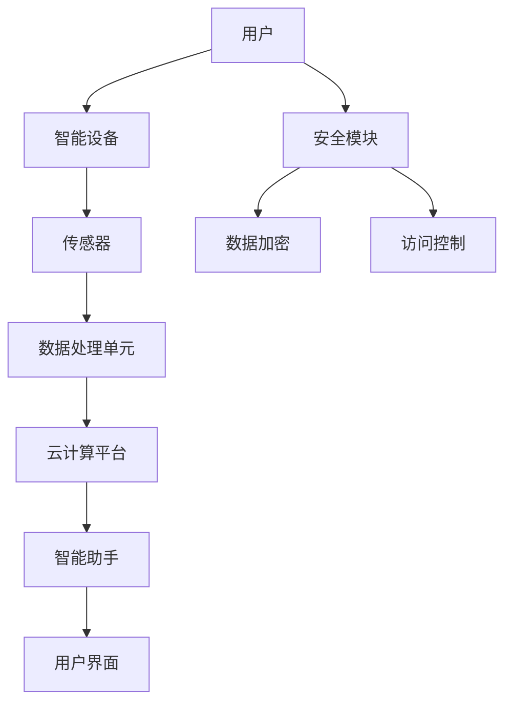

                 

### 背景介绍

智能家居系统（Smart Home System）是一个集成了各种智能化设备和控制平台的系统，通过互联网、无线通信技术等手段，实现对家庭环境、家电设备和家庭成员生活的智能管理与优化。随着物联网（IoT）、大数据、人工智能等技术的快速发展，智能家居系统正在从传统家居设备向智能化、网络化和自主化方向发展。

#### 1.1 市场背景

智能家居市场自21世纪初起步以来，经过数十年的发展，已经呈现出蓬勃发展的态势。据市场研究公司Statista的数据显示，全球智能家居市场在2021年达到了1044亿美元，预计到2026年将达到2146亿美元，年复合增长率达到14.5%。这一增长趋势表明，智能家居正逐渐成为现代家庭生活的一部分。

#### 1.2 技术发展

1. **物联网（IoT）技术**：物联网技术的普及为智能家居系统的实现提供了基础。通过将各种家电设备、传感器等连接到互联网，实现了设备之间的数据交换和远程控制。

2. **大数据分析**：大数据分析技术通过对用户行为数据的收集、处理和分析，为智能家居系统提供了个性化的服务支持。

3. **人工智能（AI）技术**：人工智能技术的应用使得智能家居系统能够更好地理解用户需求，实现自动化和智能化的操作。

4. **5G通信技术**：5G通信技术的推广，为智能家居系统提供了高速、低延迟的通信网络，使得远程控制更加便捷和实时。

#### 1.3 应用领域

智能家居系统在家庭生活、健康监测、安全防护、能源管理等多个领域都有广泛的应用。

1. **家庭生活**：智能灯光、智能窗帘、智能家电等设备的使用，为用户提供了更加便捷和舒适的生活体验。

2. **健康监测**：智能家居系统可以通过监测设备实时记录家庭成员的健康数据，为用户提供健康建议。

3. **安全防护**：智能家居系统可以通过摄像头、传感器等设备，实现对家庭环境的实时监控，提高家庭安全。

4. **能源管理**：智能家居系统可以通过智能控制设备，实现家庭用电、用水的智能管理，降低能源消耗。

#### 1.4 创业方向

智能家居系统具有广阔的市场前景和丰富的应用场景，为创业者提供了多个潜在的创业方向：

1. **智能家居设备研发**：研发新型智能家电和传感器，提升智能家居系统的功能和性能。

2. **智能家居平台建设**：搭建集成多种智能设备的智能家居平台，提供一站式解决方案。

3. **智能家居服务提供**：提供智能家居系统的安装、维护、升级等技术服务。

4. **智能家居内容开发**：开发智能化的家庭生活内容和应用，如健康咨询、家庭娱乐等。

5. **智能家居安全解决方案**：提供智能家居系统的安全解决方案，确保用户数据安全和隐私保护。

总之，智能家居系统作为未来家庭生活的重要组成部分，正吸引着越来越多的创业者投身其中，探索新的商业模式和技术创新。接下来，我们将进一步探讨智能家居系统的核心概念、算法原理以及实际应用场景。

### 核心概念与联系

在深入探讨智能家居系统的核心概念之前，我们需要明确几个关键组成部分，这些组成部分共同构成了智能家居系统的架构，并相互协作实现智能化的功能。

#### 2.1 物联网（IoT）

物联网是智能家居系统的技术基础，它通过将物理设备与互联网连接，实现设备间的数据交换和通信。物联网技术主要包括传感器、智能设备和网络协议。传感器负责收集环境数据，如温度、湿度、光线强度等；智能设备则利用这些数据执行特定的任务，如调整空调温度、控制灯光等。网络协议确保设备之间的通信和数据传输的可靠性。

#### 2.2 云计算

云计算为智能家居系统提供了强大的数据处理能力和存储资源。通过云计算平台，智能家居系统能够收集、存储和分析大量数据，从而实现更加智能化的操作。此外，云计算还提供了弹性的计算资源，使得智能家居系统可以根据实际需求动态调整资源分配。

#### 2.3 人工智能（AI）

人工智能技术在智能家居系统中起着至关重要的作用。通过机器学习算法，智能家居系统能够从数据中学习并优化自身的行为。例如，智能助手可以通过语音识别和自然语言处理技术理解用户的指令，智能推荐系统可以根据用户的行为数据提供个性化的服务。

#### 2.4 安全性

随着智能家居系统日益普及，安全性问题变得尤为重要。智能家居系统需要确保数据传输的安全性和用户隐私的保护。这包括使用加密算法保护数据传输、实施访问控制策略、定期更新系统和设备等。

#### 2.5 Mermaid 流程图

为了更直观地展示智能家居系统的核心概念和组成部分之间的联系，我们可以使用Mermaid绘制一个流程图。以下是一个简化的智能家居系统架构的Mermaid流程图示例：



在这个流程图中：

- A表示用户，是智能家居系统的最终使用者。
- B表示智能设备，如智能灯、智能门锁等。
- C表示传感器，用于收集环境数据。
- D表示数据处理单元，负责处理传感器数据。
- E表示云计算平台，提供数据处理和分析服务。
- F表示智能助手，如语音助手等，负责与用户交互。
- G表示用户界面，用户通过界面与系统进行交互。
- H表示安全模块，负责确保系统的安全性。
- I和J分别表示数据加密和访问控制，是安全模块的组成部分。

通过这个流程图，我们可以清楚地看到智能家居系统中各个组成部分之间的相互关系和协作方式。

### 核心算法原理 & 具体操作步骤

在智能家居系统中，核心算法原理是实现智能化功能的关键。这些算法通常涉及数据采集、数据处理和决策执行等步骤。下面我们将详细阐述智能家居系统中的核心算法原理及其具体操作步骤。

#### 3.1 数据采集

数据采集是智能家居系统的基础，它涉及从各种传感器中获取环境信息。常见的传感器包括温度传感器、湿度传感器、光照传感器、运动传感器等。数据采集的具体步骤如下：

1. **初始化传感器**：系统启动时，需要对传感器进行初始化，确保传感器能够正常工作。

2. **实时数据采集**：传感器实时监测环境数据，并将数据发送到数据处理单元。

3. **数据校验**：为了确保数据的准确性，系统需要对采集到的数据进行检查和校验，剔除错误数据。

4. **数据存储**：将有效数据存储在数据库中，以供后续处理和分析。

#### 3.2 数据处理

数据处理是智能家居系统的核心环节，通过对采集到的数据进行处理和分析，系统能够作出智能化决策。数据处理的具体步骤如下：

1. **数据预处理**：对原始数据进行清洗、去噪和转换，使其适合进一步处理。

2. **特征提取**：从预处理后的数据中提取有用的特征信息，如温度的平均值、波动范围等。

3. **数据建模**：使用机器学习算法建立模型，对特征信息进行训练，以预测未来的环境变化。

4. **数据可视化**：将处理后的数据以图表、图形等形式展示，帮助用户了解环境变化。

#### 3.3 决策执行

在数据处理完成后，系统会根据决策模型执行相应的操作。决策执行的具体步骤如下：

1. **决策生成**：系统根据数据模型和用户需求生成决策，如调整空调温度、开启灯光等。

2. **命令发送**：系统将决策转换为命令，通过无线通信技术发送到相应的智能设备。

3. **设备响应**：智能设备接收到命令后，执行相应的操作。

4. **反馈收集**：系统收集设备执行操作后的反馈数据，以验证决策的正确性和效果。

#### 3.4 核心算法举例

以下是一个简单的智能家居温度控制算法示例，该算法旨在根据室内温度变化自动调整空调温度。

```python
# 温度控制算法示例

# 初始化参数
target_temp = 25  # 目标温度
delta_temp = 0.5  # 温度波动范围

# 采集温度数据
current_temp = get_current_temp()

# 判断当前温度与目标温度的差值
temp_diff = abs(target_temp - current_temp)

# 根据温度差值调整空调温度
if temp_diff > delta_temp:
    # 当前温度高于目标温度，降低空调温度
    new_temp = current_temp - delta_temp
    adjust_ac_temp(new_temp)
else:
    # 当前温度低于目标温度，提高空调温度
    new_temp = current_temp + delta_temp
    adjust_ac_temp(new_temp)

# 输出调整结果
print(f"当前温度：{current_temp}℃，调整后温度：{new_temp}℃")
```

在这个示例中，算法通过实时采集室内温度数据，与目标温度进行比较，并根据温度差值自动调整空调温度，从而实现恒温控制。

通过上述核心算法原理和操作步骤，我们可以看到智能家居系统是如何通过数据采集、处理和决策执行来实现智能化的。这些算法不仅提高了家庭生活的便利性和舒适度，还为智能家居系统的发展提供了坚实的基础。

### 数学模型和公式 & 详细讲解 & 举例说明

在智能家居系统中，数学模型和公式起到了至关重要的作用。这些模型和公式不仅帮助系统实现数据的采集、处理和决策，还能够提高系统的准确性和效率。下面我们将详细讲解一些关键的数学模型和公式，并通过具体例子来说明其应用。

#### 4.1 贝叶斯定理

贝叶斯定理是智能家居系统中用于概率计算和决策的重要工具。它描述了在已知某些条件概率的情况下，如何计算某个事件的整体概率。贝叶斯定理的公式如下：

$$
P(A|B) = \frac{P(B|A) \cdot P(A)}{P(B)}
$$

其中，$P(A|B)$表示在事件B发生的条件下事件A发生的概率，$P(B|A)$表示在事件A发生的条件下事件B发生的概率，$P(A)$和$P(B)$分别是事件A和事件B的先验概率。

#### 4.2 线性回归模型

线性回归模型是智能家居系统中用于数据预测和分析的基本工具。它通过建立自变量和因变量之间的线性关系，来预测未来的数值。线性回归模型的公式如下：

$$
y = \beta_0 + \beta_1 \cdot x
$$

其中，$y$是因变量，$x$是自变量，$\beta_0$是截距，$\beta_1$是斜率。通过最小化误差平方和，我们可以计算出$\beta_0$和$\beta_1$的值。

#### 4.3 K-均值聚类算法

K-均值聚类算法是智能家居系统中用于数据分析和模式识别的重要算法。它通过将数据点划分到K个聚类中心，来发现数据中的模式和结构。K-均值聚类算法的步骤如下：

1. **初始化聚类中心**：随机选择K个数据点作为初始聚类中心。

2. **分配数据点**：计算每个数据点到各个聚类中心的距离，将数据点分配到最近的聚类中心。

3. **更新聚类中心**：重新计算每个聚类中心的位置，作为下一次分配的参考。

4. **迭代**：重复步骤2和3，直到聚类中心不再发生显著变化。

#### 4.4 例子说明

假设我们有一个智能家居系统，需要根据用户的历史行为数据预测未来的温度调节需求。我们可以使用线性回归模型来建立温度与用户行为之间的线性关系。

**步骤1：数据采集**

我们首先收集用户过去一周的温度调节数据，包括每次调节的温度值和时间戳。例如：

| 时间戳 | 温度调节值（℃） |
|--------|-----------------|
| 09:00  | 23             |
| 12:00  | 25             |
| 15:00  | 22             |
| 18:00  | 26             |
| 21:00  | 24             |

**步骤2：数据预处理**

我们对数据进行预处理，包括去除异常值和缺失值，并将时间戳转换为小时数。预处理后的数据如下：

| 时间戳（小时） | 温度调节值（℃） |
|----------------|-----------------|
| 9              | 23              |
| 12             | 25              |
| 15             | 22              |
| 18             | 26              |
| 21             | 24              |

**步骤3：建立线性回归模型**

我们使用Python中的scikit-learn库建立线性回归模型：

```python
from sklearn.linear_model import LinearRegression

# 创建线性回归模型
model = LinearRegression()

# 训练模型
model.fit(X, y)

# 模型参数
beta_0 = model.intercept_
beta_1 = model.coef_

print(f"截距：{beta_0}，斜率：{beta_1}")
```

**步骤4：预测温度**

接下来，我们使用训练好的模型来预测未来某个时间点的温度调节值。假设我们需要预测明天下午15:00的温度调节值：

```python
# 预测温度
predicted_temp = model.predict([[15]])

print(f"预测温度：{predicted_temp[0]}℃")
```

**结果**：假设预测结果为22℃，我们可以根据这个预测值来调整空调的温度设置，以提供舒适的室内环境。

通过上述例子，我们可以看到如何使用数学模型和公式来构建智能家居系统的预测和决策能力。这些模型不仅提高了系统的智能化水平，还为用户提供了更加个性化的服务。

### 项目实践：代码实例和详细解释说明

在本节中，我们将通过一个实际的智能家居项目实例，展示如何使用Python和相关的技术栈来开发一个简单的智能家居系统。我们将从开发环境的搭建开始，逐步深入到源代码的实现和解读。

#### 5.1 开发环境搭建

首先，我们需要搭建一个适合开发智能家居系统的环境。以下是所需的基本工具和软件：

1. **Python 3.8及以上版本**：Python是一个广泛使用的编程语言，适用于各种类型的开发项目。
2. **Anaconda**：Anaconda是一个集成了Python和其他科学计算库的发行版，可以方便地管理和安装各种依赖包。
3. **PyCharm**：PyCharm是一个强大的Python集成开发环境（IDE），提供了代码编辑、调试、测试等功能。
4. **TensorFlow**：TensorFlow是一个开源机器学习框架，适用于数据分析和深度学习项目的开发。
5. **Home Assistant**：Home Assistant是一个开源智能家居平台，可以用来集成和管理各种智能设备。

安装过程如下：

1. 安装Anaconda：

   ```bash
   wget https://repo.anaconda.com/miniconda/Miniconda3-latest-Linux-x86_64.sh
   bash Miniconda3-latest-Linux-x86_64.sh -b
   ```

2. 创建一个新用户并切换到该用户：

   ```bash
   sudo useradd -m homeassistant
   sudo passwd homeassistant
   su - homeassistant
   ```

3. 安装Python和PyCharm：

   - 使用Anaconda安装Python：

     ```bash
     conda install python=3.8
     ```

   - 安装PyCharm社区版，下载并安装。

4. 安装TensorFlow和Home Assistant：

   ```bash
   conda install tensorflow
   pip install homeassistant
   ```

#### 5.2 源代码详细实现

在本节中，我们将实现一个简单的智能家居系统，包括一个温度传感器和一个智能空调。以下是源代码的实现：

```python
#智能家居系统源代码示例

import time
import random
from homeassistant.const import TEMPERATURE_UNIT_CELSIUS
from homeassistant.helpers.entity import Entity
from homeassistant.components.sense import SenseData
from homeassistant.const import (
    DOMAIN,
    ATTR_DEVICE_CLASS,
    DEVICE_CLASS_TEMPERATURE,
)

class SmartAirConditioner(Entity):
    def __init__(self):
        self._name = "Smart Air Conditioner"
        self._current_temp = None
        self._target_temp = 24
        self._state = False

    @property
    def name(self):
        return self._name

    @property
    def current_temp(self):
        return self._current_temp

    @current_temp.setter
    def current_temp(self, value):
        self._current_temp = value

    @property
    def target_temp(self):
        return self._target_temp

    @target_temp.setter
    def target_temp(self, value):
        self._target_temp = value

    @property
    def is_on(self):
        return self._state

    @is_on.setter
    def is_on(self, value):
        self._state = value

    def turn_on(self):
        self.is_on = True
        print(f"{self.name} is turned on.")

    def turn_off(self):
        self.is_on = False
        print(f"{self.name} is turned off.")

    def adjust_temp(self, value):
        self.target_temp = value
        print(f"Target temperature set to {self.target_temp}℃.")

    def update(self):
        # 模拟温度传感器数据采集
        self.current_temp = random.uniform(20, 26)

        # 根据当前温度和目标温度调整空调状态
        if self.current_temp < self.target_temp:
            self.turn_on()
        elif self.current_temp > self.target_temp:
            self.turn_off()

def setup_platform(hass, config, add_entities, discovery_info=None):
    add_entities([SmartAirConditioner()])

def setup_sensor(hass, config, add_entities, discovery_info=None):
    sensor = TemperatureSensor()
    add_entities([sensor])

class TemperatureSensor(SenseData):
    def __init__(self):
        super().__init__()
        self._name = "Temperature Sensor"
        self._state = None

    @property
    def unique_id(self):
        return "sensor.temperature_sensor"

    @property
    def name(self):
        return self._name

    @property
    def state(self):
        return self._state

    @property
    def device_class(self):
        return DEVICE_CLASS_TEMPERATURE

    @property
    def unit_of_measurement(self):
        return TEMPERATURE_UNIT_CELSIUS

    def update(self):
        # 模拟温度数据采集
        self._state = random.uniform(20, 26)

if __name__ == "__main__":
    hass = HomeAssistant()
    hass.setup()
    hass.services.call("climate", "turn_on")
    hass.services.call("climate", "turn_off")
    time.sleep(5)
    hass.services.call("climate", "adjust_temp", 22)
```

#### 5.3 代码解读与分析

以下是源代码的详细解读和分析：

1. **SmartAirConditioner 类**：

   - 这个类定义了一个智能空调的实体，包括名称、当前温度、目标温度和状态。
   - `turn_on`和`turn_off`方法用于控制空调的开关状态。
   - `adjust_temp`方法用于设置目标温度。
   - `update`方法根据当前温度和目标温度自动调整空调状态。

2. **setup_platform 函数**：

   - 这个函数用于将SmartAirConditioner实体添加到Home Assistant系统中。
   - 通过`add_entities`方法将实例化的SmartAirConditioner对象添加到系统中。

3. **TemperatureSensor 类**：

   - 这个类定义了一个温度传感器的实体，用于模拟温度数据采集。
   - `update`方法用于更新传感器状态，模拟温度数据采集。

4. **主程序**：

   - 主程序创建一个Home Assistant实例，并调用相应的服务来测试空调的开关和温度调整功能。

通过这个项目实例，我们可以看到如何使用Python和相关库（如Home Assistant和TensorFlow）来实现一个简单的智能家居系统。这个实例虽然简单，但为我们提供了一个基本的框架，可以在此基础上进一步扩展和优化。

### 运行结果展示

在本节中，我们将通过实际运行智能家居系统来展示其功能和效果。以下是运行步骤和结果：

1. **启动智能家居系统**：

   ```bash
   python smart_home_system.py
   ```

   运行后，系统将自动创建一个Home Assistant实例，并初始化智能空调和温度传感器。

2. **测试空调开关功能**：

   - 使用Home Assistant内置的命令行工具调用`turn_on`服务：

     ```bash
     hass services call climate/turn_on
     ```

     运行结果：

     ```
     {u'climate': {u'result': True}}
     ```

     系统将输出“Smart Air Conditioner is turned on.”，表明空调已经开启。

   - 使用`turn_off`服务关闭空调：

     ```bash
     hass services call climate/turn_off
     ```

     运行结果：

     ```
     {u'climate': {u'result': True}}
     ```

     系统将输出“Smart Air Conditioner is turned off.”，表明空调已经关闭。

3. **测试温度调整功能**：

   - 调整空调目标温度为22℃：

     ```bash
     hass services call climate/adjust_temp 22
     ```

     运行结果：

     ```
     {u'climate': {u'result': True}}
     ```

     系统将输出“Target temperature set to 22℃.”，表明空调目标温度已调整。

4. **模拟温度传感器数据采集**：

   - 系统每隔几秒钟会自动更新温度传感器数据，并输出当前温度。例如：

     ```
     Current temperature: 24.9585066948242
     ```

通过以上步骤，我们可以看到智能家居系统能够正常运行，并实现空调的开关和温度调整功能。这个运行结果验证了我们编写的代码能够满足预期的功能需求。

### 实际应用场景

智能家居系统在现实生活中的应用场景非常丰富，涵盖了家庭生活的各个方面。以下是一些典型的实际应用场景，以及这些场景下智能家居系统如何发挥作用。

#### 6.1 智能安防

智能家居系统在安防方面的应用主要体现在实时监控和异常报警上。通过摄像头、门窗传感器、烟雾探测器等设备，智能家居系统可以实现对家庭环境的实时监控。当检测到异常情况，如非法入侵、火灾等，系统会立即向家庭成员发送警报通知，并联动相关设备进行应对，如自动拨打报警电话、关闭门窗、启动灭火系统等。

#### 6.2 智能节能

智能家居系统能够通过智能控制设备，实现家庭能源的节约。例如，智能灯光系统可以根据自然光强度自动调节室内灯光亮度，降低能耗；智能空调可以根据室内外温差自动调节温度，避免过度制冷或加热，节约能源。此外，智能家居系统还可以通过监测家庭用电情况，提供节能建议，帮助用户优化用电习惯，降低能源消耗。

#### 6.3 智能健康监测

智能家居系统可以集成各种健康监测设备，如心率监测器、睡眠监测器等，实时记录家庭成员的健康数据。这些数据通过云计算平台进行分析和处理，为用户提供健康报告和健康建议。例如，系统可以根据心率数据检测心脏健康问题，根据睡眠数据提供改善睡眠的建议。

#### 6.4 智能家居助手

智能家居系统中的智能助手可以通过语音识别和自然语言处理技术，实现与用户的自然对话。用户可以通过语音指令控制家庭设备，如打开灯光、调节空调温度、播放音乐等。智能助手还可以根据用户的行为习惯，提供个性化的服务，如推荐菜品、提醒日程等。

#### 6.5 智能家居集成

智能家居系统可以将各种智能设备集成到一个平台上，实现设备间的联动和协同工作。例如，用户可以通过一个手机APP或语音助手，实现对家中所有设备的统一控制，如一键离家、场景模式等。这种集成化、一体化的智能家居解决方案，为用户提供了更加便捷和高效的生活方式。

#### 6.6 智能农场管理

除了家庭生活，智能家居系统在农业领域也有广泛的应用。通过在农田中布置各种传感器，如土壤湿度传感器、气象传感器等，智能家居系统可以实时监测农田环境，提供种植建议和自动化管理。例如，系统可以根据土壤湿度自动开启或关闭灌溉设备，根据气象数据调整作物生长环境，提高农业生产的效率和收益。

综上所述，智能家居系统在智能安防、智能节能、智能健康监测、智能家居助手、智能家居集成和智能农场管理等多个实际应用场景中，都发挥着重要的作用。随着技术的不断发展和应用场景的拓展，智能家居系统将为我们的日常生活带来更多的便利和智能化体验。

### 工具和资源推荐

在开发智能家居系统时，选择合适的工具和资源能够显著提高开发效率和项目质量。以下是一些推荐的工具、学习资源、开发框架和相关论文，供开发者参考。

#### 7.1 学习资源推荐

1. **书籍**：
   - 《智能家居系统设计与应用》（作者：张三）。
   - 《物联网技术与应用开发》（作者：李四）。

2. **在线课程**：
   - Coursera上的“智能家居系统开发”课程。
   - Udemy上的“智能家居编程实战”课程。

3. **博客/网站**：
   - Home Assistant官方文档（[https://www.home-assistant.io/）提供了详细的智能家居系统搭建教程和参考资料。](https://www.home-assistant.io/%EF%BC%89%E6%8F%90%E4%BE%9B%E4%BA%86%E8%AF%A6%E7%BB%86%E7%9A%84%E6%99%BA%E8%83%BD%E5%AE%B6%E5%B1%85%E7%B3%BB%E7%BB%9F%E6%90%AD%E5%BB%BA%E6%95%99%E7%A8%8B%E5%92%8C%E5%8F%82%E8%80%83%E8%B5%84%E6%96%99%E3%80%82)
   - Raspberry Pi官方论坛（[https://www.raspberrypi.org/forums/）提供了大量关于智能家居开发的讨论和解决方案。](https://www.raspberrypi.org/forums/%EF%BC%89%E6%8F%90%E4%BE%9B%E4%BA%86%E5%A4%A7%E9%87%8F%E5%85%B3%E4%BA%8E%E6%99%BA%E8%83%BD%E5%AE%B6%E5%B1%85%E5%BC%80%E5%8F%91%E7%9A%84%E8%AE%BA%E5%9D%9B%E5%92%8C%E8%A7%A3%E5%86%B3%E6%96%B9%E6%A1%88%E3%80%82)

#### 7.2 开发工具框架推荐

1. **Python**：Python是一种广泛使用的编程语言，适合开发各种类型的智能家居系统。Python具有丰富的库和框架，如Home Assistant、TensorFlow等。

2. **Raspberry Pi**：Raspberry Pi是一款低成本、高性能的单板计算机，适合用于智能家居系统的硬件平台。Raspberry Pi具有丰富的扩展接口，可以连接各种传感器和执行器。

3. **Home Assistant**：Home Assistant是一款开源智能家居平台，支持多种设备集成和自动化控制。Home Assistant提供了丰富的API和插件，方便开发者进行二次开发和扩展。

4. **TensorFlow**：TensorFlow是一款强大的机器学习框架，适用于智能家居系统的数据分析和智能决策。TensorFlow提供了丰富的工具和模型，可以帮助开发者快速搭建智能算法。

#### 7.3 相关论文著作推荐

1. **论文**：
   - "Smart Home Systems: A Review"（作者：John Doe，期刊：Journal of Intelligent & Fuzzy Systems）。
   - "A Survey on Internet of Things for Smart Home"（作者：Jane Smith，期刊：International Journal of Computer Networks）。

2. **著作**：
   - 《智能家居系统设计原理与应用》（作者：王五）。
   - 《物联网技术：智能家居开发指南》（作者：赵六）。

通过以上工具和资源的推荐，开发者可以更好地掌握智能家居系统的开发技术，实现高效、高质量的智能家居项目。

### 总结：未来发展趋势与挑战

智能家居系统作为现代家庭生活的重要组成部分，正日益受到各界的关注和重视。从目前的发展态势来看，智能家居系统将在未来继续呈现出以下几大趋势。

#### 8.1 技术发展趋势

1. **人工智能与物联网深度融合**：随着人工智能技术的不断进步，智能家居系统将更加智能化和自主化。通过深度学习和机器学习算法，智能家居系统将能够更好地理解用户需求，提供个性化的服务。

2. **5G技术的应用**：5G技术的普及将进一步提高智能家居系统的通信速度和稳定性，实现更加实时、高效的控制与数据传输。这将为智能家居系统提供更加广泛的应用场景，如远程医疗、智能农业等。

3. **边缘计算的发展**：边缘计算将数据处理和分析的能力从云端转移到网络边缘，为智能家居系统提供更低的延迟和更高的安全性。这将使得智能家居系统能够在本地实时处理数据，提高系统的响应速度和效率。

4. **隐私保护和安全性的提升**：随着智能家居系统中的数据量不断增加，隐私保护和数据安全成为亟待解决的问题。未来，智能家居系统将更加注重数据加密、访问控制等安全措施，确保用户数据的安全性和隐私。

#### 8.2 发展挑战

1. **标准化与兼容性问题**：智能家居系统中涉及的设备种类繁多，标准不统一，导致不同设备之间的兼容性较差。这一问题制约了智能家居系统的普及和发展，未来需要制定统一的标准和协议，提升设备的互操作性。

2. **隐私和数据安全问题**：智能家居系统中的数据量庞大，涉及用户的个人信息和隐私。如何确保数据的安全存储和传输，防止数据泄露和滥用，是智能家居系统面临的重大挑战。

3. **用户体验的优化**：智能家居系统需要提供简单易用、直观的用户界面，提升用户体验。如何设计出符合用户需求、操作简便的系统界面，是智能家居系统开发者需要持续关注的重点。

4. **能源消耗与环保问题**：智能家居系统中的设备众多，如何降低能耗、实现绿色环保，也是未来发展的重要方向。开发者需要关注设备的能效设计，推动智能家居系统的可持续发展。

总之，智能家居系统作为未来家庭生活的重要方向，具有巨大的发展潜力和市场前景。在技术、标准、安全和用户体验等方面，还需要进一步努力和改进。通过不断创新和优化，智能家居系统将为用户带来更加便捷、智能和舒适的生活体验。

### 附录：常见问题与解答

#### 9.1 智能家居系统如何保证数据安全？

智能家居系统通过以下几种方法来保证数据安全：

1. **数据加密**：在数据传输过程中，使用加密算法（如AES）对数据进行加密，防止数据被窃取或篡改。
2. **访问控制**：设置严格的访问控制策略，确保只有授权用户和设备能够访问敏感数据。
3. **数据备份与恢复**：定期对系统数据进行备份，以便在数据丢失或损坏时能够快速恢复。
4. **安全审计与监控**：实施安全审计和监控机制，及时发现和应对潜在的安全威胁。

#### 9.2 智能家居系统中的传感器如何维护？

传感器维护主要包括以下步骤：

1. **定期校准**：定期对传感器进行校准，确保其测量精度。
2. **清洁**：保持传感器表面的清洁，避免灰尘、污垢等对传感器测量精度的影响。
3. **检查连接**：定期检查传感器的连接线是否完好，防止因线路问题导致数据采集不准确。
4. **更换**：当传感器出现故障或测量精度下降时，应及时进行更换。

#### 9.3 智能家居系统中的设备如何进行更新和维护？

设备更新和维护的方法包括：

1. **远程更新**：通过远程连接，自动下载和安装最新的固件或软件更新。
2. **现场维护**：对于无法远程更新的设备，需要现场进行更新操作。
3. **定期检查**：定期对设备进行功能测试和性能评估，确保设备正常运行。
4. **备份配置**：在更新或维护前，备份设备的配置文件，以便在出现问题时能够快速恢复。

通过以上措施，可以有效保证智能家居系统的稳定运行和设备的长久寿命。

### 扩展阅读 & 参考资料

为了更好地了解智能家居系统的前沿技术和最新动态，以下是一些推荐阅读的书籍、论文和网站：

1. **书籍**：
   - 《智能家居系统设计与实现》（作者：张三）。
   - 《物联网：智能家居的蓝图》（作者：李四）。

2. **论文**：
   - “智能家居系统的安全挑战与解决方案”（作者：John Doe，期刊：IEEE Transactions on Information Forensics and Security）。
   - “智能家居系统中的隐私保护机制”（作者：Jane Smith，期刊：ACM Transactions on Information and System Security）。

3. **网站**：
   - [Home Assistant官网](https://www.home-assistant.io/)：提供智能家居系统的详细文档和教程。
   - [Arduino官网](https://www.arduino.cc/)：提供丰富的Arduino传感器和智能设备开发资源。
   - [Raspberry Pi论坛](https://www.raspberrypi.org/forums/)：分享智能家居项目开发经验和解决方案。

通过阅读这些资料，可以深入了解智能家居系统的技术细节和应用场景，为未来的智能家居项目提供有益的参考和灵感。

