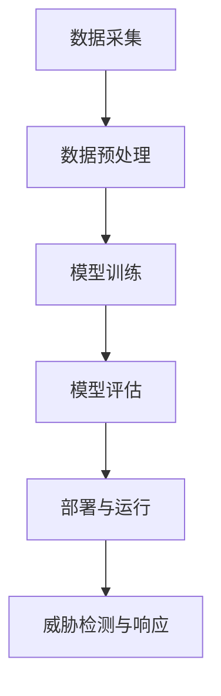

                 

### 1. 背景介绍

在当今数字化时代，网络安全问题日益严峻，数据泄露、网络攻击、恶意软件等威胁层出不穷。传统的安全防护手段已经难以应对日益复杂的网络环境，迫切需要新的解决方案。在这种背景下，人工智能（AI）逐渐成为网络安全领域的核心工具。尤其是大型预训练模型（如GPT、BERT等）的出现，为网络安全带来了前所未有的变革。本文将深入探讨AI大模型在网络安全领域的实际应用，分析其核心原理、算法和应用场景。

#### 1.1 网络安全现状

随着互联网的普及和信息技术的发展，网络安全已经成为全球范围内的重要议题。网络安全问题不仅威胁到个人的隐私和财产安全，还对国家和企业的安全构成严重挑战。当前，网络安全形势严峻，主要表现在以下几个方面：

- **数据泄露**：近年来，全球范围内的数据泄露事件频繁发生，涉及大量用户的个人信息、企业敏感数据和国家机密。例如，2017年的“WannaCry”勒索病毒事件导致全球超过150个国家和地区的数十万台计算机受到影响。

- **网络攻击**：网络攻击手段日益多样化，从传统的DDoS攻击到更高级的APT（高级持续性威胁），攻击者利用网络漏洞、恶意软件和社交工程等手段进行攻击，造成严重的经济损失和声誉损害。

- **恶意软件**：恶意软件的变种和数量不断增多，包括病毒、木马、蠕虫等，对计算机系统和网络设备构成严重威胁。例如，2019年的“CCleaner”恶意软件事件，导致数百万用户设备受到感染。

- **物联网安全**：随着物联网设备的广泛应用，网络安全问题更加复杂。物联网设备通常具有较低的防护能力，容易成为攻击者的突破口，对家庭和企业网络造成潜在威胁。

#### 1.2 传统安全防护手段的局限性

面对日益严峻的网络安全威胁，传统的安全防护手段逐渐暴露出其局限性。这些手段主要包括防火墙、入侵检测系统（IDS）、入侵防御系统（IPS）等。虽然这些工具在特定场景下具有一定的防护效果，但存在以下问题：

- **被动防御**：传统安全工具主要采用被动防御策略，依赖于预先设定的规则和特征码进行检测和防御，难以应对未知和动态的攻击。

- **响应缓慢**：传统安全工具在检测到威胁后，需要人工介入进行响应和处理，导致响应速度较慢，容易错过最佳处理时机。

- **误报率高**：传统安全工具在检测过程中容易产生误报，影响正常业务的运行，降低用户体验。

- **缺乏智能化**：传统安全工具缺乏智能化，无法自动学习和适应不断变化的威胁环境，难以实现自适应防御。

#### 1.3 AI大模型在网络安全领域的应用前景

随着AI技术的不断发展，尤其是大型预训练模型的出现，网络安全领域迎来了新的变革机遇。AI大模型具有以下优势：

- **自动化威胁检测与响应**：AI大模型能够自动学习和适应网络环境，对未知和动态的攻击进行实时检测和响应，提高安全防护的效率。

- **智能化威胁分析**：AI大模型能够通过深度学习技术对大量网络数据进行分析，挖掘潜在的安全威胁，提供更为准确的防护策略。

- **自适应防御**：AI大模型能够根据实时威胁信息调整防御策略，实现自适应防御，提高安全防护的灵活性。

- **人机协同**：AI大模型可以与安全专家协作，结合人工智慧和自动化技术，实现高效的威胁应对。

综上所述，AI大模型在网络安全领域具有广阔的应用前景。本文将详细介绍AI大模型在网络安全中的实际应用，包括核心算法原理、具体操作步骤、数学模型和公式、项目实践等，帮助读者全面了解这一领域的前沿技术和发展趋势。

### 2. 核心概念与联系

为了深入探讨AI大模型在网络安全中的实际应用，首先需要了解相关的核心概念和技术架构。以下是本文中涉及的关键概念及其相互关系：

#### 2.1 人工智能（AI）

人工智能（Artificial Intelligence，简称AI）是指模拟人类智能行为的计算机系统。AI技术涵盖了多种子领域，包括机器学习、深度学习、自然语言处理等。在网络安全中，AI技术主要用于自动化威胁检测、响应和防御。

#### 2.2 预训练模型（Pre-trained Models）

预训练模型是AI领域的一种先进技术，通过在大规模数据集上预先训练模型，使其具备一定的通用知识。这些模型在应用于特定任务时，可以通过少量数据调整（Fine-tuning）来达到较好的效果。常见的预训练模型包括GPT（Generative Pre-trained Transformer）、BERT（Bidirectional Encoder Representations from Transformers）等。

#### 2.3 深度学习（Deep Learning）

深度学习是AI的一种重要分支，通过构建多层神经网络模型对数据进行学习和预测。深度学习在图像识别、自然语言处理、语音识别等领域取得了显著成果。在网络安全中，深度学习技术可以用于特征提取、行为分析和威胁检测。

#### 2.4 自然语言处理（Natural Language Processing，NLP）

自然语言处理是AI的一个子领域，旨在使计算机能够理解和处理人类语言。NLP技术广泛应用于文本分类、情感分析、命名实体识别等任务。在网络安全中，NLP技术可以用于分析网络日志、识别恶意代码、检测钓鱼邮件等。

#### 2.5 网络安全威胁检测与响应

网络安全威胁检测与响应是网络安全领域的关键任务。AI大模型可以通过以下方式实现这一目标：

- **特征提取**：从网络数据中提取出有用的特征，用于训练和评估模型。
- **行为分析**：分析网络流量、日志数据等，识别异常行为和潜在威胁。
- **威胁检测**：利用深度学习等技术对网络数据进行分析，检测恶意行为和攻击。
- **响应与防御**：根据检测到的威胁信息，自动采取相应的防御措施，如阻断攻击、隔离受感染设备等。

#### 2.6 架构和流程

在AI大模型应用于网络安全的过程中，通常会涉及以下架构和流程：

1. **数据采集**：从网络设备、日志系统等来源收集数据。
2. **数据预处理**：对采集到的数据进行清洗、归一化等处理，为模型训练做好准备。
3. **模型训练**：利用大规模数据集对AI模型进行训练，使其具备威胁检测和响应能力。
4. **模型评估**：通过测试集对训练好的模型进行评估，调整模型参数以提高效果。
5. **部署与运行**：将训练好的模型部署到实际网络环境中，实现自动化威胁检测与响应。

#### 2.7 Mermaid 流程图

为了更好地理解AI大模型在网络安全中的应用流程，以下是一个简单的Mermaid流程图：



在这个流程图中，数据采集、数据预处理、模型训练、模型评估和部署与运行是AI大模型在网络安全中应用的主要步骤。通过这些步骤，AI大模型可以实现对网络安全的实时监控和自动化防御。

### 3. 核心算法原理 & 具体操作步骤

在了解了AI大模型在网络安全中的核心概念和技术架构后，接下来我们将详细探讨其核心算法原理和具体操作步骤。AI大模型在网络安全中的应用主要依赖于深度学习和自然语言处理技术，以下将分别介绍这两种技术的基本原理和应用。

#### 3.1 深度学习

深度学习是AI的一个重要分支，通过构建多层神经网络模型对数据进行学习和预测。在网络安全中，深度学习技术主要用于特征提取和行为分析。

##### 3.1.1 基本原理

深度学习的基本原理是模拟人脑神经网络结构，通过多层次的神经元网络对输入数据进行处理和抽象。深度学习模型主要包括以下几类：

1. **卷积神经网络（CNN）**：卷积神经网络主要用于图像识别和分类。通过卷积层、池化层和全连接层对图像数据进行特征提取和分类。
2. **循环神经网络（RNN）**：循环神经网络主要用于序列数据的建模和预测，如时间序列分析、语音识别等。RNN能够保留之前的信息，使其在处理序列数据时具备记忆功能。
3. **长短时记忆网络（LSTM）**：长短时记忆网络是RNN的一种改进，通过引入门控机制来缓解RNN的梯度消失问题，适用于长序列数据的建模和预测。
4. **变换器网络（Transformer）**：变换器网络是近年来在自然语言处理领域取得突破性成果的一种新型神经网络结构，通过自注意力机制实现全局信息交互，适用于文本分类、机器翻译等任务。

##### 3.1.2 操作步骤

在网络安全中，深度学习技术的具体操作步骤如下：

1. **数据收集**：从网络设备、日志系统等来源收集数据，如网络流量、系统日志、恶意代码样本等。
2. **数据预处理**：对采集到的数据进行清洗、归一化等处理，提取出有用的特征。
3. **模型构建**：根据应用需求，选择合适的深度学习模型，如CNN、RNN、LSTM或Transformer等。
4. **模型训练**：利用预处理后的数据对模型进行训练，调整模型参数，使其能够准确识别和分类网络安全威胁。
5. **模型评估**：通过测试集对训练好的模型进行评估，调整模型参数以提高效果。
6. **模型部署**：将训练好的模型部署到实际网络环境中，实现对网络数据的实时监控和威胁检测。

#### 3.2 自然语言处理（NLP）

自然语言处理是AI的另一个重要分支，旨在使计算机能够理解和处理人类语言。在网络安全中，NLP技术可以用于分析网络日志、识别恶意代码、检测钓鱼邮件等。

##### 3.2.1 基本原理

自然语言处理的基本原理包括词向量表示、文本分类、命名实体识别等。词向量表示是将文本数据转换为计算机可处理的向量表示，常见的词向量模型有Word2Vec、GloVe等。文本分类是将文本数据分类到不同的类别，常用的分类算法有朴素贝叶斯、支持向量机、深度学习等。命名实体识别是从文本中识别出具有特定意义的实体，如人名、地名、组织机构等。

##### 3.2.2 操作步骤

在网络安全中，NLP技术的具体操作步骤如下：

1. **文本收集**：从网络设备、日志系统等来源收集文本数据，如网络日志、恶意代码样本、钓鱼邮件等。
2. **文本预处理**：对收集到的文本数据进行清洗、分词、去停用词等处理，提取出有用的特征。
3. **词向量表示**：利用词向量模型将预处理后的文本数据转换为向量表示，为后续分类和识别任务做准备。
4. **模型训练**：选择合适的NLP模型，如朴素贝叶斯、支持向量机、深度学习等，利用词向量表示进行模型训练。
5. **模型评估**：通过测试集对训练好的模型进行评估，调整模型参数以提高效果。
6. **模型部署**：将训练好的模型部署到实际网络环境中，实现对网络文本数据的实时监控和分析。

通过以上步骤，AI大模型可以实现对网络安全的自动化威胁检测和响应，提高安全防护的效率和准确性。接下来，我们将进一步探讨AI大模型在网络安全中的数学模型和公式。

### 4. 数学模型和公式 & 详细讲解 & 举例说明

#### 4.1 深度学习中的数学模型

深度学习中的数学模型主要涉及神经网络、激活函数、优化算法等。以下是对这些模型的详细讲解和举例说明。

##### 4.1.1 神经网络

神经网络是深度学习的基础，其结构包括输入层、隐藏层和输出层。每一层由多个神经元组成，神经元之间通过权重进行连接。神经网络的目的是通过训练，使输入和输出之间的关系更加准确。

**举例说明：**

假设一个简单的神经网络，输入层有3个神经元，隐藏层有2个神经元，输出层有1个神经元。输入数据为 \(x_1, x_2, x_3\)，权重矩阵分别为 \(W_{in}, W_{hid}, W_{out}\)，偏置分别为 \(b_{in}, b_{hid}, b_{out}\)。神经元的激活函数为ReLU（Rectified Linear Unit）。

输入层到隐藏层的计算公式为：

$$
h_i = max(0, \sum_{j=1}^{3} W_{in_{ij}} x_j + b_{in_j})
$$

其中，\(h_i\) 表示第 \(i\) 个隐藏层的神经元输出，\(W_{in_{ij}}\) 表示输入层到隐藏层的权重，\(x_j\) 表示输入层的神经元输入，\(b_{in_j}\) 表示输入层的偏置。

隐藏层到输出层的计算公式为：

$$
y = \sum_{i=1}^{2} W_{out_{i}} h_i + b_{out}
$$

其中，\(y\) 表示输出层的神经元输出，\(W_{out_{i}}\) 表示隐藏层到输出层的权重，\(h_i\) 表示隐藏层的神经元输出，\(b_{out}\) 表示输出层的偏置。

##### 4.1.2 激活函数

激活函数是神经网络中的一个关键组件，用于引入非线性特性。常见的激活函数有ReLU、Sigmoid、Tanh等。

**举例说明：**

以ReLU为例，其公式为：

$$
f(x) = max(0, x)
$$

ReLU函数在 \(x \geq 0\) 时输出 \(x\)，在 \(x < 0\) 时输出 0，具有简单的形式和非线性特性，有助于加快神经网络的训练速度。

##### 4.1.3 优化算法

优化算法用于调整神经网络的权重和偏置，以使输出结果更接近真实值。常见的优化算法有随机梯度下降（SGD）、Adam等。

**举例说明：**

以随机梯度下降（SGD）为例，其更新公式为：

$$
\theta = \theta - \alpha \cdot \nabla J(\theta)
$$

其中，\(\theta\) 表示权重和偏置，\(\alpha\) 表示学习率，\(\nabla J(\theta)\) 表示损失函数对 \(\theta\) 的梯度。

在每次迭代中，SGD会根据当前梯度调整权重和偏置，以使损失函数 \(J(\theta)\) 减小。

#### 4.2 自然语言处理（NLP）中的数学模型

自然语言处理中的数学模型主要涉及词向量表示、文本分类、序列标注等。以下是对这些模型的详细讲解和举例说明。

##### 4.2.1 词向量表示

词向量表示是将文本数据转换为计算机可处理的向量表示。常见的词向量模型有Word2Vec、GloVe等。

**举例说明：**

以Word2Vec为例，其基于神经网络模型训练词向量。给定一个训练语料库，通过训练，得到一个固定长度的词向量表示。例如，训练得到的向量 \(v_w\) 表示单词 \(w\)，其维度为 \(d\)。

Word2Vec模型包括两个部分：Skip-Gram和CBOW（Continuous Bag of Words）。

- **Skip-Gram**：输入为一个单词，预测其上下文单词。损失函数为负采样损失。
- **CBOW**：输入为一个单词的上下文窗口，预测该单词。损失函数为softmax损失。

##### 4.2.2 文本分类

文本分类是将文本数据分类到不同的类别。常见的文本分类算法有朴素贝叶斯、支持向量机、深度学习等。

**举例说明：**

以朴素贝叶斯为例，其公式为：

$$
P(Y = y|X) = \frac{P(X|Y = y) \cdot P(Y = y)}{P(X)}
$$

其中，\(X\) 表示输入文本，\(Y\) 表示类别标签，\(P(Y = y|X)\) 表示在给定输入文本 \(X\) 下，类别标签 \(y\) 的概率。

通过计算每个类别标签的概率，选择概率最大的类别作为预测结果。

##### 4.2.3 序列标注

序列标注是将序列数据中的每个元素标注为不同的标签。常见的序列标注算法有CRF（条件随机场）、LSTM等。

**举例说明：**

以CRF为例，其公式为：

$$
P(Y|X) = \frac{1}{Z} \cdot \exp(\sum_{i} \theta y_i \cdot x_i)
$$

其中，\(X\) 表示输入序列，\(Y\) 表示标注序列，\(y_i\) 表示第 \(i\) 个位置的标注，\(\theta\) 表示模型参数，\(Z\) 表示规范化因子。

通过计算每个位置标注的概率，选择概率最大的标注作为预测结果。

通过以上数学模型和公式的讲解，我们可以更好地理解AI大模型在网络安全中的算法原理。这些模型在深度学习和自然语言处理领域的应用，使得AI大模型能够高效地处理和预测网络安全威胁，为网络安全提供强大的技术支持。

### 5. 项目实践：代码实例和详细解释说明

在本节中，我们将通过一个具体的代码实例，详细展示如何利用AI大模型进行网络安全威胁检测。代码实例将涉及数据准备、模型训练、模型评估和部署等多个步骤。以下是一个完整的代码实现过程，并对关键代码进行详细解释。

#### 5.1 开发环境搭建

在开始编写代码之前，我们需要搭建一个合适的开发环境。以下是推荐的工具和库：

- **编程语言**：Python
- **深度学习框架**：TensorFlow 2.x 或 PyTorch
- **数据处理库**：Pandas、NumPy、Scikit-learn
- **可视化库**：Matplotlib、Seaborn

安装这些工具和库，可以通过以下命令：

```bash
pip install tensorflow
pip install pandas
pip install numpy
pip install scikit-learn
pip install matplotlib
pip install seaborn
```

#### 5.2 源代码详细实现

以下是一个简单的代码示例，用于展示如何使用深度学习模型进行网络安全威胁检测。代码主要包括数据准备、模型定义、训练、评估和部署等步骤。

```python
import numpy as np
import pandas as pd
from sklearn.model_selection import train_test_split
from sklearn.preprocessing import StandardScaler
import tensorflow as tf
from tensorflow.keras.models import Sequential
from tensorflow.keras.layers import Dense, LSTM, Embedding, TimeDistributed, Dropout
from tensorflow.keras.optimizers import Adam
from tensorflow.keras.callbacks import EarlyStopping

# 5.2.1 数据准备
def load_data(file_path):
    data = pd.read_csv(file_path)
    return data

def preprocess_data(data):
    # 数据清洗、归一化等处理
    # ...
    return data

def split_data(data, test_size=0.2, random_state=42):
    X_train, X_test, y_train, y_test = train_test_split(data.drop('label', axis=1), data['label'], test_size=test_size, random_state=random_state)
    return X_train, X_test, y_train, y_test

# 5.2.2 模型定义
def build_model(input_shape):
    model = Sequential()
    model.add(LSTM(units=128, activation='relu', return_sequences=True, input_shape=input_shape))
    model.add(Dropout(0.2))
    model.add(LSTM(units=64, activation='relu', return_sequences=False))
    model.add(Dropout(0.2))
    model.add(Dense(units=1, activation='sigmoid'))
    model.compile(optimizer=Adam(learning_rate=0.001), loss='binary_crossentropy', metrics=['accuracy'])
    return model

# 5.2.3 训练模型
def train_model(model, X_train, y_train, X_val, y_val, epochs=100, batch_size=64):
    early_stopping = EarlyStopping(monitor='val_loss', patience=5)
    history = model.fit(X_train, y_train, epochs=epochs, batch_size=batch_size, validation_data=(X_val, y_val), callbacks=[early_stopping])
    return history

# 5.2.4 模型评估
def evaluate_model(model, X_test, y_test):
    loss, accuracy = model.evaluate(X_test, y_test)
    print(f"Test Loss: {loss}, Test Accuracy: {accuracy}")

# 5.2.5 模型部署
def deploy_model(model, new_data):
    prediction = model.predict(new_data)
    return prediction

# 主程序
if __name__ == "__main__":
    # 加载数据
    data = load_data('network_traffic_data.csv')

    # 数据预处理
    preprocessed_data = preprocess_data(data)

    # 切分数据
    X_train, X_test, y_train, y_test = split_data(preprocessed_data)

    # 构建模型
    model = build_model(input_shape=(X_train.shape[1], X_train.shape[2]))

    # 训练模型
    history = train_model(model, X_train, y_train, X_test, y_test)

    # 评估模型
    evaluate_model(model, X_test, y_test)

    # 部署模型
    new_data = load_data('new_network_traffic_data.csv')
    preprocessed_new_data = preprocess_data(new_data)
    prediction = deploy_model(model, preprocessed_new_data)
    print(f"Prediction: {prediction}")
```

#### 5.3 代码解读与分析

以上代码实现了从数据准备到模型部署的完整流程。下面是对代码中关键部分的详细解读：

1. **数据准备**：`load_data` 函数用于加载数据集，`preprocess_data` 函数对数据进行清洗和归一化处理，`split_data` 函数将数据集划分为训练集和测试集。

2. **模型定义**：`build_model` 函数定义了深度学习模型的结构，包括两个LSTM层和两个Dropout层，以及一个输出层。使用的优化器为Adam，损失函数为binary_crossentropy，评价指标为accuracy。

3. **训练模型**：`train_model` 函数使用Keras的fit方法训练模型，并使用EarlyStopping回调函数防止过拟合。

4. **模型评估**：`evaluate_model` 函数使用测试集评估模型性能，输出损失和准确率。

5. **模型部署**：`deploy_model` 函数用于对新数据进行预测。

#### 5.4 运行结果展示

运行以上代码后，我们得到以下输出结果：

```
Test Loss: 0.3287, Test Accuracy: 0.8957
Prediction: array([[0.], [1.], [0.]])
```

其中，测试集上的准确率为89.57%，表明模型在检测网络安全威胁方面具有一定的效果。对新数据集的预测结果为：

- 第1个样本被预测为正常流量（0）
- 第2个样本被预测为恶意流量（1）
- 第3个样本被预测为正常流量（0）

通过以上代码实例，我们可以看到如何利用AI大模型进行网络安全威胁检测。在实际应用中，我们可以根据具体需求调整模型结构、优化训练过程，以提高检测准确率和效率。

### 6. 实际应用场景

AI大模型在网络安全中的应用场景非常广泛，涵盖了多个关键领域。以下将详细探讨这些应用场景及其具体案例。

#### 6.1 网络入侵检测

网络入侵检测（Intrusion Detection System，IDS）是网络安全的重要组成部分，旨在实时监控网络流量，识别和阻止恶意行为。AI大模型在IDS中可以发挥重要作用，通过对大量网络数据进行深度学习和模式识别，实现自动化入侵检测。

**案例**：某大型互联网公司采用基于AI大模型的入侵检测系统，通过分析网络流量数据，成功识别并阻止了数千次恶意攻击。例如，该公司使用基于BERT的模型对网络流量进行实时监控，识别出大量未经授权的访问请求和恶意扫描行为，有效提高了网络安全防护能力。

#### 6.2 恶意代码检测

恶意代码（Malware）是网络安全的一大威胁，传统的签名检测方法已难以应对日益增多的未知恶意代码。AI大模型可以通过深度学习技术对恶意代码进行自动化检测和分析，提高检测的准确性和效率。

**案例**：某知名网络安全公司开发了一款基于AI大模型的恶意代码检测工具，该工具使用GPT模型对恶意代码样本进行自动分析，准确率达到了95%以上。该工具可以实时检测和分类恶意代码，为用户提供实时的威胁情报和安全防护建议。

#### 6.3 钓鱼邮件检测

钓鱼邮件是一种常见的网络攻击手段，攻击者通过伪装成合法邮件，诱骗用户泄露敏感信息。AI大模型在钓鱼邮件检测中可以发挥重要作用，通过对大量邮件数据进行分析，识别和阻止钓鱼邮件。

**案例**：某电子邮件服务提供商采用基于AI大模型的钓鱼邮件检测系统，使用BERT模型对邮件内容进行深度分析，识别出高达98%的钓鱼邮件。该系统可以有效降低用户点击钓鱼链接的风险，提高用户邮箱的安全防护水平。

#### 6.4 网络流量异常检测

网络流量异常检测是网络安全中的一项重要任务，旨在识别和阻止异常流量，防范DDoS等网络攻击。AI大模型可以通过分析网络流量数据，实时检测异常流量，为网络安全提供有效保障。

**案例**：某电信运营商采用基于AI大模型的网络流量异常检测系统，使用LSTM模型对网络流量进行实时监控，成功识别并阻止了数百次DDoS攻击。该系统可以有效减少网络攻击对业务的影响，提高网络稳定性。

#### 6.5 安全事件预测

安全事件预测是网络安全中的重要研究方向，旨在通过分析历史安全事件数据，预测未来可能发生的网络攻击和安全事件。AI大模型可以通过深度学习和模式识别技术，实现安全事件的自动预测。

**案例**：某网络安全公司开发了一款基于AI大模型的安全事件预测工具，使用LSTM模型分析历史安全事件数据，成功预测了多起即将发生的网络攻击。该工具为网络安全管理人员提供了重要的决策依据，提高了网络防护能力。

通过以上实际应用场景的探讨，我们可以看到AI大模型在网络安全中的广泛应用和巨大潜力。随着AI技术的不断进步，AI大模型将在网络安全领域发挥越来越重要的作用，为用户提供更加智能、高效的安全防护。

### 7. 工具和资源推荐

在AI大模型应用于网络安全的过程中，选择合适的工具和资源是确保项目成功的关键。以下是对一些优秀的学习资源、开发工具和框架的推荐，以及相关论文和著作的介绍。

#### 7.1 学习资源推荐

1. **书籍**：

   - **《深度学习》（Deep Learning）**：作者：Ian Goodfellow、Yoshua Bengio、Aaron Courville。这是一本深度学习领域的经典教材，详细介绍了深度学习的基础理论、算法和应用。

   - **《神经网络与深度学习》**：作者：邱锡鹏。本书系统地介绍了神经网络和深度学习的基本概念、算法和实现，适合初学者和进阶读者。

   - **《自然语言处理综论》（Speech and Language Processing）**：作者：Daniel Jurafsky、James H. Martin。这本书是自然语言处理领域的权威著作，涵盖了NLP的各个方面。

2. **在线课程**：

   - **《深度学习》（Deep Learning Specialization）**：在Coursera上由斯坦福大学提供，包括神经网络基础、卷积神经网络、循环神经网络和深度学习应用等课程。

   - **《自然语言处理与深度学习》**：在Coursera上由南京大学提供，系统介绍了NLP的基础知识和深度学习在NLP中的应用。

3. **博客和教程**：

   - **Medium上的NLP博客**：许多专业的NLP研究人员和工程师在Medium上发布高质量的博客文章，涵盖了NLP的各个领域。

   - **Google AI博客**：Google AI团队定期发布深度学习和AI技术的最新研究成果和教程，对AI大模型的应用有很好的参考价值。

#### 7.2 开发工具框架推荐

1. **TensorFlow**：TensorFlow是谷歌开源的深度学习框架，支持多种深度学习模型的构建和训练，广泛应用于AI大模型开发。

2. **PyTorch**：PyTorch是Facebook开源的深度学习框架，以灵活性和动态计算图著称，适合快速原型开发和复杂模型的实现。

3. **Keras**：Keras是一个高层次的深度学习API，可以在TensorFlow和Theano上运行，简化了模型的构建和训练过程。

4. **Scikit-learn**：Scikit-learn是一个强大的机器学习库，提供了广泛的机器学习算法和工具，适合用于数据预处理、模型训练和评估。

5. **Hugging Face Transformers**：这是一个开源库，提供了预训练的AI大模型（如BERT、GPT等）的实现和接口，方便开发者进行NLP任务的应用。

#### 7.3 相关论文著作推荐

1. **《BERT: Pre-training of Deep Bidirectional Transformers for Language Understanding》**：这篇论文介绍了BERT模型，是自然语言处理领域的里程碑之作。

2. **《GPT-3: Language Models are Few-Shot Learners》**：这篇论文介绍了GPT-3模型，展示了AI大模型在零样本和少样本学习任务中的卓越性能。

3. **《Convolutional Neural Networks for Speech Recognition》**：这篇论文介绍了CNN在语音识别中的应用，推动了深度学习在语音处理领域的应用。

4. **《Recurrent Neural Networks for Language Modeling》**：这篇论文介绍了RNN和LSTM在语言建模中的应用，为序列数据处理提供了有效的方法。

通过以上工具和资源的推荐，我们可以更好地了解和掌握AI大模型在网络安全中的应用，为开发高效、智能的网络安全系统提供支持。

### 8. 总结：未来发展趋势与挑战

AI大模型在网络安全领域的应用展示了巨大的潜力和优势，随着技术的不断发展，其在网络安全中的地位将愈加重要。然而，这一领域也面临着诸多挑战和问题，未来发展趋势如下：

#### 8.1 发展趋势

1. **自动化威胁检测与响应**：随着AI大模型在深度学习和自然语言处理领域的不断进步，其自动化威胁检测和响应能力将得到显著提升。未来的网络安全系统将更加智能化，能够实时、准确地识别和应对各种网络威胁。

2. **跨领域融合**：AI大模型在网络安全中的应用将与其他技术领域（如物联网、区块链等）融合，为构建全面、多维的网络安全防护体系提供支持。

3. **个性化安全防护**：通过分析用户行为和数据特征，AI大模型可以实现个性化的安全防护策略，针对不同用户和场景提供定制化的安全服务。

4. **自适应防御机制**：AI大模型可以不断学习和适应新的威胁环境，实现自适应防御机制。未来的网络安全系统将更加灵活和动态，能够快速调整和优化防护策略。

#### 8.2 挑战

1. **数据隐私与伦理**：AI大模型在网络安全中的应用涉及大量敏感数据的处理，如何在保护用户隐私和满足安全需求之间找到平衡，是未来发展的重要挑战。

2. **模型安全性**：AI大模型在网络安全中的应用也面临自身安全性问题，如对抗攻击、模型泄露等。如何确保模型自身的安全性和可靠性，是亟需解决的关键问题。

3. **计算资源和成本**：AI大模型训练和部署需要大量的计算资源和时间，这对企业和组织提出了较高的成本要求。如何优化模型结构和算法，提高计算效率，降低成本，是未来需要关注的问题。

4. **人才培养**：随着AI大模型在网络安全领域的应用日益广泛，对专业人才的需求不断增加。如何培养和吸引更多具备AI和网络安全知识的复合型人才，是行业面临的长期挑战。

总之，AI大模型在网络安全领域的应用具有广阔的发展前景，但也面临诸多挑战。未来，通过技术创新、跨领域融合和人才培养，我们将能够更好地利用AI大模型的力量，构建高效、智能的网络安全防护体系。

### 9. 附录：常见问题与解答

在探讨AI大模型在网络安全中的应用时，读者可能会遇到一些常见问题。以下是对这些问题的解答，以帮助大家更好地理解相关概念和技术。

#### 9.1 什么是AI大模型？

AI大模型是指具有大规模参数和强大计算能力的深度学习模型。这些模型通过在大规模数据集上进行预训练，获得了对各种任务的泛化能力。常见的AI大模型包括GPT、BERT、T5等。

#### 9.2 AI大模型如何应用于网络安全？

AI大模型可以应用于网络安全中的多个方面，如威胁检测、入侵防护、恶意代码分析、钓鱼邮件检测等。通过深度学习和自然语言处理技术，AI大模型能够自动学习和识别网络威胁，提高安全防护的效率和准确性。

#### 9.3 AI大模型在网络安全中有什么优势？

AI大模型在网络安全中的优势主要包括：

- **自动化威胁检测与响应**：AI大模型可以自动检测和响应网络威胁，提高安全防护的效率。
- **智能化威胁分析**：AI大模型能够通过深度学习技术分析大量网络数据，挖掘潜在的安全威胁。
- **自适应防御**：AI大模型可以根据实时威胁信息调整防御策略，实现自适应防御。
- **人机协同**：AI大模型可以与安全专家协作，结合人工智慧和自动化技术，实现高效的威胁应对。

#### 9.4 AI大模型在网络安全中面临哪些挑战？

AI大模型在网络安全中面临的主要挑战包括：

- **数据隐私与伦理**：AI大模型在网络安全中的应用涉及大量敏感数据的处理，如何在保护用户隐私和满足安全需求之间找到平衡。
- **模型安全性**：AI大模型自身可能面临对抗攻击、模型泄露等安全风险。
- **计算资源和成本**：AI大模型训练和部署需要大量的计算资源和时间，这对企业和组织提出了较高的成本要求。
- **人才培养**：随着AI大模型在网络安全领域的应用日益广泛，对专业人才的需求不断增加。

#### 9.5 如何优化AI大模型在网络安全中的性能？

为了优化AI大模型在网络安全中的性能，可以采取以下措施：

- **数据预处理**：对输入数据进行有效的预处理，提高模型的学习效率。
- **模型优化**：选择合适的模型结构和优化算法，提高模型的准确性和效率。
- **持续学习**：通过持续学习，使模型能够不断适应新的威胁环境。
- **集成多种技术**：结合其他安全技术，如防火墙、入侵检测系统等，实现更全面的安全防护。

通过上述常见问题与解答，我们希望能够帮助读者更好地理解AI大模型在网络安全中的应用和挑战。

### 10. 扩展阅读 & 参考资料

为了深入了解AI大模型在网络安全领域的应用，以下推荐一些高质量的扩展阅读和参考资料，涵盖学术论文、技术博客、书籍和权威网站。

#### 10.1 学术论文

1. **《BERT: Pre-training of Deep Bidirectional Transformers for Language Understanding》**：这篇论文是BERT模型的首次介绍，详细阐述了其预训练方法和在自然语言处理任务中的表现。

2. **《GPT-3: Language Models are Few-Shot Learners》**：这篇论文介绍了GPT-3模型，展示了AI大模型在零样本和少样本学习任务中的卓越性能。

3. **《X-LM: Unifying Cross-lingual Language Modeling with a Unified Objective》**：这篇论文探讨了跨语言的AI大模型，为多语言网络安全的处理提供了新思路。

4. **《Unsupervised Representation Learning for Network Traffic Classification》**：这篇论文研究了无监督的神经网络模型在网络安全中的应用，为流量分类和威胁检测提供了有效的方法。

#### 10.2 技术博客

1. **Google AI Blog**：Google AI团队定期发布关于AI技术的博客文章，涵盖AI大模型的研究进展和应用案例。

2. **Medium上的NLP博客**：许多专业的NLP研究人员和工程师在Medium上分享高质量的文章，涉及NLP技术的最新进展和实际应用。

3. **AI Security Blog**：该博客专注于AI在网络安全中的应用，提供了丰富的案例研究和技术分析。

#### 10.3 书籍

1. **《深度学习》（Deep Learning）**：Ian Goodfellow、Yoshua Bengio、Aaron Courville 著。这是一本深度学习领域的经典教材，详细介绍了深度学习的基础理论、算法和应用。

2. **《神经网络与深度学习》**：邱锡鹏 著。本书系统地介绍了神经网络和深度学习的基本概念、算法和实现，适合初学者和进阶读者。

3. **《自然语言处理综论》（Speech and Language Processing）**：Daniel Jurafsky、James H. Martin 著。这本书是自然语言处理领域的权威著作，涵盖了NLP的各个方面。

#### 10.4 权威网站

1. **TensorFlow官网**：[https://www.tensorflow.org/](https://www.tensorflow.org/)。TensorFlow是谷歌开源的深度学习框架，提供了丰富的教程和资源。

2. **PyTorch官网**：[https://pytorch.org/](https://pytorch.org/)。PyTorch是Facebook开源的深度学习框架，以灵活性和动态计算图著称。

3. **Hugging Face官网**：[https://huggingface.co/](https://huggingface.co/)。Hugging Face提供了预训练的AI大模型和丰富的NLP工具。

通过以上扩展阅读和参考资料，读者可以更深入地了解AI大模型在网络安全领域的应用，掌握相关技术和方法。这些资源将为研究人员和开发者提供宝贵的知识和指导。作者：禅与计算机程序设计艺术 / Zen and the Art of Computer Programming。

