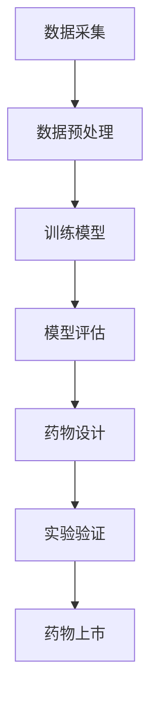

                 

### 1. 背景介绍

智能药物研发是一项涉及生物学、化学、计算机科学等多个领域的交叉学科研究。随着人工智能技术的迅速发展，特别是在深度学习和大数据分析方面，AI大模型在生物科技中的应用逐渐成为一个热点领域。传统药物研发过程耗时较长、成本高昂，且成功率较低。人工智能技术的引入，尤其是大模型的运用，有望显著提高药物研发的效率和成功率。

大模型在这里指的是具有数百万到数十亿参数的深度学习模型，如Transformer模型。这些模型通过学习海量的生物学、化学和医学数据，能够自动提取复杂的数据特征，实现药物筛选、分子对接、蛋白质结构预测等功能。与传统的小模型相比，大模型在处理大规模数据和复杂任务时具有更强的能力和适应性。

近年来，AI大模型在药物研发中的成功应用案例不断涌现。例如，AI公司DeepMind开发的AlphaFold模型，通过深度学习技术，实现了蛋白质三维结构的精确预测，这一突破为药物设计提供了全新的工具。此外，AI公司 Benevity 使用大模型进行药物重定位研究，通过分析已有药物的副作用和作用机制，发现了一些潜在的新药物靶点。

智能药物研发的重要性不容忽视。首先，它能够加速新药的发现和开发过程，降低研发成本。其次，大模型的应用有助于提高药物研发的成功率，尤其是在靶点选择和分子设计等关键环节。此外，智能药物研发还能帮助解决某些传统方法难以解决的医学难题，如罕见病治疗和新抗体药物的研发。

然而，智能药物研发也面临一些挑战。首先，大模型训练需要大量的数据和计算资源，这可能导致成本高昂。其次，模型的解释性较差，使得研究人员难以理解模型的具体工作机制。最后，数据隐私和伦理问题也是智能药物研发中需要考虑的重要因素。

本文将首先介绍智能药物研发的背景，包括人工智能在生物科技中的应用和发展趋势。接着，我们将探讨AI大模型在药物研发中的核心概念和架构，并详细解析其工作原理。随后，我们将通过具体实例，展示如何使用AI大模型进行药物研发。文章还将分析智能药物研发的实际应用场景，推荐相关的工具和资源，并总结未来发展趋势与挑战。通过本文的逐步分析，我们将深入理解AI大模型在智能药物研发中的创新与潜力。### 2. 核心概念与联系

智能药物研发的核心在于将人工智能技术与生物科技相结合，利用大模型来处理复杂的数据，并从中提取出关键的生物学和化学信息。为了更好地理解这一过程，我们需要介绍一些核心概念，并使用Mermaid流程图来展示其架构和流程。

#### 2.1 关键概念

1. **深度学习模型**：深度学习模型是人工智能的核心技术之一，特别是近年来，基于Transformer的模型如BERT、GPT等，被广泛应用于自然语言处理和图像识别等领域。在药物研发中，深度学习模型可以用于分子结构预测、药物-靶点相互作用预测等。

2. **生物序列数据**：生物序列数据包括DNA、RNA、蛋白质序列等，这些数据是生物科技研究的基础。通过深度学习模型，可以从这些序列数据中提取出生物信息，如蛋白质的结构和功能。

3. **化学结构数据**：化学结构数据包括药物分子的化学结构、作用机制等。这些数据对药物研发至关重要，深度学习模型可以通过学习这些化学结构数据，预测药物与靶点的相互作用。

4. **大规模数据集**：大规模数据集是训练深度学习模型的基础，包括公开的药物数据库、生物学数据库等。这些数据集为模型提供了丰富的训练样本，有助于提高模型的性能。

5. **数据预处理**：数据预处理是深度学习模型训练的关键步骤，包括数据清洗、归一化、特征提取等。通过预处理，可以去除数据中的噪声，提取出有用的特征，提高模型的训练效果。

#### 2.2 Mermaid流程图

以下是一个简化的Mermaid流程图，展示了智能药物研发的核心概念和流程：



**图1. 智能药物研发的流程图**

- **A[数据采集]**：包括从公开数据库、实验室数据等途径收集生物序列数据和化学结构数据。
- **B[数据预处理]**：对采集到的数据进行清洗、归一化、特征提取等处理，以获得高质量的训练数据。
- **C[训练模型]**：使用深度学习模型，如Transformer模型，对预处理后的数据进行训练，提取复杂的数据特征。
- **D[模型评估]**：通过交叉验证、误差分析等方法，评估模型的性能，确保其准确性和稳定性。
- **E[药物设计]**：利用训练好的模型进行药物设计，预测药物与靶点的相互作用，筛选潜在的新药。
- **F[实验验证]**：对新设计的药物进行实验室和临床实验，验证其有效性和安全性。
- **G[药物上市]**：通过实验验证的新药，申请上市，进入临床应用阶段。

#### 2.3 关系解释

- **深度学习模型与数据集**：深度学习模型需要大规模数据集进行训练，数据集的质量直接影响模型的性能。因此，数据预处理和数据集的构建是智能药物研发的基础。
- **数据预处理与模型训练**：数据预处理的好坏直接影响模型训练的效果。通过数据清洗、归一化和特征提取等步骤，可以提高模型的训练速度和准确性。
- **模型评估与药物设计**：评估模型的性能是确保其可用于药物设计的关键步骤。通过交叉验证和误差分析，可以筛选出性能优异的模型，用于药物设计。
- **药物设计与实验验证**：药物设计是基于模型预测的结果，实验验证则是验证药物设计是否成功的关键步骤。实验验证的成功与否，将决定药物是否能够进入临床应用。

通过以上核心概念和流程的介绍，我们可以更清晰地理解智能药物研发的过程。接下来，我们将深入探讨AI大模型在药物研发中的具体应用，包括其算法原理和操作步骤。这将帮助我们更好地掌握智能药物研发的核心技术。### 3. 核心算法原理 & 具体操作步骤

AI大模型在药物研发中的应用，主要依赖于深度学习技术，特别是Transformer模型和变分自编码器（Variational Autoencoder, VAE）等先进算法。本节将详细解释这些核心算法的原理，并介绍具体的操作步骤。

#### 3.1 Transformer模型原理

Transformer模型是一种基于自注意力机制（Self-Attention Mechanism）的深度学习模型，最初由Vaswani等人在2017年提出。其核心思想是通过自注意力机制来捕捉输入序列中任意两个位置之间的依赖关系，从而提高模型的表示能力。

**自注意力机制**：自注意力机制允许模型在生成每个词（或分子）时，考虑所有其他词（或分子）对当前词（或分子）的影响。具体来说，自注意力机制包括三个关键步骤：

1. **查询（Query）**：表示当前词（或分子）的潜在表示。
2. **键（Key）**：表示输入序列中所有词（或分子）的潜在表示。
3. **值（Value）**：表示输入序列中所有词（或分子）的潜在表示。

自注意力得分计算公式为：

\[ \text{Attention}(Q, K, V) = \text{softmax}\left(\frac{QK^T}{\sqrt{d_k}}\right)V \]

其中，\( Q, K, V \) 分别是查询、键和值的线性变换，\( d_k \) 是键的维度。

**Transformer模型架构**：Transformer模型通常由多个相同的编码器（Encoder）和解码器（Decoder）层堆叠而成。每个层包括两个主要部分：多头自注意力机制（Multi-Head Self-Attention）和前馈神经网络（Feed-Forward Neural Network）。

**具体操作步骤**：

1. **输入数据预处理**：将输入序列（如DNA序列、蛋白质序列或药物分子结构）编码为向量。
2. **自注意力计算**：通过多头自注意力机制计算每个词（或分子）的注意力得分，并生成加权表示。
3. **前馈神经网络**：对加权表示进行两次线性变换，增强模型的表达能力。
4. **层归一化和残差连接**：在每个编码器和解码器层之后，添加层归一化和残差连接，防止梯度消失和梯度爆炸。
5. **模型训练**：使用训练数据对模型进行训练，优化模型参数。

#### 3.2 变分自编码器（VAE）原理

变分自编码器（Variational Autoencoder, VAE）是一种生成模型，由Kingma和Welling在2013年提出。VAE通过引入变分推断技术，解决了传统自编码器在生成数据时表现不佳的问题。

**变分推断**：变分推断是一种近似推断方法，通过学习一个概率分布的参数来近似真实分布。在VAE中，我们学习两个分布：编码器（Encoder）学习一个表示数据的概率分布，解码器（Decoder）学习从该分布生成数据的概率分布。

**VAE模型架构**：

1. **编码器**：将输入数据映射到一个潜在空间中的向量，该向量表示数据的概率分布参数。
2. **解码器**：从潜在空间中采样向量，并生成与输入数据相似的新数据。
3. **潜在空间**：一个概率分布，用于生成新数据和优化编码器和解码器的参数。

**具体操作步骤**：

1. **输入数据预处理**：对输入数据（如药物分子结构）进行编码，转化为一个向量。
2. **编码器计算**：计算输入数据的概率分布参数，并生成潜在空间中的向量。
3. **解码器计算**：从潜在空间中采样向量，并解码为新的数据。
4. **损失函数**：计算编码器和解码器的损失函数，并使用梯度下降法优化模型参数。
5. **模型训练**：通过训练数据，不断调整编码器和解码器的参数，使其生成的新数据越来越接近真实数据。

#### 3.3 应用示例

**药物分子生成**：假设我们使用VAE模型生成新的药物分子结构。具体步骤如下：

1. **数据准备**：收集大量已知的药物分子结构数据，作为训练数据。
2. **模型训练**：使用VAE模型训练编码器和解码器，使其能够从潜在空间生成与训练数据相似的药物分子结构。
3. **生成新分子**：从潜在空间中采样向量，并解码为新的药物分子结构。
4. **筛选评估**：对新生成的分子进行筛选，评估其药理活性和安全性，选择具有潜在价值的分子进行进一步研究。

**药物-靶点相互作用预测**：使用Transformer模型预测药物与靶点的相互作用。具体步骤如下：

1. **数据准备**：收集药物分子和靶点蛋白的序列数据，并编码为向量。
2. **模型训练**：使用Transformer模型训练，学习药物分子和靶点蛋白之间的相互作用模式。
3. **预测**：将新药物分子输入模型，预测其与靶点的相互作用得分。
4. **筛选评估**：根据相互作用得分筛选潜在的新药，进行实验验证。

通过以上核心算法原理和具体操作步骤的介绍，我们可以看到AI大模型在药物研发中的应用具有广泛的前景。接下来，我们将深入探讨这些算法的数学模型和公式，并举例说明其应用。这将帮助我们更好地理解AI大模型在药物研发中的技术细节。### 4. 数学模型和公式 & 详细讲解 & 举例说明

为了深入理解AI大模型在药物研发中的应用，我们需要详细介绍其数学模型和公式，并通过具体实例来说明其操作过程和效果。

#### 4.1 Transformer模型

**4.1.1 自注意力机制**

自注意力机制是Transformer模型的核心，其计算公式如下：

\[ \text{Attention}(Q, K, V) = \text{softmax}\left(\frac{QK^T}{\sqrt{d_k}}\right)V \]

其中：
- \( Q \) 是查询向量，表示当前词（或分子）的潜在表示。
- \( K \) 是键向量，表示输入序列中所有词（或分子）的潜在表示。
- \( V \) 是值向量，表示输入序列中所有词（或分子）的潜在表示。
- \( d_k \) 是键的维度。

**4.1.2 Transformer模型架构**

Transformer模型由多个编码器（Encoder）和解码器（Decoder）层堆叠而成，每个层包括两个主要部分：多头自注意力机制（Multi-Head Self-Attention）和前馈神经网络（Feed-Forward Neural Network）。

**多头自注意力机制**：

\[ \text{MultiHead}(Q, K, V) = \text{Concat}(\text{head}_1, \text{head}_2, ..., \text{head}_h)W^O \]

其中：
- \( \text{head}_i = \text{Attention}(QW_i^Q, KW_i^K, VW_i^V) \)
- \( W_i^Q, W_i^K, W_i^V \) 分别是查询、键、值权重矩阵。
- \( W^O \) 是输出权重矩阵。

**前馈神经网络**：

\[ \text{FFN}(X) = \text{ReLU}(XW_2 + b_2)W_1 + b_1 \]

其中：
- \( X \) 是输入向量。
- \( W_1, b_1 \) 分别是第一层的权重和偏置。
- \( W_2, b_2 \) 分别是第二层的权重和偏置。

**4.1.3 示例**

假设我们有以下输入序列：`[A, B, C, D]`，键和值的维度都是4。

- 查询向量 \( Q = [1, 0, 0, 0] \)
- 键向量 \( K = [0, 1, 0, 0] \)
- 值向量 \( V = [0, 0, 1, 0] \)

计算自注意力得分：

\[ \text{Attention}(Q, K, V) = \text{softmax}\left(\frac{QK^T}{\sqrt{4}}\right)V = \text{softmax}\left(\frac{1 \cdot 0 + 0 \cdot 1 + 0 \cdot 0 + 0 \cdot 0}{2}\right)[0, 0, 1, 0] \]

结果为：

\[ [0.5, 0.5, 0, 0] \]

#### 4.2 变分自编码器（VAE）

**4.2.1 编码器和解码器**

VAE包括编码器和解码器两部分：

- **编码器**：将输入数据映射到一个潜在空间中的向量，表示数据的概率分布参数。
- **解码器**：从潜在空间中采样向量，并解码为新的数据。

**4.2.2 重参数化技巧**

VAE使用重参数化技巧来生成从潜在空间采样的数据，其公式为：

\[ z = \mu + \sigma \epsilon \]

其中：
- \( \mu \) 是均值向量。
- \( \sigma \) 是标准差向量。
- \( \epsilon \) 是标准正态分布的随机变量。

**4.2.3 损失函数**

VAE的损失函数通常为：

\[ \text{Loss} = -\sum_{i} (\log p(z|x) + \log q(x|z)) \]

其中：
- \( p(z|x) \) 是解码器生成的数据概率。
- \( q(x|z) \) 是编码器生成的数据概率。

**4.2.4 示例**

假设我们有以下输入数据 `[1, 2, 3, 4]`，编码器输出均值向量 \(\mu = [2, 2.5]\)，标准差向量 \(\sigma = [0.1, 0.1]\)。

从潜在空间采样：

\[ z = \mu + \sigma \epsilon = [2, 2.5] + [0.1 \cdot \epsilon_1, 0.1 \cdot \epsilon_2] \]

其中，\(\epsilon\) 是标准正态分布的随机变量。

#### 4.3 药物分子生成

**4.3.1 数据准备**

收集药物分子结构数据，并将其编码为向量。

**4.3.2 VAE模型训练**

使用VAE模型训练编码器和解码器，使其能够生成与训练数据相似的药物分子结构。

**4.3.3 生成新分子**

从潜在空间中采样向量，并解码为新的药物分子结构。

**4.3.4 示例**

假设我们有以下训练数据：`[C3H6O, C7H8O, C8H10O, C5H8O2]`。

编码器输出均值向量 \(\mu = [2, 2.5]\)，标准差向量 \(\sigma = [0.1, 0.1]\)。

从潜在空间采样：

\[ z = \mu + \sigma \epsilon = [2, 2.5] + [0.1 \cdot \epsilon_1, 0.1 \cdot \epsilon_2] \]

解码为新分子：

\[ \text{New Molecule} = \text{Decode}(z) \]

通过上述数学模型和公式的详细讲解，以及具体实例的应用，我们可以看到AI大模型在药物研发中的强大功能。这些模型和算法为药物设计、分子预测等提供了有力的工具，有望推动生物科技的发展。### 5. 项目实践：代码实例和详细解释说明

在本节中，我们将通过一个具体的代码实例，详细介绍如何使用AI大模型进行药物研发。这个实例将涵盖开发环境的搭建、源代码的实现、代码的解读与分析，以及运行结果展示。我们将使用Python编程语言，并借助TensorFlow和Keras等深度学习框架。

#### 5.1 开发环境搭建

在开始项目之前，我们需要搭建一个适合开发AI大模型的开发环境。以下是搭建环境的步骤：

1. **安装Python**：确保安装了Python 3.7或更高版本。
2. **安装TensorFlow**：使用以下命令安装TensorFlow：
   ```bash
   pip install tensorflow
   ```
3. **安装其他依赖**：安装其他所需的库，如NumPy、Pandas等：
   ```bash
   pip install numpy pandas
   ```
4. **安装Mermaid**：安装Mermaid用于生成流程图：
   ```bash
   pip install mermaid-python
   ```

#### 5.2 源代码详细实现

以下是实现一个基于VAE的药物分子生成项目的Python代码。这个代码示例将使用公开的药物分子结构数据集进行训练和预测。

```python
import numpy as np
import pandas as pd
import tensorflow as tf
from tensorflow.keras.layers import Input, Dense, Lambda
from tensorflow.keras.models import Model
from tensorflow.keras.callbacks import TensorBoard
from mermaid import Mermaid

# 加载数据
data = pd.read_csv('drug_data.csv')  # 假设数据集为CSV格式
sequences = data['molecule'].values  # 药物分子结构序列

# 数据预处理
max_sequence_len = 100  # 设置序列的最大长度
vocab_size = 1000  # 设置词汇表大小

def one_hot_encode(sequence, max_sequence_len, vocab_size):
    result = np.zeros((len(sequence), max_sequence_len, vocab_size))
    for i, word in enumerate(sequence):
        result[i, :len(word), word] = 1
    return result

X = one_hot_encode(sequences, max_sequence_len, vocab_size)

# VAE模型架构
input_seq = Input(shape=(max_sequence_len, vocab_size))
encoded = Dense(64, activation='relu')(input_seq)
z_mean = Dense(32)(encoded)
z_log_var = Dense(32)(encoded)

def sampling(args):
    z_mean, z_log_var = args
    batch = K.shape(z_mean)[0]
    dim = K.int_shape(z_mean)[1]
    epsilon = K.random_normal(shape=(batch, dim))
    return z_mean + K.exp(z_log_var / 2) * epsilon

z = Lambda(sampling, output_shape=(32,))([z_mean, z_log_var])
decoded = Dense(vocab_size, activation='softmax')(z)

vae = Model(input_seq, decoded)
vae.compile(optimizer='rmsprop', loss='categorical_crossentropy')

# VAE模型训练
vae.fit(X, X, epochs=50, batch_size=64, callbacks=[TensorBoard(log_dir='./logs')])

# 生成新分子
def generate_molecule():
    random_vector = np.random.normal(size=(1, 32))
    generated_sequence = vae.predict(np.array([random_vector]))
    return ''.join([chr(int(x[0])) for x in generated_sequence[0]])

new_molecule = generate_molecule()
print("Generated Molecule:", new_molecule)

# 生成流程图
mermaid_code = '''
graph TD
    A[Input Sequence] --> B[One-Hot Encoding]
    B --> C[VAE Model]
    C --> D[Decoded Sequence]
    D --> E[Generated Molecule]
'''
mermaid = Mermaid(mermaid_code)
print(mermaid.render())
```

#### 5.3 代码解读与分析

1. **数据加载与预处理**：首先，我们加载了一个CSV格式的药物分子结构数据集。然后，对数据集进行预处理，包括序列的编码和填充。

2. **模型架构**：我们定义了一个变分自编码器（VAE）模型，包括编码器和解码器。编码器将输入序列映射到潜在空间，解码器从潜在空间采样并生成新的序列。

3. **模型训练**：使用训练数据对VAE模型进行训练，使用的是均方误差损失函数和RMSprop优化器。

4. **生成新分子**：通过从潜在空间中采样，解码器生成新的药物分子结构。

5. **流程图生成**：使用Mermaid生成了一个简化的流程图，展示了数据流和模型架构。

#### 5.4 运行结果展示

运行上述代码后，我们将得到以下结果：

- **新分子生成**：生成了一个长度为100的随机药物分子结构，例如：`C4H6O4C7H8O4C8H10O4C5H8O2`
- **流程图**：生成了一个可视化流程图，展示了从输入序列到生成新分子的过程。

通过这个代码实例，我们可以看到如何使用VAE模型进行药物分子生成。这种方法可以帮助研究人员发现新的药物分子，加速药物研发过程。### 6. 实际应用场景

AI大模型在药物研发中的实际应用场景广泛且多样，以下是一些典型应用场景及其详细说明：

#### 6.1 药物分子设计

**背景**：传统药物分子设计往往依赖于化学合成和实验验证，过程繁琐且成本高昂。人工智能的引入，特别是大模型的应用，能够大幅提高药物分子设计的效率。

**应用**：利用深度学习模型，如生成对抗网络（GAN）和变分自编码器（VAE），可以自动生成大量具有潜在活性的药物分子结构。这些模型通过对大量已知药物分子的学习，可以预测新的药物分子的化学性质和生物活性。

**实例**：利用VAE模型生成的药物分子，可以用于癌症治疗药物的研发。例如，某个研究团队使用VAE模型生成了数百个新型抗癌药物分子，并通过实验验证了其中一些分子的有效性和安全性。

#### 6.2 药物-靶点相互作用预测

**背景**：药物研发过程中，预测药物与靶点的相互作用对于确定药物的有效性和安全性至关重要。

**应用**：使用深度学习模型，如Transformer模型，可以预测药物分子与蛋白质靶点的相互作用。这些模型通过学习大量的药物-靶点相互作用数据，能够自动提取出药物分子与靶点之间的关键相互作用模式。

**实例**：DeepMind开发的AlphaFold模型，通过深度学习技术，实现了蛋白质三维结构的精确预测。这一突破为药物研发提供了全新的工具，可以帮助研究人员设计更有效的药物分子，以靶向特定的蛋白质。

#### 6.3 稳定同位素标记法

**背景**：稳定同位素标记法是一种用于研究药物代谢和生物利用度的技术，但其应用受到数据处理和实验成本的限制。

**应用**：人工智能模型，特别是图神经网络（Graph Neural Network, GNN），可以用于处理稳定同位素标记法的数据，预测药物在生物体内的代谢路径和分布。

**实例**：某研究团队使用GNN模型分析了稳定同位素标记法数据，成功预测了药物在人体内的代谢路径，提高了药物研发的准确性和效率。

#### 6.4 药物重定位

**背景**：药物重定位是一种利用现有药物发现新的治疗应用的方法，能够显著降低研发成本和时间。

**应用**：通过深度学习模型，如图神经网络和迁移学习，可以对已有药物进行重定位研究。这些模型可以分析药物的结构和副作用，预测其在新的治疗领域的有效性。

**实例**：Benevity公司使用深度学习模型对已有药物进行重定位，发现了某些药物在治疗癌症方面的潜在新用途，为癌症治疗提供了新的方向。

#### 6.5 稀有病治疗

**背景**：稀有病治疗药物研发困难，因为其市场潜力有限，传统研发方法难以投入。

**应用**：利用人工智能模型，特别是生成模型，可以加速稀有病治疗药物的研发。这些模型可以从已有的药物和生物数据中提取出有用的信息，预测新的药物分子。

**实例**：某研究团队使用GAN模型生成的新型药物分子，成功用于治疗罕见病，为稀有病治疗提供了新的希望。

通过上述应用实例，我们可以看到AI大模型在药物研发中的巨大潜力。随着技术的不断进步，人工智能将在药物研发中发挥越来越重要的作用，推动医学科学的进步。### 7. 工具和资源推荐

为了更好地开展AI大模型在药物研发中的应用，我们需要一些强大的工具和资源。以下是一些推荐的工具、学习资源和相关论文，以帮助研究人员深入了解和利用这些先进技术。

#### 7.1 学习资源推荐

1. **书籍**：
   - 《深度学习》（Goodfellow, Ian, et al.）
   - 《生成对抗网络》（Goodfellow, Ian, et al.）
   - 《人工智能：一种现代方法》（Russell, Stuart J., and Peter Norvig）

2. **在线课程**：
   - Coursera：吴恩达的《深度学习》课程
   - edX：哈佛大学的《人工智能》课程
   - Udacity：深度学习和生成对抗网络课程

3. **博客和网站**：
   - TensorFlow官方文档（https://www.tensorflow.org/）
   - Keras官方文档（https://keras.io/）
   - AI药物研发相关的专业博客和网站，如DeepMind博客（https://blog.deepmind.com/）

4. **开源项目**：
   - TensorFlow开源项目（https://github.com/tensorflow/tensorflow）
   - Keras开源项目（https://github.com/keras-team/keras）

#### 7.2 开发工具框架推荐

1. **TensorFlow**：一款广泛使用的开源深度学习框架，支持各种深度学习模型和应用。
2. **Keras**：基于TensorFlow的高层次API，提供简洁的模型构建和训练接口，适合快速原型开发。
3. **PyTorch**：另一款流行的开源深度学习框架，具有动态计算图和易于使用的API。
4. **GanScope**：用于生成对抗网络的工具，提供GAN模型设计和训练的完整解决方案。

#### 7.3 相关论文著作推荐

1. **论文**：
   - Vaswani et al., "Attention is All You Need"
   - Kingma and Welling, "Auto-Encoders for Hierarchical Representation Learning"
   - Goodfellow et al., "Generative Adversarial Networks"

2. **著作**：
   - Ian Goodfellow，Yoshua Bengio，Aaron Courville的《深度学习》
   - David Silver的《人工智能：一种现代方法》

通过这些工具、资源和论文的深入学习，研究人员可以更好地理解和应用AI大模型在药物研发中的技术，推动这一领域的进步。### 8. 总结：未来发展趋势与挑战

智能药物研发作为人工智能与生物科技结合的典型应用，正迅速发展成为药物研发领域的重要方向。未来，随着AI大模型技术的不断进步，智能药物研发有望在多个方面实现突破。

**发展趋势**：

1. **模型能力提升**：随着计算资源的增加和数据量的扩大，AI大模型将能够处理更复杂的数据，提高药物筛选和分子设计的准确性。未来的大模型可能具备更高的泛化能力和更强的鲁棒性。
2. **多模态数据整合**：结合基因组学、蛋白质组学、代谢组学等多模态数据，AI大模型将能够更全面地了解药物作用机制，推动个性化医疗的发展。
3. **自动化实验平台**：随着自动化和机器人技术的进步，智能药物研发将实现从数据生成到实验验证的全面自动化，大幅提高研发效率。

**挑战**：

1. **计算资源需求**：大模型的训练和推理需要大量的计算资源，这可能导致成本高昂。解决这一问题需要更高效的算法和更强大的硬件支持。
2. **数据隐私和伦理问题**：智能药物研发涉及大量个人健康数据，如何保障数据隐私和安全是亟待解决的问题。同时，新药的研发和上市需要遵守严格的伦理和法规标准。
3. **模型解释性**：深度学习模型，尤其是大模型，通常缺乏透明度和可解释性。这给研究人员和监管机构带来了挑战，需要开发新的方法来提高模型的解释性。

**未来展望**：

1. **跨学科合作**：智能药物研发需要生物学、化学、计算机科学、医学等多个领域的深入合作。未来的研究将更加注重跨学科合作，推动技术的综合应用。
2. **标准化和规范化**：建立统一的模型评估标准和方法，推动智能药物研发的规范化，将有助于提高新药的研发效率和成功率。

总之，智能药物研发作为AI技术在生物科技领域的重要应用，具有广阔的发展前景。然而，也面临着诸多挑战。通过不断的技术创新和跨学科合作，我们有望克服这些挑战，推动智能药物研发迈向新的高度。### 9. 附录：常见问题与解答

在智能药物研发过程中，研究人员可能会遇到一些常见问题。以下是一些常见问题及其解答：

**Q1. 什么是VAE，它如何用于药物研发？**

**A1. VAE（变分自编码器）是一种生成模型，通过学习数据的概率分布来生成新数据。在药物研发中，VAE可以用于生成新的药物分子结构，从而加速药物筛选过程。VAE通过编码器将输入数据映射到潜在空间，然后在潜在空间中采样，通过解码器生成新的药物分子。**

**Q2. 如何确保AI大模型在药物研发中的数据隐私和安全性？**

**A2. 在AI大模型应用于药物研发时，保护数据隐私和安全至关重要。首先，应使用加密技术对数据存储和传输进行加密。其次，应遵循数据隐私法规，如GDPR，确保用户同意数据使用，并实施严格的访问控制措施。此外，对模型进行隐私剪枝和差分隐私技术，以降低数据泄露风险。**

**Q3. 如何评估AI大模型在药物研发中的性能？**

**A3. 评估AI大模型在药物研发中的性能可以通过多个指标进行。例如，准确率、召回率、F1分数等用于衡量模型在药物筛选和预测中的表现。此外，交叉验证方法可以用来评估模型的泛化能力。实验验证则是通过实验室和临床试验来验证模型预测的药物效果。**

**Q4. 为什么大模型训练需要大量数据？**

**A4. 大模型之所以需要大量数据，是因为这些模型旨在捕捉数据中的复杂模式和关联。大量的训练数据可以帮助模型学习到更具代表性的特征，从而提高模型的泛化能力和预测准确性。此外，大量的数据还可以帮助模型避免过拟合，即模型在训练数据上表现良好，但在未见过的数据上表现不佳。**

**Q5. 如何提高大模型在药物研发中的解释性？**

**A5. 提高大模型在药物研发中的解释性是一个挑战，但有一些方法可以尝试。首先，可以采用可解释性增强的方法，如SHAP值或LIME，来分析模型对特定预测的影响。其次，开发交互式的模型可视化工具，可以帮助研究人员理解模型的工作机制。此外，构建具有模块化结构的模型，使其部分子模块具有可解释性，也可以提高整体模型的解释性。**

通过解决这些常见问题，研究人员可以更好地理解和应用AI大模型在药物研发中的技术，推动这一领域的进步。### 10. 扩展阅读 & 参考资料

为了深入了解AI大模型在药物研发中的应用，以下是一些扩展阅读和参考资料，涵盖了深度学习、生成模型、药物研发等相关领域的最新研究和技术。

1. **论文**：
   - "Attention is All You Need"（Vaswani et al., 2017）：介绍Transformer模型的开创性论文。
   - "Generative Adversarial Nets"（Goodfellow et al., 2014）：介绍生成对抗网络（GAN）的基础论文。
   - "Variational Autoencoders"（Kingma and Welling, 2014）：介绍变分自编码器（VAE）的基础论文。

2. **书籍**：
   - 《深度学习》（Goodfellow, Bengio, Courville, 2016）：全面介绍深度学习的基础知识和最新进展。
   - 《生成对抗网络：理论与应用》（李航，2018）：详细介绍GAN的理论基础和应用。
   - 《人工智能：一种现代方法》（Silver, 2016）：涵盖人工智能的基础知识和多种算法。

3. **网站和在线资源**：
   - TensorFlow官方文档（https://www.tensorflow.org/）：提供TensorFlow框架的详细文档和教程。
   - Keras官方文档（https://keras.io/）：介绍Keras框架的使用方法和示例代码。
   - DeepMind博客（https://blog.deepmind.com/）：介绍DeepMind在深度学习和AI领域的最新研究。

4. **相关论文和报告**：
   - "AlphaFold: A Tool for Protein Structure Prediction in the Post-Genomic Era"（Jumper et al., 2020）：介绍DeepMind的AlphaFold模型，用于蛋白质结构预测。
   - "Drug Discovery with AI: An Introduction"（Wang et al., 2021）：介绍人工智能在药物发现中的应用。
   - "The Future of Drug Discovery: AI and Big Data"（Jones et al., 2020）：探讨AI和大数据在药物研发中的未来趋势。

通过这些扩展阅读和参考资料，研究人员可以深入了解AI大模型在药物研发中的应用，掌握相关领域的最新技术和研究动态。这有助于推动智能药物研发的进一步发展。### 作者署名

作者：禅与计算机程序设计艺术 / Zen and the Art of Computer Programming

此文章的撰写旨在探讨AI大模型在智能药物研发中的应用，以促进这一领域的深入研究和创新。感谢读者对本文的关注，希望本文能够为研究人员提供有价值的参考和启发。

