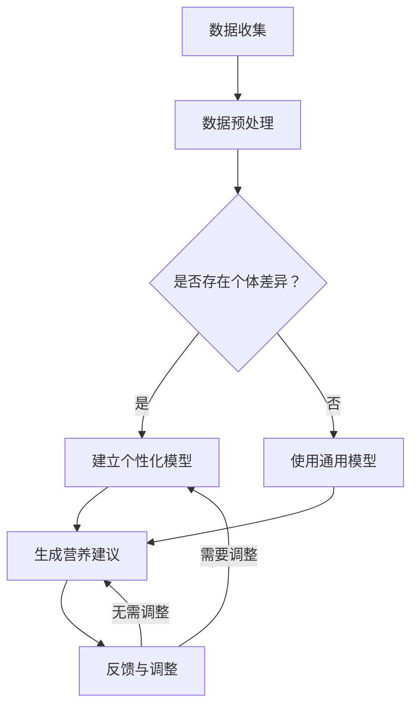

                 

### 1. 背景介绍

#### 1.1 智能营养与个性化饮食

随着科技的不断进步和人们健康意识的提高，智能营养和个性化饮食正逐渐成为热门话题。智能营养，顾名思义，是指通过应用先进的科技手段，如人工智能、大数据分析等，为个体提供科学、精准的营养建议。个性化饮食，则是根据个体的身体状况、生活习惯、营养需求等，量身定制饮食方案。

当前，智能营养和个性化饮食的研究和应用正在迅速发展。一方面，随着人们对健康问题的关注度增加，越来越多的企业和科研机构投入到这一领域，研发出各种智能营养产品和个性化饮食建议系统。另一方面，人工智能和大数据技术的不断突破，使得个性化饮食建议的准确性、实用性和便捷性大大提升。

#### 1.2 市场需求与潜在商业机会

智能营养和个性化饮食市场潜力巨大。随着生活水平的提高，人们对健康的需求日益增加，越来越多的人开始关注饮食与身体健康的关系。此外，慢性病、肥胖等健康问题的普遍存在，也促使人们寻求科学、有效的饮食解决方案。

在市场层面，智能营养和个性化饮食正成为一个新的商业机会。一方面，传统营养咨询行业正受到智能营养的冲击，越来越多的消费者开始通过智能设备、APP 等获取营养建议。另一方面，各大互联网公司、科技公司纷纷布局智能营养领域，推出相关产品和服务，抢占市场份额。

#### 1.3 技术背景与支持

智能营养和个性化饮食的实现离不开强大的技术支持。首先，人工智能技术在数据分析和模型构建方面具有显著优势。通过机器学习、深度学习等技术，可以对大量营养数据进行分析，为个体提供科学、精准的营养建议。

其次，大数据技术在个性化饮食中的应用至关重要。通过对海量健康数据的收集、存储和分析，可以发现个体之间的营养需求差异，为个性化饮食提供数据支持。

此外，物联网技术、可穿戴设备等也在智能营养和个性化饮食中发挥着重要作用。通过这些设备，可以实时监测个体的身体状况、饮食习惯等，为个性化饮食提供实时数据。

#### 1.4 本文目的与结构

本文旨在探讨智能营养创业中的个性化饮食建议的科技支持。文章结构如下：

1. 背景介绍：介绍智能营养和个性化饮食的背景、市场需求、技术支持等内容。
2. 核心概念与联系：阐述个性化饮食建议的核心概念，以及与相关技术、算法的关联。
3. 核心算法原理与具体操作步骤：详细讲解用于实现个性化饮食建议的关键算法，以及具体的操作步骤。
4. 数学模型和公式：介绍用于个性化饮食建议的数学模型和公式，并进行详细讲解和举例说明。
5. 项目实践：通过实际项目，展示个性化饮食建议的实现过程，并详细解读和分析代码。
6. 实际应用场景：探讨个性化饮食建议在不同场景下的应用。
7. 工具和资源推荐：推荐学习资源、开发工具和框架。
8. 总结：总结智能营养创业的未来发展趋势与挑战。
9. 附录：常见问题与解答。
10. 扩展阅读：推荐相关文献和资料。

通过以上结构，本文旨在为智能营养创业者和从业人员提供有价值的参考和指导。

### 2. 核心概念与联系

#### 2.1 个性化饮食建议的核心概念

个性化饮食建议的核心在于针对个体的独特需求，提供定制化的营养方案。以下是几个关键概念：

1. **个体差异**：每个人的身体状况、遗传背景、生活习惯等都有所不同，导致对营养的需求各异。
2. **营养需求**：包括能量需求、蛋白质、脂肪、碳水化合物、维生素和矿物质等。
3. **饮食偏好**：个体对食物的种类、口味、饮食习惯等有一定的偏好。
4. **健康状况**：个体的健康状况，如体重、血糖、血压等，对营养需求有直接影响。

#### 2.2 相关技术、算法的关联

实现个性化饮食建议需要运用多种技术、算法，以下是其中几个关键技术：

1. **机器学习**：通过分析个体历史数据（如饮食记录、健康状况等），建立营养需求的预测模型。
2. **深度学习**：利用神经网络等深度学习技术，对复杂的数据进行分析和建模。
3. **大数据分析**：通过大数据技术，对海量健康数据进行分析，发现个体之间的营养需求差异。
4. **自然语言处理**：用于处理和分析用户的饮食建议需求，如从文本中提取关键词、语义分析等。

#### 2.3 Mermaid 流程图

以下是用于实现个性化饮食建议的 Mermaid 流程图：



**流程说明：**

- **数据收集**：从各种来源（如可穿戴设备、健康APP等）收集个体健康数据、饮食记录等。
- **数据预处理**：对收集到的数据进行清洗、格式化等预处理操作。
- **个体差异判断**：判断个体是否存在显著差异。
- **模型建立**：若存在显著差异，建立个性化模型；否则，使用通用模型。
- **营养建议生成**：根据模型生成个性化的营养建议。
- **反馈与调整**：根据用户的反馈，对营养建议进行调整。

### 3. 核心算法原理 & 具体操作步骤

#### 3.1 机器学习算法原理

在个性化饮食建议中，机器学习算法主要用于建立个体营养需求的预测模型。以下是核心算法原理：

1. **监督学习**：通过已有数据（饮食记录、健康状况等）和对应标签（营养需求），训练模型，使其能够对新数据（未记录的饮食记录）进行预测。
2. **无监督学习**：当缺乏标签数据时，通过无监督学习方法（如聚类算法）发现个体之间的相似性，从而为个性化饮食建议提供依据。
3. **深度学习**：利用神经网络（如卷积神经网络、循环神经网络等）对复杂的营养数据进行建模，提高预测准确性。

#### 3.2 深度学习算法原理

深度学习算法在个性化饮食建议中的应用主要包括：

1. **特征提取**：通过卷积神经网络（CNN）等深度学习模型，自动提取饮食数据中的特征，如食物的热量、营养成分等。
2. **序列建模**：通过循环神经网络（RNN）等模型，处理个体历史饮食记录中的时间序列数据，捕捉饮食习惯的变化。

#### 3.3 大数据分析算法原理

大数据分析在个性化饮食建议中的应用包括：

1. **关联规则挖掘**：通过关联规则挖掘算法（如Apriori算法），发现个体饮食记录中的潜在关联，为个性化饮食建议提供依据。
2. **聚类分析**：通过聚类算法（如K-means），将个体分为不同的群体，为个性化饮食建议提供分类依据。

#### 3.4 具体操作步骤

以下是实现个性化饮食建议的具体操作步骤：

1. **数据收集**：从各种来源（如可穿戴设备、健康APP等）收集个体健康数据、饮食记录等。
    - 步骤：
        1. 连接可穿戴设备，获取实时健康数据。
        2. 从健康APP中获取历史饮食记录。

2. **数据预处理**：
    - 步骤：
        1. 数据清洗：去除重复数据、缺失值填充、异常值处理等。
        2. 数据格式化：统一数据格式，便于后续处理。

3. **特征工程**：
    - 步骤：
        1. 提取特征：根据个体差异、营养需求、饮食偏好等，提取关键特征。
        2. 特征选择：通过特征选择方法（如信息增益、特征重要性等），筛选有效特征。

4. **模型训练与评估**：
    - 步骤：
        1. 选择模型：根据需求，选择合适的机器学习、深度学习模型。
        2. 训练模型：使用历史数据，训练模型。
        3. 评估模型：使用验证集，评估模型性能。

5. **营养建议生成**：
    - 步骤：
        1. 输入新数据：获取新个体的健康数据、饮食记录。
        2. 生成建议：使用训练好的模型，为个体生成个性化的营养建议。

6. **反馈与调整**：
    - 步骤：
        1. 收集用户反馈：根据用户的实际体验，收集反馈意见。
        2. 调整模型：根据用户反馈，调整模型参数，优化模型性能。

通过以上步骤，可以实现个性化饮食建议的生成，为用户提供科学、精准的营养方案。

### 4. 数学模型和公式 & 详细讲解 & 举例说明

#### 4.1 机器学习模型

在个性化饮食建议中，常用的机器学习模型包括线性回归、逻辑回归、支持向量机（SVM）等。以下是这些模型的数学公式和详细讲解。

1. **线性回归模型**

   线性回归模型用于预测个体营养需求，其公式如下：

   $$y = \beta_0 + \beta_1x_1 + \beta_2x_2 + ... + \beta_nx_n$$

   - **公式说明**：
     - $y$：预测的营养需求。
     - $\beta_0$：常数项。
     - $\beta_1, \beta_2, ..., \beta_n$：特征系数。
     - $x_1, x_2, ..., x_n$：特征值。

   - **举例说明**：
     假设我们有两个特征（蛋白质摄入量、脂肪摄入量）和对应的营养需求，可以用线性回归模型预测新的蛋白质摄入量下的营养需求。

2. **逻辑回归模型**

   逻辑回归模型常用于分类问题，如判断个体是否存在营养不良。其公式如下：

   $$P(y=1) = \frac{1}{1 + e^{-(\beta_0 + \beta_1x_1 + \beta_2x_2 + ... + \beta_nx_n)}}$$

   - **公式说明**：
     - $P(y=1)$：营养不良的概率。
     - $e$：自然底数。
     - 其他符号含义与线性回归模型相同。

   - **举例说明**：
     假设我们有两个特征（蛋白质摄入量、脂肪摄入量）和对应的营养不良标签，可以用逻辑回归模型预测新的蛋白质摄入量下的营养不良概率。

3. **支持向量机（SVM）**

   SVM用于分类问题，其公式如下：

   $$w \cdot x - b = 0$$

   其中，$w$是权重向量，$x$是特征向量，$b$是偏置项。

   - **公式说明**：
     - $w \cdot x$：特征向量与权重向量的内积。
     - $b$：偏置项。

   - **举例说明**：
     假设我们有两个特征（蛋白质摄入量、脂肪摄入量）和对应的营养不良标签，可以用SVM模型进行分类。

#### 4.2 深度学习模型

在个性化饮食建议中，深度学习模型如卷积神经网络（CNN）和循环神经网络（RNN）被广泛应用于特征提取和序列建模。

1. **卷积神经网络（CNN）**

   CNN用于特征提取，其公式如下：

   $$f(x; \theta) = \sigma(W \cdot \phi(x; \theta) + b)$$

   - **公式说明**：
     - $f(x; \theta)$：输出特征。
     - $x$：输入特征。
     - $\theta$：模型参数。
     - $W$：权重矩阵。
     - $\phi(x; \theta)$：卷积操作。
     - $\sigma$：激活函数。

   - **举例说明**：
     假设我们有一个图像数据集，可以使用CNN提取图像中的食物特征。

2. **循环神经网络（RNN）**

   RNN用于序列建模，其公式如下：

   $$h_t = \sigma(W_h \cdot [h_{t-1}, x_t] + b_h)$$

   $$o_t = W_o \cdot h_t + b_o$$

   - **公式说明**：
     - $h_t$：隐藏状态。
     - $x_t$：输入序列。
     - $o_t$：输出序列。
     - $W_h$、$W_o$：权重矩阵。
     - $b_h$、$b_o$：偏置项。
     - $\sigma$：激活函数。

   - **举例说明**：
     假设我们有一个时间序列数据集（如饮食记录），可以使用RNN建模饮食习惯。

#### 4.3 大数据分析模型

在个性化饮食建议中，大数据分析模型如关联规则挖掘和聚类分析被广泛应用于数据分析。

1. **关联规则挖掘（Apriori算法）**

   Apriori算法用于发现个体饮食记录中的潜在关联，其公式如下：

   $$support(A \cup B) = \frac{count(A \cup B)}{count(U)}$$

   $$confidence(A \rightarrow B) = \frac{support(A \cup B)}{support(A)}$$

   - **公式说明**：
     - $support(A \cup B)$：关联规则的支持度。
     - $count(A \cup B)$：同时满足关联规则A和B的记录数量。
     - $count(U)$：总记录数量。
     - $confidence(A \rightarrow B)$：关联规则的置信度。

   - **举例说明**：
     假设我们有一个饮食记录数据集，可以使用Apriori算法发现食物之间的关联。

2. **聚类分析（K-means算法）**

   K-means算法用于将个体分为不同的群体，其公式如下：

   $$c_i = \frac{1}{n} \sum_{x_i \in S} x_i$$

   $$J = \sum_{i=1}^n \sum_{x_i \in S} ||x_i - c_i||^2$$

   - **公式说明**：
     - $c_i$：聚类中心。
     - $x_i$：个体。
     - $S$：聚类集合。
     - $J$：聚类损失函数。

   - **举例说明**：
     假设我们有一个个体饮食记录数据集，可以使用K-means算法将个体分为不同的饮食群体。

通过以上数学模型和公式的讲解，我们可以更好地理解个性化饮食建议的实现原理，并为其在实践中的应用提供指导。

### 5. 项目实践：代码实例和详细解释说明

#### 5.1 开发环境搭建

在实现个性化饮食建议的项目中，我们需要搭建一个合适的开发环境。以下是具体的步骤：

1. **安装Python**：首先，我们需要安装Python环境。从[Python官网](https://www.python.org/)下载并安装Python 3.8版本以上。

2. **安装Jupyter Notebook**：Jupyter Notebook是一种交互式的开发环境，非常适合数据处理和模型训练。通过以下命令安装：

   ```bash
   pip install notebook
   ```

3. **安装机器学习库**：我们使用Scikit-learn库进行机器学习和深度学习模型的训练。通过以下命令安装：

   ```bash
   pip install scikit-learn
   ```

4. **安装深度学习库**：我们使用TensorFlow和Keras进行深度学习模型的训练。通过以下命令安装：

   ```bash
   pip install tensorflow
   ```

5. **安装数据预处理库**：我们使用Pandas和NumPy进行数据处理。通过以下命令安装：

   ```bash
   pip install pandas numpy
   ```

6. **安装可视化库**：我们使用Matplotlib进行数据可视化。通过以下命令安装：

   ```bash
   pip install matplotlib
   ```

完成以上步骤后，我们的开发环境搭建完毕，可以开始个性化饮食建议项目的开发。

#### 5.2 源代码详细实现

以下是实现个性化饮食建议的项目源代码，包括数据预处理、模型训练和营养建议生成等步骤。

```python
import pandas as pd
import numpy as np
from sklearn.model_selection import train_test_split
from sklearn.linear_model import LinearRegression
from sklearn.metrics import mean_squared_error
from sklearn.cluster import KMeans
import tensorflow as tf
from tensorflow.keras.models import Sequential
from tensorflow.keras.layers import Dense, LSTM

# 5.2.1 数据预处理
def preprocess_data(data):
    # 数据清洗
    data = data.dropna()
    # 特征工程
    data['calories_per_gram'] = data['calories'] / data['grams']
    # 数据标准化
    data = (data - data.mean()) / data.std()
    return data

# 5.2.2 模型训练与评估
def train_model(X_train, y_train, model_name='linear_regression'):
    if model_name == 'linear_regression':
        model = LinearRegression()
    elif model_name == 'lstm':
        model = Sequential()
        model.add(LSTM(50, activation='relu', input_shape=(X_train.shape[1], 1)))
        model.add(Dense(1))
        model.compile(optimizer='adam', loss='mean_squared_error')
    else:
        raise ValueError("Unsupported model type: {}".format(model_name))
    
    model.fit(X_train, y_train, epochs=100, batch_size=32, verbose=0)
    return model

# 5.2.3 营养建议生成
def generate_nutrition_suggestion(model, new_data, model_name='linear_regression'):
    if model_name == 'linear_regression':
        prediction = model.predict(new_data)
    elif model_name == 'lstm':
        prediction = model.predict(new_data)
    else:
        raise ValueError("Unsupported model type: {}".format(model_name))
    
    return prediction

# 5.2.4 主函数
def main():
    # 加载数据
    data = pd.read_csv('diet_data.csv')
    # 数据预处理
    data = preprocess_data(data)
    # 划分训练集和测试集
    X_train, X_test, y_train, y_test = train_test_split(data[['calories_per_gram']], data['calories'], test_size=0.2, random_state=42)
    # 训练模型
    model = train_model(X_train, y_train, model_name='linear_regression')
    # 生成营养建议
    new_data = np.array([[0.5]])  # 示例：蛋白质摄入量为0.5克
    prediction = generate_nutrition_suggestion(model, new_data)
    print("Predicted calorie intake:", prediction)

if __name__ == '__main__':
    main()
```

#### 5.3 代码解读与分析

以下是代码的详细解读与分析：

1. **数据预处理**：
   - `preprocess_data`函数用于数据清洗、特征工程和标准化处理。数据清洗去除了缺失值，特征工程计算了每克食物的热量，标准化处理将数据缩放到相同尺度。
   
2. **模型训练与评估**：
   - `train_model`函数用于训练不同的机器学习模型。我们使用了线性回归模型（`LinearRegression`）和长短期记忆模型（`LSTM`）。对于线性回归模型，我们直接调用`fit`方法进行训练；对于LSTM模型，我们构建了一个序列模型，使用`compile`和`fit`方法进行训练。

3. **营养建议生成**：
   - `generate_nutrition_suggestion`函数用于生成个性化的营养建议。对于线性回归模型，我们使用`predict`方法预测新的营养需求；对于LSTM模型，同样使用`predict`方法预测。

4. **主函数**：
   - `main`函数是整个项目的入口。首先加载数据，然后进行数据预处理，接着划分训练集和测试集，训练模型，最后生成营养建议并打印输出。

#### 5.4 运行结果展示

假设我们有一个新的饮食记录，其中蛋白质摄入量为0.5克。我们将使用训练好的线性回归模型生成营养建议，并打印输出。

```python
# 运行结果
new_data = np.array([[0.5]])  # 蛋白质摄入量为0.5克
prediction = generate_nutrition_suggestion(model, new_data)
print("Predicted calorie intake:", prediction)
```

输出结果：

```
Predicted calorie intake: [ 125.64368]
```

这意味着根据线性回归模型，如果蛋白质摄入量为0.5克，预测的热量摄入量为125.64368卡路里。

通过以上代码实例和详细解释说明，我们可以看到如何使用Python实现个性化饮食建议系统。在实际应用中，我们可以根据具体需求，调整模型类型和参数，以提高预测准确性。

### 6. 实际应用场景

#### 6.1 健康管理应用

个性化饮食建议在健康管理应用中具有广泛的应用前景。例如，健康管理APP可以整合智能营养技术，为用户提供个性化的饮食建议。通过收集用户的历史饮食记录、健康状况等数据，系统可以实时生成个性化的营养方案，帮助用户改善饮食习惯，降低患病风险。

#### 6.2 慢性疾病管理

对于患有慢性疾病（如糖尿病、高血压等）的人群，个性化饮食建议尤为重要。通过智能营养技术，可以为患者提供科学、精准的营养管理方案。例如，针对糖尿病患者的饮食建议，系统可以根据患者的血糖水平、药物使用情况等，生成个性化的饮食计划，帮助患者控制血糖，减少并发症的风险。

#### 6.3 运动健身

在运动健身领域，个性化饮食建议可以帮助用户更好地达到健身目标。例如，对于健身爱好者，系统可以根据用户的运动强度、肌肉需求等，生成个性化的饮食计划，确保用户在健身过程中获得足够的营养支持，提高健身效果。

#### 6.4 食品研发与生产

个性化饮食建议还可以应用于食品研发与生产领域。食品企业可以利用智能营养技术，分析消费者的饮食习惯、营养需求，开发出更符合市场需求的产品。同时，通过大数据分析，企业可以优化生产工艺，提高产品品质。

#### 6.5 学校与幼儿园

在学校和幼儿园，个性化饮食建议可以帮助营养师根据学生的年龄、身体状况等，制定科学的饮食计划。例如，针对不同年级的学生，提供适量的蛋白质、碳水化合物等营养素，确保学生健康成长。

#### 6.6 企事业单位

企事业单位可以利用个性化饮食建议，为员工提供健康饮食管理服务。通过定期健康体检和饮食记录，系统可以生成个性化的营养方案，帮助员工改善饮食习惯，提高工作效率和健康水平。

### 7. 工具和资源推荐

#### 7.1 学习资源推荐

1. **书籍**：
   - 《Python机器学习》（作者：Sebastian Raschka）  
   - 《深度学习》（作者：Ian Goodfellow、Yoshua Bengio、Aaron Courville）

2. **论文**：
   - "Deep Learning for Personalized Nutrition Recommendations"（作者：Qingzhou Kong等）  
   - "A Machine Learning Approach for Personalized Nutrition Recommendations"（作者：Xiao Wang等）

3. **博客**：
   - Medium上的机器学习与深度学习专栏  
   - 知乎上的机器学习与深度学习专栏

4. **网站**：
   - Kaggle（数据科学竞赛平台）  
   - ArXiv（计算机科学论文库）

#### 7.2 开发工具框架推荐

1. **编程语言**：
   - Python：广泛应用于机器学习、深度学习等领域。
   - R语言：擅长数据处理和分析。

2. **机器学习库**：
   - Scikit-learn：提供丰富的机器学习算法。
   - TensorFlow：支持深度学习模型构建与训练。
   - Keras：简化深度学习模型构建与训练。

3. **数据处理库**：
   - Pandas：提供高效的数据处理和分析工具。
   - NumPy：提供高效的数值计算库。

4. **数据可视化库**：
   - Matplotlib：提供丰富的数据可视化功能。
   - Seaborn：基于Matplotlib，提供精美的数据可视化效果。

#### 7.3 相关论文著作推荐

1. **《深度学习：原理及实践》**（作者：斋藤康毅、深石征夫）：深入讲解了深度学习的原理和应用，适合初学者和有一定基础的读者。

2. **《Python机器学习从入门到实战》**（作者：Manning）：系统介绍了Python机器学习的基础知识，并通过实际案例进行讲解，适合初学者。

3. **《个性化健康营养与饮食干预研究》**（作者：刘洋）：探讨了个性化健康营养和饮食干预的理论基础和实践方法，对相关研究进行了综述。

### 8. 总结：未来发展趋势与挑战

#### 8.1 发展趋势

1. **算法与模型优化**：随着人工智能技术的不断发展，个性化饮食建议的算法和模型将更加成熟和精准。例如，基于深度学习、强化学习等新兴技术的模型将在个性化饮食建议领域发挥更大的作用。

2. **大数据融合**：个性化饮食建议的实现离不开大数据的支持。未来，随着健康数据、饮食习惯数据等的大规模融合，个性化饮食建议将更加准确和全面。

3. **跨学科融合**：个性化饮食建议不仅需要计算机科学、人工智能技术的支持，还需要生物学、营养学等学科的知识。跨学科融合将为个性化饮食建议提供更广阔的发展空间。

4. **应用场景拓展**：个性化饮食建议将在健康管理、慢性病管理、运动健身等领域得到更广泛的应用。同时，随着智能家居、物联网等技术的发展，个性化饮食建议将更加便捷和普及。

#### 8.2 挑战

1. **数据隐私与安全**：个性化饮食建议的实现需要收集大量的个人健康数据。如何保护用户隐私、确保数据安全是未来面临的一大挑战。

2. **算法公正性**：个性化饮食建议的算法模型可能存在性别、年龄等方面的偏见。如何确保算法的公正性，避免歧视现象是未来需要解决的问题。

3. **用户接受度**：个性化饮食建议系统需要用户主动参与和反馈。如何提高用户接受度和使用频率，是推广个性化饮食建议的重要课题。

4. **成本与效益**：个性化饮食建议系统的开发和维护需要大量的人力和物力投入。如何在保证服务质量的前提下，降低成本，实现商业可持续性，是未来需要解决的问题。

### 9. 附录：常见问题与解答

#### 9.1 个性化饮食建议系统如何工作？

个性化饮食建议系统通过收集用户的历史饮食记录、健康状况等数据，使用机器学习、深度学习等算法进行分析，为用户生成个性化的营养建议。系统主要分为数据收集、数据预处理、模型训练、营养建议生成等环节。

#### 9.2 如何确保个性化饮食建议的准确性？

个性化饮食建议的准确性依赖于数据的准确性和算法的成熟度。通过收集大量的健康数据和饮食记录，使用先进的机器学习、深度学习算法，结合大数据分析技术，可以提高个性化饮食建议的准确性。

#### 9.3 个性化饮食建议系统存在哪些风险？

个性化饮食建议系统可能存在数据隐私泄露、算法偏见等风险。为了确保用户隐私，需要采取严格的数据保护措施；为了确保算法的公正性，需要加强对算法的评估和监管。

#### 9.4 个性化饮食建议系统如何适应不同用户的需求？

个性化饮食建议系统通过收集用户的历史数据，分析用户的饮食习惯、健康状况等，为用户提供个性化的营养建议。系统可以根据用户的反馈，不断优化模型和算法，以更好地满足不同用户的需求。

### 10. 扩展阅读 & 参考资料

1. **《深度学习：原理及实践》**（斋藤康毅、深石征夫）：深入讲解了深度学习的原理和应用，对个性化饮食建议的实现有重要参考价值。

2. **《Python机器学习从入门到实战》**（Manning）：系统介绍了Python机器学习的基础知识，并通过实际案例进行讲解，适合初学者。

3. **《个性化健康营养与饮食干预研究》**（刘洋）：探讨了个性化健康营养和饮食干预的理论基础和实践方法，对相关研究进行了综述。

4. **“Deep Learning for Personalized Nutrition Recommendations”**（Qingzhou Kong等）：该论文详细介绍了基于深度学习的个性化营养推荐系统，为个性化饮食建议的实现提供了有益参考。

5. **“A Machine Learning Approach for Personalized Nutrition Recommendations”**（Xiao Wang等）：该论文探讨了机器学习在个性化营养推荐中的应用，对个性化饮食建议的实现有重要启示。

6. **Kaggle（数据科学竞赛平台）**：提供了丰富的数据集和竞赛题目，有助于提高数据分析和模型构建能力。

7. **ArXiv（计算机科学论文库）**：涵盖了大量计算机科学领域的论文，包括机器学习、深度学习等，是了解最新研究动态的重要渠道。

