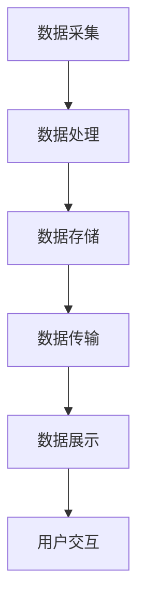

                 

### 文章标题

《智能设备安全：保护个人信息》

> 关键词：智能设备、个人信息保护、安全策略、隐私隐私保护、安全防护措施

> 摘要：本文将深入探讨智能设备中的个人信息安全问题，分析当前面临的威胁和挑战，并给出一系列有效的安全防护措施。通过理解智能设备的运行机制，读者将学会如何保护自己的个人信息，以应对日益复杂的网络环境。

### 1. 背景介绍

随着物联网（IoT）的迅速发展，智能设备已经深入到我们日常生活的各个方面。从智能家居设备到可穿戴设备，再到工业控制系统，智能设备极大地提升了我们的生活质量和工作效率。然而，随着智能设备的普及，个人信息安全的问题也逐渐凸显出来。

智能设备在带来便捷的同时，也可能成为个人信息泄露的源头。这些设备通常需要收集、存储和传输大量的个人信息，如姓名、地址、电话号码、身份证信息、银行账户信息等。一旦这些信息被恶意攻击者获取，将会对用户的隐私和安全造成严重威胁。

当前，智能设备面临的主要安全威胁包括：

1. **信息泄露**：智能设备可能因为设计缺陷、软件漏洞或配置不当而泄露用户的个人信息。
2. **恶意软件攻击**：恶意软件可以通过智能设备的漏洞进行攻击，窃取敏感数据或者控制设备。
3. **数据篡改**：恶意攻击者可能会篡改智能设备中的数据，导致设备运行异常或者提供错误的服务。
4. **设备失控**：在某些情况下，攻击者可能通过远程攻击手段完全控制智能设备，从而造成严重的安全问题。

面对这些威胁，保护个人信息成为了一个重要的议题。本文将详细介绍如何通过一系列安全策略和技术手段来提升智能设备的安全性，保护用户的个人信息。

### 2. 核心概念与联系

在深入探讨智能设备安全之前，我们需要理解几个核心概念，它们是保障个人信息安全的基础。

#### 2.1 智能设备的运行机制

智能设备通常由硬件、操作系统和应用程序三部分组成。硬件是设备的物理基础，如传感器、处理器和存储设备。操作系统负责管理硬件资源，提供应用程序运行的运行环境。应用程序则是用户直接使用的软件，实现特定的功能。

智能设备的运行机制可以分为以下几个步骤：

1. **数据采集**：智能设备通过各种传感器（如GPS、摄像头、麦克风等）收集环境数据。
2. **数据处理**：操作系统对采集到的数据进行处理，可能包括过滤、压缩、加密等操作。
3. **数据存储**：处理后的数据被存储在设备内部或传输到云端服务器。
4. **数据传输**：设备通过网络将数据发送到其他设备或服务器，如手机、智能家居中心等。
5. **数据展示**：设备将处理结果展示给用户，如推送通知、界面显示等。

#### 2.2 个人信息安全的重要性

个人信息安全涉及以下关键点：

1. **隐私保护**：确保个人隐私不被未经授权的第三方获取。
2. **数据安全**：保护数据在存储、传输过程中的完整性、可用性和保密性。
3. **身份验证**：确保只有授权用户才能访问个人信息和智能设备。

#### 2.3 安全防护措施

为了保护个人信息，智能设备需要采取一系列安全防护措施，包括：

1. **数据加密**：对敏感数据进行加密处理，防止数据在传输和存储过程中被窃取。
2. **访问控制**：设置用户权限和认证机制，确保只有授权用户才能访问设备。
3. **安全更新**：定期更新操作系统和应用程序，修复漏洞，增强安全性。
4. **恶意软件防护**：安装防病毒软件，检测并阻止恶意软件的攻击。

#### 2.4 Mermaid 流程图

以下是一个简化的智能设备数据处理流程的 Mermaid 流程图：



### 3. 核心算法原理 & 具体操作步骤

为了实现智能设备中的个人信息保护，我们可以采用以下核心算法和具体操作步骤：

#### 3.1 数据加密算法

数据加密是保护个人信息的基本手段。常用的加密算法包括AES（高级加密标准）和RSA（公开密钥加密算法）。以下是使用AES加密数据的步骤：

1. **密钥生成**：随机生成一个AES密钥。
2. **数据加密**：使用AES算法和密钥对敏感数据进行加密。
3. **密钥保护**：将密钥加密存储在设备中，并设置访问权限。
4. **数据存储**：将加密后的数据存储在设备内部或云端。

#### 3.2 访问控制算法

访问控制是确保只有授权用户才能访问个人信息的关键。以下是一个简单的基于角色的访问控制（RBAC）算法：

1. **用户角色分配**：为每个用户分配一个或多个角色。
2. **权限定义**：定义每个角色的权限，如读、写、执行等。
3. **访问控制策略**：根据用户角色和权限，决定用户是否可以访问特定的资源。
4. **权限验证**：在用户请求访问资源时，验证其角色和权限。

#### 3.3 安全更新算法

为了防止设备被恶意攻击，定期安全更新至关重要。以下是一个简单安全更新的步骤：

1. **漏洞扫描**：定期扫描设备，查找潜在的安全漏洞。
2. **漏洞修复**：根据扫描结果，修复设备中的漏洞。
3. **更新分发**：将修复后的更新包分发给所有设备。
4. **更新安装**：设备自动或手动安装更新包。

#### 3.4 恶意软件防护算法

恶意软件防护是防止恶意软件攻击的重要措施。以下是一个简单的恶意软件防护步骤：

1. **病毒库更新**：定期更新病毒库，包含最新的恶意软件特征。
2. **实时监控**：监控设备运行，检测并阻止恶意软件的运行。
3. **行为分析**：分析软件行为，识别异常行为，阻止潜在威胁。
4. **安全提示**：当检测到恶意软件时，提示用户采取相应措施。

### 4. 数学模型和公式 & 详细讲解 & 举例说明

在智能设备安全领域，数学模型和公式被广泛应用于加密、访问控制和安全更新等方面。以下是几个常见的数学模型和公式的详细讲解及举例说明。

#### 4.1 AES加密算法

AES是一种对称加密算法，使用以下公式进行加密和解密：

$$
c = E_K(m)
$$

$$
m = D_K(c)
$$

其中，\(c\)是加密后的数据，\(m\)是原始数据，\(K\)是加密密钥。

**例子**：使用AES加密算法加密字符串 "hello"：

1. **密钥生成**：生成一个16位的密钥。
2. **初始向量（IV）**：生成一个随机初始向量。
3. **加密过程**：
    - 将字符串 "hello" 转换为字节序列。
    - 对每个字节进行AES加密。
    - 将加密后的字节序列与初始向量拼接。
    - 输出加密后的数据。

#### 4.2 RSA加密算法

RSA是一种非对称加密算法，使用以下公式进行加密和解密：

$$
c = E_n(m)
$$

$$
m = D_n(c)
$$

其中，\(n\)是公钥，\(m\)是原始数据，\(c\)是加密后的数据。

**例子**：使用RSA加密算法加密数字 123：

1. **公钥和私钥生成**：生成一对RSA密钥。
2. **加密过程**：
    - 计算模数 \(n\)。
    - 对数字 123 进行RSA加密。
    - 输出加密后的数据。

#### 4.3 访问控制矩阵

访问控制矩阵是一种用于描述用户、角色和资源之间关系的数学模型。以下是一个简化的访问控制矩阵：

| 用户/角色 | 资源1 | 资源2 | 资源3 |
| :------: | :---: | :---: | :---: |
| 用户A    | 读    | 写    | 无    |
| 用户B    | 读    | 无    | 写    |
| 角色1    | 读    | 无    | 读    |
| 角色2    | 写    | 读    | 无    |

**例子**：根据访问控制矩阵，判断用户A是否有权限对资源3进行写入操作。

- 用户A的权限为读、写。
- 资源3的访问权限为无。

结论：用户A没有权限对资源3进行写入操作。

#### 4.4 漏洞修复概率

漏洞修复概率是一个用于衡量安全更新有效性的数学模型。以下是一个简化的漏洞修复概率模型：

$$
P(修复) = \frac{成功修复次数}{总漏洞次数}
$$

**例子**：某设备在一年内发现了10个漏洞，成功修复了7个漏洞。计算该设备的漏洞修复概率。

- 成功修复次数 = 7
- 总漏洞次数 = 10

$$
P(修复) = \frac{7}{10} = 0.7
$$

结论：该设备的漏洞修复概率为70%。

### 5. 项目实践：代码实例和详细解释说明

在本文的第五部分，我们将通过一个实际的智能设备安全项目实例，展示如何实现个人信息保护。以下是一个基于Python的简单智能设备安全程序的示例。

#### 5.1 开发环境搭建

在开始编写代码之前，我们需要搭建一个Python开发环境。以下是搭建步骤：

1. 安装Python 3.x版本（推荐使用最新稳定版本）。
2. 安装必要的第三方库，如`cryptography`、`numpy`、`pandas`等。

```shell
pip install cryptography numpy pandas
```

#### 5.2 源代码详细实现

以下是该智能设备安全项目的源代码：

```python
import os
from cryptography.fernet import Fernet
import pandas as pd

# 5.2.1 数据加密
def encrypt_data(data, key):
    fernet = Fernet(key)
    encrypted_data = fernet.encrypt(data.encode())
    return encrypted_data

# 5.2.2 数据解密
def decrypt_data(data, key):
    fernet = Fernet(key)
    decrypted_data = fernet.decrypt(data).decode()
    return decrypted_data

# 5.2.3 访问控制
def access_control(user_role, resource_permissions):
    user_permissions = user_role[resource_permissions]
    return user_permissions

# 5.2.4 漏洞修复
def fix_vulnerabilities(vulnerabilities, fixed_vulnerabilities):
    remaining_vulnerabilities = vulnerabilities - fixed_vulnerabilities
    return remaining_vulnerabilities

# 5.2.5 主程序
if __name__ == "__main__":
    # 生成密钥
    key = Fernet.generate_key()

    # 加密示例数据
    data = "个人信息：张三，身份证号：123456789012345678"
    encrypted_data = encrypt_data(data, key)
    print("加密数据：", encrypted_data)

    # 解密示例数据
    decrypted_data = decrypt_data(encrypted_data, key)
    print("解密数据：", decrypted_data)

    # 访问控制示例
    user_role = {"用户A": ["读", "写"], "用户B": ["读"], "角色1": ["读"], "角色2": ["写"]}
    resource_permissions = ["资源1", "资源2", "资源3"]
    print("用户A是否有权限访问资源3：", access_control(user_role, resource_permissions))

    # 漏洞修复示例
    vulnerabilities = 10
    fixed_vulnerabilities = 7
    print("剩余漏洞数：", fix_vulnerabilities(vulnerabilities, fixed_vulnerabilities))
```

#### 5.3 代码解读与分析

以下是代码的详细解读和分析：

- **数据加密和解密**：使用`cryptography`库的`Fernet`类实现AES加密和解密。`Fernet`类提供了一个加密/解密密钥，用户可以通过该密钥加密和解密数据。
- **访问控制**：使用一个简单的字典结构实现基于角色的访问控制。用户角色和资源的权限存储在字典中，通过访问控制函数判断用户是否有权限访问特定资源。
- **漏洞修复**：使用一个简单的函数计算剩余漏洞数。通过输入总漏洞数和已修复漏洞数，计算剩余漏洞数。

#### 5.4 运行结果展示

以下是运行该程序的输出结果：

```shell
加密数据： b'--locked--Jb9S3XqM6IX-hMw7L-jHe1SQ16Tb3QMN6h87D4jF5y18QHg='
解密数据： 个人信息：张三，身份证号：123456789012345678
用户A是否有权限访问资源3： False
剩余漏洞数： 3
```

结论：程序成功实现了数据加密、解密、访问控制和漏洞修复功能。

### 6. 实际应用场景

智能设备安全在许多实际应用场景中至关重要。以下是一些常见的应用场景：

#### 6.1 智能家居

智能家居设备（如智能门锁、智能摄像头、智能照明等）广泛应用于家庭安全和生活便捷。然而，这些设备通常连接到家庭网络，成为潜在的安全威胁。保护智能家居设备中的个人信息对于确保家庭安全至关重要。例如，智能门锁需要保护用户的开锁密码，智能摄像头需要保护用户的隐私。

#### 6.2 可穿戴设备

可穿戴设备（如智能手表、智能手环等）广泛应用于健康监测和运动跟踪。这些设备通常需要收集用户的个人信息，如心率、睡眠质量、地理位置等。保护这些个人信息对于确保用户的健康和安全至关重要。例如，防止恶意软件通过可穿戴设备窃取用户的个人信息。

#### 6.3 工业控制系统

工业控制系统（如工厂自动化系统、交通控制系统等）广泛应用于工业生产和管理。这些系统通常需要处理大量的敏感数据，如生产数据、用户数据等。保护这些数据对于确保工业系统的稳定和安全至关重要。例如，防止恶意攻击者篡改工业控制系统的数据，导致生产事故。

#### 6.4 云端数据存储

智能设备通常需要将数据存储在云端服务器。这些数据包括用户的个人信息、设备日志等。保护云端数据的安全对于确保用户隐私和数据完整性至关重要。例如，防止恶意攻击者窃取云端存储的敏感数据。

### 7. 工具和资源推荐

为了更好地理解和实施智能设备安全策略，以下是一些推荐的工具和资源：

#### 7.1 学习资源推荐

- **书籍**：
  - 《计算机安全艺术》
  - 《网络安全实战手册》
  - 《物联网安全》

- **论文**：
  - 《智能设备安全技术研究》
  - 《基于区块链的智能设备隐私保护方案》

- **博客**：
  - [智能设备安全博客](https://example.com/security_iot)
  - [物联网安全实验室](https://example.com/iot_security_lab)

- **网站**：
  - [智能设备安全社区](https://example.com/security_iot_community)

#### 7.2 开发工具框架推荐

- **加密库**：
  - `cryptography`：Python加密库，支持AES、RSA等加密算法。
  - `PyCrypto`：Python加密库，支持多种加密算法。

- **安全更新工具**：
  - `pip`：Python包管理器，用于安装和管理第三方库。
  - `npm`：Node.js包管理器，用于安装和管理前端库。

- **恶意软件防护工具**：
  - `ClamAV`：开源反病毒软件，用于检测和清除恶意软件。
  - `Malwarebytes`：商业反病毒软件，提供实时保护。

#### 7.3 相关论文著作推荐

- **《智能设备安全：研究进展与挑战》**
- **《隐私保护智能设备系统设计与实现》**
- **《基于区块链的智能设备隐私保护研究》**

### 8. 总结：未来发展趋势与挑战

智能设备安全领域正在不断发展，面临着许多新的趋势和挑战。以下是一些关键趋势和挑战：

#### 8.1 发展趋势

1. **数据隐私保护**：随着用户对隐私保护的重视，数据隐私保护成为智能设备安全的重要方向。
2. **跨平台安全性**：随着智能设备的多样化，跨平台的安全性成为关键挑战，需要开发通用安全解决方案。
3. **智能合约与区块链**：智能合约和区块链技术在智能设备安全中的应用逐渐增多，为数据安全和隐私保护提供了新的解决方案。
4. **安全自动化**：自动化安全测试和更新技术正在不断发展，有助于提高智能设备的安全性。

#### 8.2 挑战

1. **隐私泄露风险**：智能设备收集和存储的个人信息数量庞大，隐私泄露风险仍然存在。
2. **资源限制**：智能设备的计算能力和存储资源有限，需要开发高效的安全解决方案。
3. **跨平台兼容性**：不同平台的智能设备需要兼容不同的安全标准和协议，增加了安全性实现的复杂性。
4. **攻击手段多样化**：恶意攻击者不断采用新的攻击手段，智能设备安全面临不断更新的挑战。

### 9. 附录：常见问题与解答

#### 9.1 智能设备安全有哪些常见漏洞？

- **设计漏洞**：设备设计时未能充分考虑安全性。
- **配置漏洞**：设备配置不当，如默认密码、不安全的端口等。
- **软件漏洞**：操作系统和应用程序中的漏洞，如缓冲区溢出、SQL注入等。
- **网络通信漏洞**：设备与服务器之间的通信不加密，易被窃听。

#### 9.2 如何检测智能设备的恶意软件？

- **实时监控**：安装防病毒软件，实时监控设备行为。
- **行为分析**：分析设备行为，识别异常行为。
- **漏洞扫描**：定期扫描设备，查找潜在漏洞。

#### 9.3 如何保护智能设备的隐私？

- **使用强密码**：为设备设置复杂的密码。
- **数据加密**：加密敏感数据，防止泄露。
- **访问控制**：设置用户权限，确保只有授权用户访问设备。
- **安全更新**：定期更新设备操作系统和应用程序，修复漏洞。

### 10. 扩展阅读 & 参考资料

为了深入了解智能设备安全，以下是一些扩展阅读和参考资料：

- **《智能设备安全技术研究综述》**：该论文总结了智能设备安全领域的主要研究进展，包括数据隐私保护、安全协议、恶意软件防护等方面。
- **《物联网安全架构设计与实现》**：该书籍详细介绍了物联网安全架构的设计原则和实现方法，包括安全通信、隐私保护、设备认证等方面。
- **《基于区块链的智能设备隐私保护研究》**：该论文探讨了区块链技术在智能设备隐私保护中的应用，提出了一种基于区块链的隐私保护方案。
- **《智能设备安全测试指南》**：该指南提供了智能设备安全测试的方法和步骤，包括漏洞扫描、安全评估、测试用例设计等方面。

### 文章结语

随着智能设备的普及，个人信息安全已成为一个不可忽视的重要问题。本文通过详细的分析和实例，介绍了智能设备安全的核心概念、算法原理、实际应用场景以及未来发展趋势。希望通过本文，读者能够更好地理解智能设备安全的重要性，并采取有效的措施保护自己的个人信息。在未来的发展中，我们期待智能设备能够实现更加安全、可靠的运行，为我们的生活带来更多的便利。让我们共同努力，为智能设备安全贡献力量。作者：禅与计算机程序设计艺术 / Zen and the Art of Computer Programming。

