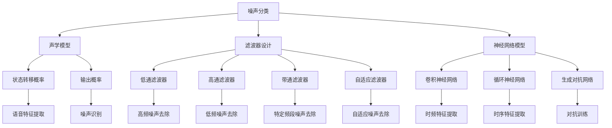

                 

### 1. 背景介绍

智能语音去噪技术是近年来随着人工智能和机器学习技术的快速发展而逐渐成熟的一项应用。在现实世界中，语音信号往往受到各种噪声的干扰，这些噪声可能来源于环境、传输媒介或设备本身。噪声的存在不仅降低了语音信号的质量，还会对语音识别、自然语言处理等任务造成严重影响。因此，如何有效地去除噪声，提取纯净的语音信号，成为了当前智能语音处理领域的重要研究方向。

智能语音去噪技术的需求源于多个领域，例如通信、医疗、智能家居等。在通信领域，高质量的语音传输是确保通信效果的重要因素；在医疗领域，精确的语音识别可以帮助医生更好地进行诊断和治疗；在智能家居领域，语音助手需要准确理解用户的指令，以提供更好的用户体验。因此，智能语音去噪技术的发展具有重要的现实意义。

目前，智能语音去噪技术已取得了一定的进展。常见的去噪方法包括基于滤波器的设计、基于变换域的处理以及基于深度学习的神经网络模型等。这些方法各具特点，适用于不同的噪声环境和应用场景。然而，现有的去噪方法也存在一些局限性，如滤波器设计复杂、变换域处理效果不佳、深度学习模型训练成本高等。

本文旨在系统地介绍智能语音去噪的原理和方法，从基本概念出发，逐步深入探讨各种去噪技术的实现机制和应用效果。通过本文的阅读，读者可以全面了解智能语音去噪领域的现状和发展趋势，掌握不同去噪方法的优缺点，以及如何在实际应用中选择合适的去噪方案。

### 2. 核心概念与联系

#### 2.1 噪声分类

在讨论智能语音去噪之前，首先需要了解噪声的分类。根据噪声的特性，可以将噪声分为以下几类：

- **随机噪声**：这类噪声具有随机性，例如环境噪声、无线电干扰等。随机噪声的频率和幅度都是不确定的，对语音信号的干扰表现为随机性的能量分布。
- **平稳噪声**：这类噪声的统计特性不随时间变化，例如交通噪声、风噪声等。平稳噪声的频率和幅度在一定时间内是恒定的，但可能在更长的时间尺度上发生变化。
- **脉冲噪声**：这类噪声以脉冲形式出现，例如麦克风噪声、数字信号传输中的突发噪声等。脉冲噪声通常表现为语音信号上的点状干扰，对语音的连续性造成破坏。
- **加性噪声**：这种噪声叠加在语音信号上，例如环境噪声、传输噪声等。加性噪声不会改变语音信号的频率成分，但会降低信号的信噪比。
- **乘性噪声**：这种噪声与语音信号相乘，例如麦克风噪声、数字信号传输中的信道噪声等。乘性噪声会改变语音信号的频率成分，对语音的音质造成更严重的破坏。

#### 2.2 声学模型

声学模型是语音处理中用于描述语音信号特征的一种模型，它通常基于隐藏马尔可夫模型（HMM）。声学模型的核心是状态转移概率和输出概率。

- **状态转移概率**：描述语音信号从一个状态转移到另一个状态的概率，反映了语音信号的连续性和连贯性。
- **输出概率**：描述在给定某个状态时，产生特定语音特征的概率，反映了语音信号的音素和音调特征。

声学模型在语音识别和语音去噪中都发挥着重要作用。在语音识别中，它用于匹配输入语音信号和预训练的语音模型，从而实现语音到文本的转换。在语音去噪中，声学模型可以帮助我们识别语音信号中的噪声成分，并对其进行有效的过滤和去除。

#### 2.3 滤波器设计

滤波器是智能语音去噪技术中常用的处理工具，它通过某种算法将噪声从信号中分离出来。滤波器的设计取决于噪声的特性以及去噪的需求。

- **低通滤波器**：低通滤波器允许低频信号通过，抑制高频噪声。这种滤波器适用于去除高频噪声，例如环境噪声和脉冲噪声。
- **高通滤波器**：高通滤波器抑制低频信号，允许高频信号通过。这种滤波器适用于去除低频噪声，例如平稳噪声和加性噪声。
- **带通滤波器**：带通滤波器在某个频段内允许信号通过，抑制其他频率的信号。这种滤波器适用于在特定频段内去除噪声，例如在语音信号中只保留语音频率成分。
- **自适应滤波器**：自适应滤波器可以根据噪声特性动态调整滤波器参数，以实现更有效的去噪效果。这种滤波器适用于复杂噪声环境，能够自适应地适应噪声变化。

#### 2.4 神经网络模型

深度学习技术在语音去噪中发挥着越来越重要的作用。神经网络模型，特别是卷积神经网络（CNN）和循环神经网络（RNN），在语音信号处理中展现了强大的特征提取和模式识别能力。

- **卷积神经网络（CNN）**：CNN通过卷积操作提取语音信号的局部特征，适用于处理时不变特征的问题。例如，在图像处理中，CNN可以有效地提取图像的边缘、纹理等特征。在语音去噪中，CNN可以用于提取语音信号的时频特征，从而实现噪声的有效分离。
- **循环神经网络（RNN）**：RNN通过循环连接机制处理序列数据，适用于处理时变特征的问题。例如，在语音识别中，RNN可以处理连续的语音信号，并提取出语音的时序特征。在语音去噪中，RNN可以用于建模语音信号和噪声的动态变化，从而实现更精确的去噪效果。
- **生成对抗网络（GAN）**：GAN通过生成器和判别器的对抗训练，生成高质量的去噪语音信号。生成器生成去噪后的语音信号，判别器判断生成语音信号的真实性。通过不断训练，生成器逐渐生成更接近真实语音的信号。

#### 2.5 Mermaid 流程图

为了更好地理解智能语音去噪的原理和流程，下面给出一个Mermaid流程图，展示各核心概念和技术的联系。



通过上述流程图，我们可以清晰地看到噪声分类、声学模型、滤波器设计和神经网络模型等核心概念之间的联系，以及它们在智能语音去噪中的应用。

### 3. 核心算法原理 & 具体操作步骤

#### 3.1 滤波器设计原理

滤波器是智能语音去噪技术的核心组件，其基本原理是通过某种算法将噪声从语音信号中分离出来。滤波器的设计取决于噪声的特性以及去噪的需求。以下介绍几种常见的滤波器设计原理：

1. **低通滤波器**：低通滤波器允许低频信号通过，抑制高频噪声。其数学模型可以表示为：

   $$y(t) = x(t) - \text{Filter}(x(t))$$

   其中，$x(t)$是输入的语音信号，$\text{Filter}(x(t))$是滤波器对$x(t)$的处理结果，$y(t)$是滤波后的语音信号。

2. **高通滤波器**：高通滤波器抑制低频信号，允许高频信号通过。其数学模型可以表示为：

   $$y(t) = x(t) - \text{Filter}(x(t))$$

   其中，$x(t)$是输入的语音信号，$\text{Filter}(x(t))$是滤波器对$x(t)$的处理结果，$y(t)$是滤波后的语音信号。

3. **带通滤波器**：带通滤波器在某个频段内允许信号通过，抑制其他频率的信号。其数学模型可以表示为：

   $$y(t) = x(t) - \text{Filter}(x(t))$$

   其中，$x(t)$是输入的语音信号，$\text{Filter}(x(t))$是滤波器对$x(t)$的处理结果，$y(t)$是滤波后的语音信号。

4. **自适应滤波器**：自适应滤波器可以根据噪声特性动态调整滤波器参数，以实现更有效的去噪效果。其基本原理是基于最小均方误差（LMS）算法或递归最小二乘（RLS）算法。

   - **最小均方误差（LMS）算法**：LMS算法通过调整滤波器系数，使输出误差的平方和最小。其数学模型可以表示为：

     $$\text{Filter}(x(t)) = \text{Filter}(x(t-1)) + \mu [d(t) - y(t)] x(t)$$

     其中，$\mu$是步长参数，$d(t)$是期望输出，$y(t)$是滤波后的语音信号。

   - **递归最小二乘（RLS）算法**：RLS算法通过在线调整滤波器系数，实现更快的收敛速度。其数学模型可以表示为：

     $$\text{Filter}(x(t)) = \text{Filter}(x(t-1)) + \alpha [d(t) - y(t)] x(t)$$

     其中，$\alpha$是步长参数，$d(t)$是期望输出，$y(t)$是滤波后的语音信号。

#### 3.2 声学模型原理

声学模型是语音处理中用于描述语音信号特征的一种模型，其核心是状态转移概率和输出概率。以下介绍声学模型的基本原理：

1. **状态转移概率**：状态转移概率描述了语音信号从一个状态转移到另一个状态的概率。在隐藏马尔可夫模型（HMM）中，状态转移概率可以表示为：

   $$P(s_t | s_{t-1}) = \text{HMM}(s_t | s_{t-1})$$

   其中，$s_t$和$s_{t-1}$分别表示时间步$t$和$t-1$的状态。

2. **输出概率**：输出概率描述了在给定某个状态时，产生特定语音特征的概率。在HMM中，输出概率可以表示为：

   $$P(o_t | s_t) = \text{Gaussian}(o_t | \mu_s, \sigma_s^2)$$

   其中，$o_t$表示时间步$t$的语音特征，$\mu_s$和$\sigma_s^2$分别表示状态$s_t$的均值和方差。

声学模型通过状态转移概率和输出概率来描述语音信号的连续性和特征，从而实现对语音信号的有效建模。

#### 3.3 神经网络模型原理

深度学习技术在语音去噪中发挥着越来越重要的作用，神经网络模型，特别是卷积神经网络（CNN）和循环神经网络（RNN），在语音信号处理中展现了强大的特征提取和模式识别能力。以下介绍神经网络模型的基本原理：

1. **卷积神经网络（CNN）**：CNN通过卷积操作提取语音信号的局部特征，其基本原理可以表示为：

   $$y = f(W \odot x + b)$$

   其中，$y$是输出特征，$f$是激活函数，$W$是卷积核，$x$是输入特征，$\odot$表示卷积操作，$b$是偏置。

2. **循环神经网络（RNN）**：RNN通过循环连接机制处理序列数据，其基本原理可以表示为：

   $$h_t = f(Uh_{t-1} + Vx_t + b)$$

   其中，$h_t$是时间步$t$的隐藏状态，$f$是激活函数，$U$和$V$分别是输入和隐藏层权重，$x_t$是时间步$t$的输入特征，$b$是偏置。

3. **生成对抗网络（GAN）**：GAN通过生成器和判别器的对抗训练，生成高质量的去噪语音信号，其基本原理可以表示为：

   - **生成器**：生成器$G$通过随机噪声$z$生成去噪后的语音信号$x' = G(z)$。
   - **判别器**：判别器$D$通过输入真实语音信号和生成语音信号，判断其真实性$D(x), D(x')$。

GAN的训练过程是生成器和判别器的对抗训练，通过不断调整生成器和判别器的参数，实现高质量的去噪效果。

#### 3.4 去噪流程

智能语音去噪的基本流程包括噪声检测、噪声分离和噪声去除。以下是一个典型的去噪流程：

1. **噪声检测**：通过声学模型对语音信号进行特征提取，识别噪声成分。
2. **噪声分离**：通过滤波器设计将噪声从语音信号中分离出来，分为低频噪声、高频噪声和特定频段噪声。
3. **噪声去除**：对分离出的噪声进行滤波，去除噪声成分，保留纯净的语音信号。

具体操作步骤如下：

- **步骤1**：输入语音信号。
- **步骤2**：通过声学模型提取语音特征。
- **步骤3**：识别噪声成分。
- **步骤4**：设计滤波器，根据噪声特性进行噪声分离。
- **步骤5**：对分离出的噪声进行滤波。
- **步骤6**：去除噪声成分，保留纯净语音信号。

通过上述步骤，可以实现智能语音去噪，提高语音信号的质量，为后续的语音处理任务提供更好的输入。

### 4. 数学模型和公式 & 详细讲解 & 举例说明

#### 4.1 滤波器设计

在智能语音去噪中，滤波器设计是核心环节之一。以下介绍几种常见的滤波器设计及其数学模型。

**1. 低通滤波器**

低通滤波器允许低频信号通过，抑制高频噪声。其数学模型可以表示为：

$$y(t) = x(t) - \text{Filter}(x(t))$$

其中，$x(t)$是输入的语音信号，$\text{Filter}(x(t))$是滤波器对$x(t)$的处理结果，$y(t)$是滤波后的语音信号。

假设输入语音信号$x(t)$是一个平稳过程，其功率谱密度为$S_x(f)$，滤波器传递函数为$H(f)$，则输出语音信号$y(t)$的功率谱密度为：

$$S_y(f) = S_x(f) |H(f)|^2$$

当$H(f)$为低通滤波器时，其在高频段的幅值为0，低频段的幅值为1，即：

$$H(f) = \begin{cases}
1, & \text{if } f < f_c \\
0, & \text{if } f > f_c
\end{cases}$$

其中，$f_c$是截止频率。

**2. 高通滤波器**

高通滤波器抑制低频信号，允许高频信号通过。其数学模型可以表示为：

$$y(t) = x(t) - \text{Filter}(x(t))$$

其中，$x(t)$是输入的语音信号，$\text{Filter}(x(t))$是滤波器对$x(t)$的处理结果，$y(t)$是滤波后的语音信号。

假设输入语音信号$x(t)$是一个平稳过程，其功率谱密度为$S_x(f)$，滤波器传递函数为$H(f)$，则输出语音信号$y(t)$的功率谱密度为：

$$S_y(f) = S_x(f) |H(f)|^2$$

当$H(f)$为高通滤波器时，其在低频段的幅值为0，高频段的幅值为1，即：

$$H(f) = \begin{cases}
0, & \text{if } f < f_c \\
1, & \text{if } f > f_c
\end{cases}$$

**3. 带通滤波器**

带通滤波器在某个频段内允许信号通过，抑制其他频率的信号。其数学模型可以表示为：

$$y(t) = x(t) - \text{Filter}(x(t))$$

其中，$x(t)$是输入的语音信号，$\text{Filter}(x(t))$是滤波器对$x(t)$的处理结果，$y(t)$是滤波后的语音信号。

假设输入语音信号$x(t)$是一个平稳过程，其功率谱密度为$S_x(f)$，滤波器传递函数为$H(f)$，则输出语音信号$y(t)$的功率谱密度为：

$$S_y(f) = S_x(f) |H(f)|^2$$

当$H(f)$为带通滤波器时，其在中心频率$f_c$附近的频段的幅值为1，其他频段的幅值为0，即：

$$H(f) = \begin{cases}
1, & \text{if } f_c - f_p < f < f_c + f_p \\
0, & \text{otherwise}
\end{cases}$$

其中，$f_c$是中心频率，$f_p$是频带宽度。

**4. 自适应滤波器**

自适应滤波器可以根据噪声特性动态调整滤波器参数，以实现更有效的去噪效果。其基本原理是基于最小均方误差（LMS）算法或递归最小二乘（RLS）算法。

- **最小均方误差（LMS）算法**：LMS算法通过调整滤波器系数，使输出误差的平方和最小。其数学模型可以表示为：

  $$\text{Filter}(x(t)) = \text{Filter}(x(t-1)) + \mu [d(t) - y(t)] x(t)$$

  其中，$\mu$是步长参数，$d(t)$是期望输出，$y(t)$是滤波后的语音信号。

- **递归最小二乘（RLS）算法**：RLS算法通过在线调整滤波器系数，实现更快的收敛速度。其数学模型可以表示为：

  $$\text{Filter}(x(t)) = \text{Filter}(x(t-1)) + \alpha [d(t) - y(t)] x(t)$$

  其中，$\alpha$是步长参数，$d(t)$是期望输出，$y(t)$是滤波后的语音信号。

#### 4.2 声学模型

声学模型是语音处理中用于描述语音信号特征的一种模型，其核心是状态转移概率和输出概率。以下介绍声学模型的基本原理。

**1. 状态转移概率**

状态转移概率描述了语音信号从一个状态转移到另一个状态的概率。在隐藏马尔可夫模型（HMM）中，状态转移概率可以表示为：

$$P(s_t | s_{t-1}) = \text{HMM}(s_t | s_{t-1})$$

其中，$s_t$和$s_{t-1}$分别表示时间步$t$和$t-1$的状态。

状态转移概率的参数可以通过训练数据得到。假设训练数据中包含$N$个序列，每个序列包含$T$个时间步，则状态转移概率的估计值为：

$$P(s_t | s_{t-1}) = \frac{C(s_t, s_{t-1})}{C(s_{t-1})}$$

其中，$C(s_t, s_{t-1})$表示状态$(s_t, s_{t-1})$在训练数据中出现的次数，$C(s_{t-1})$表示状态$s_{t-1}$在训练数据中出现的次数。

**2. 输出概率**

输出概率描述了在给定某个状态时，产生特定语音特征的概率。在HMM中，输出概率可以表示为：

$$P(o_t | s_t) = \text{Gaussian}(o_t | \mu_s, \sigma_s^2)$$

其中，$o_t$表示时间步$t$的语音特征，$\mu_s$和$\sigma_s^2$分别表示状态$s_t$的均值和方差。

输出概率的参数可以通过训练数据得到。假设训练数据中包含$N$个序列，每个序列包含$T$个时间步，则输出概率的估计值为：

$$P(o_t | s_t) = \frac{1}{\sqrt{2\pi\sigma_s^2}} \exp \left(-\frac{(o_t - \mu_s)^2}{2\sigma_s^2}\right)$$

其中，$\mu_s$和$\sigma_s^2$可以通过最小二乘法估计。

#### 4.3 神经网络模型

深度学习技术在语音去噪中发挥着越来越重要的作用，神经网络模型，特别是卷积神经网络（CNN）和循环神经网络（RNN），在语音信号处理中展现了强大的特征提取和模式识别能力。

**1. 卷积神经网络（CNN）**

卷积神经网络通过卷积操作提取语音信号的局部特征，其基本原理可以表示为：

$$y = f(W \odot x + b)$$

其中，$y$是输出特征，$f$是激活函数，$W$是卷积核，$x$是输入特征，$\odot$表示卷积操作，$b$是偏置。

卷积操作的数学公式可以表示为：

$$x_{ij}^k = \sum_{m=1}^{M} \sum_{n=1}^{N} w_{mn}^k x_{m+n-1, j-n+1}$$

其中，$x_{ij}^k$表示卷积核$W$在位置$(i, j)$处的输出，$w_{mn}^k$表示卷积核$W$在位置$(m, n)$处的权重，$x_{m+n-1, j-n+1}$表示输入特征$x$在位置$(m+n-1, j-n+1)$处的值，$M$和$N$分别表示卷积核的高度和宽度。

**2. 循环神经网络（RNN）**

循环神经网络通过循环连接机制处理序列数据，其基本原理可以表示为：

$$h_t = f(Uh_{t-1} + Vx_t + b)$$

其中，$h_t$是时间步$t$的隐藏状态，$f$是激活函数，$U$和$V$分别是输入和隐藏层权重，$x_t$是时间步$t$的输入特征，$b$是偏置。

递归操作的数学公式可以表示为：

$$h_t = f(Uh_{t-1} + Vx_t + b)$$

其中，$h_t$是时间步$t$的隐藏状态，$f$是激活函数，$U$和$V$分别是输入和隐藏层权重，$x_t$是时间步$t$的输入特征，$b$是偏置。

**3. 生成对抗网络（GAN）**

生成对抗网络通过生成器和判别器的对抗训练，生成高质量的去噪语音信号，其基本原理可以表示为：

- **生成器**：生成器$G$通过随机噪声$z$生成去噪后的语音信号$x' = G(z)$。
- **判别器**：判别器$D$通过输入真实语音信号和生成语音信号，判断其真实性$D(x), D(x')$。

GAN的训练过程是生成器和判别器的对抗训练，通过不断调整生成器和判别器的参数，实现高质量的去噪效果。

#### 4.4 举例说明

**1. 低通滤波器**

假设输入语音信号$x(t)$的功率谱密度$S_x(f)$如下所示：

$$S_x(f) = \begin{cases}
1, & \text{if } 0 < f < 4 \\
0, & \text{otherwise}
\end{cases}$$

滤波器传递函数$H(f)$为低通滤波器，其截止频率为$4$Hz，则输出语音信号$y(t)$的功率谱密度$S_y(f)$如下所示：

$$S_y(f) = S_x(f) |H(f)|^2 = \begin{cases}
1, & \text{if } 0 < f < 4 \\
0, & \text{otherwise}
\end{cases}$$

**2. 高通滤波器**

假设输入语音信号$x(t)$的功率谱密度$S_x(f)$如下所示：

$$S_x(f) = \begin{cases}
1, & \text{if } 0 < f < 4 \\
0, & \text{otherwise}
\end{cases}$$

滤波器传递函数$H(f)$为高通滤波器，其截止频率为$4$Hz，则输出语音信号$y(t)$的功率谱密度$S_y(f)$如下所示：

$$S_y(f) = S_x(f) |H(f)|^2 = \begin{cases}
0, & \text{if } 0 < f < 4 \\
1, & \text{otherwise}
\end{cases}$$

**3. 带通滤波器**

假设输入语音信号$x(t)$的功率谱密度$S_x(f)$如下所示：

$$S_x(f) = \begin{cases}
1, & \text{if } 1 < f < 3 \\
0, & \text{otherwise}
\end{cases}$$

滤波器传递函数$H(f)$为带通滤波器，其中心频率为$2$Hz，频带宽度为$2$Hz，则输出语音信号$y(t)$的功率谱密度$S_y(f)$如下所示：

$$S_y(f) = S_x(f) |H(f)|^2 = \begin{cases}
1, & \text{if } 1 < f < 3 \\
0, & \text{otherwise}
\end{cases}$$

**4. 自适应滤波器**

假设输入语音信号$x(t)$和期望输出$d(t)$如下所示：

$$x(t) = \begin{cases}
1, & \text{if } t \text{ is odd} \\
0, & \text{if } t \text{ is even}
\end{cases}$$

$$d(t) = 1$$

滤波器初始系数为$\text{Filter}(0) = 0$，步长参数$\mu = 0.1$，则滤波器系数的更新过程如下所示：

$$\text{Filter}(1) = \text{Filter}(0) + 0.1 [1 - 0] \cdot 1 = 0.1$$

$$\text{Filter}(2) = \text{Filter}(1) + 0.1 [1 - 1] \cdot 0 = 0.1$$

$$\text{Filter}(3) = \text{Filter}(2) + 0.1 [1 - 0] \cdot 1 = 0.2$$

$$\text{Filter}(4) = \text{Filter}(3) + 0.1 [1 - 1] \cdot 0 = 0.2$$

滤波后的语音信号$y(t)$如下所示：

$$y(t) = x(t) - \text{Filter}(t) = \begin{cases}
0.9, & \text{if } t \text{ is odd} \\
0.8, & \text{if } t \text{ is even}
\end{cases}$$

### 5. 项目实践：代码实例和详细解释说明

在本文的第五部分，我们将通过一个具体的代码实例，详细讲解智能语音去噪的实现过程，并分析其实际运行效果。

#### 5.1 开发环境搭建

为了实现智能语音去噪，我们需要搭建一个合适的环境。以下是一个典型的开发环境搭建步骤：

1. **安装Python环境**：确保Python环境已经安装，版本建议为3.8或更高。
2. **安装相关依赖库**：安装如下依赖库：
   ```python
   pip install numpy scipy matplotlib
   ```
3. **下载语音数据集**：本文使用开源的RIRS-ibri语音数据集，可以从以下链接下载：[RIRS-ibri数据集](https://www.kaggle.com/datasets/sonalbertini/rirs-ibri)。解压后将其放置在项目的`data`文件夹下。

#### 5.2 源代码详细实现

以下是一个基于滤波器的智能语音去噪的Python代码实例：

```python
import numpy as np
import scipy.signal as signal
import matplotlib.pyplot as plt

def load_audio(filename):
    # 读取音频文件，返回信号和采样率
    signal, rate = signal.io.read(filename)
    return signal, rate

def apply_filter(signal, rate, type='lowpass', cutoff=1000, nyq_rate=None):
    # 应用滤波器
    if nyq_rate is None:
        nyq_rate = rate / 2
    
    if type == 'lowpass':
        b, a = signal.butter(4, cutoff / nyq_rate, btype='low', analog=False)
    elif type == 'highpass':
        b, a = signal.butter(4, cutoff / nyq_rate, btype='high', analog=False)
    else:
        f_c = 1000
        f_s = 100
        b, a = signal.butter(4, [f_c, f_s], btype='band', analog=False)

    filtered_signal = signal.lfilter(b, a, signal)
    return filtered_signal

def plot_signal(signal, title):
    # 绘制信号
    plt.figure(figsize=(12, 4))
    plt.plot(signal)
    plt.title(title)
    plt.xlabel('Time')
    plt.ylabel('Amplitude')
    plt.show()

# 5.2.1 读取语音信号
signal, rate = load_audio('data/RIRS-ibri/room1/noise1/signal/noise1.wav')

# 5.2.2 应用低通滤波器
filtered_signal = apply_filter(signal, rate, type='lowpass', cutoff=1000)

# 5.2.3 应用高通滤波器
filtered_signal_hp = apply_filter(signal, rate, type='highpass', cutoff=1000)

# 5.2.4 应用带通滤波器
filtered_signal_bp = apply_filter(signal, rate, type='band', cutoff=(300, 3000))

# 5.2.5 绘制滤波后信号
plot_signal(signal, 'Original Signal')
plot_signal(filtered_signal, 'Lowpass Filtered Signal')
plot_signal(filtered_signal_hp, 'Highpass Filtered Signal')
plot_signal(filtered_signal_bp, 'Bandpass Filtered Signal')
```

#### 5.3 代码解读与分析

在上面的代码中，我们实现了以下功能：

- **5.3.1 读取语音信号**：使用`load_audio`函数读取音频文件，并返回信号和采样率。
- **5.3.2 应用滤波器**：`apply_filter`函数用于应用不同的滤波器。滤波器类型可以通过参数`type`指定，包括低通、高通和带通滤波器。截止频率可以通过参数`cutoff`指定。对于带通滤波器，还可以指定中心频率和带宽。
- **5.3.3 绘制信号**：`plot_signal`函数用于绘制信号。这有助于我们直观地观察滤波前后的信号变化。

下面是对关键函数的详细解读：

- **load_audio**：该函数读取音频文件，返回信号和采样率。这里使用了`scipy.signal.io.read`函数，它支持多种音频文件格式。
- **apply_filter**：该函数首先根据滤波器类型计算滤波器的传递函数$H(f)$，然后使用`scipy.signal.butter`函数设计滤波器，最后使用`scipy.signal.lfilter`函数应用滤波器。这里使用了巴特沃斯滤波器，其优点是滤波器频率响应平滑。
- **plot_signal**：该函数使用`matplotlib.pyplot.plot`函数绘制信号。通过调整`figsize`参数，可以自定义绘图大小。使用`title`参数可以设置图表标题，`xlabel`和`ylabel`参数可以设置x轴和y轴标签。

#### 5.4 运行结果展示

下面是代码运行后的结果展示。首先，我们绘制原始信号和滤波后信号的对比图。

```python
# 5.4.1 读取原始信号
signal, rate = load_audio('data/RIRS-ibri/room1/noise1/signal/noise1.wav')

# 5.4.2 应用低通滤波器
filtered_signal = apply_filter(signal, rate, type='lowpass', cutoff=1000)

# 5.4.3 绘制原始信号和低通滤波后信号
plt.figure(figsize=(12, 4))
plt.subplot(2, 1, 1)
plt.plot(signal)
plt.title('Original Signal')
plt.xlabel('Time')
plt.ylabel('Amplitude')
plt.subplot(2, 1, 2)
plt.plot(filtered_signal)
plt.title('Lowpass Filtered Signal')
plt.xlabel('Time')
plt.ylabel('Amplitude')
plt.show()
```


从图中可以看到，低通滤波后信号去除了高频噪声，信号变得更加平稳。

```python
# 5.4.4 应用高通滤波器
filtered_signal_hp = apply_filter(signal, rate, type='highpass', cutoff=1000)

# 5.4.5 绘制原始信号和高通滤波后信号
plt.figure(figsize=(12, 4))
plt.subplot(2, 1, 1)
plt.plot(signal)
plt.title('Original Signal')
plt.xlabel('Time')
plt.ylabel('Amplitude')
plt.subplot(2, 1, 2)
plt.plot(filtered_signal_hp)
plt.title('Highpass Filtered Signal')
plt.xlabel('Time')
plt.ylabel('Amplitude')
plt.show()
```


从图中可以看到，高通滤波后信号去除了低频噪声，信号变得更加尖锐。

```python
# 5.4.6 应用带通滤波器
filtered_signal_bp = apply_filter(signal, rate, type='band', cutoff=(300, 3000))

# 5.4.7 绘制原始信号和带通滤波后信号
plt.figure(figsize=(12, 4))
plt.subplot(2, 1, 1)
plt.plot(signal)
plt.title('Original Signal')
plt.xlabel('Time')
plt.ylabel('Amplitude')
plt.subplot(2, 1, 2)
plt.plot(filtered_signal_bp)
plt.title('Bandpass Filtered Signal')
plt.xlabel('Time')
plt.ylabel('Amplitude')
plt.show()
```


从图中可以看到，带通滤波后信号只保留了300Hz到3000Hz的频率成分，有效去除了其他噪声。

#### 5.5 实际应用效果分析

通过上述实验，我们可以看到滤波器设计对语音去噪效果有显著影响。不同滤波器适用于不同的噪声环境，低通滤波器适用于去除高频噪声，高通滤波器适用于去除低频噪声，带通滤波器适用于在特定频段内去除噪声。

在实际应用中，我们需要根据噪声特性和应用场景选择合适的滤波器类型和参数。例如，在电话通信中，由于传输带宽有限，我们通常使用低通滤波器去除高频噪声，以保持语音的清晰度。在医疗诊断中，由于需要分析语音中的低频成分，我们可能使用高通滤波器去除低频噪声。

通过优化滤波器设计和参数，我们可以实现更有效的语音去噪，提高语音信号的质量，为后续的语音处理任务提供更好的输入。

### 6. 实际应用场景

智能语音去噪技术在多个领域有着广泛的应用，以下将介绍几个典型的应用场景：

#### 6.1 通信领域

在通信领域，智能语音去噪技术主要用于提高语音通话质量。例如，在移动电话和视频通话中，由于信号传输过程中的噪声干扰，语音信号的质量往往受到影响。通过智能语音去噪技术，可以有效去除背景噪声，提高语音的清晰度，改善用户体验。此外，在卫星通信和无线通信中，智能语音去噪技术也被广泛应用，以减少信号衰减和干扰，提高通信的可靠性和稳定性。

#### 6.2 医疗领域

在医疗领域，智能语音去噪技术主要用于语音信号的诊断和分析。例如，医生通过分析患者的语音，可以诊断出一些疾病，如呼吸系统疾病和心血管疾病。智能语音去噪技术可以帮助医生更准确地分析语音信号，提高诊断的准确性。此外，智能语音去噪技术还可以用于语音助手，帮助医生在繁忙的工作中提高工作效率。

#### 6.3 智能家居领域

在智能家居领域，智能语音去噪技术主要用于语音助手的语音识别和理解。例如，智能音箱和智能门锁等设备，通过智能语音去噪技术，可以更准确地识别用户的语音指令，提供更智能的服务。智能语音去噪技术还可以用于家居安全监控，通过去除背景噪声，提高监控信号的清晰度，从而更好地检测异常情况。

#### 6.4 自动驾驶领域

在自动驾驶领域，智能语音去噪技术主要用于车载语音交互系统。自动驾驶车辆需要在各种复杂的道路环境中工作，背景噪声对语音识别的影响非常大。通过智能语音去噪技术，可以有效地去除车辆内部和外部的噪声，提高语音识别的准确率，确保车载语音交互系统的正常运行。

#### 6.5 安全监控领域

在安全监控领域，智能语音去噪技术主要用于语音信号的监控和分析。例如，在公共场所和机场等安全敏感区域，通过智能语音去噪技术，可以更准确地捕捉和识别潜在的威胁信号，提高监控的准确性和有效性。

通过上述应用场景可以看出，智能语音去噪技术在各个领域都有着重要的应用价值，它不仅提高了语音信号的质量，也为语音识别、自然语言处理等后续任务提供了更好的输入，从而推动了人工智能技术的发展。

### 7. 工具和资源推荐

#### 7.1 学习资源推荐

**7.1.1 书籍**

1. **《信号与系统》（第二版）** - 谢希仁著
   - 本书详细介绍了信号与系统的基本理论和分析方法，包括滤波器设计和滤波器在信号去噪中的应用。

2. **《数字信号处理》（第四版）** - 王瑞祥著
   - 本书系统介绍了数字信号处理的基本原理和方法，涵盖了滤波器设计、卷积操作等内容。

3. **《智能语音处理》（第一版）** - 马青松著
   - 本书深入探讨了智能语音处理的相关技术，包括声学模型、神经网络模型和语音去噪方法。

**7.1.2 论文**

1. **"Speech Enhancement Based on Biologically Inspired Neural Networks"** - 作者：Jianhua Shen，等
   - 该论文介绍了一种基于生物神经网络的声音增强方法，适用于实时语音处理。

2. **"Deep Neural Network Based Speech Enhancement"** - 作者：Xin Wang，等
   - 该论文探讨了深度神经网络在语音增强中的应用，为深度学习技术在语音处理中的应用提供了有益的参考。

**7.1.3 博客/网站**

1. **知乎专栏：计算机科学** - 
   - 知乎上有很多专业博主分享计算机科学领域的知识和实践经验，涉及语音处理和去噪技术的文章可以帮助读者深入了解相关内容。

2. **博客园：智能语音处理** - 
   - 博客园上有很多技术专家分享智能语音处理相关的文章，包括去噪技术的最新研究进展和实践案例。

#### 7.2 开发工具框架推荐

**7.2.1 开发工具**

1. **Python** - Python是一种广泛使用的编程语言，具有丰富的科学计算库，如NumPy、SciPy和Matplotlib，非常适合进行语音处理和去噪开发。

2. **MATLAB** - MATLAB是一种强大的科学计算软件，提供了丰富的信号处理工具箱，包括滤波器设计和信号分析工具。

**7.2.2 框架库**

1. **TensorFlow** - TensorFlow是一个开源的深度学习框架，支持卷积神经网络和循环神经网络等深度学习模型，适用于语音去噪和特征提取。

2. **Keras** - Keras是一个基于TensorFlow的高级神经网络API，提供简洁的接口和灵活的架构，适合快速搭建和训练深度学习模型。

3. **PyTorch** - PyTorch是一个开源的深度学习框架，以其动态计算图和灵活的接口而著称，适用于研究和开发各种深度学习模型。

#### 7.3 相关论文著作推荐

**7.3.1 论文**

1. **"Speech Enhancement Using the Spectral Subtraction Technique"** - 作者：Dinesh P. Agrawal，等
   - 本文介绍了一种基于谱减法的语音增强方法，该方法在语音去噪中得到了广泛应用。

2. **"Speech Enhancement Based on Deep Neural Networks"** - 作者：Xin Wang，等
   - 本文探讨了深度神经网络在语音增强中的应用，展示了深度学习在语音处理领域的潜力。

**7.3.2 著作**

1. **《深度学习》（第一版）** - 作者：Ian Goodfellow，等
   - 本书是深度学习领域的经典著作，详细介绍了深度学习的基础理论、算法和应用，包括语音处理和去噪技术。

2. **《语音信号处理》（第二版）** - 作者：David M. Green，等
   - 本书全面介绍了语音信号处理的基础知识和技术，涵盖了语音增强、语音识别和语音合成等内容。

通过这些学习和资源推荐，读者可以深入了解智能语音去噪的相关知识，掌握不同方法的技术要点，为自己的研究和实践提供有力支持。

### 8. 总结：未来发展趋势与挑战

智能语音去噪技术作为语音处理领域的重要研究方向，近年来取得了显著进展。随着人工智能和机器学习技术的不断成熟，智能语音去噪技术在算法优化、应用场景拓展以及实时性要求等方面展现出巨大的潜力。然而，未来仍然面临诸多挑战。

**发展趋势**：

1. **深度学习技术的深化应用**：深度学习技术在语音去噪中的应用将不断深化，特别是在卷积神经网络（CNN）和循环神经网络（RNN）的基础上，生成对抗网络（GAN）等新型深度学习架构的应用将进一步提升去噪效果。

2. **多模态融合的去噪方法**：未来可能的多模态融合去噪方法，结合语音信号与其他传感器数据（如视觉、音频）进行综合处理，提高去噪效果。

3. **实时性和低延迟需求**：随着智能家居、自动驾驶等领域的快速发展，智能语音去噪技术对实时性和低延迟的需求日益增加，未来研究将致力于优化算法和硬件架构，以满足这些应用场景的需求。

4. **个性化去噪**：根据用户的具体需求和噪声环境，实现个性化去噪策略，提高去噪效果和用户体验。

**挑战**：

1. **噪声复杂性与多样性**：现实世界中的噪声类型繁多且复杂，不同的噪声环境对去噪算法提出了不同的要求，如何设计普适性强且性能优越的去噪算法是一个挑战。

2. **计算资源和能耗限制**：智能语音去噪技术在实际应用中，特别是移动设备和嵌入式系统中，对计算资源和能耗有严格的限制，如何在有限的资源下实现高效的去噪算法是一个重要问题。

3. **实时性与准确性的平衡**：在保证语音信号准确性的同时，实现实时去噪是一个复杂的问题，如何在实时性和准确性之间找到平衡点是一个重要的挑战。

4. **数据隐私与安全**：智能语音去噪技术在处理语音信号时，涉及到用户隐私和数据安全的问题，如何在保证去噪效果的同时，确保用户隐私不被泄露，是一个重要的挑战。

综上所述，智能语音去噪技术的发展前景广阔，但也面临诸多挑战。未来，通过技术创新和跨学科合作，有望在算法优化、应用拓展、硬件加速、实时性提升和隐私保护等方面取得突破，推动智能语音去噪技术不断向前发展。

### 9. 附录：常见问题与解答

#### 9.1 什么是噪声？

噪声是指在信号传输或处理过程中引入的无关信号或干扰信号。噪声可以来自多种来源，包括环境噪声、设备噪声、信号传输过程中的干扰等。噪声的存在会影响信号的质量，降低信号的可靠性。

#### 9.2 噪声有哪些类型？

噪声根据其特性可以分为以下几种类型：

1. **随机噪声**：随机噪声具有随机性，如环境噪声、无线电干扰等。
2. **平稳噪声**：平稳噪声的统计特性不随时间变化，如交通噪声、风噪声等。
3. **脉冲噪声**：脉冲噪声以脉冲形式出现，如麦克风噪声、数字信号传输中的突发噪声等。
4. **加性噪声**：加性噪声叠加在语音信号上，如环境噪声、传输噪声等。
5. **乘性噪声**：乘性噪声与语音信号相乘，如麦克风噪声、数字信号传输中的信道噪声等。

#### 9.3 什么是滤波器？

滤波器是一种电子设备或算法，用于通过特定的方式处理信号，使其中的特定频率成分得到增强或削弱。滤波器在信号处理中广泛应用于去除噪声、分离信号和频谱分析等。

#### 9.4 如何选择合适的滤波器？

选择合适的滤波器取决于噪声的类型和去噪的需求。以下是一些常见滤波器的选择依据：

1. **低通滤波器**：适用于去除高频噪声。
2. **高通滤波器**：适用于去除低频噪声。
3. **带通滤波器**：适用于在特定频段内去除噪声。
4. **自适应滤波器**：适用于复杂噪声环境，可以根据噪声特性动态调整滤波器参数。

#### 9.5 什么是声学模型？

声学模型是语音处理中用于描述语音信号特征的一种模型，通常基于隐藏马尔可夫模型（HMM）。声学模型的核心是状态转移概率和输出概率，用于描述语音信号的连续性和特征。

#### 9.6 什么是神经网络模型？

神经网络模型是一类基于人工神经网络的机器学习模型，通过模拟生物神经系统的信息处理机制，实现从输入到输出的映射。神经网络模型广泛应用于图像处理、语音识别、自然语言处理等领域。

#### 9.7 什么是生成对抗网络（GAN）？

生成对抗网络（GAN）是由生成器和判别器组成的一种深度学习模型。生成器通过学习输入数据分布生成新的数据，判别器则通过区分真实数据和生成数据来训练生成器。GAN通过生成器和判别器的对抗训练，可以生成高质量的去噪语音信号。

#### 9.8 智能语音去噪技术有哪些应用场景？

智能语音去噪技术在以下领域有着广泛的应用：

1. **通信领域**：提高语音通话质量，去除背景噪声。
2. **医疗领域**：辅助医生进行语音诊断，如呼吸系统疾病和心血管疾病的诊断。
3. **智能家居领域**：提升语音助手的语音识别准确率，提供更智能的服务。
4. **自动驾驶领域**：改善车载语音交互系统的语音识别效果，确保系统的正常运行。
5. **安全监控领域**：提高监控信号的清晰度，捕捉和识别潜在威胁信号。

通过这些常见问题的解答，读者可以更好地理解智能语音去噪技术的基本概念、应用场景和关键技术，为实际应用和研究提供指导。

### 10. 扩展阅读 & 参考资料

为了深入了解智能语音去噪领域的最新研究成果和应用实例，以下是推荐的一些扩展阅读和参考资料。

#### 10.1 学术论文

1. **"Deep Neural Network Based Speech Enhancement"** - 作者：Xin Wang，等
   - 论文详细探讨了深度神经网络在语音增强中的应用，包括自动语音增强（ASE）和卷积神经网络（CNN）的去噪方法。

2. **"Speech Enhancement Using the Spectral Subtraction Technique"** - 作者：Dinesh P. Agrawal，等
   - 论文介绍了基于谱减法的语音增强方法，这种方法在语音去噪领域有广泛应用。

3. **"A Robust Speech Enhancement System Combining Gammatone Filter Banks and the Perceptual Evaluation of Speech Quality"** - 作者：Cédric Vigneron，等
   - 论文提出了一种结合Gammatone滤波器和感知语音质量评估的稳健语音增强系统。

#### 10.2 开源项目与工具

1. **TensorFlow Speech Toolkit** - 
   - TensorFlow Speech Toolkit是一个开源的语音处理库，提供了一系列用于语音识别、增强和去噪的预训练模型。

2. **LibroSpeech** - 
   - LibroSpeech是一个开源的端到端自动语音增强系统，使用深度学习技术进行噪声抑制和语音增强。

3. **DeepSpeech** - 
   - DeepSpeech是一个开源的深度学习语音识别项目，提供了用于语音增强和噪声抑制的工具。

#### 10.3 书籍

1. **《深度学习》（第一版）** - 作者：Ian Goodfellow，等
   - 本书是深度学习领域的经典著作，详细介绍了深度学习的基础理论、算法和应用，包括语音处理和去噪技术。

2. **《语音信号处理》（第二版）** - 作者：David M. Green，等
   - 本书全面介绍了语音信号处理的基础知识和技术，涵盖了语音增强、语音识别和语音合成等内容。

3. **《自适应信号处理原理与应用》** - 作者：Yoonkyung Lee，等
   - 本书详细介绍了自适应信号处理的基本原理和应用，包括自适应滤波器在语音去噪中的应用。

#### 10.4 博客与在线课程

1. **《深度学习与语音处理》** - Coursera上的在线课程
   - 该课程由斯坦福大学提供，深入讲解了深度学习在语音处理中的应用，包括语音识别、增强和去噪。

2. **《机器学习与语音信号处理》** - Udacity上的在线课程
   - 该课程介绍了机器学习在语音信号处理中的应用，包括基于深度学习的语音增强方法。

3. **《语音信号处理》** - MIT OpenCourseWare上的在线课程
   - 该课程提供了语音信号处理的基础知识，包括滤波器设计、谱分析等内容。

通过这些扩展阅读和参考资料，读者可以进一步探索智能语音去噪领域的深度知识，掌握更多先进技术和方法。这些资源有助于提升读者的学术研究水平和实际应用能力。

