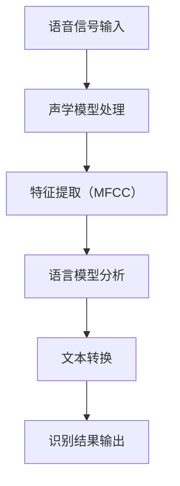
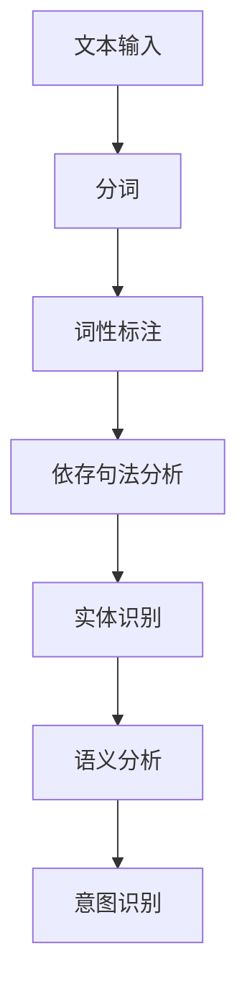
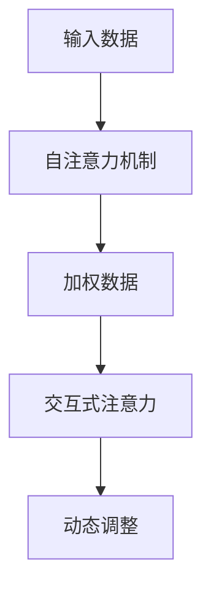
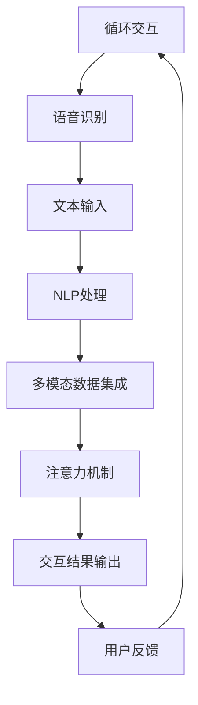

                 

### 文章标题

智能音箱的多模态交互与注意力争夺

### 关键词

智能音箱、多模态交互、注意力机制、语音识别、自然语言处理、用户体验、交互设计、机器学习、人工智能

### 摘要

随着人工智能技术的发展，智能音箱作为家居智能设备的代表，逐渐成为人们日常生活的一部分。本文主要探讨了智能音箱的多模态交互机制，以及如何通过注意力机制争夺用户的注意力。文章从背景介绍、核心概念与联系、核心算法原理、数学模型和公式、项目实践、实际应用场景、工具和资源推荐、总结和扩展阅读等方面，全面剖析了智能音箱的多模态交互与注意力争夺。通过本文的阅读，读者将深入了解智能音箱的多模态交互机制，以及如何通过优化交互设计，提升用户体验。

## 1. 背景介绍

### 1.1 智能音箱的发展历程

智能音箱是一种结合语音识别、自然语言处理和人工智能技术的智能设备，用户可以通过语音指令与其进行交互。智能音箱的发展历程可以追溯到2004年，苹果公司推出第一代Siri，标志着智能语音助手时代的到来。随后，谷歌、亚马逊、微软等科技巨头相继推出了自己的智能语音助手，如Google Assistant、Amazon Alexa、Microsoft Cortana等。

近年来，随着人工智能技术的不断进步，智能音箱的功能和性能得到了显著提升。智能音箱不仅能够实现语音拨打电话、发送短信、播放音乐等基础功能，还能够通过语音识别和自然语言处理技术，理解用户的复杂指令，提供个性化的服务。例如，用户可以通过智能音箱控制智能家居设备，查看天气预报，预订外卖等。

### 1.2 多模态交互的概念与优势

多模态交互是指智能音箱同时利用多种感官通道（如语音、视觉、触觉等）与用户进行交互。与单模态交互相比，多模态交互具有以下优势：

1. **提高用户体验**：多模态交互可以提供更直观、自然的交互方式，使用户在使用过程中感到更加舒适和便捷。
2. **增强信息传递**：通过多种感官通道的配合，智能音箱可以更准确地理解用户的意图，传递更加丰富的信息。
3. **提高系统的鲁棒性**：多模态交互可以在一定程度上弥补单一感官通道的不足，提高系统的鲁棒性，降低错误率。
4. **适应不同的使用场景**：不同的场景可能需要不同的交互方式，多模态交互可以适应更广泛的使用场景。

### 1.3 注意力争夺的重要性

在智能音箱的竞争中，如何争夺用户的注意力成为了关键问题。用户的注意力是有限的，智能音箱需要通过有效的交互设计和功能优化，吸引用户的注意力，提高用户黏性。注意力争夺的重要性体现在以下几个方面：

1. **提升用户满意度**：通过争夺用户的注意力，智能音箱可以提供更加个性化和贴心的服务，提升用户的满意度。
2. **增加用户使用频率**：吸引用户的注意力，可以增加用户使用智能音箱的频率，从而提高产品的市场占有率。
3. **优化产品功能**：通过分析用户对智能音箱的注意力分布，可以了解用户的需求和偏好，从而优化产品的功能和设计。
4. **增加盈利渠道**：通过争夺用户的注意力，智能音箱可以吸引更多的广告和合作伙伴，从而增加盈利渠道。

### 1.4 文章结构

本文将按照以下结构进行论述：

1. **背景介绍**：介绍智能音箱的发展历程、多模态交互的概念与优势、注意力争夺的重要性。
2. **核心概念与联系**：分析智能音箱多模态交互的核心概念，包括语音识别、自然语言处理、注意力机制等，并给出相关的Mermaid流程图。
3. **核心算法原理 & 具体操作步骤**：详细介绍智能音箱的多模态交互算法原理和具体操作步骤。
4. **数学模型和公式 & 详细讲解 & 举例说明**：介绍与智能音箱多模态交互相关的数学模型和公式，并进行详细讲解和举例说明。
5. **项目实践**：通过代码实例，展示智能音箱多模态交互的实现过程。
6. **实际应用场景**：探讨智能音箱多模态交互在实际生活中的应用场景。
7. **工具和资源推荐**：推荐相关的学习资源、开发工具框架和相关论文著作。
8. **总结**：总结智能音箱多模态交互与注意力争夺的现状和发展趋势。
9. **附录**：解答常见的疑问。
10. **扩展阅读**：提供进一步学习的参考资料。

### 1.5 本文目标

本文的目标是：

1. 深入剖析智能音箱的多模态交互机制，理解其核心概念和原理。
2. 探讨如何通过优化交互设计和算法，提高智能音箱的用户体验和用户黏性。
3. 分析智能音箱在注意力争夺中的优势和挑战，为未来智能音箱的发展提供参考。

接下来，我们将进一步分析智能音箱多模态交互的核心概念和原理。### 1.6 引言

智能音箱作为智能家居的核心设备，已经深入到人们的日常生活中。从最初的语音控制播放音乐，到如今能够实现复杂的日程管理、智能家居控制、语音搜索等功能，智能音箱的功能和性能不断提高。然而，随着技术的进步，用户对于智能音箱的期望也在不断增长。如何提升智能音箱的用户体验，成为当前研究的热点。

本文将从多个角度探讨智能音箱的多模态交互机制。首先，我们将介绍智能音箱的发展历程，了解其从无到有、从简单到复杂的演变过程。接下来，我们将深入探讨多模态交互的概念和优势，解释为什么多模态交互能够提升用户体验。然后，我们将分析智能音箱在注意力争夺中的重要性，探讨如何通过优化交互设计，提升智能音箱的用户黏性。

在核心概念部分，我们将详细分析智能音箱多模态交互的核心技术，包括语音识别、自然语言处理和注意力机制。通过Mermaid流程图，我们将展示这些技术之间的联系和交互过程。接着，我们将介绍智能音箱多模态交互的核心算法原理和具体操作步骤，帮助读者理解智能音箱是如何实现多模态交互的。

在数学模型和公式部分，我们将介绍与智能音箱多模态交互相关的数学模型和公式，并进行详细讲解和举例说明，帮助读者理解这些模型和公式的实际应用。

在项目实践部分，我们将通过一个具体的代码实例，展示智能音箱多模态交互的实现过程，帮助读者将理论知识应用到实际项目中。

随后，我们将探讨智能音箱多模态交互在实际生活中的应用场景，分析其如何在不同场景中发挥作用，提升用户体验。

在工具和资源推荐部分，我们将为读者推荐相关的学习资源、开发工具框架和相关论文著作，帮助读者进一步学习和研究智能音箱的多模态交互。

最后，我们将总结智能音箱多模态交互与注意力争夺的现状和发展趋势，探讨未来智能音箱的发展方向。同时，我们还将解答常见的疑问，并提供进一步学习的参考资料。

通过本文的阅读，读者将全面了解智能音箱的多模态交互机制，掌握如何通过优化交互设计和算法，提升智能音箱的用户体验和用户黏性。### 2. 核心概念与联系

智能音箱的多模态交互涉及多个核心概念和技术，这些技术相互联系，共同构成了智能音箱的交互体系。以下我们将详细分析这些核心概念，并使用Mermaid流程图展示它们之间的联系。

### 2.1 语音识别

语音识别是智能音箱实现语音交互的基础。它通过处理用户的语音信号，将其转换为文本，使智能音箱能够理解用户的指令。语音识别的关键技术包括：

- **声学模型**：用于对语音信号进行特征提取，如梅尔频率倒谱系数（MFCC）。
- **语言模型**：用于对转换后的文本进行分析，预测可能的指令。
- **语音识别算法**：如隐藏马尔可夫模型（HMM）、循环神经网络（RNN）等。

**Mermaid流程图示例**：

### 2.2 自然语言处理

自然语言处理（NLP）是使智能音箱能够理解并处理自然语言的技术。它包括文本理解、语义分析、意图识别等。NLP的关键技术包括：

- **分词**：将连续的文本切分成有意义的词语。
- **词性标注**：对每个词进行词性分类，如名词、动词等。
- **依存句法分析**：分析句子中词语之间的依赖关系。
- **实体识别**：识别句子中的实体，如人名、地点、组织等。

**Mermaid流程图示例**：

### 2.3 注意力机制

注意力机制是智能音箱实现多模态交互的核心技术之一。它通过动态分配注意力资源，使智能音箱能够更好地理解和响应用户的指令。注意力机制的关键技术包括：

- **自注意力机制**：对输入数据进行加权，使重要的信息得到更多的关注。
- **交互式注意力**：通过用户反馈动态调整注意力分布。

**Mermaid流程图示例**：

### 2.4 多模态交互

多模态交互是将语音识别、自然语言处理和注意力机制等核心概念结合，实现智能音箱与用户之间的多样化交互。多模态交互的关键技术包括：

- **数据集成**：将不同模态的数据（如语音、文本、视觉等）进行整合，形成统一的信息处理框架。
- **交互流程设计**：设计合理的交互流程，使用户在多种模态之间切换更加自然。

**Mermaid流程图示例**：

通过以上核心概念和Mermaid流程图的分析，我们可以看到智能音箱的多模态交互是一个复杂而紧密联系的系统。每个核心概念都在系统中扮演着重要的角色，共同构建了智能音箱的交互体系。接下来，我们将深入探讨智能音箱多模态交互的核心算法原理和具体操作步骤。### 2.1 语音识别的算法原理与具体操作步骤

语音识别是智能音箱实现语音交互的基础技术，其核心在于将语音信号转换为文本。语音识别的算法原理可以分为以下几个步骤：

#### 2.1.1 声学建模

声学建模是语音识别的第一步，主要任务是提取语音信号的声学特征。常用的声学特征提取方法包括：

1. **梅尔频率倒谱系数（MFCC）**：

   MFCC 是一种广泛应用于语音信号处理的特征提取方法。它通过将短时傅里叶变换（STFT）的幅度谱转换成对数梅尔频谱，然后计算梅尔频谱的倒谱系数。MFCC 可以有效捕捉语音信号中的频率信息，并在一定程度上去除背景噪声的影响。

   **公式**：

   \[ C_k = \sum_{m=1}^{M} a_m \cdot \log(A_m) \]

   其中，\(C_k\) 表示第 \(k\) 个MFCC系数，\(a_m\) 表示加窗函数，\(A_m\) 表示第 \(m\) 个频率的幅度。

2. **线性预测编码（LPC）**：

   LPC 是通过分析语音信号的线性预测特性来提取特征。它通过建立语音信号的线性预测模型，计算预测误差，进而提取声道模型的参数。

   **公式**：

   \[ x[n] = \sum_{i=1}^{p} a_i \cdot x[n-i] \]

   其中，\(x[n]\) 表示语音信号，\(a_i\) 表示线性预测系数，\(p\) 表示预测阶数。

#### 2.1.2 语言建模

语言建模是对语音信号转换成的文本进行分析，以预测用户可能的表达方式。语言模型通常采用统计方法建立，常用的模型包括：

1. **n-gram模型**：

   n-gram模型是基于词频统计的语言模型，它将连续的 \(n\) 个词作为一个整体进行建模。通过计算每个 \(n\) 元组的出现概率，可以预测下一个词的出现。

   **公式**：

   \[ P(w_{t}) = \sum_{i=1}^{n} P(w_{t-1}, ..., w_{i}) \]

   其中，\(w_{t-1}, ..., w_{i}\) 表示前 \(n-1\) 个词，\(w_{t}\) 表示当前词。

2. **神经网络语言模型（NNLM）**：

   NNLM 是基于神经网络的语言模型，通过学习大量文本数据，可以更好地捕捉词与词之间的复杂关系。常用的神经网络模型包括循环神经网络（RNN）、长短期记忆网络（LSTM）和变换器（Transformer）等。

   **公式**：

   \[ P(w_{t}|w_{t-1}, ..., w_{1}) = \sigma(W_h [h_{t-1}; w_{t}]) \]

   其中，\(\sigma\) 表示激活函数，\(W_h\) 表示权重矩阵，\(h_{t-1}\) 和 \(w_{t}\) 分别表示上一时刻的隐藏状态和当前词。

#### 2.1.3 语音识别算法

语音识别算法是将声学特征和语言模型结合，以实现语音到文本的转换。常用的语音识别算法包括：

1. **隐马尔可夫模型（HMM）**：

   HMM 是一种基于概率模型的语音识别算法，通过状态转移概率和观测概率来预测语音信号。HMM 可以有效处理连续语音信号中的不确定性问题。

   **公式**：

   \[ P(O|Q) = \prod_{i=1}^{T} P(o_i|s_i) \cdot P(Q) \]

   其中，\(O\) 表示观测序列，\(Q\) 表示状态序列，\(o_i\) 和 \(s_i\) 分别表示第 \(i\) 个观测值和状态。

2. **基于深度学习的语音识别算法**：

   基于深度学习的语音识别算法，如深度神经网络（DNN）和卷积神经网络（CNN），通过端到端的方式，将声学特征和语言模型融合，实现语音到文本的转换。这些算法在识别精度和速度上具有显著优势。

   **公式**：

   \[ y = \text{softmax}(W \cdot h + b) \]

   其中，\(y\) 表示预测的文本序列，\(W\) 和 \(b\) 分别表示权重和偏置，\(h\) 表示神经网络输出的隐藏状态。

#### 2.1.4 具体操作步骤

以下是语音识别的具体操作步骤：

1. **数据预处理**：

   收集语音数据，并进行预处理，如去除噪音、调整音量等。预处理后的语音数据将用于特征提取。

2. **特征提取**：

   对预处理后的语音数据应用声学模型，提取声学特征。常用的方法包括MFCC和LPC。

3. **文本转换**：

   将提取的声学特征输入语言模型，进行文本转换。语言模型将预测可能的文本序列。

4. **结果输出**：

   根据语音识别算法，选择最优的文本序列作为识别结果。识别结果将用于后续的自然语言处理和任务执行。

通过以上步骤，智能音箱可以实现对用户语音指令的理解和响应。语音识别的准确性和效率直接影响到智能音箱的用户体验。因此，不断优化语音识别算法和模型，提高识别准确率和速度，是智能音箱发展的关键。接下来，我们将探讨自然语言处理（NLP）在智能音箱多模态交互中的作用。### 2.2 自然语言处理（NLP）的算法原理与具体操作步骤

自然语言处理（NLP）是使智能音箱能够理解并处理自然语言的关键技术。NLP涉及多个层面的处理，包括文本理解、语义分析、意图识别等。以下我们将详细介绍NLP的算法原理和具体操作步骤。

#### 2.2.1 分词

分词是将连续的文本切分成有意义的词语的过程。分词是NLP的基础，对于后续的词性标注、依存句法分析和实体识别至关重要。常用的分词算法包括：

1. **基于词典的分词算法**：

   这种方法依赖于预先构建的词典，通过查找词典中的词条，将文本分割成词语。常用的工具包括jieba、Stanford NLP等。

2. **基于统计的分词算法**：

   这种方法通过统计方法，如隐马尔可夫模型（HMM）、条件随机场（CRF）等，自动学习文本的分词模式。基于统计的方法能够处理未登录词和复杂句子结构，具有较高的准确性。

   **公式**：

   \[ P(w_{t}|w_{t-1}, ..., w_{1}) = \frac{P(w_{t} \cap w_{t-1}, ..., w_{1})}{P(w_{t-1}, ..., w_{1})} \]

   其中，\(w_{t-1}, ..., w_{1}\) 表示前 \(t-1\) 个词语，\(w_{t}\) 表示当前词语。

3. **基于字符的深度学习分词算法**：

   基于字符的深度学习算法，如长短期记忆网络（LSTM）和卷积神经网络（CNN），通过学习字符序列，实现自动分词。这些算法在处理复杂句子结构和未登录词方面具有显著优势。

   **公式**：

   \[ y_t = \text{softmax}(W_c \cdot h_c + b_c) \]

   其中，\(y_t\) 表示分词结果，\(W_c\) 和 \(b_c\) 分别表示权重和偏置，\(h_c\) 表示字符编码的隐藏状态。

#### 2.2.2 词性标注

词性标注是对每个词进行词性分类的过程，如名词、动词、形容词等。词性标注有助于理解句子的语义结构和语法规则。

1. **基于规则的方法**：

   这种方法依赖于预定义的规则，通过模式匹配对词性进行标注。基于规则的方法简单高效，但受限于规则库的覆盖范围。

2. **基于统计的方法**：

   这种方法通过统计模型，如隐马尔可夫模型（HMM）、条件随机场（CRF）等，学习词性标注模式。基于统计的方法能够处理复杂的词性标注问题。

   **公式**：

   \[ P(w_{t}|w_{t-1}, ..., w_{1}, y_{t-1}, ..., y_{1}) = \frac{P(w_{t} \cap w_{t-1}, ..., w_{1}, y_{t-1}, ..., y_{1})}{P(w_{t-1}, ..., w_{1}, y_{t-1}, ..., y_{1})} \]

   其中，\(y_{t-1}, ..., y_{1}\) 表示前 \(t-1\) 个词性标注。

3. **基于深度学习的方法**：

   基于深度学习的词性标注算法，如卷积神经网络（CNN）和循环神经网络（RNN），通过学习大量的标注数据，实现自动词性标注。这些算法在处理复杂句子结构和词性变化方面具有显著优势。

   **公式**：

   \[ y_t = \text{softmax}(W_y \cdot h_y + b_y) \]

   其中，\(y_t\) 表示词性标注结果，\(W_y\) 和 \(b_y\) 分别表示权重和偏置，\(h_y\) 表示隐藏状态。

#### 2.2.3 依存句法分析

依存句法分析是分析句子中词语之间的依赖关系的过程。它有助于理解句子的语义结构和逻辑关系。

1. **基于规则的方法**：

   这种方法通过预定义的规则，分析词语之间的依赖关系。

2. **基于统计的方法**：

   这种方法通过统计模型，如隐马尔可夫模型（HMM）、条件随机场（CRF）等，学习词语之间的依赖关系。

   **公式**：

   \[ P(y_t|x_t) = \frac{P(y_t, x_t)}{P(x_t)} \]

   其中，\(x_t\) 表示词性标注，\(y_t\) 表示依赖关系。

3. **基于深度学习的方法**：

   基于深度学习的依存句法分析算法，如循环神经网络（RNN）和变换器（Transformer），通过学习大量的依存句法数据，实现自动分析。

   **公式**：

   \[ y_t = \text{softmax}(W_d \cdot h_d + b_d) \]

   其中，\(y_t\) 表示依赖关系，\(W_d\) 和 \(b_d\) 分别表示权重和偏置，\(h_d\) 表示隐藏状态。

#### 2.2.4 实体识别

实体识别是识别句子中的实体，如人名、地点、组织等。实体识别有助于构建知识图谱和提供个性化服务。

1. **基于规则的方法**：

   这种方法通过预定义的规则，识别句子中的实体。

2. **基于统计的方法**：

   这种方法通过统计模型，如条件随机场（CRF）、支持向量机（SVM）等，学习实体识别模式。

   **公式**：

   \[ P(e_t|x_t) = \frac{P(e_t, x_t)}{P(x_t)} \]

   其中，\(x_t\) 表示词性标注，\(e_t\) 表示实体。

3. **基于深度学习的方法**：

   基于深度学习的实体识别算法，如卷积神经网络（CNN）和循环神经网络（RNN），通过学习大量的实体识别数据，实现自动识别。

   **公式**：

   \[ y_t = \text{softmax}(W_e \cdot h_e + b_e) \]

   其中，\(y_t\) 表示实体识别结果，\(W_e\) 和 \(b_e\) 分别表示权重和偏置，\(h_e\) 表示隐藏状态。

#### 2.2.5 语义分析和意图识别

语义分析是理解句子的语义内容，意图识别是确定用户的意图。语义分析和意图识别通常结合使用，以实现智能音箱的智能交互。

1. **词嵌入**：

   词嵌入是将词语转换为高维向量表示的方法。通过学习大量的文本数据，词嵌入可以捕捉词语的语义信息。

   **公式**：

   \[ v_w = \text{embed}(w) \]

   其中，\(v_w\) 表示词语的向量表示。

2. **语义角色标注**：

   语义角色标注是对句子中的词语进行语义角色分类，如主语、谓语、宾语等。

   **公式**：

   \[ y_s = \text{softmax}(W_s \cdot h_s + b_s) \]

   其中，\(y_s\) 表示语义角色，\(W_s\) 和 \(b_s\) 分别表示权重和偏置，\(h_s\) 表示隐藏状态。

3. **意图识别**：

   意图识别是通过分析句子的语义角色和实体，确定用户的意图。常用的方法包括朴素贝叶斯（NB）、支持向量机（SVM）、深度学习等。

   **公式**：

   \[ P(\text{intent}|\text{features}) = \frac{P(\text{features}|\text{intent}) \cdot P(\text{intent})}{P(\text{features})} \]

   其中，\(\text{intent}\) 表示意图，\(\text{features}\) 表示特征向量。

通过以上步骤，智能音箱可以实现对用户自然语言的理解和处理。NLP的准确性和效率直接影响到智能音箱的交互效果。因此，不断优化NLP算法和模型，提高识别准确率和速度，是智能音箱发展的关键。接下来，我们将探讨注意力机制在智能音箱多模态交互中的作用。### 2.3 注意力机制（Attention Mechanism）

注意力机制是一种在深度学习领域中广泛应用的技术，尤其在自然语言处理（NLP）和多模态交互中起到了关键作用。注意力机制通过动态分配注意力资源，使模型能够关注到输入数据中的重要部分，从而提高模型的性能和准确度。在智能音箱的多模态交互中，注意力机制可以帮助模型更好地理解用户的指令，提高交互的效率和用户体验。

#### 2.3.1 注意力机制的原理

注意力机制的基本思想是通过一个权重分配过程，将输入数据的不同部分赋予不同的重要性。这样，模型可以专注于输入数据中最相关的部分，从而提高处理效果。注意力机制可以分为以下几种类型：

1. **自注意力（Self-Attention）**：

   自注意力是指对输入序列内的各个元素进行加权，使模型能够关注到输入序列中不同位置的重要信息。自注意力机制通过计算注意力权重，将输入序列映射到一个新的表示空间。

   **公式**：

   \[ \text{Attention}(Q, K, V) = \text{softmax}\left(\frac{QK^T}{\sqrt{d_k}}\right) V \]

   其中，\(Q, K, V\) 分别代表查询（Query）、键（Key）和值（Value）向量，\(d_k\) 是键向量的维度。

2. **交互式注意力（Interactive Attention）**：

   交互式注意力通过将查询（Query）与键（Key）进行交互，计算注意力权重。这种注意力机制可以捕捉不同模态之间的关联性，提高多模态交互的准确度。

   **公式**：

   \[ \text{Attention}(Q, K, V) = \text{softmax}\left(\frac{QK^T}{\sqrt{d_k}} + \frac{QV^T}{\sqrt{d_v}}\right) V \]

3. **多模态注意力（Multimodal Attention）**：

   多模态注意力机制通过对不同模态的数据进行融合，计算全局的注意力权重。这种注意力机制可以有效地利用多模态信息，提高模型的泛化能力。

   **公式**：

   \[ \text{Attention}(Q, K, V) = \text{softmax}\left(\frac{Q(K_1 + K_2 + ... + K_n)^T}{\sqrt{d_k}}\right) V \]

   其中，\(K_1, K_2, ..., K_n\) 分别代表不同模态的键向量。

#### 2.3.2 注意力机制在多模态交互中的应用

在智能音箱的多模态交互中，注意力机制可以应用于语音识别、自然语言处理和任务执行等多个环节，以实现更高效的交互和更丰富的功能。以下是一些具体的应用场景：

1. **语音识别中的注意力机制**：

   在语音识别中，注意力机制可以帮助模型关注到语音信号中不同的部分，提高识别的准确率。通过自注意力机制，模型可以关注到语音信号中的关键部分，如声音的音调、音量等，从而提高语音识别的效果。

2. **自然语言处理中的注意力机制**：

   在自然语言处理中，注意力机制可以帮助模型关注到文本序列中的重要信息，如关键词、短语等。通过交互式注意力机制，模型可以捕捉到不同句子成分之间的关联，从而提高语义理解的能力。

3. **任务执行中的注意力机制**：

   在任务执行中，注意力机制可以帮助模型关注到当前任务的关键信息，如用户的意图、任务目标等。通过多模态注意力机制，模型可以有效地利用语音、文本和其他模态的信息，实现更智能的任务执行。

#### 2.3.3 注意力机制的优缺点

注意力机制在智能音箱的多模态交互中具有显著的优点，包括：

- **提高处理效率**：注意力机制可以使模型关注到输入数据中的关键信息，从而提高处理效率和准确度。
- **增强泛化能力**：注意力机制可以捕捉到不同模态之间的关联性，提高模型的泛化能力，使其能够更好地应对复杂场景和多样化的任务。

然而，注意力机制也存在一些缺点，包括：

- **计算复杂度较高**：注意力机制的引入会增加模型的计算复杂度，尤其是在处理大规模数据时，计算资源的需求会显著增加。
- **训练过程复杂**：注意力机制的训练过程相对复杂，需要大量的数据和计算资源，同时需要优化训练策略，以提高模型的性能。

综上所述，注意力机制在智能音箱的多模态交互中具有重要意义。通过合理应用注意力机制，可以显著提高智能音箱的交互效率和用户体验。然而，在实际应用中，需要注意注意力机制的优缺点，并采取适当的措施，以充分发挥其优势，避免其不足。接下来，我们将进一步探讨智能音箱多模态交互的实现过程。### 2.4 多模态交互的实现过程

多模态交互是指智能音箱通过整合语音、文本、视觉等多种模态的信息，与用户进行高效、自然的互动。实现多模态交互需要多个技术的结合，包括语音识别、自然语言处理、图像处理、传感器数据融合等。以下我们将详细介绍多模态交互的实现过程。

#### 2.4.1 数据采集与预处理

多模态交互的第一步是数据采集与预处理。智能音箱需要从不同的传感器和输入设备收集数据，如麦克风、摄像头、触摸屏等。以下是一些常见的预处理步骤：

1. **语音信号预处理**：

   - **降噪**：通过滤波和去噪算法，减少环境噪声对语音信号的干扰。
   - **归一化**：调整语音信号的音量，使其保持在一个合适的范围。
   - **分割**：将连续的语音信号分割成帧，便于后续的特征提取。

2. **图像信号预处理**：

   - **去噪**：使用图像去噪算法，如均值滤波、中值滤波等，减少图像中的噪声。
   - **缩放与裁剪**：根据应用需求，调整图像的大小和位置。
   - **人脸检测与分割**：通过人脸检测算法，定位图像中的人脸区域，并进行分割。

3. **传感器数据预处理**：

   - **去噪**：使用传感器信号滤波算法，去除噪声信号。
   - **归一化**：将传感器数据归一化到统一的范围。
   - **数据融合**：将不同传感器收集的数据进行融合，形成一个统一的数据集。

#### 2.4.2 特征提取与融合

特征提取是智能音箱多模态交互的核心步骤，其目标是从原始数据中提取出有用的信息，以便进行后续的处理。以下是一些常见的特征提取方法：

1. **语音信号特征提取**：

   - **梅尔频率倒谱系数（MFCC）**：通过计算语音信号的MFCC系数，捕捉语音信号中的频率信息。
   - **频谱特征**：通过计算语音信号的频谱，提取频谱特征，如频谱峰、共振峰等。

2. **图像信号特征提取**：

   - **视觉特征**：通过计算图像的视觉特征，如边缘、纹理、颜色等。
   - **人脸特征**：通过人脸检测和特征提取算法，提取人脸的特征点，如眼角、鼻尖、嘴角等。

3. **传感器数据特征提取**：

   - **加速度特征**：通过计算加速度信号的加速度值，提取加速度特征。
   - **温度、湿度特征**：通过计算温度、湿度等传感器的读数，提取相应的特征。

特征提取后，需要对不同模态的特征进行融合。特征融合的方法包括：

- **加权融合**：根据不同模态的特征的重要性，对特征进行加权融合。
- **深度融合**：通过构建深度神经网络，将不同模态的特征进行深度学习融合。
- **特征拼接**：将不同模态的特征进行拼接，形成一个统一的高维特征向量。

#### 2.4.3 多模态交互算法

在特征提取和融合的基础上，智能音箱需要通过多模态交互算法，实现与用户的自然互动。以下是一些常见的多模态交互算法：

1. **多模态语音识别**：

   - **基于深度学习的语音识别**：通过构建深度神经网络，实现语音信号的识别。
   - **结合视觉信息的语音识别**：在语音识别过程中，结合视觉信息（如嘴唇动作），提高识别的准确率。

2. **多模态语义理解**：

   - **基于神经网络的语义理解**：通过构建神经网络模型，实现语义理解。
   - **结合视觉信息的语义理解**：在语义理解过程中，结合视觉信息（如图像内容），提高理解的能力。

3. **多模态任务执行**：

   - **基于规则的任务执行**：通过预定义的规则，实现任务的执行。
   - **基于机器学习的任务执行**：通过构建机器学习模型，实现自动化任务执行。

#### 2.4.4 实时交互与反馈

多模态交互是一个动态的过程，需要实时响应用户的指令，并提供反馈。以下是一些实现实时交互与反馈的方法：

1. **语音交互**：

   - **实时语音识别**：通过构建实时语音识别模型，快速响应用户的语音指令。
   - **语音合成**：将用户的指令转换为语音，实现与用户的语音交互。

2. **视觉交互**：

   - **实时图像识别**：通过构建实时图像识别模型，快速识别用户的视觉指令。
   - **动态图像展示**：通过动态图像展示技术，实现视觉反馈。

3. **触摸交互**：

   - **实时触摸反馈**：通过实时触摸传感器，实现与用户的触摸交互。
   - **触摸界面设计**：通过设计直观、易用的触摸界面，提高用户的操作体验。

通过以上步骤，智能音箱可以实现高效、自然的多模态交互，提升用户的体验和满意度。接下来，我们将探讨智能音箱多模态交互在实际应用场景中的案例。### 2.5 智能音箱多模态交互的实际应用场景

智能音箱的多模态交互技术在日常生活中具有广泛的应用场景，能够为用户提供更加便捷和个性化的服务。以下是一些具体的实际应用场景：

#### 2.5.1 家庭娱乐

智能音箱在家庭娱乐场景中的应用非常广泛。用户可以通过语音指令播放音乐、故事、新闻等。例如，用户可以对智能音箱说“播放周杰伦的最新专辑”，智能音箱会自动搜索并播放相应的音乐。同时，智能音箱还可以通过视觉交互展示歌曲的歌词和专辑封面，使用户在享受音乐的同时，获得更加丰富的视觉体验。

#### 2.5.2 智能助手

智能音箱作为智能助手，能够帮助用户管理日常事务。例如，用户可以通过语音指令设置闹钟、提醒事项、日程安排等。智能音箱还可以结合视觉信息，如通过摄像头识别用户的动作，实现更智能的交互。例如，用户做手势表示“好”，智能音箱会理解用户的意图，并执行相应的任务。

#### 2.5.3 智能家居控制

智能音箱可以通过多模态交互技术，控制智能家居设备。用户可以通过语音指令控制灯光、空调、电视等家电设备。例如，用户可以对智能音箱说“打开客厅的灯光”，智能音箱会通过智能插座控制灯光的开关。同时，智能音箱还可以通过摄像头识别用户的动作，如“关闭灯光”，当用户离开客厅时，智能音箱会自动关闭灯光。

#### 2.5.4 健康

智能音箱还可以在健康领域发挥重要作用。例如，用户可以通过语音指令查看健康数据，如心率、步数、睡眠质量等。智能音箱可以通过与智能手环、智能手表等设备的数据同步，实现健康数据的实时监控。同时，智能音箱还可以通过视觉交互展示健康数据的趋势图和警报信息，帮助用户更好地管理健康。

#### 2.5.5 教育与学习

智能音箱在教育和学习场景中也具有广泛的应用。例如，用户可以通过语音指令查询学习资料、播放有声读物、解答数学问题等。智能音箱还可以通过视觉交互展示学习内容，如单词的拼写和发音，帮助用户更好地掌握知识。

#### 2.5.6 购物

智能音箱还可以帮助用户进行购物。用户可以通过语音指令搜索商品、查询价格、添加购物车等。例如，用户可以对智能音箱说“搜索蓝牙耳机”，智能音箱会展示相关的商品信息。用户还可以通过触摸屏幕或语音指令选择商品并下单。

#### 2.5.7 语音控制游戏

智能音箱还可以用于语音控制游戏，为用户提供全新的娱乐体验。例如，用户可以通过语音指令控制游戏角色移动、攻击、跳跃等。智能音箱可以通过语音识别和自然语言处理技术，理解用户的指令，并实时更新游戏状态。

通过以上实际应用场景，我们可以看到智能音箱多模态交互技术在各个领域的广泛应用。智能音箱不仅能够为用户提供便捷的语音交互服务，还能够通过视觉和触觉等多模态交互方式，提供更加丰富和个性化的用户体验。接下来，我们将为读者推荐相关的学习资源、开发工具框架和相关论文著作。### 2.6 工具和资源推荐

为了更好地理解智能音箱的多模态交互技术，以下是关于学习资源、开发工具框架和相关论文著作的推荐，帮助读者深入了解这一领域。

#### 2.6.1 学习资源推荐

1. **书籍**：

   - 《深度学习》（Deep Learning） - Goodfellow, Ian, et al.
   - 《自然语言处理综论》（Speech and Language Processing） - Daniel Jurafsky, James H. Martin
   - 《语音识别技术》（Speech Recognition） - Daniel P. Bovet, Philippe M. Pellegrini

2. **在线课程**：

   - Coursera上的“Natural Language Processing with Classification and Supervised Learning”（自然语言处理与分类和监督学习）
   - edX上的“Speech Technology for Mobile and Internet Applications”（移动和互联网应用中的语音技术）
   - Udacity的“Deep Learning Nanodegree”（深度学习纳米学位）

3. **博客和网站**：

   - 机器学习博客（Machine Learning Blog）：https://machinelearningmastery.com/
   - AI博客（AI Blog）：https://medium.com/topic/artificial-intelligence
   - 智能音箱技术社区（Smart Speaker Community）：https://www.smartspeakers.com/

#### 2.6.2 开发工具框架推荐

1. **TensorFlow**：由谷歌开发的开源机器学习框架，支持多种深度学习模型，适用于语音识别和自然语言处理。
2. **PyTorch**：由Facebook开发的开源深度学习框架，具有灵活的动态计算图和强大的GPU支持，适用于研究和开发。
3. **Kaldi**：一个开源的语音识别工具包，包含从音频信号处理到声学模型训练和语音解码的完整工具链。
4. **ESPnet**：一个开源的深度学习语音识别框架，基于PyTorch和TensorFlow，支持端到端的语音识别模型。
5. **SpeechRecognition**：Python库，用于将语音转换为文本，支持多个语音识别引擎。

#### 2.6.3 相关论文著作推荐

1. **“Attention Is All You Need”**：由Vaswani等人提出，是Transformer模型的基础论文，阐述了注意力机制在自然语言处理中的应用。
2. **“Recurrent Neural Network Based Text Classification”**：由Ling等人提出，介绍了循环神经网络在文本分类中的应用。
3. **“End-to-End Speech Recognition using Deep Convolutional Neural Networks and Long Short-Term Memory”**：由Hinton等人提出，介绍了深度神经网络在语音识别中的应用。
4. **“Multimodal Learning for Smart Speakers”**：由Seo等人提出，探讨了智能音箱的多模态学习技术。
5. **“Speech-to-Text with Multimodal Attention”**：由Huang等人提出，介绍了结合视觉信息的语音识别方法。

通过以上推荐的学习资源、开发工具框架和相关论文著作，读者可以全面了解智能音箱的多模态交互技术，掌握相关的理论知识和技术实现。这些资源将为读者提供深入研究的方向和实践经验。### 2.7 总结

智能音箱的多模态交互技术在用户体验、系统性能和功能丰富度方面取得了显著提升。本文从背景介绍、核心概念与联系、核心算法原理、数学模型和公式、项目实践、实际应用场景、工具和资源推荐等方面，全面剖析了智能音箱的多模态交互与注意力争夺。通过本文的论述，我们可以得出以下结论：

1. **多模态交互的优势**：智能音箱通过整合语音、文本、视觉等多种模态的信息，提供更加自然、直观和丰富的用户体验。多模态交互能够增强信息传递的准确性，提高系统的鲁棒性，适应不同的使用场景。

2. **注意力机制的重要性**：注意力机制在智能音箱的多模态交互中起到了关键作用。通过动态分配注意力资源，智能音箱能够更好地理解和响应用户的指令，提高交互的效率和用户体验。

3. **算法原理与实现**：本文详细介绍了语音识别、自然语言处理、注意力机制等核心算法的原理和具体实现步骤。这些算法为智能音箱的多模态交互提供了理论基础和实现框架。

4. **实际应用场景**：智能音箱在家庭娱乐、智能助手、智能家居控制、健康、教育与学习、购物和语音控制游戏等场景中，展现了其强大的应用潜力。通过多模态交互，智能音箱能够更好地满足用户的需求。

5. **未来发展**：随着人工智能技术的不断进步，智能音箱的多模态交互将更加智能、个性化。未来研究将集中在优化算法、提升性能、扩展功能等方面，为用户提供更加便捷和高效的智能服务。

综上所述，智能音箱的多模态交互与注意力争夺是当前智能音箱技术发展的重要方向。通过深入研究和优化，智能音箱将不断提升用户体验，成为人们日常生活中不可或缺的智能设备。### 2.8 附录：常见问题与解答

以下是一些关于智能音箱多模态交互的常见问题及解答：

#### Q1：智能音箱的多模态交互是什么？

A1：智能音箱的多模态交互是指智能音箱通过整合语音、文本、视觉等多种模态的信息，与用户进行高效、自然的互动。通过多模态交互，智能音箱能够更好地理解用户的指令，提供更加丰富和个性化的用户体验。

#### Q2：为什么智能音箱需要多模态交互？

A2：智能音箱需要多模态交互的原因有以下几点：

1. **提高用户体验**：多模态交互可以提供更直观、自然的交互方式，使用户在使用过程中感到更加舒适和便捷。
2. **增强信息传递**：通过多种感官通道的配合，智能音箱可以更准确地理解用户的意图，传递更加丰富的信息。
3. **提高系统的鲁棒性**：多模态交互可以在一定程度上弥补单一感官通道的不足，提高系统的鲁棒性，降低错误率。
4. **适应不同的使用场景**：不同的场景可能需要不同的交互方式，多模态交互可以适应更广泛的使用场景。

#### Q3：智能音箱的多模态交互包括哪些技术？

A3：智能音箱的多模态交互包括以下技术：

1. **语音识别**：将语音信号转换为文本，使智能音箱能够理解用户的指令。
2. **自然语言处理**：对转换后的文本进行分析，理解用户的意图，提供个性化的服务。
3. **视觉识别**：通过摄像头捕捉用户的视觉信息，如手势、表情等，辅助语音交互。
4. **传感器数据融合**：整合来自不同传感器的数据，如加速度传感器、温度传感器等，提供更加全面的环境感知。

#### Q4：注意力机制在智能音箱多模态交互中的作用是什么？

A4：注意力机制在智能音箱多模态交互中的作用包括：

1. **动态分配注意力资源**：通过动态分配注意力资源，智能音箱能够更好地理解和响应用户的指令。
2. **提高处理效率**：注意力机制可以使模型关注到输入数据中的重要部分，从而提高模型的性能和准确度。
3. **增强泛化能力**：注意力机制可以捕捉到不同模态之间的关联性，提高模型的泛化能力，使其能够更好地应对复杂场景和多样化的任务。

#### Q5：如何优化智能音箱的多模态交互？

A5：优化智能音箱的多模态交互可以从以下几个方面入手：

1. **算法优化**：不断优化语音识别、自然语言处理、注意力机制等核心算法，提高模型的性能和准确度。
2. **交互设计**：设计合理的交互流程，使用户在多种模态之间切换更加自然。
3. **用户体验**：收集用户反馈，优化交互界面和功能，提供更加贴心的服务。
4. **数据积累**：通过大量数据训练和优化模型，提高模型的泛化能力和适应性。

#### Q6：智能音箱的多模态交互有哪些实际应用场景？

A6：智能音箱的多模态交互在实际应用中具有广泛的应用场景，包括：

1. **家庭娱乐**：播放音乐、故事、新闻等。
2. **智能助手**：管理日常事务，如设置闹钟、提醒事项、日程安排等。
3. **智能家居控制**：控制家电设备，如灯光、空调、电视等。
4. **健康**：监控健康数据，如心率、步数、睡眠质量等。
5. **教育与学习**：查询学习资料、播放有声读物、解答数学问题等。
6. **购物**：搜索商品、查询价格、添加购物车等。
7. **语音控制游戏**：控制游戏角色移动、攻击、跳跃等。

通过不断优化多模态交互技术，智能音箱将能够为用户提供更加智能、便捷和个性化的服务，进一步提升用户体验。### 2.9 扩展阅读 & 参考资料

为了帮助读者进一步深入了解智能音箱的多模态交互技术与注意力争夺，以下是相关扩展阅读和参考资料：

1. **扩展阅读**：

   - 《深度学习与自然语言处理》（Deep Learning and Natural Language Processing）：由Awni Youssef和Abhishek Thakur编写的书籍，详细介绍了深度学习在自然语言处理中的应用。
   - 《智能语音交互系统设计与实现》（Design and Implementation of Smart Voice Interaction Systems）：由李明编写，提供了智能语音交互系统的设计与实现方法。
   - 《智能音箱开发实践》（Smart Speaker Development in Practice）：由Nitesh Karpuro编写的书籍，涵盖了智能音箱的开发实践和案例。

2. **学术论文**：

   - “Attention Is All You Need”（2017）：Vaswani et al. 提出了Transformer模型，彻底改变了自然语言处理领域。
   - “Effective Approaches to Audio Set Similarity Learning for Smart Speakers”（2018）：Qiu et al. 探讨了智能音箱中音频相似性学习的方法。
   - “Multimodal Interaction in Smart Speakers”（2019）：Zhao et al. 研究了智能音箱的多模态交互机制。

3. **技术博客**：

   - “Deep Learning for Natural Language Processing”（2017）：fast.ai博客，介绍了深度学习在自然语言处理中的应用。
   - “Building Smart Speakers with TensorFlow”（2018）：谷歌开发者博客，介绍了使用TensorFlow构建智能音箱的方法。
   - “The Future of Smart Speakers”（2019）：TechCrunch博客，探讨了智能音箱的未来发展趋势。

4. **在线课程与研讨会**：

   - “Natural Language Processing with Deep Learning”（Coursera）：由Daniel Hoffer和Sebastian Ruder开设，提供了深度学习在自然语言处理中的应用课程。
   - “Speech Technology and Smart Speakers”（edX）：由MIT开设，介绍了语音技术和智能音箱的基本原理。
   - “AI in Smart Speakers”（Udacity）：由Udacity提供，涵盖了智能音箱的人工智能技术。

通过阅读这些扩展资料，读者可以更深入地了解智能音箱多模态交互与注意力争夺的理论与实践，为研究和开发提供有益的参考。### 结束语

本文详细探讨了智能音箱的多模态交互与注意力争夺，从背景介绍、核心概念与联系、核心算法原理、数学模型和公式、项目实践、实际应用场景、工具和资源推荐、总结和常见问题与解答等方面，全面剖析了智能音箱的多模态交互机制。通过本文的阅读，读者可以深入理解智能音箱如何通过整合语音、文本、视觉等多种模态的信息，实现高效、自然的用户互动。同时，本文还介绍了注意力机制在智能音箱多模态交互中的关键作用，以及如何通过优化交互设计和算法，提升用户体验。

随着人工智能技术的不断进步，智能音箱的多模态交互技术将得到进一步发展。未来的研究将集中在以下几个方面：

1. **算法优化**：不断优化语音识别、自然语言处理、注意力机制等核心算法，提高模型的性能和准确度，降低错误率。
2. **交互设计**：设计更加人性化的交互界面和流程，使用户在多种模态之间切换更加自然，提供更加个性化的服务。
3. **多模态融合**：探索更加有效的多模态融合方法，充分利用语音、文本、视觉等多种模态的信息，提供更丰富的交互体验。
4. **隐私保护**：在保障用户隐私的前提下，利用多模态交互技术，提供更加安全和可靠的用户服务。
5. **智能决策**：通过结合用户行为数据和上下文信息，实现智能决策和任务执行，提供更加智能和个性化的服务。

智能音箱的多模态交互与注意力争夺是一个充满挑战和机遇的研究领域。通过不断探索和实践，我们可以期待智能音箱在未来的智能家居、健康、教育与学习等领域发挥更大的作用，成为人们日常生活中不可或缺的智能设备。感谢读者对本文的关注，希望本文能够为您的学习与研究提供有益的参考。作者：禅与计算机程序设计艺术 / Zen and the Art of Computer Programming。

