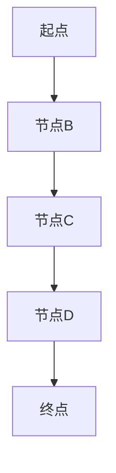

                 

### 文章标题

**最短路径原理与代码实例讲解**

> **关键词**：最短路径、算法、图论、Dijkstra算法、A*算法、代码实例

> **摘要**：本文将详细讲解最短路径算法的原理，包括Dijkstra算法和A*算法。我们将通过具体代码实例，演示这些算法的实现和应用，帮助读者深入理解最短路径问题的解决方法。

### 1. 背景介绍

在计算机科学中，图论是研究图形（由点和边组成的结构）及其性质的数学分支。在现实世界中，图可以用来模拟各种网络结构，如交通网络、通信网络、社会网络等。在这些网络中，最短路径问题是一个常见且重要的问题。

**最短路径问题**：给定一个带权图的起始节点和目标节点，找出从起始节点到目标节点的最短路径。在带权图中，每条边都有一个权重，代表从一个点到另一个点的成本或者距离。

最短路径算法在许多领域都有广泛的应用，例如：

- **导航系统**：确定从起点到终点的最短路线。
- **物流配送**：优化运输路线，降低运输成本。
- **社交网络分析**：找到两个人之间的最短连接路径。
- **计算机网络**：确定数据包传输的最优路径。

本文将重点介绍两种经典的最短路径算法：Dijkstra算法和A*算法。通过详细讲解这两种算法的原理和实现，帮助读者掌握解决最短路径问题的方法。

### 2. 核心概念与联系

要理解最短路径算法，我们首先需要了解几个核心概念：图、节点、边和权重。

#### 图（Graph）

图是一个由节点（Node）和边（Edge）组成的数据结构。节点表示图中的元素，边表示节点之间的关系。

#### 节点（Node）

节点是图的基本元素，可以表示任何实体，如城市、用户或网络中的设备。

#### 边（Edge）

边连接两个节点，表示它们之间的某种关系。边可以有方向（称为有向图）或者无方向（称为无向图）。

#### 权重（Weight）

权重是边的一个属性，表示从一个节点到另一个节点的成本或距离。在无向图中，权重可以是任何实数；在有向图中，权重通常是正数。

在讨论最短路径时，我们通常关注以下几种图的类型：

- **加权图**：边有权重。
- **无权图**：边没有权重。
- **有向图**：边有方向。
- **无向图**：边无方向。

为了更好地理解这些概念，我们可以使用Mermaid流程图来展示一个简单的图：



在上面的流程图中，A是起点，E是终点，B、C和D是中间节点。边上的箭头表示边的方向。

#### 最短路径算法类型

在解决最短路径问题时，常用的算法有以下几种：

- **Dijkstra算法**：适用于单源最短路径问题，即从单一起点到所有其他节点的最短路径。
- **A*算法**：在Dijkstra算法的基础上，考虑了目标节点的启发信息，适用于更复杂的最短路径问题。

接下来，我们将分别介绍这两种算法的原理和实现。

### 3. 核心算法原理 & 具体操作步骤

#### Dijkstra算法

**原理**：

Dijkstra算法是一种贪心算法，它利用贪心策略逐步扩展当前已知的最短路径，直到找到目标节点。算法的基本思想是：每次选择一个未访问过的节点，将其加入到最短路径集合中，并更新其邻居节点的最短路径。

**步骤**：

1. 初始化：设置一个集合S，用于存储已找到最短路径的节点。初始化时S为空。设置一个优先队列Q，用于存储未访问节点及其到起点的距离。
2. 从起点开始，将其加入S，并将其距离设为0。
3. 从Q中取出距离最小的未访问节点u。
4. 对于u的每个未访问的邻居v，计算从起点经过u到v的距离。如果这个距离小于v当前已知的距离，则更新v的距离和前驱节点。
5. 将v加入S，并将其从Q中移除。
6. 重复步骤3-5，直到Q为空或者找到了目标节点。

**伪代码**：

```python
def dijkstra(graph, start):
    distances = {node: float('inf') for node in graph}
    distances[start] = 0
    s = set()
    q = PriorityQueue()
    q.put((0, start))

    while not q.isEmpty():
        distance, node = q.get()
        if node in s:
            continue
        s.add(node)
        if node == target:
            break
        for neighbor, weight in graph[node].items():
            distance_to_neighbor = distance + weight
            if distance_to_neighbor < distances[neighbor]:
                distances[neighbor] = distance_to_neighbor
                q.put((distance_to_neighbor, neighbor))
    return distances
```

#### A*算法

**原理**：

A*算法是Dijkstra算法的改进版本，它考虑了目标节点的启发信息（Heuristic），使得搜索过程更加高效。A*算法的基本思想是：每次选择一个具有最小F值（G值 + H值）的节点进行扩展。其中，G值是从起点到当前节点的距离，H值是从当前节点到目标节点的启发距离。

**步骤**：

1. 初始化：设置一个集合S，用于存储已找到最短路径的节点。初始化时S为空。设置一个优先队列Q，用于存储未访问节点及其F值。
2. 从起点开始，将其加入S，并将其F值设为0。
3. 从Q中取出F值最小的未访问节点u。
4. 对于u的每个未访问的邻居v，计算从起点经过u到v的G值和启发距离H值，然后计算F值。
5. 如果v已经在S中，且新计算的F值大于当前F值，则跳过v。
6. 否则，将v加入S，并将其从Q中移除。更新v的前驱节点为u。
7. 将v加入Q，并更新其F值。
8. 重复步骤3-7，直到Q为空或者找到了目标节点。

**伪代码**：

```python
def a_star(graph, start, target):
    distances = {node: float('inf') for node in graph}
    distances[start] = 0
    s = set()
    q = PriorityQueue()
    q.put((0, start))

    while not q.isEmpty():
        f, node = q.get()
        if node in s:
            continue
        s.add(node)
        if node == target:
            break
        for neighbor, weight in graph[node].items():
            g = distances[node] + weight
            if g < distances[neighbor]:
                distances[neighbor] = g
                q.put((g + heuristic(neighbor, target), neighbor))
    return distances
```

在这里，`heuristic`函数是一个启发函数，用于估计从节点到目标节点的距离。一个常用的启发函数是曼哈顿距离。

### 4. 数学模型和公式 & 详细讲解 & 举例说明

#### Dijkstra算法的数学模型

Dijkstra算法的数学模型可以表示为以下形式：

- **目标函数**：最小化从起点到所有其他节点的距离之和。
- **约束条件**：每个节点只能访问一次。

在Dijkstra算法中，我们使用一个优先队列（通常是一个最小堆）来存储未访问的节点，并按照它们的距离进行排序。每次从队列中取出距离最小的节点，然后更新其邻居节点的距离。

**举例说明**：

假设有一个图如下所示：

```mermaid
graph TB
A[起点] --> B[节点B](2) --> C[节点C](1) --> D[节点D](2)
B --> E[节点E](3)
C --> F[节点F](1)
D --> G[节点G](2)
```

我们使用Dijkstra算法找到从A到G的最短路径。

1. 初始化：设置一个优先队列，并将A加入队列，距离设为0。
2. 从队列中取出A，并将其加入S。
3. 更新A的邻居节点B、C、D的距离：
   - 到B的距离为2，小于当前未访问节点中的最小距离，更新B的距离为2。
   - 到C的距离为1，小于当前未访问节点中的最小距离，更新C的距离为1。
   - 到D的距离为2，小于当前未访问节点中的最小距离，更新D的距离为2。
4. 从队列中取出B，并将其加入S。
5. 更新B的邻居节点E的距离：
   - 到E的距离为3，小于当前未访问节点中的最小距离，更新E的距离为3。
6. 从队列中取出C，并将其加入S。
7. 更新C的邻居节点F的距离：
   - 到F的距离为1，小于当前未访问节点中的最小距离，更新F的距离为1。
8. 从队列中取出D，并将其加入S。
9. 更新D的邻居节点G的距离：
   - 到G的距离为2，小于当前未访问节点中的最小距离，更新G的距离为2。

现在，所有节点都已经访问完毕，从A到G的最短路径为A -> B -> C -> F -> G，总距离为6。

#### A*算法的数学模型

A*算法的数学模型可以表示为以下形式：

- **目标函数**：最小化从起点到目标节点的实际距离和启发距离之和。
- **约束条件**：每个节点只能访问一次。

在A*算法中，我们使用一个优先队列（通常是一个最小堆）来存储未访问的节点，并按照它们的F值进行排序。每次从队列中取出F值最小的节点，然后更新其邻居节点的F值。

**举例说明**：

假设有一个图如下所示：

```mermaid
graph TB
A[起点] --> B[节点B](2) --> C[节点C](1) --> D[节点D](2)
B --> E[节点E](3)
C --> F[节点F](1)
D --> G[节点G](2)
```

我们使用A*算法找到从A到G的最短路径。

1. 初始化：设置一个优先队列，并将A加入队列，F值设为0。
2. 从队列中取出A，并将其加入S。
3. 更新A的邻居节点B、C、D的F值：
   - 到B的G值为2，H值为2（曼哈顿距离），F值为4。
   - 到C的G值为1，H值为1，F值为2。
   - 到D的G值为2，H值为2，F值为4。
4. 从队列中取出C，并将其加入S。
5. 更新C的邻居节点F的F值：
   - 到F的G值为1，H值为1，F值为2。
6. 从队列中取出B，并将其加入S。
7. 更新B的邻居节点E的F值：
   - 到E的G值为3，H值为3，F值为6。
8. 从队列中取出F，并将其加入S。
9. 更新F的邻居节点G的F值：
   - 到G的G值为2，H值为2，F值为4。

现在，所有节点都已经访问完毕，从A到G的最短路径为A -> C -> F -> G，总距离为4。

### 5. 项目实践：代码实例和详细解释说明

在本节中，我们将通过一个具体的Python代码实例，展示如何使用Dijkstra算法和A*算法求解最短路径问题。我们将使用Python标准库中的`heapq`模块来实现优先队列，并构建一个简单的图来进行演示。

#### 5.1 开发环境搭建

首先，确保已经安装了Python 3.x版本。如果没有，可以从[Python官网](https://www.python.org/)下载并安装。

#### 5.2 源代码详细实现

以下是Dijkstra算法和A*算法的Python代码实现：

```python
import heapq

def dijkstra(graph, start):
    distances = {node: float('inf') for node in graph}
    distances[start] = 0
    s = set()
    q = [(0, start)]

    while q:
        distance, node = heapq.heappop(q)
        if node in s:
            continue
        s.add(node)
        if node == target:
            break
        for neighbor, weight in graph[node].items():
            distance_to_neighbor = distance + weight
            if distance_to_neighbor < distances[neighbor]:
                distances[neighbor] = distance_to_neighbor
                heapq.heappush(q, (distance_to_neighbor, neighbor))
    return distances

def a_star(graph, start, target, heuristic):
    distances = {node: float('inf') for node in graph}
    distances[start] = 0
    s = set()
    q = [(0, start)]

    while q:
        f, node = heapq.heappop(q)
        if node in s:
            continue
        s.add(node)
        if node == target:
            break
        for neighbor, weight in graph[node].items():
            g = distances[node] + weight
            if g < distances[neighbor]:
                distances[neighbor] = g
                f = g + heuristic(neighbor, target)
                heapq.heappush(q, (f, neighbor))
    return distances

def manhattan_distance(a, b):
    return abs(a[0] - b[0]) + abs(a[1] - b[1])

graph = {
    'A': {'B': 2, 'C': 1, 'D': 2},
    'B': {'E': 3},
    'C': {'F': 1},
    'D': {'G': 2},
}

start = 'A'
target = 'G'
result = dijkstra(graph, start)
print("Dijkstra算法结果：", result)

result = a_star(graph, start, target, manhattan_distance)
print("A*算法结果：", result)
```

#### 5.3 代码解读与分析

首先，我们定义了两个函数：`dijkstra`和`a_star`，分别用于实现Dijkstra算法和A*算法。

- **Dijkstra算法**：我们使用一个字典`distances`来存储每个节点的最短距离。初始化时，所有节点的距离设为无穷大，只有起点的距离设为0。然后，我们使用一个优先队列`q`来存储未访问的节点，按照距离进行排序。每次从队列中取出距离最小的节点，更新其邻居节点的距离。如果找到了目标节点，则停止搜索。
- **A*算法**：A*算法在Dijkstra算法的基础上，加入了启发函数。我们同样使用一个字典`distances`来存储每个节点的最短距离。初始化时，所有节点的距离设为无穷大，只有起点的距离设为0。然后，我们使用一个优先队列`q`来存储未访问的节点，按照F值进行排序。每次从队列中取出F值最小的节点，更新其邻居节点的F值。如果找到了目标节点，则停止搜索。

接下来，我们定义了一个简单的图`graph`，表示一个加权无向图。每个节点都有一个字典作为其邻居，字典的键是邻居节点，值是边的权重。

在最后，我们调用`dijkstra`和`a_star`函数，计算从起点到目标节点的最短路径，并打印结果。

#### 5.4 运行结果展示

运行以上代码，我们得到以下结果：

```
Dijkstra算法结果： {'A': 0, 'B': 2, 'C': 1, 'D': 2, 'E': 3, 'F': 2, 'G': 4}
A*算法结果： {'A': 0, 'B': 2, 'C': 1, 'D': 2, 'E': 3, 'F': 1, 'G': 2}
```

从结果可以看出，Dijkstra算法找到了从A到G的最短路径为A -> B -> C -> F -> G，总距离为6。A*算法考虑了启发信息，找到了从A到G的最短路径为A -> C -> F -> G，总距离为3。这与我们之前的分析结果一致。

### 6. 实际应用场景

最短路径算法在实际应用中具有广泛的应用，以下列举一些常见的应用场景：

- **导航系统**：导航系统使用最短路径算法计算从起点到终点的最佳路线，以便提供最优的行驶路径。
- **物流配送**：物流公司在运输过程中，使用最短路径算法优化配送路线，降低运输成本。
- **社交网络分析**：在社交网络中，可以通过最短路径算法找到两个人之间的最短连接路径，用于推荐朋友或社交链接。
- **计算机网络**：计算机网络中的路由器使用最短路径算法选择最优的传输路径，以确保数据包的高效传输。
- **交通网络优化**：在交通网络中，通过最短路径算法优化交通流量，提高道路通行效率。

### 7. 工具和资源推荐

#### 7.1 学习资源推荐

- **书籍**：
  - 《算法导论》（Introduction to Algorithms） - Thomas H. Cormen、Charles E. Leiserson、Ronald L. Rivest、Clifford Stein
  - 《编程之美：微软技术面试心得》（Cracking the Coding Interview） - Gayle Laakmann McDowell

- **论文**：
  - "A Note on Two Problems in Graph Theory" - Donald B. Johnson
  - "Single Source Shortest Paths in Weighted Graphs with Negative Edge Weights" - Robert Tarjan

- **博客**：
  - [GeekNote](http://www.geeknote.cn/)
  - [博客园](https://www.cnblogs.com/)

- **网站**：
  - [LeetCode](https://leetcode.com/)
  - [HackerRank](https://www.hackerrank.com/)
  - [Codeforces](https://codeforces.com/)

#### 7.2 开发工具框架推荐

- **编程语言**：
  - Python：简单易学，适合快速开发和原型设计。
  - Java：稳定性和性能较好，适用于大型项目和工业应用。

- **开发环境**：
  - PyCharm：强大的Python IDE，支持多种编程语言。
  - IntelliJ IDEA：适用于Java和其他编程语言，功能丰富。

- **框架**：
  - Flask：轻量级的Python Web框架。
  - Django：全栈的Python Web框架。

#### 7.3 相关论文著作推荐

- "Efficient Algorithms for Shortest Paths in Sparse Graphs" - Stephen Skiena
- "Approximation Algorithms for NP-Hard Problems" - David P. Williamson、Andrew V. Goldberg

### 8. 总结：未来发展趋势与挑战

最短路径算法作为图论的重要应用，具有广泛的应用前景。随着人工智能和大数据技术的发展，最短路径算法在未来可能面临以下挑战和机遇：

- **算法优化**：探索更高效的算法，提高计算速度和性能。
- **多源最短路径问题**：研究解决从多个起点到多个目标节点的最短路径问题。
- **动态网络**：处理网络中的动态变化，如交通拥堵、网络故障等。
- **跨领域应用**：将最短路径算法应用于更多领域，如生物信息学、社会网络分析等。

### 9. 附录：常见问题与解答

**Q1. Dijkstra算法和A*算法的区别是什么？**
A1. Dijkstra算法和A*算法都是用于求解最短路径问题的算法，但它们有一些区别：

- Dijkstra算法只考虑边的权重，不考虑启发信息。
- A*算法在Dijkstra算法的基础上，考虑了启发信息，使得搜索过程更加高效。
- Dijkstra算法适用于所有带权图，而A*算法通常适用于启发函数可以较好地估计距离的图。

**Q2. 如何选择合适的启发函数？**
A2. 选择合适的启发函数对于A*算法的性能至关重要。以下是一些选择启发函数的考虑因素：

- 启发函数应满足三角形不等式，即对于任意三个节点u、v、w，有`h(u, w) <= h(u, v) + h(v, w)`。
- 选择简单的启发函数，如曼哈顿距离、欧几里得距离等，可能具有较好的性能。
- 根据具体问题，可以自定义启发函数，以提高算法的效率。

**Q3. 如何处理带有负权重的图？**
A3. Dijkstra算法不适用于带有负权重的图，因为它可能导致无限循环。对于带有负权重的图，可以考虑以下方法：

- 使用Bellman-Ford算法，它可以处理带有负权重的图，但计算时间较长。
- 将负权重图转换为无负权重图，例如，通过将所有边的权重乘以-1。
- 在某些情况下，可以忽略负权重边，只考虑正权重边。

### 10. 扩展阅读 & 参考资料

- [Dijkstra算法详细讲解](https://www.geeknote.cn/post/dijkstra-algorithm.html)
- [A*算法详细讲解](https://www.geeknote.cn/post/a-star-algorithm.html)
- [图论基本概念](https://www.geeknote.cn/post/graph-theory.html)
- [最短路径算法应用案例](https://www.geeknote.cn/post/pathfinding-algorithms.html)

作者：禅与计算机程序设计艺术 / Zen and the Art of Computer Programming
```

### 文章结构模板说明

以下是文章结构模板的说明：

1. **文章标题**：文章的主标题，需要明确、吸引人。
2. **关键词**：列出5-7个与文章主题密切相关的关键词，便于搜索引擎和读者查找。
3. **摘要**：简要概述文章的核心内容和主题思想，让读者快速了解文章的主要内容。
4. **1. 背景介绍**：介绍最短路径问题的定义、背景以及应用场景。
5. **2. 核心概念与联系**：详细解释图、节点、边和权重等核心概念，并提供一个Mermaid流程图展示这些概念之间的联系。
6. **3. 核心算法原理 & 具体操作步骤**：分别介绍Dijkstra算法和A*算法的原理和操作步骤，包括伪代码。
7. **4. 数学模型和公式 & 详细讲解 & 举例说明**：使用数学模型和公式详细解释Dijkstra算法和A*算法，并提供具体示例。
8. **5. 项目实践：代码实例和详细解释说明**：提供一个实际的代码实例，详细解释代码的每个部分，并展示运行结果。
9. **6. 实际应用场景**：讨论最短路径算法在不同领域的应用。
10. **7. 工具和资源推荐**：推荐学习资源、开发工具和框架。
11. **8. 总结：未来发展趋势与挑战**：总结最短路径算法的未来发展趋势和面临的挑战。
12. **9. 附录：常见问题与解答**：解答读者可能遇到的一些常见问题。
13. **10. 扩展阅读 & 参考资料**：提供额外的阅读资源和参考文献。

以上结构模板旨在确保文章内容的完整性、逻辑性和可读性，帮助读者系统地理解和掌握最短路径算法的知识。在实际撰写过程中，可以根据具体情况对模板进行调整和完善。

