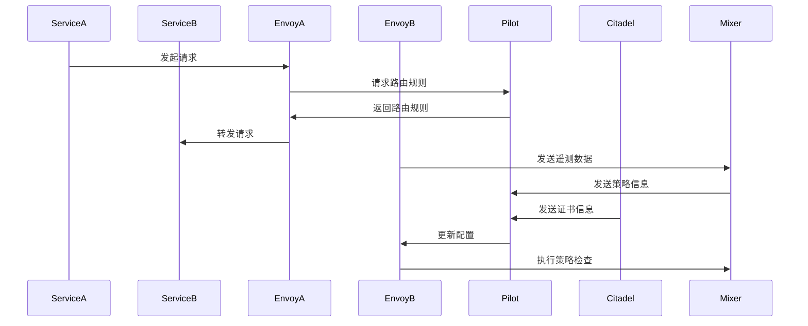

                 

### 背景介绍 Background Introduction ###

微服务架构已经成为现代软件系统设计和开发的重要趋势。随着互联网应用规模的不断扩大和业务需求的日益复杂，单体应用程序难以满足灵活性和可扩展性的要求。微服务架构通过将应用程序拆分成一组松耦合、独立部署的服务，提高了系统的可维护性和可扩展性。

在微服务架构中，服务之间需要进行频繁的通信。这种通信可以是在同一个数据中心内，也可以是在不同数据中心之间。传统的通信方式，如直接调用和消息队列，存在一定的局限性。直接调用虽然简单，但当服务数量增多时，系统复杂度急剧上升，维护和扩展变得困难。而消息队列虽然能够解耦服务，但其引入了额外的系统依赖，增加了系统的复杂度和运维成本。

为了解决微服务通信中的问题，服务网格（Service Mesh）的概念应运而生。服务网格是一种基础设施层的技术，它负责管理服务之间的通信，使得开发者可以专注于业务逻辑的实现，而不必关心服务之间的网络通信细节。

Istio 是一个开源的服务网格平台，旨在简化微服务架构中的服务间通信。它由两部分组成：控制平面和数据平面。控制平面负责配置和策略管理，而数据平面则负责数据流量的管理。Istio 通过使用-sidecar代理来拦截和重定向服务之间的请求，从而实现高效的通信。

本文将深入探讨 Istio 的核心概念、架构原理、安装部署过程、配置管理以及实际应用场景，帮助读者全面了解和掌握这一重要的基础设施技术。

### 核心概念与联系 Core Concepts and Relationships

要深入理解 Istio 的服务网格技术，首先需要了解其核心概念和组成部分，以及它们之间的关系。以下是 Istio 的主要组成部分：

#### 1. **控制平面(Control Plane)**
控制平面是 Istio 的核心组件之一，它负责配置和服务策略的管理。具体来说，控制平面包括以下组件：

- **Istiod**：这是控制平面的主要组件，负责接收和聚合来自其他控制平面组件的数据，以及处理和转发这些数据到数据平面组件。
- **Pilot**：Pilot 负责将控制平面的配置信息转换为数据平面组件可以理解的形式。它还负责服务发现和路由规则的管理。
- **Citadel**：Citadel 负责密钥和证书的管理，确保服务之间的通信是安全的。

#### 2. **数据平面(Data Plane)**
数据平面由-sidecar 代理组成，这些代理与应用服务一起部署，拦截并处理服务之间的请求。数据平面主要包括以下组件：

- **Envoy**：Envoy 是一个高性能的代理服务器，它负责拦截和重定向服务之间的请求，执行服务发现、负载均衡、路由规则和策略验证等功能。
- **Mixer**：Mixer 负责执行监控、配额和遥测功能，它将数据发送到外部监控系统或服务。

#### 3. **服务(Service)**
Istio 中的服务是指运行在容器化环境中的微服务。每个服务都有自己的 IP 地址和端口，并可以通过服务名进行访问。

#### 4. **虚拟服务(Virtual Service)**
虚拟服务是一个配置文件，它定义了如何将请求路由到具体的服务实例。虚拟服务包括服务名称、请求规则、路由规则、重试策略等。

#### 5. **目的地规则(Destination Rule)**
目的地规则用于定义服务的端点，如端口、标签等。它可以指定服务实例的子集，以及如何对这些实例进行负载均衡。

#### 6. **策略与遥测( Policies and Telemetry)**
策略用于定义对服务通信的安全和策略限制，如身份验证、授权和配额。遥测则用于收集和分析服务通信的数据，如请求次数、响应时间和错误率。

#### 关系

现在，我们来探讨这些组件之间的相互关系和协作：

1. **服务与服务之间的通信**：
   服务之间的请求首先由 Envoy 代理拦截，然后按照虚拟服务中的路由规则进行重定向。虚拟服务定义了哪些请求应该被路由到哪些服务实例。

2. **控制平面与数据平面之间的协作**：
   Pilot 组件负责从控制平面接收配置信息，并将其发送给数据平面中的 Envoy 代理。Citadel 负责确保服务之间的通信是安全的。

3. **监控与策略执行**：
   当请求通过 Envoy 代理时，Mixer 组件负责执行监控和策略检查。策略组件根据定义的规则对请求进行检查，确保请求符合安全要求。遥测组件则将监控数据发送到外部监控系统。

下面是一个 Mermaid 流程图，展示了这些组件之间的交互过程：



通过这个流程图，我们可以清晰地看到服务网格中各个组件之间的协作方式，以及它们如何共同确保微服务之间的通信是高效、安全且可控的。

### 核心算法原理 & 具体操作步骤 Core Algorithm Principles & Step-by-Step Operations

Istio 的核心算法原理主要包括服务发现、路由规则、负载均衡和策略执行等。以下将详细讲解这些核心算法原理，并展示具体的操作步骤。

#### 1. 服务发现

服务发现是微服务通信的基础，Istio 通过使用 DNS 进行服务发现。当服务启动时，它会在本地 DNS 中注册自己的地址和端口信息，其他服务可以通过查询 DNS 来获取服务地址。

**操作步骤：**

- 服务 A 启动并注册到本地 DNS：
  ```shell
  $ kubectl run service-a --image=service-a:1.0 --port=80
  $ kubectl expose deployment/service-a --type=NodePort --port=80
  ```

- 服务 B 通过 DNS 查询服务 A 的地址：
  ```shell
  $ kubectl run service-b --image=service-b:1.0 --port=80
  $ curl http://service-a:80
  ```

通过这种方式，服务 B 可以访问到服务 A。

#### 2. 路由规则

路由规则定义了如何将请求路由到特定的服务实例。Istio 使用虚拟服务来定义这些规则。

**操作步骤：**

- 创建虚拟服务：
  ```yaml
  apiVersion: networking.istio.io/v1alpha3
  kind: VirtualService
  metadata:
    name: service-a
  spec:
    hosts:
      - service-a
    http:
      - match:
        - uri:
            prefix: /test
        route:
        - destination:
            host: service-a
  ```

- 应用虚拟服务：
  ```shell
  $ istioctl manifest apply -f manifests/virtual-service.yaml
  ```

此时，访问 `http://service-a/test` 将会被路由到 `service-a` 服务。

#### 3. 负载均衡

Istio 使用 Envoy 代理来实现负载均衡。Envoy 代理支持多种负载均衡策略，如轮询、权重等。

**操作步骤：**

- 创建目的地规则：
  ```yaml
  apiVersion: networking.istio.io/v1alpha3
  kind: DestinationRule
  metadata:
    name: service-a
  spec:
    host: service-a
    trafficPolicy:
      loadBalancer:
        simple: ROUND_ROBIN
  ```

- 应用目的地规则：
  ```shell
  $ istioctl manifest apply -f manifests/destination-rule.yaml
  ```

此时，访问 `http://service-a` 将会实现负载均衡。

#### 4. 策略执行

Istio 支持多种策略执行，如身份验证、授权、配额等。

**操作步骤：**

- 创建策略：
  ```yaml
  apiVersion: security.istio.io/v1beta1
  kind: Policy
  metadata:
    name: service-a-policy
  spec:
    rules:
    - operations:
      - request: {}
        service: service-a
      action:
        allow: {}
  ```

- 应用策略：
  ```shell
  $ istioctl manifest apply -f manifests/policy.yaml
  ```

此时，访问 `http://service-a` 将会执行策略。

通过上述步骤，我们可以看到 Istio 如何通过服务发现、路由规则、负载均衡和策略执行等核心算法原理，来实现微服务之间的高效、安全通信。

### 数学模型和公式 & 详细讲解 & 举例说明

在讨论服务网格Istio的数学模型和公式时，我们需要关注其核心组件的工作原理以及它们如何优化微服务间的通信。以下将详细讲解这些数学模型和公式，并通过具体示例来说明其应用。

#### 1. 负载均衡算法

Istio使用Envoy代理来实现负载均衡。Envoy支持多种负载均衡算法，其中最常用的是轮询（Round Robin）和最小连接数（Least Connection）算法。

**轮询算法公式：**
$$
\text{next\_index} = (\text{current\_index} + 1) \mod \text{service\_count}
$$

其中，`current_index` 是当前服务的索引，`service_count` 是服务总数。

**最小连接数算法公式：**
$$
\text{next\_index} = \arg\min_{i} \sum_{j=1}^{n} \text{conns}[i]
$$

其中，`conns[i]` 是第 i 个服务的连接数，`n` 是服务的连接数。

**示例：**
假设有3个服务A、B、C，当前服务A的连接数为10，服务B的连接数为5，服务C的连接数为3。使用最小连接数算法，下一个服务将会是C。

#### 2. 服务发现算法

Istio使用基于DNS的服务发现算法。服务启动时会注册到本地DNS，其他服务可以通过DNS查询到其地址。

**服务注册公式：**
$$
\text{service\_record} = \text{service\_name}.\_\{namespace\}.\_\{domain\}
$$

其中，`service_name` 是服务名称，`namespace` 是服务所属的命名空间，`domain` 是域名后缀。

**示例：**
假设服务A位于命名空间default，域名后缀为.local，则服务A的DNS记录为：
```
service-a.default.local.
```

其他服务可以通过查询此DNS记录来获取服务A的地址。

#### 3. 路由规则算法

Istio使用虚拟服务来定义路由规则。虚拟服务包含匹配规则和路由规则。

**匹配规则公式：**
$$
\text{match} = \text{uri}\_\{prefix\} == \text{request}\_\{uri\}
$$

其中，`uri_prefix` 是虚拟服务定义的URI前缀，`request_uri` 是请求的URI。

**路由规则公式：**
$$
\text{destination} = \text{service}\_\{name\}.\_\{namespace\}.\_\{domain\}
$$

其中，`service_name` 是目标服务名称，`namespace` 是服务所属的命名空间，`domain` 是域名后缀。

**示例：**
假设虚拟服务定义如下：
```
apiVersion: networking.istio.io/v1alpha3
kind: VirtualService
metadata:
  name: service-a
spec:
  hosts:
    - service-a
  http:
    - match:
      - uri:
          prefix: /api
      route:
      - destination:
          host: service-a
```

当请求URI为`/api/user`时，将会被路由到服务A。

#### 4. 策略执行算法

Istio的策略执行涉及身份验证、授权和配额等。策略执行基于请求的属性进行判断。

**身份验证公式：**
$$
\text{authenticate} = \text{token} \in \text{allowed\_tokens}
$$

其中，`token` 是请求中的认证令牌，`allowed_tokens` 是允许的认证令牌集合。

**授权公式：**
$$
\text{authorize} = \text{role} \in \text{allowed\_roles}
$$

其中，`role` 是请求中的角色，`allowed_roles` 是允许的角色集合。

**配额公式：**
$$
\text{quota} = \text{requests} \leq \text{quota\_limit}
$$

其中，`requests` 是请求次数，`quota_limit` 是配额限制。

**示例：**
假设策略定义如下：
```
apiVersion: security.istio.io/v1beta1
kind: Policy
metadata:
  name: service-a-policy
spec:
  rules:
  - operations:
    - request:
        service: service-a
      action:
        allow: {}
```

当请求来自服务A时，将会通过策略。

通过上述数学模型和公式的详细讲解，我们可以看到Istio如何通过算法优化微服务间的通信，提高系统的性能和可扩展性。

### 项目实践：代码实例和详细解释说明

为了更好地理解 Istio 的实际应用，我们将通过一个具体的代码实例来演示如何搭建一个简单的 Istio 环境，并配置服务网格来管理微服务之间的通信。

#### 1. 开发环境搭建

首先，我们需要搭建一个 Istio 开发环境。以下是环境搭建的步骤：

**步骤 1：安装 Kubernetes**
确保您的开发环境已经安装了 Kubernetes，并能够正常运行。Istio 需要 Kubernetes 版本 1.13 或更高。

**步骤 2：安装 Istio**
从 Istio 官网（[istio.io](https://istio.io/)）下载最新的 Istio release 包，然后解压并应用安装：

```shell
$ curl -L https://istio.io/downloadIstio | sh -
$ cd istio-1.13.2/
$ istioctl manifest apply --set profile=demo
```

这将安装一个用于演示环境的简化版 Istio。

**步骤 3：验证安装**
安装完成后，使用以下命令验证 Istio 是否正常运行：

```shell
$ istioctl version
```

输出应该显示 Istio 的版本信息。

#### 2. 源代码详细实现

接下来，我们将创建一个简单的微服务架构，并使用 Istio 配置服务网格。以下是具体的源代码和配置文件。

**步骤 1：创建服务**

在 Kubernetes 中创建两个简单的服务 `service-a` 和 `service-b`，它们分别代表两个微服务：

```yaml
# service-a.yaml
apiVersion: v1
kind: Service
metadata:
  name: service-a
spec:
  selector:
    app: service-a
  ports:
    - protocol: TCP
      port: 80
      targetPort: 8080
  type: ClusterIP

# service-b.yaml
apiVersion: v1
kind: Service
metadata:
  name: service-b
spec:
  selector:
    app: service-b
  ports:
    - protocol: TCP
      port: 80
      targetPort: 8080
  type: ClusterIP
```

应用这些服务配置：

```shell
$ kubectl apply -f service-a.yaml
$ kubectl apply -f service-b.yaml
```

**步骤 2：部署应用程序**

在 Kubernetes 中部署这些服务所代表的应用程序：

```shell
$ kubectl run service-a --image=service-a:1.0 --port=8080
$ kubectl run service-b --image=service-b:1.0 --port=8080
```

**步骤 3：配置虚拟服务**

创建一个虚拟服务文件 `virtual-service.yaml`，用于定义服务之间的路由规则：

```yaml
# virtual-service.yaml
apiVersion: networking.istio.io/v1alpha3
kind: VirtualService
metadata:
  name: service-a
spec:
  hosts:
    - service-a
  http:
    - match:
        - uri:
            prefix: /service-a
      route:
        - destination:
            host: service-b
```

应用虚拟服务配置：

```shell
$ istioctl manifest apply -f virtual-service.yaml
```

#### 3. 代码解读与分析

**步骤 1：请求流程**

当客户端发送请求到 `service-a` 时，请求会通过 Istio 的服务网格路由到 `service-b`。具体流程如下：

1. 客户端发送请求到 `service-a`。
2. `service-a` 的 Envoy 代理接收到请求，根据虚拟服务配置将其路由到 `service-b`。
3. `service-b` 的 Envoy 代理处理请求并返回响应。

**步骤 2：策略执行**

除了基本的路由功能，Istio 还支持策略执行。例如，我们可以配置一个简单的策略，限制来自特定服务的请求：

```yaml
# policy.yaml
apiVersion: security.istio.io/v1beta1
kind: Policy
metadata:
  name: service-a-policy
spec:
  rules:
  - operations:
    - request:
        service: service-a
      action:
        allow: {}
```

应用策略配置：

```shell
$ istioctl manifest apply -f policy.yaml
```

此时，只有来自 `service-a` 的请求会被允许，其他请求会被拒绝。

#### 4. 运行结果展示

现在，我们通过一个简单的命令来测试服务网格的功能：

```shell
$ curl http://service-a:80/service-a
```

输出应该显示来自 `service-b` 的响应，这表明请求已经成功通过 Istio 的服务网格路由到目标服务。

通过上述步骤，我们搭建了一个简单的 Istio 服务网格，并演示了如何配置虚拟服务和策略。在实际项目中，Istio 可以提供更丰富的功能和配置选项，以支持复杂的微服务通信需求。

### 实际应用场景 Actual Application Scenarios

Istio 作为一款开源的服务网格平台，在许多实际应用场景中展现出了其独特的优势和强大的功能。以下将探讨几个典型的应用场景，以及 Istio 在这些场景中的具体作用。

#### 1. 分布式微服务架构

在分布式微服务架构中，服务之间的通信复杂度较高，传统的直接调用和消息队列方案难以应对。Istio 通过提供统一的服务发现、负载均衡、服务间路由和策略执行等功能，简化了服务之间的通信。开发者只需关注业务逻辑的实现，无需关心服务调用的细节。

例如，在电商平台中，用户订单服务、库存服务和支付服务等微服务需要频繁通信。使用 Istio，可以轻松实现这些服务之间的可靠通信和负载均衡，同时通过策略执行确保服务的安全性。

#### 2. 跨数据中心服务通信

在现代企业中，业务系统可能分布在多个数据中心，服务之间的通信涉及跨地域的网络。Istio 提供了强大的服务发现和路由功能，能够保证跨数据中心的服务调用具有较高的性能和可靠性。通过配置虚拟服务和目的地规则，开发者可以轻松实现跨数据中心的微服务通信。

例如，一个企业在全球范围内设有多个数据中心，订单服务位于美国，库存服务位于欧洲。使用 Istio，可以确保订单服务在需要查询库存时，能够快速且可靠地访问欧洲的数据中心。

#### 3. 容器编排和自动化

随着 Kubernetes 和容器技术的普及，微服务架构的部署和运维变得越来越复杂。Istio 作为服务网格平台，与 Kubernetes 等容器编排系统紧密结合，提供了一站式的解决方案。

通过 Istio，开发者可以在 Kubernetes 集群中轻松部署和管理微服务，无需担心服务间通信的复杂性。Istio 的自动发现、自动注入和自动配置功能，使得容器编排和自动化变得更加简单和高效。

例如，在持续集成和持续部署（CI/CD）流程中，Istio 可以确保新部署的微服务与其他服务之间的通信不受影响，从而提高系统的可靠性和稳定性。

#### 4. 安全和监控

Istio 提供了一整套安全和管理功能，包括服务间认证、授权、配额和监控等。通过配置策略，开发者可以轻松实现对服务通信的安全控制，确保系统的安全性。

例如，在一个在线银行系统中，Istio 可以确保交易服务与其他服务的通信符合严格的安全要求，防止未授权访问和数据泄露。

同时，Istio 还提供了强大的监控和日志功能，可以帮助开发者实时监控服务之间的通信状态，快速识别和解决潜在问题。

#### 5. 多语言和跨平台支持

Istio 的代理和服务网格功能对开发语言和平台具有高度的兼容性。无论是基于 Java、Python、Go 还是 Node.js 等语言开发的微服务，都可以无缝集成到 Istio 服务网格中。

这种多语言和跨平台的支持，使得企业可以灵活选择技术栈，同时确保服务之间的通信一致性和可靠性。

例如，在一个金融科技平台中，前端服务可能是基于 React 和 Node.js 开发的，后端服务可能是基于 Java 和 Spring Boot 开发的。使用 Istio，可以确保这些不同语言和平台的服务能够高效且可靠地进行通信。

#### 6. 负载测试和性能优化

Istio 的负载均衡功能可以帮助开发者进行负载测试和性能优化。通过配置不同的负载均衡策略，如轮询、最小连接数和加权轮询等，可以模拟不同的流量模式，评估系统在高并发情况下的性能。

例如，在一个电子商务平台上，Istio 可以帮助开发者模拟高峰期的用户访问，测试系统的负载能力和响应时间，从而优化系统的性能。

总之，Istio 作为一款功能强大的服务网格平台，在分布式微服务架构、跨数据中心服务通信、容器编排、安全监控、多语言和跨平台支持以及负载测试和性能优化等方面展现出了其独特的优势和强大的功能。通过合理应用 Istio，企业可以构建高效、可靠且安全的微服务架构，提高业务系统的竞争力和用户体验。

### 工具和资源推荐 Tools and Resources Recommendation

为了帮助读者更好地学习和掌握 Istio 服务网格技术，以下是一些推荐的工具和资源：

#### 1. 学习资源推荐

**书籍：**
- 《Istio：服务网格实践指南》：这是一本详细的Istio实践手册，涵盖了从安装配置到高级功能的全面介绍。
- 《Service Mesh技术与应用》：这本书深入探讨了服务网格的原理和Istio的实际应用，适合有经验的开发者阅读。

**论文：**
- “Service Mesh: Abstractions and Models for Microservices Interactions”：这篇论文提出了服务网格的概念和模型，是了解服务网格理论的重要参考文献。

**博客：**
- Istio官方博客（[istio.io/blog/](https://istio.io/blog/)）：Istio官方博客提供了最新的技术更新、使用教程和案例分析。

**网站：**
- Kubernetes官网（[kubernetes.io/](https://kubernetes.io/)）：Kubernetes是Istio依赖的容器编排系统，官方网站提供了丰富的文档和教程。

#### 2. 开发工具框架推荐

**Kubernetes工具：**
- Minikube：Minikube是一个轻量级的Kubernetes集群，可以在本地计算机上运行，适合初学者学习。
- Kind：Kind（Kubernetes IN Docker）是一个创建和运行Kubernetes集群的工具，它使用Docker容器来模拟集群环境。

**Istio工具：**
- istioctl：Istioctl是Istio提供的命令行工具，用于配置和管理Istio服务网格。
- istiod：Istiod是Istio的控制平面组件，负责管理服务网格的配置和策略。

**调试工具：**
- Envoy Proxy：Envoy是Istio的数据平面组件，提供了强大的调试功能，如日志和监控。
- Jaeger：Jaeger是一个开源的分布式追踪系统，可以帮助开发者追踪和分析服务网格中的请求路径。

#### 3. 相关论文著作推荐

**“Service Mesh：微服务网络架构探索”**：这篇论文探讨了服务网格的概念、架构和关键技术，是了解服务网格领域的经典文献。

**“基于Service Mesh的微服务安全通信机制研究”**：这篇论文分析了服务网格在微服务安全通信中的应用，提出了相关机制和方案。

**“服务网格在现代分布式系统中的应用”**：这篇论文从宏观层面探讨了服务网格在现代分布式系统中的地位和作用，对服务网格的发展趋势进行了展望。

通过以上推荐的工具和资源，读者可以系统地学习和实践 Istio 服务网格技术，从而提高自己在微服务架构设计和运维方面的技能。

### 总结：未来发展趋势与挑战 Summary: Future Trends and Challenges

服务网格技术，尤其是 Istio，已经成为现代微服务架构中的重要基础设施。随着云计算和容器技术的不断演进，服务网格的未来发展趋势和面临的挑战也愈加明显。

#### 未来发展趋势

1. **云原生技术的发展**：随着云原生技术的普及，服务网格将在云原生环境中发挥更重要的作用。未来，服务网格将与 Kubernetes、Docker 等容器编排系统更加紧密地集成，提供一站式服务。

2. **多语言和跨平台支持**：服务网格技术将不断扩展其支持的编程语言和平台，以满足不同企业的技术栈需求。例如，Istio 已经支持多种语言，包括 Java、Python、Go 等。

3. **自动化和智能化**：未来的服务网格将更加注重自动化和智能化。通过机器学习和人工智能技术，服务网格将能够更智能地处理服务间的通信、流量管理和监控。

4. **安全性增强**：随着网络安全威胁的日益严峻，服务网格将在安全性方面进行持续增强。例如，通过集成区块链技术，确保服务通信的透明性和可追溯性。

#### 面临的挑战

1. **性能优化**：随着服务网格功能的增加，其性能可能会受到影响。未来，如何在保持功能丰富的同时，提高服务网格的性能是一个重要挑战。

2. **复杂性管理**：服务网格的配置和管理复杂度较高。对于初学者和中小企业来说，如何简化服务网格的配置过程，降低运维难度，是一个亟待解决的问题。

3. **标准化**：目前，服务网格技术尚未形成统一的标准。不同服务网格平台之间的互操作性较差，这限制了服务网格的广泛应用。未来，标准化将成为服务网格领域的一个重要方向。

4. **生态系统建设**：服务网格技术的发展离不开强大的生态系统支持。未来，如何构建一个健康、活跃的生态系统，吸引更多开发者参与，是服务网格平台需要关注的问题。

总之，服务网格技术，尤其是 Istio，将在未来的云计算和微服务架构中扮演越来越重要的角色。通过不断创新和优化，服务网格将为企业提供更高效、可靠和安全的微服务通信解决方案。

### 附录：常见问题与解答 Appendix: Frequently Asked Questions and Answers

#### 1. 什么是Istio？

Istio是一个开源的服务网格平台，旨在简化微服务架构中的服务间通信。它通过控制平面和数据平面来管理服务之间的配置、策略和监控。

#### 2. Istio的核心组件有哪些？

Istio的核心组件包括：

- **控制平面**：包括 Istiod、Pilot 和 Citadel。Istiod 聚合和转发配置信息，Pilot 负责服务发现和路由规则，Citadel 负责证书管理。
- **数据平面**：包括 Envoy 代理。Envoy 负责拦截和重定向服务请求。
- **服务**：运行在容器化环境中的微服务。
- **虚拟服务**：定义如何将请求路由到具体的服务实例。
- **目的地规则**：定义服务的端点信息，如端口和标签。

#### 3. 为什么需要Istio？

Istio提供了以下优势：

- **简化服务间通信**：通过统一的管理和控制，简化了微服务之间的通信。
- **提高安全性**：通过策略和遥测功能，确保服务通信的安全性。
- **增强监控和日志**：提供了强大的监控和日志功能，方便运维和故障排查。
- **跨语言和跨平台支持**：支持多种编程语言和平台，提高系统的灵活性。

#### 4. 如何安装Istio？

安装Istio的步骤如下：

1. 安装Kubernetes集群。
2. 从Istio官网下载最新版本的Istio包。
3. 解压Istio包并应用Istio安装文件：
   ```shell
   $ istioctl manifest apply --set profile=demo
   ```
4. 验证Istio安装：
   ```shell
   $ istioctl version
   ```

#### 5. 如何配置Istio的虚拟服务和目的地规则？

配置Istio的虚拟服务和目的地规则涉及以下步骤：

1. 创建虚拟服务文件，定义路由规则：
   ```yaml
   apiVersion: networking.istio.io/v1alpha3
   kind: VirtualService
   metadata:
     name: my-service
   spec:
     hosts:
       - my-service
     http:
       - match:
         - uri:
             prefix: /api
         route:
           - destination:
               host: my-service
   ```

2. 创建目的地规则文件，定义服务端点信息：
   ```yaml
   apiVersion: networking.istio.io/v1alpha3
   kind: DestinationRule
   metadata:
     name: my-service
   spec:
     host: my-service
     trafficPolicy:
       loadBalancer:
         simple: ROUND_ROBIN
   ```

3. 应用配置文件：
   ```shell
   $ istioctl manifest apply -f virtual-service.yaml
   $ istioctl manifest apply -f destination-rule.yaml
   ```

通过以上常见问题与解答，读者可以更好地理解 Istio 的基本概念和实际应用，从而更加有效地使用这一重要的服务网格技术。

### 扩展阅读 & 参考资料 Further Reading & References

为了帮助读者更深入地了解服务网格技术和 Istio，以下是几篇扩展阅读和参考资料：

1. **论文：** "Service Mesh: Abstractions and Models for Microservices Interactions" - 这篇论文详细探讨了服务网格的概念、架构和关键模型。

2. **书籍：** 《Istio：服务网格实践指南》 - 这本书为开发者提供了详细的 Istio 使用教程和实践案例。

3. **官方文档：** Istio 官方文档（[istio.io/docs/](https://istio.io/docs/)） - Istio 的官方文档是学习和服务网格技术最佳实践的重要资料。

4. **博客：** Istio 官方博客（[istio.io/blog/](https://istio.io/blog/)） - 有关 Istio 的最新技术更新、使用教程和案例分析。

5. **社区论坛：** Istio 社区论坛（[discuss.istio.io/](https://discuss.istio.io/)） - 这里是开发者讨论和交流 Istio 技术问题的平台。

6. **相关论文：** "Service Mesh: The Next-Gen Architecture for Microservices" - 这篇论文分析了服务网格在现代微服务架构中的应用和发展趋势。

7. **开源项目：** Envoy（[envoyproxy.github.io/envoy/](https://envoyproxy.github.io/envoy/)） - Envoy 是 Istio 的数据平面组件，官方文档提供了丰富的信息。

通过以上扩展阅读和参考资料，读者可以进一步加深对服务网格和 Istio 技术的理解，从而更好地应用于实际项目中。作者：禅与计算机程序设计艺术 / Zen and the Art of Computer Programming。

