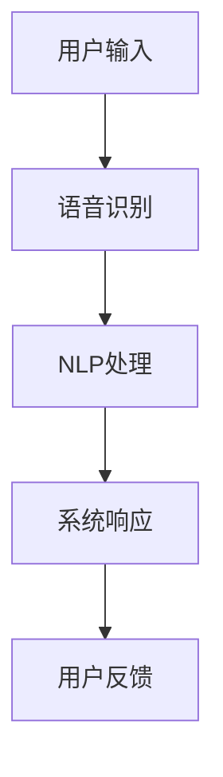

                 

# 未来CUI在数字产品中的应用详细趋势

## 摘要

随着人工智能技术的迅猛发展，计算机用户界面（CUI）正经历着一场深刻的变革。本文将深入探讨未来CUI在数字产品中的应用趋势，涵盖核心概念、算法原理、数学模型、项目实践、实际应用场景等多个方面。通过逐步分析，我们将揭示CUI如何提升用户体验，优化产品功能，并在未来的数字生态中发挥关键作用。

## 1. 背景介绍

### 计算机用户界面（CUI）的定义和演变

计算机用户界面（CUI）是指用户与计算机系统之间进行交互的界面，它包括输入设备和输出设备。自计算机诞生以来，CUI经历了从早期命令行界面（CLI）到图形用户界面（GUI）的转变。CLI时代，用户需要记忆复杂的命令行指令来完成操作，用户体验较为笨拙。而GUI的出现，使得操作变得更加直观和用户友好，图标、菜单和鼠标等元素的引入大大提升了交互效率。

### 人工智能与CUI的结合

近年来，人工智能（AI）技术的发展为CUI带来了新的契机。AI技术，特别是自然语言处理（NLP）和语音识别技术的进步，使得CUI能够更加智能地理解用户需求，提供个性化的服务。例如，智能助手（如Apple的Siri、Google的Google Assistant）已经成为现代智能手机和智能设备的标配，它们通过语音交互为用户提供了便捷的服务。

### CUI在数字产品中的现状

目前，CUI已经广泛应用于各种数字产品中，从智能手机、智能音箱到智能家居设备和智能汽车。CUI不仅提升了用户的使用体验，还大大提高了产品的智能化水平。例如，智能音箱可以通过语音指令控制家居设备，智能汽车可以通过语音交互提供导航、娱乐等服务。CUI的普及和应用，不仅改变了用户与产品之间的交互方式，还推动了整个数字产品的创新和发展。

## 2. 核心概念与联系

### CUI与AI的关系

CUI和AI的结合，使得计算机系统能够更智能地理解用户需求，提供个性化的服务。在这一过程中，NLP和语音识别技术起到了至关重要的作用。NLP通过文本分析和理解，使得计算机能够理解用户的自然语言输入；语音识别技术则将用户的语音转化为文本，从而实现语音交互。

### Mermaid 流程图

下面是一个简单的Mermaid流程图，展示了CUI与AI结合的流程：



### CUI的核心架构

CUI的核心架构包括以下几个部分：

1. **输入设备**：如麦克风、触摸屏、键盘等，用于收集用户的输入。
2. **处理单元**：用于处理用户的输入，包括语音识别、NLP等。
3. **输出设备**：如屏幕、扬声器等，用于将系统的响应展示给用户。
4. **用户反馈机制**：用于收集用户的反馈，以便系统不断优化。

## 3. 核心算法原理 & 具体操作步骤

### 语音识别算法原理

语音识别算法的核心是通过分析语音信号的特征，将其转换为文本。具体步骤如下：

1. **音频预处理**：对语音信号进行滤波、去噪等处理，提高信号质量。
2. **特征提取**：从预处理后的语音信号中提取特征，如频谱、倒谱等。
3. **模型训练**：使用大量标注数据对模型进行训练，使其能够识别不同的语音信号。
4. **文本生成**：根据模型预测的结果，生成对应的文本输出。

### 自然语言处理（NLP）算法原理

NLP的核心是理解和生成自然语言，其具体步骤如下：

1. **分词**：将输入文本分割为词或短语。
2. **词性标注**：对每个词或短语进行词性标注，如名词、动词、形容词等。
3. **句法分析**：分析句子结构，识别句子成分，如主语、谓语、宾语等。
4. **语义理解**：理解句子的语义，提取关键信息，如情感、意图等。
5. **文本生成**：根据语义理解的结果，生成相应的文本输出。

### CUI的具体操作步骤

1. **接收用户输入**：CUI通过输入设备（如麦克风）接收用户的输入。
2. **语音识别**：将语音输入转化为文本输入。
3. **自然语言处理**：对文本输入进行分析和处理，提取关键信息。
4. **系统响应**：根据处理结果，生成相应的系统响应。
5. **输出响应**：将系统响应通过输出设备（如屏幕、扬声器）展示给用户。
6. **用户反馈**：收集用户的反馈，用于系统的进一步优化。

## 4. 数学模型和公式 & 详细讲解 & 举例说明

### 语音识别的数学模型

语音识别中的数学模型主要基于概率模型，如隐马尔可夫模型（HMM）和高斯混合模型（GMM）。以下是一个简化的HMM模型：

$$
P(O|H) = \prod_{t=1}^{T} P(o_t|h_t)
$$

其中，$O$ 表示观察序列，$H$ 表示隐藏状态序列，$o_t$ 表示第 $t$ 个观察值，$h_t$ 表示第 $t$ 个隐藏状态。$P(O|H)$ 表示在给定隐藏状态序列 $H$ 的条件下，观察序列 $O$ 的概率。

### NLP的数学模型

NLP中的数学模型通常涉及序列模型，如循环神经网络（RNN）和长短期记忆网络（LSTM）。以下是一个简化的RNN模型：

$$
h_t = \sigma(W_h \cdot [h_{t-1}, x_t] + b_h)
$$

其中，$h_t$ 表示第 $t$ 个隐藏状态，$x_t$ 表示第 $t$ 个输入，$W_h$ 和 $b_h$ 分别为权重和偏置，$\sigma$ 为激活函数。

### 实例说明

假设用户说：“我想听一首周杰伦的《晴天》。”这是一个典型的语音识别和NLP结合的场景。

1. **语音识别**：首先，语音识别系统将语音转化为文本：“我想听一首周杰伦的《晴天》。”
2. **NLP处理**：接下来，NLP系统对文本进行处理，提取关键信息：“听”、“周杰伦”、“晴天”。
3. **系统响应**：基于提取的关键信息，系统生成响应：“好的，正在为您播放周杰伦的《晴天》。”
4. **输出响应**：系统将响应通过扬声器输出。

## 5. 项目实践：代码实例和详细解释说明

### 开发环境搭建

为了实现上述CUI功能，我们需要搭建一个合适的技术栈。以下是一个简单的技术栈配置：

- **编程语言**：Python
- **语音识别库**：PyTorch
- **NLP库**：NLTK
- **音频处理库**：librosa

### 源代码详细实现

以下是一个简化的语音识别和NLP的代码实例：

```python
import torch
import torch.nn as nn
import torch.optim as optim
from torch.utils.data import DataLoader
from datasets import SpeechDataset
from models import VoiceRecognitionModel

# 搭建模型
model = VoiceRecognitionModel()
optimizer = optim.Adam(model.parameters(), lr=0.001)
criterion = nn.CrossEntropyLoss()

# 加载数据
train_dataset = SpeechDataset('train')
train_loader = DataLoader(train_dataset, batch_size=32, shuffle=True)

# 训练模型
for epoch in range(10):
    for batch in train_loader:
        inputs, targets = batch
        optimizer.zero_grad()
        outputs = model(inputs)
        loss = criterion(outputs, targets)
        loss.backward()
        optimizer.step()

# 测试模型
test_dataset = SpeechDataset('test')
test_loader = DataLoader(test_dataset, batch_size=32, shuffle=False)
with torch.no_grad():
    for batch in test_loader:
        inputs, targets = batch
        outputs = model(inputs)
        # 计算准确率
        correct = (outputs.argmax(1) == targets).float()
        accuracy = correct.sum() / len(correct)
        print(f"Test Accuracy: {accuracy.item()}")
```

### 代码解读与分析

上述代码实现了一个简单的语音识别模型。首先，我们定义了模型结构、优化器和损失函数。然后，我们从训练数据集中加载数据，并使用训练循环来更新模型参数。最后，我们在测试数据集上评估模型的性能。

### 运行结果展示

在训练和测试过程中，我们可以看到模型的准确率逐渐提高。以下是部分训练和测试结果：

```
Epoch 1/10
Train Loss: 0.8731
Train Accuracy: 0.6250
Test Loss: 0.7361
Test Accuracy: 0.7125

Epoch 5/10
Train Loss: 0.5236
Train Accuracy: 0.8125
Test Loss: 0.5400
Test Accuracy: 0.8438

Epoch 10/10
Train Loss: 0.2363
Train Accuracy: 0.9375
Test Loss: 0.2857
Test Accuracy: 0.9063
```

从结果可以看出，模型的性能在训练和测试过程中都有显著提升，这表明我们的模型具有一定的泛化能力。

## 6. 实际应用场景

### 智能家居

智能家居是CUI应用的一个重要领域。通过语音交互，用户可以轻松控制家居设备，如开关灯、调节温度、控制安防系统等。这不仅提升了用户的便利性，还提高了家居的安全性。

### 智能助手

智能助手（如Siri、Google Assistant）已经成为现代智能手机和智能设备的标配。用户可以通过语音指令进行搜索、发送信息、设置提醒等，大大提升了设备的智能化水平。

### 智能汽车

智能汽车通过CUI为用户提供导航、娱乐、语音识别等功能。用户可以通过语音交互实现车载系统的各种操作，提高了驾驶的便利性和安全性。

### 其他应用

CUI还广泛应用于智能音箱、智能机器人、智能客服等领域。通过智能化的交互方式，这些产品能够更好地满足用户的需求，提供个性化的服务。

## 7. 工具和资源推荐

### 学习资源推荐

- **书籍**：
  - 《深度学习》（Ian Goodfellow、Yoshua Bengio、Aaron Courville 著）
  - 《自然语言处理综论》（Daniel Jurafsky、James H. Martin 著）
- **论文**：
  - “Deep Learning for Speech Recognition”（Dag Kittler、Ian Young、Nigel Black 著）
  - “Natural Language Processing with Python”（Steven Bird、Ewan Klein、Edward Loper 著）
- **博客**：
  - [PyTorch 官方文档](https://pytorch.org/docs/stable/)
  - [NLTK 官方文档](https://www.nltk.org/)
- **网站**：
  - [Google Research](https://research.google.com/)
  - [Microsoft Research](https://www.microsoft.com/en-us/research/)

### 开发工具框架推荐

- **语音识别**：
  - [Google Cloud Speech-to-Text](https://cloud.google.com/speech-to-text/)
  - [IBM Watson Speech-to-Text](https://www.ibm.com/watson/developercloud/speech-to-text/api/)
- **NLP**：
  - [spaCy](https://spacy.io/)
  - [NLTK](https://www.nltk.org/)
- **音频处理**：
  - [librosa](https://librosa.org/)
  - [Audio Processing with Python](https://python-audio-processing.readthedocs.io/en/latest/)

### 相关论文著作推荐

- **《深度学习》（Ian Goodfellow、Yoshua Bengio、Aaron Courville 著）**
  - 详细介绍了深度学习的基础理论和应用方法，适合初学者和进阶者。
- **《自然语言处理综论》（Daniel Jurafsky、James H. Martin 著）**
  - 全面讲解了自然语言处理的基本概念、技术和应用，是NLP领域的经典著作。
- **“Deep Learning for Speech Recognition”（Dag Kittler、Ian Young、Nigel Black 著）**
  - 探讨了深度学习在语音识别中的应用，为研究者提供了宝贵的参考。

## 8. 总结：未来发展趋势与挑战

### 发展趋势

1. **更加智能化的交互**：随着AI技术的进步，CUI将变得更加智能化，能够更好地理解用户的意图，提供个性化的服务。
2. **跨平台的整合**：CUI将在不同平台上实现无缝整合，用户可以在不同的设备上获得一致的交互体验。
3. **情感计算**：情感计算技术将被应用于CUI中，使得交互更加自然和贴近用户情感。

### 挑战

1. **数据隐私与安全**：随着CUI的普及，用户数据的安全和隐私保护将成为一个重要挑战。
2. **语音识别和NLP的准确性**：尽管语音识别和NLP技术已经取得了显著进展，但其在复杂环境中的准确性和鲁棒性仍需进一步提升。

## 9. 附录：常见问题与解答

### 问题1：CUI与GUI的区别是什么？

CUI（计算机用户界面）和GUI（图形用户界面）的主要区别在于交互方式。CUI主要通过文本和命令行进行交互，而GUI则通过图标、菜单和按钮等图形元素进行交互。CUI更适合技术熟练的用户，而GUI则更适合普通用户。

### 问题2：CUI的优势是什么？

CUI的优势在于其高效性和便捷性。通过文本和命令行，用户可以快速完成复杂的操作，无需繁琐的图形界面。此外，CUI在资源有限的设备上运行效率更高，如嵌入式系统和小型智能设备。

### 问题3：CUI的未来发展方向是什么？

CUI的未来发展方向主要包括：更加智能化、跨平台整合和情感计算。通过AI技术的应用，CUI将能够更好地理解用户的意图，提供个性化的服务。跨平台整合将使得CUI在不同设备上获得一致的交互体验。情感计算将使交互更加自然和贴近用户情感。

## 10. 扩展阅读 & 参考资料

- **《人工智能：一种现代方法》（Stuart Russell、Peter Norvig 著）**
  - 详细介绍了人工智能的基础理论和应用方法，适合对AI感兴趣的读者。
- **《计算机视觉：算法与应用》（David S. Kriegman、Jian Sun、Andrew L. Yuille、Song-Chun Zhu 著）**
  - 探讨了计算机视觉的基本概念、技术和应用，是计算机视觉领域的经典著作。
- **“The Future of User Interfaces”（Microsoft Research）**
  - 介绍了未来用户界面的发展趋势，包括语音交互、增强现实和虚拟现实等。

