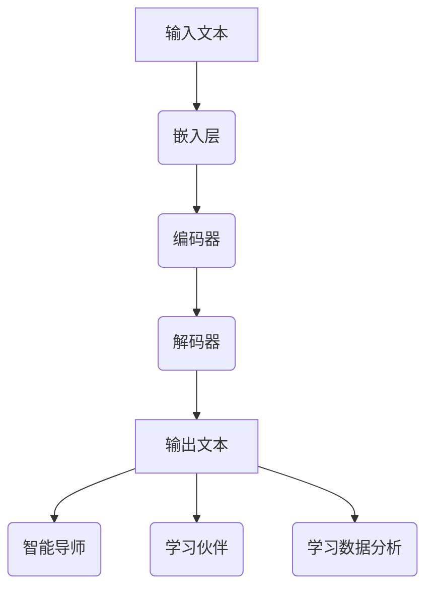

                 

### 文章标题

《未来的AI教育：LLM作为个性化导师和学习伙伴》

> 关键词：AI教育、大规模语言模型（LLM）、个性化学习、智能导师、计算机辅助教育、学习伙伴

> 摘要：本文探讨了未来AI教育的发展趋势，重点介绍了大规模语言模型（LLM）在个性化教育和学习伙伴中的作用。通过逐步分析LLM的工作原理、应用场景、技术挑战及其发展前景，本文为AI在教育领域的应用提供了深刻的见解和实用的建议。

---

## 1. 背景介绍

随着人工智能（AI）技术的迅猛发展，教育领域正面临着前所未有的变革。传统教育模式已经难以满足现代社会的需求，个性化学习、跨学科整合、实时反馈等新教学方式正逐渐成为主流。在这一背景下，AI作为辅助工具在教育中的应用逐渐受到关注。

AI在教育中的主要应用场景包括：

1. **智能辅导系统**：利用自然语言处理（NLP）和机器学习技术，AI可以为学生提供个性化的学习路径和实时反馈，帮助学生更好地理解和掌握知识。

2. **在线教育平台**：AI可以帮助教育平台实现个性化推荐、学习进度跟踪、智能评测等功能，从而提高教育质量和用户体验。

3. **智能测评系统**：AI可以通过分析学生的答题行为和结果，提供智能化的测评报告，帮助教师和学生了解学习效果，调整教学策略。

4. **教育资源管理**：AI可以帮助学校和教育机构更有效地管理教育资源，优化课程设置，提高教学效率。

大规模语言模型（LLM）作为AI技术的重要分支，具有强大的文本生成和理解能力，为AI在教育中的应用提供了新的可能性。LLM可以通过学习大量的文本数据，生成高质量的内容，进行自然语言理解和推理，实现智能对话和个性化教育。

## 2. 核心概念与联系

### 大规模语言模型（LLM）的工作原理

#### 2.1 语言模型的基本原理

语言模型是一种统计模型，它通过对大量文本数据的学习，预测下一个单词或单词组合的概率。LLM是基于深度学习的语言模型，通过神经网络架构来模拟人类语言处理的能力。

#### 2.2 LLM的架构

LLM通常由以下几个主要部分组成：

1. **嵌入层**：将输入的单词或句子转换为向量表示。
2. **编码器**：使用多层循环神经网络（RNN）或Transformer架构对输入向量进行编码。
3. **解码器**：根据编码器输出的隐藏状态生成输出文本。

#### 2.3 LLM的核心特性

1. **强大的生成能力**：LLM可以生成高质量的自然语言文本，包括文章、段落、句子等。
2. **灵活的上下文理解**：LLM可以理解输入文本的上下文，从而生成连贯且相关的输出。
3. **自适应学习能力**：LLM可以通过不断学习新的文本数据，持续提高其生成能力和理解能力。

### LLM在教育中的应用

#### 2.4 智能导师

LLM可以作为智能导师，为学生提供个性化的学习建议和指导。它可以根据学生的学习数据和兴趣，推荐合适的课程和学习资源，帮助学生高效地掌握知识。

#### 2.5 学习伙伴

LLM可以作为学习伙伴，与学生在学习中互动，提供实时反馈和指导。它可以模拟教师的角色，回答学生的问题，引导学生深入思考，激发学习兴趣。

#### 2.6 学习数据分析

LLM可以帮助教师分析学生的学习行为和效果，提供智能化的测评报告，帮助教师了解学生的学习情况，调整教学策略。

### 2.5 Mermaid 流程图

## 3. 核心算法原理 & 具体操作步骤

### 3.1 语言模型训练

#### 3.1.1 数据准备

首先，需要收集大量高质量的语言数据，如书籍、文章、新闻、社交媒体等。这些数据将被用于训练LLM。

#### 3.1.2 数据预处理

1. **分词**：将文本数据分割成单词或句子。
2. **清洗**：去除无关的标点符号、HTML标签等。
3. **编码**：将单词或句子转换为数字编码，以便模型处理。

#### 3.1.3 模型训练

1. **嵌入层训练**：将单词转换为嵌入向量。
2. **编码器训练**：使用多层循环神经网络或Transformer架构对输入向量进行编码。
3. **解码器训练**：根据编码器输出的隐藏状态生成输出文本。

#### 3.1.4 模型优化

通过不断迭代训练，优化模型的参数，提高生成文本的质量。

### 3.2 智能导师实现

#### 3.2.1 学生数据收集

收集学生的学

