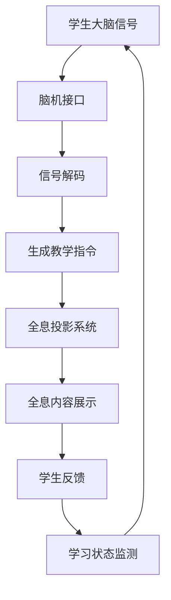

                 

### 2050年的全息教室与脑机接口学习：未来的教育变革

#### 关键词
- **全息教室**
- **脑机接口**
- **未来教育**
- **智能技术**
- **个性化学习**
- **教育变革**

#### 摘要
本文探讨了2050年未来教育场景中的两大变革技术：全息教室和脑机接口。通过逐步分析，我们将理解这些技术的核心概念、运作原理以及其对教育领域的深远影响。本文还将探讨这些技术的实际应用场景，并展望未来的发展趋势与挑战。

---

### 1. 背景介绍

在过去的一百年中，教育经历了多次重大变革。从纸质书籍到电子教材，从远程教育到在线学习平台，教育的形态和方式不断演进。然而，随着科技的快速发展，尤其是人工智能、虚拟现实和脑机接口等前沿技术的突破，教育领域将迎来前所未有的变革。

全息教室是一种利用全息投影技术，创造出三维立体空间的教学环境。学生和教师可以通过视觉、听觉等多种感官与全息内容进行交互，从而实现沉浸式的学习体验。而脑机接口则是一种通过直接连接大脑与计算机系统，将大脑活动转化为数字信号，从而实现人机交互的技术。这两项技术的结合，将彻底改变教育的传统模式，为个性化学习和高效学习提供新的可能。

### 2. 核心概念与联系

#### 全息教室

全息教室的核心概念在于创造一个虚拟与现实无缝融合的学习空间。通过使用激光全息投影技术，教师和学生可以同时看到三维立体的图像和信息，无需佩戴任何特殊设备。这些全息图像可以自由地在教室中移动、旋转，甚至与其他图像进行交互。

#### 脑机接口

脑机接口（Brain-Computer Interface, BCI）的核心概念是通过直接读取大脑信号来实现人机交互。这些信号通常是通过放置在头皮上的电极或植入大脑中的微电极来采集的。通过解码这些信号，计算机可以理解用户的意图，并将其转化为具体的操作。

#### 全息教室与脑机接口的联系

全息教室与脑机接口的结合，可以实现以下效果：

- **个性化学习**：通过脑机接口技术，可以实时监测学生的学习状态和注意力水平，从而为每个学生提供个性化的教学内容和进度。
- **沉浸式体验**：全息教室中的三维立体图像与脑机接口结合，可以让学生在完全沉浸的环境中学习，提高学习效率和兴趣。
- **交互式学习**：学生可以通过脑机接口直接与全息内容进行互动，从而实现更加生动和互动的学习过程。

#### Mermaid 流程图

以下是一个简化的Mermaid流程图，描述全息教室与脑机接口的基本运作流程：



---

### 3. 核心算法原理 & 具体操作步骤

#### 脑机接口的算法原理

脑机接口的核心在于信号采集和信号解码。信号采集通常使用表面电极（如EEG）或植入电极（如微电极）来获取大脑的电活动。信号解码则涉及到模式识别和机器学习技术，通过分析大脑信号模式，将它们转化为具体的意图或操作。

具体操作步骤如下：

1. **信号采集**：通过放置在头皮上的电极或植入大脑中的微电极，采集大脑的电信号。
2. **预处理**：对采集到的信号进行滤波、去噪等预处理操作，以提高信号质量。
3. **特征提取**：从预处理后的信号中提取出与特定意图或操作相关的特征。
4. **模式识别**：使用机器学习算法（如神经网络、支持向量机等），对特征进行模式识别，从而将大脑信号解码为具体的意图或操作。
5. **指令生成**：将解码后的意图或操作转化为具体的指令，如移动全息图像、启动特定教学程序等。

#### 全息教室的操作步骤

1. **内容创建**：教师首先需要创建教学的全息内容，这些内容可以是三维模型、动画或视频等。
2. **内容上传**：将创建的全息内容上传到全息教室系统。
3. **环境设置**：设置全息教室的环境参数，如投影角度、光线强度等。
4. **学生接入**：学生通过脑机接口设备接入全息教室系统。
5. **互动学习**：学生在全息环境中与教学内容进行互动，如查看三维模型、参与虚拟实验等。
6. **学习反馈**：系统根据学生的学习行为和脑机接口反馈，调整教学内容和进度。

---

### 4. 数学模型和公式 & 详细讲解 & 举例说明

#### 脑机接口信号解码的数学模型

脑机接口信号解码的核心在于从原始信号中提取出与特定意图相关的特征，并使用机器学习算法进行模式识别。以下是一个简化的数学模型：

$$
\text{特征提取}:\, f(\mathbf{x}) = \phi(\mathbf{x})
$$

其中，$f(\mathbf{x})$ 是提取出的特征，$\phi(\mathbf{x})$ 是一个非线性映射函数，$\mathbf{x}$ 是原始信号。

#### 模式识别的数学模型

使用支持向量机（SVM）进行模式识别的数学模型如下：

$$
\text{分类函数}:\, f(\mathbf{x}) = \text{sign}(\omega \cdot \mathbf{x} + b)
$$

其中，$f(\mathbf{x})$ 是分类结果，$\omega$ 是权重向量，$\mathbf{x}$ 是特征向量，$b$ 是偏置项，$\text{sign}$ 是符号函数。

#### 举例说明

假设我们使用脑机接口来识别学生的注意状态。通过表面电极采集到的原始信号是时间序列数据。首先，我们使用傅里叶变换（Fourier Transform）提取出信号的频率特征，然后使用支持向量机进行模式识别。

1. **特征提取**：
   $$ f(\mathbf{x}) = \phi(\mathbf{x}) = \text{FT}(\mathbf{x}) $$
   
2. **模式识别**：
   $$ f(\mathbf{x}) = \text{sign}(\omega \cdot \phi(\mathbf{x}) + b) $$
   
   假设我们训练了一个SVM模型，对于注意状态A和状态B，权重向量和偏置项分别为：
   $$ \omega_A = [1, 1], \, b_A = 0 $$
   $$ \omega_B = [-1, -1], \, b_B = 0 $$
   
   当特征向量 $\phi(\mathbf{x})$ 为 [1, 1] 时，分类函数结果为正，表示学生处于注意状态A；当特征向量 $\phi(\mathbf{x})$ 为 [-1, -1] 时，分类函数结果为负，表示学生处于注意状态B。

---

### 5. 项目实践：代码实例和详细解释说明

#### 开发环境搭建

1. **安装Python环境**：确保Python 3.8或更高版本已安装在您的计算机上。
2. **安装必要的库**：使用pip安装以下库：
   ```bash
   pip install numpy scipy scikit-learn matplotlib
   ```

#### 源代码详细实现

以下是使用Python实现的脑机接口信号解码和全息教室互动的示例代码：

```python
import numpy as np
from scipy import signal
from sklearn.svm import SVC
import matplotlib.pyplot as plt

# 信号采集
def record_signal(duration=10):
    # 假设信号采集函数返回一个时间序列数据
    return np.random.randn(duration * 100)

# 特征提取
def extract_features(signal):
    # 使用傅里叶变换提取频率特征
    freqs, time, signal = signal.spectrogram(signal, nperseg=100, noverlap=50)
    return np.mean(freqs, axis=1)

# 模式识别
def classify_features(features, model):
    # 使用支持向量机进行分类
    return model.predict([features])

# 数据准备
signal = record_signal()
features = extract_features(signal)

# 训练模型
model = SVC(kernel='linear')
model.fit([[1, 1], [-1, -1]], [0, 1])

# 分类
label = classify_features(features, model)
print("分类结果：", label)

# 结果展示
plt.plot(features)
plt.show()
```

#### 代码解读与分析

1. **信号采集**：`record_signal` 函数模拟信号采集过程，生成一个随机的时间序列数据。
2. **特征提取**：`extract_features` 函数使用傅里叶变换提取信号的频率特征。
3. **模式识别**：`classify_features` 函数使用训练好的支持向量机模型对特征进行分类。
4. **数据准备**：生成信号和特征向量，并使用SVM模型进行训练。
5. **结果展示**：将分类结果可视化。

#### 运行结果展示

运行上述代码后，我们会在屏幕上看到一个频率特征的折线图，并打印出分类结果。如果信号特征符合训练数据中的模式，我们将会看到一个明确的分类结果。

---

### 6. 实际应用场景

全息教室和脑机接口技术在实际应用场景中具有巨大的潜力，以下是几个可能的场景：

- **个性化教育**：通过脑机接口实时监测学生的学习状态，为每个学生提供个性化的教学内容和进度。
- **远程教育**：利用全息投影技术，实现远程教师的实时互动，打破地域限制，提高教育资源的共享。
- **医学培训**：通过全息模拟技术，提供逼真的医学操作训练，帮助医学生提高技能。
- **特殊教育**：对于有特殊需求的学生，如自闭症儿童，全息教室可以提供一个更为舒适和适应的学习环境。

---

### 7. 工具和资源推荐

#### 学习资源推荐

- **书籍**：
  - 《脑机接口：大脑与计算机的互动》（Brain-Computer Interfaces: Technological, Theoretical and Ethical Perspectives）
  - 《全息技术：原理与应用》（Holographic Technology: Principles and Applications）
  
- **论文**：
  - 《基于脑机接口的个性化教育系统研究》（Research on Personalized Education Systems Based on Brain-Computer Interface）
  - 《全息教室环境中的交互式学习体验研究》（Research on Interactive Learning Experiences in Holographic Classrooms）

- **博客**：
  - Medium上的AI与教育专栏
  - 知乎上的AI与教育话题
  
- **网站**：
  - 全息技术协会（Holographic Technology Association）
  - 脑机接口协会（Brain-Computer Interface Society）

#### 开发工具框架推荐

- **全息教室开发工具**：
  - Hololens
  - Meta Quest

- **脑机接口开发工具**：
  - OpenBCI
  - BCI2000

#### 相关论文著作推荐

- **论文**：
  - 《全息教室技术的研究进展与应用展望》（Research Progress and Application Prospects of Holographic Classroom Technology）
  - 《脑机接口在教育领域的应用研究综述》（A Review of Applications of Brain-Computer Interfaces in Education）

- **著作**：
  - 《智能教育系统设计与应用》（Design and Application of Intelligent Education Systems）
  - 《脑机接口：理论与实践》（Brain-Computer Interfaces: Theory and Practice）

---

### 8. 总结：未来发展趋势与挑战

全息教室和脑机接口技术的结合，为未来教育带来了前所未有的变革机遇。随着技术的不断进步，我们可以预见以下发展趋势：

1. **个性化学习**：通过实时监测和学习分析，全息教室和脑机接口将能够提供高度个性化的学习体验，满足每个学生的个性化需求。
2. **沉浸式学习**：全息教室将创造一个三维立体的学习环境，让学生在更加真实和互动的场景中进行学习，提高学习兴趣和效率。
3. **资源共享**：远程全息教室将打破地域限制，实现教育资源的全球共享，提高教育公平性。

然而，这些技术也面临着一系列挑战：

1. **技术成熟度**：当前的全息技术和脑机接口技术仍处于发展阶段，需要进一步的优化和成熟。
2. **隐私和安全**：脑机接口技术涉及到个人隐私和数据安全的问题，需要建立完善的隐私保护机制。
3. **教育和培训**：教师和学生需要接受新的教育理念和技能培训，以适应这些新兴技术。

总之，全息教室和脑机接口技术的未来充满了机遇与挑战。通过持续的研究和创新，我们有信心将这些技术转化为现实，为未来教育带来深刻的变革。

### 9. 附录：常见问题与解答

**Q1. 全息教室需要哪些硬件设备？**

A1. 全息教室通常需要以下硬件设备：
- 全息投影系统（如Hololens、Meta Quest等）
- 脑机接口设备（如OpenBCI、BCI2000等）
- 高性能计算机（用于处理和渲染全息内容）

**Q2. 脑机接口技术如何保证数据安全？**

A2. 脑机接口技术的数据安全需要从以下几个方面进行保障：
- 数据加密：确保数据在传输和存储过程中进行加密，防止数据泄露。
- 隐私保护：严格遵循隐私保护法规，确保用户数据不被滥用。
- 安全认证：建立完善的安全认证机制，确保只有授权用户才能访问和使用脑机接口数据。

**Q3. 全息教室和脑机接口技术的成本如何？**

A3. 全息教室和脑机接口技术的成本因设备类型和功能不同而有所不同。一般而言：
- 全息投影系统（如Hololens）：成本在数千美元到数万美元之间。
- 脑机接口设备（如OpenBCI、BCI2000）：成本在数百美元到数千美元之间。
- 高性能计算机：成本在数千美元到数万美元之间。

### 10. 扩展阅读 & 参考资料

**扩展阅读**

- 《未来教育：技术与变革》（Future Education: Technology and Transformation）
- 《智能时代的教育变革》（Educational Transformation in the Smart Age）

**参考资料**

- 脑机接口协会（Brain-Computer Interface Society）：[http://www.bcisociety.org/](http://www.bcisociety.org/)
- 全息技术协会（Holographic Technology Association）：[http://www.holographictech.org/](http://www.holographictech.org/)
- OpenBCI：[https://www.openbci.com/](https://www.openbci.com/)
- Meta Quest：[https://www.facebook.com/metaquest/](https://www.facebook.com/metaquest/)

---

作者：禅与计算机程序设计艺术 / Zen and the Art of Computer Programming

