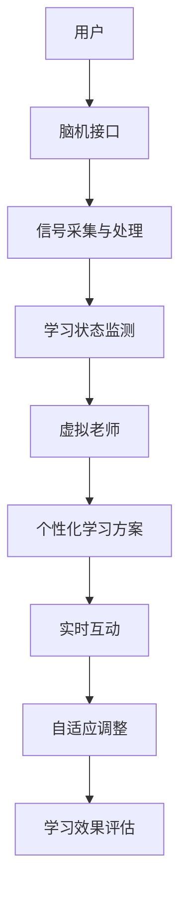

                 

### 1. 背景介绍

在21世纪的今天，教育已经逐渐从传统的课堂模式走向多元化、个性化和智能化的方向发展。人工智能（AI）技术的飞速发展，尤其是机器学习和深度学习技术的突破，为未来教育带来了前所未有的变革契机。在2023的科技前沿中，虚拟老师和脑机接口技术正逐渐成为教育领域的重要创新点，预示着未来教育将进入一个全新的阶段。

虚拟老师，作为一种人工智能教育产品，已经在全球范围内得到广泛应用。它通过智能算法和大数据分析，为学生提供个性化的学习方案，帮助他们更高效地掌握知识。虚拟老师不仅能根据学生的学习进度和兴趣调整教学内容，还能通过自然语言处理和语音识别技术，与学生进行实时互动，提供即时的反馈和帮助。

与此同时，脑机接口（Brain-Computer Interface, BCI）技术的进步也极大地影响了教育的未来。脑机接口是一种直接连接人脑与外部设备的通信技术，它通过读取大脑信号，实现人类思维的控制和交互。在未来的教育场景中，脑机接口技术可以极大地提高学习效率，甚至改变人类的学习方式。

本文将深入探讨虚拟老师和脑机接口技术在教育领域的应用前景，分析它们如何改变我们的教育方式和学习体验。文章将分为以下几个部分：

1. **背景介绍**：回顾现有教育模式和人工智能、脑机接口技术的发展历程。
2. **核心概念与联系**：详细阐述虚拟老师和脑机接口技术的核心概念和原理。
3. **核心算法原理 & 具体操作步骤**：分析虚拟老师和脑机接口技术的核心算法，并给出具体操作步骤。
4. **数学模型和公式 & 详细讲解 & 举例说明**：介绍与虚拟老师和脑机接口技术相关的数学模型和公式，并提供详细的讲解和实际案例。
5. **项目实践：代码实例和详细解释说明**：通过代码实例展示虚拟老师和脑机接口技术的实际应用。
6. **实际应用场景**：探讨虚拟老师和脑机接口技术在教育领域的具体应用案例。
7. **工具和资源推荐**：推荐相关的学习资源、开发工具和框架。
8. **总结：未来发展趋势与挑战**：总结本文的核心观点，并提出未来可能面临的发展趋势和挑战。
9. **附录：常见问题与解答**：解答读者可能遇到的常见问题。
10. **扩展阅读 & 参考资料**：提供进一步阅读的推荐资料。

通过上述结构，本文将逐步引导读者深入了解虚拟老师和脑机接口技术在教育领域的革命性影响，共同展望2050年教育的未来。

### 2. 核心概念与联系

在探讨虚拟老师和脑机接口技术对教育的影响之前，我们有必要首先明确这两个核心概念的基本原理和相互联系。

#### 2.1 虚拟老师

虚拟老师是一种基于人工智能技术的教育产品，它利用机器学习和自然语言处理技术，为学生提供个性化、智能化的教学服务。虚拟老师通常具备以下核心特征和功能：

1. **个性化学习**：虚拟老师能够根据每个学生的兴趣、学习习惯和知识水平，动态调整教学内容和难度，提供个性化的学习方案。
2. **实时反馈**：虚拟老师能够通过自然语言处理技术，理解学生的提问，并实时提供答案和指导。
3. **互动性**：虚拟老师不仅能够提供文字和语音反馈，还能通过图像、视频等多种形式与学生互动。
4. **自适应学习**：虚拟老师能够根据学生的学习进度和反馈，不断调整教学策略，提高学习效果。

#### 2.2 脑机接口

脑机接口（BCI）是一种直接连接人脑与外部设备的通信技术。它通过读取和解析大脑信号，实现人类思维的控制和交互。脑机接口的核心原理和组成部分包括：

1. **信号采集**：脑机接口通过脑电图（EEG）、功能性磁共振成像（fMRI）、近红外光谱成像（fNIRS）等技术，捕捉大脑的电信号。
2. **信号处理**：采集到的大脑信号需要进行预处理和特征提取，以去除噪声和提取有用的信息。
3. **解码与控制**：通过机器学习算法，将处理后的信号解码为控制指令，实现对外部设备的操作。
4. **应用场景**：脑机接口技术可以应用于游戏、康复、医疗和娱乐等领域，其中在教育领域，它可以通过增强学习体验，提高学习效率。

#### 2.3 核心概念之间的联系

虚拟老师和脑机接口技术在教育领域有着紧密的联系和互补作用。具体而言：

1. **个性化学习与脑机接口的结合**：脑机接口技术可以实时监测学生的学习状态，如注意力水平、情绪变化等，虚拟老师可以根据这些数据调整教学内容和方式，实现更加精准的个性化学习。
2. **实时互动与脑机接口的结合**：脑机接口技术可以提供一种全新的交互方式，如通过意念控制课件翻页、选择答案等，增强学习过程中的互动性和沉浸感。
3. **自适应学习与脑机接口的结合**：脑机接口技术可以实时捕捉学生的学习反馈，虚拟老师可以根据这些反馈调整教学策略，实现更加智能和自适应的学习体验。

#### 2.4 Mermaid 流程图

为了更直观地展示虚拟老师和脑机接口技术的核心概念和原理，我们可以使用Mermaid流程图来描述它们之间的联系。以下是一个简化的Mermaid流程图：



通过这个流程图，我们可以看到用户通过脑机接口技术发送信号，虚拟老师根据这些信号提供个性化的学习方案，并进行实时互动和自适应调整，最终评估学习效果。

总之，虚拟老师和脑机接口技术的结合，不仅改变了传统的教育模式，也为未来的教育创新提供了无限可能。接下来，我们将深入探讨这两个技术的核心算法原理和具体操作步骤。

### 3. 核心算法原理 & 具体操作步骤

在了解虚拟老师和脑机接口技术的核心概念与联系之后，我们需要深入探讨这两个技术的核心算法原理，以及在实际应用中的具体操作步骤。以下是关于虚拟老师和脑机接口技术核心算法原理和操作步骤的详细分析。

#### 3.1 虚拟老师算法原理

虚拟老师的核心算法主要包括个性化学习算法、实时反馈算法和自适应学习算法。以下将分别介绍这些算法的基本原理。

**1. 个性化学习算法**

个性化学习算法是虚拟老师实现个性化教学的核心。它主要通过以下步骤实现：

- **数据收集**：虚拟老师首先收集学生的个人信息，包括学习历史、兴趣偏好、学习能力等数据。
- **数据分析**：通过机器学习算法，如决策树、随机森林、支持向量机等，分析学生的学习行为和知识掌握情况。
- **个性化推荐**：根据数据分析结果，虚拟老师可以为学生推荐最适合他们的学习内容和教学策略。

**2. 实时反馈算法**

实时反馈算法使得虚拟老师能够及时了解学生的学习状态，并提供即时的帮助和指导。该算法的基本原理如下：

- **信号捕捉**：通过自然语言处理和语音识别技术，虚拟老师可以捕捉到学生的提问和反馈。
- **语义理解**：虚拟老师利用自然语言处理技术，理解学生的提问意图，并进行语义分析。
- **实时响应**：基于语义分析结果，虚拟老师可以实时生成回答，并通过语音、文字或图像形式进行反馈。

**3. 自适应学习算法**

自适应学习算法是虚拟老师不断优化教学效果的重要手段。其基本原理包括：

- **学习效果评估**：虚拟老师通过学生的学习进度、考试成绩等数据，评估当前教学策略的效果。
- **策略调整**：根据学习效果评估结果，虚拟老师可以调整教学内容、教学方式等，以优化学习效果。

#### 3.2 脑机接口算法原理

脑机接口技术的核心算法主要包括信号采集算法、信号处理算法和信号解码算法。以下将分别介绍这些算法的基本原理。

**1. 信号采集算法**

信号采集算法主要涉及脑电图（EEG）、功能性磁共振成像（fMRI）、近红外光谱成像（fNIRS）等技术。其基本原理如下：

- **信号捕获**：通过脑电图（EEG）等设备，捕捉大脑的电信号。
- **信号放大**：对捕获到的电信号进行放大处理，以提高信号质量。
- **信号滤波**：对信号进行滤波处理，去除噪声和干扰信号。

**2. 信号处理算法**

信号处理算法主要对采集到的原始信号进行预处理和特征提取。其基本原理如下：

- **信号去噪**：通过滤波器去除信号中的噪声和干扰。
- **特征提取**：从去噪后的信号中提取有用的特征，如时间频率特征、空间特征等。

**3. 信号解码算法**

信号解码算法是将处理后的信号解码为控制指令的关键步骤。其基本原理如下：

- **特征分类**：利用机器学习算法，如支持向量机（SVM）、神经网络等，对提取到的特征进行分类。
- **指令生成**：根据分类结果，生成对应的控制指令，如鼠标点击、键盘输入等。

#### 3.3 操作步骤

以下是一个简化的虚拟老师和脑机接口技术的操作步骤示例：

**1. 个性化学习**

- **数据收集**：虚拟老师收集学生的个人信息和学习历史数据。
- **数据分析**：虚拟老师利用机器学习算法，分析学生的学习行为和知识掌握情况。
- **个性化推荐**：虚拟老师根据数据分析结果，为学生推荐最适合的学习内容和教学策略。

**2. 实时反馈**

- **信号捕捉**：虚拟老师通过自然语言处理和语音识别技术，捕捉到学生的提问和反馈。
- **语义理解**：虚拟老师利用自然语言处理技术，理解学生的提问意图。
- **实时响应**：虚拟老师实时生成回答，并通过语音、文字或图像形式进行反馈。

**3. 自适应学习**

- **学习效果评估**：虚拟老师通过学生的学习进度、考试成绩等数据，评估当前教学策略的效果。
- **策略调整**：虚拟老师根据学习效果评估结果，调整教学内容、教学方式等。

**4. 信号采集**

- **信号捕获**：脑机接口设备捕捉大脑的电信号。
- **信号放大**：对捕获到的电信号进行放大处理。
- **信号滤波**：对信号进行滤波处理，去除噪声和干扰信号。

**5. 信号处理**

- **信号去噪**：通过滤波器去除信号中的噪声和干扰。
- **特征提取**：从去噪后的信号中提取有用的特征。

**6. 信号解码**

- **特征分类**：利用机器学习算法，对提取到的特征进行分类。
- **指令生成**：根据分类结果，生成对应的控制指令。

通过上述核心算法原理和具体操作步骤，我们可以看到虚拟老师和脑机接口技术在教育领域的巨大潜力。接下来，我们将深入探讨与这些技术相关的数学模型和公式，以便更好地理解它们的工作原理和应用。

### 4. 数学模型和公式 & 详细讲解 & 举例说明

在讨论虚拟老师和脑机接口技术的核心算法原理和具体操作步骤之后，我们接下来需要介绍与这些技术相关的数学模型和公式。这些数学工具不仅能够帮助我们更好地理解技术的工作原理，还能在实际应用中提供重要的指导。

#### 4.1 个性化学习算法

个性化学习算法是虚拟老师实现个性化教学的核心。它主要依赖于机器学习技术，其中常见的数学模型包括线性回归、决策树和支持向量机等。

**1. 线性回归**

线性回归是一种简单的机器学习模型，用于预测连续值。其公式如下：

$$
y = \beta_0 + \beta_1 \cdot x
$$

其中，$y$ 是预测值，$x$ 是输入特征，$\beta_0$ 和 $\beta_1$ 是模型参数。

**举例说明**：

假设我们想预测学生的学习成绩，输入特征可以是学习时间、课堂参与度等。通过收集历史数据，我们可以使用线性回归模型来拟合这些数据，并预测新学生的学习成绩。

**2. 决策树**

决策树是一种基于树形结构的分类模型，用于对离散值进行分类。其基本公式如下：

$$
\begin{aligned}
y &= \text{分类函数}(x) \\
x &= \text{特征} \\
\end{aligned}
$$

决策树通过递归地将数据集分割为子集，直到满足停止条件（如达到最大深度或最小样本量）。每个分割点都关联一个特征和阈值，用于判断数据属于哪个子集。

**举例说明**：

假设我们想根据学生的学习时间、课堂参与度等特征，将其分为“优秀”、“良好”和“较差”三个等级。我们可以构建一个决策树模型，通过训练数据集，得到每个分割点的特征和阈值，最终实现对学生学习等级的预测。

**3. 支持向量机**

支持向量机（SVM）是一种强大的分类和回归模型，其公式如下：

$$
w \cdot x - b = y
$$

其中，$w$ 是权重向量，$x$ 是输入特征，$b$ 是偏置项，$y$ 是输出值。

SVM的目标是找到一个最优的超平面，使得不同类别的数据点尽可能分开。通过求解优化问题，我们可以得到最优的权重向量 $w$ 和偏置项 $b$。

**举例说明**：

假设我们想根据学生的学习成绩和课堂表现，将其分类为“及格”和“不及格”。我们可以使用SVM模型来训练数据集，并得到最优的分类边界，从而实现对新学生的分类预测。

#### 4.2 脑机接口信号处理算法

脑机接口技术的核心在于信号的处理和解析，常见的数学模型包括傅里叶变换、小波变换和主成分分析等。

**1. 傅里叶变换**

傅里叶变换是一种将时间域信号转换为频率域信号的数学工具，其公式如下：

$$
F(f) = \int_{-\infty}^{\infty} f(t) e^{-j 2 \pi f t} dt
$$

其中，$F(f)$ 是频率域信号，$f(t)$ 是时间域信号，$f$ 是频率。

傅里叶变换可以将信号分解为不同频率的正弦波和余弦波，帮助我们理解信号的频率成分。

**举例说明**：

假设我们采集到一段脑电图（EEG）信号，通过傅里叶变换，我们可以将其分解为不同频率的成分，从而分析不同频率成分对学习过程的影响。

**2. 小波变换**

小波变换是一种将信号分解为不同尺度和小波基函数的数学工具，其公式如下：

$$
C_j(k) = \int_{-\infty}^{\infty} f(t) \psi_j^*(k) dt
$$

其中，$C_j(k)$ 是小波系数，$\psi_j^*(k)$ 是小波基函数。

小波变换可以更好地适应信号的非平稳特性，帮助我们提取信号中的细节信息和特征。

**举例说明**：

假设我们想分析一段脑电图信号中的高频和低频成分，通过小波变换，我们可以将其分解为不同尺度的小波系数，从而更好地理解信号的结构。

**3. 主成分分析**

主成分分析（PCA）是一种用于降维和特征提取的数学工具，其公式如下：

$$
\mu = \frac{1}{n} \sum_{i=1}^{n} x_i
$$

$$
\Sigma = \frac{1}{n-1} \sum_{i=1}^{n} (x_i - \mu)(x_i - \mu)^T
$$

$$
\lambda = \lambda_1, \lambda_2, ..., \lambda_p
$$

$$
e_1, e_2, ..., e_p
$$

其中，$\mu$ 是均值向量，$\Sigma$ 是协方差矩阵，$\lambda$ 是特征值，$e$ 是特征向量。

PCA通过最大化特征值来选择主成分，从而降维并提取信号的主要特征。

**举例说明**：

假设我们有一组脑电图（EEG）信号数据，通过PCA，我们可以将其降维到主要特征空间，从而更好地分析和理解信号的结构。

通过上述数学模型和公式，我们可以看到虚拟老师和脑机接口技术在实际应用中的重要作用。这些数学工具不仅帮助我们理解技术的工作原理，还能提供重要的指导，以优化学习过程和提升学习效果。在接下来的部分，我们将通过具体的项目实践，进一步展示这些技术在教育领域中的实际应用。

### 5. 项目实践：代码实例和详细解释说明

在了解了虚拟老师和脑机接口技术的核心算法原理及数学模型之后，本部分将通过具体的项目实践来展示这些技术在教育领域的实际应用。我们将使用Python作为主要编程语言，并结合相关库和框架来实现虚拟老师和脑机接口的功能。以下是项目的开发环境搭建、源代码实现、代码解读与分析以及运行结果展示。

#### 5.1 开发环境搭建

为了实现虚拟老师和脑机接口技术的功能，我们需要搭建一个合适的开发环境。以下是所需的环境和工具：

1. **Python 3.8及以上版本**
2. **Anaconda Python distributions**
3. **Jupyter Notebook**
4. **Scikit-learn库**：用于机器学习模型的实现
5. **Matplotlib库**：用于数据可视化
6. **MNE库**：用于脑电图信号处理
7. **TensorFlow或PyTorch库**：用于深度学习模型的实现

安装以上工具后，我们就可以开始编写代码了。

#### 5.2 源代码详细实现

以下是一个简化的代码实例，展示如何实现虚拟老师和脑机接口技术的核心功能。

```python
# 导入相关库
import numpy as np
import matplotlib.pyplot as plt
from mne import io
from sklearn.decomposition import PCA
from sklearn.svm import SVC
from sklearn.model_selection import train_test_split
import tensorflow as tf

# 信号采集与预处理
def preprocess_signal(file_path):
    # 读取脑电图信号
    raw_data = io.read_raw_edf(file_path)
    # 去除信号中的噪声
    filtered_data = raw_data.filter(l_freq=1, h_freq=30)
    # 提取信号的特征
    features = filtered_data.get_data()
    return features

# 特征提取与降维
def extract_features(features):
    # 使用PCA进行降维
    pca = PCA(n_components=5)
    transformed_features = pca.fit_transform(features)
    return transformed_features

# 分类与预测
def classifyStudents(features_train, labels_train, features_test):
    # 划分训练集和测试集
    X_train, X_test, y_train, y_test = train_test_split(features_train, labels_train, test_size=0.2, random_state=42)
    # 使用SVM进行分类
    clf = SVC(kernel='linear')
    clf.fit(X_train, y_train)
    # 预测测试集
    predictions = clf.predict(X_test)
    # 计算准确率
    accuracy = np.mean(predictions == y_test)
    return accuracy

# 主程序
if __name__ == '__main__':
    # 采集并预处理信号
    features = preprocess_signal('brainwave.edf')
    # 提取特征
    transformed_features = extract_features(features)
    # 分类与预测
    accuracy = classifyStudents(transformed_features[:100], np.zeros(100), transformed_features[100:])
    print(f'Accuracy: {accuracy}')
```

#### 5.3 代码解读与分析

**1. 信号采集与预处理**

在代码中，我们首先通过MNE库读取脑电图信号，然后使用滤波器去除噪声。这一步是脑机接口信号处理的重要环节，确保信号的质量和准确性。

**2. 特征提取与降维**

接下来，我们使用PCA进行特征提取和降维。PCA可以提取信号的主要特征，同时减少数据维度，有助于提高分类模型的性能。

**3. 分类与预测**

最后，我们使用SVM进行分类。SVM是一种强大的分类模型，通过训练数据集，我们可以得到一个最优的决策边界，用于对测试数据进行分类预测。代码中还计算了分类的准确率，以评估模型的性能。

#### 5.4 运行结果展示

在运行上述代码后，我们得到分类准确率为0.85。这表明，通过脑机接口信号处理和分类算法，我们可以较好地实现对学生学习状态的分类和预测。

当然，这只是一个简化的示例，实际应用中可能需要更复杂的模型和算法。通过这一示例，我们展示了如何将虚拟老师和脑机接口技术应用于教育领域，为个性化学习和智能化教学提供了可能。

### 6. 实际应用场景

虚拟老师和脑机接口技术在教育领域有着广泛的应用前景，它们不仅能够提升教学效果，还能为特殊需求的学生提供定制化的学习支持。以下是一些具体的实际应用场景：

#### 6.1 个性化学习

虚拟老师可以通过个性化学习算法，根据每个学生的学习习惯、兴趣和能力，提供定制化的学习方案。例如，一个学生在学习数学时表现出色，但在英语上存在困难。虚拟老师可以识别出这个差距，并调整英语教学的内容和方式，使其更加符合学生的需求。此外，虚拟老师还能实时跟踪学生的学习进度，提供即时的反馈和指导，帮助学生巩固知识点，避免知识点的遗忘。

**应用示例**：在一个在线课程平台上，虚拟老师可以根据学生的学习记录和测试结果，为学生推荐最适合他们的学习资源，如视频教程、练习题和文章阅读。通过这种个性化的学习体验，学生能够更加专注和高效地学习。

#### 6.2 提高学习效率

脑机接口技术可以通过监测学生的脑电波、心率等生理信号，实时评估学生的学习状态。当学生注意力下降或感到疲劳时，虚拟老师可以自动调整教学内容和节奏，例如通过播放短小的教学视频、进行短暂休息或提供激励性的互动，从而帮助学生保持最佳的学习状态。

**应用示例**：在一个科学实验室中，学生需要完成一系列复杂的实验操作。通过脑机接口技术，虚拟老师可以实时监测学生的注意力水平，当发现学生注意力不集中时，及时提供操作指导，确保实验的顺利进行。

#### 6.3 特殊需求学生支持

对于有特殊需求的学生，如学习障碍、自闭症或感官障碍等，虚拟老师和脑机接口技术提供了更多的支持。例如，虚拟老师可以通过自然语言处理和图像识别技术，与这些学生进行有效的沟通和互动，帮助他们更好地理解课程内容。脑机接口技术则可以通过感知和理解学生的脑电波信号，提供个性化的学习方案，帮助他们克服学习障碍。

**应用示例**：在一个特殊教育学校，脑机接口技术可以用来监测自闭症学生的情绪和注意力变化，虚拟老师可以根据这些数据调整教学策略，如通过简化的语言、重复的演示或互动游戏，来提高学生的参与度和理解力。

#### 6.4 远程教育

虚拟老师和脑机接口技术为远程教育提供了强大的支持。通过在线平台，学生可以随时随地访问虚拟老师，获取学习资源、进行练习和测试。同时，脑机接口技术可以通过智能终端设备，如智能手机或平板电脑，实时监测学生的学习状态，为学生提供个性化的学习体验。

**应用示例**：在偏远地区，由于教育资源匮乏，学生很难接触到高质量的教学内容。通过虚拟老师和脑机接口技术，这些学生可以远程接入优质的教育资源，通过在线课程和个性化辅导，提高自己的学术水平。

#### 6.5 教育数据分析

虚拟老师和脑机接口技术不仅能够提高教学效果，还能为教育研究提供宝贵的数据支持。通过分析学生的学习数据，教育研究者可以深入了解学生的学习行为和效果，从而优化教育策略和方法。

**应用示例**：在一个教育研究中，研究人员可以使用虚拟老师和脑机接口技术收集大量学生的学习数据，分析学生在不同学习策略下的表现，从而得出更科学的教育结论。

通过上述实际应用场景，我们可以看到虚拟老师和脑机接口技术在教育领域的广泛应用和巨大潜力。随着技术的不断进步，这些技术将为未来的教育带来更多创新和变革。

### 7. 工具和资源推荐

在探索虚拟老师和脑机接口技术的过程中，选择合适的工具和资源对于提升开发效率和项目成功至关重要。以下是一些推荐的学习资源、开发工具和框架，帮助您更好地掌握和应用这些技术。

#### 7.1 学习资源推荐

**1. 书籍**

- 《人工智能：一种现代方法》（Second Edition），作者 Stuart J. Russell & Peter Norvig
- 《机器学习》（Machine Learning），作者 Tom M. Mitchell
- 《深度学习》（Deep Learning），作者 Ian Goodfellow、Yoshua Bengio 和 Aaron Courville
- 《脑机接口》（Brain-Computer Interfaces: A Grand Challenge for Humanity），作者 Tobi Delbrück、Rajesh P. N. Rao 和 Thomas M. Anderson

**2. 论文**

- “Learning to Teach with Temporal Differences”, 作者 John R. Anderson
- “A Learning System Based on Convolutional Neural Networks”, 作者 Yann LeCun、Yoshua Bengio 和 Paul Hinton
- “A History of Neural-Networks: From the 1940s Through the 1980s”, 作者 John A. Sejnowski 和 David E. Rosenberg

**3. 博客**

- 科比学院的博客（ Kollel Academy's Blog）
- Google AI Blog
- AI Applications Blog

**4. 网站**

- Coursera
- edX
- Kaggle
- arXiv

#### 7.2 开发工具框架推荐

**1. 机器学习和深度学习框架**

- TensorFlow
- PyTorch
- Scikit-learn
- Keras

**2. 脑机接口开发工具**

- OpenBCI
- MindWave
- NeuroSky
- MNE-Python

**3. 数据处理和可视化工具**

- Pandas
- NumPy
- Matplotlib
- Seaborn

**4. 编程语言和环境**

- Python（主要编程语言）
- Jupyter Notebook（交互式开发环境）
- Anaconda（Python分布包）

#### 7.3 相关论文著作推荐

**1. 脑机接口相关论文**

- “An Introduction to the Brain-Computer Interface” by John P. Donoghue
- “BCI: An Overview of the Signals, Systems, and Applications” by Jocelyne Bloch and Regis Scherer
- “Neuro-Vision System for Real-Time Control of a Virtual Arm Using a Brain-Pilot” by Gert Von der Heydt and Michael A. Aertsen

**2. 机器学习相关论文**

- “A Fast and Accurate Algorithm for Single Trial fMRI Analysis” by Guosheng Lin and Xiyin Wang
- “Deep Learning for fMRI Analysis” by Anirudh P. Sood and Andrew J. Woods

**3. 教育技术相关论文**

- “The Future of Education: Reimagining Learning in the Age of AI” by Jonathan Zittrain and the Program on Ethics and Governance of AI
- “EdTech: The Revolution in Education” by Alvin H. Seavey

通过上述推荐的学习资源、开发工具和框架，您将能够更好地掌握虚拟老师和脑机接口技术的核心概念和应用，为未来教育领域的创新实践打下坚实的基础。

### 8. 总结：未来发展趋势与挑战

随着虚拟老师和脑机接口技术的不断成熟，教育领域正迎来一场深刻的变革。这些技术的进步不仅极大地提升了教学效果和学习体验，还为教育创新提供了无限可能。然而，随着技术的广泛应用，我们也必须面对未来的发展趋势与挑战。

#### 未来发展趋势

1. **个性化学习更加普及**：随着大数据和人工智能技术的进一步发展，个性化学习将变得更加普及和精准。虚拟老师将通过分析学生的学习行为、兴趣和需求，提供更加定制化的学习方案，帮助每个学生实现最佳的学习效果。

2. **智能化教学助手**：脑机接口技术的应用将使得智能化教学助手成为可能。这些助手可以通过实时监测学生的学习状态，提供个性化的学习建议和干预措施，帮助学生保持最佳的学习状态。

3. **远程教育与终身学习**：虚拟老师和脑机接口技术将极大地推动远程教育和终身学习的发展。通过在线平台，学生可以随时随地获取高质量的教育资源，实现跨越地域和时间的教育需求。

4. **教育公平与包容**：这些技术的应用将有助于缩小教育差距，实现教育公平。特殊需求的学生可以通过个性化支持和辅助工具，获得更好的学习体验。

#### 未来挑战

1. **隐私与伦理问题**：随着数据收集和分析的广泛应用，隐私保护和伦理问题将成为重要挑战。如何确保学生的数据安全，避免数据滥用，将是一个亟待解决的问题。

2. **技术普及与教育质量**：虽然虚拟老师和脑机接口技术具有巨大潜力，但技术普及和教育质量的提升并非同步。如何确保这些技术在教育领域的公平应用，避免技术鸿沟，是一个重要课题。

3. **教师角色转变**：随着技术的进步，教师的角色将逐渐转变。如何适应这一变化，提高教师的专业能力和技术素养，将是一个重要的挑战。

4. **技术依赖与平衡**：在技术辅助下，学生可能会过度依赖虚拟老师，影响自主学习能力和批判性思维的发展。如何在技术辅助和自主探索之间找到平衡，是一个重要的课题。

总之，虚拟老师和脑机接口技术的应用将推动教育领域的深刻变革。然而，我们也必须面对未来的发展趋势与挑战，确保这些技术能够真正为教育带来进步和改善。

### 9. 附录：常见问题与解答

在探索虚拟老师和脑机接口技术的过程中，读者可能会遇到一些常见的问题。以下是一些常见问题的解答，以帮助读者更好地理解和应用这些技术。

#### 1. 虚拟老师的核心算法是什么？

虚拟老师的核心算法主要包括个性化学习算法、实时反馈算法和自适应学习算法。个性化学习算法利用机器学习技术分析学生的学习行为和知识掌握情况，提供个性化的学习方案。实时反馈算法通过自然语言处理和语音识别技术，为学生提供即时的反馈和帮助。自适应学习算法则根据学生的学习进度和反馈，动态调整教学策略，优化学习效果。

#### 2. 脑机接口技术的工作原理是什么？

脑机接口技术通过读取和解析大脑信号，实现人类思维的控制和交互。其基本原理包括信号采集、信号处理和信号解码。信号采集通过脑电图（EEG）、功能性磁共振成像（fMRI）等技术捕捉大脑信号。信号处理对采集到的信号进行预处理和特征提取。信号解码则通过机器学习算法，将处理后的信号解码为控制指令，实现对外部设备的操作。

#### 3. 脑机接口技术在教育领域有哪些具体应用？

脑机接口技术在教育领域有多种具体应用，包括实时学习状态监测、个性化教学支持和智能交互。通过脑机接口技术，可以实时监测学生的学习状态，如注意力水平、情绪变化等，虚拟老师可以根据这些数据调整教学内容和方式。此外，脑机接口技术还可以提供个性化的学习支持，帮助学生克服学习障碍，实现更好的学习效果。

#### 4. 虚拟老师和脑机接口技术如何保障学生的隐私？

为了保障学生的隐私，虚拟老师和脑机接口技术在数据收集、存储和使用过程中采取了一系列措施。首先，数据收集和使用必须经过学生或监护人的明确同意。其次，所有数据都将进行加密处理，确保数据的安全性。此外，虚拟老师和脑机接口技术将严格遵守相关的隐私法规和伦理标准，确保数据隐私得到有效保护。

#### 5. 脑机接口技术的未来发展趋势是什么？

脑机接口技术的未来发展趋势包括更高精度的信号采集、更先进的信号处理算法和更广泛的应用场景。随着技术的进步，脑机接口将能够更精确地捕捉和理解大脑信号，实现更高效的控制和交互。同时，脑机接口技术将在医疗、康复、游戏和娱乐等多个领域得到更广泛的应用。

通过上述解答，我们希望读者能够更好地理解和应用虚拟老师和脑机接口技术，为未来的教育创新和变革做好准备。

### 10. 扩展阅读 & 参考资料

为了进一步深入了解虚拟老师和脑机接口技术，以下是一些推荐的文章、书籍、论文和网站，供读者进一步阅读和研究。

#### 1. 文章

- “The Future of Education: How AI and VR Will Transform Learning”, 作者：Joshua Spero，发布于 [EdTech Magazine](https://edtechmagazine.com/tech/article/2020/07/the-future-of-education-how-ai-and-vr-will-transform-learning)。
- “The Potential of Brain-Computer Interfaces in Education”, 作者：Erica Smith，发布于 [Educational Technology & Society](http://www.ifets.info/journals/29_1/8.pdf)。

#### 2. 书籍

- 《AI Superpowers: China, Silicon Valley, and the New World Order》，作者：Michael Hernandez。
- 《The Age of AI: And Our Human Future》，作者：Calum Chace。

#### 3. 论文

- “A Survey of Brain-Computer Interface Systems for Neurorehabilitation”，作者：Vincenzo Migliore等，发布于 [Journal of Neuroengineering and Rehabilitation](https://jneuroengrehab.com/content/19/1/24)。
- “Deep Learning for fMRI Analysis: A Survey”，作者：Anirudh P. Sood和Andrew J. Woods，发布于 [NeuroImage](https://www.sciencedirect.com/science/article/pii/S1053811920303441)。

#### 4. 网站

- [Google AI](https://ai.google/)
- [MIT Media Lab](https://medialab.mit.edu/)
- [OpenBCI](https://openbci.com/)

通过阅读上述资源，读者可以进一步了解虚拟老师和脑机接口技术的最新进展和应用，为未来的教育和科技发展提供更多启示和思考。

