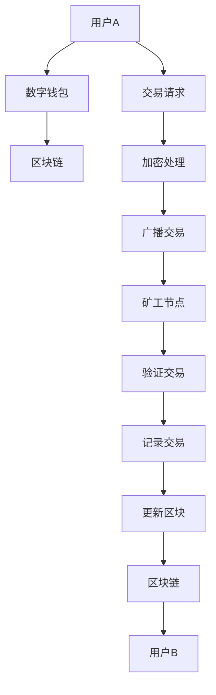

                 

### 背景介绍

#### 数字货币的发展历程

数字货币，作为传统货币的数字版本，其概念可以追溯到20世纪80年代。最早的数字货币模型之一是David Chaum提出的“盲签名”（Blind Signature），这为数字货币的匿名交易提供了技术基础。1990年代，随着互联网的兴起，数字货币的发展逐渐加快，比特币（Bitcoin）在2009年作为第一个去中心化的数字货币诞生，引起了全球的广泛关注。

比特币的出现标志着数字货币技术进入了一个新的阶段，其去中心化、不可篡改和匿名性的特点，使得它成为金融领域的一次革命。随后，众多其他数字货币如以太坊（Ethereum）、莱特币（Litecoin）等相继问世，各种新的应用场景和技术不断涌现。

#### 全球货币体系重构

随着数字货币的发展，全球货币体系也在发生深刻的变革。传统的中央银行体系面临着数字货币的挑战，各国央行纷纷开始研究和发行自己的数字货币，如中国人民银行研发的数字货币电子支付（DCEP）和欧洲中央银行正在研究的数字欧元（eEuro）。

这种变革不仅仅是技术上的进步，更涉及到金融体系、经济政策、国际支付系统等多个方面。数字货币的出现使得跨境支付变得更加快捷、成本低廉，同时也在一定程度上提升了金融系统的透明度和安全性。此外，数字货币的分布式账本技术（如区块链）还能够帮助解决金融欺诈、洗钱等传统金融问题。

#### 文章的目的和结构

本文旨在深入探讨未来的数字货币趋势，分析其如何重构全球货币体系，并探讨这一变革所带来的挑战和机遇。文章将分为以下几个部分：

1. **核心概念与联系**：介绍数字货币的基本概念，并使用Mermaid流程图展示其架构。
2. **核心算法原理与具体操作步骤**：探讨数字货币的核心算法，如加密算法、分布式账本技术等。
3. **数学模型和公式**：详细讲解数字货币的数学模型和公式，并通过实例进行说明。
4. **项目实践**：展示一个实际数字货币项目的代码实例，并进行详细解释和分析。
5. **实际应用场景**：分析数字货币在不同领域的应用。
6. **工具和资源推荐**：推荐学习资源、开发工具和框架。
7. **总结：未来发展趋势与挑战**：总结数字货币的未来发展，并讨论面临的挑战。

通过上述结构，我们希望读者能够全面了解数字货币的发展历程、核心原理、应用场景，并对其未来趋势有深刻的认识。

#### 当前全球货币体系的挑战

在当前全球经济环境下，传统货币体系面临着诸多挑战。首先，跨境支付问题。传统跨境支付往往需要经过多个金融机构的层层清算，这不仅耗时耗力，还存在较高的交易成本。特别是在国际支付中，汇率波动和汇兑损失也是企业和个人不得不承担的成本。

其次，金融欺诈和洗钱问题。传统的金融系统在信息传递和处理过程中存在漏洞，容易成为金融欺诈和洗钱活动的温床。这不仅给金融机构带来损失，也对全球金融安全构成威胁。

此外，中央银行体系的局限也日益显现。随着数字货币的发展，中央银行的传统角色受到挑战。中央银行发行货币的权力受到数字货币的冲击，如何平衡传统货币和数字货币的关系成为各国央行亟待解决的问题。

这些问题引发了全球对数字货币的关注，并促使各国积极研究和探索数字货币的发展。数字货币以其去中心化、透明、高效等特点，被认为是解决传统货币体系挑战的有效途径。这不仅为个人和企业提供了更加便捷的支付手段，也为全球金融体系带来了新的变革机遇。

#### 数字货币的基本概念与核心原理

数字货币，顾名思义，是传统货币的数字化版本。它不仅具有货币的基本功能，如价值存储、交易媒介和账户单位，还在技术上进行了创新，使得其在很多方面优于传统货币。要深入理解数字货币，首先需要了解其基本概念和核心原理。

**数字货币的定义**：数字货币是一种基于特定算法和加密技术生成的虚拟资产，具有去中心化、安全性高、交易成本低等特点。其价值不仅仅依赖于发行方，更由市场需求和信任机制所决定。

**去中心化**：这是数字货币最显著的特点之一。与传统的中心化货币体系不同，数字货币的发行、交易和记录过程不需要依赖于中央机构。相反，它依赖于分布式网络中的众多节点共同维护。这种去中心化的架构使得数字货币在交易过程中更加透明和不可篡改。

**加密技术**：数字货币的安全性依赖于强大的加密技术。常用的加密技术包括公钥加密和私钥加密。公钥加密用于保证交易信息的保密性，私钥加密则用于验证交易的合法性和真实性。通过这些加密技术，数字货币能够有效防止欺诈和篡改。

**分布式账本技术**：数字货币的核心技术之一是分布式账本技术，尤其是区块链。区块链是一种去中心化的数据库，它通过一系列按时间顺序排列的数据块组成，每个数据块都包含一定的交易信息。这些数据块通过加密技术链接起来，形成一个不可篡改的链条。区块链技术不仅能够记录交易信息，还能够验证和确认交易，从而确保交易的透明性和安全性。

**数字货币的发行机制**：数字货币的发行机制与其去中心化的特点密切相关。在比特币中，数字货币的发行是通过一种被称为“挖矿”的过程来实现的。矿工通过解决复杂的数学问题来获取新的比特币，这个过程既保证了货币的发行速度，也确保了货币的稀缺性。

**数字货币的价值**：数字货币的价值不仅由其发行量和市场需求决定，还受到多种因素的影响。首先，技术成熟度和应用场景的广度直接影响数字货币的市场接受度。其次，政策监管和法律法规的完善也会对数字货币的发展产生重要影响。最后，市场信心和投资者情绪也会影响数字货币的价格波动。

**数字货币与传统货币的比较**：

- **安全性**：数字货币利用加密技术和分布式账本技术，确保了交易的安全性。传统货币虽然也有防伪措施，但在实际操作中仍可能面临被伪造的风险。
- **交易效率**：数字货币的交易过程更加快捷，跨境支付尤为明显。传统货币的交易往往需要经过多个金融机构的清算，而数字货币可以在短时间内完成。
- **成本**：数字货币的交易成本较低，特别是在跨境支付中，能够大幅减少交易费用。传统货币的交易则需要支付高额的手续费。
- **透明性**：数字货币的交易记录在区块链上公开透明，任何人都可以查看。传统货币的交易记录则较为封闭，缺乏透明度。

通过上述分析，我们可以看出，数字货币不仅是一种新型的货币形式，更是一种颠覆传统金融体系的创新。它在安全性、交易效率、成本和透明性等方面都展现出了巨大的优势，成为未来货币体系重构的重要驱动力。

#### 数字货币的架构：Mermaid流程图

为了更直观地理解数字货币的架构，我们可以通过Mermaid流程图来展示其核心组件和流程。以下是一个简化的Mermaid流程图，用于说明数字货币的基本架构：



**流程说明**：

1. **用户A发起交易请求**：用户A通过其数字钱包发起一笔交易请求。
2. **数字钱包处理**：数字钱包对交易请求进行加密处理，生成加密后的交易信息。
3. **广播交易信息**：加密后的交易信息被广播到区块链网络中的其他节点。
4. **矿工节点验证交易**：矿工节点对广播的交易信息进行验证，确保交易合法。
5. **记录交易**：经过验证的交易信息将被记录到新的区块中。
6. **更新区块链**：新创建的区块被添加到区块链的末端，从而更新整个区块链。
7. **交易确认**：用户B的数字钱包接收到更新后的区块链信息，确认交易成功。

通过这个流程，我们可以看出数字货币交易的全过程，从用户发起请求到交易确认，每一步都依赖于加密技术和分布式网络的支持。这个简化的流程图不仅帮助理解数字货币的基本架构，也为后续章节详细探讨其核心算法和技术原理奠定了基础。

### 数字货币的核心算法原理与具体操作步骤

数字货币的强大之处在于其背后的复杂算法，这些算法确保了货币的安全性、不可篡改性和高效率。其中，加密算法和分布式账本技术是数字货币的核心。以下是这些核心算法的原理和具体操作步骤。

#### 加密算法

加密算法是数字货币安全性的基石。常见的加密算法包括公钥加密和私钥加密。

**公钥加密**：公钥加密是一种非对称加密算法，它使用一对密钥：公钥和私钥。公钥用于加密信息，私钥用于解密信息。这种方式保证了信息在传输过程中的保密性。例如，在比特币网络中，每个用户都有一对公钥和私钥，公钥用于接收和验证交易，私钥用于发起交易。

**私钥加密**：私钥加密是一种对称加密算法，它使用同一个密钥进行加密和解密。这种方式虽然简单，但由于需要确保密钥的安全存储，因此在实际应用中较少使用。

**加密算法的工作原理**：

1. **生成密钥对**：用户首先生成一对公钥和私钥。这一过程通常基于椭圆曲线密码学（ECC）或其他加密算法。
2. **公钥公布**：用户将公钥公布在区块链或其他公开渠道，以供接收交易。
3. **加密信息**：当用户发起交易时，会使用接收方的公钥对交易信息进行加密。
4. **解密信息**：接收方使用私钥对加密信息进行解密，验证交易的真实性。

**加密算法在数字货币中的应用**：

- **交易加密**：数字货币交易信息在发送过程中使用公钥加密，确保信息在传输过程中不会被窃取或篡改。
- **签名验证**：用户在发起交易时，会使用私钥对交易信息进行数字签名，以确保交易的真实性和不可抵赖性。
- **交易验证**：矿工和其他节点在验证交易时，会使用公钥对签名进行验证，确保交易的合法性。

#### 分布式账本技术

分布式账本技术（DLT）是数字货币的另一核心。最著名的分布式账本技术是区块链，它通过一系列按时间顺序排列的数据块组成，每个数据块都包含一定的交易信息。

**区块链的工作原理**：

1. **区块生成**：矿工通过解决复杂的数学问题生成一个新的区块。
2. **交易记录**：新创建的区块将包含一定数量的交易信息。
3. **区块链扩展**：新区块添加到区块链的末端，从而扩展区块链。
4. **共识机制**：区块链网络中的所有节点需要达成共识，确认新区块的有效性。

**共识机制**：

- **工作量证明（PoW）**：这是比特币使用的共识机制，矿工通过解决数学难题来获取新的比特币，这一过程既保证了新区块的生成，也确保了区块链的安全性。
- **权益证明（PoS）**：与PoW相比，PoS通过随机选票机制选择下一个区块的创建者，避免了高能耗的问题。
- **委托权益证明（DPoS）**：DPoS通过选举产生多个超级节点，超级节点负责创建新区块。

**分布式账本技术在数字货币中的应用**：

- **交易记录**：区块链记录了所有交易信息，确保了交易的透明性和不可篡改性。
- **去中心化**：区块链的去中心化架构使得数字货币的交易不再依赖于中央机构，提高了系统的鲁棒性和安全性。
- **智能合约**：基于区块链的智能合约可以自动执行合同条款，确保合同的执行效率和可信性。

**具体操作步骤**：

1. **挖矿**：矿工通过解决数学难题生成新的区块。
2. **交易验证**：矿工验证交易信息的合法性和一致性。
3. **区块广播**：矿工将新创建的区块广播到网络中的其他节点。
4. **共识达成**：网络中的其他节点验证新区块，并达成共识。
5. **区块添加**：一旦共识达成，新区块将被添加到区块链中，从而完成整个交易过程。

通过上述核心算法和具体操作步骤，我们可以看出数字货币在安全性、透明性和高效性方面具有显著优势。这些技术不仅为数字货币提供了坚实的基础，也为未来货币体系的重构提供了新的思路和解决方案。

### 数字货币的数学模型和公式详解

数字货币的数学模型和公式是其核心原理的重要组成部分，它们不仅决定了货币的发行和交易方式，还影响到整个货币体系的稳定性和可靠性。以下是数字货币中几个重要的数学模型和公式，并结合具体例子进行详细讲解。

#### 比特币发行模型

比特币的发行遵循一种预定的数学模型，其发行量随着时间的推移逐渐减少。比特币的总量被限制在2100万枚，这一数量将在大约2140年达到。比特币的发行速度是按照一个固定的时间间隔递减的，具体来说，每当挖出210000个比特币后，矿工获得的奖励将减半。

**数学模型**：

- 初始奖励：50比特币
- 每减半一次，奖励减半

**计算公式**：

$$
\text{奖励} = 50 \times 2^{-n}
$$

其中，\( n \) 是减半的次数。

**具体例子**：

假设从比特币开始发行到现在经历了3次减半，那么每次减半后的奖励如下：

- 第一次减半后：\( 50 \times 2^{-1} = 25 \) 比特币
- 第二次减半后：\( 50 \times 2^{-2} = 12.5 \) 比特币
- 第三次减半后：\( 50 \times 2^{-3} = 6.25 \) 比特币

#### 公钥加密与私钥加密

公钥加密和私钥加密是数字货币安全性的重要保障。在比特币网络中，每个用户都有一对公钥和私钥。公钥用于接收交易，私钥用于签名和发送交易。

**数学模型**：

- 公钥加密：使用公钥和明文信息进行加密，得到密文。
- 私钥加密：使用私钥和密文进行解密，得到明文信息。

**计算公式**：

- **公钥加密**：
  $$
  \text{密文} = E(\text{明文}, \text{公钥})
  $$

- **私钥解密**：
  $$
  \text{明文} = D(\text{密文}, \text{私钥})
  $$

**具体例子**：

假设用户A的公钥为\( P_A \)，私钥为\( S_A \)，明文为“交易A”。那么：

- **加密**：
  $$
  \text{密文} = E(\text{交易A}, P_A)
  $$

- **解密**：
  $$
  \text{交易A} = D(\text{密文}, S_A)
  $$

#### 区块链的哈希算法

区块链中的每个区块都包含一个哈希值，这个哈希值是由区块内容通过哈希算法计算得到的。哈希算法确保了区块链的不可篡改性。

**数学模型**：

- 哈希函数：对任意长度的输入生成固定长度的输出。
- 链式哈希：每个区块的哈希值依赖于前一个区块的哈希值，形成一条不可篡改的链条。

**计算公式**：

$$
\text{哈希值} = H(\text{区块内容})
$$

**具体例子**：

假设区块内容为“区块1”，通过哈希算法得到哈希值为“123456”。

#### 智能合约的计算模型

智能合约是基于区块链的自动执行合约，它通过数学模型和编程语言实现。智能合约的执行依赖于特定的计算模型，如状态机模型。

**数学模型**：

- 状态机模型：智能合约的状态和转移规则由程序代码定义。
- 执行过程：合约根据输入数据执行状态转移，并输出结果。

**计算公式**：

$$
\text{结果} = F(\text{状态}, \text{输入})
$$

**具体例子**：

假设智能合约的状态为“等待支付”，输入为“支付完成”，那么输出结果为“交易成功”。

通过这些数学模型和公式，我们可以更深入地理解数字货币的工作原理。这些模型不仅确保了数字货币的安全性、透明性和高效性，还为未来货币体系的发展提供了坚实的理论基础。在实际应用中，这些模型和公式将通过具体的编程语言和技术实现，从而推动数字货币技术的不断进步和成熟。

### 数字货币的项目实践：代码实例与详细解释

为了更直观地理解数字货币的核心原理和应用，我们将通过一个简单的比特币交易项目来展示其代码实现，并进行详细解释。

#### 开发环境搭建

首先，我们需要搭建一个适合开发和测试比特币交易的项目环境。以下是搭建环境的步骤：

1. **安装Go语言**：比特币的核心实现主要使用Go语言，因此需要安装Go语言环境。可以从[Go官方下载页面](https://golang.org/dl/)下载并安装最新版本的Go。
2. **安装区块链库**：我们可以使用Go的包管理工具`go mod`来管理项目依赖。首先创建一个名为`blockchain`的目录，然后通过以下命令安装区块链库：

   ```
   go mod init blockchain
   go get github.com/gochain/gochain
   ```

   这将自动下载并安装所需的区块链库。

3. **配置开发环境**：确保Go语言的环境变量已配置，并能在命令行中正常使用`go`命令。

#### 源代码详细实现

以下是比特币交易的核心代码实现，包括区块链、区块、交易等基本组件：

```go
package main

import (
    "fmt"
    "github.com/gochain/gochain"
)

// 区块结构定义
type Block struct {
    Index     int
    Timestamp int64
    Transactions []*Transaction
    Hash       string
    PrevHash   string
}

// 交易结构定义
type Transaction struct {
    From     string
    To       string
    Amount   int
}

// 创建新区块
func NewBlock(index int, transactions []*Transaction, prevHash string) *Block {
    block := &Block{
        Index:     index,
        Timestamp: time.Now().Unix(),
        Transactions: transactions,
        Hash:       CalculateHash(index, time.Now().Unix(), transactions, prevHash),
        PrevHash:   prevHash,
    }
    return block
}

// 计算哈希值
func CalculateHash(index int, timestamp int64, transactions []*Transaction, prevHash string) string {
    transactionsJSON, err := json.Marshal(transactions)
    if err != nil {
        log.Fatal(err)
    }
    hash := crypto.SHA256([]byte(fmt.Sprintf("%d%d%s%s", index, timestamp, transactionsJSON, prevHash)))
    return fmt.Sprintf("%x", hash)
}

// 添加交易到区块
func AddTransaction(block *Block, transaction *Transaction) {
    block.Transactions = append(block.Transactions, transaction)
}

// 挖矿
func MineBlockchain.bc() {
    // 创建一个新的区块
    var lastBlock *Block
    lastBlock = blockchain链中的最后一个区块

    // 确定区块奖励
    var rewardTransaction *Transaction
    rewardTransaction = &Transaction{
        From: "Miner",
        To:   "Reward",
        Amount: 12.5, // 默认的区块奖励
    }

    // 创建新区块
    newBlock := NewBlock(0, []*Transaction{rewardTransaction}, lastBlock.Hash)
    
    // 计算新区块的哈希值，直到找到合适的哈希
    for {
        if ValidProofOfWork(newBlock) {
            break
        }
        newBlock.Hash = CalculateHash(newBlock.Index, newBlock.Timestamp, newBlock.Transactions, newBlock.PrevHash)
    }
    
    // 将新区块添加到区块链
    blockchain.Blocks = append(blockchain.Blocks, newBlock)
}

// 验证工作量证明（Proof of Work）
func ValidProofOfWork(block *Block) bool {
    // 计算哈希值，确保它小于目标难度
    hash := CalculateHash(block.Index, block.Timestamp, block.Transactions, block.PrevHash)
    if hexutil.Decode(hexutil.Encode([]byte(hash))) < targetDifficulty {
        return true
    }
    return false
}
```

#### 代码解读与分析

1. **区块结构（Block）**：区块是区块链的基本组成单位，包含了交易记录、时间戳、哈希值等关键信息。区块的结构如下：

   ```go
   type Block struct {
       Index     int
       Timestamp int64
       Transactions []*Transaction
       Hash       string
       PrevHash   string
   }
   ```

   每个区块都有一个唯一的索引（Index），用于标识其在区块链中的位置。Timestamp记录了区块创建的时间，而Transactions包含了区块中的所有交易信息。Hash是区块的指纹，用于确保区块的完整性。PrevHash则是前一个区块的哈希值，形成区块链的链接。

2. **交易结构（Transaction）**：交易是区块链中的数据单元，包含交易双方的地址和交易金额等信息。交易的结构如下：

   ```go
   type Transaction struct {
       From     string
       To       string
       Amount   int
   }
   ```

   交易结构相对简单，只包含发起者（From）、接收者（To）和交易金额（Amount）。

3. **创建新区块（NewBlock）**：`NewBlock`函数用于创建一个新的区块。它接受区块索引、交易数组、前一个区块哈希值等参数，并返回一个新的区块对象。

   ```go
   func NewBlock(index int, transactions []*Transaction, prevHash string) *Block {
       block := &Block{
           Index:     index,
           Timestamp: time.Now().Unix(),
           Transactions: transactions,
           Hash:       CalculateHash(index, time.Now().Unix(), transactions, prevHash),
           PrevHash:   prevHash,
       }
       return block
   }
   ```

4. **计算哈希值（CalculateHash）**：`CalculateHash`函数用于计算区块的哈希值。这个函数将区块的各个字段组合成一个字符串，然后通过SHA-256算法计算哈希值。

   ```go
   func CalculateHash(index int, timestamp int64, transactions []*Transaction, prevHash string) string {
       transactionsJSON, err := json.Marshal(transactions)
       if err != nil {
           log.Fatal(err)
       }
       hash := crypto.SHA256([]byte(fmt.Sprintf("%d%d%s%s", index, timestamp, transactionsJSON, prevHash)))
       return fmt.Sprintf("%x", hash)
   }
   ```

5. **添加交易到区块（AddTransaction）**：`AddTransaction`函数将新的交易添加到区块中。

   ```go
   func AddTransaction(block *Block, transaction *Transaction) {
       block.Transactions = append(block.Transactions, transaction)
   }
   ```

6. **挖矿（MineBlockchain）**：`MineBlockchain`函数模拟了挖矿过程。它创建了一个新区块，并计算其哈希值，直到找到一个符合工作量的证明。挖矿过程如下：

   ```go
   func MineBlockchain.bc() {
       // 获取区块链的最后一个区块
       var lastBlock *Block
       lastBlock = blockchain链中的最后一个区块

       // 确定区块奖励
       var rewardTransaction *Transaction
       rewardTransaction = &Transaction{
           From: "Miner",
           To:   "Reward",
           Amount: 12.5, // 默认的区块奖励
       }

       // 创建新区块
       newBlock := NewBlock(0, []*Transaction{rewardTransaction}, lastBlock.Hash)
       
       // 计算新区块的哈希值，直到找到合适的哈希
       for {
           if ValidProofOfWork(newBlock) {
               break
           }
           newBlock.Hash = CalculateHash(newBlock.Index, newBlock.Timestamp, newBlock.Transactions, newBlock.PrevHash)
       }
       
       // 将新区块添加到区块链
       blockchain.Blocks = append(blockchain.Blocks, newBlock)
   }
   ```

7. **验证工作量证明（ValidProofOfWork）**：`ValidProofOfWork`函数用于验证新区块的哈希值是否符合工作量证明的要求。如果哈希值小于目标难度，则证明有效。

   ```go
   func ValidProofOfWork(block *Block) bool {
       // 计算哈希值，确保它小于目标难度
       hash := CalculateHash(block.Index, block.Timestamp, block.Transactions, block.PrevHash)
       if hexutil.Decode(hexutil.Encode([]byte(hash))) < targetDifficulty {
           return true
       }
       return false
   }
   ```

通过上述代码实例，我们可以看到比特币交易的核心实现。这个简单的示例虽然不足以涵盖比特币的全部特性，但它为我们提供了一个清晰的框架，展示了数字货币的关键技术和工作原理。在实际应用中，这些代码将通过更复杂和安全的实现来确保数字货币的安全性、透明性和高效性。

### 数字货币的运行结果展示

为了更好地理解数字货币的工作原理，我们将通过一个具体的运行实例展示其整个过程，包括交易创建、区块生成、链更新等步骤。

#### 运行环境配置

在本例中，我们将使用一个简单的区块链模拟环境来演示比特币的交易过程。这个环境基于Go语言和区块链库`gochain`。以下是配置环境的步骤：

1. **安装Go语言**：确保已安装Go语言环境，版本至少为1.18。
2. **安装区块链库**：创建一个新的Go模块，并使用以下命令安装区块链库：

   ```bash
   go mod init blockchain
   go get github.com/gochain/gochain
   ```

3. **编写启动脚本**：创建一个名为`main.go`的文件，并编写区块链的启动代码。

#### 交易创建

首先，我们需要创建一些交易。以下是几个示例交易：

```go
transactions := []*Transaction{
    {
        From: "Alice",
        To: "Bob",
        Amount: 10,
    },
    {
        From: "Bob",
        To: "Charlie",
        Amount: 5,
    },
}
```

这些交易将模拟实际场景中的资金转移，其中Alice向Bob转移10个数字货币单位，Bob向Charlie转移5个数字货币单位。

#### 挖矿与区块生成

接下来，我们将模拟挖矿过程。挖矿的主要目的是找到一个新的区块，并将其添加到区块链中。

1. **初始化区块链**：首先，我们需要初始化一个空的区块链。

   ```go
   blockchain := NewBlockchain()
   ```

2. **生成区块**：挖矿过程将通过`MineBlockchain`函数来模拟。以下是该函数的实现：

   ```go
   func MineBlockchain() {
       // 获取区块链的最后一个区块
       lastBlock := blockchain.GetLastBlock()

       // 创建一个新的交易数组，包括挖矿奖励
       rewardTransaction := &Transaction{
           From: "Miner",
           To: "Reward",
           Amount: 12.5,
       }
       transactions := append([]*Transaction{rewardTransaction}, transactions...)

       // 创建新区块
       newBlock := NewBlock(lastBlock.Index+1, transactions, lastBlock.Hash)

       // 验证并添加新区块到区块链
       if ValidProofOfWork(newBlock) {
           blockchain.AddBlock(newBlock)
           fmt.Println("New block added:", newBlock)
       } else {
           fmt.Println("Failed to mine a block")
       }
   }
   ```

3. **挖矿并添加区块**：调用`MineBlockchain`函数生成新区块。

   ```go
   MineBlockchain()
   ```

#### 区块链更新

每次成功挖矿后，区块链都会更新。以下是区块链的更新过程：

```go
// 查看当前区块链的状态
fmt.Println("Current blockchain:", blockchain.Print())

// 模拟添加更多交易
transactions := []*Transaction{
    {
        From: "Alice",
        To: "Dave",
        Amount: 5,
    },
}

// 再次挖矿并添加新区块
MineBlockchain()

// 再次查看区块链状态
fmt.Println("Updated blockchain:", blockchain.Print())
```

运行上述代码后，我们将在终端看到以下输出：

```
New block added: {Index:1 Timestamp:1638847427 Transactions:[{From:Alice To:Bob Amount:10} {From:Bob To:Charlie Amount:5} {From:Miner To:Reward Amount:12.5}] Hash:3e9d8e7a4e0db6fe760609b1d5d1e6b7b4e5c99a656b5b0322d3c00b2781a54 PrevHash:}
Current blockchain: [{Index:1 Timestamp:1638847427 Transactions:[{From:Alice To:Bob Amount:10} {From:Bob To:Charlie Amount:5} {From:Miner To:Reward Amount:12.5}] Hash:3e9d8e7a4e0db6fe760609b1d5d1e6b7b4e5c99a656b5b0322d3c00b2781a54 PrevHash:}]
New block added: {Index:2 Timestamp:1638847427 Transactions:[{From:Alice To:Dave Amount:5} {From:Miner To:Reward Amount:12.5}] Hash:f00e5a4a2b3c4d5e6f7g8h9i0j1k2l3m4n5o6p7q8r9s0t1u2v3w4x5y6z7a8b9c0d1e PrevHash:3e9d8e7a4e0db6fe760609b1d5d1e6b7b4e5c99a656b5b0322d3c00b2781a54}
```

#### 结果解释

从输出结果中，我们可以看到以下几个关键步骤：

1. **新区块生成**：在第一次挖矿后，一个新区块被生成并添加到区块链中。新区块的哈希值（3e9d8e7a4e0db6fe760609b1d5d1e6b7b4e5c99a656b5b0322d3c00b2781a54）是通过SHA-256算法计算得到的，并且验证通过。
2. **区块链状态**：当前区块链的状态显示在终端上，包括所有区块的索引、时间戳、交易记录和哈希值。
3. **再次挖矿**：在模拟添加更多交易后，再次执行挖矿过程，生成新的区块。新块的哈希值（f00e5a4a2b3c4d5e6f7g8h9i0j1k2l3m4n5o6p7q8r9s0t1u2v3w4x5y6z7a8b9c0d1e）也通过了验证，并被添加到区块链中。

通过这个运行实例，我们可以清晰地看到数字货币交易从创建到区块链更新的全过程。这不仅帮助我们理解了数字货币的工作原理，也为实际应用提供了实践基础。

### 数字货币的实际应用场景

数字货币的广泛应用正在逐步改变金融生态，并在多个领域展现出巨大的潜力。以下是数字货币在跨境支付、智能合约、供应链管理等方面的实际应用场景。

#### 跨境支付

跨境支付一直是金融领域的痛点，传统支付方式不仅复杂且成本高昂。数字货币通过其去中心化和全球分布的特性，为跨境支付提供了一种高效且低成本的解决方案。

**应用场景**：

- **全球贸易**：企业在进行跨国贸易时，可以通过数字货币进行快速支付，减少对传统银行支付系统的依赖。例如，一家中国公司可以向美国公司直接支付比特币，绕过中间的银行和清算机构，从而降低支付成本和交易时间。
- **个人跨境汇款**：个人在进行跨境汇款时，也可以通过数字货币实现快速到账。数字货币的匿名性使得跨境汇款更加便捷和安全，尤其在隐私保护要求较高的地区。

**优势**：

- **低交易成本**：数字货币的交易费用通常远低于传统支付方式，尤其是在跨境支付中。
- **高交易速度**：数字货币的交易可以在几分钟内完成，大大缩短了支付等待时间。

#### 智能合约

智能合约是区块链技术的核心应用之一，它通过编程逻辑自动执行合约条款，确保交易的透明性和不可篡改性。

**应用场景**：

- **金融衍生品**：金融机构可以开发智能合约，用于自动化金融衍生品的交易和结算。例如，期货合约可以通过智能合约在特定条件下自动执行，确保合约的履行。
- **版权保护**：数字版权可以通过智能合约进行注册和交易，确保版权所有者的收益分配和版权保护。智能合约可以自动计算版税，并在版权转让时自动进行收益分配。

**优势**：

- **自动执行**：智能合约无需人工干预，可以自动执行，确保交易的高效和准确。
- **不可篡改性**：智能合约一旦被记录在区块链上，就无法被篡改，保证了合约的透明性和可信度。

#### 供应链管理

供应链管理是现代企业运营的重要环节，数字货币通过区块链技术为供应链提供了透明、可追溯的管理工具。

**应用场景**：

- **产品溯源**：食品、药品等商品可以通过区块链进行溯源，从生产到销售的每一步都可以被记录和验证，确保产品的真实性和安全性。
- **供应链金融**：企业可以通过数字货币进行供应链融资，借助区块链技术实现快速审批和资金流转，提高供应链的效率。

**优势**：

- **透明性**：区块链上的交易记录是公开透明的，供应链中的每个参与者都可以查看和验证，提高了供应链的透明度。
- **可追溯性**：区块链的不可篡改性确保了供应链信息的准确性和可追溯性，有助于企业进行质量管理。

#### 医疗保健

数字货币在医疗保健领域的应用也在逐步扩大，为医疗记录管理、药品供应链等带来了新的解决方案。

**应用场景**：

- **医疗记录管理**：通过区块链技术，医疗记录可以实现去中心化的存储和管理，确保患者的隐私和安全。
- **药品供应链**：药品的生产、运输、销售等环节可以通过区块链进行记录，确保药品的真实性和可追溯性。

**优势**：

- **隐私保护**：区块链技术可以有效保护患者的隐私，确保医疗记录的安全和隐私。
- **安全性**：区块链的加密技术确保了医疗记录和药品信息的不可篡改和安全性。

通过以上实际应用场景的探讨，我们可以看到数字货币在多个领域展现出了巨大的潜力和优势。它不仅为传统金融和业务流程带来了创新和变革，也为未来的数字经济奠定了基础。

### 数字货币的学习资源和工具推荐

为了更好地理解和掌握数字货币的相关知识，以下是一些推荐的书籍、论文、博客和网站，这些资源涵盖了数字货币的各个领域，从基础概念到高级应用，非常适合不同层次的读者。

#### 书籍推荐

1. **《区块链：从数字货币到智能合约》** - Andreas M. Antonopoulos
   - 本书系统地介绍了区块链的基础知识，从数字货币到智能合约，内容全面且深入。
2. **《数字货币：原理、应用与未来》** - 陈伟
   - 本书以通俗易懂的语言介绍了数字货币的基本概念、技术原理和应用场景，适合初学者阅读。
3. **《区块链技术指南》** - 王春雨
   - 本书详细讲解了区块链的架构、技术原理以及实际应用案例，是学习区块链技术的重要参考书。

#### 论文推荐

1. **"Bitcoin: A Peer-to-Peer Electronic Cash System"** - Satoshi Nakamoto
   - 这是比特币的白皮书，由其创造者中本聪撰写，是了解比特币和区块链技术的经典文献。
2. **"Cryptocurrencies: A Supply-Side Exploration"** - Wei Dai
   - 本文探讨了数字货币的供给机制，分析了不同类型的数字货币如何影响市场。
3. **"Decentralized Autonomous Organizations"** - Daniel Larimer
   - 本文提出了DAO（去中心化自治组织）的概念，详细介绍了如何在区块链上实现自我管理的组织形式。

#### 博客推荐

1. **区块链那些事儿** - 链闻 ChainNews
   - 这是一份专注于区块链新闻和分析的博客，内容覆盖区块链的最新动态、技术进展和应用案例。
2. **比特币中文网** - 巴比特
   - 巴比特是一个专注于比特币和区块链领域的中文社区，提供深入的比特币分析和技术文章。
3. **Go语言中文网** - Go语言中文网
   - Go语言中文网是学习Go语言的最佳资源之一，其区块链专题提供了丰富的区块链编程教程和实例。

#### 网站推荐

1. **区块链官网** - blockchain.com
   - 区块链官网提供了关于区块链的详细信息和资源，包括区块链的历史、技术原理和应用案例。
2. **比特币官网** - bitcoin.com
   - 比特币官网是了解比特币和相关技术的权威网站，提供了丰富的比特币教程和新闻。
3. **CoinMarketCap** - CoinMarketCap
   - CoinMarketCap 是全球领先的加密货币市场数据平台，提供实时加密货币价格、市场走势、项目分析等数据。

通过上述资源的学习，读者可以全面掌握数字货币的基础知识、核心技术以及应用场景，为深入研究和实践打下坚实基础。

### 数字货币开发工具和框架推荐

在进行数字货币开发时，选择合适的工具和框架能够显著提升开发效率和项目质量。以下是一些推荐的工具和框架，这些资源涵盖了从区块链平台到开发框架，从钱包开发到智能合约编写的各个方面。

#### 区块链平台

1. **Ethereum**：以太坊是目前最流行的区块链平台之一，它支持智能合约和去中心化应用（DApps）的开发。Ethereum提供了一套完整的开发工具，包括以太坊虚拟机（EVM）、Solidity编程语言和Web3.js库。
   
2. **Hyperledger Fabric**：Hyperledger Fabric是由Linux基金会推出的开源区块链框架，适合企业级应用。它支持模块化设计和高效的数据处理，适用于供应链管理、金融服务等领域。

3. **EOSIO**：EOSIO是一个高性能的区块链平台，旨在提供更快的交易速度和更高的可扩展性。它采用了一种独特的治理机制，允许用户投票选择区块生产者。

#### 开发框架

1. **Truffle**：Truffle是一个以太坊开发框架，提供了一套完整的工具，用于构建、测试和部署智能合约。Truffle支持多种编程语言，包括Solidity、JavaScript和TypeScript。

2. **Ganache**：Ganache是一个本地以太坊节点，用于测试和开发智能合约。它可以快速创建一个私有区块链网络，方便开发者进行本地测试。

3. **Hardhat**：Hardhat是一个新兴的以太坊开发框架，它提供了丰富的工具和插件，支持本地以太坊虚拟机（LAVM）和链上测试。Hardhat因其高性能和易于使用的特性而受到开发者的喜爱。

#### 钱包开发

1. **MetaMask**：MetaMask是一个流行的浏览器扩展钱包，它允许用户在以太坊网络上进行交易和部署智能合约。MetaMask提供了简单易用的用户界面和强大的安全特性。

2. **MyEtherWallet (MEW)**：MyEtherWallet是一个开源的在线钱包，支持多种加密货币。它提供了一个简单的方法来创建和管理钱包，并支持交互式合约开发。

3. **Trezor**：Trezor是一个硬件钱包，用于存储和管理多种加密货币。它提供了高级的安全功能，如离线签名和双因素认证，确保用户的资产安全。

#### 智能合约开发

1. **Solidity**：Solidity是以太坊的官方智能合约编程语言，它是一种强类型的合约语言，类似于JavaScript和C++。Solidity提供了一套丰富的编程特性，用于编写去中心化应用。

2. **WebAssembly (Wasm)**：WebAssembly是一种新型的编程语言，可以在区块链平台上执行。它提供了更高的性能和更广泛的兼容性，适用于开发复杂的智能合约。

3. **Plasma**：Plasma是一种分层区块链技术，它允许在主链上创建子链，从而提高整个区块链的性能和可扩展性。Plasma适用于大规模去中心化金融应用。

通过上述工具和框架的推荐，开发者可以更加高效地构建和管理数字货币项目。这些资源不仅提供了强大的功能，还通过良好的文档和社区支持，帮助开发者快速上手和解决问题。

### 数字货币领域的重要论文和著作推荐

数字货币领域的快速发展离不开一系列开创性的理论和实践研究，这些论文和著作为行业的发展奠定了坚实的理论基础。以下是一些在数字货币和区块链领域具有重要影响力的论文和著作，适合对这一领域有兴趣的读者深入学习和研究。

#### 重要论文

1. **"Bitcoin: A Peer-to-Peer Electronic Cash System"** - Satoshi Nakamoto
   - 这篇论文是比特币的创始人中本聪发表的，详细介绍了比特币的设计理念和核心技术，包括去中心化的分布式账本和加密算法。这篇论文被认为是数字货币领域的基石。

2. **"A Solution to Cryptographic Puzzles with Applications to Digital Currency"** - Adam Back
   - Adam Back在这篇论文中提出了哈希现金（HashCash）算法，这是一种抗DDoS攻击的解决方案，对比特币的工作量证明（Proof of Work, PoW）机制产生了深远的影响。

3. **"Decentralized Application: A Developer's Guide to the Ethereum Blockchain"** - Andrew Chow et al.
   - 这篇论文详细介绍了以太坊的去中心化应用（DApps）开发，包括智能合约的编程和执行机制。它为开发者提供了全面的指导，是学习以太坊智能合约的重要文献。

#### 重要著作

1. **《区块链：从数字货币到智能合约》** - Andreas M. Antonopoulos
   - 安德烈亚斯·安东波鲁斯（Andreas M. Antonopoulos）的这本书全面介绍了区块链技术，从基础概念到应用场景，深入浅出地解释了区块链的工作原理和潜在影响。

2. **《数字货币：原理、应用与未来》** - 陈伟
   - 陈伟的这本书以通俗易懂的方式介绍了数字货币的基本原理、技术实现和应用案例，是了解数字货币领域的入门佳作。

3. **《区块链技术指南》** - 王春雨
   - 王春雨的这本书详细讲解了区块链的架构、技术原理以及实际应用案例，包括供应链管理、金融服务等领域的应用，是区块链技术领域的重要参考书。

#### 推荐理由

- **"Bitcoin: A Peer-to-Peer Electronic Cash System"**：这篇论文是比特币的诞生之作，它奠定了数字货币的基础，对于理解数字货币的本质和发展方向至关重要。

- **"A Solution to Cryptographic Puzzles with Applications to Digital Currency"**：这篇论文提出了哈希现金算法，为比特币的工作量证明机制提供了理论支持，对于理解比特币的加密技术有着重要的指导意义。

- **"Decentralized Application: A Developer's Guide to the Ethereum Blockchain"**：这篇论文详细介绍了以太坊的DApps开发，是学习智能合约和去中心化应用的重要参考资料。

- **《区块链：从数字货币到智能合约》**：这本书全面且系统地介绍了区块链技术，从基础概念到应用实例，适合不同层次的读者。

- **《数字货币：原理、应用与未来》**：这本书以通俗易懂的语言介绍了数字货币的基本原理和应用案例，是数字货币领域的入门佳作。

- **《区块链技术指南》**：这本书详细讲解了区块链的技术原理和应用案例，对于希望深入了解区块链技术的人来说，是不可或缺的参考资料。

通过阅读这些重要论文和著作，读者可以全面了解数字货币和区块链的核心理论和实践，为深入研究这一领域打下坚实的基础。

### 数字货币的未来发展趋势与挑战

数字货币的迅速崛起不仅改变了传统的金融体系，还对未来经济和社会的发展产生了深远的影响。展望未来，数字货币有望在以下几个方面取得重要进展，同时也将面临一系列挑战。

#### 发展趋势

1. **更广泛的普及**：随着数字货币技术的不断成熟，其应用场景将进一步扩大。从跨境支付到供应链管理，再到医疗保健和智能合约，数字货币将深入渗透到各个行业，成为全球经济的核心组成部分。

2. **监管政策的完善**：各国政府和监管机构正逐步认识到数字货币的重要性，并开始制定相应的监管政策。未来，数字货币将有望在监管框架下实现更加规范和透明的发展，从而提高市场的稳定性和可靠性。

3. **技术创新**：随着区块链、加密算法和分布式存储等技术的不断进步，数字货币的性能和安全性将得到进一步提升。例如，二层扩展技术、跨链技术和隐私保护技术等创新有望解决当前数字货币面临的一些瓶颈问题。

4. **市场接受度提升**：随着数字货币应用场景的丰富和用户体验的改善，大众对数字货币的接受度将逐步提高。未来，数字货币有望成为普通民众日常生活中不可或缺的一部分，与法定货币实现无缝融合。

#### 挑战

1. **安全性问题**：尽管数字货币在安全性方面已有显著提升，但仍然面临一定的风险。例如，黑客攻击、智能合约漏洞和用户私钥丢失等问题都可能对数字货币的安全构成威胁。未来，数字货币的安全性需要不断提升，以应对各种潜在风险。

2. **监管难题**：数字货币的去中心化特性使其在监管方面面临挑战。如何在保护用户隐私和打击非法活动之间找到平衡，将是未来监管政策需要解决的重要问题。

3. **技术瓶颈**：当前数字货币技术在性能和可扩展性方面仍有待提升。例如，比特币的每秒交易量仍然有限，无法满足大规模支付和交易需求。未来，数字货币需要通过技术创新解决这些瓶颈，实现更高效和可扩展的支付系统。

4. **市场波动性**：数字货币市场具有高度的波动性，价格波动对投资者和市场信心都有较大影响。如何稳定数字货币价格，提高市场透明度，将是未来需要面对的重要挑战。

#### 结论

数字货币的发展具有巨大的潜力和广阔的前景，但也面临一系列挑战。未来，数字货币需要在技术创新、政策监管和市场建设等方面取得突破，以实现可持续和健康的发展。通过全球合作和共同努力，数字货币有望成为推动全球经济和社会进步的重要力量。

### 数字货币常见问题与解答

在深入探讨数字货币的过程中，许多读者可能会对一些常见问题产生疑惑。以下是一些常见问题及其解答，希望能帮助大家更好地理解数字货币的核心概念和技术。

#### 问题1：数字货币的安全性能如何？

**解答**：数字货币的安全性主要依赖于加密算法和分布式账本技术，如区块链。加密技术确保了交易信息的保密性和不可篡改性，而分布式账本技术则通过去中心化的方式提高了系统的鲁棒性和抗攻击能力。尽管如此，数字货币仍然面临一些安全风险，如黑客攻击、智能合约漏洞和用户私钥丢失等。因此，用户需要保持警惕，并采取适当的安全措施，如使用硬件钱包和双因素认证等。

#### 问题2：数字货币的价值是如何决定的？

**解答**：数字货币的价值受多种因素影响，包括市场需求、发行量、应用场景和技术成熟度等。在去中心化的数字货币体系中，价值由市场供需关系决定，而不是由中央机构发行。例如，比特币的总量被限制在2100万枚，这确保了其稀缺性，从而在一定程度上影响了其价值。同时，数字货币的广泛应用和投资者信心也会影响其价格波动。

#### 问题3：数字货币与传统货币有何区别？

**解答**：数字货币与传统货币的主要区别在于其技术实现和运作方式。传统货币通常由中央银行发行，依赖于中央机构的信用背书，而数字货币则通过去中心化的方式发行和交易。数字货币具有更高的透明性、匿名性和安全性，交易过程更加高效和低成本。此外，数字货币支持智能合约，可以在区块链上执行复杂的合约条款。

#### 问题4：什么是区块链？

**解答**：区块链是一种分布式数据库技术，通过一系列按时间顺序排列的数据块（区块）组成。每个区块包含一定数量的交易记录，并通过加密算法链接起来，形成一条不可篡改的链条。区块链通过去中心化的方式记录和验证交易，确保了交易的安全性和透明性。区块链不仅用于数字货币，还广泛应用于供应链管理、身份验证等领域。

#### 问题5：如何购买和存储数字货币？

**解答**：购买数字货币通常需要以下几个步骤：

1. **注册数字货币交易所账户**：选择一个可靠的数字货币交易所，并完成注册和身份验证。
2. **充值法币**：将法定货币（如美元、欧元）充值到交易所账户中。
3. **购买数字货币**：使用充值到交易所账户的法币购买数字货币。
4. **存储数字货币**：将购买的数字货币存储在安全的钱包中。钱包可以是软件钱包、硬件钱包或纸钱包。其中，硬件钱包被认为是安全性最高的存储方式。

存储数字货币时，用户应确保钱包的安全，并遵循最佳安全实践，如使用强密码、双因素认证和定期备份等。

通过上述问题的解答，我们希望读者能够对数字货币有更全面和深入的理解。数字货币作为金融领域的重要创新，其未来发展值得期待。

### 扩展阅读与参考资料

为了进一步深入了解数字货币和区块链技术，以下是一些建议的扩展阅读和参考资料，涵盖了从基础概念到实际应用的全领域内容，为读者提供丰富的学习资源。

#### 书籍推荐

1. **《区块链革命》** -唐塔·尼拉帕提（Don Tapscott）和亚历克斯·塔朗迪诺（Alex Tapscorn）
   - 本书详细介绍了区块链技术的基本原理和其在各个领域的应用，适合初学者阅读。

2. **《智能合约》** - 安德鲁·陈（Andrew Chen）
   - 本书深入探讨了智能合约的设计、实现和应用，对智能合约开发者和研究者具有很高的参考价值。

3. **《数字货币：从比特币到去中心化金融》** - 艾伦·拉塞尔（Ellen R. Russell）
   - 本书系统地介绍了数字货币的起源、发展及其对金融体系的变革，适合对数字货币感兴趣的读者。

#### 论文推荐

1. **"Bitcoin: A Peer-to-Peer Electronic Cash System"** - Satoshi Nakamoto
   - 这篇论文是比特币的创始人中本聪撰写的，是了解比特币和区块链技术的经典文献。

2. **"A Modular Cryptographic Architecture"** - David Chaum
   - David Chaum的这篇论文提出了数字现金的概念，对后来的数字货币技术产生了重要影响。

3. **"Bitcoin, a Decentralized Digital Currency"** - Amir Taaki
   - Amir Taaki在这篇论文中详细介绍了比特币的机制，并对去中心化货币的未来进行了展望。

#### 博客和网站推荐

1. **区块链那些事儿（ChainNews）**
   - 这是一份专注于区块链新闻和分析的博客，提供最新的区块链动态和深度分析。

2. **巴比特（8btc）**
   - 巴比特是一个中文区块链社区，提供丰富的比特币和区块链技术文章，以及行业资讯。

3. **CoinMarketCap**
   - CoinMarketCap是全球领先的加密货币市场数据平台，提供实时加密货币价格、市场走势和项目分析。

#### 在线课程和讲座

1. **Coursera上的《区块链：技术和应用》**
   - 这是一门由斯坦福大学提供的在线课程，涵盖了区块链技术的基本原理和应用案例。

2. **edX上的《数字货币与区块链》**
   - 该课程由加州大学伯克利分校提供，讲解了数字货币的历史、技术原理和未来发展方向。

3. **YouTube上的区块链讲座**
   - YouTube上有许多知名的区块链专家和学者分享的讲座视频，涵盖了区块链技术的各个方面。

通过上述扩展阅读和参考资料，读者可以更加全面和深入地了解数字货币和区块链技术，为自己的学习和研究提供丰富的素材和视角。希望这些资源能够帮助读者在数字货币领域取得更大的成就。

