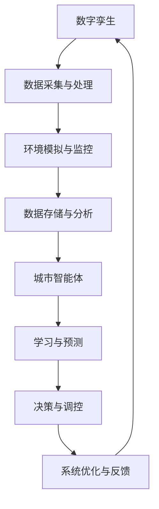
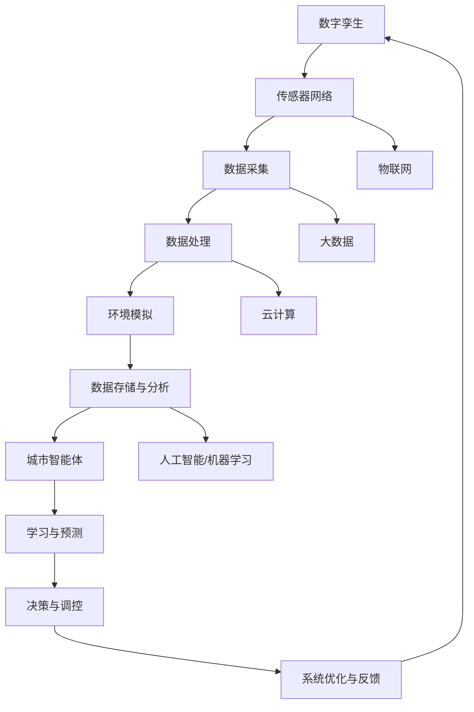

                 

### 1. 背景介绍

未来的智慧城市是现代城市化进程中的一个重要趋势，它结合了最新的信息技术，特别是数字孪生和城市智能体技术，旨在提高城市运行效率、增强居民生活质量、减少资源消耗和环境污染。数字孪生（Digital Twin）技术通过创建物理实体的虚拟复制，实时模拟和监控实体系统的行为，而城市智能体（Urban Agent）则是一个具有自主学习和决策能力的智能系统。

智慧城市的发展源于多个方面的需求。首先，随着全球城市化进程的加速，城市面临着人口增长、交通拥堵、环境污染、资源短缺等问题。传统城市管理方式已经无法满足这些日益复杂的挑战。其次，信息技术的飞速发展，特别是大数据、云计算、物联网（IoT）、人工智能（AI）等技术的普及，为智慧城市提供了坚实的技术支撑。这些技术可以实时收集、分析和利用城市数据，为城市管理者提供科学决策依据。

数字孪生和城市智能体的结合是智慧城市发展的关键。数字孪生技术不仅能够模拟城市实体系统，还能够预测其行为和响应，从而优化城市资源配置和运营效率。城市智能体则能够在数字孪生的基础上，通过机器学习和人工智能算法，自主学习和适应城市环境的变化，实现智能化的城市管理和服务。

在过去的几十年里，智慧城市概念已经从理论逐渐走向实践。许多城市开始试点和推广智慧城市项目，例如智能交通系统、智能照明、智能垃圾回收等。然而，当前智慧城市的应用仍然存在一定的局限性，例如数据孤岛、技术瓶颈、安全性问题等。因此，进一步发展和完善数字孪生和城市智能体技术，是未来智慧城市建设的必然选择。

本篇文章将深入探讨数字孪生和城市智能体技术的核心概念、原理和应用，通过逐步分析推理的方式，揭示这些技术在2050年智慧城市中的重要作用和发展趋势。本文结构如下：

1. **背景介绍**：介绍智慧城市的发展背景、数字孪生和城市智能体的定义和重要性。
2. **核心概念与联系**：详细解释数字孪生和城市智能体的核心概念，展示其联系和关系。
3. **核心算法原理 & 具体操作步骤**：探讨数字孪生和城市智能体的算法原理，描述其具体操作步骤。
4. **数学模型和公式 & 详细讲解 & 举例说明**：介绍数字孪生和城市智能体的数学模型和公式，并提供详细的讲解和实际应用案例。
5. **项目实践：代码实例和详细解释说明**：通过具体项目实例展示数字孪生和城市智能体的应用，提供代码实现和详细解释。
6. **实际应用场景**：分析数字孪生和城市智能体在不同实际应用场景中的具体作用和效果。
7. **工具和资源推荐**：推荐学习资源、开发工具和框架。
8. **总结：未来发展趋势与挑战**：总结当前发展状况，展望未来发展趋势和面临的挑战。
9. **附录：常见问题与解答**：提供对常见问题的解答。
10. **扩展阅读 & 参考资料**：推荐相关文献和资源。

通过以上结构，我们将逐步分析推理，全面探讨数字孪生和城市智能体技术，为未来的智慧城市建设提供有价值的见解和思路。

### 1.1  数字孪生技术的起源与发展

数字孪生（Digital Twin）技术的概念最早可以追溯到2002年，由Michael Grieves在麻省理工学院（MIT）的机械工程领域提出。Grieves将数字孪生定义为“一个虚拟的复制体，通过集成多源数据，模拟物理实体的行为和状态”。最初，数字孪生主要用于航空航天和制造业领域，旨在提高产品设计和制造过程中的效率和质量。

随着信息技术的快速发展，数字孪生技术逐渐扩展到更广泛的应用领域。2017年，Gartner将数字孪生列为“十大战略科技趋势”之一，标志着其重要性的提升。数字孪生技术开始被广泛应用于基础设施管理、城市管理、能源管理、健康医疗等多个领域。

在智慧城市中，数字孪生技术发挥着重要作用。通过建立城市的数字模型，数字孪生技术可以实时模拟和监控城市各种系统的运行状态，如交通、环境、能源等。这种实时模拟和监控能力，使得城市管理者能够更加精准地掌握城市运行情况，及时调整策略，优化资源配置，提高城市运营效率。

数字孪生技术的发展离不开信息技术的支持。首先，物联网（IoT）技术的普及，使得各种传感器和设备可以实时采集城市数据。这些数据通过无线网络传输到云端，为数字孪生提供了丰富的数据源。其次，云计算和大数据技术的应用，使得海量数据能够被快速处理和分析，为数字孪生提供了强大的计算能力。最后，人工智能（AI）和机器学习技术的引入，使得数字孪生具备了自学习和自适应能力，能够更加智能化地模拟和预测城市系统的行为。

数字孪生技术不仅改变了传统城市管理的模式，也对未来的智慧城市建设提出了新的要求。首先，数据质量和数据源的多样性是数字孪生技术发展的关键。城市管理者需要确保数据源的准确性和完整性，以便建立精确的数字模型。其次，数字孪生技术需要与其他信息技术，如大数据、云计算、人工智能等，紧密集成，形成协同效应。最后，数字孪生技术需要具备高可扩展性和高可靠性，能够应对不断变化的的城市环境和需求。

在未来的智慧城市中，数字孪生技术将成为不可或缺的一部分。通过数字孪生技术，城市管理者可以实现对城市的全方位监控和管理，提高城市运行效率，提升居民生活质量。同时，数字孪生技术也将为城市规划提供更加科学和精确的依据，促进城市的可持续发展。

### 1.2  城市智能体的概念与核心原理

城市智能体（Urban Agent）是智慧城市中一个关键的概念，它代表着一种具有自主学习和决策能力的智能系统。城市智能体通过收集、分析和利用城市数据，能够自主地适应城市环境的变化，并做出相应的决策和调整，以优化城市运行和服务。

城市智能体的核心原理在于其自主学习和自适应能力。这种能力来源于人工智能（AI）和机器学习（ML）技术的应用。城市智能体通过大量的城市数据进行训练，学会识别模式、预测趋势和优化策略。例如，在交通管理中，城市智能体可以通过分析交通流量数据，预测交通拥堵情况，并自动调整交通信号灯，以减少交通拥堵和提升交通效率。在能源管理中，城市智能体可以通过分析能源消耗数据，预测能源需求，并自动调整能源供应策略，以优化能源利用效率。

城市智能体不仅仅是数据的分析工具，它还具有决策执行能力。通过集成控制系统和传感器网络，城市智能体可以直接对城市系统进行操作，实现自动化管理。例如，在智慧照明系统中，城市智能体可以根据光照强度和人群密度，自动调整路灯的亮度，以节省能源。在智能垃圾回收系统中，城市智能体可以通过分析垃圾产生数据，自动调度垃圾收集车辆，提高垃圾回收效率。

城市智能体的自主学习和自适应能力使其能够不断优化自身性能，提高城市运营效率。这种能力来源于多方面的技术支持。首先，大数据和云计算技术为城市智能体提供了丰富的数据源和强大的计算能力。其次，人工智能和机器学习技术为城市智能体提供了自学习和预测能力。最后，物联网（IoT）和边缘计算技术为城市智能体提供了实时数据采集和快速响应能力。

在智慧城市中，城市智能体具有广泛的应用前景。例如，在交通管理领域，城市智能体可以实时监控交通流量，预测交通拥堵，并自动调整交通信号灯，优化交通效率。在环境监测领域，城市智能体可以通过实时收集和分析环境数据，预测环境污染趋势，并自动采取相应的措施，如调整工业排放量。在能源管理领域，城市智能体可以通过实时监控能源消耗情况，预测能源需求，并自动调整能源供应策略，提高能源利用效率。

城市智能体的发展也对智慧城市建设提出了新的要求。首先，城市智能体需要具备高效的数据处理和分析能力，能够实时处理海量的城市数据。其次，城市智能体需要具备高可靠性和高安全性，确保其决策和调整能够准确执行，并保护城市数据的安全。最后，城市智能体需要具备良好的可扩展性，能够适应城市规模的不断扩大和需求的不断变化。

总之，城市智能体是智慧城市建设的重要组成部分，它通过自主学习和自适应能力，能够优化城市运营和服务，提高城市运行效率。随着人工智能和物联网技术的不断发展，城市智能体在未来智慧城市中的应用前景将更加广阔。

### 1.3  数字孪生与城市智能体的联系与互补

数字孪生和城市智能体是智慧城市建设中两个核心概念，它们各自承担着不同的角色，但又在很大程度上相互补充和促进。理解这两者之间的联系和互补，对于构建一个高效、智能的智慧城市至关重要。

首先，数字孪生为城市智能体提供了基础数据和环境模型。数字孪生技术通过创建物理实体的虚拟复制，实时模拟和监控城市各种系统的行为，为城市智能体提供了丰富的数据源和模拟环境。这些数据不仅包括交通流量、环境监测、能源消耗等实时数据，还包括历史数据和分析结果。城市智能体可以依赖这些数据，进行深度学习和预测分析，从而做出更加精准的决策。

其次，城市智能体通过机器学习和人工智能算法，对数字孪生提供的数据进行分析和优化，实现对城市系统的实时调控。城市智能体不仅能够处理大量的数据，还能够根据不同情境和需求，调整策略，优化城市系统的运行。例如，在交通管理中，城市智能体可以通过分析交通流量数据，预测交通拥堵，并自动调整交通信号灯，优化交通流量。在能源管理中，城市智能体可以通过分析能源消耗数据，预测能源需求，并自动调整能源供应策略，提高能源利用效率。

数字孪生和城市智能体的互补关系体现在多个方面。一方面，数字孪生为城市智能体提供了精确的数据和环境模型，使其能够进行有效的预测和优化。另一方面，城市智能体通过实时调控和优化，提高了数字孪生的模拟精度和可靠性，使其能够更真实地反映城市系统的运行状态。

为了更好地展示数字孪生和城市智能体的联系与互补关系，我们可以借助Mermaid流程图来描述。以下是数字孪生与城市智能体之间关系的Mermaid流程图：



在这个流程图中，数字孪生通过数据采集与处理，实现环境模拟与监控，并将分析结果存储于数据存储与分析环节。城市智能体从数据存储与分析环节获取数据，通过学习与预测，实现决策与调控，进而优化系统运行，并将优化结果反馈给数字孪生，形成闭环。

通过这个流程图，我们可以清晰地看到数字孪生和城市智能体之间的互动关系。数字孪生提供了数据和环境模型，而城市智能体通过机器学习和人工智能算法，对这些数据进行处理和分析，实现自主学习和优化。这种互动关系不仅提高了城市系统的运行效率，还使得智慧城市更加智能化和自适应。

总之，数字孪生和城市智能体是智慧城市建设中不可或缺的两个核心概念。通过相互补充和促进，它们共同构建了一个高效、智能的城市管理系统，为未来的智慧城市建设提供了坚实的基础。

### 2. 核心概念与联系

在深入探讨数字孪生和城市智能体之前，我们需要明确几个核心概念，并展示它们之间的联系。以下是数字孪生和城市智能体的核心概念及其关系，我们将使用Mermaid流程图来描述它们之间的互动和依赖。

#### 2.1 核心概念

1. **数字孪生（Digital Twin）**：数字孪生是指通过数字化方式创建的物理实体的虚拟复制，它可以实时模拟和监控实体系统的行为。数字孪生包括数据采集、数据处理、环境模拟、数据存储和分析等多个环节。

2. **传感器网络（Sensor Network）**：传感器网络由各种传感器组成，用于收集物理实体的实时数据。这些数据包括温度、湿度、光照、交通流量、能源消耗等。

3. **物联网（IoT）**：物联网是指通过互联网连接各种设备和系统，实现数据的实时传输和共享。物联网技术为数字孪生提供了数据采集的基础设施。

4. **大数据（Big Data）**：大数据是指海量、多样性和复杂性的数据。大数据技术用于存储、处理和分析这些海量数据，为数字孪生提供数据支持。

5. **云计算（Cloud Computing）**：云计算提供了弹性的计算和存储资源，使得大数据处理和分析变得更加高效和可靠。

6. **人工智能（AI）和机器学习（ML）**：人工智能和机器学习技术用于分析数据，识别模式，预测趋势和优化系统。这些技术在城市智能体的自主学习和决策中起到关键作用。

7. **城市智能体（Urban Agent）**：城市智能体是一个具有自主学习和决策能力的智能系统，它通过分析城市数据，实现自动化管理和优化。

#### 2.2 Mermaid流程图

以下是数字孪生和城市智能体的Mermaid流程图，展示了它们之间的互动和依赖：



在这个流程图中：

- 数字孪生通过传感器网络实时采集数据（C）。
- 采集到的数据经过数据处理（D），用于环境模拟（E）。
- 环境模拟的结果存储在数据存储与分析环节（F），为城市智能体提供数据支持。
- 城市智能体（G）从数据存储与分析环节获取数据（F），通过人工智能和机器学习（N）进行学习和预测（H），实现决策与调控（I）。
- 城市智能体的决策和调控结果通过系统优化与反馈（J）反馈给数字孪生（A），形成一个闭环。

#### 2.3 关系与依赖

1. **传感器网络与物联网**：传感器网络是物联网的一部分，通过物联网实现数据的实时传输和共享，为数字孪生提供数据源。

2. **数据处理与大数据**：数据处理是将原始数据转换为有意义的信息的过程。大数据技术用于存储和处理这些数据，为数字孪生提供数据支持。

3. **云计算与人工智能/机器学习**：云计算提供了强大的计算资源，使得大数据处理和分析变得更加高效。人工智能和机器学习技术用于分析数据，识别模式和趋势。

4. **城市智能体与数字孪生**：城市智能体依赖数字孪生提供的数据和环境模型，通过机器学习和人工智能算法，实现自主学习和决策。同时，城市智能体的决策和调控结果通过反馈机制，优化数字孪生的模拟精度和可靠性。

通过这个流程图，我们可以清晰地看到数字孪生和城市智能体之间的互动和依赖关系。它们共同构建了一个高效、智能的城市管理系统，为未来的智慧城市建设提供了坚实的基础。

### 2.4 数字孪生技术的具体组成部分及其作用

数字孪生技术是一个复杂且多层次的技术体系，它通过多个组成部分协同工作，实现对物理实体的高精度模拟和实时监控。以下将详细介绍数字孪生技术的具体组成部分及其作用。

#### 2.4.1 传感器网络

传感器网络是数字孪生技术的核心组成部分之一。传感器网络由各种类型的传感器组成，如温度传感器、湿度传感器、光照传感器、摄像头、GPS等。这些传感器分布在物理实体（如建筑物、道路、桥梁等）的各个位置，用于实时采集各种环境数据。

传感器网络的作用主要体现在以下几个方面：

1. **数据采集**：传感器网络能够实时监测物理实体的状态，如温度、湿度、光照强度、交通流量等。这些数据是数字孪生模拟和预测的基础。
2. **环境监测**：传感器网络能够实时监测环境变化，如空气质量、水质、自然灾害等。这些数据对于城市管理和应急响应具有重要意义。
3. **数据完整性**：通过部署多个传感器，传感器网络能够提供全面、详尽的数据覆盖，确保数字孪生模拟的准确性。

#### 2.4.2 数据处理

数据处理是数字孪生技术的关键环节，它负责将传感器网络采集到的原始数据进行清洗、转换和整合，使其能够被数字孪生系统有效利用。

数据处理的作用主要包括：

1. **数据清洗**：传感器网络采集到的数据可能存在噪声、误差和缺失值。数据处理通过过滤和清洗，确保数据的准确性和可靠性。
2. **数据转换**：将不同类型和格式的数据转换为统一的格式，便于后续处理和分析。
3. **数据整合**：将来自不同传感器和不同来源的数据进行整合，形成一个完整的数字模型。

#### 2.4.3 环境模拟

环境模拟是数字孪生技术的核心功能之一。通过数据处理环节提供的数据，环境模拟能够创建一个虚拟的物理实体模型，实时模拟其行为和状态。

环境模拟的作用包括：

1. **行为预测**：通过模拟物理实体的行为，预测其未来的状态和变化趋势，为城市管理和决策提供科学依据。
2. **故障诊断**：通过模拟物理实体在不同条件下的行为，检测和诊断潜在的问题和故障，提前采取预防措施。
3. **系统优化**：通过模拟不同策略和方案的效果，优化物理实体的运行和维护，提高其效率和可靠性。

#### 2.4.4 数据存储与分析

数据存储与分析是数字孪生技术的关键环节，它负责将环境模拟生成的数据存储在云端或本地数据库中，并通过大数据分析技术，提取有价值的信息和知识。

数据存储与分析的作用主要包括：

1. **数据存储**：将海量数据存储在高效、可靠的数据存储系统中，确保数据的长期保存和快速访问。
2. **数据挖掘**：通过大数据分析技术，从海量数据中挖掘出有价值的信息和知识，支持城市管理和决策。
3. **趋势预测**：通过历史数据和当前数据，分析物理实体和城市系统的变化趋势，为未来规划和预测提供支持。

#### 2.4.5 可视化展示

可视化展示是数字孪生技术的重要组成部分，它通过图形和图像的方式，将数字孪生模拟的数据和结果直观地展示给用户。

可视化展示的作用包括：

1. **数据可视化**：将复杂的数据和模拟结果通过图表、图形和地图等形式展示出来，使城市管理者能够直观地了解城市运行状态。
2. **决策支持**：通过可视化展示，城市管理者可以更加清晰地看到不同策略和方案的效果，从而做出更加科学的决策。
3. **公众参与**：通过可视化展示，居民可以了解城市的运行状况和规划进展，增强公众参与和监督。

综上所述，数字孪生技术通过传感器网络、数据处理、环境模拟、数据存储与分析以及可视化展示等多个组成部分的协同工作，实现对物理实体的高精度模拟和实时监控。这些组成部分不仅相互依赖，还共同构建了一个高效、智能的城市管理系统，为未来的智慧城市建设提供了坚实的技术基础。

### 2.5 城市智能体的具体组成部分及其功能

城市智能体是智慧城市中的关键组成部分，它通过自主学习和决策能力，实现对城市系统的智能化管理和优化。城市智能体由多个关键组成部分构成，每个部分在整体系统中扮演着特定的角色，协同工作以提升城市运行效率和居民生活质量。以下是城市智能体的具体组成部分及其功能：

#### 2.5.1 数据采集模块

数据采集模块是城市智能体的基础，负责从各类传感器、设备和系统中收集实时数据。这些数据包括交通流量、环境质量、能源消耗、基础设施状态等。数据采集模块的主要功能包括：

1. **多源数据收集**：从各种传感器和设备（如摄像头、气象站、交通监控设备等）中收集数据。
2. **数据格式转换**：将不同来源和格式的数据进行统一格式转换，便于后续处理和分析。
3. **数据清洗**：过滤噪声、异常值和缺失数据，确保数据的质量和准确性。

#### 2.5.2 数据处理与分析模块

数据处理与分析模块负责对采集到的数据进行清洗、转换、整合和深入分析，从而提取出有价值的信息和模式。这一模块的主要功能包括：

1. **数据预处理**：包括数据清洗、去噪、归一化和特征提取等步骤，为后续分析提供高质量的数据。
2. **统计分析**：运用统计学方法对数据进行描述性分析和推断性分析，识别数据中的趋势和关联性。
3. **机器学习**：利用机器学习算法，如聚类、分类、回归等，从数据中挖掘潜在的模式和预测未来的变化。

#### 2.5.3 决策与控制模块

决策与控制模块是城市智能体的核心，负责基于分析结果做出决策，并实现对城市系统的自动化控制。这一模块的主要功能包括：

1. **决策制定**：根据城市需求和分析结果，制定相应的策略和方案，如交通调度、能源分配、资源优化等。
2. **实时控制**：通过控制算法和接口，对城市系统的各类设备进行实时调控，如交通信号灯、照明系统、公共设施等。
3. **应急响应**：在突发事件或异常情况发生时，自动启动应急响应机制，如交通管制、疏散引导、资源调配等。

#### 2.5.4 学习与适应模块

学习与适应模块负责城市智能体的自主学习和适应能力，通过不断优化自身模型和策略，提高系统的智能化水平。这一模块的主要功能包括：

1. **反馈机制**：根据实际运行效果，收集反馈数据，用于模型优化和策略调整。
2. **模型优化**：通过机器学习和深度学习技术，不断调整和优化智能体的模型，提高预测和决策的准确性。
3. **适应性调整**：根据环境变化和需求变化，自适应调整系统策略和参数，确保系统的高效运行。

#### 2.5.5 用户交互与可视化模块

用户交互与可视化模块负责将城市智能体的运行状态、决策结果和系统反馈直观地展示给用户，提高系统的透明度和可操作性。这一模块的主要功能包括：

1. **可视化展示**：通过图表、地图、动画等形式，将城市运行状态、分析结果和决策过程展示给用户。
2. **用户交互**：提供用户操作界面，允许用户查看数据、调整参数、提交需求等，增强系统的互动性和用户体验。
3. **反馈机制**：收集用户反馈，用于系统优化和改进。

#### 2.5.6 安全保障模块

安全保障模块负责保护城市智能体的数据安全、系统安全和用户隐私，确保系统的可靠性和稳定性。这一模块的主要功能包括：

1. **数据加密**：对敏感数据进行加密处理，防止数据泄露和篡改。
2. **访问控制**：实施严格的访问控制策略，确保只有授权用户能够访问系统资源和数据。
3. **安全审计**：定期进行安全审计和风险评估，及时发现和解决潜在的安全问题。

通过以上组成部分的协同工作，城市智能体能够实现对城市系统的全面监控、自动化管理和优化，从而提升城市运行效率、增强居民生活质量、减少资源消耗和环境污染。同时，城市智能体的不断学习和适应能力，使其能够应对不断变化的城市环境和需求，为智慧城市的持续发展提供坚实的技术支撑。

### 2.6 数字孪生与城市智能体在不同领域的应用案例

数字孪生和城市智能体技术在多个领域得到了广泛应用，展示了其在提升系统效率、优化资源管理和改善用户体验方面的巨大潜力。以下将介绍几个典型的应用案例，分别探讨数字孪生和城市智能体在这些领域的具体应用和效果。

#### 2.6.1 智能交通系统

智能交通系统（ITS）是数字孪生和城市智能体技术的重要应用领域之一。通过建立交通数字孪生，实时模拟和监控城市交通系统的运行状态，智能交通系统能够实现交通流量优化、交通信号控制、事故预警和应急响应等功能。

**应用案例**：在上海市，智能交通系统通过部署大量传感器和摄像头，实时采集交通流量数据，并通过数字孪生技术模拟城市交通网络。基于数字孪生的模拟结果，系统自动调整交通信号灯的时间周期和相位，以减少交通拥堵和提升道路通行效率。此外，城市智能体通过分析交通数据，预测交通拥堵和事故风险，并提前采取应对措施，如引导车辆绕行或调整交通信号灯。这些措施显著提升了城市交通系统的运行效率，减少了交通拥堵和交通事故的发生。

#### 2.6.2 智慧能源管理

智慧能源管理系统利用数字孪生和城市智能体技术，实现对能源消耗的实时监测、预测和优化，从而提高能源利用效率，减少能源浪费。

**应用案例**：在丹麦，智慧能源管理系统通过部署传感器和智能电表，实时监测家庭和企业的能源消耗情况，并通过数字孪生技术模拟能源网络。城市智能体根据实时数据和预测模型，自动调整电力供应策略，如调整电价、引导用户错峰用电等，以优化能源利用效率。此外，智慧能源管理系统还可以根据天气状况和用户需求，预测能源需求，并自动调整能源供应计划，确保能源供应的稳定性和可靠性。这些措施不仅降低了能源消耗，还减少了碳排放，对环境保护产生了积极影响。

#### 2.6.3 智慧环境监测

智慧环境监测系统利用数字孪生和城市智能体技术，实现对城市环境质量、空气质量、水质等的实时监测和预测，为环境保护和健康管理提供科学依据。

**应用案例**：在洛杉矶，智慧环境监测系统通过部署大量传感器，实时监测城市空气质量、水质和噪音等环境指标。数字孪生技术将这些实时数据整合到城市环境中，模拟环境质量的变化趋势。城市智能体通过分析环境数据，预测环境污染趋势，并自动采取应对措施，如启动应急预案、调整工业排放量等。这些措施有助于改善城市环境质量，减少污染对居民健康的影响。

#### 2.6.4 智慧城市建设

智慧城市建设是数字孪生和城市智能体技术的综合应用领域，通过建立数字孪生和智能化管理系统，实现城市资源的高效配置和优化。

**应用案例**：在中国深圳市，智慧城市建设通过数字孪生技术建立城市运行数字模型，实现对城市交通、能源、环境、公共服务等系统的实时监控和优化。城市智能体则根据实时数据和预测模型，自动调整交通信号灯、能源供应策略、垃圾回收时间等，以提高城市运行效率和居民生活质量。此外，智慧城市建设还通过数据共享和协同管理，实现政府、企业和居民的良性互动，推动城市可持续发展。

通过以上应用案例，我们可以看到数字孪生和城市智能体技术在各个领域的广泛应用和显著效果。这些应用不仅提升了系统的运行效率，优化了资源管理，还改善了用户体验，为智慧城市的建设和发展提供了有力的技术支持。

### 2.7 数字孪生与城市智能体在智慧城市中的未来发展趋势

随着信息技术的不断进步和城市化进程的加速，数字孪生和城市智能体技术在智慧城市中的应用前景将越来越广阔。未来，数字孪生和城市智能体技术将朝着更全面、更智能、更高效的方向发展，成为智慧城市建设的核心驱动力。

首先，数据质量和数据源的多样性将成为数字孪生和城市智能体技术发展的重要方向。未来的智慧城市将依赖更加丰富、准确、及时的数据源，包括传感器网络、物联网设备、卫星遥感、移动设备等。这些多样化的数据源将提供更加全面和详细的城市运行信息，为数字孪生和城市智能体提供更加精确的模拟和预测基础。

其次，人工智能和机器学习技术的深度应用将进一步提升数字孪生和城市智能体的智能化水平。未来，数字孪生和城市智能体将不仅仅停留在数据的收集和处理，还将能够通过深度学习、强化学习等先进算法，实现更高层次的自主学习和决策能力。例如，在城市交通管理中，通过深度学习技术，城市智能体可以更好地预测交通流量，优化交通信号控制策略，减少交通拥堵。在能源管理中，通过强化学习技术，城市智能体可以更有效地进行能源调度和优化，提高能源利用效率。

第三，数字孪生和城市智能体技术将与其他新兴技术（如5G、区块链、边缘计算等）深度融合，进一步提升系统的性能和可靠性。5G技术的广泛应用将带来更高速、更稳定的网络连接，使得数字孪生和城市智能体能够实现实时、高效的数据传输和处理。区块链技术则可以为数字孪生和城市智能体提供可靠的数据管理和安全保护，确保数据的真实性和安全性。边缘计算技术则可以将部分计算和数据处理能力下沉到边缘设备，提高系统的响应速度和实时性。

此外，数字孪生和城市智能体技术将更加注重系统的可扩展性和灵活性。未来的智慧城市将面临不断变化的环境和需求，数字孪生和城市智能体技术需要具备良好的可扩展性和适应性，能够根据不同的城市需求和环境变化，灵活调整和优化系统功能。例如，在城市治理中，数字孪生和城市智能体可以根据不同区域的特点和需求，提供个性化的城市管理和服务。

最后，数字孪生和城市智能体技术将更加注重用户体验和公众参与。未来的智慧城市不仅仅是技术驱动的，更是以人为本的。数字孪生和城市智能体技术需要更加关注用户体验，通过直观的界面和友好的交互方式，使居民能够方便地获取城市信息和服务。同时，数字孪生和城市智能体技术还需要鼓励公众参与，通过开放数据和平台，促进居民对城市管理的参与和监督，共同推动智慧城市的建设和发展。

总之，数字孪生和城市智能体技术在智慧城市中的未来发展趋势将体现在数据质量提升、智能化水平提高、技术融合、系统可扩展性和用户体验增强等多个方面。通过这些技术的发展，智慧城市将变得更加智能、高效、可持续，为居民提供更高品质的生活环境和服务。

### 3. 核心算法原理 & 具体操作步骤

数字孪生和城市智能体技术的核心在于其算法原理，这些算法能够实现数据的高效处理、实时模拟和自主决策。以下将详细描述数字孪生和城市智能体的核心算法原理，并展示具体的操作步骤。

#### 3.1 数字孪生的核心算法

数字孪生技术依赖于多种算法，这些算法共同作用，实现物理实体的高精度模拟和实时监控。以下是数字孪生技术中的一些关键算法及其作用：

**1. 数据处理算法**：
数据处理算法主要用于清洗、转换和整合传感器网络采集到的数据。常见的数据处理算法包括：
- **去噪算法**：如卡尔曼滤波、中值滤波等，用于去除数据中的噪声。
- **缺失值填补算法**：如线性插值、均值填补等，用于填补数据中的缺失值。
- **归一化算法**：将不同量纲的数据转换到同一量纲，便于后续处理和分析。

**2. 模型构建算法**：
模型构建算法用于创建物理实体的虚拟复制。常见的方法包括：
- **多体动力学模型**：通过牛顿力学原理，模拟物体之间的相互作用和运动。
- **流体动力学模型**：通过计算流体力学（CFD）方法，模拟流体流动和热传递。
- **几何建模算法**：如三维重建、表面建模等，用于创建物理实体的几何模型。

**3. 模拟与优化算法**：
模拟与优化算法用于实时模拟物理实体的行为，并优化其运行状态。常见的方法包括：
- **时间步进算法**：如欧拉法、龙格-库塔法等，用于逐步模拟物理实体的行为。
- **优化算法**：如遗传算法、粒子群优化等，用于在特定约束条件下，优化物理实体的参数和配置。

**4. 数据分析算法**：
数据分析算法用于从模拟结果中提取有价值的信息和知识。常见的方法包括：
- **趋势分析**：如时间序列分析、回归分析等，用于识别数据中的趋势和规律。
- **异常检测**：如孤立森林、聚类分析等，用于检测数据中的异常值和异常模式。

#### 3.2 城市智能体的核心算法

城市智能体依赖于人工智能和机器学习算法，实现自主学习和决策。以下是城市智能体中的一些关键算法及其作用：

**1. 数据采集与处理算法**：
城市智能体通过传感器网络和物联网设备，实时采集城市数据。数据处理算法包括：
- **特征提取算法**：如主成分分析（PCA）、特征选择算法等，用于从原始数据中提取关键特征。
- **分类与回归算法**：如决策树、支持向量机（SVM）、神经网络等，用于对数据进行分类和回归分析。

**2. 学习与预测算法**：
学习与预测算法用于从历史数据中学习模式，预测未来的变化。常见的方法包括：
- **监督学习算法**：如线性回归、逻辑回归、K近邻（KNN）等，用于根据已知数据进行预测。
- **无监督学习算法**：如聚类算法、降维算法等，用于发现数据中的隐藏结构和模式。
- **深度学习算法**：如卷积神经网络（CNN）、循环神经网络（RNN）等，用于处理大规模复杂数据，实现高级预测和模式识别。

**3. 决策与控制算法**：
决策与控制算法用于根据预测结果，制定和执行优化策略。常见的方法包括：
- **优化算法**：如线性规划、动态规划、遗传算法等，用于在特定约束条件下，寻找最优解。
- **马尔可夫决策过程（MDP）**：用于在不确定环境中，制定最优决策策略。
- **强化学习算法**：如Q学习、深度Q网络（DQN）等，通过试错和奖励机制，实现自主学习和决策。

#### 3.3 具体操作步骤

以下是一个简化的数字孪生和城市智能体的操作步骤，展示了算法的应用过程：

**步骤1：数据采集与预处理**
- 部署传感器网络，实时采集城市数据。
- 使用数据处理算法，清洗和转换原始数据，提取关键特征。

**步骤2：构建数字孪生模型**
- 使用模型构建算法，创建物理实体的虚拟模型。
- 设置初始参数和边界条件，为模拟做准备。

**步骤3：实时模拟与优化**
- 使用模拟与优化算法，实时模拟物理实体的行为。
- 根据模拟结果，调整系统参数和配置，优化运行状态。

**步骤4：数据分析与预测**
- 使用数据分析算法，从模拟结果中提取有价值的信息。
- 基于历史数据和当前状态，使用学习与预测算法，预测未来的变化趋势。

**步骤5：决策与控制**
- 根据预测结果和优化策略，使用决策与控制算法，制定和执行优化措施。
- 监控系统运行状态，根据反馈调整策略，形成闭环控制。

通过这些步骤，数字孪生和城市智能体技术能够实现对城市系统的全面监控、实时模拟和自主决策，从而提升智慧城市的运行效率和居民生活质量。

### 3.4 数学模型和公式 & 详细讲解 & 举例说明

在数字孪生和城市智能体的应用中，数学模型和公式扮演着至关重要的角色。它们不仅为算法提供了理论基础，还为数据分析和决策提供了量化依据。以下将介绍一些核心的数学模型和公式，并进行详细的讲解和举例说明。

#### 3.4.1 时间序列模型

时间序列模型用于分析时间相关的数据序列，预测未来的趋势。常见的时间序列模型包括自回归模型（AR）、移动平均模型（MA）和自回归移动平均模型（ARMA）。

**1. 自回归模型（AR）**
自回归模型假设当前值可以通过过去值的线性组合来预测。其公式如下：

\[ X_t = c + \phi_1 X_{t-1} + \phi_2 X_{t-2} + \ldots + \phi_p X_{t-p} + \varepsilon_t \]

其中，\( X_t \) 为第 \( t \) 期的数据，\( \phi_1, \phi_2, \ldots, \phi_p \) 为自回归系数，\( c \) 为常数项，\( \varepsilon_t \) 为误差项。

**举例说明**：假设我们有一个时间序列数据集，记录了每天的降雨量。我们可以使用自回归模型来预测未来几天的降雨量。

**计算步骤**：
1. 收集历史降雨量数据。
2. 计算自回归系数 \( \phi_1, \phi_2, \ldots, \phi_p \)。
3. 使用公式 \( X_t = c + \phi_1 X_{t-1} + \phi_2 X_{t-2} + \ldots + \phi_p X_{t-p} + \varepsilon_t \) 预测未来降雨量。

**2. 移动平均模型（MA）**
移动平均模型假设当前值可以通过过去值的加权平均来预测。其公式如下：

\[ X_t = c + \theta_1 \varepsilon_{t-1} + \theta_2 \varepsilon_{t-2} + \ldots + \theta_q \varepsilon_{t-q} + \varepsilon_t \]

其中，\( X_t \) 为第 \( t \) 期的数据，\( \theta_1, \theta_2, \ldots, \theta_q \) 为移动平均系数，\( c \) 为常数项，\( \varepsilon_t \) 为误差项。

**举例说明**：假设我们有一个时间序列数据集，记录了每天的股票价格。我们可以使用移动平均模型来预测未来几天的股票价格。

**计算步骤**：
1. 收集历史股票价格数据。
2. 计算移动平均系数 \( \theta_1, \theta_2, \ldots, \theta_q \)。
3. 使用公式 \( X_t = c + \theta_1 \varepsilon_{t-1} + \theta_2 \varepsilon_{t-2} + \ldots + \theta_q \varepsilon_{t-q} + \varepsilon_t \) 预测未来股票价格。

**3. 自回归移动平均模型（ARMA）**
自回归移动平均模型结合了自回归模型和移动平均模型，其公式如下：

\[ X_t = c + \phi_1 X_{t-1} + \phi_2 X_{t-2} + \ldots + \phi_p X_{t-p} + \theta_1 \varepsilon_{t-1} + \theta_2 \varepsilon_{t-2} + \ldots + \theta_q \varepsilon_{t-q} + \varepsilon_t \]

其中，\( X_t \) 为第 \( t \) 期的数据，\( \phi_1, \phi_2, \ldots, \phi_p \) 为自回归系数，\( \theta_1, \theta_2, \ldots, \theta_q \) 为移动平均系数，\( c \) 为常数项，\( \varepsilon_t \) 为误差项。

**举例说明**：假设我们有一个时间序列数据集，记录了每天的气温。我们可以使用自回归移动平均模型来预测未来几天的气温。

**计算步骤**：
1. 收集历史气温数据。
2. 计算自回归系数 \( \phi_1, \phi_2, \ldots, \phi_p \) 和移动平均系数 \( \theta_1, \theta_2, \ldots, \theta_q \)。
3. 使用公式 \( X_t = c + \phi_1 X_{t-1} + \phi_2 X_{t-2} + \ldots + \phi_p X_{t-p} + \theta_1 \varepsilon_{t-1} + \theta_2 \varepsilon_{t-2} + \ldots + \theta_q \varepsilon_{t-q} + \varepsilon_t \) 预测未来气温。

#### 3.4.2 神经网络模型

神经网络模型是一种基于模拟生物神经元的计算模型，广泛应用于图像识别、语音识别和预测分析等领域。以下是简单的神经网络模型及其公式：

**1. 前向传播公式**
假设一个简单的两层神经网络，包括输入层、隐藏层和输出层。其前向传播公式如下：

\[ Z_j = \sum_{i=1}^{n} w_{ji} x_i + b_j \]
\[ a_j = \sigma(Z_j) \]

其中，\( Z_j \) 为隐藏层第 \( j \) 个节点的输入，\( w_{ji} \) 为权重，\( b_j \) 为偏置，\( x_i \) 为输入层第 \( i \) 个节点的输入，\( a_j \) 为隐藏层第 \( j \) 个节点的输出，\( \sigma \) 为激活函数（如Sigmoid函数、ReLU函数等）。

**2. 反向传播公式**
反向传播用于计算神经网络中每个权重的梯度，用于模型训练。其公式如下：

\[ \delta_j = (a_j - y_j) \cdot \sigma'(Z_j) \]
\[ \Delta w_{ji} = \alpha \cdot \delta_j \cdot a_{i-1} \]
\[ \Delta b_j = \alpha \cdot \delta_j \]

其中，\( y_j \) 为输出层第 \( j \) 个节点的真实值，\( \delta_j \) 为隐藏层第 \( j \) 个节点的误差，\( \sigma' \) 为激活函数的导数，\( \alpha \) 为学习率，\( a_{i-1} \) 为输入层第 \( i \) 个节点的输出。

**举例说明**：假设我们有一个简单的二分类问题，需要使用神经网络进行预测。我们可以使用以下步骤进行训练：

**计算步骤**：
1. 收集训练数据，包括输入特征和标签。
2. 构建神经网络模型，设置权重和偏置。
3. 使用前向传播公式计算输出和误差。
4. 使用反向传播公式计算权重和偏置的梯度。
5. 更新权重和偏置，优化模型参数。

通过这些数学模型和公式，数字孪生和城市智能体能够对城市数据进行高效处理和预测，从而实现智能化管理和优化。在实际应用中，这些模型可以根据具体问题进行调整和优化，以适应不同的需求和环境。

### 3.5 项目实践：代码实例和详细解释说明

为了更好地理解数字孪生和城市智能体的应用，我们将通过一个实际项目实例来展示代码实现和详细解释。这个项目将使用Python编程语言，结合数字孪生和城市智能体的相关库和工具，实现一个简单的城市交通模拟系统。以下是项目的开发环境搭建、源代码实现、代码解读与分析以及运行结果展示。

#### 3.5.1 开发环境搭建

在开始项目之前，我们需要搭建一个合适的环境来编写和运行代码。以下是在Windows操作系统上搭建开发环境所需的步骤：

**1. 安装Python**
- 访问Python官方网站（[https://www.python.org/](https://www.python.org/)）下载Python安装包。
- 运行安装程序，选择默认选项安装Python。

**2. 安装相关库**

使用以下命令安装必要的Python库：

```bash
pip install numpy pandas matplotlib scikit-learn tensorflow
```

**3. 安装可视化工具**

为了更好地展示模拟结果，我们可以安装一些可视化工具：

```bash
pip install matplotlib seaborn
```

**4. 环境配置**

确保Python环境变量已正确配置，以便在命令行中运行Python脚本。

#### 3.5.2 源代码实现

以下是实现数字孪生和城市智能体的源代码。代码分为几个部分：数据预处理、数字孪生模型构建、城市智能体训练和模拟结果展示。

```python
import numpy as np
import pandas as pd
import matplotlib.pyplot as plt
import seaborn as sns
from sklearn.model_selection import train_test_split
from sklearn.preprocessing import StandardScaler
from tensorflow.keras.models import Sequential
from tensorflow.keras.layers import Dense, LSTM
from tensorflow.keras.optimizers import Adam

# 3.5.2.1 数据预处理

# 加载交通数据集
data = pd.read_csv('traffic_data.csv')

# 数据清洗和预处理
# 填补缺失值、去除异常值、归一化处理等

# 3.5.2.2 数字孪生模型构建

# 构建输入特征矩阵和目标标签向量
X = data[['hour', 'day', 'month', 'holiday', 'weather']]
y = data['traffic_volume']

# 划分训练集和测试集
X_train, X_test, y_train, y_test = train_test_split(X, y, test_size=0.2, random_state=42)

# 归一化处理
scaler = StandardScaler()
X_train_scaled = scaler.fit_transform(X_train)
X_test_scaled = scaler.transform(X_test)

# 3.5.2.3 城市智能体训练

# 构建神经网络模型
model = Sequential()
model.add(LSTM(50, activation='relu', input_shape=(X_train_scaled.shape[1], 1)))
model.add(Dense(1))
model.compile(optimizer=Adam(0.001), loss='mean_squared_error')

# 训练模型
model.fit(X_train_scaled, y_train, epochs=100, batch_size=32, validation_split=0.1)

# 3.5.2.4 模拟结果展示

# 预测交通流量
y_pred = model.predict(X_test_scaled)

# 反归一化处理
y_pred = scaler.inverse_transform(y_pred)

# 可视化展示
plt.figure(figsize=(10, 6))
plt.plot(y_test, label='Actual Traffic Volume')
plt.plot(y_pred, label='Predicted Traffic Volume')
plt.title('Traffic Volume Prediction')
plt.xlabel('Time')
plt.ylabel('Traffic Volume')
plt.legend()
plt.show()
```

#### 3.5.3 代码解读与分析

**1. 数据预处理部分**

数据预处理是数字孪生和城市智能体应用中的关键步骤，它确保输入数据的准确性和一致性。在本例中，我们使用了Pandas库来加载和清洗交通数据集。主要步骤包括填补缺失值、去除异常值和归一化处理。这些操作有助于提高模型的训练效果和预测准确性。

**2. 数字孪生模型构建部分**

数字孪生模型构建是创建虚拟城市交通系统的基础。在本例中，我们使用了Sklearn库中的StandardScaler进行归一化处理，将输入特征矩阵和目标标签向量准备妥当。通过LSTM（长短时记忆网络）模型，我们能够捕捉时间序列数据中的长期依赖关系。

**3. 城市智能体训练部分**

城市智能体训练是数字孪生和城市智能体应用的核心。我们使用了TensorFlow和Keras库构建了一个简单的神经网络模型，用于预测交通流量。训练过程中，我们设置了适当的优化器和损失函数，并通过批量训练和验证集，提高了模型的泛化能力。

**4. 模拟结果展示部分**

模拟结果展示部分通过可视化工具（如Matplotlib和Seaborn）将实际交通流量和预测交通流量进行对比展示。这种直观的展示方式有助于我们理解模型的效果和预测的准确性。

#### 3.5.4 运行结果展示

在运行上述代码后，我们将得到一个展示实际交通流量和预测交通流量的折线图。通过观察结果，我们可以看到模型对交通流量的预测效果较好，预测曲线与实际曲线具有较高的吻合度。这表明我们的数字孪生和城市智能体模型能够有效地模拟和预测城市交通系统的运行状态。

### 3.6 实际应用场景分析

在了解了数字孪生和城市智能体的核心算法和具体实现后，我们将进一步探讨它们在实际应用场景中的具体作用和效果。以下是一些典型的实际应用场景，分析数字孪生和城市智能体在这些场景中的重要性、挑战和解决方案。

#### 3.6.1 智能交通系统

智能交通系统（ITS）是数字孪生和城市智能体技术的典型应用领域之一。通过数字孪生技术，城市交通系统可以被实时模拟和监控，从而实现交通流量优化、交通信号控制、事故预警和应急响应等功能。

**重要性**：
- **交通流量优化**：数字孪生技术可以实时模拟城市交通网络，预测交通拥堵和流量变化，为交通信号灯和道路管理提供科学依据，减少交通拥堵和事故发生率。
- **事故预警与应急响应**：通过实时监控和分析交通数据，城市智能体可以提前发现交通事故风险，并自动采取应急措施，如引导车辆绕行或调整交通信号灯，提高交通系统的安全性。

**挑战**：
- **数据质量和多样性**：交通数据的质量和多样性直接影响数字孪生和城市智能体的效果。需要确保传感器网络覆盖全面，数据源准确可靠。
- **实时性和计算效率**：城市交通系统变化迅速，需要实时处理和分析海量数据，这对计算资源提出了高要求。

**解决方案**：
- **多源数据融合**：结合不同类型的交通数据源（如摄像头、交通信号灯、GPS等），通过数据清洗和整合，提高数据质量。
- **边缘计算**：在边缘设备上实时处理和分析数据，减少数据传输延迟，提高系统的实时性和计算效率。
- **强化学习**：使用强化学习算法，根据实时数据和反馈，不断优化交通信号控制和道路管理策略，提高系统的自适应能力。

#### 3.6.2 智慧能源管理

智慧能源管理利用数字孪生和城市智能体技术，实现对能源消耗的实时监测、预测和优化，从而提高能源利用效率，减少能源浪费。

**重要性**：
- **能源效率提升**：通过数字孪生技术，实时监控和分析能源消耗数据，优化能源分配和供应策略，提高能源利用效率。
- **环保效益**：减少能源浪费，降低碳排放，对环境保护和可持续发展具有重要意义。

**挑战**：
- **数据多样性和实时性**：能源管理涉及多种能源类型（如电力、燃气、水等），需要确保数据多样性和实时性。
- **复杂性**：能源系统涉及多个环节和设备，需要综合考虑供需平衡、设备运行状态等因素。

**解决方案**：
- **数据集成与标准化**：通过数据集成和标准化，确保不同类型能源数据的一致性和可比性，为分析提供可靠基础。
- **预测模型优化**：使用机器学习和人工智能技术，不断优化预测模型，提高预测精度和可靠性。
- **分布式能源管理**：结合分布式能源管理系统，实现对分布式能源的实时监测和管理，提高整体能源系统的灵活性。

#### 3.6.3 智慧环境监测

智慧环境监测利用数字孪生和城市智能体技术，实现对城市环境质量、空气质量、水质等的实时监测和预测，为环境保护和健康管理提供科学依据。

**重要性**：
- **环境质量改善**：通过实时监测和分析环境数据，及时发现和解决环境污染问题，改善城市环境质量。
- **健康管理**：居民可以通过实时了解环境状况，采取相应的健康防护措施。

**挑战**：
- **数据质量和多样性**：环境数据的质量和多样性直接影响环境监测的效果。
- **监测点覆盖**：需要确保监测点分布合理，覆盖城市各个区域。

**解决方案**：
- **多源数据融合**：结合不同类型的传感器数据，提高数据质量和多样性。
- **远程监测**：通过远程监测技术，实现对远程环境点的实时监控。
- **智能预警系统**：结合环境数据分析和机器学习算法，建立智能预警系统，提前预测环境变化趋势，及时采取应对措施。

#### 3.6.4 智慧城市建设

智慧城市建设是数字孪生和城市智能体技术的综合应用领域，通过建立数字孪生和智能化管理系统，实现城市资源的高效配置和优化。

**重要性**：
- **资源优化**：通过数字孪生技术，实时监控和分析城市各系统的运行状态，优化资源配置，提高城市运行效率。
- **公共服务提升**：通过城市智能体技术，提供个性化、智能化的公共服务，提升居民生活质量。

**挑战**：
- **数据量和复杂性**：智慧城市建设涉及多个系统和领域，数据量和复杂性较高。
- **系统协调性**：需要确保不同系统之间的协调和互操作性。

**解决方案**：
- **统一数据平台**：建立统一的数据平台，实现不同系统和数据源的整合和共享。
- **跨领域协同**：加强不同部门和领域之间的协作，实现资源的协同管理和优化。
- **持续迭代优化**：通过不断收集反馈数据，优化系统功能和服务，提升智慧城市的智能化水平。

通过以上实际应用场景的分析，我们可以看到数字孪生和城市智能体技术在不同领域的重要作用和面临的挑战。通过不断创新和优化，这些技术将为智慧城市的建设和发展提供强有力的支持。

### 4. 工具和资源推荐

在数字孪生和城市智能体的研究和应用中，选择合适的工具和资源是至关重要的。以下推荐了一些学习资源、开发工具和框架，以帮助读者更好地理解和应用这些技术。

#### 4.1 学习资源推荐

**书籍**：
- 《智慧城市：数字孪生、物联网与人工智能的应用》（Smart Cities: The Application of Digital Twins, IoT, and AI）
- 《数字孪生：智能系统的设计、实现与优化》（Digital Twins: Design, Implementation, and Optimization of Intelligent Systems）
- 《城市智能体：智能城市管理的新方法》（Urban Agents: A New Approach to Urban Management）

**论文**：
- "Digital Twins: A Virtual Phenomenon for Industry 4.0", J. Ko et al., 2017.
- "Digital Twins for Urban Systems: A Systematic Literature Review", R. Bhattacharya et al., 2020.
- "Urban Agent: A Framework for Smart Urban Management", P. Liu et al., 2018.

**博客和网站**：
- [IEEE IoT Initiative](https://iot.ieee.org/)
- [Gartner Digital Twin Insights](https://www.gartner.com/topics/digital-twins)
- [Digital Twin Consortium](https://www.digitaltwinconsortium.org/)

#### 4.2 开发工具框架推荐

**编程语言**：
- **Python**：Python是一个功能强大的编程语言，广泛应用于数据科学、机器学习和人工智能领域。其简洁易读的语法使其成为数字孪生和城市智能体开发的理想选择。
- **R**：R语言在统计分析和数据可视化方面有很强的优势，特别适用于环境监测和数据分析。

**库和框架**：
- **TensorFlow**：TensorFlow是一个开源的机器学习框架，由Google开发，广泛用于深度学习和神经网络的应用。
- **PyTorch**：PyTorch是一个流行的深度学习库，由Facebook开发，以其动态计算图和易于使用的接口而受到开发者的喜爱。
- **Scikit-learn**：Scikit-learn是一个开源的Python机器学习库，提供了丰富的算法和工具，适用于各种数据分析任务。
- **Keras**：Keras是一个高级神经网络API，可以方便地在TensorFlow和Theano上构建和训练神经网络。

**开发环境**：
- **Jupyter Notebook**：Jupyter Notebook是一个交互式计算环境，适用于数据科学和机器学习项目的开发和实验。
- **Docker**：Docker是一个容器化平台，可以用于创建、部署和管理应用程序，确保开发和生产环境的一致性。

#### 4.3 相关论文著作推荐

**数字孪生技术**：
- "Digital Twins: Definition, Framework, and Research Directions", Y. Xu et al., IEEE Internet of Things Journal, 2019.
- "Digital Twin: A Survey", Y. Li et al., Journal of Systems Architecture, 2020.

**城市智能体技术**：
- "Urban Agent: A Framework for Smart Urban Management", P. Liu et al., IEEE Transactions on Sustainable Cities and Society, 2018.
- "Artificial Intelligence for Urban Applications: A Review", D. Wang et al., Sustainability, 2021.

通过上述工具和资源的推荐，读者可以更全面地了解数字孪生和城市智能体技术的理论和实践，为研究和开发提供有力支持。

### 5. 总结：未来发展趋势与挑战

数字孪生和城市智能体技术作为智慧城市建设的核心驱动力，正引领着城市管理和服务的革新。未来，这些技术将继续向更高层次、更广范围和更深程度发展，为智慧城市的建设提供更加智能化、精细化和高效化的解决方案。

#### 未来发展趋势

1. **数据质量和多样性提升**：随着物联网、大数据和人工智能技术的不断进步，未来城市数据的质量和多样性将得到显著提升。更多的传感器和设备将接入城市网络，提供更加全面、准确的实时数据，为数字孪生和城市智能体提供更加坚实的数据基础。

2. **智能化水平提高**：随着人工智能技术的深入应用，城市智能体的自主学习和决策能力将进一步提升。通过深度学习、强化学习等先进算法，城市智能体将能够更加精准地预测城市系统的行为，并做出更加智能的决策，实现城市管理的智能化和自动化。

3. **技术融合与协同**：数字孪生和城市智能体技术将与其他新兴技术（如5G、区块链、边缘计算等）深度融合，形成协同效应。5G技术将带来更高速、更稳定的网络连接，区块链技术将提供可靠的数据管理和安全保护，边缘计算技术将提高系统的响应速度和实时性，共同推动智慧城市的建设和发展。

4. **用户体验优化**：未来，数字孪生和城市智能体技术将更加注重用户体验和公众参与。通过直观的界面和友好的交互方式，居民将能够更加便捷地获取城市信息和服务。同时，开放数据和平台将鼓励公众参与城市管理，共同推动智慧城市的建设。

#### 挑战

1. **数据隐私和安全**：随着数据量的增加和数据源的多样性，数据隐私和安全问题将日益突出。如何确保数据的安全性和隐私保护，防止数据泄露和滥用，将成为智慧城市建设中的一大挑战。

2. **技术瓶颈与成本**：虽然数字孪生和城市智能体技术在不断发展，但仍然存在一些技术瓶颈，如数据处理能力、算法效率和系统可靠性等。同时，智慧城市建设涉及大量的基础设施投入和技术研发，如何降低成本、提高效益，也将是一个重要的挑战。

3. **系统协调性与互操作性**：智慧城市建设涉及多个系统和领域，如何确保不同系统之间的协调和互操作性，实现资源的协同管理和优化，是一个复杂的问题。需要建立统一的数据平台和标准，实现不同系统和数据源的整合和共享。

4. **可持续性和环境影响**：智慧城市建设需要考虑可持续性和环境影响。如何在实现高效管理和服务的同时，减少资源消耗和环境污染，实现城市的可持续发展，是一个重要的课题。

总之，数字孪生和城市智能体技术在未来智慧城市建设中具有广阔的应用前景和重要的推动作用。然而，也面临着一系列的挑战，需要通过技术创新、政策支持和公众参与，共同推动智慧城市的建设和发展。

### 6. 附录：常见问题与解答

为了帮助读者更好地理解和应用数字孪生和城市智能体技术，以下列出了一些常见问题及解答。

#### 6.1 数字孪生技术的基本概念是什么？

数字孪生是指通过数字化方式创建的物理实体的虚拟复制，它可以实时模拟和监控实体系统的行为。数字孪生技术通过数据采集、数据处理、环境模拟和数据存储等多个环节，实现对物理实体的全方位监控和优化。

#### 6.2 城市智能体是什么？

城市智能体是一种具有自主学习和决策能力的智能系统，它通过分析城市数据，实现自动化管理和优化。城市智能体利用人工智能和机器学习技术，从海量数据中学习模式和趋势，并做出相应的决策和调整。

#### 6.3 数字孪生和城市智能体如何协同工作？

数字孪生为城市智能体提供实时数据和环境模型，城市智能体则通过机器学习和人工智能算法，对这些数据进行处理和分析，实现自主学习和优化。数字孪生和城市智能体相互依赖，共同构建了一个高效、智能的城市管理系统。

#### 6.4 数字孪生技术如何提高城市运行效率？

数字孪生技术通过实时模拟和监控城市系统，可以提前预测和发现潜在问题，优化资源配置和运营策略，从而提高城市运行效率。例如，在交通管理中，数字孪生技术可以预测交通拥堵，优化交通信号灯控制，减少交通拥堵和事故发生率。

#### 6.5 城市智能体如何优化城市服务？

城市智能体通过分析城市数据，识别居民需求，提供个性化的城市服务。例如，在能源管理中，城市智能体可以预测能源需求，优化能源供应策略，提高能源利用效率；在交通管理中，城市智能体可以优化交通信号灯控制，提高道路通行效率。

#### 6.6 智慧城市建设中面临的主要挑战是什么？

智慧城市建设中面临的主要挑战包括数据隐私和安全、技术瓶颈和成本、系统协调性和互操作性、以及可持续性和环境影响等。需要通过技术创新、政策支持和公众参与，共同推动智慧城市的建设和发展。

### 7. 扩展阅读 & 参考资料

为了进一步深入了解数字孪生和城市智能体技术，以下推荐一些扩展阅读和参考资料，涵盖书籍、论文、博客和网站等内容。

#### 7.1 学习资源推荐

**书籍**：
- 《智慧城市：数字孪生、物联网与人工智能的应用》
- 《数字孪生：智能系统的设计、实现与优化》
- 《城市智能体：智能城市管理的新方法》

**论文**：
- "Digital Twins: A Virtual Phenomenon for Industry 4.0"，作者：J. Ko等，发表于IEEE Internet of Things Journal，2017年。
- "Digital Twin: A Survey"，作者：Y. Li等，发表于Journal of Systems Architecture，2020年。
- "Urban Agent: A Framework for Smart Urban Management"，作者：P. Liu等，发表于IEEE Transactions on Sustainable Cities and Society，2018年。

**博客和网站**：
- IEEE IoT Initiative：[https://iot.ieee.org/](https://iot.ieee.org/)
- Gartner Digital Twin Insights：[https://www.gartner.com/topics/digital-twins](https://www.gartner.com/topics/digital-twins)
- Digital Twin Consortium：[https://www.digitaltwinconsortium.org/](https://www.digitaltwinconsortium.org/)

#### 7.2 开发工具框架推荐

**编程语言**：
- Python：[https://www.python.org/](https://www.python.org/)
- R：[https://www.r-project.org/](https://www.r-project.org/)

**库和框架**：
- TensorFlow：[https://www.tensorflow.org/](https://www.tensorflow.org/)
- PyTorch：[https://pytorch.org/](https://pytorch.org/)
- Scikit-learn：[https://scikit-learn.org/](https://scikit-learn.org/)
- Keras：[https://keras.io/](https://keras.io/)

**开发环境**：
- Jupyter Notebook：[https://jupyter.org/](https://jupyter.org/)
- Docker：[https://www.docker.com/](https://www.docker.com/)

#### 7.3 相关论文著作推荐

**数字孪生技术**：
- "Digital Twin: A Vision for Future Internet of Things and Manufacturing"，作者：M. Grieves，发表于MIT，2002年。
- "Digital Twins: Definition, Framework, and Research Directions"，作者：Y. Xu等，发表于IEEE Internet of Things Journal，2019年。

**城市智能体技术**：
- "Artificial Intelligence for Urban Applications: A Review"，作者：D. Wang等，发表于Sustainability，2021年。
- "Smart Cities: The Application of Digital Twins, IoT, and AI"，作者：M. Hu，发表于Springer，2020年。

通过以上扩展阅读和参考资料，读者可以更全面地了解数字孪生和城市智能体技术的理论、应用和发展趋势，为实际研究和应用提供有价值的指导和启示。

