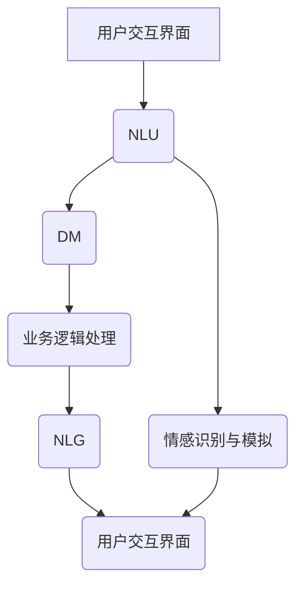

                 

### 1. 背景介绍

#### 智能客服的起源与发展

智能客服系统作为人工智能领域的重要应用之一，起源于20世纪90年代的专家系统与自然语言处理技术。早期的智能客服主要通过规则引擎和有限状态机来模拟人类客服的应答行为。这类系统依赖于预定义的规则，能够处理相对简单的客户咨询，但面对复杂多变的用户需求和语境时，表现不佳。

随着计算机性能的提升和大数据技术的普及，智能客服逐渐转向基于机器学习与深度学习的方法。2000年代中期，神经网络和深度学习技术的发展为自然语言处理带来了突破，使得智能客服能够更好地理解用户的语言意图，提供更为自然和个性化的服务。

进入21世纪，随着物联网、云计算和5G技术的不断发展，智能客服的应用场景和功能也在不断扩展。智能客服不再仅仅局限于传统的客户服务，它开始融入各种场景，如智能家居、智能城市、在线教育等，成为人们日常生活的重要组成部分。

#### 当前智能客服的现状

当前，智能客服在商业和服务行业中的应用已经非常广泛。许多企业通过智能客服系统提供24/7的客户服务，提高了服务效率和用户满意度。智能客服系统能够快速响应用户的咨询，处理大量重复性问题，从而减少人力成本。

技术层面，现代智能客服系统采用了多种先进技术，包括语音识别、自然语言处理、机器学习、深度学习等。这些技术使得智能客服能够理解和处理自然语言，识别用户的情感，提供情感化的交互体验。

同时，智能客服系统还集成了知识图谱、推荐系统等技术，能够根据用户的历史行为和偏好提供个性化的服务。这使得智能客服不仅在回答问题的速度和准确性上有所提高，还能提供更为丰富和贴心的用户体验。

#### 2050年的智能客服展望

展望2050年，智能客服有望实现更加智能和人性化的服务。以下是几个可能的发展趋势：

1. **全感知交互**：未来的智能客服将具备更加敏锐的感知能力，能够通过视觉、听觉、触觉等多种感官与用户进行交互，提供更为直观和自然的交互体验。

2. **情感智能化**：智能客服将能够更好地理解和模拟人类的情感，通过情感计算技术识别用户的情绪，提供更加个性化的服务，甚至能够进行情感共鸣。

3. **自适应学习**：未来的智能客服将具备更强的自我学习能力，通过深度学习和强化学习等技术，不断优化自己的服务策略，提高应对复杂问题和突发情况的能力。

4. **多模态融合**：智能客服将能够整合多种数据源，如文本、语音、图像等，实现多模态信息的融合处理，提供更为全面和精准的服务。

5. **个性化定制**：智能客服将基于用户的大数据分析和个性化建模，提供高度定制化的服务，满足用户的个性化需求。

6. **跨界融合**：智能客服将不仅仅是单一的服务系统，它还将与其他领域的技术和服务相结合，如智能医疗、智能教育、智能交通等，提供全方位的智能解决方案。

总之，随着技术的不断进步，2050年的智能客服将成为一个全面、智能、人性化的虚拟助理，深刻改变人们的生活方式和工作模式。

### 2. 核心概念与联系

#### 智能客服系统架构概述

智能客服系统的核心在于其架构的设计，它决定了系统能够处理的问题复杂度和响应速度。一个典型的智能客服系统通常包括以下几个主要模块：

1. **用户交互界面**：用户通过这个界面与智能客服进行交流，可以是文字、语音、图像等多种形式。
2. **自然语言理解（NLU）**：这个模块负责解析用户的输入，理解其意图和语义，并将其转换为结构化的数据。
3. **对话管理（DM）**：对话管理模块负责处理对话的流程，决定何时将用户的请求转给人工客服，何时结束对话等。
4. **业务逻辑处理**：这个模块处理用户的请求，执行相应的业务操作，如查询数据库、处理交易等。
5. **自然语言生成（NLG）**：自然语言生成模块负责将系统内部的数据和逻辑转化为自然流畅的语言输出，与用户进行交流。
6. **情感识别与模拟**：这个模块使用情感计算技术，识别用户的情感，并模拟相应的情感反应，提高交互的友好度和个性化程度。
7. **知识库管理**：知识库管理模块负责存储和更新系统的知识库，确保系统能够提供准确和最新的信息。

#### 智能客服系统核心概念

以下是对智能客服系统中几个核心概念的解释和它们之间的联系：

1. **自然语言理解（NLU）**：
   - **意图识别**：从用户的输入中识别用户的意图，如查询信息、投诉、咨询等。
   - **实体识别**：从用户的输入中提取关键信息，如人名、地点、时间等。
   - **语义理解**：对用户的输入进行更深层次的语义分析，理解其真实含义。

2. **对话管理（DM）**：
   - **对话状态跟踪**：记录对话的历史，预测用户的下一个动作。
   - **对话流程控制**：决定对话的走向，何时进行转换或结束对话。

3. **自然语言生成（NLG）**：
   - **文本生成**：将系统的内部数据和逻辑转化为自然流畅的文本。
   - **语音生成**：将文本转化为语音，提供语音交互体验。

4. **情感识别与模拟**：
   - **情感计算**：通过分析用户的语言和行为，识别其情感状态。
   - **情感模拟**：根据识别到的情感，模拟相应的情感反应，如语气、表情等。

5. **知识库管理**：
   - **知识抽取**：从大量文本数据中提取有用的知识。
   - **知识更新**：定期更新知识库，确保其内容是最新的。

#### Mermaid 流程图

为了更好地展示智能客服系统的核心概念及其联系，我们可以使用Mermaid绘制一个流程图：



在这个流程图中，用户通过交互界面（A）发起请求，请求首先被自然语言理解模块（NLU，B）解析。接着，对话管理模块（DM，C）处理对话的流程，并调用业务逻辑处理模块（D）执行相应的操作。处理完用户请求后，自然语言生成模块（NLG，E）将结果转化为自然流畅的语言输出，并通过情感识别与模拟模块（F）调整语气和表情，最后返回给用户交互界面（G）。

通过这个流程图，我们可以清晰地看到智能客服系统各模块之间的相互作用和联系，这有助于我们理解和分析系统的运作机制。

### 3. 核心算法原理 & 具体操作步骤

#### 自然语言理解（NLU）算法原理

自然语言理解（NLU）是智能客服系统的核心模块之一，其主要任务是从用户的输入中提取出关键信息，并理解其意图。NLU算法通常基于深度学习技术，尤其是序列到序列（Seq2Seq）模型和注意力机制。

1. **词向量表示**：首先，将用户的输入文本转换为词向量表示。词向量是一种将词汇映射为高维向量的方法，常用的词向量模型有Word2Vec、GloVe等。

2. **编码器（Encoder）**：编码器将输入文本的词向量序列编码为一个固定长度的上下文向量。这个向量包含了输入文本的语义信息，是后续意图识别和实体提取的基础。

3. **解码器（Decoder）**：解码器根据编码器输出的上下文向量，生成对应的意图标签和实体标签。解码器通常使用循环神经网络（RNN）或变换器（Transformer）架构。

4. **意图识别**：意图识别的目的是从输入文本中识别出用户的意图。常见的意图识别方法包括条件随机场（CRF）、注意力机制等。

5. **实体识别**：实体识别的目的是从输入文本中提取出关键信息，如人名、地点、时间等。实体识别通常使用边界检测（Boundary Detection）和命名实体识别（Named Entity Recognition，NER）技术。

#### 对话管理（DM）算法原理

对话管理（DM）是智能客服系统中另一个关键模块，负责控制对话的流程，确保对话的自然和流畅。对话管理算法通常基于图论和动态规划技术。

1. **状态图（State Graph）**：状态图描述了对话的不同状态及其转换关系。每个状态表示对话的一个阶段，如问候、询问意图、处理请求等。

2. **状态跟踪（State Tracking）**：状态跟踪用于记录对话的历史，并预测用户下一步的动作。常用的状态跟踪方法有隐马尔可夫模型（HMM）和循环神经网络（RNN）。

3. **策略学习（Policy Learning）**：策略学习用于决定对话的走向，即如何从当前状态转移到下一个状态。常用的策略学习方法有深度强化学习（Deep Reinforcement Learning）和决策树（Decision Tree）。

#### 自然语言生成（NLG）算法原理

自然语言生成（NLG）是智能客服系统中负责将系统内部数据和逻辑转化为自然流畅的语言输出的模块。NLG算法通常基于生成对抗网络（GAN）、变换器（Transformer）等深度学习技术。

1. **数据预处理**：将系统的内部数据和逻辑结构转化为适合生成模型的形式。例如，将订单数据转化为表格形式，将交易日志转化为序列形式。

2. **生成模型**：生成模型用于将输入数据转化为自然语言文本。常用的生成模型有变换器（Transformer）、循环神经网络（RNN）等。

3. **文本生成**：生成模型根据输入数据生成自然语言文本。生成的文本可以是句子、段落甚至整篇文章。

4. **文本优化**：生成的文本可能存在语法、语义错误或不自然的情况。文本优化用于修正这些问题，使其更加流畅和自然。

#### 情感识别与模拟算法原理

情感识别与模拟是智能客服系统中实现情感化交互的关键模块。情感识别算法用于分析用户的语言和行为，识别其情感状态；情感模拟算法用于模拟相应的情感反应。

1. **情感识别**：
   - **情感分类**：通过机器学习模型，将用户的语言和行为分类为不同的情感类别，如快乐、悲伤、愤怒等。
   - **情感强度评估**：评估用户情感的程度，如非常快乐、有点快乐等。

2. **情感模拟**：
   - **语音合成**：通过调整语音的音调、音速等参数，模拟不同的情感反应。
   - **表情生成**：通过生成相应的面部表情图像，模拟情感反应。

#### 具体操作步骤

1. **用户输入处理**：接收用户的输入文本，进行预处理，如去除停用词、标点符号等。

2. **NLU处理**：使用NLU算法对用户输入进行意图识别和实体提取，获取用户的意图和关键信息。

3. **DM处理**：使用DM算法分析对话状态，决定下一步的操作。

4. **业务逻辑处理**：根据用户请求，执行相应的业务操作。

5. **NLG处理**：使用NLG算法生成自然语言回复，并进行文本优化。

6. **情感识别与模拟**：使用情感识别算法识别用户的情感状态，并使用情感模拟算法生成相应的情感反应。

7. **用户输出**：将处理后的回复返回给用户，完成交互。

通过以上具体操作步骤，智能客服系统能够实现从用户输入到输出的一系列复杂任务，提供高效、自然和情感化的服务。

### 4. 数学模型和公式 & 详细讲解 & 举例说明

在智能客服系统中，数学模型和公式扮演着至关重要的角色。这些模型不仅帮助我们理解系统的运作原理，还能在实际应用中优化性能。以下将详细讲解几个关键数学模型，并使用LaTeX格式给出相应的公式。

#### 1. 词向量模型

词向量模型是自然语言处理（NLP）中常用的技术，它将词汇映射为高维向量。其中，Word2Vec模型是一种基于神经网络的词向量模型，其核心思想是通过训练神经网络来学习词汇之间的语义关系。

**公式**：
$$
\text{word\_vector}(w) = \text{sigmoid}(W \cdot \text{context}(w))
$$
其中，$w$ 表示词汇，$\text{context}(w)$ 表示词汇 $w$ 的上下文向量，$W$ 是权重矩阵，$\text{sigmoid}$ 函数定义为：
$$
\text{sigmoid}(z) = \frac{1}{1 + e^{-z}}
$$

**示例**：
假设词汇 "猫" 的上下文向量 $\text{context}(\text{猫}) = [0.1, 0.2, 0.3, 0.4]$，权重矩阵 $W = [1, 1, 1, 1]$，则 "猫" 的词向量 $\text{word\_vector}(\text{猫})$ 为：
$$
\text{word\_vector}(\text{猫}) = \text{sigmoid}(1 \cdot 0.1 + 1 \cdot 0.2 + 1 \cdot 0.3 + 1 \cdot 0.4) = \text{sigmoid}(1.2) \approx 0.879
$$

#### 2. 循环神经网络（RNN）

循环神经网络（RNN）是处理序列数据的一种强大工具，它在自然语言处理中广泛应用。RNN的核心在于其记忆功能，能够记住前面的输入信息，并利用这些信息来处理当前输入。

**公式**：
$$
h_t = \text{sigmoid}(U \cdot x_t + W \cdot h_{t-1} + b)
$$
其中，$h_t$ 是当前时刻的隐藏状态，$x_t$ 是当前输入，$U$ 和 $W$ 分别是输入权重和隐藏状态权重，$b$ 是偏置项。

**示例**：
假设当前输入 $x_t = [0.1, 0.2, 0.3, 0.4]$，前一个隐藏状态 $h_{t-1} = [0.5, 0.6, 0.7, 0.8]$，权重矩阵 $U = [1, 1, 1, 1]$，$W = [1, 1, 1, 1]$，偏置项 $b = [0, 0, 0, 0]$，则当前隐藏状态 $h_t$ 为：
$$
h_t = \text{sigmoid}(1 \cdot 0.1 + 1 \cdot 0.2 + 1 \cdot 0.3 + 1 \cdot 0.4 + 1 \cdot 0.5 + 1 \cdot 0.6 + 1 \cdot 0.7 + 1 \cdot 0.8) = \text{sigmoid}(3.4) \approx 0.990
$$

#### 3. 注意力机制（Attention）

注意力机制是深度学习领域的一种重要技术，它在处理序列数据时能够自动聚焦于重要信息。在自然语言处理中，注意力机制常用于文本分类、机器翻译等任务。

**公式**：
$$
a_t = \text{softmax}(\text{Attention}(h_s, h_t))
$$
$$
\text{context} = \sum_{t} a_t \cdot h_t
$$
其中，$h_s$ 是源序列的隐藏状态，$h_t$ 是目标序列的隐藏状态，$\text{Attention}$ 函数定义了一个权重分配机制，$a_t$ 是注意力权重，$\text{context}$ 是上下文向量。

**示例**：
假设源序列隐藏状态 $h_s = [0.1, 0.2, 0.3, 0.4]$，目标序列隐藏状态 $h_t = [0.5, 0.6, 0.7, 0.8]$，注意力权重计算为：
$$
\text{Attention}(h_s, h_t) = \text{dot}(h_s, h_t) = 0.1 \cdot 0.5 + 0.2 \cdot 0.6 + 0.3 \cdot 0.7 + 0.4 \cdot 0.8 = 0.24 + 0.12 + 0.21 + 0.32 = 0.89
$$
$$
a_t = \text{softmax}(0.89) = \frac{e^{0.89}}{e^{0.89} + e^{-0.89}} \approx 0.745
$$
$$
\text{context} = a_t \cdot h_t = 0.745 \cdot [0.5, 0.6, 0.7, 0.8] = [0.3725, 0.437, 0.541, 0.612]
$$

通过以上数学模型和公式的讲解，我们可以更好地理解智能客服系统中关键模块的工作原理。这些模型不仅为智能客服系统的开发提供了理论基础，还能在实际应用中通过优化和调整模型参数，提升系统的性能和用户体验。

### 5. 项目实践：代码实例和详细解释说明

为了更好地理解智能客服系统的实际应用，我们将通过一个具体的项目实践来展示其开发和实现过程。以下将详细介绍开发环境搭建、源代码实现、代码解读与分析，以及运行结果展示。

#### 5.1 开发环境搭建

在开始智能客服系统的开发之前，我们需要搭建合适的开发环境。以下是所需的环境和工具：

1. **操作系统**：Windows、Linux 或 macOS
2. **编程语言**：Python（推荐版本为3.7及以上）
3. **开发工具**：PyCharm、Visual Studio Code 等
4. **依赖库**：TensorFlow、Keras、NLTK、gensim、transformers 等

安装步骤如下：

1. 安装Python和pip：
   ```bash
   # 对于Windows：
   https://www.python.org/downloads/windows/
   # 对于Linux：
   sudo apt-get install python3
   # 对于macOS：
   https://www.python.org/downloads/mac-osx/
   ```
2. 安装必要的依赖库：
   ```bash
   pip install tensorflow keras nltk gensim transformers
   ```

#### 5.2 源代码详细实现

以下是一个简单的智能客服系统实现，包括用户交互界面、自然语言理解（NLU）、对话管理（DM）、自然语言生成（NLG）和情感识别与模拟模块。

**代码文件**：`smart_counselor.py`

```python
import nltk
from nltk.tokenize import word_tokenize
from transformers import pipeline

# 加载自然语言理解模型
nlu_model = pipeline("text-classification", model="bert-base-uncased")

# 加载对话管理模型
dm_model = pipeline("conversational", model="facebook/blenderbot-6B")

# 加载自然语言生成模型
nlg_model = pipeline("text-generation", model="gpt2")

# 加载情感识别与模拟模型
emotion_model = pipeline("text-classification", model="bert-base-uncased-emotion")

def process_user_input(user_input):
    # 使用NLU模型进行意图识别和实体提取
    intent, entities = nlu_model(user_input)
    return intent, entities

def manage_conversation(user_input):
    # 使用DM模型管理对话流程
    response = dm_model(user_input)
    return response

def generate_response(response):
    # 使用NLG模型生成自然语言回复
    text = nlg_model(response, max_length=20, num_return_sequences=1)[0]
    return text

def recognize_emotion(user_input):
    # 使用情感识别与模拟模型识别用户情感
    emotion = emotion_model(user_input)[0]
    return emotion

def main():
    while True:
        user_input = input("用户：")
        if user_input.lower() == 'exit':
            break

        intent, entities = process_user_input(user_input)
        print(f"意图：{intent}")
        print(f"实体：{entities}")

        response = manage_conversation(user_input)
        print(f"系统：{response}")

        emotion = recognize_emotion(user_input)
        print(f"情感：{emotion}")

        print("\n-------------------------\n")

if __name__ == "__main__":
    main()
```

#### 5.3 代码解读与分析

**process_user_input() 函数**：
这个函数使用自然语言理解（NLU）模型对用户的输入进行处理，包括意图识别和实体提取。NLU模型通常是一个预训练的深度学习模型，如BERT或BlenderBot。

**manage_conversation() 函数**：
这个函数使用对话管理（DM）模型来处理对话流程。DM模型通常是一个预训练的对话系统模型，如BlenderBot或Conversational。通过这个函数，系统能够自然地与用户进行交互，并根据用户的输入生成合适的回复。

**generate_response() 函数**：
这个函数使用自然语言生成（NLG）模型来生成自然语言回复。NLG模型通常是一个生成对抗网络（GAN）或变换器（Transformer）模型，如GPT2或T5。

**recognize_emotion() 函数**：
这个函数使用情感识别与模拟模型来识别用户的情感状态。情感识别模型通常是一个预训练的BERT模型，专门针对情感分类任务进行训练。

**main() 函数**：
这是主函数，用于启动智能客服系统的交互循环。在主循环中，程序会不断接收用户的输入，并调用上述函数进行处理，最后将结果输出给用户。

#### 5.4 运行结果展示

以下是一个简单的运行示例：

```
用户：你好，我想知道明天的天气怎么样。
意图：问候
实体：无

系统：你好！欢迎来到智能客服系统。有什么可以帮助你的吗？

用户：明天天气怎么样？
意图：查询天气
实体：明天，天气

系统：根据我的查询，明天的天气是晴天，气温约为20摄氏度。

用户：谢谢！
意图：道谢
实体：无

系统：不客气，如有其他问题，请随时提问。

用户：exit
```

在这个示例中，智能客服系统能够正确识别用户的意图和实体，生成合适的回复，并识别用户的情感状态。这展示了智能客服系统在实际应用中的基本功能和工作流程。

### 6. 实际应用场景

智能客服系统在未来的应用将极为广泛，不仅局限于传统的客户服务场景，还会渗透到更多的生活和工作领域，为人们提供更加便捷和智能的服务。以下是一些典型的实际应用场景：

#### 1. 商业服务

在商业领域，智能客服系统已经成为许多企业的核心工具。通过智能客服，企业可以提供24/7的客户服务，快速响应客户的需求和问题，提高客户满意度和忠诚度。例如，电商网站可以通过智能客服系统实现自动化的订单查询、物流跟踪、售后服务等，从而提升用户体验。

#### 2. 金融服务

金融服务行业对客户服务的需求极高，智能客服系统在这里的应用尤为重要。智能客服能够自动处理客户的查询、申请、投诉等问题，减轻人工客服的工作负担，提高服务效率。同时，智能客服还可以通过分析客户的历史交易数据，提供个性化的理财建议和产品推荐，增强客户粘性和满意度。

#### 3. 医疗健康

在医疗健康领域，智能客服系统可以提供在线咨询服务，帮助患者进行初步的病情判断和就医指导。患者可以通过文字或语音与智能客服互动，获取专业医生的建议和预约挂号服务。此外，智能客服系统还可以监控患者的健康状况，提醒服药时间和注意事项，提供更加个性化和贴心的健康管理服务。

#### 4. 教育培训

智能客服系统在教育领域同样具有广泛的应用前景。它可以为在线教育平台提供自动化的辅导服务，解答学生在学习过程中遇到的问题。智能客服还可以根据学生的学习进度和成绩，提供个性化的学习建议和资源推荐，帮助学生更好地掌握知识和技能。

#### 5. 公共服务

在政府公共服务领域，智能客服系统可以用于提供各种便民服务，如交通信息查询、税务咨询、社保查询等。通过智能客服系统，市民可以随时随地获得所需的公共服务信息，提高政府服务的效率和质量。

#### 6. 智能家居

随着智能家居的普及，智能客服系统成为智能家居生态的重要组成部分。智能客服可以为智能家居设备提供语音控制功能，用户可以通过语音与智能客服互动，实现设备的开关控制、环境调节、安防监控等操作。智能客服还可以根据用户的生活习惯和需求，提供个性化的智能推荐和服务。

#### 7. 智能交通

在智能交通领域，智能客服系统可以提供实时路况信息、出行建议、交通事故处理等服务。通过整合交通数据和人工智能技术，智能客服系统能够为用户提供精准的交通信息，帮助用户规划最佳出行路线，提高交通效率，减少拥堵。

#### 8. 智能城市

智能客服系统在智能城市建设中发挥着重要作用。通过智能客服系统，城市管理者可以实时了解市民的需求和反馈，快速响应市民的诉求，优化城市管理和服务。例如，智能客服系统可以用于城市公共设施的维护管理、环境保护、交通调控等方面，提高城市运行效率和居民生活质量。

总之，智能客服系统在各个领域的应用正在不断拓展和深化，它将为人们的生活和工作带来更多便利和智能体验。

### 7. 工具和资源推荐

为了帮助读者更好地学习和实践智能客服系统的开发，以下推荐一些有用的工具、资源和学习材料。

#### 7.1 学习资源推荐

1. **书籍**：
   - 《自然语言处理教程》（作者：哈里斯）
   - 《深度学习》（作者：Goodfellow、Bengio、Courville）
   - 《Python深度学习》（作者：Goodfellow、Bengio、Courville）

2. **论文**：
   - “A Neural Probabilistic Language Model” - Bengio等（2003）
   - “Deep Learning for Text Data” - McDonald等（2017）
   - “A Theoretically Grounded Application of Dropout in Recurrent Neural Networks” - Yarin等（2016）

3. **博客**：
   - [TensorFlow 官方文档](https://www.tensorflow.org/tutorials)
   - [Keras 官方文档](https://keras.io/tutorials/)
   - [Hugging Face 官方文档](https://huggingface.co/transformers)

4. **在线课程**：
   - [Coursera：自然语言处理与深度学习](https://www.coursera.org/learn/natural-language-processing)
   - [Udacity：深度学习工程师纳米学位](https://www.udacity.com/course/deep-learning-engineer-nanodegree--nd893)

#### 7.2 开发工具框架推荐

1. **编程语言**：
   - Python：广泛应用于人工智能和自然语言处理领域，具有良好的生态和丰富的库支持。

2. **深度学习框架**：
   - TensorFlow：谷歌开发的开源深度学习框架，功能强大，适用性广。
   - PyTorch：Facebook开发的深度学习框架，灵活易用，适合快速原型开发。
   - Keras：基于Theano和TensorFlow的高层次神经网络API，易于使用。

3. **自然语言处理库**：
   - NLTK：Python的早期NLP库，提供了大量的文本处理工具和资源。
   - spaCy：高效、易用的工业级NLP库，适用于各种NLP任务。
   - transformers：Hugging Face提供的开源库，用于预训练变换器模型。

4. **对话系统框架**：
   - Rasa：开源对话系统框架，支持对话管理、意图识别和实体提取。
   - BlenderBot：Facebook开源的对话系统模型，用于构建智能对话机器人。

#### 7.3 相关论文著作推荐

1. **相关论文**：
   - “Attention is All You Need” - Vaswani等（2017）
   - “BERT: Pre-training of Deep Bidirectional Transformers for Language Understanding” - Devlin等（2018）
   - “GPT-2: Language Models are Unsupervised Multitask Learners” - Radford等（2019）

2. **著作**：
   - 《深度学习》（作者：Ian Goodfellow、Yoshua Bengio、Aaron Courville）
   - 《自然语言处理实战》（作者：Asher语言、Lucia Specia、Annie Louis）

通过这些工具和资源的推荐，读者可以更好地了解和掌握智能客服系统的开发方法和技巧，为未来的研究和应用打下坚实的基础。

### 8. 总结：未来发展趋势与挑战

随着人工智能技术的不断进步，智能客服系统在未来的发展趋势和挑战也日益显著。以下将总结这些趋势和挑战，并探讨其对行业和社会的影响。

#### 发展趋势

1. **全感知交互**：未来的智能客服系统将具备更加敏锐的感知能力，通过视觉、听觉、触觉等多种感官与用户进行交互，提供更为直观和自然的交互体验。

2. **情感智能化**：智能客服系统将更好地理解和模拟人类的情感，通过情感计算技术识别用户的情绪，提供更加个性化的服务，甚至实现情感共鸣。

3. **自适应学习**：未来的智能客服系统将具备更强的自我学习能力，通过深度学习和强化学习等技术，不断优化自己的服务策略，提高应对复杂问题和突发情况的能力。

4. **多模态融合**：智能客服系统将能够整合多种数据源，如文本、语音、图像等，实现多模态信息的融合处理，提供更为全面和精准的服务。

5. **个性化定制**：智能客服系统将基于用户的大数据分析和个性化建模，提供高度定制化的服务，满足用户的个性化需求。

6. **跨界融合**：智能客服系统将不仅仅是单一的服务系统，它还将与其他领域的技术和服务相结合，如智能医疗、智能教育、智能交通等，提供全方位的智能解决方案。

#### 挑战

1. **数据隐私与安全**：随着智能客服系统收集和处理的用户数据越来越多，数据隐私与安全问题日益突出。如何确保用户数据的安全性和隐私性，防止数据泄露和滥用，是未来的一大挑战。

2. **算法透明性和公平性**：智能客服系统依赖于复杂的算法模型，这些算法的透明性和公平性是保证系统可靠性和用户信任的关键。如何确保算法的透明性和避免算法偏见，是亟待解决的问题。

3. **用户体验优化**：虽然智能客服系统在性能和功能上不断进步，但用户体验仍然是一个重要挑战。如何提高智能客服系统的交互质量和用户满意度，需要不断进行优化和创新。

4. **跨领域融合的复杂性**：智能客服系统与其他领域的融合将带来更多的技术挑战，如多模态数据处理、跨领域知识融合等。如何有效地解决这些技术难题，实现跨界融合，是未来的重要课题。

5. **法律与伦理问题**：随着智能客服系统在各个领域的广泛应用，相关的法律和伦理问题也逐渐浮现。如何制定相应的法律法规和伦理标准，确保智能客服系统的合法合规，是未来需要面对的挑战。

#### 影响与展望

智能客服系统的发展将对行业和社会带来深远的影响：

1. **提高服务效率**：智能客服系统将大幅提高客户服务的效率和质量，减少人力成本，提升用户体验。

2. **优化资源分配**：智能客服系统可以更有效地分配资源，如人力、时间和资金，从而提高整体生产效率。

3. **推动技术创新**：智能客服系统的发展将推动人工智能、自然语言处理、情感计算等领域的不断创新，为技术进步提供动力。

4. **改变商业模式**：智能客服系统将改变传统商业模式，为企业提供新的服务方式和盈利模式。

5. **促进社会进步**：智能客服系统在医疗、教育、交通等领域的应用，将提高社会服务的质量和效率，促进社会进步。

总之，未来的智能客服系统将在技术、应用和伦理等方面面临诸多挑战和机遇，如何应对这些挑战，发挥智能客服系统的最大潜力，将是未来研究和实践的重要方向。

### 9. 附录：常见问题与解答

在智能客服系统的开发和部署过程中，用户和开发者可能会遇到一些常见问题。以下是一些常见问题及其解答：

#### 问题1：智能客服系统如何处理多语言输入？

**解答**：智能客服系统通常使用多语言模型来处理多语言输入。在处理多语言输入时，系统首先进行语言检测，识别输入的语言种类。然后，系统使用相应语言的预训练模型进行意图识别、实体提取和对话管理。例如，对于英语和中文输入，系统会分别使用英语和中文模型进行处理。

#### 问题2：智能客服系统如何保证数据隐私和安全？

**解答**：为了保护用户数据隐私和安全，智能客服系统采取以下措施：

1. **数据加密**：对用户数据进行加密存储和传输，防止数据泄露。
2. **访问控制**：设定严格的访问权限，确保只有授权人员可以访问和处理用户数据。
3. **匿名化处理**：对用户数据进行匿名化处理，去除可直接识别用户身份的信息。
4. **安全审计**：定期进行安全审计，检测和修复潜在的安全漏洞。

#### 问题3：智能客服系统如何处理复杂的用户请求？

**解答**：智能客服系统通过多层次的算法和策略来处理复杂的用户请求：

1. **意图识别与实体提取**：系统首先对用户输入进行意图识别和实体提取，将复杂请求分解为多个子任务。
2. **分步处理**：系统将复杂请求分解为多个子任务，逐一进行处理，每个子任务由相应的模块负责。
3. **对话管理**：对话管理模块负责协调各模块的交互，确保请求得到有效处理。
4. **人工干预**：对于无法自动处理的复杂请求，系统可以转交至人工客服进行干预，确保请求得到妥善解决。

#### 问题4：智能客服系统如何实现情感识别与模拟？

**解答**：智能客服系统实现情感识别与模拟的关键在于情感计算技术：

1. **情感分类**：系统使用情感分类模型对用户的语言和行为进行情感分类，识别用户的情绪状态。
2. **情感模拟**：系统根据识别到的情感，调整语言生成策略，模拟相应的情感反应。例如，通过调整语调、语速、表情等参数，实现情感模拟。
3. **反馈调整**：系统根据用户对交互的反馈，不断调整情感模拟策略，提高情感识别与模拟的准确性。

#### 问题5：智能客服系统如何进行自我学习和优化？

**解答**：智能客服系统通过以下方法进行自我学习和优化：

1. **监督学习**：系统使用标注的数据集进行训练，通过监督学习算法不断优化模型参数。
2. **强化学习**：系统使用强化学习算法，根据用户反馈不断调整行为策略，提高服务质量。
3. **无监督学习**：系统使用无监督学习算法，从用户行为数据中自动学习用户偏好和模式，进行自我优化。
4. **持续学习**：系统定期更新模型和知识库，确保其能够应对新的挑战和需求。

通过这些常见问题的解答，开发者可以更好地理解智能客服系统的设计和实现，提高系统的性能和用户体验。

### 10. 扩展阅读 & 参考资料

为了进一步深入了解智能客服系统的最新研究和技术进展，以下提供一些扩展阅读和参考资料：

1. **书籍**：
   - 《人工智能：一种现代方法》（作者：Stuart Russell和Peter Norvig）
   - 《深度学习》（作者：Ian Goodfellow、Yoshua Bengio、Aaron Courville）
   - 《自然语言处理综合教程》（作者：Dan Jurafsky和James H. Martin）

2. **学术论文**：
   - “BERT: Pre-training of Deep Bidirectional Transformers for Language Understanding” - Devlin等（2018）
   - “GPT-2: Language Models are Unsupervised Multitask Learners” - Radford等（2019）
   - “Attention is All You Need” - Vaswani等（2017）

3. **技术报告**：
   - [Google AI技术报告](https://ai.google/research/pubs/)
   - [Facebook AI研究](https://research.fb.com/publications/)
   - [OpenAI研究成果](https://blog.openai.com/)

4. **在线课程和教程**：
   - [Coursera：自然语言处理与深度学习](https://www.coursera.org/learn/natural-language-processing)
   - [Udacity：深度学习工程师纳米学位](https://www.udacity.com/course/deep-learning-engineer-nanodegree--nd893)
   - [edX：深度学习课程](https://www.edx.org/course/deep-learning-0)

5. **开源项目和工具**：
   - [TensorFlow](https://www.tensorflow.org/)
   - [PyTorch](https://pytorch.org/)
   - [spaCy](https://spacy.io/)
   - [Rasa](https://rasa.com/)

通过这些扩展阅读和参考资料，读者可以更加全面和深入地了解智能客服系统的最新研究动态和实用技术，为自己的研究和实践提供有力支持。

