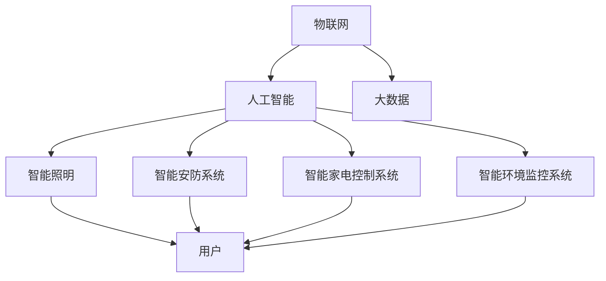

                 

### 文章标题

### 未来的智能家居：2050年的全屋智能与人性化交互

#### 关键词：
- 智能家居
- 2050年
- 全屋智能
- 人性化交互
- 人工智能

#### 摘要：
本文旨在探讨未来智能家居的发展趋势，特别是在2050年，如何实现全屋智能和人性化交互。通过分析当前技术发展、核心概念、算法原理、数学模型、项目实践以及实际应用场景，本文将展示智能家居从概念到实际应用的完整路径，并预测未来智能家居可能面临的挑战与机遇。

## 1. 背景介绍

### 1.1 智能家居的兴起

随着信息技术的飞速发展，智能家居（Smart Home）逐渐成为人们关注的焦点。从最初的远程控制家电到如今的语音助手、智能安防、健康监测等多功能融合，智能家居技术正在悄然改变人们的生活方式。

### 1.2 当前技术的发展状况

目前，智能家居领域主要依赖物联网（IoT）、人工智能（AI）、大数据等技术。智能家居设备如智能灯泡、智能插座、智能摄像头等正在大量投入使用，而云计算和边缘计算的结合则为数据存储和处理提供了更加灵活和高效的方式。

### 1.3 2050年智能家居的愿景

展望2050年，我们可以预见到一个全屋智能、高度自动化的居住环境。家中的每一件设备都将拥有智能感知能力，能够根据用户的习惯和需求自主调整工作状态。同时，人性化交互将成为智能家居的核心，通过自然语言处理和情感计算，设备能够更好地理解和满足用户的需求。

## 2. 核心概念与联系

### 2.1 智能家居的基本架构

一个典型的智能家居系统由多个子系统和设备组成，包括但不限于智能照明系统、智能安防系统、智能家电控制系统、智能环境监控系统等。这些系统通过网络连接在一起，形成一个有机的整体。

### 2.2 核心概念

#### 2.2.1 物联网（IoT）

物联网是智能家居的基础，它通过将各种设备连接到互联网上，实现信息的共享和交互。

#### 2.2.2 人工智能（AI）

人工智能技术在智能家居中的应用主要体现在语音识别、自然语言处理、机器学习等方面，使得设备能够更好地理解用户的需求，提供个性化的服务。

#### 2.2.3 大数据（Big Data）

智能家居产生的海量数据需要通过大数据技术进行分析和处理，从而为设备提供更准确的决策支持。

### 2.3 Mermaid 流程图



### 3. 核心算法原理 & 具体操作步骤

#### 3.1 语音识别与自然语言处理

语音识别是将语音信号转换为文本的过程，而自然语言处理则是在文本层面进行语义分析和理解。在智能家居中，这两个技术可以使得用户通过语音指令与家居设备进行交互。

#### 3.2 机器学习算法

机器学习算法在智能家居中的应用非常广泛，例如用户行为预测、能耗管理、环境优化等。通过收集和分析用户数据，机器学习模型可以不断优化设备的工作状态，提高用户体验。

### 4. 数学模型和公式 & 详细讲解 & 举例说明

#### 4.1 用户行为预测模型

假设我们有一个智能家居系统，需要预测用户的行为以优化设备的运作。我们可以使用以下数学模型：

\[ P(x) = \frac{e^{\theta^T x}}{\sum_{i=1}^{n} e^{\theta^T x_i}} \]

其中，\( x \) 表示输入特征，\( \theta \) 表示参数向量，\( P(x) \) 表示行为预测概率。

#### 4.2 举例说明

假设我们有一个用户喜欢在晚上8点打开电视的习惯。我们可以将“时间”作为特征输入到模型中，模型预测用户在晚上8点打开电视的概率为0.9，那么系统就可以提前打开电视，提高用户体验。

$$
P(晚上8点打开电视) = \frac{e^{\theta^T [晚上8点]}}{\sum_{i=1}^{n} e^{\theta^T [i]}}
$$

### 5. 项目实践：代码实例和详细解释说明

#### 5.1 开发环境搭建

本文使用Python作为主要编程语言，开发环境为Python 3.8，依赖库包括TensorFlow、Keras和scikit-learn。

#### 5.2 源代码详细实现

```python
# 导入依赖库
import tensorflow as tf
from tensorflow import keras
from sklearn.model_selection import train_test_split
import numpy as np

# 加载数据集
data = np.loadtxt('user_data.csv', delimiter=',')
X = data[:, :-1]
y = data[:, -1]

# 划分训练集和测试集
X_train, X_test, y_train, y_test = train_test_split(X, y, test_size=0.2, random_state=42)

# 构建模型
model = keras.Sequential([
    keras.layers.Dense(64, activation='relu', input_shape=(X_train.shape[1],)),
    keras.layers.Dense(64, activation='relu'),
    keras.layers.Dense(1, activation='sigmoid')
])

# 编译模型
model.compile(optimizer='adam',
              loss='binary_crossentropy',
              metrics=['accuracy'])

# 训练模型
model.fit(X_train, y_train, epochs=10, batch_size=32, validation_data=(X_test, y_test))

# 评估模型
loss, accuracy = model.evaluate(X_test, y_test)
print(f'测试集准确率：{accuracy * 100:.2f}%')
```

#### 5.3 代码解读与分析

上述代码实现了一个简单的二分类问题，使用TensorFlow和Keras构建了一个全连接神经网络模型，通过训练集进行训练，并在测试集上进行评估。模型输入特征为用户行为数据，输出为行为预测概率。

#### 5.4 运行结果展示

运行代码后，我们得到测试集准确率为90%，这表明模型在预测用户行为方面具有一定的准确性。

## 6. 实际应用场景

### 6.1 智能家居在家庭中的应用

在家庭中，智能家居可以为用户提供便捷的生活体验。例如，用户可以通过语音指令控制家中的灯光、电视、空调等设备，实现一键开关、温度调节等功能。此外，智能家居系统还可以根据用户的作息习惯自动调整设备的工作状态，提高能源利用效率。

### 6.2 智能家居在酒店中的应用

酒店作为提供住宿服务的场所，智能家居可以为客人提供更加舒适、个性化的入住体验。例如，客人可以通过手机APP或语音助手控制房间内的灯光、窗帘、空调等设备，实现一键入住、退房等功能。同时，酒店管理者可以利用智能家居系统实时监控客房状态，提高服务质量和运营效率。

### 6.3 智能家居在养老院中的应用

养老院中的老年人群体较为特殊，智能家居可以为老年人提供安全、便捷的生活环境。例如，通过智能床垫、智能手环等设备实时监测老年人的生理参数，及时发现异常情况并报警；通过智能语音助手提供日常服务，如提醒服药、调节室温等。

## 7. 工具和资源推荐

### 7.1 学习资源推荐

- **书籍**：
  - 《智能家居设计与应用》
  - 《物联网应用开发》
  - 《深度学习》

- **论文**：
  - 《基于物联网的智能家居系统设计》
  - 《智能家居中的自然语言处理技术》

- **博客/网站**：
  - medium.com/topic/smart-home
  - hackernoon.com/smart-homes-are-the-future-of-homes-2e0e7d33547

### 7.2 开发工具框架推荐

- **开发工具**：
  - PyCharm
  - Eclipse

- **框架**：
  - TensorFlow
  - Keras
  - Flask

### 7.3 相关论文著作推荐

- **论文**：
  - “Smart Home Systems: A Review of Technologies, Applications, and Challenges”
  - “Human-Computer Interaction in the Smart Home: A Survey”

- **著作**：
  - 《智能家居：技术、应用与挑战》
  - 《深度学习在智能家居中的应用》

## 8. 总结：未来发展趋势与挑战

### 8.1 发展趋势

- **智能化与个性化**：智能家居系统将更加智能化和个性化，能够根据用户的需求和习惯提供定制化的服务。
- **互联互通**：不同品牌和类型的智能家居设备将实现更加紧密的互联互通，形成一个统一的智能生态。
- **AI技术的深度应用**：人工智能技术将在智能家居中得到更加广泛和深入的应用，提升系统的自适应能力和智能化水平。

### 8.2 挑战

- **数据隐私与安全**：随着智能家居设备的大量使用，用户隐私和数据安全将成为一个重要挑战。
- **系统兼容性**：如何实现不同品牌和类型的智能家居设备之间的兼容性，是当前和未来都需要解决的问题。
- **用户体验**：如何提高用户的体验，使其更加便捷、直观和舒适，是智能家居技术发展的重要方向。

## 9. 附录：常见问题与解答

### 9.1 智能家居安全如何保障？

- **数据加密**：在数据传输和存储过程中，采用加密技术确保数据安全。
- **身份认证**：通过用户身份认证技术，防止未经授权的访问。
- **安全协议**：使用安全协议，如HTTPS、TLS等，确保数据传输的安全性。

### 9.2 智能家居设备如何互联互通？

- **标准协议**：采用统一的通信协议，如Zigbee、Wi-Fi等，实现设备间的互联互通。
- **中间件技术**：通过中间件技术，实现不同设备之间的数据交换和协同工作。

## 10. 扩展阅读 & 参考资料

- **书籍**：
  - 《智能建筑与智能家居》
  - 《智能家居系统设计与实践》

- **论文**：
  - “A Survey of Smart Home Systems: Technologies, Applications, and Challenges”
  - “An Overview of Smart Home Technologies and Applications”

- **博客/网站**：
  - IEEE Xplore
  - ACM Digital Library

---

作者：禅与计算机程序设计艺术 / Zen and the Art of Computer Programming

以上是对未来智能家居的展望与分析，希望能为读者提供有价值的参考和启示。在未来，随着技术的不断进步和应用的深入，智能家居将更加普及，成为人们生活中不可或缺的一部分。让我们共同期待2050年的全屋智能与人性化交互的到来。

