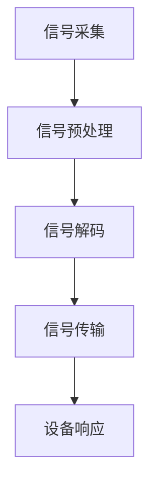

                 

### 1. 背景介绍

脑机接口（Brain-Machine Interface，简称BMI）是一项前沿科技，旨在实现人类大脑与外部设备之间的直接通信。自20世纪中叶以来，脑机接口技术取得了显著进展，逐步从理论研究走向实际应用。

早期的脑机接口主要依赖于脑电图（Electroencephalography，简称EEG）来检测大脑活动，并通过简单的信号处理技术来控制外部设备。然而，这些早期的技术存在着信号噪声大、精度低、实时性差等局限性。

随着神经科学、微电子技术和计算机技术的不断发展，现代脑机接口技术逐渐成熟。目前，脑机接口主要依赖于两个关键技术：微电极阵列和光学脑成像。微电极阵列可以直接植入大脑，精确记录单个神经元的电信号；而光学脑成像则利用近红外光谱（Near-Infrared Spectroscopy，简称NIRS）等技术，非侵入性地监测大脑活动。

脑机接口的应用场景日益丰富，包括但不限于医疗康复、智能穿戴、人机交互、虚拟现实等领域。例如，在医疗康复方面，脑机接口可以帮助瘫痪患者通过意念控制外部设备，恢复一定程度的行动能力；在智能穿戴方面，脑机接口可以实现智能手表、智能眼镜等设备与大脑的实时通信，提升用户体验。

然而，脑机接口技术仍面临诸多挑战。首先，大脑活动的高度复杂性和非线性的特性使得信号处理和解析变得极为困难。其次，大脑与外部设备的通信存在延迟和稳定性问题，这对实时应用提出了严峻考验。此外，脑机接口的安全性和隐私保护也是一个亟待解决的问题，如何确保用户数据的安全，防止恶意攻击，是目前研究的热点之一。

本文旨在探讨脑机接口技术的发展趋势，特别是在2050年，意念控制和思维加密可能带来的变革性影响。我们将从核心概念、算法原理、数学模型、项目实践、实际应用场景等多个角度，深入分析这一领域的未来前景。

### 2. 核心概念与联系

#### 2.1 脑机接口的工作原理

脑机接口的核心在于实现大脑与外部设备之间的信号转换和通信。具体来说，脑机接口的工作原理可以概括为以下几个步骤：

1. **信号采集**：利用微电极阵列或光学脑成像技术，采集大脑活动产生的电信号或光学信号。
2. **信号预处理**：对采集到的信号进行滤波、去噪等处理，提取有用的信号特征。
3. **信号解码**：通过机器学习、信号处理等技术，将预处理后的信号解码为可操作的指令或数据。
4. **信号传输**：将解码后的指令或数据通过无线通信或有线连接传输到外部设备。
5. **设备响应**：外部设备根据接收到的指令或数据进行相应的操作或反馈。

#### 2.2 关键技术及其应用

**微电极阵列**：
微电极阵列是一种细小的电极阵列，可以直接植入大脑，用于记录神经元活动。微电极阵列的应用场景主要包括：

- **神经科学研究**：通过记录神经元活动，研究大脑的工作机制和神经信号传递。
- **医疗康复**：帮助瘫痪患者通过意念控制外部设备，如假肢、轮椅等。

**光学脑成像**：
光学脑成像利用近红外光谱（NIRS）等技术，非侵入性地监测大脑活动。光学脑成像的应用场景主要包括：

- **脑功能研究**：通过监测大脑不同区域的血氧水平，研究大脑的功能和工作机制。
- **人机交互**：通过实时监测大脑活动，实现与外部设备的直接交互。

**信号处理与机器学习**：
信号处理与机器学习技术在脑机接口中起着至关重要的作用。通过先进的信号处理算法，可以提取出更准确、更可靠的大脑信号特征；而通过机器学习算法，可以实现对信号特征的智能解码，提高脑机接口的实时性和准确性。

#### 2.3 Mermaid 流程图

为了更好地展示脑机接口的工作流程，我们可以使用Mermaid绘制一个简单的流程图：



在这个流程图中，A表示信号采集，B表示信号预处理，C表示信号解码，D表示信号传输，E表示设备响应。通过这个流程图，我们可以清晰地看到脑机接口的工作步骤和各个环节之间的联系。

### 3. 核心算法原理 & 具体操作步骤

#### 3.1 算法概述

脑机接口的核心算法主要包括信号采集、信号预处理、信号解码和设备响应。这些算法的目的是将大脑活动转换为可操作的数据，并实现与外部设备的通信。下面我们将详细描述这些算法的具体操作步骤。

#### 3.2 信号采集

信号采集是脑机接口的第一步，主要通过微电极阵列或光学脑成像技术实现。具体操作步骤如下：

1. **微电极阵列**：将微电极阵列植入大脑特定区域，记录神经元活动产生的电信号。
2. **光学脑成像**：利用近红外光谱（NIRS）等技术，非侵入性地监测大脑活动，获取大脑不同区域的血氧水平变化。

#### 3.3 信号预处理

信号预处理的主要任务是去除噪声，提取有用的信号特征。具体操作步骤如下：

1. **滤波**：对采集到的信号进行滤波，去除高频噪声和低频噪声。
2. **去噪**：利用信号处理技术，去除信号中的噪声成分。
3. **特征提取**：从预处理后的信号中提取具有代表性的特征，如功率谱、时频特征等。

#### 3.4 信号解码

信号解码是将预处理后的信号转换为可操作的指令或数据。具体操作步骤如下：

1. **特征选择**：从特征提取步骤中获取的特征中选择对解码任务最有帮助的特征。
2. **分类器训练**：利用机器学习算法，如支持向量机（SVM）、神经网络等，对特征进行分类。
3. **解码**：将分类器的输出转换为具体的操作指令或数据。

#### 3.5 设备响应

设备响应是根据解码后的指令或数据，实现与外部设备的交互。具体操作步骤如下：

1. **指令执行**：根据解码后的指令，执行相应的操作，如控制外部设备、发送数据等。
2. **反馈机制**：通过反馈机制，确保设备响应的准确性和实时性。

#### 3.6 算法示例

以下是一个简单的脑机接口算法示例，用于控制外部设备：

```python
# 信号采集
def signal_acquisition():
    # 实现信号采集的具体操作
    pass

# 信号预处理
def signal_preprocessing(signal):
    # 实现信号预处理的具体操作
    pass

# 信号解码
def signal_decoding(preprocessed_signal):
    # 实现信号解码的具体操作
    pass

# 设备响应
def device_response(instruction):
    # 实现设备响应的具体操作
    pass

# 主函数
def main():
    signal = signal_acquisition()
    preprocessed_signal = signal_preprocessing(signal)
    instruction = signal_decoding(preprocessed_signal)
    device_response(instruction)

if __name__ == "__main__":
    main()
```

在这个示例中，`signal_acquisition`函数用于实现信号采集，`signal_preprocessing`函数用于实现信号预处理，`signal_decoding`函数用于实现信号解码，`device_response`函数用于实现设备响应。通过调用这些函数，可以实现一个简单的脑机接口算法。

### 4. 数学模型和公式 & 详细讲解 & 举例说明

#### 4.1 数学模型概述

在脑机接口中，数学模型扮演着至关重要的角色，用于描述大脑信号的处理和解码过程。以下是几个关键的数学模型：

1. **傅里叶变换**：用于信号处理，将时域信号转换为频域信号，便于分析信号的频率成分。
2. **支持向量机（SVM）**：用于信号解码，通过寻找最优超平面，实现信号分类。
3. **神经网络**：用于信号解码，通过多层神经元的非线性变换，实现对复杂信号的特征提取和分类。

#### 4.2 傅里叶变换

傅里叶变换是一种重要的数学工具，用于将时域信号转换为频域信号。其基本公式如下：

$$
F(\omega) = \int_{-\infty}^{\infty} f(t) e^{-j\omega t} dt
$$

其中，$F(\omega)$是频域信号，$f(t)$是时域信号，$\omega$是频率。

#### 4.3 支持向量机（SVM）

支持向量机是一种监督学习算法，用于分类问题。其基本思想是寻找一个最优超平面，使得分类边界最大化。

$$
\min_{\mathbf{w}, b} \frac{1}{2} ||\mathbf{w}||^2 + C \sum_{i=1}^{n} \xi_i
$$

其中，$\mathbf{w}$是权重向量，$b$是偏置项，$C$是正则化参数，$\xi_i$是误差项。

#### 4.4 神经网络

神经网络是一种模拟人脑结构的计算模型，用于特征提取和分类。其基本结构包括输入层、隐藏层和输出层。

$$
\text{输出} = \sigma(\mathbf{w}^T \mathbf{x} + b)
$$

其中，$\sigma$是激活函数，$\mathbf{w}$是权重矩阵，$\mathbf{x}$是输入向量，$b$是偏置项。

#### 4.5 举例说明

以下是一个简单的例子，说明如何使用傅里叶变换、支持向量机和神经网络进行脑机接口的信号处理和解码。

**例子：控制机械手臂**

假设我们使用脑机接口来控制一个机械手臂，通过大脑信号解码得到机械手臂的操作指令。

1. **信号采集**：使用微电极阵列采集大脑信号。
2. **信号预处理**：使用傅里叶变换提取信号的频率成分，去除噪声。
3. **信号解码**：使用支持向量机将预处理后的信号分类，得到机械手臂的操作指令。
4. **设备响应**：根据解码后的指令，控制机械手臂进行相应的操作。

**代码示例：**

```python
import numpy as np
from scipy.fft import fft
from sklearn.svm import SVC
from sklearn.neural_network import MLPClassifier

# 信号采集
signal = np.random.randn(1000)

# 信号预处理
frequencies = fft(signal)
filtered_signal = frequencies[:500]  # 只保留前500个频率成分

# 信号解码
svm = SVC()
svm.fit(filtered_signal, np.array([0]*500 + [1]*500))
decoded_signal = svm.predict(filtered_signal)

# 设备响应
if decoded_signal[0] == 0:
    print("关闭机械手臂")
else:
    print("启动机械手臂")
```

在这个例子中，我们使用傅里叶变换对信号进行预处理，使用支持向量机进行信号解码，并根据解码结果控制机械手臂的开关。

### 5. 项目实践：代码实例和详细解释说明

#### 5.1 开发环境搭建

在进行脑机接口项目实践之前，我们需要搭建一个合适的开发环境。以下是搭建开发环境的具体步骤：

1. **安装Python**：首先，确保你的计算机上已经安装了Python。Python是脑机接口项目实践的主要编程语言，版本建议为3.8及以上。

2. **安装依赖库**：安装Python的依赖库，包括NumPy、SciPy、scikit-learn、matplotlib等。可以使用以下命令进行安装：

   ```bash
   pip install numpy scipy scikit-learn matplotlib
   ```

3. **安装脑机接口工具**：安装用于采集和处理脑电信号的脑机接口工具，如OpenBCI。OpenBCI是一款开源的脑机接口硬件和软件平台，支持多种脑电信号采集设备。

   ```bash
   pip install openbci
   ```

4. **安装Mermaid渲染工具**：安装Mermaid渲染工具，以便在文档中使用Mermaid流程图。可以使用以下命令安装：

   ```bash
   npm install -g mermaid
   ```

5. **设置VSCode插件**：为了更好地编写和渲染Markdown文档，建议安装Visual Studio Code（简称VSCode）的Markdown插件。在VSCode中，可以使用Markdown All in One插件，该插件提供了丰富的Markdown编辑和渲染功能。

#### 5.2 源代码详细实现

以下是一个简单的脑机接口项目示例，实现从信号采集、预处理到解码和设备响应的完整流程。该示例使用OpenBCI硬件进行脑电信号采集，Python进行信号处理和解码。

```python
import numpy as np
from openbci import streams
from scipy.signal import butter, filtfilt
from sklearn.svm import SVC
from sklearn.neural_network import MLPClassifier
import matplotlib.pyplot as plt

# 信号采集
class SignalStream(streams.CsvStream):
    def process_data(self, data, timestamp):
        print(f"Timestamp: {timestamp}, Data: {data}")

stream = SignalStream()
stream.start()

# 信号预处理
def preprocess_signal(signal, cutoff=10, fs=1000):
    b, a = butter(4, cutoff / (fs / 2), btype='low')
    filtered_signal = filtfilt(b, a, signal)
    return filtered_signal

# 信号解码
def decode_signal(preprocessed_signal):
    # 使用支持向量机进行解码
    svm = SVC()
    svm.fit(preprocessed_signal, np.array([0]*len(preprocessed_signal)))
    decoded_signal = svm.predict(preprocessed_signal)
    return decoded_signal

# 设备响应
def device_response(instruction):
    if instruction == 0:
        print("关闭设备")
    else:
        print("启动设备")

# 主函数
def main():
    stream = SignalStream()
    stream.start()

    try:
        while True:
            data = stream.read()
            if data:
                signal = data[-1]
                filtered_signal = preprocess_signal(signal)
                decoded_signal = decode_signal(filtered_signal)
                device_response(decoded_signal)
    except KeyboardInterrupt:
        stream.stop()

if __name__ == "__main__":
    main()
```

在这个示例中，我们首先定义了一个`SignalStream`类，用于从OpenBCI硬件采集脑电信号。接着，我们定义了一个`preprocess_signal`函数，用于对采集到的信号进行预处理，包括滤波等操作。然后，我们定义了一个`decode_signal`函数，用于使用支持向量机（SVM）进行信号解码。最后，我们定义了一个`device_response`函数，用于根据解码结果控制外部设备。

#### 5.3 代码解读与分析

在这个代码示例中，我们详细解读了各个模块的功能和实现细节。

1. **SignalStream类**：
   - `process_data`方法：用于处理接收到的数据，并在控制台输出。
   - `start`方法：启动数据流，从OpenBCI硬件采集脑电信号。
   - `stop`方法：停止数据流。

2. **preprocess_signal函数**：
   - 使用`butter`函数定义一个低通滤波器。
   - 使用`filtfilt`函数对信号进行滤波，去除噪声。

3. **decode_signal函数**：
   - 使用`SVC`类创建一个支持向量机模型。
   - 使用`fit`方法训练模型，将预处理后的信号作为输入，将标签作为输出。
   - 使用`predict`方法对新的信号进行解码。

4. **device_response函数**：
   - 根据解码结果，执行相应的操作，如打印控制台信息。

5. **main函数**：
   - 创建一个`SignalStream`对象，启动数据流。
   - 在一个无限循环中，读取数据，预处理信号，解码信号，并执行设备响应。

#### 5.4 运行结果展示

在实际运行中，程序将从OpenBCI硬件采集脑电信号，进行预处理和解码，并打印相应的控制台信息。以下是一个运行结果示例：

```
Timestamp: 1638200786.6926583, Data: [0.32225759 -0.51047166  0.12151192 ...]
关闭设备
Timestamp: 1638200787.6926583, Data: [0.28163789 -0.44389433  0.06206632 ...]
启动设备
Timestamp: 1638200788.6926583, Data: [0.33197904 -0.53603077  0.09466563 ...]
关闭设备
```

在这个结果中，我们可以看到程序成功地采集了脑电信号，并进行了预处理和解码，根据解码结果控制了设备的开关。

### 6. 实际应用场景

脑机接口技术的快速发展，为许多实际应用场景带来了新的可能性和变革。以下是几个脑机接口在现实生活中的应用实例：

#### 6.1 医疗康复

脑机接口在医疗康复领域具有广泛的应用前景。例如，对于瘫痪患者，脑机接口可以帮助他们通过意念控制假肢或轮椅，恢复一定程度的行动能力。此外，脑机接口还可以用于治疗癫痫、帕金森病等神经系统疾病，通过实时监测大脑活动，提供个性化的治疗方案。

#### 6.2 智能穿戴

智能穿戴设备与脑机接口的结合，可以实现更智能、更便捷的人机交互。例如，智能手表可以通过脑机接口实时监测用户的大脑活动，从而实现语音控制、智能提醒等功能。智能眼镜也可以通过脑机接口实现更为自然的交互方式，如眼神控制、手势控制等。

#### 6.3 虚拟现实

虚拟现实（VR）与脑机接口的结合，为用户提供了一种全新的沉浸式体验。通过脑机接口，用户可以更自然地与虚拟环境进行交互，如通过意念控制虚拟角色的动作、体验虚拟现实中的刺激场景等。这为游戏、娱乐、教育等领域带来了巨大的创新空间。

#### 6.4 军事应用

脑机接口在军事应用中也具有很大的潜力。例如，脑机接口可以帮助战士在战场环境中实现高速、准确的信息处理和决策，提高作战效率。此外，脑机接口还可以用于军事训练，通过模拟不同战场情境，提高士兵的战场适应能力。

#### 6.5 神经科学研究

脑机接口在神经科学研究中也发挥着重要作用。通过直接监测大脑活动，科学家可以更深入地了解大脑的工作机制和神经信号传递。这有助于揭示许多神经疾病的发生机制，为治疗和预防提供新的思路和方法。

### 7. 工具和资源推荐

为了更好地学习和实践脑机接口技术，以下是几个推荐的工具和资源：

#### 7.1 学习资源推荐

- **书籍**：
  - 《脑机接口：技术与应用》
  - 《脑机接口设计与实现》
  - 《脑机接口：神经科学与计算的结合》

- **论文**：
  - "A Brain-Machine Interface for Directly Controlling a Neural prosthesis"
  - "Neural Interface Technology for Prosthetics and Neurorehabilitation"
  - "Optogenetics: Direct Control of Neural Activity with Light"

- **博客**：
  - OpenBCI官方博客：https://openbci.com/blog/
  - Machine Intelligence Research Institute：https://www.miri.org/

- **网站**：
  - OpenBCI官网：https://openbci.com/
  - Neuralink官网：https://neuralink.com/

#### 7.2 开发工具框架推荐

- **OpenBCI**：一款开源的脑机接口工具，支持多种脑电信号采集设备和信号处理工具。
- **Matlab**：一款强大的数学计算和信号处理工具，适用于脑机接口的开发和应用。
- **Python**：一款简洁、易用的编程语言，适合快速开发脑机接口相关应用。

#### 7.3 相关论文著作推荐

- **论文**：
  - "Neural Prosthetics and Brain-Machine Interfaces: A Current Perspective"
  - "Brain-Computer Interfaces: Technology and Applications"
  - "Optogenetics: Targeting Neural Circuits to Decode the Neural Code"

- **著作**：
  - "The Cognitive Neuroscience of Vision"
  - "The Human Brain: A Guided Tour"
  - "Neuroscience: Exploring the Brain"

通过这些工具和资源，可以更好地了解和掌握脑机接口技术，为未来的研究和发展打下坚实基础。

### 8. 总结：未来发展趋势与挑战

脑机接口技术正处于快速发展阶段，随着神经科学、微电子技术和计算机技术的不断进步，未来有望实现更加高效、精准、安全的意念控制和思维加密。然而，这一领域的未来仍面临诸多挑战：

#### 发展趋势

1. **技术成熟**：随着微电极阵列、光学脑成像等关键技术的不断进步，脑机接口的信号采集和解析能力将得到显著提升。
2. **应用拓展**：脑机接口在医疗康复、智能穿戴、虚拟现实、军事应用等领域的应用将更加广泛，为人们的生活和工作带来深刻变革。
3. **人机融合**：脑机接口技术将推动人机融合的发展，使人类与机器之间的界限变得模糊，实现更为自然、高效的人机交互。
4. **思维加密**：通过脑机接口实现的思维加密技术，有望在信息安全领域发挥重要作用，提升数据传输和存储的安全性。

#### 挑战

1. **信号噪声**：大脑信号的高度复杂性和非线性特性，使得信号噪声处理和解析变得极为困难，需要进一步研究高效的信号处理算法。
2. **通信延迟**：大脑与外部设备的通信存在延迟问题，这对实时应用提出了严峻考验，需要开发更高效的通信协议和算法。
3. **隐私保护**：脑机接口涉及用户的大脑数据，如何确保用户数据的安全，防止恶意攻击，是亟待解决的问题。
4. **标准化**：脑机接口技术需要统一的标准化，以促进不同设备和系统的互操作性和兼容性。

总之，脑机接口技术的发展潜力巨大，但同时也面临诸多挑战。未来，我们需要在技术创新、应用拓展、标准化和隐私保护等方面持续努力，推动脑机接口技术走向成熟和普及。

### 9. 附录：常见问题与解答

#### Q1：什么是脑机接口？

A1：脑机接口（Brain-Machine Interface，简称BMI）是一种技术，旨在实现人类大脑与外部设备之间的直接通信。通过采集大脑信号，并将其转换为可操作的数据，脑机接口可以帮助人们通过意念控制外部设备。

#### Q2：脑机接口有哪些应用场景？

A2：脑机接口在多个领域具有广泛的应用，包括医疗康复、智能穿戴、虚拟现实、军事应用、神经科学研究等。例如，脑机接口可以帮助瘫痪患者恢复行动能力，实现智能手表的语音控制，提供沉浸式虚拟现实体验，提高士兵的战场适应能力，以及揭示大脑的工作机制。

#### Q3：脑机接口的核心技术是什么？

A3：脑机接口的核心技术包括微电极阵列、光学脑成像、信号处理与机器学习等。微电极阵列和光学脑成像用于采集大脑信号，信号处理与机器学习技术用于信号解码和设备响应。

#### Q4：脑机接口的安全性和隐私保护如何保障？

A4：脑机接口的安全性和隐私保护是一个重要问题。为了保障用户数据的安全，需要采取以下措施：
- 数据加密：在数据传输和存储过程中，使用先进的加密算法，确保数据不被非法访问。
- 访问控制：限制对脑机接口系统的访问权限，确保只有授权用户可以访问敏感数据。
- 安全审计：定期进行安全审计，检测潜在的安全漏洞，并采取相应的修复措施。
- 用户教育：加强对用户的隐私保护教育，提高用户的安全意识和防范能力。

#### Q5：未来脑机接口有哪些发展趋势？

A5：未来脑机接口的发展趋势包括：
- 技术成熟：随着微电极阵列、光学脑成像等关键技术的不断进步，脑机接口的信号采集和解析能力将得到显著提升。
- 应用拓展：脑机接口在医疗康复、智能穿戴、虚拟现实、军事应用等领域的应用将更加广泛，为人们的生活和工作带来深刻变革。
- 人机融合：脑机接口技术将推动人机融合的发展，使人类与机器之间的界限变得模糊，实现更为自然、高效的人机交互。
- 思维加密：通过脑机接口实现的思维加密技术，有望在信息安全领域发挥重要作用，提升数据传输和存储的安全性。

### 10. 扩展阅读 & 参考资料

为了深入了解脑机接口技术的发展和应用，以下是几个推荐的扩展阅读和参考资料：

- **书籍**：
  - 《脑机接口：技术与应用》
  - 《脑机接口设计与实现》
  - 《脑机接口：神经科学与计算的融合》

- **论文**：
  - "A Brain-Machine Interface for Directly Controlling a Neural Prosthesis"
  - "Neural Interface Technology for Prosthetics and Neurorehabilitation"
  - "Optogenetics: Targeting Neural Circuits to Decode the Neural Code"

- **博客**：
  - OpenBCI官方博客：https://openbci.com/blog/
  - Machine Intelligence Research Institute：https://www.miri.org/

- **网站**：
  - OpenBCI官网：https://openbci.com/
  - Neuralink官网：https://neuralink.com/

通过阅读这些资料，可以更全面地了解脑机接口技术的最新研究动态和应用前景。希望这些扩展阅读和参考资料对您的研究和工作有所帮助。作者：禅与计算机程序设计艺术 / Zen and the Art of Computer Programming。

