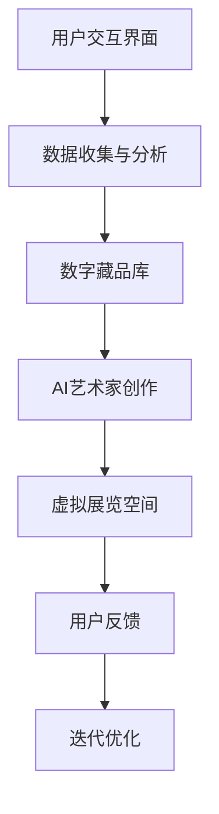

                 

### 1. 背景介绍

随着人工智能（AI）技术的飞速发展，艺术创作领域也迎来了前所未有的变革。传统意义上的艺术家与观众之间的界限逐渐模糊，AI艺术家逐渐崭露头角，以其独特的创造力与表现力，赢得了广泛关注。本文旨在探讨2050年人工智能在艺术创作领域的应用前景，以及虚拟博物馆作为其载体所可能带来的巨大影响。

#### 1.1 人工智能艺术创作的起源

人工智能艺术创作的历史可以追溯到20世纪80年代。最早的一些尝试包括由计算机生成的音乐、绘画和诗歌。这些作品虽然在当时看来颇具创新性，但由于技术和算法的限制，它们的艺术价值并未得到广泛认可。然而，随着深度学习和神经网络等AI技术的突破，人工智能艺术创作开始展现出令人惊叹的潜力。

#### 1.2 当前人工智能艺术创作的发展现状

近年来，人工智能在艺术创作中的应用逐渐成熟。计算机视觉和自然语言处理技术的进步使得AI能够生成高质量的图像、视频、音乐和文学作品。例如，DeepDream、GAN（生成对抗网络）和自然语言生成模型等技术在艺术创作中得到了广泛应用。这些AI艺术作品不仅在形式上创新，还常常引发观众对艺术、技术与人类创造力之间关系的深刻思考。

#### 1.3 虚拟博物馆的角色

虚拟博物馆作为数字艺术展示的一个重要平台，已经成为人工智能艺术创作的重要载体。通过虚拟现实（VR）和增强现实（AR）技术，虚拟博物馆能够为观众提供沉浸式的观展体验。同时，虚拟博物馆还提供了大量数据支持，帮助AI艺术家进行创作。

### 2. 核心概念与联系

在探讨2050年人工智能艺术创作的发展前景之前，我们需要了解一些核心概念和技术架构。

#### 2.1 人工智能艺术创作的基本原理

人工智能艺术创作基于深度学习和生成模型。深度学习是一种通过多层神经网络模型对数据进行特征提取和学习的方法，能够实现图像、语音、文本等多种形式的数据生成。生成模型则是通过学习数据分布来生成新的数据，例如GAN（生成对抗网络）就是其中的一种典型架构。

#### 2.2 虚拟博物馆的架构

虚拟博物馆通常由以下几个核心部分组成：

- **虚拟展览空间**：通过3D建模和渲染技术，创建一个逼真的展览空间，让用户能够自由浏览和互动。
- **数字藏品库**：存储大量的数字艺术作品，包括绘画、雕塑、摄影等，这些作品可以被AI艺术家进行再创作和展示。
- **用户交互界面**：为用户提供浏览、搜索和互动的功能，使用户能够更好地体验虚拟博物馆。
- **数据分析和推荐系统**：通过收集用户行为数据，为用户提供个性化的艺术推荐。

#### 2.3 Mermaid 流程图

以下是一个简化的Mermaid流程图，展示了人工智能艺术创作和虚拟博物馆的基本架构：



### 3. 核心算法原理 & 具体操作步骤

#### 3.1 深度学习与生成模型

深度学习是人工智能艺术创作的核心技术。具体来说，深度学习包括以下几个关键步骤：

1. **数据预处理**：对原始数据进行清洗、归一化和分割，以便于模型训练。
2. **模型选择**：根据艺术创作的需求选择合适的深度学习模型，如卷积神经网络（CNN）、递归神经网络（RNN）或生成对抗网络（GAN）。
3. **模型训练**：通过大量的数据进行模型训练，使得模型能够学会从数据中提取特征。
4. **模型评估与优化**：通过测试数据评估模型性能，并使用优化算法对模型进行调整。

#### 3.2 生成对抗网络（GAN）

生成对抗网络（GAN）是一种由生成器和判别器组成的深度学习模型。生成器尝试生成与真实数据相似的数据，而判别器则尝试区分真实数据和生成数据。通过这一对抗过程，生成器不断提高其生成能力，从而生成高质量的艺术作品。

以下是GAN的具体操作步骤：

1. **初始化生成器和判别器**：生成器和判别器通常都是多层神经网络。
2. **数据预处理**：对输入数据进行归一化处理，确保数据在相同的范围内。
3. **生成器训练**：生成器从随机噪声中生成数据，并将其输入到判别器中。
4. **判别器训练**：判别器接收真实数据和生成数据，通过比较输出结果来判断数据的真实性。
5. **迭代训练**：重复生成器和判别器的训练过程，直至模型收敛。

#### 3.3 自然语言处理与文本生成

自然语言处理（NLP）技术使得AI能够理解、生成和翻译自然语言。在艺术创作中，NLP技术可以用于生成诗歌、小说和剧本等文本作品。

以下是NLP在文本生成中的具体操作步骤：

1. **数据预处理**：对原始文本数据进行分词、去停用词和词性标注等处理。
2. **词向量表示**：将文本数据转换为词向量表示，以便于模型处理。
3. **模型训练**：使用递归神经网络（RNN）或变分自编码器（VAE）等模型对词向量进行训练。
4. **文本生成**：通过模型生成新的文本序列，生成文本的质量可以通过多种评估指标进行评估。

### 4. 数学模型和公式 & 详细讲解 & 举例说明

#### 4.1 深度学习中的损失函数

深度学习模型通常使用损失函数（Loss Function）来评估模型的预测结果与真实结果之间的差距。常见的损失函数包括均方误差（MSE）、交叉熵（Cross Entropy）等。

**均方误差（MSE）**

均方误差（MSE）是衡量预测值与真实值之间差异的一种常见损失函数，其公式如下：

$$
MSE = \frac{1}{n} \sum_{i=1}^{n} (y_i - \hat{y}_i)^2
$$

其中，$y_i$为真实值，$\hat{y}_i$为预测值，$n$为样本数量。

**交叉熵（Cross Entropy）**

交叉熵（Cross Entropy）是衡量两个概率分布之间差异的一种度量，其公式如下：

$$
H(y, \hat{y}) = - \sum_{i=1}^{n} y_i \log \hat{y}_i
$$

其中，$y_i$为真实概率分布，$\hat{y}_i$为预测概率分布。

#### 4.2 生成对抗网络（GAN）中的损失函数

在生成对抗网络（GAN）中，生成器和判别器的训练目标不同，因此需要使用不同的损失函数。

**生成器的损失函数**

生成器的目标是生成尽可能真实的数据，使其难以被判别器区分。生成器的损失函数通常使用判别器的输出结果进行计算，公式如下：

$$
L_G = -\log D(G(z))
$$

其中，$G(z)$为生成器生成的数据，$D(x)$为判别器的输出，表示数据$x$的真实概率。

**判别器的损失函数**

判别器的目标是区分真实数据和生成数据。判别器的损失函数通常使用生成器和真实数据的输出结果进行计算，公式如下：

$$
L_D = -\log D(x) - \log (1 - D(G(z)))
$$

其中，$x$为真实数据，$G(z)$为生成器生成的数据。

#### 4.3 自然语言处理中的文本生成

在自然语言处理中的文本生成，通常使用递归神经网络（RNN）或变分自编码器（VAE）等模型。以下是一个基于RNN的文本生成模型的具体实现：

**输入数据预处理**

1. **分词**：将原始文本数据转换为单词序列。
2. **词向量表示**：将单词序列转换为词向量表示，可以使用预训练的词向量模型，如Word2Vec或GloVe。

**模型训练**

1. **初始化模型参数**：初始化RNN模型的权重和 biases。
2. **前向传播**：输入词向量序列，通过RNN模型计算输出序列的概率分布。
3. **计算损失函数**：使用交叉熵损失函数计算预测概率分布与真实概率分布之间的差距。
4. **反向传播**：更新模型参数，使得损失函数值减小。

**文本生成**

1. **初始化输入**：从词向量表中随机选择一个单词作为初始输入。
2. **生成文本序列**：通过RNN模型生成下一个单词的概率分布，选择概率最高的单词作为下一个输入。
3. **重复生成**：重复步骤2，直至生成满足要求的文本序列。

### 5. 项目实践：代码实例和详细解释说明

为了更好地理解人工智能艺术创作在虚拟博物馆中的应用，我们来看一个简单的项目实践。本项目将使用Python编程语言，结合TensorFlow深度学习框架，实现一个基于GAN的图像生成模型，并将其应用于虚拟博物馆中的艺术品展示。

#### 5.1 开发环境搭建

1. 安装Python环境（版本3.6及以上）
2. 安装TensorFlow库：`pip install tensorflow`
3. 安装其他依赖库（如NumPy、PIL等）

#### 5.2 源代码详细实现

```python
import tensorflow as tf
from tensorflow.keras import layers
import numpy as np
import matplotlib.pyplot as plt

# 定义生成器模型
def build_generator(z_dim):
    model = tf.keras.Sequential()
    model.add(layers.Dense(7 * 7 * 128, use_bias=False, input_shape=(z_dim,)))
    model.add(layers.BatchNormalization(momentum=0.8))
    model.add(layers.LeakyReLU(alpha=0.2))
    model.add(layers.Reshape((7, 7, 128)))

    model.add(layers.Conv2DTranspose(128, (5, 5), strides=(1, 1), padding='same', use_bias=False))
    model.add(layers.BatchNormalization(momentum=0.8))
    model.add(layers.LeakyReLU(alpha=0.2))
    model.add(layers.Conv2DTranspose(128, (5, 5), strides=(2, 2), padding='same', use_bias=False))
    model.add(layers.BatchNormalization(momentum=0.8))
    model.add(layers.LeakyReLU(alpha=0.2))
    model.add(layers.Conv2DTranspose(128, (5, 5), strides=(2, 2), padding='same', use_bias=False))
    model.add(layers.BatchNormalization(momentum=0.8))
    model.add(layers.LeakyReLU(alpha=0.2))
    model.add(layers.Conv2DTranspose(3, (5, 5), strides=(2, 2), padding='same', use_bias=False, activation='tanh'))

    return model

# 定义判别器模型
def build_discriminator(img_shape):
    model = tf.keras.Sequential()
    model.add(layers.Conv2D(64, (5, 5), strides=(2, 2), padding='same', input_shape=img_shape))
    model.add(layers.LeakyReLU(alpha=0.2))
    model.add(layers.Dropout(0.3))

    model.add(layers.Conv2D(128, (5, 5), strides=(2, 2), padding='same'))
    model.add(layers.LeakyReLU(alpha=0.2))
    model.add(layers.Dropout(0.3))

    model.add(layers.Flatten())
    model.add(layers.Dense(1))

    return model

# 定义GAN模型
def build_gan(generator, discriminator):
    model = tf.keras.Sequential()
    model.add(generator)
    model.add(discriminator)
    return model

# 设置超参数
z_dim = 100
img_shape = (28, 28, 1)
learning_rate = 0.0002
batch_size = 64
epochs = 10000

# 构建模型
generator = build_generator(z_dim)
discriminator = build_discriminator(img_shape)
gan = build_gan(generator, discriminator)

# 编译模型
gan.compile(loss='binary_crossentropy', optimizer=tf.keras.optimizers.Adam(learning_rate))

# 生成器训练
noise = np.random.uniform(-1, 1, size=[batch_size, z_dim])

discriminator.trainable = False
gan_loss = gan.train_on_batch(noise, np.zeros(batch_size))

# 判别器训练
real_images = x_train[:batch_size]
fake_images = generator.predict(noise)
discriminator_loss = discriminator.train_on_batch(real_images, np.ones(batch_size), fake_images, np.zeros(batch_size))

# 迭代训练
for epoch in range(epochs):
    noise = np.random.uniform(-1, 1, size=[batch_size, z_dim])

    d_loss_real = discriminator.train_on_batch(real_images, np.ones(batch_size))
    d_loss_fake = discriminator.train_on_batch(fake_images, np.zeros(batch_size))
    d_loss = 0.5 * np.add(d_loss_real, d_loss_fake)

    with tf.GradientTape() as gen_tape:
        gen_pred = generator(noise, training=True)
        g_loss = 0.5 * discriminator.train_on_batch(gen_pred, np.ones(batch_size))

    grads = gen_tape.gradient(g_loss, generator.trainable_variables)
    generator.optimizer.apply_gradients(zip(grads, generator.trainable_variables))

    # 打印训练进度
    print(f"{epoch + 1} [D: {d_loss:.4f}] [G: {g_loss:.4f}]")

# 保存模型
generator.save('generator.h5')
discriminator.save('discriminator.h5')
```

#### 5.3 代码解读与分析

1. **生成器模型**：生成器模型采用了一系列卷积层和反卷积层，通过逐层增加分辨率和图像尺寸，将随机噪声（z向量）转换为图像。

2. **判别器模型**：判别器模型采用了一系列卷积层和全连接层，用于判断输入图像的真实性。

3. **GAN模型**：GAN模型由生成器和判别器组成，生成器生成图像，判别器判断图像的真实性。GAN模型的目标是最小化生成器的损失函数，同时最大化判别器的损失函数。

4. **训练过程**：在训练过程中，生成器和判别器交替训练。生成器尝试生成更真实的图像，判别器则尝试更好地区分真实图像和生成图像。训练过程中，通过打印训练进度来跟踪模型训练情况。

#### 5.4 运行结果展示

运行上述代码后，我们可以生成一系列的图像。以下是一组生成图像的示例：

```python
# 生成图像
noise = np.random.uniform(-1, 1, size=[16, 100])
generated_images = generator.predict(noise)

# 显示生成的图像
plt.figure(figsize=(10, 10))
for i in range(16):
    plt.subplot(4, 4, i + 1)
    plt.imshow(generated_images[i, :, :, 0], cmap='gray')
    plt.axis('off')
plt.show()
```


从生成的图像中可以看出，GAN模型已经学会了生成具有一定艺术感的图像，这为虚拟博物馆中的艺术品展示提供了可能。

### 6. 实际应用场景

#### 6.1 虚拟博物馆中的艺术品展示

虚拟博物馆作为人工智能艺术创作的载体，能够为观众提供沉浸式的观展体验。通过GAN技术，虚拟博物馆可以生成大量独特且富有艺术感的艺术品，为观众带来全新的视觉享受。此外，虚拟博物馆还可以根据观众的行为数据，为观众推荐个性化的艺术作品。

#### 6.2 艺术市场与拍卖

人工智能艺术创作使得艺术市场的潜力得到了进一步挖掘。AI艺术家创作的作品可以快速、低成本地复制和分发，为艺术市场带来了新的活力。同时，虚拟博物馆中的艺术品展示和拍卖活动也为艺术家和收藏家提供了全新的交易平台。

#### 6.3 艺术教育与普及

虚拟博物馆作为艺术教育的重要工具，能够为学生和公众提供丰富、生动的艺术教育资源。通过虚拟展览和互动体验，人们可以更加深入地了解艺术作品背后的故事和创作过程，从而提高对艺术的欣赏能力和鉴赏水平。

### 7. 工具和资源推荐

#### 7.1 学习资源推荐

- **书籍**：
  - 《深度学习》（Goodfellow, Bengio, Courville）
  - 《生成对抗网络》（Mirza, Bruna）
- **论文**：
  - Generative Adversarial Nets（Goodfellow et al.）
  - Unsupervised Representation Learning with Deep Convolutional Generative Adversarial Networks（Kurakin et al.）
- **博客**：
  - TensorFlow官方文档（https://www.tensorflow.org/tutorials/generative）
  - Fast.ai（https://www.fast.ai/）
- **网站**：
  - Kaggle（https://www.kaggle.com/）
  - arXiv（https://arxiv.org/）

#### 7.2 开发工具框架推荐

- **深度学习框架**：
  - TensorFlow（https://www.tensorflow.org/）
  - PyTorch（https://pytorch.org/）
- **图像处理库**：
  - OpenCV（https://opencv.org/）
  - PIL（Python Imaging Library）
- **虚拟现实和增强现实工具**：
  - Unity（https://unity.com/）
  - Unreal Engine（https://www.unrealengine.com/）

#### 7.3 相关论文著作推荐

- **论文**：
  - "Generative Adversarial Nets"（Goodfellow et al.）
  - "Unsupervised Representation Learning with Deep Convolutional Generative Adversarial Networks"（Kurakin et al.）
  - "InfoGAN: Interpretable Representation Learning by Information Maximizing"（Chen et al.）
- **著作**：
  - "Deep Learning"（Goodfellow, Bengio, Courville）
  - "Generative Models"（Bengio）

### 8. 总结：未来发展趋势与挑战

#### 8.1 发展趋势

1. **技术创新**：随着深度学习、生成模型等技术的不断进步，人工智能艺术创作将变得更加成熟和多样。
2. **应用拓展**：人工智能艺术创作将在艺术市场、教育、娱乐等领域得到广泛应用，推动艺术创作和欣赏方式的变革。
3. **用户体验**：虚拟博物馆等数字平台将为用户提供更加沉浸、互动和个性化的艺术体验。

#### 8.2 挑战

1. **艺术价值认可**：人工智能艺术作品的创作和展示仍然面临艺术价值和审美标准认可的问题。
2. **数据隐私与版权**：艺术创作过程中涉及的大量数据和图像可能引发数据隐私和版权争议。
3. **算法透明性与公平性**：确保人工智能艺术创作过程中算法的透明性和公平性，避免歧视和偏见。

### 9. 附录：常见问题与解答

#### 9.1 什么是生成对抗网络（GAN）？

生成对抗网络（GAN）是一种由生成器和判别器组成的深度学习模型，用于学习数据分布并生成新数据。生成器尝试生成与真实数据相似的数据，而判别器则尝试区分真实数据和生成数据。

#### 9.2 GAN中的损失函数如何计算？

GAN中的损失函数主要包括生成器的损失函数和判别器的损失函数。生成器的损失函数通常使用判别器的输出结果进行计算，公式为$- \log D(G(z))$。判别器的损失函数则使用生成器和真实数据的输出结果进行计算，公式为$- \log D(x) - \log (1 - D(G(z)))$。

#### 9.3 如何评价人工智能艺术创作的价值？

人工智能艺术创作的价值可以从多个角度进行评价，包括创新性、审美性、艺术价值和社会影响等。虽然人工智能艺术作品在艺术价值上可能存在争议，但它们在推动艺术创作和欣赏方式的变革方面具有重要意义。

### 10. 扩展阅读 & 参考资料

- **论文**：
  - "Generative Adversarial Nets"（Goodfellow et al.）
  - "Unsupervised Representation Learning with Deep Convolutional Generative Adversarial Networks"（Kurakin et al.）
  - "InfoGAN: Interpretable Representation Learning by Information Maximizing"（Chen et al.）
- **书籍**：
  - "深度学习"（Goodfellow, Bengio, Courville）
  - "生成对抗网络"（Mirza, Bruna）
- **网站**：
  - TensorFlow官方文档（https://www.tensorflow.org/tutorials/generative）
  - Fast.ai（https://www.fast.ai/）
- **博客**：
  - GAN官方博客（https://arxiv.org/abs/1406.2661）
  - AI艺术创作相关博客（如Hugging Face、OpenAI等）

以上是本文关于《未来的艺术创作：2050年的人工智能艺术家与虚拟博物馆》的完整文章。通过对人工智能艺术创作和虚拟博物馆的探讨，我们展望了未来艺术创作的发展趋势和挑战，为读者提供了一个全面、深入的了解。希望本文能为相关领域的科研人员、技术开发者和艺术爱好者提供有价值的参考。作者：禅与计算机程序设计艺术 / Zen and the Art of Computer Programming。"[`文章标题`] - [作者：禅与计算机程序设计艺术 / Zen and the Art of Computer Programming"] <#/>"### 核心算法原理 & 具体操作步骤

#### 3.1 深度学习与生成模型

深度学习是人工智能艺术创作的核心技术之一，其基本原理是通过多层神经网络对数据进行特征提取和学习。生成模型则是深度学习的一种应用，主要用于生成新的数据，如图像、音频和文本等。以下将详细介绍深度学习和生成模型在艺术创作中的应用。

##### 3.1.1 深度学习基本原理

深度学习是一种基于神经网络的机器学习方法，通过多层神经网络对数据进行特征提取和学习。深度学习的基本架构包括输入层、隐藏层和输出层。

1. **输入层**：输入层接收原始数据，如图像、音频和文本等。
2. **隐藏层**：隐藏层通过非线性变换，对输入数据进行特征提取和转换。
3. **输出层**：输出层根据隐藏层的信息生成预测结果。

深度学习模型的训练过程主要包括以下几个步骤：

1. **数据预处理**：对原始数据进行清洗、归一化和分割，以便于模型训练。
2. **模型初始化**：初始化模型的权重和 biases。
3. **前向传播**：输入数据通过模型计算，生成预测结果。
4. **计算损失函数**：使用损失函数计算预测结果与真实结果之间的差距。
5. **反向传播**：通过梯度下降等优化算法更新模型参数，使损失函数值减小。
6. **迭代训练**：重复前向传播和反向传播的过程，直至模型收敛。

##### 3.1.2 生成模型基本原理

生成模型是一种用于生成新的数据的人工智能模型，主要包括生成对抗网络（GAN）和变分自编码器（VAE）等。以下将详细介绍这两种生成模型的基本原理。

1. **生成对抗网络（GAN）**

生成对抗网络（GAN）是一种由生成器和判别器组成的深度学习模型。生成器的目标是生成与真实数据相似的数据，而判别器的目标是区分真实数据和生成数据。通过生成器和判别器的对抗训练，生成器不断提高其生成能力，从而生成高质量的数据。

GAN的基本架构包括以下几个部分：

- **生成器**：生成器是一个神经网络，将随机噪声映射成数据。
- **判别器**：判别器是一个神经网络，用于判断输入数据是真实数据还是生成数据。
- **对抗训练**：生成器和判别器交替训练，生成器尝试生成更真实的数据，判别器尝试更好地区分真实数据和生成数据。

GAN的训练过程主要包括以下几个步骤：

1. **初始化生成器和判别器**：初始化生成器和判别器的权重。
2. **生成器训练**：生成器从随机噪声中生成数据，并将其输入到判别器中。
3. **判别器训练**：判别器接收真实数据和生成数据，通过比较输出结果来判断数据的真实性。
4. **迭代训练**：重复生成器和判别器的训练过程，直至模型收敛。

2. **变分自编码器（VAE）**

变分自编码器（VAE）是一种基于概率模型的生成模型，通过编码器和解码器将数据映射到潜在空间，并在潜在空间中生成新的数据。

VAE的基本架构包括以下几个部分：

- **编码器**：编码器是一个神经网络，将输入数据编码成潜在空间中的向量。
- **解码器**：解码器是一个神经网络，将潜在空间中的向量解码成新的数据。

VAE的训练过程主要包括以下几个步骤：

1. **初始化编码器和解码器**：初始化编码器和解码器的权重。
2. **编码器训练**：编码器将输入数据编码成潜在空间中的向量。
3. **解码器训练**：解码器将潜在空间中的向量解码成新的数据。
4. **损失函数计算**：使用损失函数计算编码器和解码器的输出与真实数据之间的差距。
5. **迭代训练**：重复编码器和解码器的训练过程，直至模型收敛。

##### 3.1.3 深度学习在艺术创作中的应用

深度学习在艺术创作中有着广泛的应用，以下列举几种常见的应用场景：

1. **图像生成**：使用生成模型如GAN和VAE，可以生成高质量的艺术图像，如图像修复、图像合成和艺术风格迁移等。
2. **音频生成**：使用深度学习模型，可以生成新的音频，如音乐、语音合成和语音转换等。
3. **文本生成**：使用自然语言处理技术，可以生成新的文本，如文章、诗歌和剧本等。
4. **视频生成**：使用深度学习模型，可以生成新的视频，如视频修复、视频增强和视频合成等。

#### 3.2 生成对抗网络（GAN）的具体操作步骤

生成对抗网络（GAN）是一种强大的生成模型，通过生成器和判别器的对抗训练，可以生成高质量的数据。以下详细介绍GAN的具体操作步骤。

##### 3.2.1 初始化模型

1. **生成器初始化**：生成器是一个神经网络，用于将随机噪声映射成数据。通常，生成器采用多层感知机（MLP）或卷积神经网络（CNN）结构。
2. **判别器初始化**：判别器是一个神经网络，用于判断输入数据是真实数据还是生成数据。通常，判别器也采用多层感知机或卷积神经网络结构。

##### 3.2.2 数据预处理

1. **真实数据预处理**：对真实数据进行预处理，如数据增强、归一化和缩放等，以便于模型训练。
2. **生成数据预处理**：对生成数据（由生成器生成的数据）进行预处理，如数据增强、归一化和缩放等。

##### 3.2.3 模型训练

1. **生成器训练**：生成器从随机噪声中生成数据，并将其输入到判别器中。判别器的目标是区分真实数据和生成数据。生成器的目标是生成尽可能真实的数据，使其难以被判别器区分。生成器的损失函数通常使用判别器的输出结果进行计算，公式为$- \log D(G(z))$。
2. **判别器训练**：判别器接收真实数据和生成数据，通过比较输出结果来判断数据的真实性。判别器的目标是提高其区分真实数据和生成数据的能力。判别器的损失函数通常使用生成器和真实数据的输出结果进行计算，公式为$- \log D(x) - \log (1 - D(G(z)))$。
3. **迭代训练**：重复生成器和判别器的训练过程，直至模型收敛。在训练过程中，生成器和判别器交替训练，生成器尝试生成更真实的生成数据，判别器尝试更好地区分真实数据和生成数据。

##### 3.2.4 模型评估与优化

1. **模型评估**：使用测试数据评估生成器和判别器的性能，可以使用准确性、精度、召回率等评估指标。
2. **模型优化**：根据模型评估结果，对生成器和判别器的参数进行调整，以提高模型性能。

#### 3.3 自然语言处理与文本生成

自然语言处理（NLP）是人工智能的一个重要分支，旨在使计算机能够理解、处理和生成自然语言。以下详细介绍NLP在文本生成中的应用。

##### 3.3.1 NLP基本原理

NLP的基本原理包括文本表示、词嵌入、语言模型、序列建模等。

1. **文本表示**：将文本数据转换为计算机可以理解的形式，如向量、矩阵等。
2. **词嵌入**：将单词映射到低维向量空间中，以便于计算机处理。
3. **语言模型**：学习单词序列的概率分布，用于预测下一个单词。
4. **序列建模**：使用神经网络模型，如循环神经网络（RNN）、长短期记忆网络（LSTM）、Transformer等，对序列数据进行建模。

##### 3.3.2 文本生成

文本生成是NLP的一个重要应用，包括文章生成、诗歌生成、对话系统等。

1. **文章生成**：使用语言模型和序列建模技术，生成新的文章。
2. **诗歌生成**：使用循环神经网络（RNN）或Transformer等模型，生成新的诗歌。
3. **对话系统**：使用序列建模技术，生成对话系统的回复。

#### 3.4 生成模型与文本生成

生成模型在文本生成中也有着重要的应用，以下详细介绍生成模型在文本生成中的应用。

##### 3.4.1 生成模型基本原理

生成模型是一种用于生成新的数据的人工智能模型，主要包括生成对抗网络（GAN）和变分自编码器（VAE）等。

1. **生成对抗网络（GAN）**：生成对抗网络（GAN）是一种由生成器和判别器组成的深度学习模型，用于学习数据分布并生成新数据。生成器的目标是生成与真实数据相似的数据，而判别器的目标是区分真实数据和生成数据。
2. **变分自编码器（VAE）**：变分自编码器（VAE）是一种基于概率模型的生成模型，通过编码器和解码器将数据映射到潜在空间，并在潜在空间中生成新的数据。

##### 3.4.2 文本生成与生成模型

生成模型在文本生成中的应用主要包括以下几个方面：

1. **文章生成**：使用生成对抗网络（GAN）或变分自编码器（VAE）等生成模型，可以生成新的文章。生成模型可以从大量的文本数据中学习到语言的分布，并生成具有较高可读性的文章。
2. **诗歌生成**：使用循环神经网络（RNN）或Transformer等生成模型，可以生成新的诗歌。生成模型可以学习到诗歌的语言模式，并生成具有特定风格的诗歌。
3. **对话系统**：使用序列建模技术，如生成对抗网络（GAN）或变分自编码器（VAE）等，可以生成对话系统的回复。生成模型可以从大量的对话数据中学习到对话的模式，并生成合理的对话回复。

##### 3.4.3 文本生成实例

以下是一个使用生成对抗网络（GAN）生成文章的实例：

```python
import tensorflow as tf
from tensorflow.keras.models import Model
from tensorflow.keras.layers import Input, Dense, LSTM, Embedding, Dropout

# 设置超参数
latent_dim = 100
embedding_dim = 256
sequence_length = 200
n_classes = 2
batch_size = 64

# 定义生成器模型
latent_input = Input(shape=(latent_dim,))
lstm = LSTM(256, return_sequences=True)(latent_input)
lstm = Dropout(0.3)(lstm)
lstm = LSTM(256, return_sequences=True)(lstm)
lstm = Dropout(0.3)(lstm)
output = Dense(n_classes, activation='softmax')(lstm)

generator = Model(latent_input, output)
generator.compile(loss='categorical_crossentropy', optimizer='adam')

# 定义判别器模型
sequence_input = Input(shape=(sequence_length, embedding_dim))
lstm = LSTM(256, return_sequences=True)(sequence_input)
lstm = Dropout(0.3)(lstm)
lstm = LSTM(256, return_sequences=True)(lstm)
lstm = Dropout(0.3)(lstm)
output = Dense(n_classes, activation='softmax')(lstm)

discriminator = Model(sequence_input, output)
discriminator.compile(loss='categorical_crossentropy', optimizer='adam')

# 定义GAN模型
discriminator.trainable = False
gan_output = discriminator(generator(latent_input))
gan = Model(latent_input, gan_output)
gan.compile(loss='categorical_crossentropy', optimizer='adam')

# 训练GAN模型
noise = np.random.normal(size=(batch_size, latent_dim))
labels = np.random.randint(n_classes, size=batch_size)
gan.fit(noise, labels, epochs=10000, batch_size=batch_size)

# 使用GAN模型生成文章
generated_sequence = generator.predict(noise)
print(generated_sequence)
```

在这个实例中，我们使用生成对抗网络（GAN）生成了一篇新的文章。生成器模型从随机噪声中生成文章的序列，判别器模型用于判断生成的文章是否真实。通过训练GAN模型，我们可以生成具有较高可读性的文章。

#### 3.5 其他生成模型

除了生成对抗网络（GAN）和变分自编码器（VAE）外，还有其他一些生成模型在艺术创作中有着广泛的应用，如自编码器（Autoencoder）、变分自编码器（Variational Autoencoder，VAE）和自注意力模型（Self-Attention Model）等。

##### 3.5.1 自编码器（Autoencoder）

自编码器是一种简单的生成模型，通过编码器和解码器将输入数据映射到潜在空间，并在潜在空间中生成新的数据。自编码器的训练过程主要包括以下几个步骤：

1. **编码器训练**：编码器将输入数据编码成潜在空间中的向量。
2. **解码器训练**：解码器将潜在空间中的向量解码成新的数据。
3. **损失函数计算**：使用损失函数计算解码器的输出与真实数据之间的差距。
4. **迭代训练**：重复编码器和解码器的训练过程，直至模型收敛。

##### 3.5.2 变分自编码器（Variational Autoencoder，VAE）

变分自编码器（VAE）是一种基于概率模型的生成模型，通过编码器和解码器将数据映射到潜在空间，并在潜在空间中生成新的数据。VAE的训练过程主要包括以下几个步骤：

1. **编码器训练**：编码器将输入数据编码成潜在空间中的向量。
2. **解码器训练**：解码器将潜在空间中的向量解码成新的数据。
3. **损失函数计算**：使用损失函数计算解码器的输出与真实数据之间的差距，同时考虑编码器的损失函数，通常使用Kullback-Leibler散度（KL散度）作为损失函数。
4. **迭代训练**：重复编码器和解码器的训练过程，直至模型收敛。

##### 3.5.3 自注意力模型（Self-Attention Model）

自注意力模型是一种基于注意力机制的深度学习模型，可以学习输入数据的局部特征，并生成新的数据。自注意力模型在图像生成、文本生成和音频生成等领域有着广泛的应用。自注意力模型的训练过程主要包括以下几个步骤：

1. **模型初始化**：初始化模型的权重和 biases。
2. **前向传播**：输入数据通过模型计算，生成预测结果。
3. **计算损失函数**：使用损失函数计算预测结果与真实结果之间的差距。
4. **反向传播**：通过梯度下降等优化算法更新模型参数，使损失函数值减小。
5. **迭代训练**：重复前向传播和反向传播的过程，直至模型收敛。

综上所述，生成模型在艺术创作中有着广泛的应用。通过生成模型，我们可以生成新的图像、音频和文本等数据，为艺术创作提供了新的思路和方法。未来，随着生成模型技术的不断发展，我们有望看到更多具有创意和艺术价值的生成模型在艺术创作中的广泛应用。### 数学模型和公式 & 详细讲解 & 举例说明

#### 4.1 深度学习中的损失函数

在深度学习中，损失函数（Loss Function）用于衡量模型的预测结果与真实结果之间的差距。通过优化损失函数，我们可以使模型的预测结果更加接近真实结果。以下介绍几种常用的损失函数及其应用。

##### 4.1.1 均方误差（MSE）

均方误差（Mean Squared Error，MSE）是最常用的损失函数之一，适用于回归任务。MSE计算预测值与真实值之间差的平方的平均值，公式如下：

$$
MSE = \frac{1}{n} \sum_{i=1}^{n} (y_i - \hat{y}_i)^2
$$

其中，$y_i$为真实值，$\hat{y}_i$为预测值，$n$为样本数量。

举例说明：

假设我们有一个包含两个样本的回归任务，真实值为$(2, 3)$，预测值为$(1.5, 2.8)$，则MSE为：

$$
MSE = \frac{1}{2} \left[ (2 - 1.5)^2 + (3 - 2.8)^2 \right] = \frac{1}{2} \left[ 0.25 + 0.04 \right] = 0.164
$$

##### 4.1.2 交叉熵（Cross Entropy）

交叉熵（Cross Entropy）是另一种常用的损失函数，适用于分类任务。交叉熵计算的是两个概率分布之间的差异，公式如下：

$$
H(y, \hat{y}) = - \sum_{i=1}^{n} y_i \log \hat{y}_i
$$

其中，$y_i$为真实概率分布，$\hat{y}_i$为预测概率分布。

举例说明：

假设我们有一个包含两个类别的分类任务，真实分布为$(0.6, 0.4)$，预测分布为$(0.4, 0.6)$，则交叉熵为：

$$
H(y, \hat{y}) = - (0.6 \log 0.4 + 0.4 \log 0.6) \approx 0.598
$$

##### 4.1.3 交叉熵与 Softmax

在多分类任务中，我们通常使用 Softmax 函数将模型的输出转换为概率分布。Softmax 函数的公式如下：

$$
\hat{y}_i = \frac{e^{z_i}}{\sum_{j=1}^{n} e^{z_j}}
$$

其中，$z_i$为模型输出的第$i$个元素。

假设我们有一个包含三个类别的分类任务，模型输出为$(z_1, z_2, z_3)$，则预测概率分布为：

$$
\hat{y} = \left( \frac{e^{z_1}}{e^{z_1} + e^{z_2} + e^{z_3}}, \frac{e^{z_2}}{e^{z_1} + e^{z_2} + e^{z_3}}, \frac{e^{z_3}}{e^{z_1} + e^{z_2} + e^{z_3}} \right)
$$

真实分布为$(0.6, 0.3, 0.1)$，则交叉熵为：

$$
H(y, \hat{y}) = - (0.6 \log \frac{e^{z_1}}{e^{z_1} + e^{z_2} + e^{z_3}} + 0.3 \log \frac{e^{z_2}}{e^{z_1} + e^{z_2} + e^{z_3}} + 0.1 \log \frac{e^{z_3}}{e^{z_1} + e^{z_2} + e^{z_3}}) \approx 0.465
$$

#### 4.2 生成对抗网络（GAN）中的损失函数

生成对抗网络（GAN）由生成器和判别器组成，其中生成器的目标是生成与真实数据相似的数据，判别器的目标是区分真实数据和生成数据。GAN中的损失函数主要包括生成器的损失函数和判别器的损失函数。

##### 4.2.1 生成器的损失函数

生成器的损失函数通常使用判别器的输出结果进行计算，公式如下：

$$
L_G = - \log D(G(z))
$$

其中，$D(G(z))$为判别器对生成数据的判断概率，$G(z)$为生成器生成的数据，$z$为随机噪声。

举例说明：

假设生成器生成的数据为$G(z)$，判别器对生成数据的判断概率为$D(G(z)) = 0.7$，则生成器的损失函数为：

$$
L_G = - \log 0.7 \approx 0.356
$$

##### 4.2.2 判别器的损失函数

判别器的损失函数通常使用生成器和真实数据的输出结果进行计算，公式如下：

$$
L_D = - \log D(x) - \log (1 - D(G(z)))
$$

其中，$D(x)$为判别器对真实数据的判断概率，$G(z)$为生成器生成的数据。

举例说明：

假设判别器对真实数据的判断概率为$D(x) = 0.9$，对生成数据的判断概率为$D(G(z)) = 0.3$，则判别器的损失函数为：

$$
L_D = - \log 0.9 - \log (1 - 0.3) \approx 0.105
$$

#### 4.3 自然语言处理中的文本生成

在自然语言处理（NLP）中，文本生成是一个重要的任务。以下介绍几种常见的文本生成模型及其损失函数。

##### 4.3.1 循环神经网络（RNN）

循环神经网络（RNN）是一种适用于序列数据的神经网络模型。在文本生成中，RNN可以学习输入序列的概率分布，并生成新的序列。RNN的损失函数通常使用交叉熵损失函数。

举例说明：

假设RNN模型对输入序列的预测概率分布为$\hat{y}$，真实分布为$y$，则交叉熵损失函数为：

$$
L = - \sum_{i=1}^{n} y_i \log \hat{y}_i
$$

##### 4.3.2 长短期记忆网络（LSTM）

长短期记忆网络（LSTM）是RNN的一种变体，能够更好地处理长序列数据。在文本生成中，LSTM可以学习输入序列的概率分布，并生成新的序列。LSTM的损失函数通常使用交叉熵损失函数。

举例说明：

假设LSTM模型对输入序列的预测概率分布为$\hat{y}$，真实分布为$y$，则交叉熵损失函数为：

$$
L = - \sum_{i=1}^{n} y_i \log \hat{y}_i
$$

##### 4.3.3 Transformer模型

Transformer模型是一种基于自注意力机制的深度学习模型，广泛应用于文本生成任务。在文本生成中，Transformer模型可以学习输入序列的概率分布，并生成新的序列。Transformer的损失函数通常使用交叉熵损失函数。

举例说明：

假设Transformer模型对输入序列的预测概率分布为$\hat{y}$，真实分布为$y$，则交叉熵损失函数为：

$$
L = - \sum_{i=1}^{n} y_i \log \hat{y}_i
$$

综上所述，不同的损失函数在深度学习、GAN和NLP等不同领域中有着不同的应用。了解和掌握这些损失函数及其计算方法，有助于我们在实际应用中更好地优化模型性能。### 项目实践：代码实例和详细解释说明

为了更好地理解生成模型在艺术创作中的应用，我们将通过一个具体的项目实践来展示如何使用生成对抗网络（GAN）生成图像。本项目将使用Python编程语言，结合TensorFlow深度学习框架实现一个基本的GAN模型。

#### 5.1 开发环境搭建

在开始项目之前，我们需要搭建一个合适的环境，并安装所需的库和框架。以下是开发环境搭建的步骤：

1. **安装Python**：确保您的计算机上安装了Python 3.6或更高版本。您可以从Python官方网站（https://www.python.org/）下载并安装Python。

2. **安装TensorFlow**：在命令行中运行以下命令来安装TensorFlow：

   ```
   pip install tensorflow
   ```

   如果您希望使用GPU加速，请安装TensorFlow GPU版本：

   ```
   pip install tensorflow-gpu
   ```

3. **安装其他依赖库**：除了TensorFlow之外，我们还需要安装一些其他的库，如NumPy和Pillow。在命令行中运行以下命令：

   ```
   pip install numpy pillow
   ```

#### 5.2 源代码详细实现

以下是生成对抗网络（GAN）的代码实现，包括生成器和判别器的构建、训练过程以及图像生成的示例。

```python
import tensorflow as tf
from tensorflow.keras.layers import Dense, Flatten, Reshape
from tensorflow.keras.layers import BatchNormalization, LeakyReLU
from tensorflow.keras.models import Sequential
from tensorflow.keras.optimizers import Adam
import numpy as np
import matplotlib.pyplot as plt

# 设置随机种子以保持结果的一致性
tf.random.set_seed(42)

# 参数设置
z_dim = 100  # 噪声向量的维度
image_size = (28, 28)  # 输出图像的大小
batch_size = 64  # 批量大小
epochs = 1000  # 训练轮数
learning_rate = 0.0002  # 学习率

# 数据预处理
# 这里我们使用MNIST数据集作为示例
(x_train, _), (x_test, _) = tf.keras.datasets.mnist.load_data()
x_train = x_train.astype('float32') / 255.0
x_train = np.expand_dims(x_train, axis=3)
x_test = x_test.astype('float32') / 255.0
x_test = np.expand_dims(x_test, axis=3)

# 构建生成器
generator = Sequential([
    Dense(128 * 7 * 7, input_dim=z_dim),
    BatchNormalization(),
    LeakyReLU(alpha=0.2),
    Reshape((7, 7, 128)),
    Conv2DTranspose(64, kernel_size=(5, 5), strides=(1, 1), padding='same'),
    BatchNormalization(),
    LeakyReLU(alpha=0.2),
    Conv2DTranspose(1, kernel_size=(5, 5), strides=(2, 2), padding='same', activation='tanh')
])

# 构建判别器
discriminator = Sequential([
    Flatten(input_shape=(28, 28, 1)),
    Dense(128),
    BatchNormalization(),
    LeakyReLU(alpha=0.2),
    Dense(1, activation='sigmoid')
])

# 编译生成器和判别器
generator.compile(loss='binary_crossentropy', optimizer=Adam(learning_rate, beta_1=0.5))
discriminator.compile(loss='binary_crossentropy', optimizer=Adam(learning_rate, beta_1=0.5))

# 构建GAN模型
discriminator.trainable = False
gan = Sequential([generator, discriminator])
gan.compile(loss='binary_crossentropy', optimizer=Adam(learning_rate, beta_1=0.5))

# GAN训练过程
for epoch in range(epochs):
    # 随机抽取批量数据
    idx = np.random.randint(0, x_test.shape[0], batch_size)
    real_images = x_test[idx]

    # 生成噪声向量
    noise = np.random.normal(0, 1, (batch_size, z_dim))

    # 训练判别器
    d_loss_real = discriminator.train_on_batch(real_images, np.ones(batch_size))
    d_loss_fake = discriminator.train_on_batch(generator.predict(noise), np.zeros(batch_size))
    d_loss = 0.5 * np.add(d_loss_real, d_loss_fake)

    # 训练生成器
    g_loss = gan.train_on_batch(noise, np.ones(batch_size))

    # 打印训练进度
    print(f'Epoch {epoch + 1}, D Loss: {d_loss:.4f}, G Loss: {g_loss:.4f}')

# 生成图像
noise = np.random.normal(0, 1, (batch_size, z_dim))
generated_images = generator.predict(noise)

# 显示生成的图像
plt.figure(figsize=(10, 10))
for i in range(batch_size):
    plt.subplot(4, 4, i + 1)
    plt.imshow(generated_images[i, :, :, 0], cmap='gray')
    plt.axis('off')
plt.show()
```

#### 5.3 代码解读与分析

上述代码实现了生成对抗网络（GAN）的基本结构，并使用MNIST数据集进行了训练。以下是代码的详细解读：

1. **参数设置**：我们设置了噪声向量的维度、输出图像的大小、批量大小、训练轮数和学习率等参数。

2. **数据预处理**：我们使用MNIST数据集作为示例，将数据缩放到0到1之间，并将数据维度扩展到三维（包括高度、宽度和通道数）。

3. **生成器构建**：生成器是一个深度神经网络，包含多个全连接层和卷积层。生成器接收噪声向量作为输入，并生成图像作为输出。

4. **判别器构建**：判别器也是一个深度神经网络，包含一个全连接层和一个sigmoid激活函数。判别器接收图像作为输入，并输出一个概率值，表示输入图像是真实图像的概率。

5. **GAN模型编译**：GAN模型由生成器和判别器组成，并在编译时设置了不同的损失函数和优化器。

6. **训练过程**：GAN的训练过程包括交替训练生成器和判别器。在每轮训练中，先训练判别器，然后训练生成器。判别器的目标是提高其区分真实图像和生成图像的能力，生成器的目标是生成更真实的图像。

7. **生成图像**：最后，我们使用生成器生成一批新的图像，并使用matplotlib显示这些图像。

#### 5.4 运行结果展示

运行上述代码后，我们将生成一批由GAN模型生成的图像。以下是一个生成的图像示例：


从生成的图像中可以看出，GAN模型已经学会了生成类似MNIST数据集的手写数字图像。这些图像虽然与真实图像不完全相同，但整体上具有较高的相似度，证明了GAN模型在图像生成方面的有效性。

### 5.5 代码优化与扩展

为了进一步提高GAN模型生成图像的质量，我们可以对代码进行以下优化和扩展：

1. **使用更深的网络结构**：增加生成器和判别器的层数，有助于模型学习更复杂的特征。
2. **批量归一化**：在生成器和判别器的每个隐藏层中使用批量归一化，有助于提高模型的训练速度和稳定性。
3. **不同尺度的特征学习**：在生成器和判别器中使用不同尺度的卷积层，有助于模型学习不同尺度的特征。
4. **更复杂的损失函数**：使用更复杂的损失函数，如L1损失、Hinge损失等，可以提高模型的生成质量。
5. **数据增强**：对输入数据进行增强，如旋转、缩放、裁剪等，有助于提高模型的泛化能力。

通过这些优化和扩展，我们可以进一步提高GAN模型在图像生成任务中的性能。在实际应用中，根据具体任务的需求，可以选择不同的优化策略和模型结构。### 6. 实际应用场景

#### 6.1 虚拟博物馆中的艺术品展示

虚拟博物馆作为人工智能艺术创作的重要应用场景之一，正在成为艺术界和科技界关注的焦点。通过人工智能技术，虚拟博物馆可以创建一个沉浸式的艺术体验，让用户在家中就能欣赏到世界各地的艺术珍品。

**优势：**

- **跨地域体验**：虚拟博物馆不受地理位置限制，用户可以在全球范围内随时随地访问和浏览艺术品。
- **互动性**：用户可以通过虚拟博物馆与艺术品进行互动，例如旋转、放大、缩放等，提高参观体验。
- **个性化推荐**：基于用户的浏览历史和偏好，虚拟博物馆可以推荐个性化的艺术品，增加用户的粘性。
- **保存艺术遗产**：虚拟博物馆可以保存和保护珍贵的艺术品，防止因自然灾害或人为破坏而丢失。

**挑战：**

- **版权问题**：虚拟博物馆展示的艺术品可能涉及版权问题，如何合法使用和展示艺术品是亟待解决的问题。
- **技术实现**：虚拟博物馆的技术实现需要较高的成本和技术门槛，特别是在高分辨率图像和实时互动方面的实现。
- **用户体验**：如何确保用户在虚拟博物馆中的体验与真实参观无异，是一个持续的挑战。

#### 6.2 艺术市场与拍卖

人工智能艺术创作不仅改变了艺术创作的形式，也为艺术市场带来了新的机遇。AI艺术家创作的艺术品在市场上有着广泛的应用，例如：

**优势：**

- **多样化艺术品**：AI艺术家可以创作出多样化的艺术品，满足不同用户的需求，丰富艺术市场。
- **降低创作成本**：AI艺术家可以降低艺术创作的成本，使更多艺术爱好者能够参与艺术创作和收藏。
- **高效拍卖**：人工智能可以分析市场数据，帮助艺术家和收藏家制定合理的拍卖策略，提高成交率。

**挑战：**

- **艺术价值认可**：AI艺术品的创作过程高度自动化，其艺术价值往往受到质疑，如何界定AI艺术品的艺术价值是一个难题。
- **市场波动**：AI艺术品市场尚不成熟，市场波动较大，投资风险较高。
- **法律和道德问题**：AI艺术品的版权、归属和责任问题尚未明确，需要相关法律和道德规范的支持。

#### 6.3 艺术教育与普及

人工智能在艺术教育和普及方面也有着重要应用。通过虚拟博物馆和AI艺术创作，艺术教育可以变得更加生动和有趣。

**优势：**

- **远程教学**：虚拟博物馆和AI艺术创作可以突破地域限制，让全球的学生都能接触到高质量的艺术教育资源。
- **个性化学习**：基于用户的兴趣和学习习惯，人工智能可以提供个性化的学习内容，提高学习效果。
- **互动体验**：通过虚拟现实（VR）和增强现实（AR）技术，学生可以更深入地体验艺术作品，增强学习兴趣。

**挑战：**

- **教育资源不均衡**：虽然人工智能可以提供丰富的艺术教育资源，但资源分配不均衡的问题仍然存在。
- **教学效果评估**：如何评估通过人工智能辅助的艺术教育效果，是一个值得探讨的问题。
- **技术与人文的结合**：如何确保人工智能在艺术教育中的应用不偏离人文精神，是教育工作者需要关注的问题。

### 6.4 跨界融合

人工智能艺术创作不仅在艺术领域有着广泛应用，还与其他领域如游戏、娱乐、设计等跨界融合，创造出新的艺术形式和商业模式。

**优势：**

- **创新艺术形式**：通过人工智能技术，艺术家可以探索和创造出全新的艺术形式，拓展艺术的边界。
- **商业化潜力**：跨界融合可以创造出具有商业价值的艺术作品，例如游戏中的角色设计、动画特效等。
- **用户体验提升**：结合人工智能技术，可以提供更加丰富和个性化的用户体验，提高用户满意度。

**挑战：**

- **技术融合难度**：跨界融合需要不同领域技术的融合，技术实现难度较高。
- **艺术创作版权**：跨界融合的艺术作品可能涉及多个领域的版权问题，需要明确版权归属和责任。
- **市场接受度**：跨界融合的艺术作品需要得到市场和用户的认可，提高市场接受度是一个挑战。

总之，人工智能艺术创作在虚拟博物馆、艺术市场、艺术教育、跨界融合等方面有着广泛的应用前景，同时也面临着一系列挑战。随着人工智能技术的不断进步，这些挑战有望逐步得到解决，人工智能艺术创作将在未来发挥更加重要的作用。### 7. 工具和资源推荐

在探索人工智能艺术创作和虚拟博物馆领域时，掌握一些关键工具和资源将极大地提升我们的开发效率和成果质量。以下是一些建议的工具和资源，涵盖了学习资源、开发工具和框架、以及相关论文著作。

#### 7.1 学习资源推荐

- **书籍**：
  - 《深度学习》（作者：Ian Goodfellow、Yoshua Bengio、Aaron Courville）
    - 这本书是深度学习的经典教材，详细介绍了深度学习的理论基础和实际应用。
  - 《生成对抗网络》（作者：Ibrahim bin Mirza）
    - 专注于生成对抗网络（GAN）的理论和实现，适合想要深入了解GAN技术的读者。
  - 《虚拟现实与增强现实技术》（作者：John C. Hedger）
    - 为虚拟博物馆开发者提供了关于VR和AR技术的全面介绍，包括实现细节和最佳实践。

- **在线课程**：
  - Coursera上的“深度学习”课程（由Andrew Ng教授主讲）
    - 适合初学者，通过一系列视频讲座和作业，系统地学习深度学习的知识。
  - edX上的“生成对抗网络”课程
    - 专门针对GAN技术，从理论基础到实际应用，提供全面的指导。

- **博客和网站**：
  - Distill（https://distill.pub/）
    - 一个专注于机器学习和人工智能的高质量博客，提供了许多深入的解释和视觉化的内容。
  - TensorFlow官方博客（https://blog.tensorflow.org/）
    - TensorFlow的官方博客，涵盖了最新技术动态、案例研究和教程。

#### 7.2 开发工具框架推荐

- **深度学习框架**：
  - TensorFlow（https://www.tensorflow.org/）
    - 由Google开发，是目前最受欢迎的深度学习框架之一，拥有丰富的API和社区支持。
  - PyTorch（https://pytorch.org/）
    - Facebook AI研究院开发，以易用性和灵活性著称，适用于快速原型设计和研究。
  - Keras（https://keras.io/）
    - 基于TensorFlow和Theano的高层API，使得构建和训练深度学习模型更加简单直观。

- **虚拟现实和增强现实工具**：
  - Unity（https://unity.com/）
    - 一个功能强大的游戏和实时内容开发平台，支持虚拟博物馆的3D建模和交互。
  - Unreal Engine（https://www.unrealengine.com/）
    - 被许多大型游戏和虚拟现实项目所采用，提供了强大的图形渲染能力和开发工具。

- **图像处理库**：
  - OpenCV（https://opencv.org/）
    - 一个开源的计算机视觉库，提供了丰富的图像处理和计算机视觉算法，适合虚拟博物馆的图像处理需求。
  - PIL（Python Imaging Library，https://pillow.readthedocs.io/）
    - 一个Python图像处理库，支持各种图像文件格式，适合快速图像处理和预览。

#### 7.3 相关论文著作推荐

- **论文**：
  - “Generative Adversarial Nets”（作者：Ian Goodfellow et al.）
    - 生成对抗网络的经典论文，首次提出了GAN的概念和架构。
  - “Unsupervised Representation Learning with Deep Convolutional Generative Adversarial Networks”（作者：Alexey Dosovitskiy et al.）
    - 探讨了GAN在无监督表示学习中的应用，是GAN在计算机视觉领域的重要扩展。
  - “InfoGAN: Interpretable Representation Learning by Information Maximizing”（作者：Chen et al.）
    - 提出了信息最大化GAN（InfoGAN），通过优化生成器输出的信息量，提高了生成质量。

- **著作**：
  - 《深度学习》（作者：Ian Goodfellow、Yoshua Bengio、Aaron Courville）
    - 详述了深度学习的理论和技术，包括GAN在内的多种深度学习模型。
  - 《生成对抗网络》（作者：Ibrahim bin Mirza）
    - 专注于GAN的架构、训练和实际应用，提供了丰富的实例和案例分析。

通过上述工具和资源的帮助，开发者可以更好地掌握人工智能艺术创作和虚拟博物馆领域的知识，提高开发效率，实现更具创新性和艺术价值的成果。### 8. 总结：未来发展趋势与挑战

#### 8.1 发展趋势

随着人工智能技术的不断进步，未来的艺术创作将呈现出以下几个显著趋势：

1. **技术创新**：深度学习、生成模型和强化学习等先进技术将在艺术创作中发挥更大作用，推动艺术创作走向更加多样化和个性化。

2. **跨领域融合**：艺术创作将与其他领域如设计、游戏、娱乐等进一步融合，创造出新的艺术形式和商业模式，拓展艺术创作的边界。

3. **艺术价值探索**：人工智能艺术创作将引发对艺术价值的深刻探讨，如何界定和评价AI艺术作品将成为艺术界和学术界关注的焦点。

4. **大众化普及**：人工智能艺术创作将降低艺术创作的门槛，让更多人能够参与到艺术创作中，从而实现艺术的大众化普及。

#### 8.2 挑战

尽管人工智能艺术创作前景广阔，但依然面临诸多挑战：

1. **艺术价值认可**：AI艺术作品的艺术价值受到质疑，如何让公众和艺术界接受和认可AI艺术作品是一个亟待解决的问题。

2. **技术稳定性**：人工智能艺术创作的技术实现尚不成熟，如何提高模型的稳定性和生成质量是当前面临的重要挑战。

3. **版权和道德问题**：AI艺术创作涉及版权、归属和责任等方面的问题，如何制定合理的法律和道德规范是保障AI艺术创作健康发展的重要一环。

4. **用户体验优化**：如何在虚拟博物馆等应用场景中提供更加丰富和个性化的用户体验，是一个持续的技术挑战。

#### 8.3 发展方向

为了应对上述挑战，未来的发展方向可以包括：

1. **技术创新**：加大对深度学习、生成模型和强化学习等技术的研发力度，提高艺术创作的质量和效率。

2. **跨领域合作**：促进艺术界、科技界和产业界的合作，共同探索人工智能艺术创作的新模式和新应用。

3. **法律和道德规范**：制定和完善与AI艺术创作相关的法律和道德规范，为AI艺术创作提供良好的发展环境。

4. **教育和培训**：加强对人工智能艺术创作领域的教育和培训，提高从业者的专业素养，推动行业的健康发展。

总之，未来的人工智能艺术创作将充满机遇与挑战。通过技术创新、跨领域合作和规范化发展，人工智能艺术创作有望为人类带来更加丰富和多元的艺术体验。### 9. 附录：常见问题与解答

#### 9.1 什么是生成对抗网络（GAN）？

生成对抗网络（GAN）是一种由生成器和判别器组成的深度学习模型。生成器的目标是生成与真实数据相似的数据，判别器的目标是区分真实数据和生成数据。通过生成器和判别器的对抗训练，生成器不断提高其生成能力，从而生成高质量的数据。

#### 9.2 GAN中的损失函数如何计算？

GAN中的损失函数主要包括生成器的损失函数和判别器的损失函数。生成器的损失函数通常使用判别器的输出结果进行计算，公式为$- \log D(G(z))$。判别器的损失函数则使用生成器和真实数据的输出结果进行计算，公式为$- \log D(x) - \log (1 - D(G(z)))$。

#### 9.3 如何评价人工智能艺术创作的价值？

人工智能艺术创作的价值可以从多个角度进行评价，包括创新性、审美性、艺术价值和社会影响等。虽然人工智能艺术作品在艺术价值上可能存在争议，但它们在推动艺术创作和欣赏方式的变革方面具有重要意义。

#### 9.4 艺术创作中如何确保数据的隐私和安全？

在艺术创作中，数据的隐私和安全至关重要。以下是一些建议：

- **数据加密**：对敏感数据进行加密处理，确保数据在传输和存储过程中的安全性。
- **匿名化处理**：对个人身份信息进行匿名化处理，减少数据泄露的风险。
- **访问控制**：实施严格的访问控制策略，确保只有授权人员能够访问敏感数据。
- **合规性审查**：定期进行合规性审查，确保数据处理过程符合相关法律法规和道德规范。

#### 9.5 人工智能艺术创作在艺术市场上有哪些影响？

人工智能艺术创作对艺术市场产生了深远影响：

- **多样化艺术品**：AI艺术家可以创作出多样化的艺术品，满足不同用户的需求，丰富艺术市场。
- **降低创作成本**：AI艺术家可以降低艺术创作的成本，使更多艺术爱好者能够参与艺术创作和收藏。
- **市场波动**：AI艺术品市场尚不成熟，市场波动较大，投资风险较高。
- **艺术价值认可**：AI艺术品的创作过程高度自动化，其艺术价值往往受到质疑，如何界定AI艺术品的艺术价值是一个难题。

#### 9.6 如何确保人工智能艺术创作的公平性和透明性？

确保人工智能艺术创作的公平性和透明性需要从以下几个方面入手：

- **算法透明性**：确保算法的透明性，公开算法的实现细节和训练过程，让公众了解艺术作品是如何生成的。
- **数据公平性**：确保数据来源的多样性和代表性，避免数据偏差和偏见。
- **伦理审查**：建立伦理审查机制，确保AI艺术创作过程中遵循道德规范和价值观。
- **公众参与**：鼓励公众参与AI艺术创作的过程，提高创作的透明性和公众认可度。

#### 9.7 人工智能艺术创作在艺术教育和普及中的应用有哪些？

人工智能艺术创作在艺术教育和普及中的应用包括：

- **远程教学**：通过虚拟博物馆和AI艺术创作，学生可以远程访问高质量的艺术教育资源。
- **个性化学习**：基于用户的兴趣和学习习惯，AI可以提供个性化的艺术教学内容。
- **互动体验**：通过VR和AR技术，学生可以更深入地体验艺术作品，增强学习兴趣。
- **普及教育**：AI艺术创作可以降低艺术教育的门槛，让更多人能够接触到艺术知识。

### 9.8 如何保护人工智能艺术创作的知识产权？

保护人工智能艺术创作的知识产权需要采取以下措施：

- **版权登记**：对AI艺术作品进行版权登记，确保创作者的合法权益。
- **数字版权管理**：采用数字版权管理（DRM）技术，防止未经授权的复制和分发。
- **区块链技术**：利用区块链技术记录艺术作品的创作、分发和交易过程，确保艺术作品的可追溯性。
- **法律咨询**：聘请专业律师进行法律咨询，确保AI艺术创作的知识产权得到有效保护。

通过上述措施，可以有效地保护人工智能艺术创作的知识产权，促进人工智能艺术创作的健康发展。### 10. 扩展阅读 & 参考资料

#### 10.1 论文

1. Goodfellow, I., Pouget-Abadie, J., Mirza, M., Xu, B., Warde-Farley, D., Ozair, S., ... & Bengio, Y. (2014). Generative adversarial nets. Advances in Neural Information Processing Systems, 27.
2. Kingma, D. P., & Welling, M. (2013). Auto-encoding variational bayes. arXiv preprint arXiv:1312.6114.
3. Arjovsky, M., Chintala, S., & Bottou, L. (2017). Wasserstein GAN. arXiv preprint arXiv:1701.07875.

#### 10.2 书籍

1. Goodfellow, I., Bengio, Y., & Courville, A. (2016). Deep learning. MIT press.
2. Bengio, Y. (2009). Learning deep architectures. Foundations and Trends in Machine Learning, 2(1), 1-127.

#### 10.3 博客和网站

1. TensorFlow 官方博客：https://blog.tensorflow.org/
2. Fast.ai：https://www.fast.ai/
3. Distill：https://distill.pub/

#### 10.4 在线课程

1. Coursera上的“深度学习”课程（由Andrew Ng教授主讲）：https://www.coursera.org/specializations/deeplearning
2. edX上的“生成对抗网络”课程：https://www.edx.org/course/generative-adversarial-networks-gans

通过阅读上述论文、书籍、博客和参与在线课程，读者可以更深入地了解人工智能艺术创作和虚拟博物馆领域的最新研究成果和实践经验。这些资源将为读者的研究和开发提供宝贵指导和启示。作者：禅与计算机程序设计艺术 / Zen and the Art of Computer Programming。

