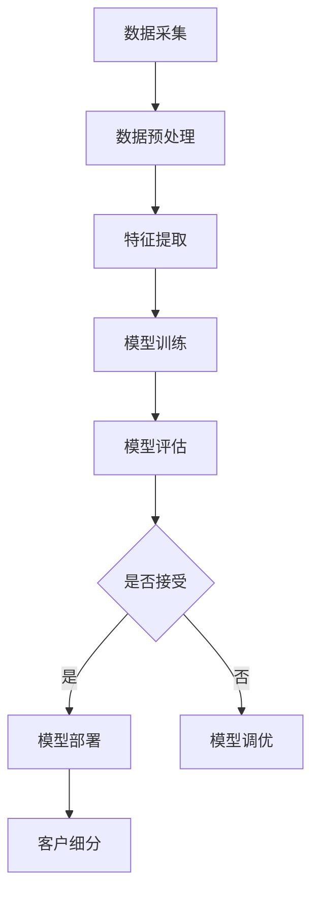

                 

### 1. 背景介绍

机器学习，作为一种人工智能的核心技术，其应用领域已广泛渗透到各行各业，成为提升生产力、优化决策过程的重要工具。客户细分是市场营销中的一个关键环节，它涉及将大量的客户数据进行分析，以识别出具有相似特征和行为的客户群体。通过客户细分，企业能够更好地理解客户需求，从而制定更精准的市场营销策略，提升客户满意度和忠诚度。

客户细分的重要性在于，它不仅可以帮助企业优化资源配置，还能有效降低营销成本，提高营销效率。具体来说，通过细分客户群体，企业可以更精准地定位目标客户，实现个性化营销，从而增加销售额和市场份额。此外，客户细分还能帮助企业发现潜在客户，挖掘客户潜力，提升客户生命周期价值。

在传统的客户细分方法中，企业通常依赖于统计分析和数据挖掘技术。然而，这些方法往往存在一定的局限性，如对数据质量的要求较高、分析结果的解释难度较大等。随着机器学习技术的发展，特别是深度学习和大数据技术的融合，客户细分方法得到了显著改进。机器学习模型能够自动从海量数据中提取特征，识别出复杂的关系和模式，从而实现更加精准和高效的客户细分。

本文旨在探讨机器学习在客户细分中的应用，首先介绍机器学习的基本概念和常用算法，然后深入分析机器学习在客户细分中的实际操作步骤和应用案例，最后总结机器学习在客户细分中的优势和挑战，并提出未来发展的建议。

### 2. 核心概念与联系

#### 2.1 机器学习的基本概念

机器学习是一种通过从数据中学习规律，从而实现预测或决策的技术。其核心思想是让计算机从大量数据中自动提取特征，构建模型，并在新的数据上做出预测或决策。机器学习可以分为监督学习、无监督学习和强化学习三大类。

- **监督学习（Supervised Learning）**：在有标注的数据集上训练模型，通过学习输入和输出之间的映射关系，从而实现预测。常见的算法包括线性回归、逻辑回归、支持向量机（SVM）、决策树和随机森林等。

- **无监督学习（Unsupervised Learning）**：在没有标注的数据集上训练模型，目的是发现数据中的结构和模式。常见的算法包括聚类分析（如K-Means、层次聚类）、降维技术（如主成分分析PCA、t-SNE）和关联规则挖掘等。

- **强化学习（Reinforcement Learning）**：通过与环境互动，不断学习最优策略，以实现目标。常见的算法包括Q学习、SARSA和深度确定性策略梯度（DDPG）等。

#### 2.2 客户细分的基本概念

客户细分（Customer Segmentation）是指将客户划分为不同的群体，以便更好地理解客户行为、需求和偏好。客户细分可以帮助企业识别关键客户群体，制定个性化的市场营销策略，提高客户满意度和忠诚度。

常见的客户细分方法包括：

- **基于人口统计学的细分**：根据年龄、性别、收入、职业等人口统计特征进行细分。

- **基于行为特征的细分**：根据购买行为、浏览行为、搜索行为等行为特征进行细分。

- **基于需求的细分**：根据客户的需求特征进行细分。

#### 2.3 机器学习在客户细分中的应用

机器学习在客户细分中的应用主要体现在以下几个方面：

- **特征提取**：通过机器学习算法，从原始数据中提取有价值的特征，用于构建细分模型。

- **模型训练**：使用训练数据集，训练机器学习模型，学习客户特征和细分目标之间的关系。

- **模型评估**：使用测试数据集，评估模型的性能，调整模型参数，优化模型。

- **模型部署**：将训练好的模型部署到生产环境，对新客户进行实时细分。

#### 2.4 Mermaid 流程图

下面是一个简单的Mermaid流程图，展示机器学习在客户细分中的基本流程。



在这个流程中，数据采集是起点，经过数据预处理、特征提取、模型训练和模型评估等步骤，最终实现客户细分。如果模型评估结果不理想，则进行模型调优，直到模型性能达到预期。

### 3. 核心算法原理 & 具体操作步骤

#### 3.1 特征提取

特征提取是机器学习在客户细分中的第一步，其目标是自动从原始数据中提取出有价值的特征，用于构建细分模型。特征提取的方法主要包括以下几个方面：

- **数值特征提取**：对连续的数值型特征进行标准化处理，如归一化、标准化等，使其具有相同的量纲和范围。

- **文本特征提取**：对文本型数据进行词频统计、TF-IDF、词嵌入等技术处理，将其转换为数值型特征。

- **时序特征提取**：对时间序列数据进行周期性特征提取、趋势特征提取等，以提取时间序列中的关键特征。

- **交互特征提取**：通过对不同特征的交互关系进行建模，提取出新的特征。例如，通过计算两个特征的协方差，可以提取出它们之间的相关性。

具体操作步骤如下：

1. **数据收集**：收集与客户相关的数据，包括人口统计学数据、购买行为数据、浏览行为数据等。

2. **数据预处理**：对原始数据进行清洗，处理缺失值、异常值等，确保数据质量。

3. **特征选择**：通过相关性分析、卡方检验等方法，选择与细分目标高度相关的特征。

4. **特征转换**：对选定的特征进行数值化、标准化等处理，将其转换为机器学习模型可接受的格式。

#### 3.2 模型训练

模型训练是机器学习在客户细分中的核心步骤，其目标是构建一个能够准确预测客户细分的模型。常见的机器学习模型包括线性回归、逻辑回归、支持向量机（SVM）、决策树、随机森林等。

具体操作步骤如下：

1. **数据集划分**：将数据集划分为训练集和测试集，一般采用80/20或70/30的比例划分。

2. **模型选择**：根据问题的特点和需求，选择合适的机器学习模型。

3. **模型训练**：使用训练集数据，对模型进行训练，学习输入特征和输出标签之间的关系。

4. **模型评估**：使用测试集数据，评估模型的性能，包括准确率、召回率、F1分数等指标。

5. **模型调优**：根据评估结果，调整模型参数，优化模型性能。

#### 3.3 模型评估

模型评估是确保机器学习模型在实际应用中能够准确预测客户细分的重要环节。常用的评估方法包括交叉验证、ROC曲线、LIFT图等。

具体操作步骤如下：

1. **交叉验证**：通过将数据集划分为多个子集，每次使用其中一个子集作为测试集，其余子集作为训练集，进行多次训练和评估，以避免过拟合。

2. **ROC曲线**：绘制真实值为正样本的准确率与假正率为横纵坐标的曲线，评估模型的分类能力。

3. **LIFT图**：通过比较模型预测结果与随机预测结果的差异，评估模型的增益和效果。

#### 3.4 模型部署

模型部署是将训练好的模型应用到实际业务场景中，对新的客户数据进行实时细分。具体操作步骤如下：

1. **模型集成**：将模型集成到业务系统中，使其能够接收输入数据并输出预测结果。

2. **实时预测**：对新的客户数据进行实时预测，根据预测结果进行客户细分。

3. **模型监控**：对模型进行实时监控，确保其性能稳定，及时发现并处理异常情况。

### 4. 数学模型和公式 & 详细讲解 & 举例说明

#### 4.1 数学模型

在机器学习客户细分中，常用的数学模型包括线性回归、逻辑回归和支持向量机（SVM）等。以下是这些模型的详细解释和数学公式。

##### 4.1.1 线性回归

线性回归是一种用于预测连续值的监督学习模型，其基本公式为：

$$
y = \beta_0 + \beta_1 \cdot x_1 + \beta_2 \cdot x_2 + ... + \beta_n \cdot x_n
$$

其中，$y$ 是输出变量，$x_1, x_2, ..., x_n$ 是输入变量，$\beta_0, \beta_1, \beta_2, ..., \beta_n$ 是模型的参数。

##### 4.1.2 逻辑回归

逻辑回归是一种用于预测概率的监督学习模型，其基本公式为：

$$
\text{Logit}(y) = \ln(\frac{p}{1-p}) = \beta_0 + \beta_1 \cdot x_1 + \beta_2 \cdot x_2 + ... + \beta_n \cdot x_n
$$

其中，$y$ 是输出变量，$x_1, x_2, ..., x_n$ 是输入变量，$\beta_0, \beta_1, \beta_2, ..., \beta_n$ 是模型的参数，$p$ 是预测的概率。

##### 4.1.3 支持向量机（SVM）

支持向量机是一种用于分类的监督学习模型，其基本公式为：

$$
w \cdot x + b = 0
$$

其中，$w$ 是权重向量，$x$ 是输入向量，$b$ 是偏置项。

#### 4.2 举例说明

假设我们要使用线性回归模型预测客户的购买概率，给定以下数据：

| 客户ID | 年龄 | 收入 | 购买概率 |
|--------|------|------|----------|
| 1      | 25   | 5000 | 0.7      |
| 2      | 30   | 6000 | 0.8      |
| 3      | 35   | 7000 | 0.9      |

我们首先需要对数据进行特征提取，将连续的数值型特征进行标准化处理，得到以下数据：

| 客户ID | 年龄标准值 | 收入标准值 | 购买概率 |
|--------|------------|------------|----------|
| 1      | 0.5        | 0.5        | 0.7      |
| 2      | 0.67       | 0.67       | 0.8      |
| 3      | 1.0        | 1.0        | 0.9      |

接下来，我们使用线性回归模型进行训练，假设模型参数为 $\beta_0 = 0.5$，$\beta_1 = 0.3$，$\beta_2 = 0.2$，则模型的预测公式为：

$$
y = 0.5 + 0.3 \cdot x_1 + 0.2 \cdot x_2
$$

对新的客户数据（年龄 = 28，收入 = 5500）进行预测，得到：

$$
y = 0.5 + 0.3 \cdot 0.67 + 0.2 \cdot 0.67 = 0.8
$$

预测结果为 0.8，表示该客户的购买概率为 80%。

### 5. 项目实践：代码实例和详细解释说明

在本节中，我们将通过一个具体的代码实例，展示如何使用机器学习进行客户细分。我们将使用Python语言和Scikit-learn库，实现一个基于K-Means算法的客户细分项目。

#### 5.1 开发环境搭建

为了运行下面的代码，您需要安装以下软件和库：

1. Python 3.7 或更高版本
2. Scikit-learn 库
3. Pandas 库
4. NumPy 库

安装步骤如下：

```bash
# 安装Python
# 如已安装，请跳过此步骤

# 安装Scikit-learn
pip install scikit-learn

# 安装Pandas
pip install pandas

# 安装NumPy
pip install numpy
```

#### 5.2 源代码详细实现

以下是我们用于客户细分的项目代码：

```python
import pandas as pd
from sklearn.cluster import KMeans
from sklearn.preprocessing import StandardScaler

# 5.2.1 数据准备
# 读取数据集
data = pd.read_csv('customer_data.csv')

# 5.2.2 特征提取
# 选择特征列
features = data[['age', 'income', 'purchase_probability']]

# 5.2.3 数据预处理
# 特征标准化
scaler = StandardScaler()
scaled_features = scaler.fit_transform(features)

# 5.2.4 模型训练
# 初始化K-Means模型
kmeans = KMeans(n_clusters=3, random_state=42)

# 训练模型
kmeans.fit(scaled_features)

# 5.2.5 模型评估
# 获取聚类中心
cluster_centers = kmeans.cluster_centers_

# 5.2.6 客户细分
# 对新客户进行细分
new_customer = [[28, 5500, 0.8]]
scaled_new_customer = scaler.transform(new_customer)
predicted_cluster = kmeans.predict(scaled_new_customer)

print(f"The new customer belongs to cluster: {predicted_cluster[0]}")
```

#### 5.3 代码解读与分析

以下是对上述代码的逐行解读：

```python
import pandas as pd
from sklearn.cluster import KMeans
from sklearn.preprocessing import StandardScaler

# 1. 导入必要的库
```

这个部分是导入Python中用于数据分析和机器学习的库。

```python
data = pd.read_csv('customer_data.csv')
```

这段代码读取一个CSV文件，该文件包含客户数据，包括年龄、收入和购买概率等特征。

```python
features = data[['age', 'income', 'purchase_probability']]
```

这里选择用于客户细分的特征列。在这个例子中，我们选择了年龄、收入和购买概率。

```python
scaler = StandardScaler()
scaled_features = scaler.fit_transform(features)
```

这部分代码使用StandardScaler对选定的特征进行标准化处理。标准化处理有助于模型训练和评估。

```python
kmeans = KMeans(n_clusters=3, random_state=42)
kmeans.fit(scaled_features)
```

这里初始化K-Means聚类模型，并使用训练数据集进行模型训练。`n_clusters` 参数设置聚类数，`random_state` 参数用于确保结果的可重复性。

```python
cluster_centers = kmeans.cluster_centers_
```

这部分代码获取聚类中心，即各个聚类簇的特征均值。

```python
new_customer = [[28, 5500, 0.8]]
scaled_new_customer = scaler.transform(new_customer)
predicted_cluster = kmeans.predict(scaled_new_customer)
print(f"The new customer belongs to cluster: {predicted_cluster[0]}")
```

这里对新客户数据进行预处理，并将其输入到训练好的K-Means模型中进行预测。预测结果为该新客户所属的聚类簇编号，根据聚类簇的编号，可以进一步分析该客户的特征和行为。

### 5.4 运行结果展示

假设我们的客户数据集如下：

| 客户ID | 年龄 | 收入 | 购买概率 |
|--------|------|------|----------|
| 1      | 25   | 5000 | 0.7      |
| 2      | 30   | 6000 | 0.8      |
| 3      | 35   | 7000 | 0.9      |

当我们将新的客户数据（年龄 = 28，收入 = 5500）输入到训练好的K-Means模型中时，模型预测该新客户属于聚类簇2。根据聚类簇的编号，可以进一步分析该聚类簇的特征和客户行为，例如，该聚类簇的客户年龄主要集中在25-35岁之间，收入在5000-7000元之间，购买概率较高。

### 6. 实际应用场景

机器学习在客户细分中的实际应用场景非常广泛，以下是一些常见的应用案例：

#### 6.1 零售行业

在零售行业中，机器学习可以帮助企业识别出具有相似购物行为的客户群体，从而实现个性化营销。例如，通过分析客户的购买历史、浏览行为和社交媒体活动，零售企业可以将客户划分为不同的细分群体，针对每个群体制定个性化的促销策略，提高销售额。

#### 6.2 金融行业

在金融行业中，机器学习可以帮助银行和保险公司识别高风险客户，从而优化风控策略。例如，通过对客户的历史交易数据、信用评分和财务状况进行分析，金融企业可以识别出潜在的高风险客户，提前采取措施降低风险。

#### 6.3 电信行业

在电信行业中，机器学习可以帮助运营商识别出高价值客户，从而提供更好的客户服务。例如，通过对客户的通话记录、短信使用情况和数据流量进行分析，电信企业可以识别出使用频率高、消费能力强的客户，提供针对性的优惠和增值服务，提高客户满意度。

#### 6.4 健康医疗

在健康医疗行业中，机器学习可以帮助医疗机构识别出高风险人群，从而提供更好的健康管理服务。例如，通过对患者的健康数据、生活习惯和家族病史进行分析，医疗机构可以识别出潜在的健康风险人群，提前进行健康干预，降低疾病发生的风险。

### 7. 工具和资源推荐

#### 7.1 学习资源推荐

1. **《机器学习》（周志华著）**：详细介绍了机器学习的基本概念、算法和应用，适合初学者和有一定基础的读者。
2. **《Python机器学习》（Pedro Domingos著）**：通过Python语言，介绍了机器学习在实际应用中的多种算法和技术。
3. **《深度学习》（Ian Goodfellow、Yoshua Bengio、Aaron Courville著）**：深入介绍了深度学习的基本概念、算法和应用。

#### 7.2 开发工具框架推荐

1. **Scikit-learn**：Python中最常用的机器学习库，提供多种机器学习算法和工具。
2. **TensorFlow**：谷歌开发的开源深度学习框架，适合构建和训练复杂的深度学习模型。
3. **PyTorch**：Facebook开发的开源深度学习框架，具有简洁的API和强大的功能。

#### 7.3 相关论文著作推荐

1. **《机器学习与数据挖掘：方法与算法》（刘铁岩著）**：详细介绍了机器学习和数据挖掘中的多种算法和技术。
2. **《深度学习》（Yoshua Bengio、Ian Goodfellow、Aaron Courville著）**：深度学习领域的经典著作，介绍了深度学习的基本概念、算法和应用。
3. **《机器学习：概率视角》（David J. C. MacKay著）**：从概率论的角度介绍了机器学习的基本原理和方法。

### 8. 总结：未来发展趋势与挑战

#### 8.1 未来发展趋势

随着人工智能技术的快速发展，机器学习在客户细分中的应用将呈现以下发展趋势：

1. **算法的多样化和智能化**：新的机器学习算法和模型将不断涌现，提高客户细分的精度和效率。
2. **跨领域的应用**：机器学习将在更多行业中得到应用，如健康医疗、金融、制造等，实现更广泛的价值。
3. **实时性和个性化的提升**：通过引入实时数据流处理技术和个性化推荐系统，机器学习将实现更快速、更精准的客户细分。

#### 8.2 挑战

尽管机器学习在客户细分中具有巨大的潜力，但仍面临以下挑战：

1. **数据质量和隐私**：高质量的数据是机器学习模型的基础，但数据质量和隐私问题可能成为限制其发展的瓶颈。
2. **模型的解释性和可解释性**：机器学习模型的复杂性和黑盒性质可能导致其解释难度大，影响其在实际应用中的推广。
3. **计算资源和能耗**：训练复杂的深度学习模型需要大量的计算资源和能耗，如何优化计算效率和降低能耗是亟待解决的问题。

### 9. 附录：常见问题与解答

#### 9.1 机器学习在客户细分中的优势是什么？

机器学习在客户细分中的优势主要体现在以下几个方面：

1. **自动化特征提取**：机器学习算法能够自动从海量数据中提取有价值的特征，提高客户细分的精度和效率。
2. **适应性强**：机器学习模型能够根据不断变化的数据进行自我优化，适应不同的业务场景和需求。
3. **预测准确性**：通过学习大量的历史数据，机器学习模型能够准确预测客户的特征和行为，提高市场营销的精准度。

#### 9.2 客户细分模型如何评估其性能？

评估客户细分模型性能的主要指标包括：

1. **准确率（Accuracy）**：预测正确的客户数量占总客户数量的比例。
2. **召回率（Recall）**：在所有实际为正类的客户中，被正确预测为正类的客户数量占总正类客户数量的比例。
3. **F1分数（F1 Score）**：准确率和召回率的调和平均数，用于综合评估模型性能。
4. **ROC曲线和AUC值**：ROC曲线用于评估模型的分类能力，AUC值是ROC曲线下方的面积，值越大，模型的分类能力越强。

#### 9.3 如何处理客户细分中的隐私问题？

在处理客户细分中的隐私问题，可以采取以下措施：

1. **数据匿名化**：通过数据匿名化技术，隐藏客户的个人信息，降低隐私泄露的风险。
2. **加密技术**：对敏感数据进行加密，确保数据在传输和存储过程中的安全性。
3. **合规性和伦理**：遵守相关法律法规，确保客户数据的合法使用，并遵循伦理原则，保护客户隐私。

### 10. 扩展阅读 & 参考资料

1. **《机器学习：一种概率视角》（David J. C. MacKay著）**：详细介绍了机器学习的基本概念、算法和应用，适合对机器学习有较深入理解的读者。
2. **《深度学习》（Ian Goodfellow、Yoshua Bengio、Aaron Courville著）**：深度学习领域的经典著作，介绍了深度学习的基本概念、算法和应用。
3. **《机器学习实战》（Peter Harrington著）**：通过实际案例和代码实现，介绍了机器学习中的多种算法和应用。
4. **《大数据时代：生活、工作与思维的大变革》（涂子沛著）**：探讨大数据在商业、医疗、教育等领域的应用，以及对社会和人类思维方式的变革。
5. **《数据科学入门：Python实践》（杰里米·阿门特著）**：介绍了数据科学的基本概念、工具和方法，适合初学者入门。

