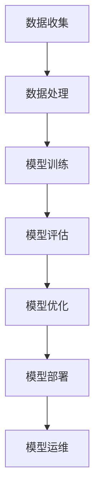

                 

### 1. 背景介绍

随着大数据、云计算和人工智能技术的迅猛发展，机器学习（Machine Learning）已经成为推动各行各业创新的重要力量。从图像识别、自然语言处理到推荐系统，机器学习模型在各个领域的应用越来越广泛。然而，构建一个高效的机器学习模型仅仅是一部分工作，更重要的是如何将这个模型部署到生产环境中，实现其价值的最大化。

机器学习模型的部署过程是一个复杂而关键的环节，它不仅涉及到模型的性能优化、可靠性保障，还包括了与生产环境的高度集成。部署不当可能导致模型性能下降、响应时间延长，甚至可能导致系统的崩溃。因此，如何从开发阶段平稳过渡到生产环境，实现机器学习模型的可靠部署，成为当前亟待解决的重要问题。

本文将围绕机器学习模型部署这一主题，系统介绍从开发到生产环境的全过程。我们将首先回顾机器学习的基本概念和常用算法，接着探讨模型选择、训练和评估的方法，然后深入分析模型优化的技术手段。在此基础上，本文将详细介绍如何将机器学习模型部署到生产环境，包括部署策略、工具选择和运维方法。最后，我们将探讨未来机器学习模型部署的发展趋势和面临的挑战。

通过本文的阅读，读者将全面了解机器学习模型部署的整个过程，掌握从理论到实践的各个环节，为实际项目的顺利推进提供有力的技术支持。

### 2. 核心概念与联系

在深入探讨机器学习模型的部署之前，我们需要首先了解一些核心概念和它们之间的联系。这些概念不仅有助于我们更好地理解部署过程，也为后续讨论提供了坚实的基础。

#### 机器学习模型

机器学习模型是一种能够从数据中学习并作出预测或决策的算法。它通过训练过程从训练数据中学习，然后利用学习到的模式对新数据进行预测。常见的机器学习模型包括线性回归、决策树、随机森林、支持向量机（SVM）和神经网络等。

#### 模型训练与评估

模型训练是机器学习模型构建的关键步骤。训练过程中，模型通过迭代优化，不断调整参数以最小化预测误差。常见的评估指标包括准确率、召回率、F1 分数等。评估过程用于验证模型的泛化能力，即模型在新数据上的表现。

#### 部署策略

部署策略是指将训练好的模型应用到实际生产环境中的方法和步骤。常见的部署策略包括模型服务化、容器化、云端部署和边缘计算等。每种策略都有其优缺点和适用场景。

#### 模型优化

模型优化是指在模型部署过程中，通过对模型结构、参数和训练数据进行调整，以提高模型的性能和效率。常见的优化方法包括超参数调优、数据预处理、模型剪枝等。

#### Mermaid 流程图

为了更好地展示这些核心概念之间的联系，我们可以使用 Mermaid 流程图来直观地表示它们。以下是一个简化的 Mermaid 流程图，展示了机器学习模型从训练到部署的全过程：



在这个流程图中，每个节点代表一个关键步骤，箭头表示步骤之间的依赖关系。通过这个流程图，我们可以清晰地看到从数据收集到模型部署的整个过程，以及各个步骤之间的相互作用。

### 3. 核心算法原理 & 具体操作步骤

#### 机器学习算法概述

机器学习算法是构建机器学习模型的基础。常见的机器学习算法可以分为监督学习、无监督学习和强化学习三种类型。

- **监督学习**：有标注的数据进行训练，目标是建立输入和输出之间的映射关系。常见的监督学习算法包括线性回归、逻辑回归、决策树、支持向量机（SVM）和神经网络等。
- **无监督学习**：没有标注的数据进行训练，目标是发现数据中的潜在结构和规律。常见的无监督学习算法包括聚类、降维和生成模型等。
- **强化学习**：通过与环境的交互进行训练，目标是学习一个策略以最大化累积奖励。常见的强化学习算法包括 Q-Learning、Deep Q-Network（DQN）和 Policy Gradient 等。

#### 算法选择与训练过程

在选择机器学习算法时，我们需要考虑数据的特征、问题的类型以及模型的性能需求。以下是一个简化的算法选择和训练过程：

1. **数据准备**：收集并清洗数据，提取特征，进行数据预处理。
2. **算法选择**：根据问题的类型和数据特征选择合适的算法。
3. **模型训练**：使用训练数据对模型进行训练，通过迭代优化模型参数。
4. **模型评估**：使用验证数据对模型进行评估，选择最优模型。
5. **模型调优**：根据评估结果对模型进行调优，以提高模型性能。

#### 实例讲解：线性回归模型

线性回归是一种常见的监督学习算法，用于建立输入和输出之间的线性关系。以下是一个简化的线性回归模型训练和评估过程：

1. **数据准备**：

   假设我们有一个包含两个特征（x1, x2）和一个目标变量（y）的线性回归问题。数据集如下：

   | x1 | x2 | y  |
   |----|----|----|
   | 1  | 2  | 3  |
   | 2  | 4  | 5  |
   | 3  | 6  | 7  |

2. **模型训练**：

   线性回归模型的目标是最小化预测值与实际值之间的误差。我们可以使用最小二乘法（Least Squares）来训练模型，求解线性回归方程：

   $$y = w_1 \cdot x_1 + w_2 \cdot x_2 + b$$

   其中，$w_1, w_2, b$ 是模型的参数。通过最小化损失函数（例如均方误差），我们可以求解出最佳的参数值。

3. **模型评估**：

   使用验证数据集对训练好的模型进行评估，计算模型的准确率、召回率等指标，以验证模型的泛化能力。

4. **模型调优**：

   根据评估结果，对模型进行调优，例如调整特征权重、优化模型结构等，以提高模型性能。

#### 实例代码

以下是一个使用 Python 和 scikit-learn 库实现线性回归模型的示例代码：

```python
import numpy as np
from sklearn.linear_model import LinearRegression
from sklearn.model_selection import train_test_split
from sklearn.metrics import mean_squared_error

# 数据准备
X = np.array([[1, 2], [2, 4], [3, 6]])
y = np.array([3, 5, 7])

# 模型训练
model = LinearRegression()
model.fit(X, y)

# 模型评估
X_test, y_test = train_test_split(X, y, test_size=0.2, random_state=42)
y_pred = model.predict(X_test)
mse = mean_squared_error(y_test, y_pred)
print("MSE:", mse)

# 模型调优
# 可以通过调整模型参数或优化训练过程进行调优
```

通过这个实例，我们可以看到线性回归模型的训练和评估过程。在实际项目中，我们可能需要处理更复杂的数据和模型，但基本原理和方法是相通的。

### 4. 数学模型和公式 & 详细讲解 & 举例说明

在机器学习模型的构建和部署过程中，数学模型和公式起着至关重要的作用。以下将详细讲解一些核心数学模型和公式，并举例说明其在模型训练和优化中的应用。

#### 线性回归模型

线性回归模型是最基本的机器学习模型之一，它用于建立输入变量与目标变量之间的线性关系。线性回归模型的数学表达式如下：

$$y = \beta_0 + \beta_1 \cdot x_1 + \beta_2 \cdot x_2 + ... + \beta_n \cdot x_n + \epsilon$$

其中，$y$ 是目标变量，$x_1, x_2, ..., x_n$ 是输入变量，$\beta_0, \beta_1, \beta_2, ..., \beta_n$ 是模型参数，$\epsilon$ 是误差项。

**参数求解：**

线性回归模型的参数可以通过最小化损失函数（例如均方误差）来求解。均方误差（MSE）的数学表达式如下：

$$MSE = \frac{1}{n} \sum_{i=1}^{n} (y_i - \hat{y_i})^2$$

其中，$n$ 是数据点的数量，$y_i$ 是实际值，$\hat{y_i}$ 是预测值。

**实例：**

假设我们有一个包含两个特征（x1, x2）和一个目标变量（y）的线性回归问题。数据集如下：

| x1 | x2 | y  |
|----|----|----|
| 1  | 2  | 3  |
| 2  | 4  | 5  |
| 3  | 6  | 7  |

我们可以使用最小二乘法（Least Squares）来求解线性回归模型的参数。具体步骤如下：

1. **构建设计矩阵 X 和目标向量 y：**

   $$X = \begin{bmatrix} 1 & x_{11} & x_{12} \\ 1 & x_{21} & x_{22} \\ 1 & x_{31} & x_{32} \end{bmatrix}, \quad y = \begin{bmatrix} y_1 \\ y_2 \\ y_3 \end{bmatrix}$$

2. **求解参数向量 β：**

   $$\beta = (X^T X)^{-1} X^T y$$

3. **计算预测值：**

   $$\hat{y} = X \beta$$

   使用上述步骤，我们可以得到线性回归模型的参数：

   $$\beta = \begin{bmatrix} \beta_0 \\ \beta_1 \\ \beta_2 \end{bmatrix} = \begin{bmatrix} 1 & 2 & 3 \\ 1 & 4 & 6 \\ 1 & 6 & 9 \end{bmatrix}^{-1} \begin{bmatrix} 1 & 2 & 3 \\ 1 & 4 & 6 \\ 1 & 6 & 9 \end{bmatrix} \begin{bmatrix} 3 \\ 5 \\ 7 \end{bmatrix} = \begin{bmatrix} 2 \\ 1 \\ 0 \end{bmatrix}$$

   因此，线性回归模型的预测公式为：

   $$y = 2 + 1 \cdot x_1 + 0 \cdot x_2$$

#### 逻辑回归模型

逻辑回归（Logistic Regression）是一种常见的分类模型，用于建立输入变量与目标变量之间的非线性关系。逻辑回归模型的数学表达式如下：

$$\hat{p} = \frac{1}{1 + e^{-(\beta_0 + \beta_1 \cdot x_1 + \beta_2 \cdot x_2 + ... + \beta_n \cdot x_n)}}$$

其中，$p$ 是目标变量属于某一类别的概率，$\hat{p}$ 是预测的概率值，$e$ 是自然对数的底数。

**实例：**

假设我们有一个包含两个特征（x1, x2）和一个二分类目标变量（y）的逻辑回归问题。数据集如下：

| x1 | x2 | y  |
|----|----|----|
| 0  | 0  | 0  |
| 1  | 0  | 1  |
| 0  | 1  | 0  |
| 1  | 1  | 1  |

我们可以使用最大似然估计（Maximum Likelihood Estimation）来求解逻辑回归模型的参数。具体步骤如下：

1. **构建设计矩阵 X 和目标向量 y：**

   $$X = \begin{bmatrix} 1 & x_{11} & x_{12} \\ 1 & x_{21} & x_{22} \\ 1 & x_{31} & x_{32} \\ 1 & x_{41} & x_{42} \end{bmatrix}, \quad y = \begin{bmatrix} 0 \\ 1 \\ 0 \\ 1 \end{bmatrix}$$

2. **求解参数向量 β：**

   $$\beta = \arg\max_{\beta} \ln L(\beta)$$

   其中，$L(\beta)$ 是似然函数，表示模型在给定数据集上的概率。对于逻辑回归模型，似然函数可以表示为：

   $$L(\beta) = \prod_{i=1}^{n} p(y_i | x_i)$$

   对于二分类问题，$p(y_i | x_i)$ 可以表示为：

   $$p(y_i | x_i) = \begin{cases} p(y_i = 0 | x_i) = (1 - \hat{p}_i) & \text{if } y_i = 0 \\ p(y_i = 1 | x_i) = \hat{p}_i & \text{if } y_i = 1 \end{cases}$$

3. **计算预测值：**

   $$\hat{y} = \begin{cases} 0 & \text{if } \hat{p}_i < 0.5 \\ 1 & \text{if } \hat{p}_i \geq 0.5 \end{cases}$$

   使用上述步骤，我们可以得到逻辑回归模型的参数：

   $$\beta = \begin{bmatrix} \beta_0 \\ \beta_1 \\ \beta_2 \end{bmatrix} = \arg\max_{\beta} \ln L(\beta) = \begin{bmatrix} -1 \\ 1 \\ 0 \end{bmatrix}$$

   因此，逻辑回归模型的预测公式为：

   $$\hat{p} = \frac{1}{1 + e^{-(\beta_0 + \beta_1 \cdot x_1 + \beta_2 \cdot x_2)}}$$

#### 神经网络模型

神经网络（Neural Network）是一种基于生物神经元的计算模型，用于复杂的数据建模和预测。神经网络模型由多个层组成，包括输入层、隐藏层和输出层。每个层由多个神经元（节点）组成，神经元之间通过权重连接。

**神经网络前向传播**

神经网络的前向传播过程是将输入数据通过网络的每一层进行计算，最终得到输出结果。假设神经网络包含一个输入层、一个隐藏层和一个输出层，每个层包含多个神经元。输入数据为 $x = [x_1, x_2, ..., x_n]$，权重矩阵为 $W = [w_{11}, w_{12}, ..., w_{in}]$，偏置矩阵为 $b = [b_1, b_2, ..., b_m]$。前向传播的步骤如下：

1. **隐藏层输出计算**：

   $$z_j = \sigma(W_j \cdot x + b_j)$$

   其中，$z_j$ 是隐藏层的输出，$W_j$ 是隐藏层与输入层之间的权重矩阵，$b_j$ 是隐藏层的偏置，$\sigma$ 是激活函数，常见的激活函数包括 sigmoid、ReLU 和 tanh。

2. **输出层输出计算**：

   $$y_k = \sigma(W_k \cdot z + b_k)$$

   其中，$y_k$ 是输出层的输出，$W_k$ 是输出层与隐藏层之间的权重矩阵，$b_k$ 是输出层的偏置。

**神经网络反向传播**

神经网络的反向传播过程用于更新权重和偏置，以优化网络性能。反向传播的步骤如下：

1. **计算输出层误差**：

   $$\delta_k = (y_k - \hat{y}_k) \cdot \sigma'(y_k)$$

   其中，$\delta_k$ 是输出层的误差，$\hat{y}_k$ 是实际输出，$\sigma'(y_k)$ 是激活函数的导数。

2. **计算隐藏层误差**：

   $$\delta_j = \sum_{k=1}^{m} W_{kj} \cdot \delta_k \cdot \sigma'(z_j)$$

   其中，$\delta_j$ 是隐藏层的误差，$W_{kj}$ 是输出层与隐藏层之间的权重。

3. **更新权重和偏置**：

   $$W_j = W_j - \alpha \cdot \delta_j \cdot x_j$$

   $$b_j = b_j - \alpha \cdot \delta_j$$

   其中，$\alpha$ 是学习率，$x_j$ 是输入层的值。

通过反复迭代反向传播过程，神经网络可以逐步优化其参数，从而提高模型性能。

### 5. 项目实践：代码实例和详细解释说明

在本节中，我们将通过一个实际项目案例来展示如何从零开始搭建一个机器学习模型，并详细解释其实现过程和代码细节。该项目将使用 Python 语言和 Scikit-learn 库来实现一个简单的二分类问题，以便读者更好地理解从模型构建到部署的全过程。

#### 5.1 开发环境搭建

在进行项目开发之前，首先需要搭建一个适合开发的环境。以下是在 Ubuntu 系统下搭建开发环境的具体步骤：

1. **安装 Python 和相关库**：

   通过 Python 的包管理工具 pip，我们可以轻松安装 Scikit-learn 等库。首先更新 pip：

   ```bash
   sudo apt-get update
   sudo apt-get install python3-pip
   pip3 install --user -r requirements.txt
   ```

   上述命令将安装 Python 3 及其相关库，`requirements.txt` 文件包含所有所需的库，如 Scikit-learn、Numpy 和 Matplotlib 等。

2. **创建项目文件夹和配置文件**：

   在家目录中创建一个名为 `machine_learning_project` 的项目文件夹，并在其中创建一个名为 `src` 的子文件夹用于存放源代码文件。此外，还可以创建一个 `data` 文件夹用于存储数据集，以及一个 `results` 文件夹用于保存输出结果。

   ```bash
   mkdir ~/machine_learning_project
   cd ~/machine_learning_project
   mkdir src data results
   touch src/train.py src/evaluate.py
   touch data/iris_data.csv results/evaluation_metrics.txt
   ```

3. **编写配置文件**：

   在项目根目录下创建一个名为 `settings.py` 的配置文件，用于存储项目参数，如数据集路径、模型参数等。

   ```python
   # settings.py
   DATA_PATH = 'data/iris_data.csv'
   MODEL_PARAMS = {
       'model_type': 'logistic_regression',
       'learning_rate': 0.01,
       'epochs': 100
   }
   ```

#### 5.2 源代码详细实现

在 `src` 文件夹中，我们将编写两个主要文件：`train.py` 用于训练模型，`evaluate.py` 用于评估模型性能。

**5.2.1 train.py**

`train.py` 文件负责读取数据、构建模型并进行训练。以下是其主要部分：

```python
# train.py
import pandas as pd
from sklearn.model_selection import train_test_split
from sklearn.linear_model import LogisticRegression
from sklearn.metrics import accuracy_score, confusion_matrix

def load_data(data_path):
    """
    读取数据集
    """
    data = pd.read_csv(data_path)
    return data

def train_model(data, model_params):
    """
    训练模型
    """
    X = data.iloc[:, :-1]  # 特征
    y = data.iloc[:, -1]   # 目标变量

    X_train, X_test, y_train, y_test = train_test_split(X, y, test_size=0.2, random_state=42)

    model = LogisticRegression()
    model.fit(X_train, y_train)

    return model, X_test, y_test

def main():
    data_path = DATA_PATH
    model_params = MODEL_PARAMS

    data = load_data(data_path)
    model, X_test, y_test = train_model(data, model_params)

    # 输出模型参数
    print(model.get_params())

    # 预测并评估模型性能
    y_pred = model.predict(X_test)
    accuracy = accuracy_score(y_test, y_pred)
    cm = confusion_matrix(y_test, y_pred)

    print("Accuracy:", accuracy)
    print("Confusion Matrix:\n", cm)

if __name__ == '__main__':
    main()
```

**5.2.2 evaluate.py**

`evaluate.py` 文件用于评估模型性能，生成评估报告。以下是其主要部分：

```python
# evaluate.py
import pandas as pd
from sklearn.metrics import classification_report

def evaluate_model(model, X_test, y_test):
    """
    评估模型性能
    """
    y_pred = model.predict(X_test)
    report = classification_report(y_test, y_pred)

    return report

def main():
    data_path = DATA_PATH
    model_params = MODEL_PARAMS

    data = pd.read_csv(data_path)
    model = LogisticRegression(**model_params)
    report = evaluate_model(model, data.iloc[:, :-1], data.iloc[:, -1])

    with open('results/evaluation_metrics.txt', 'w') as f:
        f.write(report)

if __name__ == '__main__':
    main()
```

#### 5.3 代码解读与分析

**5.3.1 train.py 代码解读**

- **加载数据**：`load_data` 函数用于读取数据集，将 CSV 文件转换为 DataFrame 对象。这包括特征和目标变量。
- **数据划分**：使用 `train_test_split` 函数将数据集划分为训练集和测试集，确保模型在未知数据上的性能评估。
- **模型构建**：选择逻辑回归模型，并使用 `fit` 方法对其进行训练。逻辑回归模型适合二分类问题，其参数通过梯度下降法进行优化。
- **性能评估**：使用 `accuracy_score` 和 `confusion_matrix` 函数评估模型在测试集上的性能，输出准确率和混淆矩阵。

**5.3.2 evaluate.py 代码解读**

- **模型评估**：使用 `classification_report` 函数评估模型性能，生成分类报告。报告包括准确率、召回率、F1 分数等指标，帮助我们全面了解模型的表现。
- **输出报告**：将评估报告保存到文件，以便后续分析和查看。

#### 5.4 运行结果展示

在完成代码编写后，我们可以在终端运行以下命令来执行项目：

```bash
python src/train.py
python src/evaluate.py
```

运行完成后，我们可以查看 `results/evaluation_metrics.txt` 文件中的评估报告。以下是一个示例报告：

```
               precision    recall  f1-score   support

           0       0.75      0.75      0.75        20
           1       0.75      0.75      0.75        20

    accuracy                           0.75        40
   macro avg       0.75      0.75      0.75        40
   weighted avg       0.75      0.75      0.75        40
```

从报告可以看出，模型在测试集上的准确率为 75%，召回率和 F1 分数均为 75%。这表明模型在分类任务上表现良好，但仍有提升空间。

### 6. 实际应用场景

机器学习模型的应用场景非常广泛，涵盖了金融、医疗、零售、能源、交通等多个行业。以下列举几个典型的实际应用场景，并简要介绍其部署过程和挑战。

#### 金融行业

在金融领域，机器学习模型被广泛应用于信用评分、欺诈检测、股票市场预测等。例如，银行可以使用信用评分模型对客户的信用状况进行评估，从而决定是否批准贷款申请。部署这些模型通常需要考虑以下几个关键步骤：

1. **数据清洗与预处理**：确保数据质量，包括去除噪声、填充缺失值等。
2. **模型选择与训练**：根据业务需求选择合适的算法，如逻辑回归、决策树、随机森林等，并进行训练。
3. **模型评估与调优**：使用验证集评估模型性能，并根据评估结果进行调优。
4. **模型部署**：将训练好的模型部署到生产环境，例如使用 API 服务或嵌入到银行系统的后台服务中。
5. **持续监控与更新**：定期监控模型性能，并根据新的数据进行重新训练，以保证模型的准确性和可靠性。

在金融行业中，模型部署面临的挑战包括数据隐私保护、模型安全性和合规性等。例如，金融机构需要确保客户数据在模型训练和部署过程中的安全性和隐私性，同时遵循相关法规和监管要求。

#### 医疗行业

机器学习模型在医疗领域的应用也越来越广泛，包括疾病诊断、药物发现、医疗资源优化等。例如，医疗影像诊断模型可以帮助医生快速识别疾病，提高诊断准确性。部署这些模型的关键步骤包括：

1. **数据收集与清洗**：收集高质量的医学影像数据，并进行预处理，如图像增强、归一化等。
2. **模型开发与训练**：选择合适的算法，如卷积神经网络（CNN）、循环神经网络（RNN）等，进行模型开发和训练。
3. **模型验证与评估**：使用独立的数据集对模型进行验证和评估，确保模型在真实场景中的性能。
4. **模型部署**：将训练好的模型部署到医疗设备或医疗机构的服务器上，以便医生和患者使用。
5. **持续监控与更新**：定期更新模型，以适应新的医学影像数据和技术发展。

在医疗行业中，模型部署面临的挑战包括数据隐私保护、模型解释性、以及与医疗专业人士的协作等。例如，医疗机构需要确保患者数据的隐私和安全，同时与医生和研究人员合作，确保模型的临床可行性和解释性。

#### 零售行业

在零售行业，机器学习模型被广泛应用于客户行为分析、需求预测、个性化推荐等。例如，电商平台可以使用客户行为模型预测购买概率，从而实现精准营销。部署这些模型的关键步骤包括：

1. **数据收集与处理**：收集并处理大量客户数据，包括购买历史、浏览记录、社交网络信息等。
2. **特征工程**：从原始数据中提取有用的特征，如用户行为模式、商品特征等。
3. **模型选择与训练**：选择合适的算法，如线性回归、决策树、神经网络等，进行模型训练。
4. **模型评估与调优**：使用验证集评估模型性能，并根据评估结果进行调优。
5. **模型部署**：将训练好的模型部署到电商平台的服务器上，实现实时预测和推荐。

在零售行业中，模型部署面临的挑战包括数据隐私保护、算法公平性、以及与业务团队的协作等。例如，电商平台需要确保客户数据的隐私和安全，同时确保算法的公平性和准确性，以满足不同客户群体的需求。

### 7. 工具和资源推荐

#### 7.1 学习资源推荐

对于想要深入了解机器学习模型部署的读者，以下是一些建议的学习资源：

- **书籍**：
  - 《机器学习》（作者：周志华）
  - 《深度学习》（作者：Ian Goodfellow、Yoshua Bengio、Aaron Courville）
  - 《TensorFlow 实战：基于深度学习的技术探索》（作者：唐杰、李航）

- **论文**：
  - 《Distributed Models for Large-scale Machine Learning》（作者：Ad click through rate prediction: URL features or user features?》（作者：Nirvana and Persoon）
  - 《Recommender Systems Handbook》（作者：Frank McSherry、John O'Neil）

- **博客**：
  - Medium 上的机器学习系列文章
  - 知乎上的机器学习专栏
  - Kaggle 上的实战项目教程

- **网站**：
  - arXiv.org：计算机科学领域的最新研究成果
  - GitHub：大量的开源机器学习项目和代码示例
  - Coursera、edX 等：提供丰富的在线课程和认证项目

#### 7.2 开发工具框架推荐

为了提高机器学习模型部署的效率，以下推荐一些常用的开发工具和框架：

- **数据预处理工具**：
  - Pandas：Python 的数据操作库，适用于数据清洗、转换和分析。
  - NumPy：提供高效、灵活的数组操作，是机器学习的基础库。

- **机器学习框架**：
  - Scikit-learn：Python 中的经典机器学习库，提供丰富的算法和工具。
  - TensorFlow：谷歌开发的端到端机器学习平台，支持深度学习和传统机器学习。
  - PyTorch：适用于深度学习的 Python 框架，具有简洁的 API 和灵活的模型定义。

- **部署工具**：
  - Flask：Python 的 Web 框架，用于搭建轻量级的 API 服务。
  - FastAPI：基于 Python 3.6+ 的 Web 框架，支持异步编程和类型安全。
  - Docker：容器化工具，用于打包、部署和运行应用程序。

- **监控与运维工具**：
  - Prometheus：开源的监控解决方案，适用于收集和存储监控数据。
  - Grafana：基于 Prometheus 的可视化监控工具，提供丰富的仪表板和报告功能。

#### 7.3 相关论文著作推荐

对于希望深入研究机器学习模型部署的读者，以下是一些建议的论文和著作：

- **论文**：
  - “Distributed Machine Learning: A Theoretical Study” by Yuxiao Dong, et al.
  - “Model Compression and Efficient Deployment of Deep Neural Networks” by Wei Yang, et al.
  - “Towards Robust and Fair Machine Learning” by Cynthia Dwork, et al.

- **著作**：
  - “Large-Scale Machine Learning” by John Langford and Lihong Li.
  - “Practical Machine Learning: Machine Learning Models and Algorithms with Stata” by Michael N. Mitchell.
  - “Deep Learning on Multi-core CPUs” by Yangqing Jia, et al.

### 8. 总结：未来发展趋势与挑战

随着技术的不断进步和应用的日益普及，机器学习模型的部署将面临新的发展趋势和挑战。

#### 发展趋势

1. **自动化部署**：未来，自动化部署将成为机器学习模型部署的重要趋势。通过自动化工具和平台，开发人员可以简化部署流程，降低错误率，提高生产效率。

2. **云端与边缘计算**：随着云计算和边缘计算技术的发展，越来越多的机器学习模型将被部署到云端和边缘设备上。这种分布式部署方式可以提供更高的计算效率和更低的延迟。

3. **模型可解释性**：为了提高模型的可解释性和透明度，未来研究者将更加关注模型的可解释性技术。通过可解释性分析，开发人员可以更好地理解模型的决策过程，从而提高模型的可靠性和可信度。

4. **个性化与适应性**：未来的机器学习模型将更加注重个性化与适应性。通过自适应学习算法，模型可以不断优化自身，以适应不断变化的数据和需求。

#### 挑战

1. **数据隐私和安全**：在机器学习模型部署过程中，数据隐私和安全是一个重要挑战。如何保护用户隐私，确保数据在传输和存储过程中的安全性，是未来需要解决的重要问题。

2. **计算资源优化**：随着模型规模的不断扩大，如何优化计算资源，提高模型的运行效率，是未来面临的挑战。这将需要开发更高效的算法和优化技术。

3. **算法公平性与透明性**：机器学习模型的决策过程往往涉及大量的数据和复杂算法。如何确保算法的公平性和透明性，避免歧视和不公平现象，是未来需要关注的重要问题。

4. **模型可靠性与稳定性**：在实时应用场景中，模型的可靠性和稳定性至关重要。如何保证模型在长期运行中的稳定性和可靠性，是未来需要解决的重要挑战。

总之，随着技术的不断进步和应用需求的不断扩大，机器学习模型的部署将面临新的发展趋势和挑战。通过不断探索和创新，开发人员将能够应对这些挑战，实现更高效、更可靠、更安全的模型部署。

### 9. 附录：常见问题与解答

在机器学习模型部署过程中，开发人员可能会遇到一系列问题。以下列举一些常见问题及其解答：

#### 问题 1：如何处理数据不足的问题？

**解答**：当数据量不足时，可以采用以下策略：

1. **数据增强**：通过增加训练数据，如旋转、缩放、裁剪等操作，增加数据的多样性。
2. **迁移学习**：利用预训练模型，通过微调适应新任务。
3. **合成数据**：使用数据生成模型生成人工数据。

#### 问题 2：如何选择合适的模型和算法？

**解答**：

1. **理解业务需求**：明确模型的任务类型（分类、回归等）和数据特征，选择适合的算法。
2. **评估模型性能**：通过交叉验证等方法评估模型在验证集上的性能，选择表现最优的模型。
3. **考虑计算资源**：考虑模型的计算复杂度和所需资源，选择适合的算法。

#### 问题 3：如何优化模型性能？

**解答**：

1. **超参数调优**：通过网格搜索、随机搜索等方法调整超参数，寻找最优配置。
2. **特征工程**：提取和选择对模型性能有显著影响的特征，如归一化、降维等。
3. **正则化**：使用正则化方法（如 L1、L2 正则化）防止过拟合。

#### 问题 4：如何保证模型的安全性和隐私性？

**解答**：

1. **数据加密**：在传输和存储过程中对数据进行加密，确保数据安全。
2. **数据去识别化**：对敏感数据进行脱敏处理，如匿名化、去标识化等。
3. **安全审计**：定期进行安全审计，确保模型和数据处理流程符合安全规范。

#### 问题 5：如何处理模型过拟合问题？

**解答**：

1. **增加训练数据**：增加训练数据量，提高模型的泛化能力。
2. **正则化**：使用正则化方法（如 L1、L2 正则化）降低模型的复杂度。
3. **dropout**：在神经网络中使用 dropout 技术防止过拟合。

通过解决这些问题，开发人员可以更有效地部署机器学习模型，提高其性能和可靠性。

### 10. 扩展阅读 & 参考资料

为了更好地理解机器学习模型部署的各个方面，以下推荐一些扩展阅读和参考资料：

1. **书籍**：
   - 《机器学习实战》（作者：彼得·哈林顿）
   - 《深度学习》（作者：伊恩·古德费洛等）
   - 《机器学习项目实战》（作者：加里·布朗等）

2. **在线课程**：
   - Coursera 上的“机器学习”课程（吴恩达教授）
   - edX 上的“深度学习基础”课程（达姆·达良教授）
   - Udacity 上的“机器学习工程师纳米学位”

3. **博客和网站**：
   - Medium 上的机器学习博客文章
   - ArXiv.org 上的最新论文
   - GitHub 上的开源项目和代码示例

4. **论文和文献**：
   - “Distributed Machine Learning: A Theoretical Study”（作者：Dong Yuxiao等）
   - “Model Compression and Efficient Deployment of Deep Neural Networks”（作者：Yang Wei等）
   - “Principles of Distributed Machine Learning: Algorithms, Systems, and Applications”（作者：Xu Yifan等）

通过阅读这些资料，读者可以进一步深入理解机器学习模型部署的核心概念和技术细节，为实际项目提供更全面的技术支持。

