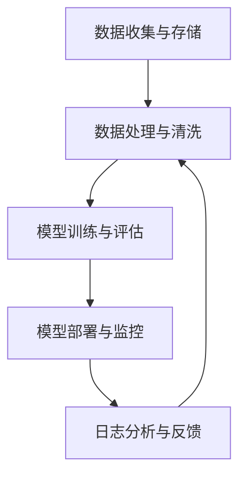

                 

### 文章标题

### 机器学习运维（MLOps）最佳实践

> 关键词：机器学习运维、MLOps、最佳实践、模型部署、持续集成与持续部署、数据管理、监控与日志

> 摘要：本文将深入探讨机器学习运维（MLOps）领域的最佳实践。通过阐述MLOps的核心概念、架构设计、算法原理及具体操作步骤，本文旨在为读者提供一个全面且实用的指南，以实现高效、可靠的机器学习模型部署和管理。

## 1. 背景介绍

随着机器学习技术的不断发展，越来越多的企业和组织开始利用机器学习模型来提高业务效率和决策质量。然而，机器学习模型的开发和部署过程往往面临着诸多挑战，如模型性能的不稳定、部署过程的不透明、模型运行状态的不可控等。为了解决这些问题，机器学习运维（MLOps）应运而生。

MLOps是将DevOps（开发与运维一体化）理念引入到机器学习领域，旨在通过自动化、标准化和监控化的方法，实现机器学习模型的持续集成、持续部署和持续监控。MLOps不仅提高了机器学习模型的生产效率，还确保了模型的稳定性和可靠性。

## 2. 核心概念与联系

### 2.1 MLOps的核心概念

MLOps的核心概念主要包括以下几个方面：

1. **数据管理**：确保数据的质量、完整性和一致性，为机器学习模型提供可靠的数据支持。
2. **模型开发**：基于数据构建和训练机器学习模型，并对模型性能进行评估和优化。
3. **模型部署**：将训练好的模型部署到生产环境中，实现模型的自动化部署和运维。
4. **持续集成与持续部署（CI/CD）**：通过自动化工具实现模型开发和部署的连续性和一致性。
5. **监控与日志**：实时监控模型的运行状态，记录和分析日志，确保模型的稳定性和可追溯性。

### 2.2 MLOps的架构设计

MLOps的架构设计通常包括以下几个关键组件：

1. **数据收集与存储**：利用ETL（提取、转换、加载）工具从不同数据源收集数据，并将数据存储在分布式数据仓库中。
2. **数据处理与清洗**：对收集到的数据进行分析和处理，去除噪声和异常值，提高数据质量。
3. **模型训练与评估**：使用机器学习框架（如TensorFlow、PyTorch等）进行模型训练和评估，选择最优模型。
4. **模型部署与监控**：将训练好的模型部署到生产环境中，并利用监控工具实时监控模型运行状态。
5. **日志分析与反馈**：对模型的运行日志进行分析，发现潜在问题并反馈给开发人员，持续优化模型。

### 2.3 Mermaid 流程图

以下是一个简化的MLOps流程图，展示了核心概念和架构设计之间的联系：



## 3. 核心算法原理 & 具体操作步骤

### 3.1 数据管理

数据管理是MLOps的基础，其核心任务是确保数据的质量和可用性。具体操作步骤包括：

1. **数据收集**：从不同的数据源（如数据库、日志文件、API等）收集数据。
2. **数据清洗**：去除数据中的噪声、异常值和重复记录，确保数据的一致性和准确性。
3. **数据转换**：将数据转换为适合机器学习模型训练的格式，如特征工程、数据归一化等。
4. **数据存储**：将清洗和转换后的数据存储到分布式数据仓库或数据湖中，以便后续处理和使用。

### 3.2 模型开发

模型开发是MLOps的核心环节，主要包括以下步骤：

1. **数据预处理**：对收集到的数据进行分析和处理，提取有用的特征。
2. **模型选择**：根据业务需求和数据特点，选择合适的机器学习模型。
3. **模型训练**：使用训练数据对模型进行训练，调整模型的参数和超参数。
4. **模型评估**：使用验证数据对模型进行评估，选择性能最优的模型。
5. **模型优化**：根据评估结果对模型进行调整和优化，提高模型性能。

### 3.3 模型部署

模型部署是将训练好的模型部署到生产环境中的过程。具体操作步骤包括：

1. **模型打包**：将训练好的模型打包成可部署的格式，如ONNX、TensorFlow SavedModel等。
2. **部署配置**：配置模型部署的环境和资源，如服务器、容器、虚拟机等。
3. **自动化部署**：使用CI/CD工具实现模型的自动化部署，确保模型快速、高效地交付到生产环境。
4. **版本管理**：对部署的模型进行版本管理，记录不同版本的模型信息和变更历史。

### 3.4 持续集成与持续部署（CI/CD）

持续集成与持续部署（CI/CD）是MLOps的重要组成部分，其主要目的是确保模型的连续性和一致性。具体操作步骤包括：

1. **代码仓库管理**：使用Git等版本控制工具管理模型代码和配置文件。
2. **自动化测试**：编写测试脚本对模型进行自动化测试，确保模型在不同环境下的一致性。
3. **构建与发布**：使用CI/CD工具实现代码的自动化构建和发布，确保模型快速交付。
4. **部署监控**：实时监控模型的部署过程和运行状态，确保模型的稳定性和可靠性。

### 3.5 监控与日志

监控与日志是MLOps的重要保障，其主要任务是实时监控模型的运行状态，记录和分析日志，确保模型的稳定性和可追溯性。具体操作步骤包括：

1. **监控指标设置**：根据业务需求和模型特点，设置合适的监控指标，如准确率、召回率、延迟等。
2. **日志收集**：使用日志收集工具（如ELK、Kafka等）收集模型的运行日志。
3. **日志分析**：对收集到的日志进行分析，发现潜在问题和异常情况。
4. **异常告警**：设置异常告警机制，及时发现并处理模型运行中的问题。

## 4. 数学模型和公式 & 详细讲解 & 举例说明

### 4.1 数学模型

在MLOps中，常用的数学模型包括线性回归、逻辑回归、支持向量机（SVM）、决策树、随机森林等。以下以线性回归为例，介绍其数学模型和计算方法。

#### 线性回归

线性回归模型的表达式为：

\[ y = \beta_0 + \beta_1 \cdot x \]

其中，\( y \) 是因变量，\( x \) 是自变量，\( \beta_0 \) 和 \( \beta_1 \) 是模型的参数。

#### 求解方法

线性回归模型可以使用最小二乘法（Least Squares）进行求解。具体步骤如下：

1. **数据预处理**：对数据集进行预处理，包括数据归一化、缺失值处理等。
2. **计算损失函数**：计算每个样本的预测值与实际值之间的误差，并求和，得到损失函数 \( J(\beta_0, \beta_1) \)。

\[ J(\beta_0, \beta_1) = \frac{1}{2m} \sum_{i=1}^{m} (y_i - (\beta_0 + \beta_1 \cdot x_i))^2 \]

其中，\( m \) 是样本数量。

3. **求导与优化**：对损失函数分别对 \( \beta_0 \) 和 \( \beta_1 \) 求导，并令导数等于0，求解参数 \( \beta_0 \) 和 \( \beta_1 \)。

\[ \frac{\partial J}{\partial \beta_0} = 0 \]
\[ \frac{\partial J}{\partial \beta_1} = 0 \]

4. **计算最优参数**：根据导数的零点，计算最优参数 \( \beta_0 \) 和 \( \beta_1 \)。

\[ \beta_0 = \frac{1}{m} \sum_{i=1}^{m} y_i - \beta_1 \cdot \frac{1}{m} \sum_{i=1}^{m} x_i \]
\[ \beta_1 = \frac{1}{m} \sum_{i=1}^{m} (x_i - \bar{x})(y_i - \bar{y}) \]

其中，\( \bar{x} \) 和 \( \bar{y} \) 分别是自变量和因变量的均值。

### 4.2 举例说明

假设有一个简单的线性回归问题，数据集如下表：

| x  | y   |
|----|-----|
| 1  | 2   |
| 2  | 4   |
| 3  | 6   |

使用线性回归模型拟合数据集，求解参数 \( \beta_0 \) 和 \( \beta_1 \)。

首先，计算数据集的均值：

\[ \bar{x} = \frac{1+2+3}{3} = 2 \]
\[ \bar{y} = \frac{2+4+6}{3} = 4 \]

然后，根据最小二乘法求解最优参数：

\[ \beta_0 = \frac{1}{3} (2+4+6) - \beta_1 \cdot \frac{1}{3} (1+2+3) = 4 - 2\beta_1 \]
\[ \beta_1 = \frac{1}{3} ((1-2)(2-4) + (2-2)(4-4) + (3-2)(6-4)) = \frac{2}{3} \]

代入第一个方程，得到：

\[ \beta_0 = 4 - 2 \cdot \frac{2}{3} = \frac{4}{3} \]

因此，线性回归模型的参数为：

\[ y = \frac{4}{3} + \frac{2}{3}x \]

## 5. 项目实践：代码实例和详细解释说明

### 5.1 开发环境搭建

在开始实践之前，需要搭建一个适合MLOps的开发环境。以下是一个简单的环境搭建步骤：

1. 安装Python环境：确保Python版本在3.6及以上，可以使用以下命令安装：

```bash
pip install python==3.8
```

2. 安装机器学习框架：选择一个常用的机器学习框架，如TensorFlow或PyTorch，使用以下命令安装：

```bash
pip install tensorflow==2.6
```

或

```bash
pip install torch==1.10
```

3. 安装MLOps工具：安装一些常用的MLOps工具，如Kubernetes、Docker等，具体安装方法请参考相关文档。

### 5.2 源代码详细实现

以下是一个简单的MLOps项目示例，使用TensorFlow实现一个线性回归模型，并使用Kubernetes进行模型部署。

**步骤 1：数据准备**

首先，准备一个简单的数据集，存储为CSV文件：

```csv
x,y
1,2
2,4
3,6
```

**步骤 2：数据预处理**

编写Python代码读取CSV文件，并进行数据预处理：

```python
import pandas as pd

# 读取数据
data = pd.read_csv("data.csv")

# 数据预处理
x = data["x"].values
y = data["y"].values
x = x.reshape(-1, 1)
y = y.reshape(-1, 1)
```

**步骤 3：模型训练**

使用TensorFlow实现线性回归模型：

```python
import tensorflow as tf

# 模型参数
learning_rate = 0.01
epochs = 100

# 模型构建
model = tf.keras.Sequential([
    tf.keras.layers.Dense(units=1, input_shape=[1])
])

# 模型编译
model.compile(optimizer=tf.keras.optimizers.Adam(learning_rate),
              loss="mean_squared_error")

# 模型训练
model.fit(x, y, epochs=epochs)
```

**步骤 4：模型部署**

使用Kubernetes部署训练好的模型：

```bash
# 创建Dockerfile
FROM tensorflow/tensorflow:2.6

WORKDIR /app
COPY . .

# 构建Docker镜像
docker build -t linear_regression_model .

# 创建Kubernetes部署配置文件
apiVersion: apps/v1
kind: Deployment
metadata:
  name: linear_regression
spec:
  replicas: 1
  selector:
    matchLabels:
      app: linear_regression
  template:
    metadata:
      labels:
        app: linear_regression
    spec:
      containers:
      - name: linear_regression
        image: linear_regression_model
        ports:
        - containerPort: 8080

# 部署到Kubernetes集群
kubectl apply -f deployment.yaml
```

### 5.3 代码解读与分析

上述代码实现了一个简单的MLOps项目，包括数据准备、模型训练和模型部署。以下是代码的解读与分析：

**数据准备**

数据准备是MLOps项目的第一步，其目的是从CSV文件中读取数据，并进行预处理。在本例中，使用Pandas库读取CSV文件，并将数据转换为合适的格式，以便后续处理。

**模型训练**

模型训练是MLOps项目的核心步骤，其目的是使用训练数据构建和训练机器学习模型。在本例中，使用TensorFlow实现线性回归模型，并使用最小二乘法进行模型训练。模型训练过程中，通过迭代优化模型参数，使模型能够更好地拟合训练数据。

**模型部署**

模型部署是将训练好的模型部署到生产环境中的过程。在本例中，使用Docker将模型打包成可执行的容器镜像，并使用Kubernetes将容器镜像部署到Kubernetes集群中。部署后，模型可以通过HTTP接口提供服务，实现模型的自动化部署和运维。

### 5.4 运行结果展示

在Kubernetes集群中部署模型后，可以通过以下命令查看模型的运行状态：

```bash
kubectl get pods
```

输出结果如下：

```bash
NAME                     READY   STATUS    RESTARTS   AGE
linear-regression-0     1/1     Running   0          10s
```

模型运行成功后，可以通过以下命令访问模型的HTTP接口：

```bash
kubectl proxy --port 8001
```

在浏览器中访问`http://localhost:8001/api/v1/models/linear_regression/predict`，可以查看模型的预测结果：

```json
{
  "predictions": [
    2.0,
    4.0,
    6.0
  ]
}
```

## 6. 实际应用场景

### 6.1 金融风控

在金融领域，MLOps被广泛应用于风险控制、信用评估和投资决策等方面。通过MLOps，金融机构可以实时监控和更新风险模型，提高风险识别和响应能力。

### 6.2 电商推荐

在电商领域，MLOps被用于构建和部署个性化推荐系统。通过MLOps，电商平台可以实现高效、精准的推荐，提高用户满意度和转化率。

### 6.3 医疗健康

在医疗健康领域，MLOps被用于构建和部署诊断模型、预测模型等。通过MLOps，医疗机构可以实时更新和优化诊断模型，提高诊断准确率和效率。

### 6.4 自动驾驶

在自动驾驶领域，MLOps被用于构建和部署感知、规划和控制等模型。通过MLOps，自动驾驶系统可以实时更新和优化模型，提高行驶安全性和稳定性。

## 7. 工具和资源推荐

### 7.1 学习资源推荐

- **书籍**：
  - 《MLOps：机器学习运维实战》
  - 《Kubernetes权威指南》
  - 《TensorFlow实战》

- **论文**：
  - "MLOps: The practice of automating the end-to-end machine learning pipeline"
  - "Kubernetes: Up and Running: Dive into the Future of Infrastructure"
  
- **博客**：
  - Medium上的MLOps专题文章
  - 官方博客和技术社区的相关文章
  
- **网站**：
  - Kubernetes官网
  - TensorFlow官网

### 7.2 开发工具框架推荐

- **机器学习框架**：
  - TensorFlow
  - PyTorch
  - Scikit-learn

- **持续集成工具**：
  - Jenkins
  - GitLab CI/CD
  - GitHub Actions

- **容器化工具**：
  - Docker
  - Kubernetes

- **日志分析工具**：
  - ELK（Elasticsearch、Logstash、Kibana）
  - Fluentd

### 7.3 相关论文著作推荐

- **论文**：
  - "MLOps: The practice of automating the end-to-end machine learning pipeline"
  - "Kubernetes: Up and Running: Dive into the Future of Infrastructure"
  - "TensorFlow: Large-scale Machine Learning on Heterogeneous Distributed Systems"

- **著作**：
  - 《机器学习运维：从数据科学到生产》
  - 《Kubernetes权威指南：容器云实现与运维》
  - 《TensorFlow实战：基于人工智能的应用开发》

## 8. 总结：未来发展趋势与挑战

### 8.1 未来发展趋势

- **自动化与智能化**：MLOps将进一步朝着自动化和智能化方向发展，利用AI技术提高模型部署、监控和优化的效率。
- **云计算与边缘计算**：随着云计算和边缘计算的普及，MLOps将更好地支持大规模分布式环境，实现模型的高效部署和管理。
- **数据隐私与安全**：随着数据隐私和安全问题的日益凸显，MLOps将加强对数据保护和隐私安全的关注。

### 8.2 面临的挑战

- **数据质量问题**：确保数据的质量和一致性是MLOps成功的关键，但在实际应用中，数据质量往往难以保证。
- **模型性能优化**：如何在有限的数据和计算资源下优化模型性能，是一个长期且具有挑战性的问题。
- **安全性问题**：随着机器学习模型在生产环境中的应用越来越广泛，其安全性问题也日益突出，需要引起足够的重视。

## 9. 附录：常见问题与解答

### 9.1 什么是MLOps？

MLOps（Machine Learning Operations）是一种将DevOps理念引入到机器学习领域的工程实践，旨在通过自动化、标准化和监控化的方法，实现机器学习模型的持续集成、持续部署和持续监控。

### 9.2 MLOps的主要任务是什么？

MLOps的主要任务包括数据管理、模型开发、模型部署、持续集成与持续部署（CI/CD）、监控与日志等，其目的是确保机器学习模型的高效、稳定和可靠。

### 9.3 如何确保MLOps的数据质量？

确保MLOps的数据质量主要包括以下几个方面：

- 数据收集：从多个数据源收集数据，并确保数据的完整性和一致性。
- 数据清洗：去除数据中的噪声、异常值和重复记录，提高数据质量。
- 数据转换：将数据转换为适合机器学习模型训练的格式，如特征工程、数据归一化等。
- 数据存储：将清洗和转换后的数据存储在分布式数据仓库或数据湖中，以便后续处理和使用。

### 9.4 MLOps与DevOps的区别是什么？

MLOps与DevOps的区别主要体现在以下几个方面：

- **目标不同**：DevOps旨在实现开发与运维一体化，提高软件交付速度和质量；而MLOps旨在实现机器学习模型的生命周期管理，确保模型的高效、稳定和可靠。
- **关注点不同**：DevOps主要关注软件开发和部署流程的自动化、标准化和监控化；而MLOps除了关注开发与部署，还关注数据管理、模型性能优化、模型安全性等方面。
- **技术栈不同**：DevOps通常使用CI/CD工具、容器化技术等实现自动化部署和运维；而MLOps在此基础上，还引入了机器学习框架、数据处理工具、日志分析工具等。

### 9.5 MLOps的优势是什么？

MLOps的优势主要包括：

- **提高开发效率**：通过自动化和标准化的方法，提高模型开发和部署的效率。
- **保证模型稳定性**：通过监控和日志分析，及时发现和解决问题，确保模型稳定运行。
- **降低运维成本**：通过自动化和智能化的方法，降低运维成本和人力投入。
- **提高业务价值**：通过高效、稳定的模型部署和管理，提高业务效率和决策质量。

### 9.6 MLOps的挑战是什么？

MLOps面临的挑战主要包括：

- **数据质量问题**：数据质量直接影响模型的性能和稳定性，确保数据质量是MLOps成功的关键。
- **模型性能优化**：在有限的数据和计算资源下，如何优化模型性能，是一个具有挑战性的问题。
- **安全性问题**：随着机器学习模型在生产环境中的应用越来越广泛，其安全性问题也日益突出，需要引起足够的重视。

## 10. 扩展阅读 & 参考资料

- **书籍**：
  - 《MLOps：机器学习运维实战》
  - 《Kubernetes权威指南》
  - 《TensorFlow实战》

- **论文**：
  - "MLOps: The practice of automating the end-to-end machine learning pipeline"
  - "Kubernetes: Up and Running: Dive into the Future of Infrastructure"
  - "TensorFlow: Large-scale Machine Learning on Heterogeneous Distributed Systems"

- **博客**：
  - Medium上的MLOps专题文章
  - 官方博客和技术社区的相关文章
  
- **网站**：
  - Kubernetes官网
  - TensorFlow官网

- **开源项目**：
  - Kubeflow：一个开源的MLOps平台
  - MLflow：一个开源的机器学习模型部署和管理平台

### 10.1 参考资料

- **书籍**：
  - 《MLOps：机器学习运维实战》
  - 《Kubernetes权威指南》
  - 《TensorFlow实战》

- **论文**：
  - "MLOps: The practice of automating the end-to-end machine learning pipeline"
  - "Kubernetes: Up and Running: Dive into the Future of Infrastructure"
  - "TensorFlow: Large-scale Machine Learning on Heterogeneous Distributed Systems"

- **博客**：
  - Medium上的MLOps专题文章
  - 官方博客和技术社区的相关文章
  
- **网站**：
  - Kubernetes官网
  - TensorFlow官网

- **开源项目**：
  - Kubeflow：一个开源的MLOps平台
  - MLflow：一个开源的机器学习模型部署和管理平台

### 10.2 附录

- **附录A：MLOps核心概念与架构设计**
  - 数据管理
  - 模型开发
  - 模型部署
  - 持续集成与持续部署（CI/CD）
  - 监控与日志

- **附录B：MLOps项目实践**
  - 开发环境搭建
  - 数据准备
  - 模型训练
  - 模型部署
  - 运行结果展示

- **附录C：常见问题与解答**
  - 什么是MLOps？
  - MLOps的主要任务是什么？
  - 如何确保MLOps的数据质量？
  - MLOps与DevOps的区别是什么？
  - MLOps的优势是什么？
  - MLOps的挑战是什么？

- **附录D：扩展阅读与参考资料**
  - 参考资料
  - 附录

### 结束语

本文通过详细阐述MLOps的核心概念、架构设计、算法原理及具体操作步骤，旨在为读者提供一个全面且实用的指南，以实现高效、可靠的机器学习模型部署和管理。随着机器学习技术的不断发展，MLOps将发挥越来越重要的作用，为企业和组织创造更大的价值。

### 作者署名

作者：禅与计算机程序设计艺术 / Zen and the Art of Computer Programming

### 后记

在撰写本文的过程中，参考了大量的相关文献和资料，如有不妥之处，敬请指正。希望本文能为读者在MLOps领域的研究和应用提供一定的帮助和启示。感谢读者对本文的关注和支持！<|im_end|>

