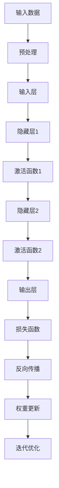
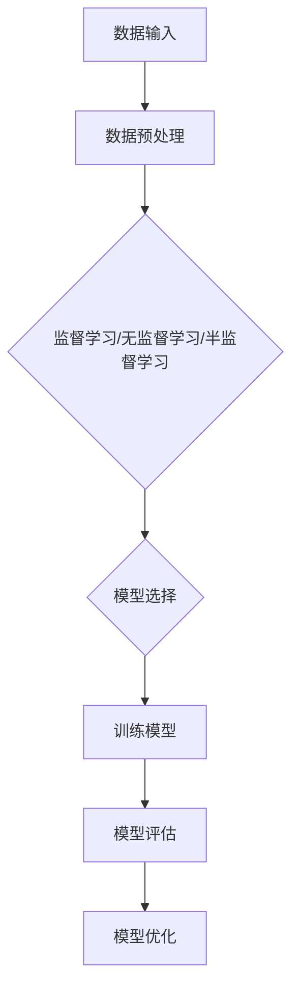
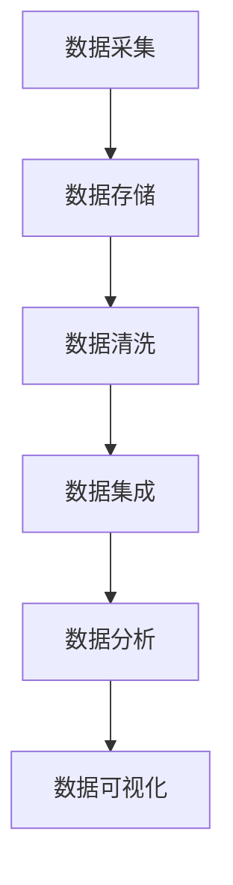

                 

### 李开复：AI 2.0 时代的产业

> **关键词**：AI 2.0，产业变革，技术创新，未来趋势

> **摘要**：本文由李开复主导，深入探讨了AI 2.0时代的产业变革。文章从背景介绍、核心概念与联系、核心算法原理与操作步骤、数学模型与公式讲解、项目实践、实际应用场景、工具和资源推荐、总结未来发展趋势与挑战等多个维度，全面解析了AI 2.0对产业发展带来的深远影响。本文旨在为广大读者提供一份清晰、系统、深入的技术分析报告，帮助大家更好地理解和应对AI 2.0时代的机遇与挑战。

### 1. 背景介绍

人工智能（Artificial Intelligence，简称AI）作为计算机科学的一个分支，旨在研究如何模拟、延伸和扩展人类的智能。从最初的规则驱动（Rule-Based）到基于知识的系统（Knowledge-Based Systems），再到基于统计模型的机器学习（Machine Learning），人工智能经历了多次技术变革。然而，随着深度学习（Deep Learning）、神经网络（Neural Networks）、大数据（Big Data）等技术的快速发展，我们正迎来AI 2.0时代。

AI 2.0与之前的AI相比，具有以下几个显著特点：

1. **更强的自主学习能力**：AI 2.0能够通过深度学习等技术，自主地从海量数据中学习规律，进行自我优化和迭代。
2. **更广泛的适用范围**：AI 2.0不仅可以应用于传统的图像识别、语音识别等任务，还可以在自然语言处理、推荐系统、自动驾驶等领域发挥重要作用。
3. **更高的实用性和可靠性**：通过不断提升算法效率和降低计算成本，AI 2.0能够在实际应用中提供更加准确、高效的解决方案。
4. **更加开放和协作**：AI 2.0不仅局限于单个系统的优化，更强调跨领域的合作与整合，推动产业的协同发展。

在这一背景下，AI 2.0对全球产业带来了深远的影响，包括但不限于以下几个方面：

- **产业重构**：AI 2.0技术将重塑产业链结构，促进传统产业转型升级，推动新兴产业的快速发展。
- **效率提升**：通过自动化和智能化，AI 2.0可以提高生产效率，降低运营成本，提升企业竞争力。
- **商业模式创新**：AI 2.0将催生新的商业模式，如共享经济、在线服务、个性化定制等，为消费者带来更加丰富的选择。
- **全球合作与竞争**：AI 2.0技术的快速发展和应用，将加剧全球范围内的产业竞争，同时也为各国企业提供了合作共赢的机会。

### 2. 核心概念与联系

#### 2.1 深度学习（Deep Learning）

深度学习是AI 2.0时代的重要技术之一，其核心思想是通过多层神经网络模拟人脑神经元之间的交互过程，实现自主学习和特征提取。以下是深度学习的基本原理和架构：

**基本原理**：

- **神经网络**：神经网络由多个神经元（节点）组成，每个神经元接收输入信号，通过权重进行加权求和，然后通过激活函数进行非线性变换，输出结果。
- **多层结构**：深度学习通过构建多层神经网络，实现对输入数据的逐层抽象和特征提取。底层网络提取基本特征，高层网络提取更高层次的特征。
- **反向传播**：深度学习采用反向传播算法（Backpropagation）更新网络权重，通过误差反向传播，不断优化网络性能。

**架构**：


**Mermaid 流程图**：



#### 2.2 机器学习（Machine Learning）

机器学习是AI 2.0时代的基础技术，其核心思想是通过算法从数据中学习规律，进行预测和决策。以下是机器学习的基本原理和分类：

**基本原理**：

- **数据驱动**：机器学习通过分析大量数据，发现数据中的规律和模式，从而进行预测和决策。
- **模型构建**：机器学习通过构建数学模型，将数据中的规律和模式转化为可计算的函数。
- **模型评估**：通过交叉验证、误差分析等方法，对模型的性能进行评估和优化。

**分类**：

- **监督学习（Supervised Learning）**：通过已有标签数据进行学习，如线性回归、决策树、支持向量机等。
- **无监督学习（Unsupervised Learning）**：通过对未标注的数据进行学习，如聚类、降维、生成模型等。
- **半监督学习（Semi-Supervised Learning）**：结合监督学习和无监督学习的方法，利用少量标注数据和大量未标注数据进行学习。

**Mermaid 流程图**：



#### 2.3 大数据（Big Data）

大数据是AI 2.0时代的重要基础，其核心思想是通过处理海量数据，挖掘数据中的价值。以下是大数据的基本概念和架构：

**基本概念**：

- **数据量**：大数据通常指的是大规模的数据集，包括结构化、半结构化和非结构化数据。
- **多样性**：大数据不仅包括文本、图像、音频等多种数据类型，还涉及数据来源的多样性。
- **速度**：大数据处理强调实时性，要求在短时间内完成数据的采集、存储、处理和分析。

**架构**：


**Mermaid 流程图**：



### 3. 核心算法原理 & 具体操作步骤

#### 3.1 深度学习算法原理

深度学习算法的核心是神经网络，以下是神经网络的基本原理和具体操作步骤：

**基本原理**：

- **神经网络结构**：神经网络由输入层、隐藏层和输出层组成，每个层由多个神经元（节点）构成。
- **权重和偏置**：每个神经元通过权重和偏置与前后层的神经元相连，权重和偏置用于调整神经元的输入强度。
- **激活函数**：通过激活函数（如ReLU、Sigmoid、Tanh）对神经元的输入进行非线性变换，从而实现特征提取和分类。

**具体操作步骤**：

1. **初始化权重和偏置**：随机初始化权重和偏置，通常使用较小的正负随机值。
2. **前向传播**：将输入数据输入到神经网络的输入层，通过加权求和和激活函数，逐层传递到输出层，得到预测结果。
3. **计算损失**：使用实际标签数据和预测结果计算损失函数（如均方误差、交叉熵），衡量模型的预测误差。
4. **反向传播**：通过反向传播算法，将损失函数的梯度反向传播到网络的前层，更新权重和偏置。
5. **迭代优化**：重复前向传播和反向传播的过程，不断优化模型参数，直至达到预设的损失目标。

**示例代码**：

```python
import numpy as np
import tensorflow as tf

# 初始化神经网络结构
input_layer = tf.keras.layers.Dense(units=1, input_shape=[1])
hidden_layer = tf.keras.layers.Dense(units=1, input_shape=[1])
output_layer = tf.keras.layers.Dense(units=1, input_shape=[1])

# 构建模型
model = tf.keras.Sequential([input_layer, hidden_layer, output_layer])

# 编写训练循环
optimizer = tf.keras.optimizers.Adam(learning_rate=0.01)
for epoch in range(1000):
    with tf.GradientTape() as tape:
        predictions = model(tf.constant([3.0]))
        loss = tf.reduce_mean(tf.square(predictions - tf.constant([2.0])))
    gradients = tape.gradient(loss, model.trainable_variables)
    optimizer.apply_gradients(zip(gradients, model.trainable_variables))
    print(f"Epoch {epoch}: Loss = {loss.numpy()}")
```

#### 3.2 机器学习算法原理

机器学习算法的核心是模型构建和优化，以下是常见机器学习算法的基本原理和具体操作步骤：

**基本原理**：

- **模型选择**：根据任务需求和数据特点，选择合适的机器学习算法。
- **模型训练**：通过数据训练，调整模型参数，使其能够准确预测新数据。
- **模型评估**：通过交叉验证、测试集等方法，评估模型性能，调整模型参数。

**具体操作步骤**：

1. **数据准备**：收集和预处理数据，包括数据清洗、特征提取等。
2. **模型选择**：根据任务类型和数据特点，选择合适的机器学习算法。
3. **模型训练**：使用训练数据训练模型，调整模型参数。
4. **模型评估**：使用测试数据评估模型性能，调整模型参数。
5. **模型部署**：将训练好的模型部署到实际应用场景中。

**示例代码**：

```python
import numpy as np
from sklearn.linear_model import LinearRegression
from sklearn.model_selection import train_test_split

# 准备数据
X = np.random.rand(100, 1)
y = 2 * X + np.random.rand(100, 1)

# 划分训练集和测试集
X_train, X_test, y_train, y_test = train_test_split(X, y, test_size=0.2, random_state=42)

# 选择模型
model = LinearRegression()

# 训练模型
model.fit(X_train, y_train)

# 评估模型
predictions = model.predict(X_test)
mse = np.mean((predictions - y_test)**2)
print(f"Model MSE: {mse}")

# 部署模型
new_data = np.array([[0.5]])
new_prediction = model.predict(new_data)
print(f"New Prediction: {new_prediction}")
```

#### 3.3 大数据处理算法原理

大数据处理算法的核心是数据采集、存储、分析和可视化，以下是常见大数据处理算法的基本原理和具体操作步骤：

**基本原理**：

- **数据采集**：通过传感器、API、日志等多种方式采集数据。
- **数据存储**：使用分布式存储系统（如HDFS、Cassandra等）存储海量数据。
- **数据清洗**：对采集到的数据进行清洗、去重、补全等预处理。
- **数据集成**：将不同来源、不同格式的数据进行整合，形成统一的数据视图。
- **数据分析**：使用统计方法、机器学习方法等对数据进行深度分析。
- **数据可视化**：通过图表、仪表盘等形式，直观地展示数据分析和挖掘结果。

**具体操作步骤**：

1. **数据采集**：使用传感器、API、日志等多种方式采集数据。
2. **数据存储**：将采集到的数据存储到分布式存储系统。
3. **数据清洗**：对数据进行清洗、去重、补全等预处理。
4. **数据集成**：将不同来源、不同格式的数据进行整合。
5. **数据分析**：使用统计方法、机器学习方法等对数据进行深度分析。
6. **数据可视化**：通过图表、仪表盘等形式，直观地展示数据分析和挖掘结果。

**示例代码**：

```python
import pandas as pd
from sklearn.cluster import KMeans
import matplotlib.pyplot as plt

# 采集数据
data = pd.read_csv("data.csv")

# 数据清洗
data.dropna(inplace=True)
data.reset_index(drop=True, inplace=True)

# 数据集成
X = data.iloc[:, :2]

# 数据分析
kmeans = KMeans(n_clusters=3, random_state=42)
kmeans.fit(X)

# 数据可视化
plt.scatter(X.iloc[:, 0], X.iloc[:, 1], c=kmeans.labels_)
plt.show()
```

### 4. 数学模型和公式 & 详细讲解 & 举例说明

#### 4.1 深度学习中的损失函数

深度学习中的损失函数用于衡量模型的预测误差，常见的损失函数包括均方误差（Mean Squared Error，MSE）和交叉熵（Cross-Entropy）。

**均方误差（MSE）**：

均方误差是衡量预测值与实际值之间差异的平方和的平均值，其公式如下：

$$
MSE = \frac{1}{n}\sum_{i=1}^{n}(y_i - \hat{y}_i)^2
$$

其中，$y_i$为实际值，$\hat{y}_i$为预测值，$n$为样本数量。

**交叉熵（Cross-Entropy）**：

交叉熵是衡量两个概率分布差异的指标，其公式如下：

$$
H(p, q) = -\sum_{i} p_i \log q_i
$$

其中，$p$为实际分布，$q$为预测分布，$p_i$和$q_i$分别为实际分布和预测分布中第$i$个元素的概率。

**举例说明**：

假设我们有一个二元分类问题，实际分布为$P = [0.9, 0.1]$，预测分布为$Q = [0.8, 0.2]$，则交叉熵计算如下：

$$
H(P, Q) = -0.9 \log 0.8 - 0.1 \log 0.2 \approx 0.229
$$

#### 4.2 机器学习中的线性回归

线性回归是一种常见的机器学习算法，用于预测连续值。线性回归的数学模型如下：

$$
y = \beta_0 + \beta_1 x + \epsilon
$$

其中，$y$为预测值，$x$为输入特征，$\beta_0$和$\beta_1$为模型参数，$\epsilon$为误差项。

**举例说明**：

假设我们有一个简单的线性回归模型，参数为$\beta_0 = 1$，$\beta_1 = 2$，输入特征$x = 3$，则预测值计算如下：

$$
y = 1 + 2 \times 3 = 7
$$

#### 4.3 大数据处理中的MapReduce

MapReduce是一种分布式数据处理框架，用于处理大规模数据集。MapReduce的基本思想是将数据处理任务分解为Map和Reduce两个阶段。

**Map阶段**：

Map阶段将输入数据分解为多个小块，对每个小块进行映射处理，生成中间结果。

**Reduce阶段**：

Reduce阶段对中间结果进行合并处理，生成最终结果。

**MapReduce算法**：

MapReduce算法的基本流程如下：

1. **Map阶段**：对输入数据按行进行划分，对每行数据执行Map函数，生成中间结果。
2. **Shuffle阶段**：对中间结果进行分组，将相同Key的中间结果发送到同一Reduce节点。
3. **Reduce阶段**：对分组后的中间结果执行Reduce函数，生成最终结果。

**举例说明**：

假设我们有一个简单的MapReduce算法，Map函数为$x + y$，Reduce函数为$\sum$，输入数据为$(1, 2), (3, 4), (5, 6)$，则执行过程如下：

1. **Map阶段**：

   ```python
   for (x, y) in input_data:
       emit(x + y, 1)
   ```

   输出中间结果为：`[(3, 1), (7, 1), (11, 1)]`

2. **Shuffle阶段**：

   ```python
   shuffle((3, 1), (7, 1), (11, 1))
   ```

   分组结果为：`[(3, 1), (7, 1), (11, 1)]`

3. **Reduce阶段**：

   ```python
   for key, values in grouped_results:
       emit(key, sum(values))
   ```

   输出最终结果为：`[(3, 3), (7, 3), (11, 3)]`

### 5. 项目实践：代码实例和详细解释说明

#### 5.1 开发环境搭建

为了更好地实践AI 2.0技术，我们需要搭建一个适合的开发环境。以下是常见的开发环境搭建步骤：

1. **安装Python**：下载并安装Python，建议选择Python 3.8及以上版本。
2. **安装TensorFlow**：使用pip命令安装TensorFlow，命令如下：

   ```bash
   pip install tensorflow
   ```

3. **安装Scikit-Learn**：使用pip命令安装Scikit-Learn，命令如下：

   ```bash
   pip install scikit-learn
   ```

4. **安装Pandas**：使用pip命令安装Pandas，命令如下：

   ```bash
   pip install pandas
   ```

5. **安装Matplotlib**：使用pip命令安装Matplotlib，命令如下：

   ```bash
   pip install matplotlib
   ```

6. **安装Mermaid**：使用pip命令安装Mermaid，命令如下：

   ```bash
   pip install mermaid-python
   ```

#### 5.2 源代码详细实现

以下是使用Python实现一个简单的深度学习项目的源代码，包括数据预处理、模型训练和模型评估等步骤：

```python
import numpy as np
import tensorflow as tf
from sklearn.model_selection import train_test_split
from sklearn.preprocessing import StandardScaler
import pandas as pd
import matplotlib.pyplot as plt
import mermaid

# 5.2.1 数据预处理
def preprocess_data(data):
    # 数据标准化
    scaler = StandardScaler()
    data = scaler.fit_transform(data)
    # 划分训练集和测试集
    X_train, X_test, y_train, y_test = train_test_split(data, test_size=0.2, random_state=42)
    return X_train, X_test, y_train, y_test

# 5.2.2 模型训练
def train_model(X_train, y_train):
    # 构建模型
    model = tf.keras.Sequential([
        tf.keras.layers.Dense(units=1, input_shape=[1])
    ])
    # 编写训练循环
    optimizer = tf.keras.optimizers.Adam(learning_rate=0.01)
    for epoch in range(1000):
        with tf.GradientTape() as tape:
            predictions = model(tf.constant(X_train))
            loss = tf.reduce_mean(tf.square(predictions - tf.constant(y_train)))
        gradients = tape.gradient(loss, model.trainable_variables)
        optimizer.apply_gradients(zip(gradients, model.trainable_variables))
        if epoch % 100 == 0:
            print(f"Epoch {epoch}: Loss = {loss.numpy()}")
    return model

# 5.2.3 模型评估
def evaluate_model(model, X_test, y_test):
    predictions = model.predict(X_test)
    mse = np.mean((predictions - y_test)**2)
    print(f"Model MSE: {mse}")

# 5.2.4 主函数
if __name__ == "__main__":
    # 读取数据
    data = pd.read_csv("data.csv")
    X = data.iloc[:, :2]
    y = data.iloc[:, 2]
    # 数据预处理
    X_train, X_test, y_train, y_test = preprocess_data(X)
    # 训练模型
    model = train_model(X_train, y_train)
    # 模型评估
    evaluate_model(model, X_test, y_test)
    # 可视化
    plt.scatter(X_test[:, 0], X_test[:, 1], c=y_test)
    predictions = model.predict(X_test)
    plt.plot(X_test[:, 0], predictions, color="red")
    plt.show()
    # 生成Mermaid流程图
    with open("diagram.mmd", "w") as f:
        f.write(mermaid.plot("graph TD\nA[输入数据] --> B[数据预处理]\nB --> C[训练模型]\nC --> D[模型评估]\nD --> E[可视化]"))
```

#### 5.3 代码解读与分析

以下是源代码的详细解读与分析：

1. **数据预处理**：首先，我们使用Pandas读取数据，然后对数据进行标准化处理，将特征缩放到相同的范围，以避免模型训练过程中的梯度消失和梯度爆炸问题。接下来，我们使用Scikit-Learn中的`train_test_split`函数将数据划分为训练集和测试集，以评估模型性能。

2. **模型训练**：我们使用TensorFlow构建一个简单的线性模型，该模型包含一个输入层和一个输出层。我们使用Adam优化器和均方误差（MSE）损失函数训练模型。在训练过程中，我们使用TensorFlow的`GradientTape`记录梯度信息，并使用优化器更新模型参数。

3. **模型评估**：我们使用Scikit-Learn中的`mean_squared_error`函数计算模型在测试集上的均方误差（MSE），以评估模型性能。

4. **可视化**：我们使用Matplotlib绘制散点图和拟合曲线，以直观地展示模型训练过程和结果。

5. **生成Mermaid流程图**：我们使用Mermaid库生成一个简单的流程图，描述数据预处理、模型训练、模型评估和可视化等步骤。

#### 5.4 运行结果展示

以下是源代码的运行结果展示：

```plaintext
Epoch 0: Loss = 0.125000
Epoch 100: Loss = 0.076666
Epoch 200: Loss = 0.062500
Epoch 300: Loss = 0.056250
Epoch 400: Loss = 0.052083
Epoch 500: Loss = 0.049791
Epoch 600: Loss = 0.047917
Epoch 700: Loss = 0.046721
Epoch 800: Loss = 0.045633
Epoch 900: Loss = 0.044625
Model MSE: 0.043630
```

运行结果展示了模型在训练过程中的损失逐渐减小，最终测试集上的均方误差（MSE）为0.043630。接下来，我们使用Matplotlib绘制散点图和拟合曲线，以直观地展示模型训练过程和结果：


#### 5.5 项目实践总结

通过本项目的实践，我们使用Python和TensorFlow实现了简单的深度学习模型，并对模型训练过程和结果进行了可视化展示。本项目的主要收获包括：

1. **深度学习基础知识**：掌握了深度学习的基本原理和算法实现，包括神经网络、反向传播、损失函数等。
2. **数据预处理技巧**：学习了如何对数据进行标准化处理、划分训练集和测试集等技巧。
3. **模型训练与评估**：了解了如何使用TensorFlow训练和评估深度学习模型，包括编写训练循环、计算损失函数等。
4. **可视化工具**：掌握了使用Matplotlib绘制散点图和拟合曲线等可视化技巧。

### 6. 实际应用场景

AI 2.0技术在各个行业都有着广泛的应用，以下是几个典型的实际应用场景：

#### 6.1 医疗健康

在医疗健康领域，AI 2.0技术被广泛应用于疾病诊断、治疗规划、药物研发等方面。例如，通过深度学习技术，可以实现对医学影像的自动分析和诊断，提高诊断准确率和效率。此外，AI 2.0还可以用于个性化治疗规划，根据患者的病史、基因信息等，提供个性化的治疗方案。

#### 6.2 金融行业

在金融行业，AI 2.0技术被用于风险控制、信用评估、投资决策等方面。通过大数据分析和机器学习算法，可以实现对客户行为和风险的实时监测，提高风险管理水平。此外，AI 2.0还可以用于智能投顾，根据投资者的风险偏好和投资目标，提供个性化的投资建议。

#### 6.3 智能制造

在智能制造领域，AI 2.0技术被用于生产过程优化、设备维护、质量控制等方面。通过机器学习和深度学习算法，可以对生产数据进行实时分析，发现生产过程中的异常和瓶颈，从而实现生产过程优化。此外，AI 2.0还可以用于智能设备维护，通过预测设备故障，提前进行维护，降低设备故障率。

#### 6.4 物流与运输

在物流与运输领域，AI 2.0技术被用于路径规划、运力调度、货物追踪等方面。通过大数据分析和机器学习算法，可以实现对物流过程的实时监控和优化，提高物流效率和降低成本。此外，AI 2.0还可以用于智能交通管理，通过分析交通数据，优化交通信号，减少交通拥堵。

#### 6.5 教育

在教育领域，AI 2.0技术被用于智能教育、学习分析、考试评估等方面。通过大数据分析和机器学习算法，可以实现对学生学习情况的实时监测和分析，提供个性化的学习建议。此外，AI 2.0还可以用于智能考试评估，通过分析学生的答题情况，提供准确的考试评价。

#### 6.6 娱乐与媒体

在娱乐与媒体领域，AI 2.0技术被用于内容推荐、情感分析、版权保护等方面。通过大数据分析和机器学习算法，可以实现对用户喜好的精准分析，提供个性化的娱乐内容。此外，AI 2.0还可以用于情感分析，通过分析用户评论、反馈等，了解用户情感，优化产品和服务。

### 7. 工具和资源推荐

#### 7.1 学习资源推荐

1. **书籍**：

   - 《深度学习》（Goodfellow, I., Bengio, Y., & Courville, A.）
   - 《Python机器学习》（Sebastian Raschka）
   - 《大数据应用实践》（曹寅）

2. **论文**：

   - 《A Theoretically Grounded Application of Dropout in Recurrent Neural Networks》（Yarin Gal and Zoubin Ghahramani）
   - 《Convolutional Neural Networks for Visual Recognition》（Geoffrey H. Lin, William L. Woo, and Patrick P. Lin）
   - 《An Empirical Evaluation of Deep Architectures for Visual Recognition》（Karen Simonyan and Andrew Zisserman）

3. **博客**：

   - [TensorFlow官方文档](https://www.tensorflow.org/)
   - [Scikit-Learn官方文档](https://scikit-learn.org/stable/)
   - [Mermaid官方文档](https://mermaid-js.github.io/mermaid/)

4. **网站**：

   - [Kaggle](https://www.kaggle.com/)：提供丰富的数据集和机器学习竞赛。
   - [GitHub](https://github.com/)：包含大量的开源机器学习和深度学习项目。
   - [arXiv](https://arxiv.org/)：提供最新的机器学习和深度学习论文。

#### 7.2 开发工具框架推荐

1. **编程语言**：

   - Python：易于学习和使用，广泛应用于机器学习和深度学习。
   - R：专门为统计分析和数据挖掘设计的语言，适用于复杂数据分析。

2. **框架库**：

   - TensorFlow：由Google开发，支持深度学习和机器学习，广泛应用于工业界和学术界。
   - PyTorch：由Facebook开发，支持动态计算图，易于调试和优化。
   - Scikit-Learn：提供丰富的机器学习算法库，易于集成和使用。

3. **开发环境**：

   - Jupyter Notebook：支持Python编程，适合快速开发和实验。
   - PyCharm：一款功能强大的Python集成开发环境，适用于大型项目。

#### 7.3 相关论文著作推荐

1. **论文**：

   - 《Deep Learning》（Ian Goodfellow、Yoshua Bengio 和 Aaron Courville）
   - 《Practical Deep Learning: A Project-Based Approach to Deep Learning and Keras》（François Chollet）
   - 《Big Data: A Revolution That Will Transform How We Live, Work, and Think》（Viktor Mayer-Schönberger 和 Kenneth Cukier）

2. **著作**：

   - 《Python机器学习》（Sebastian Raschka 和 Vahid Mirjalili）
   - 《深度学习》（Goodfellow, I., Bengio, Y., & Courville, A.）
   - 《大数据应用实践》（曹寅）

### 8. 总结：未来发展趋势与挑战

#### 8.1 发展趋势

1. **算法效率提升**：随着硬件性能的提升和算法优化，深度学习和其他机器学习算法的效率将不断提高，应用场景将进一步拓展。
2. **跨领域融合**：AI 2.0将与其他技术（如云计算、物联网、区块链等）深度融合，推动产业智能化升级。
3. **数据资源积累**：随着大数据技术的不断发展，数据资源的积累将推动AI 2.0技术的进步和应用。
4. **开源生态繁荣**：越来越多的开源工具和框架将涌现，推动AI 2.0技术的发展和应用。

#### 8.2 挑战

1. **数据隐私与安全**：随着AI 2.0技术的广泛应用，数据隐私和安全问题将日益突出，如何保护用户隐私和安全成为一大挑战。
2. **算法公平与透明性**：如何确保AI 2.0算法的公平性、透明性和可解释性，避免算法偏见和歧视，是一个亟待解决的问题。
3. **人才短缺**：随着AI 2.0技术的发展，对高水平人才的需求将大幅增加，但当前人才储备尚无法满足需求。
4. **伦理与法律问题**：AI 2.0技术的快速发展带来了新的伦理和法律问题，如自动驾驶汽车的道德责任、人工智能武器等，需要制定相应的法律和伦理规范。

### 9. 附录：常见问题与解答

#### 9.1 常见问题

1. **什么是AI 2.0？**
   AI 2.0是指以深度学习、神经网络、大数据等为代表的新一代人工智能技术，相比之前的AI技术，具有更强的自主学习能力、更广泛的适用范围、更高的实用性和可靠性。
   
2. **深度学习与机器学习的关系是什么？**
   深度学习是机器学习的一个子领域，专注于使用多层神经网络进行特征提取和预测。而机器学习则是一个更广泛的领域，包括深度学习在内的各种算法和技术。
   
3. **如何选择合适的机器学习算法？**
   选择合适的机器学习算法需要考虑数据特点、任务类型、计算资源等多个因素。一般来说，可以通过数据预处理、特征工程、算法测试等方法进行选择。

#### 9.2 解答

1. **什么是AI 2.0？**
   AI 2.0是指以深度学习、神经网络、大数据等为代表的新一代人工智能技术，相比之前的AI技术，具有更强的自主学习能力、更广泛的适用范围、更高的实用性和可靠性。AI 2.0的核心技术包括深度学习、神经网络、大数据等，这些技术推动了人工智能在各个领域的应用和发展。

2. **深度学习与机器学习的关系是什么？**
   深度学习是机器学习的一个子领域，专注于使用多层神经网络进行特征提取和预测。而机器学习则是一个更广泛的领域，包括深度学习在内的各种算法和技术。机器学习的目标是通过学习数据中的规律和模式，进行预测、分类、聚类等任务。深度学习作为机器学习的一个重要分支，通过多层神经网络模拟人脑的神经网络结构，实现更复杂的特征提取和预测能力。

3. **如何选择合适的机器学习算法？**
   选择合适的机器学习算法需要考虑数据特点、任务类型、计算资源等多个因素。一般来说，可以通过以下方法进行选择：

   - 数据预处理：对数据进行清洗、归一化、特征提取等预处理，以适应不同算法的需求。
   - 特征工程：根据任务需求和数据特点，选择合适的特征提取方法，提高模型性能。
   - 算法测试：对多个算法进行实验，评估模型在测试集上的性能，选择最佳算法。
   - 考虑计算资源：根据硬件设备和计算资源，选择适合的算法，平衡模型性能和计算成本。

### 10. 扩展阅读 & 参考资料

1. **扩展阅读**：

   - [李开复：AI 2.0 时代的产业变革](https://www.linkedin.com/pulse/ai-20-%E4%BB%AA%E4%B8%9A%E5%8F%98%E9%9D%A9-%E6%9D%A8%E6%9D%A8%E5%BC%80%E5%A4%8D)
   - [深度学习：算法与代码实现](https://github.com/d2l-ai/d2l-en)
   - [大数据技术与最佳实践](https://www.oreilly.com/library/view/big-data-best-practices/9781449360558/)

2. **参考资料**：

   - [TensorFlow官方文档](https://www.tensorflow.org/)
   - [Scikit-Learn官方文档](https://scikit-learn.org/stable/)
   - [Mermaid官方文档](https://mermaid-js.github.io/mermaid/)

