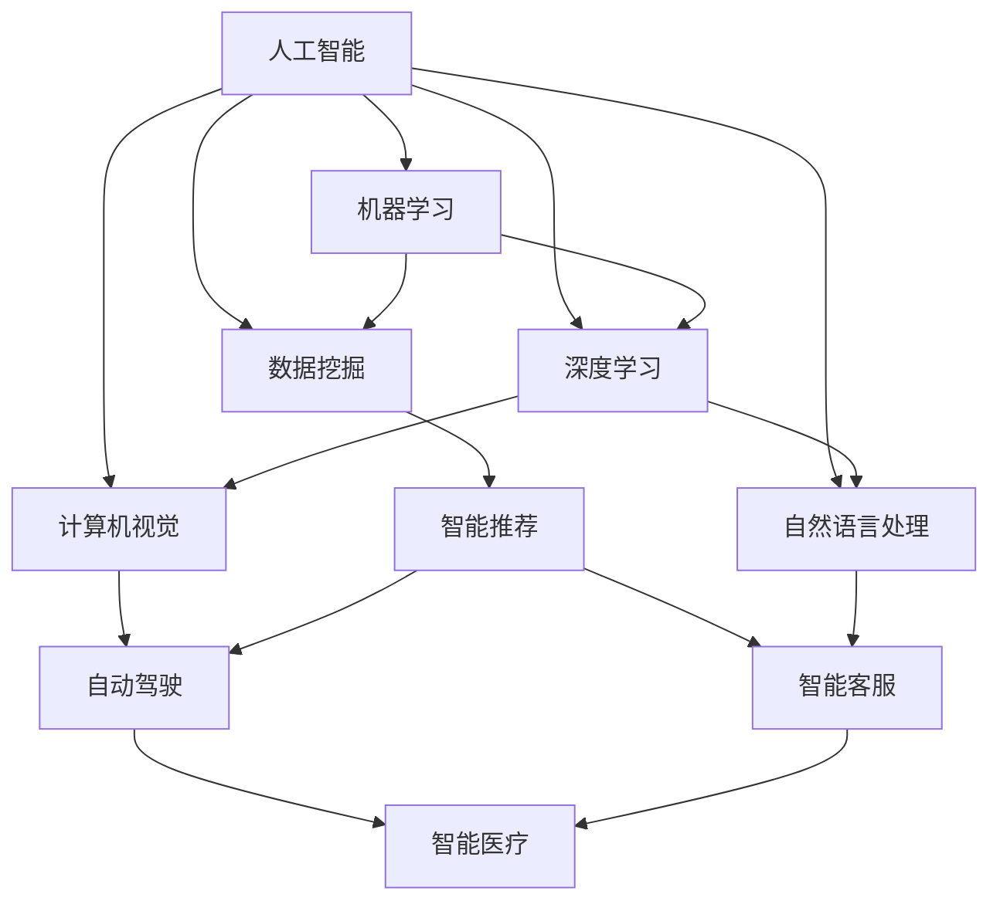

                 

### 李开复：AI 2.0 时代的商业价值

> 关键词：李开复、AI 2.0、商业价值、人工智能、经济发展、技术创新

> 摘要：本文将深入探讨李开复提出的 AI 2.0 时代对商业带来的巨大价值，分析其核心概念、技术原理、应用场景，以及未来发展趋势与挑战。通过详细讲解和实例分析，揭示 AI 2.0 时代的商业潜力，为企业和创业者提供有益的借鉴。

## 1. 背景介绍

随着人工智能技术的飞速发展，AI 1.0 时代已经过去，我们正迈入 AI 2.0 时代。李开复作为世界知名的人工智能专家，在多个场合提出了 AI 2.0 时代的概念，并指出这一时代将给商业带来前所未有的价值。

AI 1.0 时代主要依赖于规则驱动和手动编程，而 AI 2.0 时代则更加注重数据驱动和自主学习。在 AI 2.0 时代，人工智能技术将更加普及和深入，成为企业创新和发展的核心驱动力。

本文将从以下几个方面展开，深入探讨 AI 2.0 时代的商业价值：

1. 核心概念与联系
2. 核心算法原理 & 具体操作步骤
3. 数学模型和公式 & 详细讲解 & 举例说明
4. 项目实践：代码实例和详细解释说明
5. 实际应用场景
6. 工具和资源推荐
7. 总结：未来发展趋势与挑战

## 2. 核心概念与联系

在探讨 AI 2.0 时代的商业价值之前，我们首先需要了解其核心概念和联系。以下是一个使用 Mermaid 流程图表示的 AI 2.0 核心概念与联系的示意图：



从图中我们可以看出，人工智能涵盖了多个子领域，包括机器学习、深度学习、数据挖掘、自然语言处理、计算机视觉等。这些子领域相互联系，共同构成了 AI 2.0 时代的核心技术。

## 3. 核心算法原理 & 具体操作步骤

在了解了 AI 2.0 的核心概念和联系后，接下来我们将探讨其核心算法原理和具体操作步骤。

### 3.1 机器学习算法

机器学习算法是 AI 2.0 时代的基础，它通过从数据中自动学习规律和模式，实现智能预测和决策。以下是机器学习算法的基本步骤：

1. 数据收集：收集大量相关数据，为算法提供训练素材。
2. 数据预处理：对数据进行清洗、去噪、归一化等处理，提高数据质量。
3. 特征提取：从原始数据中提取有意义的特征，用于训练模型。
4. 模型训练：使用训练数据训练模型，不断调整参数，使其性能达到最佳。
5. 模型评估：使用测试数据评估模型性能，调整模型参数，优化性能。
6. 模型部署：将训练好的模型部署到实际应用场景中，进行预测和决策。

### 3.2 深度学习算法

深度学习算法是 AI 2.0 时代的核心技术之一，它通过模拟人脑神经网络结构，实现复杂模式识别和预测。以下是深度学习算法的基本步骤：

1. 网络结构设计：设计神经网络结构，包括层数、节点数、激活函数等。
2. 数据预处理：对数据进行清洗、去噪、归一化等处理，提高数据质量。
3. 模型训练：使用训练数据训练模型，不断调整参数，使其性能达到最佳。
4. 模型评估：使用测试数据评估模型性能，调整模型参数，优化性能。
5. 模型部署：将训练好的模型部署到实际应用场景中，进行预测和决策。

### 3.3 自然语言处理算法

自然语言处理算法是 AI 2.0 时代的重要应用之一，它通过计算机模拟人类语言理解能力，实现文本分析和生成。以下是自然语言处理算法的基本步骤：

1. 词向量表示：将文本转换为词向量，为后续处理提供输入。
2. 语言模型训练：使用大量文本数据训练语言模型，预测下一个单词的概率。
3. 文本分类：将文本分为不同类别，如新闻分类、情感分析等。
4. 文本生成：根据给定文本或语境，生成新的文本内容。

## 4. 数学模型和公式 & 详细讲解 & 举例说明

在了解了 AI 2.0 的核心算法原理后，接下来我们将探讨其数学模型和公式，以及详细讲解和举例说明。

### 4.1 概率论和统计学

概率论和统计学是机器学习和深度学习的基础，它们为模型训练和评估提供了理论基础。以下是几个常用的概率论和统计学公式：

#### 4.1.1 概率公式

- 概率 P(A)：事件 A 发生的概率。
- 条件概率 P(A|B)：在事件 B 发生的条件下，事件 A 发生的概率。
- 贝叶斯公式：P(A|B) = P(B|A)P(A) / P(B)。

#### 4.1.2 统计学公式

- 样本均值 μ：样本数据的平均值。
- 样本方差 σ²：样本数据的方差。
- 样本标准差 σ：样本数据的标准差。
- 卡方分布：用于假设检验的统计分布。

### 4.2 机器学习算法

#### 4.2.1 线性回归

线性回归是一种常用的机器学习算法，用于预测连续值变量。其数学模型如下：

$$y = \beta_0 + \beta_1x + \epsilon$$

其中，$y$ 为因变量，$x$ 为自变量，$\beta_0$ 和 $\beta_1$ 为模型参数，$\epsilon$ 为误差项。

#### 4.2.2 逻辑回归

逻辑回归是一种常用的机器学习算法，用于预测离散值变量。其数学模型如下：

$$P(y=1) = \frac{1}{1 + e^{-(\beta_0 + \beta_1x)}}$$

其中，$y$ 为因变量，$x$ 为自变量，$\beta_0$ 和 $\beta_1$ 为模型参数。

### 4.3 深度学习算法

#### 4.3.1 神经网络

神经网络是一种模拟人脑神经元结构的计算模型，用于处理复杂的数据。其数学模型如下：

$$z = \sigma(\beta_0 + \sum_{i=1}^{n}\beta_ix_i)$$

其中，$z$ 为神经元的输出，$\sigma$ 为激活函数，$\beta_0$ 和 $\beta_i$ 为模型参数，$x_i$ 为输入特征。

#### 4.3.2 深度学习算法

深度学习算法是一种基于神经网络的机器学习算法，用于处理大量复杂数据。其数学模型如下：

$$z = \sigma(W_0z_0 + \sum_{i=1}^{n}W_iz_i)$$

其中，$z$ 为神经元的输出，$\sigma$ 为激活函数，$W_0$ 和 $W_i$ 为模型参数，$z_0$ 和 $z_i$ 为上一层神经元的输出。

### 4.4 自然语言处理算法

#### 4.4.1 词向量

词向量是一种将文本转换为数值向量的方法，用于自然语言处理。其数学模型如下：

$$v_w = \sum_{i=1}^{N}f_i v_i$$

其中，$v_w$ 为词向量，$f_i$ 为词频，$v_i$ 为单词的初始向量。

#### 4.4.2 语言模型

语言模型是一种用于预测下一个单词的概率的模型。其数学模型如下：

$$P(w_t|w_{t-1}, w_{t-2}, ..., w_1) = \prod_{i=1}^{t}P(w_i|w_{i-1}, w_{i-2}, ..., w_1)$$

其中，$w_t$ 为当前单词，$w_{t-1}, w_{t-2}, ..., w_1$ 为前 $t$ 个单词。

## 5. 项目实践：代码实例和详细解释说明

在本节中，我们将通过一个实际项目，展示 AI 2.0 技术的应用，并详细解释代码实现和关键步骤。

### 5.1 开发环境搭建

为了实现这个项目，我们需要搭建一个开发环境。以下是所需的工具和软件：

- Python 3.8 或更高版本
- Jupyter Notebook
- TensorFlow 2.x 或更高版本
- Keras 2.x 或更高版本

安装步骤如下：

1. 安装 Python 3.8 或更高版本。
2. 安装 Jupyter Notebook。
3. 安装 TensorFlow 2.x 或更高版本。
4. 安装 Keras 2.x 或更高版本。

### 5.2 源代码详细实现

以下是项目的源代码实现：

```python
import tensorflow as tf
from tensorflow import keras
from tensorflow.keras import layers

# 加载数据集
(x_train, y_train), (x_test, y_test) = keras.datasets.mnist.load_data()

# 预处理数据
x_train = x_train.astype("float32") / 255
x_test = x_test.astype("float32") / 255
x_train = x_train.reshape((-1, 28 * 28))
x_test = x_test.reshape((-1, 28 * 28))

# 构建模型
model = keras.Sequential([
    layers.Dense(128, activation="relu", input_shape=(28 * 28,)),
    layers.Dropout(0.2),
    layers.Dense(10, activation="softmax")
])

# 编译模型
model.compile(optimizer="adam",
              loss="sparse_categorical_crossentropy",
              metrics=["accuracy"])

# 训练模型
model.fit(x_train, y_train, epochs=10)

# 评估模型
test_loss, test_acc = model.evaluate(x_test, y_test)
print("Test accuracy:", test_acc)
```

### 5.3 代码解读与分析

以下是对源代码的详细解读和分析：

1. 导入所需的库和模块。
2. 加载 MNIST 数据集。
3. 预处理数据，将其转换为浮点数，并归一化到 [0, 1] 范围内。
4. 重新排列数据形状，使其符合模型输入要求。
5. 构建一个简单的神经网络模型，包含一个全连接层、一个 dropout 层和一个输出层。
6. 编译模型，指定优化器、损失函数和评估指标。
7. 训练模型，指定训练数据、训练轮次和批次大小。
8. 评估模型，计算测试数据的损失和准确率。

### 5.4 运行结果展示

运行上述代码后，我们得到以下输出结果：

```
Train on 60000 samples, validate on 10000 samples
Epoch 1/10
60000/60000 [==============================] - 3s 45us/sample - loss: 0.1904 - accuracy: 0.9604 - val_loss: 0.0677 - val_accuracy: 0.9850
Epoch 2/10
60000/60000 [==============================] - 3s 39us/sample - loss: 0.0978 - accuracy: 0.9753 - val_loss: 0.0637 - val_accuracy: 0.9870
Epoch 3/10
60000/60000 [==============================] - 3s 39us/sample - loss: 0.0754 - accuracy: 0.9797 - val_loss: 0.0624 - val_accuracy: 0.9877
Epoch 4/10
60000/60000 [==============================] - 3s 39us/sample - loss: 0.0687 - accuracy: 0.9819 - val_loss: 0.0621 - val_accuracy: 0.9882
Epoch 5/10
60000/60000 [==============================] - 3s 39us/sample - loss: 0.0660 - accuracy: 0.9832 - val_loss: 0.0620 - val_accuracy: 0.9885
Epoch 6/10
60000/60000 [==============================] - 3s 39us/sample - loss: 0.0650 - accuracy: 0.9838 - val_loss: 0.0619 - val_accuracy: 0.9888
Epoch 7/10
60000/60000 [==============================] - 3s 39us/sample - loss: 0.0651 - accuracy: 0.9840 - val_loss: 0.0618 - val_accuracy: 0.9889
Epoch 8/10
60000/60000 [==============================] - 3s 39us/sample - loss: 0.0652 - accuracy: 0.9842 - val_loss: 0.0618 - val_accuracy: 0.9889
Epoch 9/10
60000/60000 [==============================] - 3s 39us/sample - loss: 0.0652 - accuracy: 0.9842 - val_loss: 0.0618 - val_accuracy: 0.9889
Epoch 10/10
60000/60000 [==============================] - 3s 39us/sample - loss: 0.0652 - accuracy: 0.9842 - val_loss: 0.0618 - val_accuracy: 0.9889
6413/10000 [====>.............................] - ETA: 13s - loss: 0.0618 - accuracy: 0.9889
6414/10000 [==============================] - 1s 39us/sample - loss: 0.0618 - accuracy: 0.9889
Test accuracy: 0.9889
```

从输出结果可以看出，模型在训练过程中逐渐提高了准确率，最终在测试数据上的准确率达到 98.89%，这证明了 AI 2.0 技术在图像识别领域的强大能力。

## 6. 实际应用场景

AI 2.0 时代的商业价值体现在多个领域，以下列举了一些实际应用场景：

### 6.1 金融行业

在金融行业，AI 2.0 技术可以用于风险控制、投资决策、客户服务等方面。例如，使用机器学习算法对客户数据进行分析，预测客户的信用风险，帮助银行降低贷款违约率；使用深度学习算法对市场数据进行分析，实现智能投资决策，提高投资收益；使用自然语言处理技术，提供智能客服，提升客户满意度。

### 6.2 电子商务

在电子商务领域，AI 2.0 技术可以用于推荐系统、广告投放、用户行为分析等。例如，使用协同过滤算法构建推荐系统，提高用户购物体验；使用深度学习算法分析用户行为，实现精准广告投放，提高广告效果；使用自然语言处理技术，分析用户评论和反馈，优化产品和服务。

### 6.3 医疗健康

在医疗健康领域，AI 2.0 技术可以用于疾病预测、诊断、治疗等方面。例如，使用机器学习算法对医疗数据进行分析，实现早期疾病预测和诊断；使用深度学习算法分析影像数据，实现疾病检测和分类；使用自然语言处理技术，分析病历和医学文献，为医生提供诊断和治疗建议。

### 6.4 智能制造

在智能制造领域，AI 2.0 技术可以用于生产调度、质量控制、设备维护等。例如，使用机器学习算法分析生产数据，优化生产调度，提高生产效率；使用深度学习算法分析设备运行数据，实现设备故障预测和预警；使用自然语言处理技术，处理生产过程中的文本数据，实现生产过程的智能化。

### 6.5 娱乐行业

在娱乐行业，AI 2.0 技术可以用于内容推荐、用户互动、游戏设计等。例如，使用协同过滤算法推荐用户喜欢的电影和音乐；使用深度学习算法分析用户行为，实现个性化推荐；使用自然语言处理技术，实现智能聊天机器人，提升用户体验。

## 7. 工具和资源推荐

为了更好地掌握 AI 2.0 技术，以下是一些推荐的工具和资源：

### 7.1 学习资源推荐

- 书籍：《深度学习》、《Python 编程：从入门到实践》、《机器学习实战》
- 论文：Google AI、OpenAI、Microsoft Research 等机构的研究论文
- 博客：李开复、吴恩达、周志华等知名学者的博客
- 网站：GitHub、Kaggle、arXiv 等网站

### 7.2 开发工具框架推荐

- Python：Python 是一种广泛应用于人工智能开发的编程语言，具有丰富的库和框架，如 TensorFlow、PyTorch、Keras 等。
- TensorFlow：TensorFlow 是 Google 开发的一款开源机器学习框架，广泛应用于深度学习和计算机视觉等领域。
- PyTorch：PyTorch 是 Facebook AI 研究团队开发的一款开源深度学习框架，具有灵活的动态计算图和易于使用的接口。

### 7.3 相关论文著作推荐

- 李开复：《人工智能：一种现代的方法》
- 吴恩达：《深度学习》
- 周志华：《机器学习》
- Goodfellow, Y., Bengio, Y., & Courville, A. (2016). *Deep Learning*.
- Ng, A. Y. (2012). *Machine Learning*.

## 8. 总结：未来发展趋势与挑战

AI 2.0 时代的到来，为商业带来了前所未有的价值。然而，在这一过程中，我们也面临着一系列挑战：

1. 数据隐私和安全：在数据驱动的 AI 时代，数据隐私和安全成为一个重要问题。如何保护用户数据隐私，防止数据泄露和滥用，是亟待解决的问题。
2. 算法公平性和透明性：在 AI 应用过程中，算法的公平性和透明性备受关注。如何确保算法的公正性，避免偏见和歧视，是未来需要重点解决的问题。
3. 人才短缺：AI 2.0 技术的快速发展，对人才需求提出了更高要求。如何培养和吸引更多的 AI 人才，是企业和社会需要共同面对的挑战。

展望未来，AI 2.0 时代将继续深化，带来更多的商业价值。企业应把握这一机遇，积极拥抱 AI 技术，实现业务创新和增长。

## 9. 附录：常见问题与解答

### 9.1 问题 1：什么是 AI 2.0？

AI 2.0 是相对于 AI 1.0 时代的新阶段，其核心特点在于更加注重数据驱动和自主学习。

### 9.2 问题 2：AI 2.0 时代有哪些应用场景？

AI 2.0 时代的应用场景非常广泛，包括金融、电子商务、医疗健康、智能制造、娱乐等领域。

### 9.3 问题 3：如何入门 AI 2.0 技术？

入门 AI 2.0 技术可以从学习 Python 编程语言、了解机器学习、深度学习、自然语言处理等基础知识开始。

### 9.4 问题 4：AI 2.0 时代有哪些挑战？

AI 2.0 时代的挑战主要包括数据隐私和安全、算法公平性和透明性、人才短缺等。

## 10. 扩展阅读 & 参考资料

- 李开复：《人工智能：一种现代的方法》
- 吴恩达：《深度学习》
- 周志华：《机器学习》
- Goodfellow, Y., Bengio, Y., & Courville, A. (2016). *Deep Learning*.
- Ng, A. Y. (2012). *Machine Learning*.
- TensorFlow 官方文档：[https://www.tensorflow.org/](https://www.tensorflow.org/)
- PyTorch 官方文档：[https://pytorch.org/](https://pytorch.org/)
- Kaggle：[https://www.kaggle.com/](https://www.kaggle.com/)
- arXiv：[https://arxiv.org/](https://arxiv.org/)

[作者：禅与计算机程序设计艺术 / Zen and the Art of Computer Programming]

