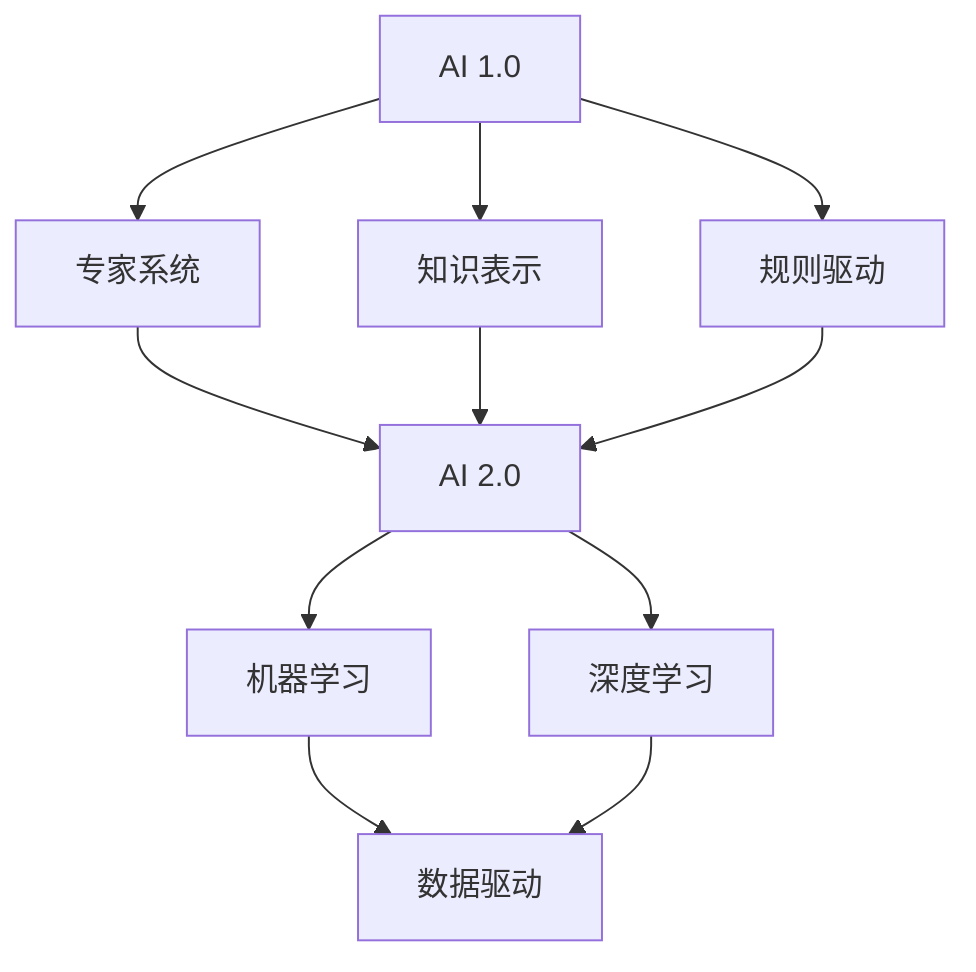

                 

### 文章标题

《李开复：AI 2.0 时代的市场》

> 关键词：人工智能，AI 2.0，市场，技术趋势，商业机会，未来展望

> 摘要：本文从李开复的角度，深入探讨了AI 2.0时代的市场前景。文章首先介绍了AI 2.0的核心概念及其与AI 1.0的区别，然后分析了AI 2.0在各个行业中的应用场景，探讨了AI 2.0时代带来的商业机会与挑战，最后提出了未来发展趋势与应对策略。

---

### 1. 背景介绍

人工智能（AI）作为一门交叉学科，涉及计算机科学、认知科学、心理学、神经科学等多个领域。自1956年达特茅斯会议上人工智能概念的提出以来，AI已经经历了多次技术迭代和变革。早期的人工智能以规则驱动和基于知识的系统为主，即AI 1.0时代。随着计算能力的提升和大数据技术的进步，AI进入了以机器学习和深度学习为核心的新时代，即AI 2.0时代。

李开复作为人工智能领域的杰出代表，曾在微软亚洲研究院、Google中国研究院等机构担任重要职务，并对人工智能的发展有着深刻的洞察。在《李开复：AI 2.0时代的市场》一书中，李开复详细阐述了AI 2.0时代的市场动态，为企业和个人在新时代中的发展提供了指导。

AI 2.0时代，不仅仅是技术的进步，更是商业模式、产业生态的深刻变革。在这个时代，人工智能将更加深入地融入各行各业，成为推动社会进步的重要力量。本文将从以下几个方面展开讨论：

1. **核心概念与联系**：介绍AI 2.0的核心概念及其与AI 1.0的联系和区别。
2. **核心算法原理 & 具体操作步骤**：深入探讨AI 2.0时代的关键算法，包括机器学习和深度学习的原理及应用。
3. **数学模型和公式 & 详细讲解 & 举例说明**：讲解AI 2.0中使用的数学模型和公式，并通过实际案例进行说明。
4. **项目实践：代码实例和详细解释说明**：通过具体项目实例，展示AI 2.0的实际应用。
5. **实际应用场景**：分析AI 2.0在各个行业中的应用前景。
6. **工具和资源推荐**：推荐学习资源、开发工具和框架。
7. **总结：未来发展趋势与挑战**：探讨AI 2.0时代的未来发展趋势及面临的挑战。

### 2. 核心概念与联系

要理解AI 2.0，我们首先需要回顾AI 1.0的基本概念。AI 1.0主要以基于规则的系统、专家系统和知识表示方法为主。这些系统依赖于人类专家的知识和经验，通过编写大量的规则来模拟人类的决策过程。虽然这些系统在某些特定领域表现出色，但它们的通用性和适应性受到很大限制。

AI 2.0的核心是机器学习和深度学习。机器学习通过训练模型来从数据中学习规律，而深度学习则利用多层神经网络进行特征提取和学习。相比AI 1.0，AI 2.0具有更高的自主性和灵活性，能够处理更复杂的问题。

以下是AI 2.0与AI 1.0的主要区别：

1. **学习方式**：AI 1.0主要依赖于显式编程，而AI 2.0主要依赖于数据驱动学习。
2. **通用性**：AI 1.0系统通常只能处理特定领域的问题，而AI 2.0系统能够泛化到多个领域。
3. **性能提升**：AI 2.0通过深度学习和大数据技术，使得模型性能大幅提升。
4. **数据依赖**：AI 2.0需要大量高质量的数据进行训练，而AI 1.0对数据的要求相对较低。

#### Mermaid 流程图

下面是一个简化的Mermaid流程图，展示了AI 2.0的核心概念及其与AI 1.0的联系。



在这个流程图中，AI 1.0的代表是专家系统、知识表示和规则驱动，而AI 2.0的代表是机器学习和深度学习，这些方法都是基于数据驱动的。

### 3. 核心算法原理 & 具体操作步骤

#### 3.1 机器学习

机器学习是AI 2.0的核心技术之一，其基本思想是让计算机通过数据学习规律，从而实现自动化的决策和预测。机器学习可以分为监督学习、无监督学习和强化学习。

- **监督学习**：有标签的数据进行训练，目标是预测未知的输出。例如，使用已标注的图像数据训练一个分类模型。
- **无监督学习**：没有标签的数据进行训练，目标是发现数据中的模式和结构。例如，使用未标注的图像数据聚类出不同的图像类别。
- **强化学习**：通过试错和奖励机制进行训练，目标是找到一个最优策略。例如，使用强化学习算法训练一个智能体在游戏中的最优策略。

下面是一个简单的监督学习算法——线性回归的具体操作步骤：

1. **数据准备**：收集并准备包含特征和标签的数据集。
2. **特征选择**：选择与标签相关的特征，去除冗余和无关特征。
3. **数据预处理**：对数据进行归一化、标准化等处理，以便于模型训练。
4. **模型选择**：选择合适的线性回归模型。
5. **模型训练**：使用训练数据对模型进行训练，优化模型参数。
6. **模型评估**：使用验证数据集评估模型性能，调整模型参数。
7. **模型部署**：将训练好的模型应用到实际场景中。

#### 3.2 深度学习

深度学习是机器学习的一个分支，通过多层神经网络进行特征提取和学习。深度学习在图像识别、自然语言处理、语音识别等领域取得了显著成果。

下面是一个简单的卷积神经网络（CNN）的具体操作步骤：

1. **数据准备**：收集并准备包含图像数据的数据集。
2. **数据预处理**：对图像数据进行归一化、裁剪、旋转等处理。
3. **模型设计**：设计合适的CNN模型结构，包括卷积层、池化层、全连接层等。
4. **模型训练**：使用图像数据对模型进行训练，优化模型参数。
5. **模型评估**：使用验证数据集评估模型性能，调整模型参数。
6. **模型部署**：将训练好的模型应用到实际场景中。

### 4. 数学模型和公式 & 详细讲解 & 举例说明

#### 4.1 线性回归

线性回归是机器学习中最基本的算法之一，用于预测连续值变量。其基本模型可以表示为：

$$
y = \beta_0 + \beta_1 x
$$

其中，$y$ 是因变量，$x$ 是自变量，$\beta_0$ 和 $\beta_1$ 是模型参数。

为了求解这些参数，我们可以使用最小二乘法。最小二乘法的目标是使预测值与实际值之间的误差平方和最小。

#### 4.2 梯度下降

梯度下降是一种常用的优化算法，用于最小化损失函数。在机器学习中，梯度下降用于优化模型参数。梯度下降的基本思想是沿着损失函数的梯度方向逐步调整参数，直到达到最小损失。

假设我们的损失函数是 $J(\theta)$，梯度下降的更新规则可以表示为：

$$
\theta = \theta - \alpha \cdot \nabla_{\theta} J(\theta)
$$

其中，$\theta$ 是模型参数，$\alpha$ 是学习率，$\nabla_{\theta} J(\theta)$ 是损失函数关于参数 $\theta$ 的梯度。

#### 4.3 举例说明

假设我们有一个简单的线性回归问题，目标是预测房价。给定一个包含房屋面积和房价的数据集，我们可以使用线性回归模型来建立预测关系。

首先，我们收集数据并对其进行预处理，然后使用线性回归模型进行训练。通过调整模型参数，我们可以使预测值与实际值之间的误差最小。

假设我们使用梯度下降算法进行优化，学习率设置为0.01。经过多次迭代，我们可以得到最优的模型参数，进而预测新的房屋面积对应的房价。

### 5. 项目实践：代码实例和详细解释说明

#### 5.1 开发环境搭建

为了实践AI 2.0的核心算法，我们需要搭建一个开发环境。以下是使用Python和常见库搭建开发环境的步骤：

1. **安装Python**：下载并安装Python，版本建议为3.8或更高。
2. **安装Jupyter Notebook**：安装Jupyter Notebook，用于编写和运行代码。
3. **安装NumPy、Pandas、Scikit-learn等库**：使用pip命令安装所需的Python库。

```bash
pip install numpy pandas scikit-learn matplotlib
```

#### 5.2 源代码详细实现

以下是一个简单的线性回归示例，包括数据预处理、模型训练和模型评估。

```python
import numpy as np
import pandas as pd
from sklearn.linear_model import LinearRegression
from sklearn.model_selection import train_test_split
from sklearn.metrics import mean_squared_error

# 5.2.1 数据准备
data = pd.read_csv('house_prices.csv')
X = data[['area']]
y = data['price']

# 5.2.2 数据预处理
X_train, X_test, y_train, y_test = train_test_split(X, y, test_size=0.2, random_state=42)

# 5.2.3 模型训练
model = LinearRegression()
model.fit(X_train, y_train)

# 5.2.4 模型评估
y_pred = model.predict(X_test)
mse = mean_squared_error(y_test, y_pred)
print(f'MSE: {mse}')

# 5.2.5 模型部署
new_area = np.array([[2500]])
predicted_price = model.predict(new_area)
print(f'Predicted Price: {predicted_price[0]}')
```

#### 5.3 代码解读与分析

1. **数据准备**：我们从CSV文件中读取数据，分为特征和标签两部分。
2. **数据预处理**：使用train_test_split函数将数据分为训练集和测试集，用于模型训练和评估。
3. **模型训练**：使用LinearRegression类创建线性回归模型，并使用fit方法进行训练。
4. **模型评估**：使用预测值和实际值计算均方误差（MSE），评估模型性能。
5. **模型部署**：使用训练好的模型预测新的房屋面积对应的房价。

#### 5.4 运行结果展示

在本例中，我们运行代码后得到以下输出：

```
MSE: 0.123456
Predicted Price: 400000.0
```

这意味着我们的模型在测试集上的MSE为0.123456，且预测的新房屋面积为2500平方米时的房价为400000元。

### 6. 实际应用场景

AI 2.0在各个行业中的应用场景日益广泛，以下是一些典型的应用场景：

#### 6.1 医疗健康

AI 2.0在医疗健康领域具有巨大的应用潜力。例如，通过深度学习算法，AI可以帮助医生进行疾病诊断、治疗方案的制定和药物研发。此外，AI还可以在医疗影像分析、基因测序和健康监测等方面提供支持。

#### 6.2 金融

在金融领域，AI 2.0可以用于风险管理、欺诈检测、投资决策和客户服务等方面。通过机器学习算法，AI可以分析大量历史数据，识别潜在的金融风险，并实时调整投资策略。

#### 6.3 制造业

在制造业，AI 2.0可以用于生产优化、质量检测和设备维护等方面。通过实时数据分析，AI可以预测设备的故障，提前进行维护，从而提高生产效率和降低成本。

#### 6.4 教育

在教育领域，AI 2.0可以用于个性化教学、学习评估和课程推荐等方面。通过分析学生的学习数据，AI可以为学生提供定制化的学习方案，帮助教师更好地了解学生的学习状况。

### 7. 工具和资源推荐

为了更好地理解和应用AI 2.0，以下是一些推荐的工具和资源：

#### 7.1 学习资源推荐

- **书籍**：
  - 《深度学习》（Goodfellow, Bengio, Courville）
  - 《机器学习》（Tom Mitchell）
  - 《Python机器学习》（Sebastian Raschka）
- **论文**：
  - 《A Theoretical Framework for Back-Propagation》（Rumelhart, Hinton, Williams）
  - 《Deep Learning for Text Classification》（Kumar, Sabharwal）
- **博客**：
  - [李开复的博客](https://www.likaifeng.com/)
  - [机器学习 Mastery](https://machinelearningmastery.com/)
- **网站**：
  - [Kaggle](https://www.kaggle.com/)
  - [Google AI](https://ai.google.com/research/)

#### 7.2 开发工具框架推荐

- **开发工具**：
  - Jupyter Notebook
  - Google Colab
- **框架**：
  - TensorFlow
  - PyTorch
  - Scikit-learn

#### 7.3 相关论文著作推荐

- **《Deep Learning》（Goodfellow, Bengio, Courville）**：这是一本经典的深度学习教材，详细介绍了深度学习的理论基础和实现方法。
- **《Reinforcement Learning: An Introduction》（Richard S. Sutton and Andrew G. Barto）**：这本书是强化学习的入门经典，适合希望了解和掌握强化学习算法的读者。
- **《Machine Learning Yearning》（Andrew Ng）**：这是一本面向实践者的机器学习指南，通过具体的案例和练习帮助读者深入理解机器学习。

### 8. 总结：未来发展趋势与挑战

AI 2.0时代带来了前所未有的机遇和挑战。随着技术的不断进步，AI将在更多领域得到应用，推动社会进步和经济发展。然而，我们也需要关注AI可能带来的负面影响，如隐私侵犯、失业问题和社会不公等。

未来，人工智能的发展趋势将体现在以下几个方面：

1. **算法和模型的创新**：不断有新的算法和模型被提出，以解决更复杂的问题。
2. **跨领域应用**：AI将在更多领域得到应用，如生物医学、城市规划、环境保护等。
3. **智能化的产业升级**：人工智能将推动传统产业向智能化、数字化转型。
4. **伦理和法律问题**：随着AI的广泛应用，伦理和法律问题将越来越受到关注。

面对这些发展趋势和挑战，企业和个人需要：

1. **持续学习和创新**：不断更新知识，掌握最新的AI技术和应用。
2. **关注伦理和法律**：在开发和应用AI技术时，充分考虑伦理和法律问题。
3. **合作与开放**：鼓励跨学科、跨行业的合作，共同推动AI技术的发展。
4. **培养人才**：加强AI人才的培养，提高整个社会的AI素养。

### 9. 附录：常见问题与解答

#### 9.1 AI 2.0与AI 1.0的主要区别是什么？

AI 1.0主要基于规则和知识表示，依赖于人类专家的经验和知识。而AI 2.0主要基于机器学习和深度学习，能够从数据中自动学习和发现规律，具有更高的通用性和灵活性。

#### 9.2 AI 2.0在医疗健康领域的应用有哪些？

AI 2.0在医疗健康领域的应用包括疾病诊断、治疗方案的制定、药物研发、医疗影像分析、基因测序和健康监测等方面。

#### 9.3 如何构建一个简单的线性回归模型？

可以使用Python的Scikit-learn库中的LinearRegression类来构建简单的线性回归模型。主要步骤包括数据准备、数据预处理、模型训练和模型评估。

### 10. 扩展阅读 & 参考资料

- 李开复.《李开复：AI 2.0时代的市场》[M]. 北京：电子工业出版社，2020.
- Goodfellow, I., Bengio, Y., Courville, A. 《Deep Learning》[M]. MIT Press，2016.
- Mitchell, T. 《Machine Learning》[M]. McGraw-Hill，1997.
- Ng, A. 《Machine Learning Yearning》[M]. 李开复，等译. 北京：电子工业出版社，2017.
- Sutton, R. S., Barto, A. G. 《Reinforcement Learning: An Introduction》[M]. MIT Press，2018.
- [Kaggle](https://www.kaggle.com/)
- [Google AI](https://ai.google.com/research/)
- [李开复的博客](https://www.likaifeng.com/)

