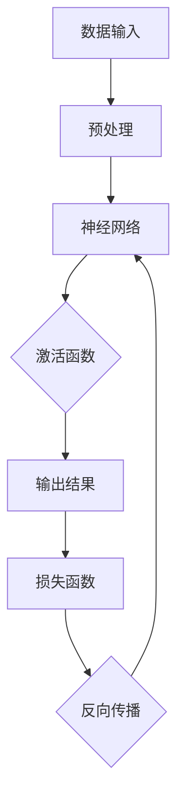
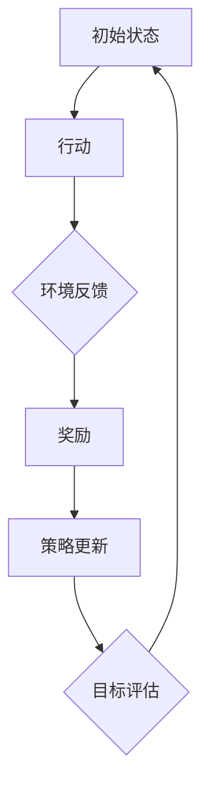
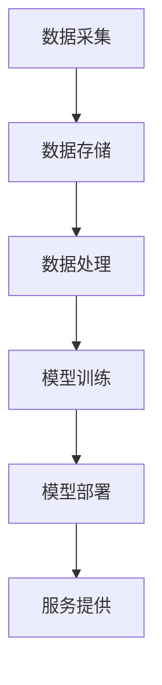
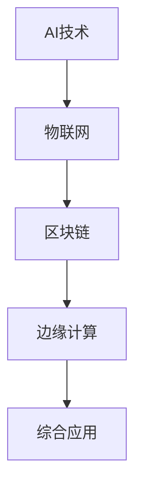
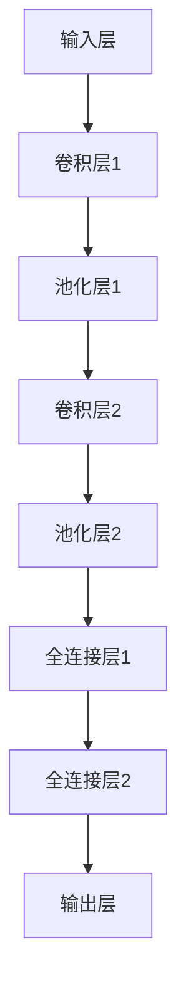

                 

### 文章标题

《李开复：AI 2.0 时代的市场》

> 关键词：人工智能、AI 2.0、市场、未来发展趋势、技术应用、产业变革

> 摘要：本文深入探讨人工智能（AI）2.0时代的市场趋势和变革，分析其核心技术、应用场景以及未来发展挑战，旨在为读者提供全面、详实的AI产业观察与预测。

### 1. 背景介绍

人工智能（AI）作为21世纪最具影响力的技术之一，已经从实验室走向商业应用，深刻改变了我们的生活和工作方式。传统的人工智能，即AI 1.0时代，主要依赖于规则和符号计算，其代表性技术包括专家系统和机器学习中的监督学习。然而，随着数据量的爆炸性增长和计算能力的提升，AI技术进入了新的发展阶段，即AI 2.0时代。

AI 2.0时代的核心特征包括以下几个方面：

1. **深度学习**：基于神经网络架构，尤其是深度神经网络的进步，使得AI在图像识别、语音识别和自然语言处理等领域的表现超越了人类。

2. **强化学习**：通过与环境交互，不断调整策略，实现自我优化，已在游戏、机器人控制和自动驾驶等领域取得了显著成果。

3. **大数据与云计算**：数据是AI发展的基础，云计算提供了强大的计算资源和数据存储能力，推动了AI技术的广泛应用。

4. **跨领域融合**：AI技术逐渐与物联网、区块链、边缘计算等新兴技术相结合，催生了更多创新应用。

### 2. 核心概念与联系

为了深入理解AI 2.0时代，我们首先需要明确几个核心概念，并分析它们之间的联系。

#### 2.1 深度学习

深度学习是一种基于多层神经网络的人工智能方法，通过模仿人脑神经网络的结构和工作原理，实现对复杂数据的自动特征提取和模式识别。

**Mermaid 流程图：**



#### 2.2 强化学习

强化学习通过奖励机制，让AI模型在动态环境中不断学习优化策略，达到长期目标。

**Mermaid 流程图：**



#### 2.3 大数据与云计算

大数据与云计算为AI提供了海量数据和强大的计算能力，使得复杂模型的训练和部署成为可能。

**Mermaid 流程图：**



#### 2.4 跨领域融合

AI与其他技术的融合，如物联网、区块链和边缘计算，进一步拓宽了AI的应用范围，提升了AI系统的智能化水平。

**Mermaid 流程图：**



### 3. 核心算法原理 & 具体操作步骤

在AI 2.0时代，深度学习和强化学习是两个核心算法，它们各自有着独特的原理和操作步骤。

#### 3.1 深度学习

深度学习的核心是构建和训练多层神经网络。以下是具体操作步骤：

1. **数据预处理**：对输入数据进行标准化处理，确保数据分布均匀，提高模型训练效果。

2. **构建网络结构**：设计多层神经网络，包括输入层、隐藏层和输出层。

3. **初始化参数**：随机初始化网络的权重和偏置。

4. **前向传播**：将输入数据通过网络层进行传递，计算输出结果。

5. **计算损失**：使用损失函数（如均方误差）计算预测结果与真实结果之间的差距。

6. **反向传播**：利用梯度下降算法更新网络权重和偏置，减小损失函数。

7. **迭代训练**：重复以上步骤，直到模型收敛或达到预设的训练次数。

#### 3.2 强化学习

强化学习的核心是策略优化，以下是具体操作步骤：

1. **定义环境**：确定AI模型操作的动态环境。

2. **定义状态空间和动作空间**：确定环境中的状态和可执行动作。

3. **选择策略**：根据当前状态，选择最优动作。

4. **执行动作**：在环境中执行所选动作，并获得奖励。

5. **更新策略**：根据奖励信号，调整策略参数。

6. **重复迭代**：重复以上步骤，不断优化策略。

### 4. 数学模型和公式 & 详细讲解 & 举例说明

在AI 2.0时代，数学模型在深度学习和强化学习中扮演着至关重要的角色。以下是两个核心算法的数学模型和公式。

#### 4.1 深度学习

深度学习的数学模型主要涉及前向传播和反向传播。

1. **前向传播公式**：

$$
\hat{y} = \sigma(W_L \cdot a^{L-1} + b_L)
$$

其中，$\hat{y}$为预测结果，$\sigma$为激活函数，$W_L$为权重矩阵，$a^{L-1}$为输入层到隐藏层的激活值，$b_L$为偏置。

2. **反向传播公式**：

$$
\frac{\partial J}{\partial W_L} = \frac{\partial L}{\partial a_L} \cdot \frac{\partial a_L}{\partial z_L}
$$

$$
\frac{\partial J}{\partial b_L} = \frac{\partial L}{\partial a_L}
$$

其中，$J$为损失函数，$L$为损失值，$a_L$为隐藏层的激活值，$z_L$为隐藏层的输出值。

#### 4.2 强化学习

强化学习的数学模型主要涉及策略优化和值函数。

1. **策略优化公式**：

$$
\pi(\text{a}|\text{s}) = \frac{\exp(\alpha \cdot R)}{\sum_{\text{a}'} \exp(\alpha \cdot R')}
$$

其中，$\pi$为策略，$\text{a}$为动作，$\text{s}$为状态，$R$为奖励值，$R'$为其他动作的奖励值，$\alpha$为温度参数。

2. **值函数公式**：

$$
V^{\pi}(\text{s}) = \sum_{\text{a}} \pi(\text{a}|\text{s}) \cdot \sum_{\text{s'} \in S} P(\text{s'}|\text{a},\text{s}) \cdot R(\text{s'},\text{a})
$$

其中，$V^{\pi}$为值函数，$S$为状态空间。

#### 4.3 举例说明

假设我们使用深度学习模型进行图像分类，输入数据为一张图片，输出为标签。以下是具体步骤：

1. **数据预处理**：对图片进行归一化处理，使其符合网络输入要求。

2. **构建网络结构**：设计一个包含多个隐藏层的卷积神经网络，如图所示。



3. **初始化参数**：随机初始化网络权重和偏置。

4. **前向传播**：将图片输入网络，计算输出结果。

5. **计算损失**：使用交叉熵损失函数计算预测结果与真实标签之间的差距。

6. **反向传播**：利用梯度下降算法更新网络权重和偏置。

7. **迭代训练**：重复以上步骤，直到模型收敛。

### 5. 项目实践：代码实例和详细解释说明

在本节中，我们将通过一个具体的深度学习项目实例，展示如何使用Python实现一个简单的图像分类模型，并对代码进行详细解释。

#### 5.1 开发环境搭建

在开始项目之前，我们需要搭建一个合适的开发环境。以下是Python环境搭建的步骤：

1. 安装Python 3.7或更高版本。
2. 安装PyTorch深度学习框架。
3. 安装其他必需的Python库，如NumPy、Pandas等。

#### 5.2 源代码详细实现

以下是一个简单的图像分类模型的Python代码实现：

```python
import torch
import torch.nn as nn
import torchvision.transforms as transforms
import torchvision.datasets as datasets

# 定义卷积神经网络
class ConvNet(nn.Module):
    def __init__(self):
        super(ConvNet, self).__init__()
        self.conv1 = nn.Conv2d(3, 32, 5)
        self.pool = nn.MaxPool2d(2, 2)
        self.conv2 = nn.Conv2d(32, 64, 5)
        self.fc1 = nn.Linear(64 * 4 * 4, 1024)
        self.fc2 = nn.Linear(1024, 10)
        self.dropout = nn.Dropout(0.5)

    def forward(self, x):
        x = self.pool(F.relu(self.conv1(x)))
        x = self.pool(F.relu(self.conv2(x)))
        x = x.view(-1, 64 * 4 * 4)
        x = self.dropout(F.relu(self.fc1(x)))
        x = self.fc2(x)
        return x

# 实例化模型、损失函数和优化器
model = ConvNet()
criterion = nn.CrossEntropyLoss()
optimizer = torch.optim.Adam(model.parameters(), lr=0.001)

# 加载数据集
train_dataset = datasets.ImageFolder('train', transform=transforms.ToTensor())
train_loader = torch.utils.data.DataLoader(train_dataset, batch_size=32, shuffle=True)

# 训练模型
for epoch in range(10):  # 少于训练次数，仅用于演示
    running_loss = 0.0
    for inputs, labels in train_loader:
        optimizer.zero_grad()
        outputs = model(inputs)
        loss = criterion(outputs, labels)
        loss.backward()
        optimizer.step()
        running_loss += loss.item()
    print(f'Epoch {epoch+1}, Loss: {running_loss/len(train_loader)}')

# 保存模型
torch.save(model.state_dict(), 'model.pth')

# 测试模型
model.eval()
with torch.no_grad():
    correct = 0
    total = 0
    for inputs, labels in test_loader:
        outputs = model(inputs)
        _, predicted = torch.max(outputs.data, 1)
        total += labels.size(0)
        correct += (predicted == labels).sum().item()
print(f'Accuracy: {100 * correct / total}%')
```

#### 5.3 代码解读与分析

1. **模型定义**：我们定义了一个简单的卷积神经网络（ConvNet），包含两个卷积层、一个池化层、两个全连接层和一个dropout层。

2. **前向传播**：在forward方法中，我们实现了前向传播过程，包括卷积操作、激活函数、池化操作、全连接层和dropout操作。

3. **损失函数和优化器**：我们选择了交叉熵损失函数（CrossEntropyLoss）和Adam优化器（Adam）来训练模型。

4. **数据加载**：我们使用 torchvision.datasets 加载训练集和测试集，并将图片数据进行归一化处理。

5. **模型训练**：在训练过程中，我们通过梯度下降算法更新模型参数，并计算每个epoch的平均损失。

6. **模型保存与测试**：训练完成后，我们将模型参数保存到文件中，并使用测试集对模型进行评估，计算准确率。

### 6. 实际应用场景

AI 2.0技术在各个行业都有广泛的应用，以下是几个典型的实际应用场景：

#### 6.1 人工智能与金融

在金融领域，AI 2.0技术被广泛应用于风险控制、量化交易、信用评分和智能投顾等方面。例如，银行可以通过AI模型对客户进行信用评估，提高贷款审批效率；保险公司可以利用AI进行风险评估和理赔预测，降低运营成本。

#### 6.2 人工智能与医疗

在医疗领域，AI 2.0技术可以辅助医生进行疾病诊断、手术规划和药物研发。例如，通过深度学习模型对医学影像进行分析，可以帮助医生快速发现病灶；通过强化学习模型优化手术方案，可以提高手术成功率。

#### 6.3 人工智能与制造业

在制造业中，AI 2.0技术被广泛应用于生产优化、质量管理、设备维护等方面。例如，通过AI模型对生产数据进行分析，可以帮助企业实现智能化生产，提高生产效率；通过机器学习模型对产品质量进行预测，可以提前发现潜在问题，降低不良品率。

### 7. 工具和资源推荐

为了更好地掌握AI 2.0技术，以下是几个推荐的学习资源和开发工具：

#### 7.1 学习资源推荐

1. **书籍**：
   - 《深度学习》（Ian Goodfellow、Yoshua Bengio、Aaron Courville著）
   - 《强化学习》（Richard S. Sutton、Andrew G. Barto著）
   - 《Python深度学习》（François Chollet著）

2. **论文**：
   - “A Theoretical Framework for Back-Propagation” （1986，Rumelhart, Hinton, Williams）
   - “Reinforcement Learning: An Introduction” （2018，Richard S. Sutton、Andrew G. Barto）

3. **博客**：
   - PyTorch官方博客（pytorch.org/blog）
   - AI研习社（aiyanxi.com）

4. **网站**：
   - Kaggle（kaggle.com）
   - Coursera（coursera.org）

#### 7.2 开发工具框架推荐

1. **深度学习框架**：
   - PyTorch
   - TensorFlow
   - Keras

2. **机器学习库**：
   - Scikit-learn
   - Pandas
   - NumPy

3. **版本控制工具**：
   - Git
   - GitHub

4. **集成开发环境**：
   - PyCharm
   - Visual Studio Code

### 8. 总结：未来发展趋势与挑战

AI 2.0时代已经到来，其核心技术和应用场景不断扩展，对各行各业产生了深远影响。在未来，我们可以预见以下几个发展趋势：

1. **AI技术将进一步融入各行各业**：随着AI技术的成熟和应用场景的拓展，越来越多的行业将受益于AI技术，实现智能化升级。

2. **跨领域融合将催生更多创新应用**：AI与其他技术的融合，如物联网、区块链和边缘计算，将带来更多创新应用，推动社会进步。

3. **算法创新和计算能力提升**：随着算法的不断创新和计算能力的提升，AI模型将更加复杂、高效，实现更高层次的智能化。

然而，AI 2.0时代也面临一系列挑战：

1. **数据隐私和安全问题**：随着AI技术的广泛应用，数据隐私和安全问题日益凸显，需要加强法律法规和伦理规范。

2. **算法公平性和透明性**：AI模型在决策过程中可能存在歧视性倾向，需要确保算法的公平性和透明性。

3. **人才短缺**：随着AI技术的发展，对专业人才的需求不断增长，但现有人才储备难以满足需求，需要加强人才培养和引进。

### 9. 附录：常见问题与解答

**Q1：什么是深度学习？**
深度学习是一种基于多层神经网络的人工智能方法，通过模仿人脑神经网络的结构和工作原理，实现对复杂数据的自动特征提取和模式识别。

**Q2：什么是强化学习？**
强化学习是一种基于奖励机制的人工智能方法，通过与环境交互，不断学习优化策略，达到长期目标。

**Q3：如何搭建Python开发环境？**
安装Python 3.7或更高版本，安装PyTorch深度学习框架，安装其他必需的Python库，如NumPy、Pandas等。

**Q4：如何训练深度学习模型？**
构建网络结构，初始化参数，前向传播，计算损失，反向传播，迭代训练，直到模型收敛。

### 10. 扩展阅读 & 参考资料

1. Goodfellow, I., Bengio, Y., & Courville, A. (2016). *Deep Learning*. MIT Press.
2. Sutton, R. S., & Barto, A. G. (2018). *Reinforcement Learning: An Introduction*. MIT Press.
3. Rumelhart, D. E., Hinton, G. E., & Williams, R. J. (1986). *A Theoretical Framework for Back-Propagation*. In *Nature*.
4. Chollet, F. (2017). *Python Deep Learning*. Packt Publishing.
5. AI研习社. (2020). *深度学习实践*. 人民邮电出版社.
6. Kaggle. (2020). *Kaggle Competitions*. kaggle.com.
7. Coursera. (2020). *Deep Learning Specialization*. coursera.org.

### 作者署名

本文作者：禅与计算机程序设计艺术 / Zen and the Art of Computer Programming。感谢您的阅读，希望本文能为您在AI 2.0时代的技术探索之旅提供有益的参考。

