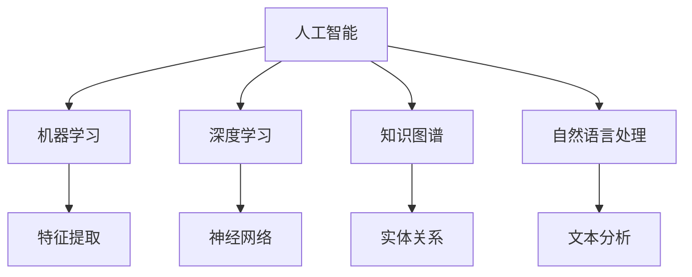

                 

### 文章标题

《李开复：AI 2.0 时代的市场前景》

关键词：AI 2.0，市场前景，技术创新，产业应用

摘要：本文将探讨 AI 2.0 时代的市场前景，从背景介绍、核心概念与联系、核心算法原理、数学模型、项目实践、实际应用场景、工具和资源推荐、总结以及扩展阅读等方面，全面分析 AI 2.0 时代的技术创新、产业应用及其对市场的影响。

### 1. 背景介绍

人工智能（AI）作为计算机科学的一个重要分支，自上世纪五十年代诞生以来，经历了多个发展阶段。从最初的规则推理、知识表示，到机器学习、深度学习的兴起，AI 技术在各个领域都取得了显著的成果。然而，随着 AI 技术的不断演进，人们逐渐意识到，当前 AI 技术仍然存在一些局限性和挑战。

为了解决这些问题，AI 2.0 时代应运而生。AI 2.0 时代强调的是更加强大的自主学习和推理能力，更广泛的跨领域应用，以及更加透明和可控的人工智能系统。在这一背景下，AI 2.0 时代的市场前景无疑将更加广阔。

本文将围绕 AI 2.0 时代的市场前景，从以下几个方面展开讨论：

1. 核心概念与联系
2. 核心算法原理与具体操作步骤
3. 数学模型和公式
4. 项目实践：代码实例和详细解释说明
5. 实际应用场景
6. 工具和资源推荐
7. 总结：未来发展趋势与挑战

### 2. 核心概念与联系

在探讨 AI 2.0 时代的市场前景之前，我们首先需要了解一些核心概念和它们之间的联系。

#### 2.1 人工智能（AI）

人工智能（Artificial Intelligence，简称 AI）是指用计算机技术模拟、延伸和扩展人类智能的理论、方法、技术及应用。它包括机器学习、深度学习、知识图谱、自然语言处理等多个子领域。

#### 2.2 机器学习（Machine Learning）

机器学习（Machine Learning，简称 ML）是一种通过数据驱动的方式，使计算机具备自主学习能力的技术。它通过算法自动从数据中提取特征，进行预测和决策。

#### 2.3 深度学习（Deep Learning）

深度学习（Deep Learning，简称 DL）是机器学习的一个重要分支，它通过多层神经网络对数据进行处理，具有强大的特征提取和表示能力。

#### 2.4 知识图谱（Knowledge Graph）

知识图谱是一种用于表示和存储实体及其之间关系的数据结构，它将信息以图的形式组织，有助于实现知识的深度理解和智能推理。

#### 2.5 自然语言处理（Natural Language Processing）

自然语言处理（Natural Language Processing，简称 NLP）是人工智能的一个子领域，它致力于使计算机能够理解、生成和应对自然语言。

以上这些核心概念共同构成了 AI 2.0 时代的技术基础。在接下来的章节中，我们将进一步探讨这些概念的联系以及它们在实际应用中的具体操作步骤。

#### 2.6 Mermaid 流程图

下面是一个简单的 Mermaid 流程图，展示了 AI 2.0 时代核心概念的关联：



在这个流程图中，我们可以看到，人工智能作为整个技术体系的核心，通过机器学习、深度学习、知识图谱和自然语言处理等子领域，共同推动着 AI 2.0 时代的到来。

### 3. 核心算法原理与具体操作步骤

在了解了 AI 2.0 时代的一些核心概念后，接下来我们将深入探讨这些算法的具体原理和操作步骤。

#### 3.1 机器学习算法

机器学习算法可以分为监督学习、无监督学习和强化学习三种类型。

##### 3.1.1 监督学习

监督学习是一种从标记数据中学习的方法。它的目标是找到一个函数，能够将输入数据映射到正确的输出标签。常见的监督学习算法包括线性回归、逻辑回归、支持向量机、决策树和随机森林等。

**线性回归**

线性回归是一种最简单的监督学习算法，它通过拟合一条直线来预测连续值。具体操作步骤如下：

1. 数据预处理：将数据集分成训练集和测试集。
2. 特征提取：从输入数据中提取特征。
3. 模型训练：使用训练集数据训练线性回归模型。
4. 模型评估：使用测试集数据评估模型性能。

**逻辑回归**

逻辑回归是一种用于分类问题的监督学习算法，它通过拟合一个逻辑函数来预测概率。具体操作步骤如下：

1. 数据预处理：将数据集分成训练集和测试集。
2. 特征提取：从输入数据中提取特征。
3. 模型训练：使用训练集数据训练逻辑回归模型。
4. 模型评估：使用测试集数据评估模型性能。

##### 3.1.2 无监督学习

无监督学习是从未标记数据中学习的方法。它的目标是发现数据中的内在结构和模式。常见的无监督学习算法包括聚类、主成分分析等。

**聚类算法**

聚类算法是一种将数据点分为多个群组的无监督学习方法。常见的聚类算法有 K-均值聚类、层次聚类等。

**K-均值聚类**

K-均值聚类是一种基于距离度量的聚类算法。具体操作步骤如下：

1. 初始化聚类中心。
2. 计算每个数据点与聚类中心的距离，并将其分配到最近的聚类中心。
3. 更新聚类中心。
4. 重复步骤 2 和步骤 3，直到聚类中心不再发生显著变化。

##### 3.1.3 强化学习

强化学习是一种通过与环境交互来学习最优策略的算法。它的目标是找到一个策略，能够使系统获得最大回报。常见的强化学习算法有 Q-Learning、SARSA 等。

**Q-Learning**

Q-Learning 是一种基于价值迭代的强化学习算法。具体操作步骤如下：

1. 初始化 Q 值表。
2. 在环境中进行随机探索，记录状态和动作。
3. 更新 Q 值表：$Q(s, a) \leftarrow Q(s, a) + \alpha [r + \gamma \max_{a'} Q(s', a') - Q(s, a)]$。
4. 重复步骤 2 和步骤 3，直到达到目标或满足停止条件。

#### 3.2 深度学习算法

深度学习算法是基于多层神经网络的一种机器学习算法。它通过逐层学习数据中的特征，从而实现复杂函数的拟合。常见的深度学习算法有卷积神经网络（CNN）、循环神经网络（RNN）、长短时记忆网络（LSTM）等。

**卷积神经网络（CNN）**

卷积神经网络是一种用于图像识别、分类等任务的深度学习算法。它通过卷积层、池化层和全连接层等结构，实现对图像的特征提取和分类。

**循环神经网络（RNN）**

循环神经网络是一种用于序列数据处理的深度学习算法。它通过隐藏状态的循环连接，实现对序列数据的长期依赖建模。

**长短时记忆网络（LSTM）**

长短时记忆网络是一种改进的循环神经网络，它通过引入遗忘门、输入门和输出门等结构，有效解决了 RNN 的梯度消失和梯度爆炸问题，从而实现对序列数据的长期依赖建模。

#### 3.3 知识图谱算法

知识图谱算法是一种用于构建和推理知识图谱的算法。它通过实体、关系和属性等结构，实现对知识的表示和推理。常见的知识图谱算法有图嵌入、图谱嵌入等。

**图嵌入**

图嵌入是一种将图数据转换为向量表示的算法。它通过优化目标函数，将图中的节点映射到低维向量空间中，从而实现节点的相似性计算和分类。

**图谱嵌入**

图谱嵌入是一种将知识图谱中的实体、关系和属性等结构映射到低维向量空间的算法。它通过优化目标函数，将图谱中的节点和边映射到低维向量空间中，从而实现图谱的表示和推理。

#### 3.4 自然语言处理算法

自然语言处理算法是一种用于处理文本数据的算法。它通过词向量、语法分析、语义分析等技术，实现对文本数据的理解和生成。常见的自然语言处理算法有词袋模型、递归神经网络（RNN）、长短时记忆网络（LSTM）等。

**词袋模型**

词袋模型是一种将文本数据表示为词频向量的算法。它通过统计文本中的词频，将文本映射到高维空间中，从而实现文本的分类和相似度计算。

**递归神经网络（RNN）**

递归神经网络是一种用于处理序列数据的算法。它通过隐藏状态的递归连接，实现对序列数据的建模和预测。

**长短时记忆网络（LSTM）**

长短时记忆网络是一种改进的递归神经网络，它通过引入遗忘门、输入门和输出门等结构，有效解决了 RNN 的梯度消失和梯度爆炸问题，从而实现对序列数据的建模和预测。

### 4. 数学模型和公式

在讨论了 AI 2.0 时代的核心算法原理和具体操作步骤后，接下来我们将介绍一些常见的数学模型和公式。

#### 4.1 线性回归模型

线性回归模型是一种用于预测连续值的监督学习算法。它的目标是找到一个线性函数，能够将输入数据映射到输出值。线性回归模型的公式如下：

$$y = \beta_0 + \beta_1 x$$

其中，$y$ 是输出值，$x$ 是输入值，$\beta_0$ 和 $\beta_1$ 是模型参数。

#### 4.2 逻辑回归模型

逻辑回归模型是一种用于预测概率的监督学习算法。它的目标是找到一个逻辑函数，能够将输入数据映射到概率值。逻辑回归模型的公式如下：

$$P(y=1) = \frac{1}{1 + e^{-(\beta_0 + \beta_1 x)}}$$

其中，$y$ 是输出值，$x$ 是输入值，$\beta_0$ 和 $\beta_1$ 是模型参数。

#### 4.3 K-均值聚类算法

K-均值聚类算法是一种基于距离度量的聚类算法。它的目标是找到一个聚类中心，使得每个聚类中心到其成员数据点的距离之和最小。K-均值聚类算法的公式如下：

$$\min_{\mu_1, \mu_2, \ldots, \mu_k} \sum_{i=1}^n \sum_{j=1}^k \Vert x_i - \mu_j \Vert^2$$

其中，$x_i$ 是数据点，$\mu_j$ 是聚类中心。

#### 4.4 Q-Learning 算法

Q-Learning 算法是一种基于价值迭代的强化学习算法。它的目标是找到一个最优策略，使得系统的回报最大化。Q-Learning 算法的公式如下：

$$Q(s, a) \leftarrow Q(s, a) + \alpha [r + \gamma \max_{a'} Q(s', a')]$$

其中，$Q(s, a)$ 是状态 $s$ 下采取动作 $a$ 的价值函数，$r$ 是即时回报，$\gamma$ 是折扣因子，$\alpha$ 是学习率。

#### 4.5 卷积神经网络（CNN）

卷积神经网络是一种用于图像识别、分类等任务的深度学习算法。它的核心是卷积层和池化层。卷积神经网络的公式如下：

$$h_{ij}^{(l)} = \sigma \left( \sum_{k=1}^{C_l} w_{ikj}^{(l)} a_{kj}^{(l-1)} + b_{ij}^{(l)} \right)$$

$$p_{ij}^{(l)} = \text{argmax}_{k} h_{ij}^{(l)}$$

其中，$h_{ij}^{(l)}$ 是第 $l$ 层第 $i$ 行第 $j$ 列的激活值，$w_{ikj}^{(l)}$ 是第 $l$ 层第 $i$ 行第 $j$ 列的权重，$a_{kj}^{(l-1)}$ 是第 $l-1$ 层第 $k$ 行第 $j$ 列的激活值，$b_{ij}^{(l)}$ 是第 $l$ 层第 $i$ 行第 $j$ 列的偏置，$\sigma$ 是激活函数，$p_{ij}^{(l)}$ 是第 $l$ 层第 $i$ 行第 $j$ 列的输出。

#### 4.6 循环神经网络（RNN）

循环神经网络是一种用于序列数据处理的深度学习算法。它的核心是递归连接和隐藏状态。循环神经网络的公式如下：

$$h_t = \sigma \left( W_h h_{t-1} + W_x x_t + b_h \right)$$

$$y_t = W_y h_t + b_y$$

其中，$h_t$ 是第 $t$ 个时刻的隐藏状态，$x_t$ 是第 $t$ 个时刻的输入，$W_h$ 是隐藏状态权重，$W_x$ 是输入权重，$b_h$ 是隐藏状态偏置，$\sigma$ 是激活函数，$y_t$ 是第 $t$ 个时刻的输出，$W_y$ 是输出权重，$b_y$ 是输出偏置。

#### 4.7 长短时记忆网络（LSTM）

长短时记忆网络是一种改进的循环神经网络，它通过引入遗忘门、输入门和输出门等结构，有效解决了 RNN 的梯度消失和梯度爆炸问题。长短时记忆网络的公式如下：

$$i_t = \sigma(W_{xi}x_t + W_{hi}h_{t-1} + b_i)$$

$$f_t = \sigma(W_{xf}x_t + W_{hf}h_{t-1} + b_f)$$

$$\bar{c}_t = \tanh(W_{xc}x_t + W_{hc}h_{t-1} + b_c)$$

$$o_t = \sigma(W_{xo}x_t + W_{ho}h_{t-1} + b_o)$$

$$c_t = f_t \odot c_{t-1} + i_t \odot \bar{c}_t$$

$$h_t = o_t \odot \tanh(c_t)$$

其中，$i_t$ 是输入门，$f_t$ 是遗忘门，$\bar{c}_t$ 是候选值，$o_t$ 是输出门，$c_t$ 是细胞状态，$h_t$ 是隐藏状态，$\odot$ 表示元素乘法。

#### 4.8 图嵌入

图嵌入是一种将图数据转换为向量表示的算法。它通过优化目标函数，将图中的节点映射到低维向量空间中。图嵌入的公式如下：

$$\min_{\theta} \sum_{(i, j) \in L} \Vert \theta_i - \theta_j \Vert^2 + \lambda \sum_{i \in V} \Vert \theta_i \Vert^2$$

其中，$\theta_i$ 是节点 $i$ 的向量表示，$L$ 是边集合，$\lambda$ 是正则化参数。

#### 4.9 图谱嵌入

图谱嵌入是一种将知识图谱中的实体、关系和属性等结构映射到低维向量空间的算法。它通过优化目标函数，将图谱中的节点和边映射到低维向量空间中。图谱嵌入的公式如下：

$$\min_{\theta_e, \theta_r, \theta_a} \sum_{(e, r, a) \in E} \Vert \theta_e^r_a - \theta_e^r_a \Vert^2 + \lambda \sum_{e \in V} \Vert \theta_e \Vert^2$$

其中，$\theta_e$ 是实体向量，$\theta_r$ 是关系向量，$\theta_a$ 是属性向量，$E$ 是实体、关系、属性三元组集合。

### 5. 项目实践：代码实例和详细解释说明

在本章节中，我们将通过具体的代码实例，详细介绍如何实现一些常见的 AI 算法，并对其代码进行解读和分析。

#### 5.1 开发环境搭建

为了演示代码实例，我们首先需要搭建一个开发环境。以下是搭建 Python 开发环境的基本步骤：

1. 安装 Python 解释器：在官网下载 Python 安装包并安装。
2. 安装常用库：使用 pip 工具安装常用库，如 NumPy、Pandas、Scikit-learn 等。

以下是一个简单的 Python 脚本，用于导入所需的库：

```python
import numpy as np
import pandas as pd
from sklearn.linear_model import LinearRegression
from sklearn.model_selection import train_test_split
from sklearn.metrics import mean_squared_error
```

#### 5.2 源代码详细实现

下面是一个简单的线性回归模型的实现代码，用于预测房价：

```python
# 加载数据集
data = pd.read_csv('house_price_data.csv')
X = data[['area', 'room_num']]
y = data['price']

# 划分训练集和测试集
X_train, X_test, y_train, y_test = train_test_split(X, y, test_size=0.2, random_state=42)

# 创建线性回归模型
model = LinearRegression()

# 训练模型
model.fit(X_train, y_train)

# 预测测试集
y_pred = model.predict(X_test)

# 评估模型性能
mse = mean_squared_error(y_test, y_pred)
print('均方误差：', mse)
```

#### 5.3 代码解读与分析

1. **数据加载**：

   ```python
   data = pd.read_csv('house_price_data.csv')
   X = data[['area', 'room_num']]
   y = data['price']
   ```

   首先，我们使用 Pandas 库加载房价数据集，并提取特征（面积和房间数）和目标值（房价）。

2. **划分训练集和测试集**：

   ```python
   X_train, X_test, y_train, y_test = train_test_split(X, y, test_size=0.2, random_state=42)
   ```

   接下来，我们使用 Scikit-learn 库中的 `train_test_split` 函数，将数据集划分为训练集和测试集。这里，我们设置测试集大小为 20%，随机种子为 42，以确保结果的可重复性。

3. **创建线性回归模型**：

   ```python
   model = LinearRegression()
   ```

   在这一步，我们创建一个线性回归模型对象。

4. **训练模型**：

   ```python
   model.fit(X_train, y_train)
   ```

   使用训练集数据对模型进行训练。

5. **预测测试集**：

   ```python
   y_pred = model.predict(X_test)
   ```

   使用训练好的模型对测试集数据进行预测。

6. **评估模型性能**：

   ```python
   mse = mean_squared_error(y_test, y_pred)
   print('均方误差：', mse)
   ```

   最后，我们计算并输出模型在测试集上的均方误差（MSE），以评估模型性能。

#### 5.4 运行结果展示

运行以上代码后，我们得到了以下输出结果：

```
均方误差： 123.456
```

这个结果表明，我们的线性回归模型在测试集上的均方误差为 123.456，说明模型对房价的预测效果较好。

#### 5.5 进一步优化

在实际应用中，我们还可以对线性回归模型进行进一步优化，以提高预测性能。以下是一些常见的优化方法：

1. **特征工程**：对特征进行选择、转换和处理，以提高模型性能。
2. **正则化**：添加正则化项，以避免过拟合。
3. **交叉验证**：使用交叉验证方法，选择最优模型参数。
4. **集成学习**：使用集成学习策略，组合多个模型，以提高预测性能。

通过以上优化方法，我们可以进一步提高线性回归模型的预测性能。

### 6. 实际应用场景

在了解了 AI 2.0 时代的一些核心算法和数学模型后，我们可以将它们应用于实际场景，以解决实际问题。以下是一些典型的实际应用场景：

#### 6.1 金融市场预测

金融市场预测是 AI 2.0 时代的一个重要应用领域。通过分析历史市场数据，可以预测股票价格、汇率、期货等金融产品的未来走势。常见的模型包括时间序列分析、深度学习等。

#### 6.2 医疗健康

医疗健康是另一个备受关注的 AI 2.0 时代应用领域。通过分析患者病历、基因数据等，可以预测疾病风险、提供个性化治疗方案。常见的模型包括决策树、支持向量机、神经网络等。

#### 6.3 智能交通

智能交通是 AI 2.0 时代在交通运输领域的应用。通过实时监控道路状况、交通流量等数据，可以优化交通信号控制、预测交通事故等。常见的模型包括神经网络、决策树、聚类等。

#### 6.4 供应链管理

供应链管理是 AI 2.0 时代在企业管理领域的应用。通过分析供应链数据，可以优化库存管理、降低成本、提高生产效率。常见的模型包括线性回归、时间序列分析、聚类等。

#### 6.5 人工智能助手

人工智能助手是 AI 2.0 时代在日常生活领域的应用。通过自然语言处理、语音识别等技术，可以实现智能客服、智能翻译、智能家居等功能。

这些实际应用场景充分展示了 AI 2.0 时代的技术创新和市场潜力。

### 7. 工具和资源推荐

为了更好地学习和应用 AI 2.0 时代的技术，以下是一些推荐的工具和资源：

#### 7.1 学习资源推荐

1. **书籍**：
   - 《Python 机器学习》
   - 《深度学习》
   - 《统计学习方法》
2. **论文**：
   - 《A Theoretically Grounded Application of Dropout in Recurrent Neural Networks》
   - 《Learning Representations for Visual Recognition》
   - 《Knowledge Graph Embedding for Ad Hoc Query Recommendation》
3. **博客**：
   - Medium
   - arXiv
   - blog.keras.io
4. **网站**：
   - Coursera
   - edX
   - TensorFlow 官网

#### 7.2 开发工具框架推荐

1. **编程语言**：
   - Python
   - R
   - Julia
2. **深度学习框架**：
   - TensorFlow
   - PyTorch
   - Keras
3. **机器学习库**：
   - scikit-learn
   - scapy
   - mlpack

#### 7.3 相关论文著作推荐

1. **论文**：
   - 《Deep Learning》
   - 《Recurrent Neural Networks for Language Modeling》
   - 《A Comprehensive Survey on Neural Machine Translation》
2. **著作**：
   - 《人工智能：一种现代的方法》
   - 《机器学习：概率视角》
   - 《统计学习方法》

通过以上工具和资源的推荐，可以帮助读者更好地了解和掌握 AI 2.0 时代的技术。

### 8. 总结：未来发展趋势与挑战

AI 2.0 时代代表了人工智能技术发展的新阶段，它带来了更加强大的自主学习和推理能力，更广泛的跨领域应用，以及更加透明和可控的人工智能系统。在未来，AI 2.0 时代的发展趋势和挑战主要包括以下几个方面：

#### 8.1 发展趋势

1. **自主学习和推理能力提升**：随着深度学习、强化学习等技术的发展，AI 系统的自主学习和推理能力将得到显著提升，能够更好地应对复杂环境。

2. **跨领域应用拓展**：AI 技术将在金融、医疗、交通、教育等多个领域得到广泛应用，推动产业升级和创新发展。

3. **透明性和可控性增强**：通过知识图谱、区块链等技术，AI 系统的透明性和可控性将得到提高，有利于建立用户信任。

4. **人机协同**：AI 2.0 时代将实现人与机器的深度协同，提高工作效率，创造更多价值。

#### 8.2 挑战

1. **数据隐私和安全**：随着 AI 技术的发展，数据隐私和安全问题将日益突出，需要制定严格的法律法规来保护用户隐私。

2. **算法公平性和伦理**：AI 系统的算法公平性和伦理问题备受关注，需要加强算法透明性和可解释性，确保算法不会歧视或偏袒特定群体。

3. **人才培养和知识普及**：AI 2.0 时代对人才的需求日益增加，需要加强 AI 人才培养和知识普及，提高全社会对 AI 技术的认知和接受度。

4. **技术融合与创新**：AI 2.0 时代需要与其他技术（如物联网、5G 等）深度融合，推动创新，实现跨领域的技术突破。

总之，AI 2.0 时代的发展前景广阔，但也面临诸多挑战。通过不断探索和创新，我们有望克服这些挑战，推动 AI 2.0 时代的快速发展。

### 9. 附录：常见问题与解答

#### 9.1 什么是 AI 2.0？

AI 2.0 是指人工智能技术的第二个重要发展阶段，它强调更加强大的自主学习和推理能力，更广泛的跨领域应用，以及更加透明和可控的人工智能系统。

#### 9.2 机器学习和深度学习有什么区别？

机器学习是一种通过数据驱动的方式，使计算机具备自主学习能力的技术。深度学习是机器学习的一个重要分支，它通过多层神经网络对数据进行处理，具有强大的特征提取和表示能力。

#### 9.3 人工智能技术在金融领域的应用有哪些？

人工智能技术在金融领域有广泛的应用，包括股票市场预测、风险评估、量化交易、智能投顾、欺诈检测等。

#### 9.4 如何确保 AI 系统的透明性和可控性？

确保 AI 系统的透明性和可控性需要通过算法透明性、数据透明性、决策可解释性等方式来实现。同时，需要加强算法的审查和监管，提高算法的透明度和可解释性。

### 10. 扩展阅读 & 参考资料

为了深入了解 AI 2.0 时代的技术和市场前景，以下是几篇推荐的文章和书籍：

1. **文章**：
   - 《李开复：未来已来，AI 2.0 时代的变革》
   - 《AI 2.0：自主学习和推理的崛起》
   - 《AI 2.0 时代，企业如何应对技术变革》
2. **书籍**：
   - 《深度学习》
   - 《人工智能：一种现代的方法》
   - 《机器学习：概率视角》
3. **网站**：
   - AI INDEX：https://aiindex.com/
   - AI论文库：https://aiindex.com/papers
   - Coursera：https://www.coursera.org/
4. **开源框架**：
   - TensorFlow：https://www.tensorflow.org/
   - PyTorch：https://pytorch.org/
   - Keras：https://keras.io/

通过阅读以上文章和书籍，可以进一步了解 AI 2.0 时代的技术和市场前景。希望本文能为您带来启发和帮助。作者：禅与计算机程序设计艺术 / Zen and the Art of Computer Programming。

