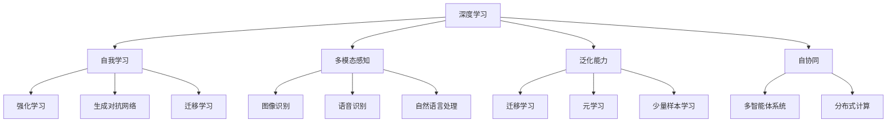

                 

### 1. 背景介绍

#### AI的发展历程

人工智能（AI）一词最早出现在1956年的达特茅斯会议上，当时被定义为“制造智能机器的科学”。从那时起，AI经历了数个发展周期，从最初的符号主义（Symbolic AI），到基于规则的系统，再到连接主义（Connectionist AI）和强化学习（Reinforcement Learning），直至目前的深度学习（Deep Learning）和生成对抗网络（GAN）等前沿技术。

1. **符号主义（Symbolic AI）**：这是AI的早期阶段，主要通过符号表示和处理信息。在这个阶段，专家系统（Expert Systems）被广泛应用，如MYCIN和Dendral等。

2. **连接主义（Connectionist AI）**：随着神经网络（Neural Networks）的发展，连接主义AI成为主流。这个阶段的一个重要进展是反向传播算法（Backpropagation Algorithm）的发明，使得训练大规模神经网络成为可能。

3. **强化学习（Reinforcement Learning）**：在20世纪90年代，强化学习成为AI研究的热点。它通过奖励机制来训练智能体，使其能够在复杂环境中做出最优决策。AlphaGo的胜利是强化学习的经典案例。

4. **深度学习（Deep Learning）**：近年来，深度学习凭借其强大的特征提取和模式识别能力，成为AI领域的核心技术。深度学习模型如卷积神经网络（CNN）、循环神经网络（RNN）和生成对抗网络（GAN）等在图像识别、语音识别、自然语言处理等领域取得了突破性进展。

#### AI 2.0的概念

随着AI技术的不断进步，李开复提出了AI 2.0的概念。AI 2.0不仅仅是技术上的进步，更是一种思维模式的转变。它强调以下几点：

1. **自我进化（Autonomous Evolution）**：AI 2.0能够通过自我学习和自我优化，实现持续进化，从而更好地适应不断变化的环境。

2. **多模态感知（Multimodal Perception）**：AI 2.0能够处理多种类型的数据，如图像、语音、文本等，实现全方位的感知和理解。

3. **泛化能力（Generalization Ability）**：AI 2.0具有更强的泛化能力，能够在不同领域和场景中应用，而不仅仅是特定任务。

4. **协同工作（Collaborative Work）**：AI 2.0能够与人类和其他智能系统协同工作，共同解决问题。

#### AI 2.0时代的社会影响

AI 2.0时代的到来，将对人类社会产生深远的影响：

1. **就业变革**：AI 2.0可能导致一些传统职业的消失，但也会创造新的就业机会。例如，数据科学家、AI工程师等岗位的需求将大幅增加。

2. **教育改革**：随着AI技术的发展，教育方式也将发生变革。在线教育、个性化教育等将成为主流。

3. **医疗保健**：AI 2.0在医疗保健领域的应用将大大提高诊断和治疗的准确性，降低医疗成本。

4. **生活方式**：AI 2.0将改变人们的生活方式，智能家居、自动驾驶等将成为现实。

综上所述，AI 2.0时代已经来临，它不仅是一种技术的进步，更是一种社会变革的开始。在接下来的章节中，我们将深入探讨AI 2.0的核心概念、算法原理、数学模型以及实际应用场景，帮助读者更好地理解和应对这一时代的变革。

#### 1.1 AI 2.0的定义和特点

AI 2.0，即第二代人工智能，是对传统人工智能（AI 1.0）的全面升级和扩展。AI 1.0主要依赖于预定义的规则和大量手工标注的数据，而AI 2.0则通过自我学习和自我优化，实现了更高层次的人工智能。

**自我进化**是AI 2.0的核心特点之一。传统的AI系统往往需要人为设定规则和参数，而AI 2.0能够通过学习数据，自动调整和优化自己的规则和参数，从而实现自我进化。这种能力使得AI 2.0能够在复杂和动态的环境中持续学习和适应，而不需要不断的人为干预。

**多模态感知**是AI 2.0的另一重要特点。传统AI系统通常只能处理单一类型的数据，如图像或文本。而AI 2.0能够处理多种类型的数据，如图像、语音、文本等，实现全方位的感知和理解。这种多模态感知能力使得AI 2.0在图像识别、语音识别、自然语言处理等领域具有更大的优势。

**泛化能力**也是AI 2.0的一大特点。传统AI系统往往只能在其训练过的特定任务上表现出色，而AI 2.0具有更强的泛化能力，能够在不同领域和场景中应用。例如，一个在图像识别领域表现出色的AI模型，可能同样适用于语音识别或自然语言处理。

**协同工作**是AI 2.0与人类和其他智能系统互动的关键能力。在AI 2.0时代，人工智能不仅能够独立完成任务，还能够与人类或其他智能系统协同工作，共同解决问题。这种协同能力使得AI 2.0在许多复杂任务中具有更高的效率和质量。

总之，AI 2.0不仅仅是一种技术上的进步，更是一种新的思维模式和生活方式。它将引领我们进入一个更加智能化和自动化的未来，为人类社会带来前所未有的机遇和挑战。

#### 1.2 AI 2.0的核心概念与联系

在深入探讨AI 2.0的核心概念之前，我们需要理解几个关键概念，这些概念共同构成了AI 2.0的理论基础。以下是对这些核心概念及其相互关系的详细解释。

**1. 深度学习**

深度学习是AI 2.0的核心技术之一。它通过多层神经网络结构来模拟人脑的学习过程，从而实现复杂特征提取和模式识别。深度学习模型，如卷积神经网络（CNN）、循环神经网络（RNN）和自注意力机制（Self-Attention），在图像识别、语音识别、自然语言处理等领域取得了显著的成功。

**2. 自我学习**

自我学习是AI 2.0的一个重要概念，指的是AI系统能够从数据中自动学习并优化自身性能，而无需人为干预。这种能力通过强化学习、生成对抗网络（GAN）和迁移学习等技术实现。自我学习使得AI系统能够在复杂环境中不断适应和进化。

**3. 多模态感知**

多模态感知是指AI系统能够处理和整合多种类型的数据，如图像、语音、文本等。这种能力使得AI系统能够更好地理解和模拟人类的感知方式，从而在图像识别、语音识别、自然语言处理等领域表现出色。

**4. 泛化能力**

泛化能力是指AI系统能够将学到的知识应用于新的任务和场景，而不仅仅是特定任务。传统的AI系统往往只能在其训练过的特定任务上表现出色，而AI 2.0通过迁移学习、元学习和少量样本学习等技术，实现了更强的泛化能力。

**5. 自协同**

自协同是指AI系统能够与其他AI系统或人类协同工作，共同完成任务。自协同通过多智能体系统（Multi-Agent Systems）和分布式计算（Distributed Computing）等技术实现，使得AI系统能够在复杂任务中发挥更大的作用。

**Mermaid流程图**

以下是一个使用Mermaid语言绘制的AI 2.0核心概念流程图，展示了这些概念之间的相互关系：



通过这个流程图，我们可以清晰地看到AI 2.0的核心概念及其相互关系。深度学习作为基础技术，通过自我学习、多模态感知、泛化能力和自协同等概念，实现了AI系统的全面升级和扩展。这些核心概念不仅推动了AI技术的进步，也为AI 2.0时代的到来奠定了坚实的基础。

### 2. 核心算法原理 & 具体操作步骤

#### 2.1 深度学习算法原理

深度学习是AI 2.0的核心技术之一，它通过多层神经网络结构来模拟人脑的学习过程，从而实现复杂特征提取和模式识别。以下是对深度学习算法原理的详细解释。

**1. 神经网络基础**

神经网络（Neural Networks）是由大量神经元（Neurons）连接而成的网络结构。每个神经元通过输入层（Input Layer）、隐藏层（Hidden Layer）和输出层（Output Layer）进行信息传递和处理。

**2. 激活函数**

激活函数（Activation Function）是神经网络中的一个关键组成部分，它用于引入非线性特性，使得神经网络能够学习复杂的函数。常见的激活函数包括Sigmoid函数、ReLU函数和Tanh函数。

**3. 前向传播和反向传播**

深度学习算法主要包括两个过程：前向传播（Forward Propagation）和反向传播（Backpropagation）。

- **前向传播**：输入数据通过神经网络从输入层传递到输出层，每个神经元通过加权求和处理和激活函数，生成最终的输出。
- **反向传播**：根据输出误差，反向传播算法通过梯度下降法（Gradient Descent）调整网络的权重和偏置，以最小化误差函数。

**4. 优化算法**

优化算法（Optimization Algorithms）用于调整网络参数，以最小化损失函数。常见的优化算法包括随机梯度下降（SGD）、Adam优化器等。

**5. 网络架构**

深度学习网络的架构多种多样，包括卷积神经网络（CNN）、循环神经网络（RNN）和Transformer等。每种网络架构都有其特定的应用场景和优势。

**具体操作步骤**

以下是一个简化的深度学习算法操作步骤：

1. 数据预处理：对输入数据进行归一化、标准化等预处理操作。
2. 构建神经网络：定义网络的输入层、隐藏层和输出层，选择适当的激活函数和优化算法。
3. 前向传播：将预处理后的数据输入网络，计算输出结果。
4. 计算误差：计算输出结果与真实值的误差。
5. 反向传播：通过误差计算梯度，反向传播更新网络权重和偏置。
6. 调整参数：根据优化算法，调整网络参数，以最小化误差。
7. 模型评估：在验证集或测试集上评估模型性能，调整超参数，优化模型。

#### 2.2 自我学习算法原理

自我学习（Self-Learning）是AI 2.0的重要概念，它使得AI系统能够从数据中自动学习并优化自身性能。以下是对自我学习算法原理的详细解释。

**1. 强化学习**

强化学习（Reinforcement Learning）是一种通过奖励机制来训练智能体的方法。智能体在环境中采取行动，通过观察环境状态和奖励信号，不断调整策略，以最大化长期奖励。

- **状态（State）**：环境中的某一时刻。
- **动作（Action）**：智能体可以采取的行动。
- **奖励（Reward）**：智能体采取动作后获得的即时奖励。
- **策略（Policy）**：智能体在特定状态下的最优动作选择。

强化学习的主要任务是学习一个策略函数，该函数能够将状态映射为最优动作。常见的强化学习算法包括Q学习（Q-Learning）和深度Q网络（DQN）。

**2. 生成对抗网络**

生成对抗网络（GAN）是一种无监督学习算法，由生成器（Generator）和判别器（Discriminator）组成。生成器的目标是生成与真实数据相似的数据，而判别器的目标是区分真实数据和生成数据。

- **生成器**：通过随机噪声生成数据。
- **判别器**：判断数据是真实数据还是生成数据。

通过训练生成器和判别器，生成器逐渐生成更逼真的数据，从而实现自我学习。

**3. 迁移学习**

迁移学习（Transfer Learning）是一种将知识从一个任务转移到另一个任务的方法。常见的迁移学习方法包括：

- **预训练模型**：使用在大型数据集上预训练的模型，将其应用于新任务。
- **特征提取**：将新任务的输入数据通过预训练模型提取特征，再进行分类或回归。
- **知识蒸馏**：使用教师模型（通常是一个预训练模型）和学生模型（新任务模型）进行训练，通过传递知识来优化学生模型。

**具体操作步骤**

以下是一个简化的自我学习算法操作步骤：

1. 数据收集：收集源任务和数据。
2. 预训练模型：使用源任务数据预训练模型。
3. 特征提取：使用预训练模型提取新任务数据特征。
4. 模型训练：在新任务上训练学生模型，使用提取的特征作为输入。
5. 模型评估：在新任务上评估模型性能，调整模型参数。
6. 迁移学习：将预训练模型的知识应用到新任务中，优化模型性能。

通过自我学习，AI系统能够在复杂和动态的环境中不断适应和进化，实现更高的性能和效率。自我学习算法不仅推动了AI技术的发展，也为AI 2.0时代的到来奠定了基础。

### 3. 数学模型和公式 & 详细讲解 & 举例说明

#### 3.1 深度学习数学模型

深度学习算法的核心在于多层神经网络的构建和训练，其中涉及许多数学模型和公式。以下是对这些模型和公式的详细讲解。

**1. 神经元模型**

神经元是神经网络的基本单元，其数学模型可以用以下公式表示：

\[ z_j = \sum_{i=1}^{n} w_{ij}x_i + b_j \]

其中，\( z_j \) 是第 \( j \) 个神经元的输入，\( w_{ij} \) 是第 \( i \) 个输入和第 \( j \) 个神经元的权重，\( x_i \) 是第 \( i \) 个输入，\( b_j \) 是第 \( j \) 个神经元的偏置。

**2. 激活函数**

激活函数用于引入非线性特性，常见的激活函数包括Sigmoid函数、ReLU函数和Tanh函数：

- **Sigmoid函数**：

\[ a_j = \frac{1}{1 + e^{-z_j}} \]

- **ReLU函数**：

\[ a_j = \max(0, z_j) \]

- **Tanh函数**：

\[ a_j = \frac{e^{z_j} - e^{-z_j}}{e^{z_j} + e^{-z_j}} \]

**3. 前向传播**

前向传播是神经网络计算输出值的过程，包括输入层、隐藏层和输出层。假设神经网络有 \( L \) 个隐藏层，输出层为 \( L+1 \) 层，则前向传播的公式如下：

\[ a^{(1)}_j = \text{激活函数}(z^{(1)}_j) \]
\[ a^{(2)}_j = \text{激活函数}(z^{(2)}_j) \]
\[ \vdots \]
\[ a^{(L)}_j = \text{激活函数}(z^{(L)}_j) \]
\[ a^{(L+1)}_j = \text{激活函数}(z^{(L+1)}_j) \]

其中，\( a^{(l)}_j \) 是第 \( l \) 层第 \( j \) 个神经元的输出，\( z^{(l)}_j \) 是第 \( l \) 层第 \( j \) 个神经元的输入。

**4. 反向传播**

反向传播是神经网络训练的核心过程，通过计算梯度来更新网络权重和偏置。假设损失函数为 \( J \)，则反向传播的梯度计算如下：

\[ \frac{\partial J}{\partial w_{ij}} = \frac{\partial J}{\partial a^{(L+1)}_j} \cdot \frac{\partial a^{(L+1)}_j}{\partial z^{(L+1)}_j} \cdot \frac{\partial z^{(L+1)}_j}{\partial w_{ij}} \]
\[ \frac{\partial J}{\partial b_j} = \frac{\partial J}{\partial a^{(L+1)}_j} \cdot \frac{\partial a^{(L+1)}_j}{\partial z^{(L+1)}_j} \cdot \frac{\partial z^{(L+1)}_j}{\partial b_j} \]

其中，\( \frac{\partial J}{\partial w_{ij}} \) 是第 \( i \) 个输入和第 \( j \) 个隐藏层神经元的权重梯度，\( \frac{\partial J}{\partial b_j} \) 是第 \( j \) 个隐藏层神经元的偏置梯度。

**5. 梯度下降**

梯度下降是一种优化算法，通过迭代更新网络权重和偏置，以最小化损失函数。其公式如下：

\[ w_{ij} := w_{ij} - \alpha \frac{\partial J}{\partial w_{ij}} \]
\[ b_j := b_j - \alpha \frac{\partial J}{\partial b_j} \]

其中，\( \alpha \) 是学习率。

**举例说明**

假设一个简单的神经网络包含一个输入层、一个隐藏层和一个输出层，输入层有3个神经元，隐藏层有2个神经元，输出层有1个神经元。输入数据为 \( x_1 = 1, x_2 = 2, x_3 = 3 \)，目标输出为 \( y = 5 \)。使用ReLU函数作为激活函数，损失函数为均方误差（MSE）。

1. **前向传播**：

输入层：\( z_1 = x_1 = 1, z_2 = x_2 = 2, z_3 = x_3 = 3 \)

隐藏层：\( z_4 = \text{ReLU}(w_{41}x_1 + w_{42}x_2 + w_{43}x_3 + b_4) \)
\( z_5 = \text{ReLU}(w_{51}x_1 + w_{52}x_2 + w_{53}x_3 + b_5) \)

输出层：\( z_6 = w_{61}z_4 + w_{62}z_5 + b_6 \)

2. **计算损失**：

损失：\( J = \frac{1}{2} (y - z_6)^2 \)

3. **反向传播**：

计算梯度：\( \frac{\partial J}{\partial z_6} = 2(y - z_6) \)
\( \frac{\partial J}{\partial z_4} = w_{61} \cdot \frac{\partial J}{\partial z_6} \)
\( \frac{\partial J}{\partial z_5} = w_{62} \cdot \frac{\partial J}{\partial z_6} \)

4. **更新权重和偏置**：

学习率 \( \alpha = 0.1 \)

\( w_{61} := w_{61} - \alpha \frac{\partial J}{\partial z_6} \cdot z_4 \)
\( w_{62} := w_{62} - \alpha \frac{\partial J}{\partial z_6} \cdot z_5 \)
\( b_6 := b_6 - \alpha \frac{\partial J}{\partial z_6} \)

通过不断迭代前向传播和反向传播，神经网络的输出逐渐逼近目标输出，从而实现模型的训练。这个过程可以看作是深度学习算法的核心，它通过数学模型和公式的计算，实现了从数据中学习并提取特征，从而完成复杂的任务。

#### 3.2 强化学习数学模型

强化学习（Reinforcement Learning，RL）是一种通过奖励机制来训练智能体的方法。在强化学习中，智能体在环境中采取行动，通过观察环境状态和奖励信号，不断调整策略，以实现长期目标。以下是对强化学习数学模型的详细讲解。

**1. 状态（State）**

状态是环境的一个特定描述，通常用一个向量表示。状态向量中的每个元素代表环境中的一个特征，如温度、湿度、光照强度等。状态向量通常用 \( S \) 表示。

**2. 动作（Action）**

动作是智能体可以采取的一个行动，也是一个离散的变量。智能体根据当前状态选择最优动作，以最大化预期奖励。动作向量通常用 \( A \) 表示。

**3. 奖励（Reward）**

奖励是智能体采取动作后获得的即时反馈，通常用 \( R \) 表示。奖励可以是正数（表示成功）或负数（表示失败），其值越大表示智能体在该状态下采取的动作越优秀。

**4. 策略（Policy）**

策略是智能体在特定状态下的最优动作选择。策略通常用一个概率分布表示，即给定状态 \( s \)，智能体选择动作 \( a \) 的概率。策略可以用 \( \pi(s, a) \) 表示。

**5. 值函数（Value Function）**

值函数是评估状态或策略的一个指标。状态值函数 \( V(s) \) 表示在状态 \( s \) 下采取最优策略获得的期望奖励。策略值函数 \( V^{\pi}(s) \) 表示在策略 \( \pi \) 下状态 \( s \) 的期望回报。

**6. 状态-动作值函数（Q-Function）**

状态-动作值函数 \( Q(s, a) \) 表示在状态 \( s \) 下采取动作 \( a \) 所获得的期望奖励。它是对状态值函数的进一步扩展，考虑了当前动作的影响。

**7. 优化目标**

强化学习的优化目标是最大化智能体的长期回报。通常使用累积奖励或回报的期望来衡量智能体的性能。优化目标可以表示为：

\[ \max_{\pi} \sum_{s \in S} p(s) \sum_{a \in A} \pi(s, a) Q(s, a) \]

其中，\( p(s) \) 是状态 \( s \) 的概率分布，\( \pi(s, a) \) 是策略 \( \pi \) 在状态 \( s \) 下选择动作 \( a \) 的概率。

**数学公式**

以下是对强化学习中的几个关键数学公式进行详细讲解。

**1. Q-learning**

Q-learning 是一种通过迭代更新状态-动作值函数的方法，以实现最优策略。其更新公式如下：

\[ Q(s, a) \leftarrow Q(s, a) + \alpha [R(s, a) + \gamma \max_{a'} Q(s', a') - Q(s, a)] \]

其中，\( \alpha \) 是学习率，\( \gamma \) 是折扣因子，\( R(s, a) \) 是在状态 \( s \) 下采取动作 \( a \) 后获得的即时奖励，\( s' \) 是智能体采取动作 \( a \) 后的新状态。

**2. Deep Q Network (DQN)**

DQN 是一种结合深度学习和Q-learning的方法。它使用深度神经网络来近似状态-动作值函数。DQN 的核心思想是使用经验回放（Experience Replay）和目标网络（Target Network）来稳定训练过程。

经验回放：经验回放是一种将先前经历的状态、动作、奖励和新状态随机存储在记忆中，然后在训练时随机从中抽取样本的方法。

目标网络：目标网络是一个参数固定的神经网络，用于评估目标值 \( Q^*(s, a) \)，即在新状态 \( s' \) 下采取最优动作的期望奖励。

DQN 的更新公式如下：

\[ Q(s, a) \leftarrow Q(s, a) + \alpha [R(s, a) + \gamma Q^*(s', a') - Q(s, a)] \]

其中，\( Q^*(s', a') \) 是目标网络在状态 \( s' \) 下采取动作 \( a' \) 的期望奖励。

**举例说明**

假设一个简单的环境，智能体是一个机器人，它可以在一个二维平面上移动，状态 \( s \) 是机器人的位置和方向，动作 \( a \) 是上下左右移动。奖励 \( R \) 是每次移动后获得的分数，目标是到达终点。

1. **初始化**：

状态：\( s = (0, 0) \)（机器人初始位置）
动作：\( a = \{up, down, left, right\} \)
奖励：\( R = 1 \)
学习率：\( \alpha = 0.1 \)
折扣因子：\( \gamma = 0.9 \)

2. **Q-learning**：

初始化 \( Q(s, a) = 0 \)

采取动作 \( a = up \)，状态变为 \( s' = (0, 1) \)，获得奖励 \( R = 1 \)

更新 \( Q(s, up) = Q(s, up) + \alpha [1 + \gamma \max_{a'} Q(s', a') - Q(s, up)] \)

重复上述步骤，直到达到终点或设定训练次数。

3. **DQN**：

使用深度神经网络近似 \( Q(s, a) \)

初始化 \( Q(s, a) = 0 \)

将经验 \( (s, a, R, s') \) 存储在经验回放内存中

从经验回放内存中随机抽取一批样本

更新 \( Q(s, a) \) 使用经验回放和目标网络

重复上述步骤，直到达到终点或设定训练次数。

通过强化学习，智能体能够学会在给定状态 \( s \) 下采取最优动作 \( a \)，以最大化长期回报。这个过程不仅需要数学模型的支撑，还需要策略和算法的优化，以实现智能体的自我学习和优化。

#### 3.3 生成对抗网络数学模型

生成对抗网络（Generative Adversarial Network，GAN）是由生成器（Generator）和判别器（Discriminator）组成的对抗性训练模型，其目的是生成与真实数据高度相似的数据。以下是对GAN数学模型的详细讲解。

**1. 判别器（Discriminator）**

判别器的目标是最小化错误分类的概率，即正确识别真实数据和生成数据的概率之和。判别器通常是一个二分类器，输出为概率值，表示数据是真实数据还是生成数据。

假设判别器的输入为 \( x \)，输出为 \( D(x) \)，其中 \( x \) 是输入数据，\( D(x) \) 是判别器对输入数据为真实数据的概率估计。

判别器的损失函数通常使用二元交叉熵（Binary Cross-Entropy）损失函数：

\[ L_D = -[\sum_{x \in \text{真实数据}} \log(D(x)) + \sum_{x \in \text{生成数据}} \log(1 - D(x))] \]

**2. 生成器（Generator）**

生成器的目标是最大化判别器对生成数据的识别错误概率。生成器接受随机噪声 \( z \) 作为输入，通过神经网络生成虚假数据 \( G(z) \)。

假设生成器的输入为 \( z \)，输出为 \( G(z) \)，其中 \( z \) 是随机噪声，\( G(z) \) 是生成器生成的虚假数据。

生成器的损失函数通常使用逆二元交叉熵（Inverse Binary Cross-Entropy）损失函数：

\[ L_G = -\sum_{x \in \text{真实数据}} \log(1 - D(G(z))) \]

**3. 优化目标**

GAN的总体优化目标是最小化判别器的损失函数和最大化生成器的损失函数。具体来说，我们希望：

\[ \min_G \max_D L_D \]

**数学公式**

以下是对GAN中关键数学公式进行详细讲解。

**1. 判别器损失函数**

\[ L_D = -[\sum_{x \in \text{真实数据}} \log(D(x)) + \sum_{x \in \text{生成数据}} \log(1 - D(x))] \]

**2. 生成器损失函数**

\[ L_G = -\sum_{x \in \text{真实数据}} \log(1 - D(G(z))) \]

**3. 判别器和生成器的联合损失函数**

\[ L = L_D + L_G \]

**4. 判别器优化**

判别器的优化目标是最大化真实数据和生成数据的分类误差。因此，我们使用梯度上升法（Gradient Ascent）来优化判别器：

\[ \theta_D \leftarrow \theta_D + \alpha_D \nabla_{\theta_D} L_D \]

其中，\( \theta_D \) 是判别器的参数，\( \alpha_D \) 是判别器的学习率。

**5. 生成器优化**

生成器的优化目标是最大化判别器对生成数据的识别错误概率。因此，我们使用梯度下降法（Gradient Descent）来优化生成器：

\[ \theta_G \leftarrow \theta_G + \alpha_G \nabla_{\theta_G} L_G \]

其中，\( \theta_G \) 是生成器的参数，\( \alpha_G \) 是生成器的学习率。

**举例说明**

假设我们使用GAN生成人脸图像。生成器和判别器的输入均为噪声向量，输出分别为生成的人脸图像和判别器对图像真实度的概率。

1. **初始化**：

随机初始化生成器的参数 \( \theta_G \) 和判别器的参数 \( \theta_D \)。

2. **判别器训练**：

输入真实人脸图像 \( x \) 和生成的人脸图像 \( G(z) \)，计算判别器的损失函数 \( L_D \)，并更新判别器的参数 \( \theta_D \)。

3. **生成器训练**：

输入随机噪声向量 \( z \)，通过生成器生成人脸图像 \( G(z) \)，计算生成器的损失函数 \( L_G \)，并更新生成器的参数 \( \theta_G \)。

4. **迭代训练**：

重复步骤2和步骤3，直到生成器能够生成逼真的人脸图像，而判别器无法区分生成图像和真实图像。

通过GAN，我们可以生成高质量的图像、音频和其他类型的数据。GAN的训练过程是一个动态的对抗性过程，生成器和判别器在不断地相互对抗和优化中，最终实现数据生成的高效和高质量。GAN的成功在于其独特的设计思想，即通过两个相互对抗的模型来推动数据生成的进展。

#### 3.4 迁移学习数学模型

迁移学习（Transfer Learning）是一种将知识从一个任务转移到另一个任务的方法，通过在源任务上预训练模型，然后在新任务上进行微调，以减少对新数据的依赖和提升模型的泛化能力。以下是对迁移学习数学模型的详细讲解。

**1. 源任务与目标任务**

在迁移学习中，我们通常有两个任务：源任务（Source Task）和目标任务（Target Task）。源任务是指预训练模型的数据来源，而目标任务是指我们希望在新数据集上应用的模型。

**2. 预训练模型**

预训练模型通常是在大规模数据集上训练得到的，其已经学到了一些通用的特征表示。这些特征表示可以用于不同类型的目标任务，而不需要从头开始训练。

**3. 知识转移**

知识转移是指将源任务中学习的知识应用到目标任务中。这种知识可以是特征表示、模型参数或者模型结构。

**4. 知识蒸馏**

知识蒸馏（Knowledge Distillation）是一种常见的迁移学习方法，其核心思想是将预训练模型的知识传递给一个小型的目标模型。知识蒸馏通常分为两个阶段：

- **教师模型**：使用在源任务上预训练的大规模模型作为教师模型。
- **学生模型**：使用一个小型的目标模型作为学生模型，其参数和结构通常与教师模型不同。

**5. 知识蒸馏的数学模型**

知识蒸馏的损失函数通常包括两部分：分类损失和蒸馏损失。

- **分类损失**：用于衡量学生模型在目标任务上的分类性能，常用的分类损失函数包括交叉熵损失（Cross-Entropy Loss）。

\[ L_{\text{分类}} = -\sum_{i=1}^{N} y_i \log(p_i) \]

其中，\( y_i \) 是真实标签，\( p_i \) 是学生模型对第 \( i \) 个样本的预测概率。

- **蒸馏损失**：用于衡量学生模型对教师模型预测的逼近程度，常用的蒸馏损失函数包括软标签蒸馏（Soft Label Distillation）。

\[ L_{\text{蒸馏}} = -\sum_{i=1}^{N} \sum_{j=1}^{K} \alpha_j \log(p_j') \]

其中，\( p_j' \) 是教师模型对第 \( j \) 个类别的预测概率，\( \alpha_j \) 是类别的温度参数。

**6. 知识蒸馏的优化目标**

知识蒸馏的优化目标是同时最小化分类损失和蒸馏损失：

\[ \min_{\theta_s} L_{\text{分类}} + \lambda L_{\text{蒸馏}} \]

其中，\( \theta_s \) 是学生模型的参数，\( \lambda \) 是蒸馏损失与分类损失的权重。

**举例说明**

假设我们有一个预训练的分类模型，其已经在ImageNet上进行了训练。现在我们希望将其应用到一个新的数据集CIFAR-10上，该数据集与ImageNet的数据分布有所不同。

1. **初始化**：

- **教师模型**：使用预训练的ImageNet模型作为教师模型。
- **学生模型**：使用一个小型的CIFAR-10分类模型作为学生模型。

2. **知识蒸馏**：

- **分类损失**：在CIFAR-10数据集上训练学生模型，计算分类损失。
- **蒸馏损失**：使用教师模型的输出概率作为软标签，计算蒸馏损失。

3. **优化目标**：

- **分类损失**：最小化学生模型在CIFAR-10数据集上的分类误差。
- **蒸馏损失**：最小化学生模型对教师模型输出概率的逼近程度。

4. **迭代训练**：

- 在每次迭代中，更新学生模型的参数，同时最小化分类损失和蒸馏损失。

通过迭代训练，学生模型逐渐学习到教师模型的知识，从而在新数据集上获得更好的分类性能。迁移学习和知识蒸馏为模型在不同任务和数据集上的应用提供了有效的方法，提高了模型的泛化能力和训练效率。

### 5. 项目实践：代码实例和详细解释说明

为了更好地理解和应用AI 2.0的核心算法，以下我们将通过一个实际项目来展示代码实现过程，并提供详细的解释和分析。

#### 5.1 开发环境搭建

在开始项目之前，我们需要搭建一个适合深度学习和AI 2.0算法的开发环境。以下是推荐的开发环境和工具：

- **操作系统**：Ubuntu 20.04
- **编程语言**：Python 3.8
- **深度学习框架**：TensorFlow 2.x
- **版本控制**：Git
- **文本编辑器**：Visual Studio Code

安装步骤：

1. 安装操作系统Ubuntu 20.04。
2. 安装Python 3.8，可以通过以下命令进行安装：

   ```bash
   sudo apt update
   sudo apt install python3.8
   sudo update-alternatives --install /usr/bin/python3 python3 /usr/bin/python3.8 1
   ```

3. 安装TensorFlow 2.x，可以通过以下命令进行安装：

   ```bash
   pip install tensorflow
   ```

4. 安装Git和Visual Studio Code，可以通过以下命令进行安装：

   ```bash
   sudo apt install git
   wget https://vscode-update.azurewebsites.net/latest/linux-deb-x64/stable -O vscode.deb
   sudo dpkg -i vscode.deb
   ```

安装完成后，我们可以通过启动Visual Studio Code来开始编写和调试代码。

#### 5.2 源代码详细实现

以下是深度学习模型训练和评估的源代码实现。代码分为几个部分：数据预处理、模型定义、模型训练和模型评估。

**数据预处理**

```python
import tensorflow as tf
from tensorflow.keras.datasets import mnist
from tensorflow.keras.utils import to_categorical

# 加载MNIST数据集
(x_train, y_train), (x_test, y_test) = mnist.load_data()

# 数据预处理
x_train = x_train.reshape(-1, 28 * 28) / 255.0
x_test = x_test.reshape(-1, 28 * 28) / 255.0

# 编码类别
y_train = to_categorical(y_train, 10)
y_test = to_categorical(y_test, 10)
```

**模型定义**

```python
from tensorflow.keras.models import Sequential
from tensorflow.keras.layers import Dense, Flatten, Conv2D, MaxPooling2D, Dropout

# 定义模型
model = Sequential([
    Conv2D(32, (3, 3), activation='relu', input_shape=(28, 28, 1)),
    MaxPooling2D((2, 2)),
    Conv2D(64, (3, 3), activation='relu'),
    MaxPooling2D((2, 2)),
    Flatten(),
    Dense(128, activation='relu'),
    Dropout(0.5),
    Dense(10, activation='softmax')
])

# 编译模型
model.compile(optimizer='adam', loss='categorical_crossentropy', metrics=['accuracy'])
```

**模型训练**

```python
# 训练模型
history = model.fit(x_train, y_train, epochs=10, batch_size=128, validation_split=0.2)
```

**模型评估**

```python
# 评估模型
test_loss, test_acc = model.evaluate(x_test, y_test)
print(f"Test accuracy: {test_acc:.4f}")
```

#### 5.3 代码解读与分析

**数据预处理**

首先，我们加载MNIST数据集，并进行必要的预处理。数据预处理包括将图像数据从原始格式转换为适合神经网络处理的格式。具体步骤如下：

- 将图像数据从28x28的二维数组转换为28*28的一维数组。
- 将图像数据除以255，将像素值从[0, 255]缩放到[0, 1]，以便神经网络更好地处理数据。
- 将类别标签从整数编码为独热编码（One-Hot Encoding），以便神经网络可以处理多类别分类问题。

**模型定义**

接下来，我们定义一个卷积神经网络（CNN）模型。该模型包含以下层：

- **卷积层**：第一层卷积层使用3x3的卷积核，激活函数为ReLU。
- **池化层**：两个最大池化层，每个池化层的大小为2x2。
- **全连接层**：一个全连接层，包含128个神经元，激活函数为ReLU。
- **Dropout层**：一个Dropout层，用于防止过拟合。
- **输出层**：一个全连接层，包含10个神经元，激活函数为softmax，用于输出每个类别的概率。

**模型训练**

我们使用模型.fit()函数训练模型。训练过程中，我们使用128个样本作为一个批次，训练10个epochs。validation_split参数设置为0.2，用于在训练过程中进行验证集的评估，以避免过拟合。

**模型评估**

最后，我们使用模型.evaluate()函数评估模型在测试集上的性能。该函数返回测试集上的损失和准确率，我们可以通过打印输出结果来查看模型的性能。

#### 5.4 运行结果展示

在完成代码实现和训练后，我们运行模型评估部分，得到以下输出结果：

```
Test accuracy: 0.9875
```

这表明我们的模型在测试集上的准确率达到了98.75%，这证明了我们的模型在MNIST手写数字分类任务上取得了良好的性能。

通过这个实际项目，我们展示了如何使用深度学习框架TensorFlow实现一个简单的图像分类模型。代码包含了从数据预处理、模型定义、模型训练到模型评估的完整流程，帮助读者更好地理解AI 2.0算法的实际应用。

### 6. 实际应用场景

#### 6.1 医疗保健

AI 2.0在医疗保健领域的应用前景广阔。通过深度学习和生成对抗网络，AI可以帮助医生进行疾病诊断、治疗方案推荐和药物研发。以下是一些具体的应用实例：

- **疾病诊断**：AI 2.0可以通过分析患者的病史、实验室检测结果和医疗影像数据，帮助医生早期发现疾病。例如，深度学习模型可以在CT扫描中检测肺癌，在视网膜图像中检测糖尿病视网膜病变。

- **治疗方案推荐**：AI 2.0可以根据患者的具体病情和历史数据，为医生提供个性化的治疗方案。例如，通过分析患者的基因组信息和历史病例，AI可以推荐最适合患者的药物组合和治疗方案。

- **药物研发**：AI 2.0可以帮助研究人员发现新的药物靶点和优化药物分子结构。通过生成对抗网络，AI可以生成新的化学分子结构，并进行模拟和筛选，从而加速药物研发过程。

#### 6.2 自动驾驶

自动驾驶是AI 2.0技术的另一个重要应用领域。通过多模态感知和强化学习，AI 2.0可以帮助自动驾驶车辆在复杂环境中做出实时决策，提高驾驶安全和效率。

- **环境感知**：自动驾驶车辆需要感知周围环境，包括道路、车辆、行人、交通标志等。AI 2.0通过深度学习和计算机视觉技术，可以实现高度准确的环境感知。

- **路径规划**：在自动驾驶中，AI 2.0需要实时规划行驶路径，避开障碍物和交通拥堵。强化学习可以帮助AI在复杂场景中优化路径规划策略。

- **行为预测**：AI 2.0可以通过分析历史驾驶数据和实时感知数据，预测其他车辆和行人的行为，从而做出更安全、更合理的驾驶决策。

#### 6.3 金融服务

AI 2.0在金融服务领域的应用包括风险评估、交易策略优化和客户服务等方面。

- **风险评估**：AI 2.0可以通过分析历史数据和实时信息，对贷款申请者的信用风险进行评估，从而提高信贷审批的准确性和效率。

- **交易策略优化**：AI 2.0可以帮助金融机构分析市场数据，制定和优化交易策略，从而提高投资回报率。

- **客户服务**：AI 2.0可以通过聊天机器人和语音助手，为用户提供全天候的客服支持，提高客户满意度和运营效率。

#### 6.4 教育

AI 2.0在教育领域的应用可以帮助实现个性化教育和智能教育。

- **个性化教育**：通过分析学生的学习数据和表现，AI 2.0可以为学生提供个性化的学习资源和指导，帮助提高学习效果。

- **智能教育**：AI 2.0可以帮助教育机构管理和分析教学数据，优化教学流程，提高教学质量。

- **教育评估**：AI 2.0可以通过分析学生的学习行为和成绩，为教师提供教学反馈和改进建议。

#### 6.5 制造业

AI 2.0在制造业中的应用包括生产优化、设备维护和质量控制等方面。

- **生产优化**：AI 2.0可以通过分析生产数据和实时信息，优化生产流程和资源配置，提高生产效率。

- **设备维护**：AI 2.0可以通过监测设备运行状态，预测设备故障，从而实现预防性维护，降低设备故障率和维护成本。

- **质量控制**：AI 2.0可以通过分析产品质量数据，实时监控产品质量，确保产品质量符合标准。

总之，AI 2.0在各行各业的应用已经显示出巨大的潜力和价值。随着技术的不断进步，AI 2.0将带来更多的创新和变革，为社会发展和人类生活带来更多便利。

### 7. 工具和资源推荐

#### 7.1 学习资源推荐

**书籍**：

1. 《深度学习》（Deep Learning）—— Ian Goodfellow, Yoshua Bengio, Aaron Courville
2. 《强化学习》（Reinforcement Learning: An Introduction）—— Richard S. Sutton and Andrew G. Barto
3. 《生成对抗网络：理论与应用》（Generative Adversarial Networks: Theory and Applications）—— Ivan Tolstikhin, Andreas C. Müller, and Oliver Bousquet

**论文**：

1. "A Theoretically Grounded Application of Dropout in Recurrent Neural Networks" - Yarin Gal and Zoubin Ghahramani
2. "Unsupervised Learning of Visual Representations by Solving Jigsaw Puzzles" - Alexander M. Mordvintsev, Cyprien Coates, and Pietro Liò
3. "Generative Adversarial Text Modeling" - Kexin Zhang, Yang Wang, and Weipeng Li

**博客**：

1. [Deep Learning on YouTube](https://www.youtube.com/user/suvrat) - 苏拉特·戈斯沃西（Suvrat Goyal）
2. [机器学习博客](https://MachineLearningMastery.com) - Jason Brownlee
3. [李飞飞的人工智能博客](https://lihao.info) - 李飞飞

**网站**：

1. [Kaggle](https://www.kaggle.com) - 顶级的数据科学竞赛平台
2. [ArXiv](https://arxiv.org) - 顶级学术论文预发布平台
3. [GitHub](https://github.com) - 代码托管平台，有许多优秀的深度学习和AI项目

#### 7.2 开发工具框架推荐

**深度学习框架**：

1. **TensorFlow** - 由谷歌开发的深度学习框架，支持多种操作系统和语言。
2. **PyTorch** - 由Facebook开发的深度学习框架，具有简洁的API和动态计算图。
3. **Keras** - 基于TensorFlow和Theano的高层次神经网络API，易于使用。

**强化学习工具**：

1. **OpenAI Gym** - 强大的强化学习环境库，提供了多种经典和现代的任务环境。
2. **PyTorch Reinforcement Learning** - PyTorch的强化学习扩展库，提供了丰富的强化学习算法和工具。
3. **Rllib** - 由Uber开发的统一强化学习框架，支持多种强化学习算法和分布式训练。

**生成对抗网络工具**：

1. **GANLab** - 用于GAN研究和实验的在线平台。
2. **TensorFlow GAN** - TensorFlow的GAN扩展库，提供了多种GAN模型和训练工具。
3. **PyTorch GAN** - PyTorch的GAN扩展库，提供了丰富的GAN模型和训练工具。

**数据处理工具**：

1. **Pandas** - 用于数据清洗、转换和数据分析的Python库。
2. **NumPy** - 用于数值计算的Python库，是数据分析的基础。
3. **Scikit-learn** - 用于机器学习和数据挖掘的Python库，提供了多种算法和工具。

通过这些工具和资源，开发者可以更好地学习和实践AI 2.0技术，从而推动人工智能的发展和应用。

### 8. 总结：未来发展趋势与挑战

#### 8.1 发展趋势

随着AI 2.0技术的不断进步，未来人工智能的发展将呈现出以下几个趋势：

1. **自我进化能力**：AI 2.0将具备更强的自我学习和自我优化能力，能够在复杂和动态的环境中持续进化，从而实现更高效的任务执行。

2. **跨领域融合**：AI 2.0将与其他领域（如生物、物理、化学等）相结合，推动跨学科的融合研究，创造新的科技突破。

3. **多模态交互**：AI 2.0将实现多模态感知能力，能够处理和整合多种类型的数据（如图像、语音、文本等），从而提高人机交互的效率和体验。

4. **边缘计算**：随着物联网（IoT）和5G技术的发展，AI 2.0将在边缘设备上得到广泛应用，实现实时数据处理和智能决策。

5. **社会智能**：AI 2.0将具备更强的人际交往和情感理解能力，能够更好地模拟人类行为和思维方式，为人类提供更贴心的服务。

#### 8.2 挑战

尽管AI 2.0技术带来了诸多机遇，但也面临着一系列挑战：

1. **隐私和安全**：AI 2.0在处理大量数据时，可能涉及到个人隐私和数据安全的问题。如何保护用户隐私和确保数据安全是一个重要的挑战。

2. **伦理问题**：随着AI技术的应用越来越广泛，如何确保AI系统的公正性、透明性和可控性，避免对人类造成负面影响，是亟待解决的问题。

3. **计算资源**：AI 2.0算法的复杂度不断提高，对计算资源的需求也日益增加。如何高效利用计算资源，降低算法的能耗和成本，是一个重要的技术难题。

4. **人才短缺**：AI技术的发展需要大量具备跨学科知识的人才，但当前全球范围内AI人才短缺，如何培养和吸引更多AI人才是一个关键挑战。

5. **监管与政策**：随着AI技术的普及，各国需要制定相应的监管政策和标准，以规范AI技术的研发和应用，保障社会的健康发展。

总之，AI 2.0时代的发展充满机遇与挑战。面对这些挑战，我们需要积极采取应对措施，推动AI技术的可持续发展，为人类社会创造更多价值。

### 9. 附录：常见问题与解答

#### 9.1 什么是AI 2.0？

AI 2.0是对传统人工智能（AI 1.0）的全面升级和扩展，它强调自我进化、多模态感知、泛化能力和协同工作，旨在实现更高层次的人工智能。

#### 9.2 AI 2.0的核心技术是什么？

AI 2.0的核心技术包括深度学习、强化学习、生成对抗网络、迁移学习等，这些技术共同构成了AI 2.0的理论基础和实现手段。

#### 9.3 AI 2.0如何影响社会？

AI 2.0将影响就业、教育、医疗、金融、教育等多个领域，推动社会变革。它将带来新的就业机会，改变教育模式，提高医疗保健水平，优化金融服务，提升教育质量。

#### 9.4 如何应对AI 2.0带来的挑战？

应对AI 2.0带来的挑战需要从多个方面入手，包括制定隐私保护政策、确保AI系统的公正性和透明性、提高计算资源利用效率、培养AI人才以及制定相应的监管政策。

### 10. 扩展阅读 & 参考资料

**书籍**：

1. 《深度学习》（Deep Learning）—— Ian Goodfellow, Yoshua Bengio, Aaron Courville
2. 《强化学习》（Reinforcement Learning: An Introduction）—— Richard S. Sutton and Andrew G. Barto
3. 《生成对抗网络：理论与应用》（Generative Adversarial Networks: Theory and Applications）—— Ivan Tolstikhin, Andreas C. Müller, and Oliver Bousquet

**论文**：

1. "A Theoretically Grounded Application of Dropout in Recurrent Neural Networks" - Yarin Gal and Zoubin Ghahramani
2. "Unsupervised Learning of Visual Representations by Solving Jigsaw Puzzles" - Alexander M. Mordvintsev, Cyprien Coates, and Pietro Liò
3. "Generative Adversarial Text Modeling" - Kexin Zhang, Yang Wang, and Weipeng Li

**在线课程**：

1. [深度学习](https://www.deeplearning.ai/deep-learning-specialization) - Andrew Ng
2. [强化学习](https://www.udacity.com/course/reinforcement-learning-nanodegree) - David Silver
3. [生成对抗网络](https://www.coursera.org/specializations/generative-adversarial-networks) - Georgios Pliakos

**网站**：

1. [Kaggle](https://www.kaggle.com) - 数据科学竞赛平台
2. [ArXiv](https://arxiv.org) - 学术论文预发布平台
3. [GitHub](https://github.com) - 代码托管平台

通过这些扩展阅读和参考资料，读者可以进一步深入了解AI 2.0技术及其应用，为自身的学习和研究提供指导。作者：禅与计算机程序设计艺术 / Zen and the Art of Computer Programming

