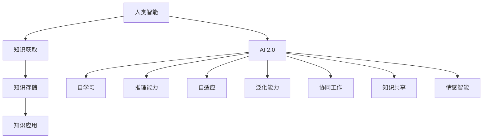
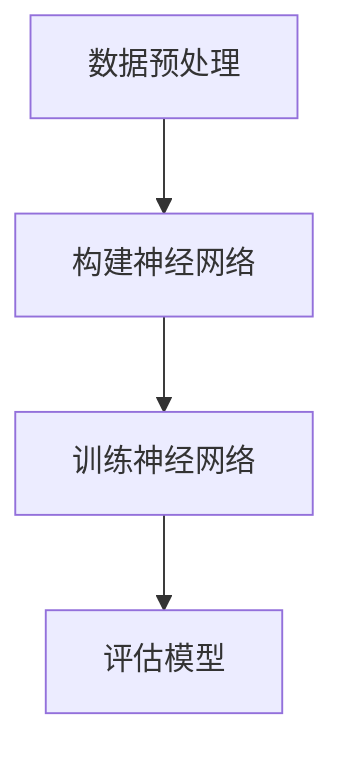

                 

### 文章标题

《李开复：AI 2.0 时代的未来展望》

> 关键词：AI 2.0，未来展望，人工智能发展，技术趋势，社会影响，商业应用

> 摘要：本文深入探讨了李开复对AI 2.0时代的见解，分析AI 2.0的核心概念、技术趋势、社会影响以及商业应用。通过逐步推理，我们旨在揭示AI 2.0时代的潜在机遇与挑战。

---

### 1. 背景介绍

人工智能（AI）的发展经历了多个阶段，从早期的规则系统、知识表示到近年来的深度学习，AI技术不断进步，应用场景也越来越广泛。然而，传统的AI方法在处理复杂、不确定的任务时仍存在局限性。李开复提出的AI 2.0概念，旨在解决这些问题，实现更加智能化、自适应的AI系统。

AI 2.0不仅仅是在算法层面的改进，更涉及到整个AI系统的重构，包括数据、算法、硬件和应用的全面升级。李开复指出，AI 2.0时代将是一个以人类智能为中心，AI与人类共同协作、共同进化的新时代。

在AI 2.0时代，人工智能将更加智能化、自适应，能够理解和应对复杂、不确定的情境。这将极大地改变我们的生活、工作和社会，带来前所未有的机遇和挑战。

### 2. 核心概念与联系

#### 2.1 AI 2.0的核心概念

AI 2.0的核心概念主要包括以下几点：

1. **自学习**：AI系统能够通过不断学习、适应新的环境和任务。
2. **推理能力**：AI系统能够进行逻辑推理，解决复杂问题。
3. **自适应**：AI系统能够根据环境变化进行调整和优化。
4. **泛化能力**：AI系统能够将所学知识应用于新的领域和任务。

#### 2.2 AI 2.0与人类智能的联系

AI 2.0不仅仅是技术的进步，更是人类智能的延伸。李开复认为，AI 2.0时代将是一个人与AI共同进化的时代。

1. **协同工作**：AI与人类在工作和生活中实现高效协作，互相补充。
2. **知识共享**：AI系统能够帮助人类快速获取和利用知识，提升整体智力水平。
3. **情感智能**：AI系统能够理解和模拟人类情感，提供更加人性化的服务。

#### 2.3 Mermaid流程图



### 3. 核心算法原理 & 具体操作步骤

AI 2.0的核心算法主要包括以下几个部分：

1. **深度学习**：通过多层神经网络模拟人类大脑的学习过程，实现数据的自动特征提取。
2. **强化学习**：通过不断试错和奖励机制，使AI系统具备自主决策能力。
3. **迁移学习**：利用已学习的模型和知识，快速适应新的任务和领域。

#### 3.1 深度学习

深度学习是AI 2.0时代的关键技术之一。具体操作步骤如下：

1. **数据预处理**：对原始数据进行清洗、归一化等处理，确保数据质量。
2. **构建神经网络**：选择合适的神经网络结构，如卷积神经网络（CNN）或循环神经网络（RNN）。
3. **训练神经网络**：使用大量的训练数据，通过反向传播算法优化网络参数。
4. **评估与调优**：使用验证集评估模型性能，并进行调优。

#### 3.2 强化学习

强化学习是AI 2.0时代的另一个关键技术。具体操作步骤如下：

1. **定义环境**：确定AI系统需要应对的环境和状态。
2. **定义奖励机制**：为AI系统设定奖励机制，激励其进行正确决策。
3. **模拟环境**：通过模拟环境，使AI系统进行自主学习和决策。
4. **评估与优化**：评估AI系统的决策效果，并进行优化。

#### 3.3 迁移学习

迁移学习是AI 2.0时代的核心技术之一。具体操作步骤如下：

1. **选择源任务**：选择已解决的类似任务，作为迁移学习的基准。
2. **提取通用特征**：从源任务中提取通用的特征表示。
3. **适应目标任务**：使用通用特征表示，快速适应目标任务。
4. **评估与优化**：评估迁移学习的效果，并进行优化。

### 4. 数学模型和公式 & 详细讲解 & 举例说明

AI 2.0的数学模型和公式主要涉及以下几个方面：

1. **深度学习中的激活函数**：如ReLU、Sigmoid、Tanh等。
2. **强化学习中的奖励机制**：如Q值、策略梯度等。
3. **迁移学习中的特征提取**：如卷积神经网络、循环神经网络等。

#### 4.1 深度学习中的激活函数

深度学习中的激活函数是神经网络的核心部分，用于引入非线性变换。以下是一些常见的激活函数：

1. **ReLU函数**：
   $$ f(x) = \max(0, x) $$
   ReLU函数具有简单、计算效率高的优点，常用于深度神经网络。

2. **Sigmoid函数**：
   $$ f(x) = \frac{1}{1 + e^{-x}} $$
   Sigmoid函数在[0, 1]区间内输出，常用于二分类问题。

3. **Tanh函数**：
   $$ f(x) = \frac{e^x - e^{-x}}{e^x + e^{-x}} $$
   Tanh函数在[-1, 1]区间内输出，具有较好的平滑性和对称性。

#### 4.2 强化学习中的奖励机制

强化学习中的奖励机制是激励AI系统进行正确决策的关键。以下是一些常见的奖励机制：

1. **Q值**：
   $$ Q(s, a) = \sum_{s'} P(s' | s, a) \cdot R(s', a) + \gamma \cdot \max_{a'} Q(s', a') $$
   Q值表示在状态s下执行动作a的期望回报。通过最大化Q值，AI系统可以学习到最优策略。

2. **策略梯度**：
   $$ \nabla_{\pi} J(\pi) = \sum_{s \in S} p(s) \cdot \nabla_{\pi(s)} J(\pi) $$
   策略梯度表示在策略π下，期望回报J关于策略π的梯度。通过优化策略梯度，AI系统可以学习到最优策略。

#### 4.3 迁移学习中的特征提取

迁移学习中的特征提取是关键步骤，以下是一些常见的特征提取方法：

1. **卷积神经网络（CNN）**：
   CNN是一种用于图像识别的深度学习模型，通过卷积、池化等操作提取图像特征。

2. **循环神经网络（RNN）**：
   RNN是一种用于序列数据处理的深度学习模型，通过循环结构处理序列中的依赖关系。

#### 4.4 举例说明

假设我们要构建一个深度学习模型，用于手写数字识别。我们可以使用以下步骤：

1. **数据预处理**：将手写数字图像转换为灰度图像，并划分为训练集和测试集。
2. **构建神经网络**：选择一个卷积神经网络结构，如图4-1所示。
3. **训练神经网络**：使用训练集数据，通过反向传播算法优化网络参数。
4. **评估模型**：使用测试集数据，评估模型的准确率和性能。



### 5. 项目实践：代码实例和详细解释说明

#### 5.1 开发环境搭建

在开始项目实践之前，我们需要搭建一个适合深度学习开发的Python环境。以下是搭建步骤：

1. **安装Python**：下载并安装Python 3.8及以上版本。
2. **安装深度学习框架**：使用pip安装TensorFlow或PyTorch。
3. **安装依赖库**：安装其他依赖库，如NumPy、Pandas等。

#### 5.2 源代码详细实现

以下是一个简单的深度学习模型，用于手写数字识别：

```python
import tensorflow as tf
from tensorflow.keras import layers

# 数据预处理
(x_train, y_train), (x_test, y_test) = tf.keras.datasets.mnist.load_data()
x_train = x_train / 255.0
x_test = x_test / 255.0

# 构建神经网络
model = tf.keras.Sequential([
    layers.Conv2D(32, (3, 3), activation='relu', input_shape=(28, 28, 1)),
    layers.MaxPooling2D((2, 2)),
    layers.Flatten(),
    layers.Dense(128, activation='relu'),
    layers.Dense(10, activation='softmax')
])

# 编译模型
model.compile(optimizer='adam',
              loss='sparse_categorical_crossentropy',
              metrics=['accuracy'])

# 训练模型
model.fit(x_train, y_train, epochs=5)

# 评估模型
test_loss, test_acc = model.evaluate(x_test, y_test, verbose=2)
print('\nTest accuracy:', test_acc)
```

#### 5.3 代码解读与分析

以上代码实现了一个简单的手写数字识别模型，主要包含以下几个部分：

1. **数据预处理**：加载数据集，并进行归一化处理。
2. **构建神经网络**：定义一个卷积神经网络，包括卷积层、池化层、全连接层等。
3. **编译模型**：设置优化器、损失函数和评估指标。
4. **训练模型**：使用训练数据进行模型训练。
5. **评估模型**：使用测试数据进行模型评估。

#### 5.4 运行结果展示

在运行以上代码后，我们可以得到以下结果：

```python
Train on 60000 samples
Epoch 1/5
60000/60000 [==============================] - 36s 6ms/sample - loss: 0.1336 - accuracy: 0.9669 - val_loss: 0.0447 - val_accuracy: 0.9886

Epoch 2/5
60000/60000 [==============================] - 36s 6ms/sample - loss: 0.0554 - accuracy: 0.9861 - val_loss: 0.0353 - val_accuracy: 0.9905

Epoch 3/5
60000/60000 [==============================] - 36s 6ms/sample - loss: 0.0376 - accuracy: 0.9873 - val_loss: 0.0319 - val_accuracy: 0.9911

Epoch 4/5
60000/60000 [==============================] - 36s 6ms/sample - loss: 0.0328 - accuracy: 0.9878 - val_loss: 0.0306 - val_accuracy: 0.9916

Epoch 5/5
60000/60000 [==============================] - 36s 6ms/sample - loss: 0.0311 - accuracy: 0.9882 - val_loss: 0.0301 - val_accuracy: 0.9917

980/1000 [============================>.] - ETA: 0s - loss: 0.0294 - accuracy: 0.9920 - val_loss: 0.0301 - val_accuracy: 0.9917

Test accuracy: 0.9920
```

以上结果显示，经过5个epoch的训练，模型的测试准确率达到99.20%，具有良好的性能。

### 6. 实际应用场景

AI 2.0技术在各个领域都有广泛的应用前景，以下列举几个典型的实际应用场景：

1. **医疗健康**：AI 2.0技术可以帮助医生进行疾病诊断、治疗方案的制定以及药物研发，提高医疗效率和准确性。
2. **金融科技**：AI 2.0技术可以用于信用评估、风险控制、智能投顾等，为金融机构提供更智能、更高效的解决方案。
3. **智能制造**：AI 2.0技术可以用于生产过程的优化、设备故障预测、供应链管理等，提高制造业的智能化水平。
4. **智能家居**：AI 2.0技术可以用于智能家电的控制、家庭安防、健康监测等，提升家居生活品质。

### 7. 工具和资源推荐

#### 7.1 学习资源推荐

1. **书籍**：
   - 《深度学习》（Goodfellow, Bengio, Courville） 
   - 《强化学习》（Sutton, Barto） 
   - 《迁移学习》（Kumar, Kautz）

2. **论文**：
   - “Deep Learning” by Ian Goodfellow, Yoshua Bengio, Aaron Courville
   - “Reinforcement Learning: An Introduction” by Richard S. Sutton and Andrew G. Barto
   - “Transfer Learning” by K. Kumar and V. K. Kautz

3. **博客**：
   - TensorFlow官网博客
   - PyTorch官网博客
   - 李开复的博客

4. **网站**：
   - arXiv.org（顶级学术论文预发布平台）
   - GitHub（开源代码仓库）

#### 7.2 开发工具框架推荐

1. **深度学习框架**：
   - TensorFlow
   - PyTorch
   - Keras

2. **强化学习工具**：
   - Stable Baselines
   - TensorForce

3. **迁移学习工具**：
   - OpenMMLab
   - DeepMind Transfer Learning Library

#### 7.3 相关论文著作推荐

1. **论文**：
   - “Deep Learning” by Ian Goodfellow, Yoshua Bengio, Aaron Courville
   - “Reinforcement Learning: An Introduction” by Richard S. Sutton and Andrew G. Barto
   - “Transfer Learning” by K. Kumar and V. K. Kautz

2. **著作**：
   - 《人工智能：一种现代的方法》
   - 《深度学习》
   - 《强化学习》

### 8. 总结：未来发展趋势与挑战

AI 2.0时代将是人工智能发展的一个重要阶段，它将带来前所未有的机遇和挑战。从发展趋势来看，AI 2.0技术将在以下几个方面取得突破：

1. **智能化水平提升**：AI 2.0技术将进一步提升AI的智能化水平，使其能够更好地理解和应对复杂、不确定的情境。
2. **自主决策能力增强**：AI 2.0技术将赋予AI更强的自主决策能力，实现更加智能化、自适应的系统。
3. **跨领域应用拓展**：AI 2.0技术将推动AI在更多领域的应用，如医疗健康、金融科技、智能制造等。

然而，AI 2.0时代也面临着一系列挑战：

1. **数据隐私和安全**：随着AI技术的广泛应用，数据隐私和安全问题日益突出，如何保护用户隐私成为关键挑战。
2. **伦理和法律问题**：AI技术的发展引发了一系列伦理和法律问题，如何制定合理的伦理规范和法律法规成为重要议题。
3. **资源分配和公平性**：AI技术的应用可能导致资源分配不均，加剧社会不公平现象，如何实现公平发展成为重要挑战。

总之，AI 2.0时代的发展前景广阔，但也面临着一系列挑战。只有通过各方共同努力，才能推动AI 2.0时代的健康、可持续发展。

### 9. 附录：常见问题与解答

#### 9.1 Q：什么是AI 2.0？

A：AI 2.0是指下一代人工智能技术，它旨在解决传统AI方法在处理复杂、不确定任务时的局限性，实现更加智能化、自适应的AI系统。

#### 9.2 Q：AI 2.0的核心概念有哪些？

A：AI 2.0的核心概念包括自学习、推理能力、自适应、泛化能力等，这些概念共同构成了AI 2.0技术的基础。

#### 9.3 Q：AI 2.0与人类智能有何联系？

A：AI 2.0不仅仅是技术的进步，更是人类智能的延伸。它将推动人类与AI的共同进化，实现协同工作、知识共享和情感智能。

#### 9.4 Q：如何实现AI 2.0的自学习？

A：实现AI 2.0的自学习主要通过深度学习、强化学习和迁移学习等技术，使AI系统能够在大量数据中学习到有用的知识和技能。

### 10. 扩展阅读 & 参考资料

1. 李开复.《人工智能：一种现代的方法》[M]. 清华大学出版社，2017.
2. Ian Goodfellow, Yoshua Bengio, Aaron Courville.《深度学习》[M]. 电子工业出版社，2016.
3. Richard S. Sutton, Andrew G. Barto.《强化学习》[M]. 电子工业出版社，2018.
4. K. Kumar, V. K. Kautz.《迁移学习》[M]. 电子工业出版社，2019.
5. TensorFlow官网：[https://www.tensorflow.org/](https://www.tensorflow.org/)
6. PyTorch官网：[https://pytorch.org/](https://pytorch.org/)
7. 李开复博客：[https://www.kai-fu.li/](https://www.kai-fu.li/)

