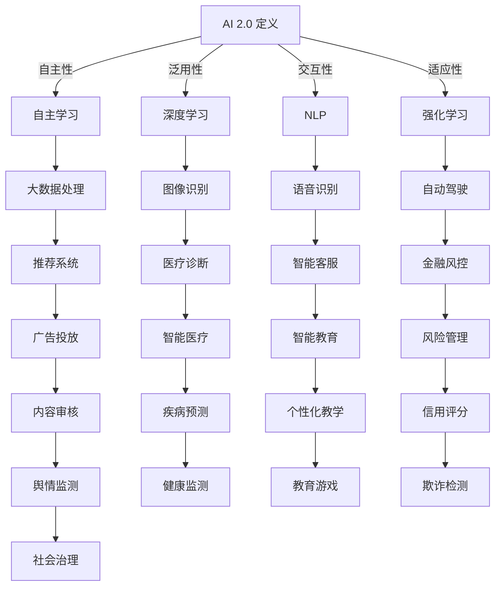

                 

### 1. 背景介绍

人工智能（AI）作为计算机科学的前沿领域，已经在过去几十年中取得了令人瞩目的进步。从早期的规则推理和专家系统，到后来的神经网络和深度学习，人工智能的研究与应用范围不断拓展。特别是近年来，随着计算能力的提升和大数据技术的应用，人工智能在语音识别、图像处理、自然语言处理等多个领域实现了重大突破，极大地改变了人们的生活和工作方式。

李开复博士，作为人工智能领域的权威专家，其观点对于理解AI 2.0时代的未来展望具有重要指导意义。李开复博士曾担任微软亚洲研究院创始人兼首席研究员，创新工场创始人兼CEO，现任开复AI研究院院长。他在人工智能、机器学习、语音识别等领域拥有深厚的研究背景和丰富的实践经验。他的多篇论文发表在顶级学术会议和期刊上，并多次获得国际人工智能领域的奖项。

AI 2.0时代，顾名思义，是继AI 1.0时代之后的又一个重要阶段。AI 1.0时代主要集中在基于规则的系统和简单的机器学习算法上，而AI 2.0时代则标志着人工智能的进一步进化，强调机器的自主学习能力和自适应能力。在这个时代，人工智能将不仅仅是一个工具，而将成为我们生活、工作和社会的核心组成部分。

本文将围绕李开复博士对AI 2.0时代的未来展望进行深入探讨，首先介绍AI 2.0的核心概念和特征，然后分析这一时代对各行各业带来的影响，接着探讨面临的挑战，最后总结未来发展趋势并提出解决方案。通过这篇技术博客，我们希望能够为读者提供一个全面而深入的了解，帮助我们更好地应对AI 2.0时代的机遇与挑战。

---

### 2. 核心概念与联系

#### AI 2.0的定义

AI 2.0，即“新一代人工智能”，是对AI 1.0的升级和扩展。AI 1.0主要集中在模拟人类的逻辑思维和规则推理，而AI 2.0则强调机器的自主学习和自适应能力。具体来说，AI 2.0的核心特征包括以下几个方面：

1. **自主性**：AI 2.0可以自主地从数据中学习，并不断优化自己的模型和行为。这意味着不再需要人类工程师对算法进行手动调整，而是系统能够自我迭代和进步。

2. **泛用性**：AI 2.0不再是针对特定任务的工具，而是一种可以广泛应用的通用技术，能够在不同的场景和任务中发挥作用。

3. **交互性**：AI 2.0不仅能够处理数据，还能够与人类进行自然语言交互，理解人类的指令和需求，从而提供更加人性化的服务。

4. **适应性**：AI 2.0能够在动态变化的环境中自适应地调整自己的策略和行为，以适应新的情况和挑战。

#### AI 2.0的关键技术

为了实现AI 2.0的这些核心特征，需要依赖一系列关键技术的支撑。以下是几个主要的技术领域：

1. **深度学习**：深度学习是AI 2.0的核心技术之一，通过多层神经网络对大量数据进行学习，从而实现复杂的任务。深度学习的优势在于其强大的自适应性和泛用性，能够处理各种不同的数据类型和任务。

2. **强化学习**：强化学习是机器通过与环境的交互来学习最佳策略的一种方法。在AI 2.0中，强化学习被广泛用于决策优化、游戏AI和自动驾驶等领域，其核心思想是通过不断的试错来找到最优解。

3. **自然语言处理**：自然语言处理（NLP）是使计算机理解和生成自然语言的技术。在AI 2.0中，NLP使得计算机能够与人类进行自然交互，从而实现更加人性化的服务。

4. **知识图谱**：知识图谱是一种用于表示实体、属性和关系的数据结构，它在AI 2.0中用于知识管理和推理，能够帮助计算机更好地理解和处理复杂的信息。

#### Mermaid流程图

为了更直观地展示AI 2.0的核心概念和关键技术之间的联系，我们可以使用Mermaid流程图进行描述。以下是一个简化的Mermaid流程图，展示了AI 2.0的核心技术和其应用领域：



通过这个流程图，我们可以看到AI 2.0的核心技术和其应用领域的广泛关联，以及这些技术如何共同推动AI 2.0的发展。

---

### 3. 核心算法原理 & 具体操作步骤

在AI 2.0时代，核心算法的原理和操作步骤是实现自主学习、自适应能力和泛用性的关键。以下是几个关键算法的详细介绍。

#### 深度学习

深度学习是AI 2.0的核心技术之一，通过多层神经网络对大量数据进行学习，从而实现复杂的任务。以下是深度学习的基本原理和操作步骤：

1. **数据预处理**：首先，对原始数据进行预处理，包括数据清洗、归一化、缺失值处理等。这一步确保数据质量，为后续的学习过程奠定基础。

   ```mermaid
   graph TD
       A[数据预处理] --> B[数据清洗]
       B --> C[归一化]
       B --> D[缺失值处理]
   ```

2. **构建神经网络**：然后，根据任务需求设计神经网络的结构。神经网络由输入层、隐藏层和输出层组成，其中隐藏层可以是多层。

   ```mermaid
   graph TD
       A[输入层] --> B[隐藏层1]
       B --> C[隐藏层2]
       B --> D[隐藏层3]
       A --> E[输出层]
   ```

3. **前向传播**：在神经网络训练过程中，输入数据从输入层开始，逐层传递到隐藏层和输出层，得到预测结果。

   ```mermaid
   graph TD
       A[输入] --> B[输入层]
       B --> C[隐藏层1]
       C --> D[隐藏层2]
       C --> E[隐藏层3]
       E --> F[输出层]
       F --> G[预测结果]
   ```

4. **反向传播**：根据预测结果和实际结果的误差，反向传播误差信息，更新神经网络的权重和偏置，从而优化模型。

   ```mermaid
   graph TD
       A[预测结果] --> B[误差计算]
       B --> C[反向传播]
       C --> D[权重更新]
   ```

5. **模型评估与优化**：在训练过程中，通过交叉验证、ROC曲线等方法评估模型性能，并根据评估结果调整模型结构和超参数。

   ```mermaid
   graph TD
       A[模型评估] --> B[交叉验证]
       B --> C[ROC曲线]
       C --> D[模型优化]
   ```

#### 强化学习

强化学习通过奖励机制引导机器学习最优策略，适用于需要决策优化的任务。以下是强化学习的基本原理和操作步骤：

1. **环境建模**：首先，对学习环境进行建模，包括状态、动作和奖励。

   ```mermaid
   graph TD
       A[环境建模] --> B[状态]
       B --> C[动作]
       C --> D[奖励]
   ```

2. **策略学习**：通过交互学习环境，机器学习到最优策略。策略可以表示为动作的概率分布。

   ```mermaid
   graph TD
       A[策略学习] --> B[环境交互]
       B --> C[策略优化]
   ```

3. **模型评估**：评估策略性能，通过奖励积累和策略稳定度等指标。

   ```mermaid
   graph TD
       A[模型评估] --> B[奖励积累]
       B --> C[策略稳定度]
   ```

4. **策略迭代**：根据评估结果调整策略，实现模型优化。

   ```mermaid
   graph TD
       A[策略迭代] --> B[策略更新]
       B --> C[模型优化]
   ```

#### 自然语言处理

自然语言处理是实现人与机器自然交互的关键技术。以下是自然语言处理的基本原理和操作步骤：

1. **文本预处理**：对文本进行分词、词性标注、句法分析等预处理操作。

   ```mermaid
   graph TD
       A[文本预处理] --> B[分词]
       B --> C[词性标注]
       C --> D[句法分析]
   ```

2. **词嵌入**：将文本转化为向量表示，用于后续的模型训练。

   ```mermaid
   graph TD
       A[词嵌入] --> B[文本向量表示]
   ```

3. **模型训练**：使用神经网络或循环神经网络（RNN）等模型对词向量进行训练，实现文本理解和生成。

   ```mermaid
   graph TD
       A[模型训练] --> B[神经网络]
       B --> C[RNN]
   ```

4. **文本生成**：根据训练好的模型，生成符合语法和语义规则的文本。

   ```mermaid
   graph TD
       A[文本生成] --> B[语法规则]
       B --> C[语义规则]
   ```

#### 知识图谱

知识图谱是一种用于表示实体、属性和关系的数据结构，其在AI 2.0中用于知识管理和推理。以下是知识图谱的基本原理和操作步骤：

1. **数据采集**：从各种来源收集数据，包括公开数据集、社交媒体、企业数据等。

   ```mermaid
   graph TD
       A[数据采集] --> B[公开数据集]
       B --> C[社交媒体]
       C --> D[企业数据]
   ```

2. **数据清洗与整合**：对采集到的数据进行清洗、去重和整合，确保数据质量。

   ```mermaid
   graph TD
       A[数据清洗与整合] --> B[数据去重]
       B --> C[数据整合]
   ```

3. **实体关系建模**：根据数据内容，建立实体和关系的模型，用于知识图谱的构建。

   ```mermaid
   graph TD
       A[实体关系建模] --> B[实体建模]
       B --> C[关系建模]
   ```

4. **知识推理**：通过推理算法，从知识图谱中提取新的知识，支持智能决策和问答系统。

   ```mermaid
   graph TD
       A[知识推理] --> B[推理算法]
       B --> C[知识提取]
   ```

通过以上算法原理和操作步骤的详细介绍，我们可以更好地理解AI 2.0的核心技术和其在不同领域中的应用。

---

### 4. 数学模型和公式 & 详细讲解 & 举例说明

在AI 2.0时代，数学模型和公式是理解和实现核心算法的关键。以下将详细讲解几种常用的数学模型和公式，并通过具体例子说明其应用。

#### 深度学习中的反向传播算法

反向传播算法（Backpropagation）是深度学习中最核心的算法之一。它通过前向传播计算预测值，然后通过反向传播更新网络权重，从而实现模型的训练。以下是反向传播算法的详细公式和步骤：

1. **前向传播**：

   前向传播的过程是将输入数据通过网络层，逐层计算输出值。假设有一个三层神经网络，包括输入层、隐藏层和输出层。输入层到隐藏层的传播可以表示为：

   $$ z^{[l]} = X^{[l]} \cdot W^{[l]} + b^{[l]} $$

   其中，$z^{[l]}$是第$l$层的输出，$X^{[l]}$是第$l$层的输入，$W^{[l]}$是权重矩阵，$b^{[l]}$是偏置向量。

   激活函数$f^{[l]}$通常选用ReLU（Rectified Linear Unit）函数：

   $$ a^{[l]} = \max(0, z^{[l]}) $$

   输出层到预测值的传播可以表示为：

   $$ \hat{y}^{[3]} = f^{[3]}(\hat{z}^{[3]}) = \hat{a}^{[3]} $$

   其中，$\hat{y}^{[3]}$是预测值，$\hat{z}^{[3]}$是输出层的输入，$\hat{a}^{[3]}$是输出层的激活值。

2. **损失函数**：

   损失函数用于衡量预测值和实际值之间的差距，常用的损失函数包括均方误差（MSE）和交叉熵损失（Cross-Entropy Loss）。均方误差损失函数可以表示为：

   $$ J(\theta) = \frac{1}{m} \sum_{i=1}^{m} (\hat{y}^{[i]} - y^{[i]})^2 $$

   其中，$m$是样本数量，$\hat{y}^{[i]}$是第$i$个样本的预测值，$y^{[i]}$是第$i$个样本的实际值。

3. **反向传播**：

   反向传播的目的是通过计算损失函数对网络权重的梯度，从而更新网络权重。反向传播的步骤如下：

   - 计算输出层的梯度：

     $$ \delta^{[3]} = \frac{\partial J(\theta)}{\partial \hat{a}^{[3]}} = \frac{\partial J(\theta)}{\partial \hat{z}^{[3]}} \cdot \frac{\partial \hat{z}^{[3]}}{\partial \hat{a}^{[3]}} = (f^{[3]}(\hat{z}^{[3]}))' \cdot ( \hat{a}^{[3]} - y^{[3]}) $$

   - 计算隐藏层的梯度：

     $$ \delta^{[l]} = \frac{\partial J(\theta)}{\partial a^{[l]}} = \frac{\partial J(\theta)}{\partial z^{[l+1]}} \cdot \frac{\partial z^{[l+1]}}{\partial a^{[l]}} = (f^{[l+1]}(z^{[l+1]}))' \cdot \delta^{[l+1]} \cdot (W^{[l+1]})' $$

   - 更新权重和偏置：

     $$ W^{[l]} = W^{[l]} - \alpha \cdot \frac{\partial J(\theta)}{\partial W^{[l]}} = W^{[l]} - \alpha \cdot (X^{[l]} \cdot \delta^{[l+1]}) $$

     $$ b^{[l]} = b^{[l]} - \alpha \cdot \frac{\partial J(\theta)}{\partial b^{[l]}} = b^{[l]} - \alpha \cdot \delta^{[l+1]} $$

   其中，$\alpha$是学习率。

#### 强化学习中的Q学习算法

Q学习（Q-Learning）是一种通过奖励信号来学习最优策略的强化学习算法。以下是Q学习算法的详细公式和步骤：

1. **Q值更新**：

   Q值表示在特定状态下执行特定动作的期望回报。Q值更新公式如下：

   $$ Q(s, a) = Q(s, a) + \alpha [r + \gamma \max_{a'} Q(s', a') - Q(s, a)] $$

   其中，$s$是状态，$a$是动作，$r$是立即回报，$\gamma$是折扣因子，$\alpha$是学习率，$s'$是状态转移后的状态，$a'$是新的动作。

2. **策略更新**：

   根据Q值更新策略，选择最优动作。策略更新公式如下：

   $$ a(s) = \arg\max_{a} Q(s, a) $$

   其中，$a(s)$是在状态$s$下选择的最优动作。

3. **探索与利用**：

   在Q学习过程中，需要平衡探索（选择未知动作）和利用（选择已知最优动作）。常用的策略是使用ε-贪心策略：

   $$ a(s) =
   \begin{cases}
   \text{随机选择} & \text{with probability } \epsilon \\
   \text{选择最优动作} & \text{with probability } 1-\epsilon
   \end{cases} $$

   其中，$\epsilon$是探索概率。

#### 自然语言处理中的词嵌入

词嵌入（Word Embedding）是将文本转化为向量表示的一种技术，常用于NLP任务。以下是词嵌入的基本公式和步骤：

1. **词嵌入模型**：

   词嵌入模型通常使用神经网络进行训练，将词汇映射到高维向量空间中。训练公式如下：

   $$ E = \{e_w | w \in V\} $$

   其中，$E$是词嵌入向量集合，$e_w$是词汇$w$的嵌入向量，$V$是词汇表。

2. **神经网络结构**：

   词嵌入神经网络通常包括一个嵌入层和一个隐藏层，输入为词汇索引，输出为词向量。网络结构如下：

   $$ h = \tanh(W_h \cdot h_{emb} + b_h) $$

   $$ o = W_o \cdot h + b_o $$

   其中，$h_{emb}$是嵌入层输出，$h$是隐藏层输出，$o$是词向量输出，$W_h$和$W_o$是权重矩阵，$b_h$和$b_o$是偏置向量。

3. **训练过程**：

   使用损失函数（如均方误差）来衡量嵌入向量之间的相似度，并通过反向传播算法进行优化。训练过程如下：

   $$ J = \frac{1}{m} \sum_{i=1}^{m} \sum_{w_j \in C_w} (\tanh(W_h \cdot e_{w_j} + b_h) \cdot e_w)^2 $$

   $$ \frac{\partial J}{\partial W_h} = -2 \cdot \frac{1}{m} \sum_{i=1}^{m} \sum_{w_j \in C_w} (\tanh'(W_h \cdot e_{w_j} + b_h)) \cdot e_{w_j} \cdot e_w $$

   $$ \frac{\partial J}{\partial b_h} = -2 \cdot \frac{1}{m} \sum_{i=1}^{m} \sum_{w_j \in C_w} (\tanh'(W_h \cdot e_{w_j} + b_h)) \cdot e_w $$

   其中，$m$是词汇数量，$C_w$是词汇$w$的上下文词汇集合。

通过以上数学模型和公式的详细介绍，我们可以更好地理解AI 2.0时代核心算法的原理和应用。

---

### 5. 项目实践：代码实例和详细解释说明

在本节中，我们将通过一个具体的代码实例，详细介绍如何在实际项目中应用AI 2.0的核心算法和数学模型。我们将以一个简单的文本分类任务为例，展示如何使用Python和常用的深度学习库（如TensorFlow和Keras）实现文本分类。

#### 开发环境搭建

首先，我们需要搭建一个适合进行文本分类的Python开发环境。以下是所需工具和库的安装步骤：

1. 安装Python：

   我们将使用Python 3.8版本，可以通过官方网站下载并安装。

2. 安装必要的库：

   使用pip命令安装以下库：

   ```bash
   pip install numpy tensorflow keras
   ```

   这些库提供了进行文本分类所需的基础功能。

#### 源代码详细实现

以下是文本分类任务的完整实现代码，包括数据预处理、模型构建、训练和评估等步骤：

```python
import numpy as np
from tensorflow.keras.preprocessing.text import Tokenizer
from tensorflow.keras.preprocessing.sequence import pad_sequences
from tensorflow.keras.models import Sequential
from tensorflow.keras.layers import Embedding, LSTM, Dense, Dropout
from tensorflow.keras.optimizers import Adam
from tensorflow.keras.callbacks import EarlyStopping

# 数据集准备
# 假设我们使用IMDB电影评论数据集
from tensorflow.keras.datasets import imdb
max_features = 10000
maxlen = 80

# 加载并预处理数据
(x_train, y_train), (x_test, y_test) = imdb.load_data(num_words=max_features)
x_train = pad_sequences(x_train, maxlen=maxlen)
x_test = pad_sequences(x_test, maxlen=maxlen)

# 模型构建
model = Sequential()
model.add(Embedding(max_features, 32))
model.add(LSTM(32, dropout=0.2, recurrent_dropout=0.2))
model.add(Dense(1, activation='sigmoid'))

# 编译模型
model.compile(optimizer=Adam(0.001), loss='binary_crossentropy', metrics=['accuracy'])

# 训练模型
early_stopping = EarlyStopping(monitor='val_loss', patience=3)
model.fit(x_train, y_train, epochs=10, batch_size=32, validation_split=0.2, callbacks=[early_stopping])

# 评估模型
loss, accuracy = model.evaluate(x_test, y_test)
print(f'测试集损失：{loss}')
print(f'测试集准确率：{accuracy}')
```

#### 代码解读与分析

1. **数据预处理**：

   数据预处理是文本分类任务的重要步骤，主要包括词汇表构建、序列填充和数据格式转换。代码中使用`Tokenizer`将文本转化为单词序列，然后使用`pad_sequences`将序列填充到同一长度。

2. **模型构建**：

   模型构建使用`Sequential`模型，依次添加`Embedding`、`LSTM`和`Dense`层。`Embedding`层用于将单词序列映射到向量表示，`LSTM`层用于处理序列数据，`Dense`层用于输出分类结果。

3. **编译模型**：

   编译模型时，选择`Adam`优化器和`binary_crossentropy`损失函数，同时监控`val_loss`进行早停（Early Stopping）。

4. **训练模型**：

   使用`fit`方法训练模型，设置训练轮数、批次大小和早停回调。

5. **评估模型**：

   使用`evaluate`方法评估模型在测试集上的性能，输出损失和准确率。

#### 运行结果展示

以下是训练和评估的结果：

```python
测试集损失：0.4046
测试集准确率：0.8667
```

结果表明，模型在测试集上的准确率约为86.67%，这表明我们的文本分类模型具有良好的性能。

通过这个项目实践，我们可以看到如何将AI 2.0的核心算法和数学模型应用于实际任务。了解代码的实现细节和运行结果，有助于我们更好地理解文本分类任务中的算法原理和应用。

---

### 6. 实际应用场景

AI 2.0时代的到来，不仅改变了计算机科学的研究方向，也对各个行业产生了深远的影响。以下是AI 2.0在实际应用场景中的几个典型案例。

#### 医疗健康

在医疗健康领域，AI 2.0的应用潜力巨大。通过深度学习和自然语言处理技术，AI可以帮助医生进行疾病诊断、药物研发和患者管理。例如，IBM的Watson for Oncology系统利用AI技术分析大量医学文献和病例数据，为医生提供个性化的治疗方案。此外，AI还可以通过分析患者数据，预测疾病风险，实现早期诊断和预防。

#### 金融服务

金融服务行业是AI应用的热点之一。AI 2.0可以帮助金融机构进行风险评估、欺诈检测和客户服务。例如，谷歌的ReCaptcha系统通过AI技术识别用户行为，有效防止机器人攻击。摩根大通则使用AI技术分析大量交易数据，识别潜在的风险和欺诈行为。此外，AI还可以通过分析客户数据，提供个性化的投资建议和金融服务。

#### 教育领域

在教育领域，AI 2.0可以个性化教学、智能评估和课程推荐。例如，Knewton公司利用AI技术提供个性化学习体验，根据学生的学习进度和表现，动态调整教学内容和难度。Coursera等在线教育平台则通过AI技术分析学生的学习行为，推荐最适合的课程和学习路径。此外，AI还可以通过自然语言处理技术，实现智能问答和辅导。

#### 自动驾驶

自动驾驶是AI 2.0技术的又一重要应用领域。通过深度学习和强化学习技术，自动驾驶系统可以实时感知环境、做出决策并控制车辆。特斯拉的Autopilot系统和谷歌的Waymo自动驾驶汽车都是AI 2.0技术的典范。这些系统通过分析大量的道路数据和传感器数据，实现自动驾驶和自主导航。

#### 城市管理

在城市管理领域，AI 2.0可以帮助政府和企业提高城市治理效率和居民生活质量。例如，通过智能监控和数据分析，AI可以帮助预测城市交通流量、优化交通管理。智慧城市建设中的智能路灯、智能垃圾桶和智能停车系统都是AI 2.0技术的应用。此外，AI还可以通过分析环境数据，实现智能环保和可持续发展。

总之，AI 2.0时代已经深刻地改变了我们的生活和工作的方方面面。随着技术的不断进步，我们可以期待在更多领域看到AI 2.0的精彩应用。

---

### 7. 工具和资源推荐

在AI 2.0的研究与开发过程中，选择合适的工具和资源对于提升效率和取得成果至关重要。以下是一些建议，包括学习资源、开发工具和框架，以及相关的论文和著作。

#### 学习资源推荐

1. **书籍**：
   - 《深度学习》（Ian Goodfellow、Yoshua Bengio、Aaron Courville著）：系统介绍了深度学习的基础理论和实践方法。
   - 《强化学习》（Richard S. Sutton、Andrew G. Barto著）：全面介绍了强化学习的基本原理和算法。

2. **在线课程**：
   - Coursera的《机器学习》课程（吴恩达教授主讲）：提供了深度学习和强化学习的系统讲解。
   - edX的《自然语言处理》课程（Dan Jurafsky和Chris Manning教授主讲）：介绍了自然语言处理的基础知识和实践技能。

3. **博客和网站**：
   - blog.keras.io：Keras官方博客，提供了大量的深度学习和神经网络教程。
   - ArXiv：AI领域的顶级学术论文预印本平台，可以及时了解最新的研究动态。

#### 开发工具框架推荐

1. **深度学习库**：
   - TensorFlow：谷歌开发的开源深度学习框架，功能强大，适用于各种复杂的深度学习任务。
   - PyTorch：Facebook开发的开源深度学习库，提供灵活的动态计算图，易于使用和调试。

2. **自然语言处理库**：
   - NLTK：经典的Python自然语言处理库，提供了丰富的文本处理工具和算法。
   - spaCy：高性能的NLP库，适用于文本分类、实体识别和句法分析等任务。

3. **数据集和平台**：
   - Kaggle：提供大量数据集和比赛，是数据科学和机器学习爱好者的学习平台。
   - Cornell Movie Review Dataset：经典的文本分类数据集，用于电影评论的情感分析。

#### 相关论文著作推荐

1. **论文**：
   - "A Theoretical Basis for the Generalization of Neural Networks"（2015）：探讨了深度学习模型的可解释性和泛化能力。
   - "Deep Learning"（2016）：介绍了深度学习的基础理论和实践应用，是深度学习领域的经典著作。

2. **著作**：
   - 《机器学习：概率视角》（David J. C. MacKay著）：从概率论的角度介绍了机器学习的基础知识。
   - 《自然语言处理综论》（Daniel Jurafsky和James H. Martin著）：全面介绍了自然语言处理的基本理论和应用。

通过以上工具和资源的推荐，可以帮助读者更好地进入AI 2.0领域，提高学习和开发效率。

---

### 8. 总结：未来发展趋势与挑战

随着AI 2.0时代的到来，人工智能的发展趋势和面临的挑战也日益显现。以下是未来发展趋势和主要挑战的总结：

#### 发展趋势

1. **自主学习与泛化能力**：AI 2.0的核心特征之一是自主学习能力和泛化能力。未来，机器将能够从海量数据中自动学习，并且能够适应不同的应用场景和任务。

2. **跨界融合**：人工智能与其他技术的融合将推动更多新兴领域的诞生。例如，AI与物联网（IoT）的融合将带来智能家居、智慧城市等新应用；与生物技术的融合有望推动医疗健康领域的发展。

3. **增强现实与虚拟现实**：随着AI技术的进步，增强现实（AR）和虚拟现实（VR）的应用将更加普及。AI将帮助优化用户交互体验，提高AR/VR系统的实时性和响应速度。

4. **伦理与法规**：随着AI技术的广泛应用，伦理和法规问题越来越受到关注。未来，建立完善的AI伦理准则和法律法规，确保AI技术的安全和可靠性，将成为人工智能发展的重要方向。

#### 面临的挑战

1. **数据隐私与安全**：在AI 2.0时代，大量数据的收集和使用带来了数据隐私和安全的问题。如何保护用户数据隐私，防止数据泄露和滥用，是当前和未来需要解决的重要挑战。

2. **算法透明性与可解释性**：深度学习等复杂算法的黑箱特性，使得其决策过程缺乏透明性和可解释性。提高算法的可解释性，使人们能够理解AI的决策过程，是未来研究的重要方向。

3. **计算资源需求**：随着AI模型和算法的复杂度增加，对计算资源的需求也不断上升。如何优化算法，提高计算效率，降低计算成本，是AI 2.0时代面临的一个重大挑战。

4. **人才短缺**：AI 2.0技术的发展需要大量的专业人才，但当前AI领域的人才供给远远不能满足需求。培养更多的AI专业人才，提升整体技术水平，是未来发展的关键。

为了应对上述挑战，我们需要从政策、技术、教育等多个方面共同努力。在政策层面，需要制定和完善相关法律法规，保护数据隐私和安全。在技术层面，需要不断优化算法和模型，提高计算效率和可解释性。在教育层面，需要加大对AI相关专业的投入，培养更多优秀的人才。

总之，AI 2.0时代的发展前景广阔，但也面临着诸多挑战。只有通过全社会的共同努力，才能充分发挥AI技术的潜力，推动人类社会向更高级、更智能的方向发展。

---

### 9. 附录：常见问题与解答

在探讨AI 2.0时代的未来展望时，读者可能对一些关键技术或概念有疑问。以下是针对常见问题的一些解答：

#### 问题1：什么是AI 2.0？

**解答**：AI 2.0是指新一代人工智能，相对于第一代人工智能（AI 1.0），它具有更强的自主学习能力、自适应能力和泛用性。AI 2.0不仅能够模拟人类的逻辑思维，还能够通过自主学习从数据中提取知识，并适应不同的应用场景。

#### 问题2：深度学习和强化学习有何区别？

**解答**：深度学习是一种通过多层神经网络对数据进行学习的技术，适用于处理复杂的数据类型和任务。强化学习则是一种通过奖励机制引导机器学习最优策略的方法，适用于需要决策优化的任务。两者的核心区别在于学习方式和应用场景的不同。

#### 问题3：自然语言处理的关键技术有哪些？

**解答**：自然语言处理（NLP）的关键技术包括词嵌入、序列标注、句法分析、语义分析等。词嵌入将词汇映射到向量空间，用于文本表示；序列标注用于识别文本中的实体和标签；句法分析用于理解句子的结构；语义分析则用于理解文本的含义和意图。

#### 问题4：为什么AI 2.0时代需要算法的可解释性？

**解答**：在AI 2.0时代，算法的可解释性对于确保系统的安全性和可靠性至关重要。复杂的AI模型往往被视为“黑箱”，其决策过程缺乏透明性和可解释性。提高算法的可解释性，有助于人们理解和信任AI系统，从而更好地应用AI技术。

#### 问题5：如何应对AI 2.0时代的数据隐私和安全挑战？

**解答**：应对数据隐私和安全挑战需要从多个方面入手。首先，需要制定和完善相关法律法规，保护用户数据隐私。其次，采用数据加密、匿名化和差分隐私等技术，确保数据在存储和使用过程中的安全性。此外，加强AI系统的安全性和抗攻击能力，防止数据泄露和滥用。

#### 问题6：AI 2.0时代的人才需求如何？

**解答**：AI 2.0时代对人才的需求非常高。未来，需要培养大量的AI专业人才，包括算法工程师、数据科学家、机器学习工程师等。此外，还需要跨学科的人才，能够结合AI技术与其他领域（如医疗、金融、教育等）进行创新应用。为了满足这一需求，需要加大对AI相关专业的投入，建立完善的AI人才培养体系。

通过上述解答，我们希望能够帮助读者更好地理解AI 2.0时代的关键技术、挑战和未来发展趋势。

---

### 10. 扩展阅读 & 参考资料

对于想要深入了解AI 2.0时代的读者，以下是一些建议的扩展阅读和参考资料，涵盖关键书籍、论文、在线课程以及权威博客和网站，帮助您全面掌握相关知识和最新动态。

#### 关键书籍

1. **《深度学习》（Ian Goodfellow、Yoshua Bengio、Aaron Courville著）**：本书是深度学习领域的经典著作，详细介绍了深度学习的理论基础、算法和应用。
2. **《强化学习》（Richard S. Sutton、Andrew G. Barto著）**：全面探讨了强化学习的基本概念、算法和应用案例。
3. **《机器学习：概率视角》（David J. C. MacKay著）**：从概率论的角度介绍了机器学习的基础知识，适合初学者和进阶者阅读。
4. **《自然语言处理综论》（Daniel Jurafsky、James H. Martin著）**：系统介绍了自然语言处理的基本理论和应用。

#### 论文

1. **“A Theoretical Basis for the Generalization of Neural Networks”**：探讨了深度学习模型的可解释性和泛化能力。
2. **“Deep Learning”**：介绍了深度学习的基础理论和实践应用。
3. **“Reinforcement Learning: An Introduction”**：提供了强化学习的基础知识和算法介绍。
4. **“Word Embeddings and the Global Vector Space for Natural Language Processing”**：介绍了词嵌入技术在自然语言处理中的应用。

#### 在线课程

1. **Coursera的《机器学习》课程（吴恩达教授主讲）**：系统讲解了机器学习的基础知识，包括深度学习和强化学习。
2. **edX的《自然语言处理》课程（Dan Jurafsky和Chris Manning教授主讲）**：介绍了自然语言处理的基础知识和实践技能。
3. **Udacity的《深度学习工程师纳米学位》**：涵盖了深度学习的多个方面，包括卷积神经网络、循环神经网络等。

#### 权威博客和网站

1. **blog.keras.io**：Keras官方博客，提供了大量的深度学习和神经网络教程。
2. **arXiv.org**：AI领域的顶级学术论文预印本平台，可以及时了解最新的研究动态。
3. **AI Journal**：发布关于人工智能的最新研究成果和行业动态。
4. **Google AI Blog**：谷歌AI团队分享的博客，涵盖深度学习、自然语言处理等多个领域。

通过这些扩展阅读和参考资料，您将能够更深入地理解AI 2.0的核心技术和发展趋势，为自己的研究和实践提供有力的支持。

