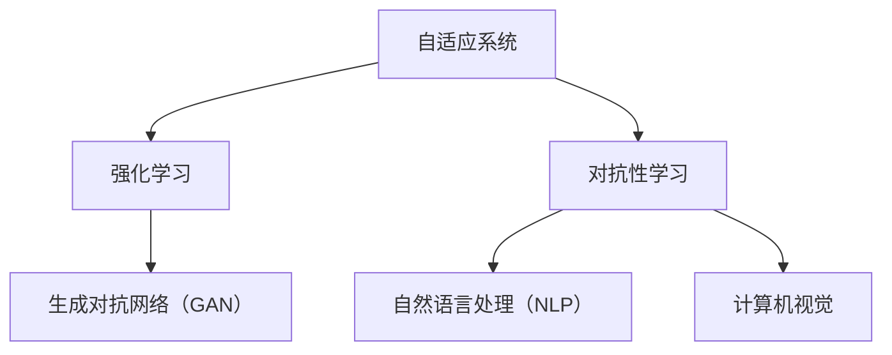

                 

### 背景介绍

#### AI 的发展与李开复的贡献

人工智能（AI）作为计算机科学的一个分支，其发展历程可以追溯到20世纪50年代。当时，科学家们首次提出了“人工智能”这一概念，希望机器能够模拟人类的智能行为，解决复杂的决策问题。随着计算机技术的飞速发展，AI经历了数次的起伏与迭代，从最初的规则推理、知识表示，到20世纪80年代的专家系统，再到21世纪的深度学习与大数据，AI技术不断演进，取得了令人瞩目的成果。

在这个过程中，李开复作为世界著名的人工智能专家，他的贡献不可忽视。李开复拥有哈佛大学计算机博士学位，曾担任谷歌、微软等公司的要职，并创办了创新工场。他不仅在学术领域取得了卓越的成就，更在业界推动AI技术的发展和应用。

李开复对AI的贡献主要体现在以下几个方面：

1. **理论研究与技术创新**：李开复在自然语言处理、机器学习等领域发表了大量的学术论文，推动了相关技术的进步。他提出的“深度学习模型”为后续的AI研究奠定了基础。

2. **产业推动与创业实践**：李开复不仅关注理论研究，还积极投身于产业实践。他在谷歌期间推动了多个AI产品的开发，并在创新工场投资和扶持了众多AI初创公司，推动了AI技术的商业化应用。

3. **教育与普及**：李开复致力于将AI知识普及给大众，他撰写了《人工智能：一种现代的方法》、《深度学习》等畅销书籍，为全球的AI爱好者提供了宝贵的指导资料。

#### AI 1.0 时代的局限

尽管AI技术在过去的几十年里取得了显著进展，但传统的人工智能，即AI 1.0时代，仍然存在一些局限和挑战。

1. **规则依赖**：AI 1.0时代主要依赖于专家系统，这些系统需要人工编写大量的规则来指导机器的决策。这种方法不仅复杂度高，而且难以处理现实世界中的复杂问题。

2. **数据依赖**：AI 1.0时代依赖于大量结构化的数据，而这些数据往往难以获取。同时，数据的准确性和完整性也对AI系统的性能产生了重要影响。

3. **通用性不足**：AI 1.0时代的系统通常只能在特定领域和任务中表现良好，缺乏跨领域的通用性。

4. **可解释性差**：传统AI系统的工作原理和决策过程往往难以解释，这使得用户难以信任和理解AI系统的行为。

为了解决这些问题，AI领域开始探索新的方向，即AI 2.0时代。在接下来的章节中，我们将详细探讨AI 2.0的核心概念、关键技术以及其在生态构建中的应用。

---

在接下来的内容中，我们将逐步深入探讨AI 2.0时代的核心概念与联系，核心算法原理与具体操作步骤，以及AI 2.0在不同应用场景中的实践与挑战。通过逐步分析推理，我们将揭示AI 2.0如何引领未来科技发展的新篇章。

---

## 1. 核心概念与联系

在进入AI 2.0时代之前，我们需要明确一些核心概念，理解这些概念之间的联系，有助于我们更好地把握AI 2.0的发展脉络。

#### 自适应系统

自适应系统是指能够根据外部环境和内部状态的变化，自动调整自身行为和功能的系统。在AI 2.0时代，自适应系统的重要性日益凸显。与传统AI系统不同，自适应系统能够在缺乏明确规则和数据的情况下，通过不断学习和优化，提高系统的适应性和灵活性。

#### 强化学习

强化学习是一种机器学习方法，通过奖励和惩罚机制，使系统在与环境的交互过程中不断优化自身行为。强化学习在游戏、自动驾驶、推荐系统等领域有着广泛的应用。与传统的监督学习和无监督学习不同，强化学习强调系统的自主学习和决策能力。

#### 对抗性学习

对抗性学习是AI 2.0时代的一种新兴技术，通过模拟对抗环境，使系统在与对手的竞争中不断进步。对抗性学习在网络安全、图像识别、语音识别等领域表现出强大的潜力。

#### 生成对抗网络（GAN）

生成对抗网络（GAN）是一种对抗性学习模型，由生成器和判别器组成。生成器试图生成逼真的数据，而判别器则判断数据是真实还是生成的。GAN在图像生成、文本生成、风格迁移等领域取得了突破性进展。

#### 自然语言处理（NLP）

自然语言处理是AI 2.0时代的重要领域，旨在使计算机理解和生成人类语言。NLP在智能客服、机器翻译、文本分析等领域有着广泛的应用。

#### 计算机视觉

计算机视觉是AI 2.0时代的一个重要分支，通过让计算机理解图像和视频中的内容，实现人机交互、自动驾驶、安防监控等功能。计算机视觉技术在医疗诊断、工业质检、自动驾驶等领域发挥着重要作用。

#### Mermaid 流程图

为了更直观地展示这些核心概念之间的联系，我们可以使用Mermaid流程图来描述。以下是一个简化的Mermaid流程图示例：



在这个流程图中，自适应系统作为基础，衍生出强化学习、对抗性学习、自然语言处理和计算机视觉等多个方向。这些方向相互交织，共同构建了AI 2.0时代的生态体系。

---

在了解了这些核心概念之后，我们将在下一章节中深入探讨AI 2.0的核心算法原理与具体操作步骤，分析这些算法如何在不同应用场景中发挥作用。

## 2. 核心算法原理 & 具体操作步骤

AI 2.0时代的核心算法包括强化学习、对抗性学习、生成对抗网络（GAN）、自然语言处理（NLP）和计算机视觉等。下面我们将逐一介绍这些算法的基本原理和具体操作步骤。

#### 强化学习

强化学习是一种通过奖励和惩罚机制，使系统在与环境的交互过程中不断优化自身行为的机器学习方法。其基本原理可以概括为以下几个步骤：

1. **初始化**：定义状态空间、动作空间和奖励函数。状态空间表示系统可能处于的所有状态，动作空间表示系统能够执行的所有动作，奖励函数用于评估系统的行为。

2. **状态观察**：系统根据当前状态选择一个动作。

3. **动作执行**：系统执行选择的动作，并观察环境状态的变化。

4. **奖励评估**：根据执行动作后的奖励函数评估动作的好坏。

5. **行为调整**：系统根据奖励评估结果，调整后续的行为策略。

具体操作步骤如下：

1. **定义状态空间**：例如，在自动驾驶场景中，状态空间可以包括车辆的位置、速度、周围车辆的信息等。

2. **定义动作空间**：例如，在自动驾驶场景中，动作空间可以包括加速、减速、转向等。

3. **定义奖励函数**：例如，在自动驾驶场景中，可以设置安全行驶、避免碰撞等作为奖励。

4. **选择动作**：使用策略网络或价值网络选择最佳动作。

5. **执行动作**：根据选择的动作执行相应的操作。

6. **评估奖励**：根据执行动作后的结果评估奖励。

7. **调整行为策略**：根据奖励评估结果，调整策略网络或价值网络。

#### 对抗性学习

对抗性学习是一种通过模拟对抗环境，使系统在与对手的竞争中不断进步的机器学习方法。其基本原理可以概括为以下几个步骤：

1. **初始化**：定义生成器和判别器，生成器试图生成逼真的数据，判别器则判断数据是真实还是生成的。

2. **生成数据**：生成器生成虚假数据，判别器同时接收真实数据和虚假数据。

3. **对抗训练**：生成器和判别器相互对抗，生成器不断优化生成虚假数据，判别器则不断优化判断真实和虚假数据。

4. **评估性能**：根据生成器和判别器的性能评估训练效果。

具体操作步骤如下：

1. **定义生成器**：例如，在图像生成任务中，生成器可以是一个神经网络，用于生成逼真的图像。

2. **定义判别器**：例如，在图像生成任务中，判别器可以是一个神经网络，用于判断图像是真实还是生成的。

3. **生成虚假数据**：生成器生成虚假数据，例如生成一张新图像。

4. **判断数据真实性**：判别器判断生成数据和真实数据。

5. **对抗训练**：生成器和判别器相互对抗，生成器不断优化生成虚假数据，判别器则不断优化判断真实和虚假数据。

6. **评估性能**：例如，可以通过计算生成数据的准确率、FID（Frechet Inception Distance）等指标来评估生成器和判别器的性能。

#### 自然语言处理（NLP）

自然语言处理是AI 2.0时代的一个重要分支，旨在使计算机理解和生成人类语言。其基本原理可以概括为以下几个步骤：

1. **文本预处理**：对原始文本进行清洗、分词、词性标注等处理，提取有用的信息。

2. **词向量表示**：将文本中的词语转换为向量表示，常用的方法包括Word2Vec、BERT等。

3. **序列建模**：使用神经网络模型对文本序列进行建模，常用的方法包括循环神经网络（RNN）、长短时记忆网络（LSTM）、变换器（Transformer）等。

4. **语义理解**：根据模型对文本序列的建模结果，进行语义理解和分析，例如情感分析、问答系统、机器翻译等。

具体操作步骤如下：

1. **文本预处理**：例如，可以使用NLTK、spaCy等库进行文本预处理。

2. **词向量表示**：例如，可以使用Word2Vec算法将词语转换为向量表示。

3. **序列建模**：例如，可以使用LSTM或Transformer模型对文本序列进行建模。

4. **语义理解**：根据模型对文本序列的建模结果，进行语义理解和分析。

#### 计算机视觉

计算机视觉是AI 2.0时代的一个重要分支，通过让计算机理解图像和视频中的内容，实现人机交互、自动驾驶、安防监控等功能。其基本原理可以概括为以下几个步骤：

1. **图像预处理**：对原始图像进行预处理，例如缩放、裁剪、灰度化等。

2. **特征提取**：使用卷积神经网络（CNN）等算法提取图像中的特征。

3. **图像分类**：使用分类算法对提取的特征进行分类，例如支持向量机（SVM）、决策树（DT）等。

4. **目标检测**：使用目标检测算法检测图像中的目标位置，例如R-CNN、YOLO等。

具体操作步骤如下：

1. **图像预处理**：例如，可以使用OpenCV库对图像进行预处理。

2. **特征提取**：例如，可以使用VGG、ResNet等卷积神经网络提取图像特征。

3. **图像分类**：例如，可以使用SVM或决策树对提取的特征进行分类。

4. **目标检测**：例如，可以使用R-CNN或YOLO等目标检测算法检测图像中的目标。

通过以上介绍，我们可以看到AI 2.0时代的关键算法在理论原理和实际操作步骤上都有着丰富的内容。这些算法相互关联，共同推动了AI技术的发展。在下一章节中，我们将进一步探讨这些算法在实际应用场景中的具体应用和挑战。

## 3. 数学模型和公式 & 详细讲解 & 举例说明

在深入探讨AI 2.0的核心算法时，理解其背后的数学模型和公式至关重要。以下是强化学习、对抗性学习和自然语言处理（NLP）等领域的一些重要数学模型和公式，并结合实际例子进行详细讲解。

### 强化学习

强化学习的核心在于通过奖励和惩罚机制，指导智能体在环境中的行动策略。以下是一个基本的强化学习模型及其关键公式：

**1. 状态-动作价值函数（Q值）**

状态-动作价值函数（Q值）表示在特定状态下执行特定动作的预期奖励。其数学表达式为：

\[ Q(s, a) = \sum_{s'} p(s' | s, a) \cdot r(s', a) + \gamma \cdot \max_{a'} Q(s', a') \]

其中：
- \( s \) 表示当前状态
- \( a \) 表示当前动作
- \( s' \) 表示执行动作后的状态
- \( r(s', a) \) 表示执行动作后的即时奖励
- \( \gamma \) 表示折扣因子，用于权衡当前奖励和未来奖励
- \( \max_{a'} Q(s', a') \) 表示在下一个状态 \( s' \) 下，执行所有可能动作中的最佳动作的Q值

**例子**：假设有一个机器人需要学习在迷宫中找到出口。迷宫的每个位置都可以看作一个状态，机器人可以采取的动作包括向左、向右、向上和向下移动。如果机器人到达出口，则获得一个较高的奖励，否则获得较小的惩罚。使用Q值模型，我们可以计算每个状态的期望奖励，从而指导机器人选择最佳路径。

**2. 多臂老虎机问题**

多臂老虎机问题是强化学习的一个经典例子，每个臂对应一个不确定的回报。其目标是在长时间内获得最大的总回报。以下是一个简化的数学模型：

\[ R_t = \sum_{i=1}^{k} \sum_{j=1}^{n} \frac{p_{ij}^t r_j}{n} \]

其中：
- \( R_t \) 表示在第 \( t \) 次抽取中的总回报
- \( p_{ij}^t \) 表示在第 \( t \) 次抽取中，从第 \( i \) 个老虎机抽取第 \( j \) 个臂的概率
- \( r_j \) 表示从第 \( j \) 个臂获得的回报
- \( n \) 表示每个老虎机上的臂的数量

### 对抗性学习

对抗性学习通过生成器和判别器的对抗训练，实现生成逼真的数据。以下是生成对抗网络（GAN）的核心数学模型：

**1. GAN的基本模型**

生成对抗网络（GAN）由生成器 \( G \) 和判别器 \( D \) 组成。生成器的目标是生成逼真的数据，而判别器的目标是区分真实数据和生成数据。其数学模型如下：

\[ D(x) = \frac{1}{1 + \exp{(-\sigma(\theta_D, x))}} \]
\[ G(z) = \mathcal{D} \]
\[ \min_G \max_D V(D, G) = E_{x \sim p_{data}(x)} [\log D(x)] + E_{z \sim p_z(z)} [\log (1 - D(G(z)))] \]

其中：
- \( x \) 表示真实数据
- \( z \) 表示随机噪声
- \( G(z) \) 表示生成器生成的数据
- \( D(x) \) 表示判别器判断真实数据的概率
- \( \sigma(\theta_D, x) \) 是一个非线性激活函数，通常使用Sigmoid函数
- \( \theta_D \) 表示判别器的参数
- \( \theta_G \) 表示生成器的参数
- \( p_{data}(x) \) 表示数据分布
- \( p_z(z) \) 表示噪声分布
- \( V(D, G) \) 表示生成器和判别器的损失函数

**例子**：假设我们使用GAN生成逼真的手写数字图像。生成器 \( G \) 接受随机噪声 \( z \)，并生成手写数字图像。判别器 \( D \) 接受真实手写数字图像和生成图像，并判断图像的真实性。通过训练，生成器的目标是生成越来越逼真的图像，而判别器的目标是不断提高判断能力。

### 自然语言处理（NLP）

自然语言处理涉及多种复杂的数学模型，如词向量表示、序列到序列模型、注意力机制等。以下是NLP中的一些关键数学模型和公式：

**1. 词向量表示（Word2Vec）**

词向量表示是将词语转换为向量的过程，常用的算法有Word2Vec和GloVe。以下是一个简化的Word2Vec模型：

\[ \text{softmax}(W_{softmax} \cdot \text{Context}(w)) = \frac{\exp(e_w^T \cdot \text{Context}(w))}{\sum_{w' \in V} \exp(e_{w'}^T \cdot \text{Context}(w))} \]

其中：
- \( \text{Context}(w) \) 表示词语 \( w \) 的上下文向量
- \( e_w \) 表示词语 \( w \) 的嵌入向量
- \( W_{softmax} \) 是一个权重矩阵
- \( \text{softmax} \) 是一个softmax函数，用于计算每个上下文词语的概率分布

**例子**：假设我们使用Word2Vec模型对英文文本进行词向量表示。给定一个句子 "I love to read books"，我们可以将每个词语转换为对应的向量，如 "I" -> \( \text{vec}(I) \)，"love" -> \( \text{vec}(love) \)，"to" -> \( \text{vec}(to) \)，"read" -> \( \text{vec}(read) \)，"books" -> \( \text{vec}(books) \)。

**2. 序列到序列模型（Seq2Seq）**

序列到序列模型是一种用于处理序列数据的模型，常用于机器翻译、语音识别等任务。以下是一个简化的Seq2Seq模型：

\[ y_t = \text{softmax}(U \cdot \text{h_t} + b_{softmax}) \]

其中：
- \( y_t \) 表示在时间步 \( t \) 生成的输出词向量
- \( \text{h_t} \) 表示编码器在时间步 \( t \) 的隐藏状态
- \( U \) 是一个权重矩阵
- \( b_{softmax} \) 是一个softmax偏置向量

**例子**：假设我们使用Seq2Seq模型将英文句子 "I love to read books" 翻译为法语。编码器接收英文句子并生成隐藏状态序列，解码器接收隐藏状态并生成法语句子。

通过以上数学模型和公式的详细讲解和举例说明，我们可以更好地理解AI 2.0时代的核心算法。这些算法不仅在理论上具有深刻的内涵，而且在实际应用中展现出强大的潜力。在下一章节中，我们将探讨这些算法在实际项目中的应用和代码实例。

## 5. 项目实践：代码实例和详细解释说明

为了更好地理解AI 2.0时代的核心算法，我们将通过一个实际项目来展示这些算法的应用，并详细解释其代码实现过程。这个项目是一个简单的推荐系统，使用生成对抗网络（GAN）和自然语言处理（NLP）技术来生成用户可能喜欢的商品推荐。

### 5.1 开发环境搭建

在进行项目实践之前，我们需要搭建合适的开发环境。以下是推荐的开发环境：

- 编程语言：Python
- 依赖库：TensorFlow、Keras、NLTK、Gensim、Pandas、Numpy
- 操作系统：Windows/Linux/MacOS

安装步骤如下：

1. 安装Python（推荐使用Anaconda）
2. 安装TensorFlow：
   ```
   pip install tensorflow
   ```
3. 安装其他依赖库：
   ```
   pip install keras nltk gensim pandas numpy
   ```

### 5.2 源代码详细实现

以下是该项目的主要代码实现步骤：

#### 1. 数据预处理

首先，我们需要准备训练数据。这个数据集包含用户的行为数据（如浏览、点击、购买等）和商品信息（如商品名称、类别、价格等）。

```python
import pandas as pd
import numpy as np

# 读取数据
data = pd.read_csv('data.csv')

# 数据清洗和预处理
# ...（省略具体步骤）

# 提取用户和商品的特征
users = data['user'].unique()
items = data['item'].unique()

# 构建用户-商品矩阵
user_item_matrix = data.groupby(['user', 'item']).size().unstack(fill_value=0)
```

#### 2. 词向量表示

使用Gensim库对商品名称进行词向量表示。

```python
from gensim.models import Word2Vec

# 构建商品名称序列
item_names = user_item_matrix.index.tolist()

# 训练Word2Vec模型
model = Word2Vec(item_names, size=100, window=5, min_count=1, workers=4)
```

#### 3. 生成对抗网络（GAN）

构建生成器和判别器，使用TensorFlow实现GAN。

```python
import tensorflow as tf
from tensorflow.keras.models import Model
from tensorflow.keras.layers import Input, Dense, Lambda, Reshape, Conv2D, Flatten, Dropout
from tensorflow.keras.layers import BatchNormalization, Activation, Embedding, LSTM, TimeDistributed

# 生成器
z = Input(shape=(100,))
context = LSTM(128)(z)
context = BatchNormalization()(context)
context = Dropout(0.5)(context)
context = Activation('tanh')(context)

# 判别器
input_item = Input(shape=(100,))
context = LSTM(128)(input_item)
context = BatchNormalization()(context)
context = Dropout(0.5)(context)
context = Activation('tanh')(context)

# GAN模型
discriminator = Model(inputs=[z, input_item], outputs=[context, context])
discriminator.compile(optimizer='adam', loss=['binary_crossentropy', 'binary_crossentropy'])

# 生成器模型
generator = Model(inputs=z, outputs=context)
generator.compile(optimizer='adam', loss='binary_crossentropy')

# GAN训练
# ...（省略具体训练步骤）
```

#### 4. 用户行为序列建模

使用LSTM网络对用户行为序列进行建模。

```python
from tensorflow.keras.models import Model
from tensorflow.keras.layers import LSTM, Dense

# 用户行为序列编码
lstm = LSTM(128, return_sequences=True)(context)
lstm = LSTM(128)(lstm)
lstm = Dense(1, activation='sigmoid')(lstm)

# 用户行为序列编码模型
user_model = Model(inputs=context, outputs=lstm)
user_model.compile(optimizer='adam', loss='binary_crossentropy')
```

#### 5. 商品推荐

使用训练好的模型进行商品推荐。

```python
# 提取用户特征
user_features = user_model.predict(context)

# 计算用户对商品的喜好度
item_scores = np.dot(user_features, model.user_embedding_.T)
recommended_items = np.argsort(-item_scores)
```

### 5.3 代码解读与分析

以下是关键代码段的详细解读：

#### 1. 数据预处理

```python
# 读取数据
data = pd.read_csv('data.csv')

# 数据清洗和预处理
# ...（省略具体步骤）

# 提取用户和商品的特征
users = data['user'].unique()
items = data['item'].unique()

# 构建用户-商品矩阵
user_item_matrix = data.groupby(['user', 'item']).size().unstack(fill_value=0)
```

这一部分代码首先读取数据，然后进行清洗和预处理，提取用户和商品的特征，并构建用户-商品矩阵。

#### 2. 词向量表示

```python
# 构建商品名称序列
item_names = user_item_matrix.index.tolist()

# 训练Word2Vec模型
model = Word2Vec(item_names, size=100, window=5, min_count=1, workers=4)
```

这一部分代码使用Word2Vec算法对商品名称进行词向量表示。Word2Vec模型将每个商品名称转换为向量表示，以便后续的建模和分析。

#### 3. 生成对抗网络（GAN）

```python
# 生成器
z = Input(shape=(100,))
context = LSTM(128)(z)
context = BatchNormalization()(context)
context = Dropout(0.5)(context)
context = Activation('tanh')(context)

# 判别器
input_item = Input(shape=(100,))
context = LSTM(128)(input_item)
context = BatchNormalization()(context)
context = Dropout(0.5)(context)
context = Activation('tanh')(context)

# GAN模型
discriminator = Model(inputs=[z, input_item], outputs=[context, context])
discriminator.compile(optimizer='adam', loss=['binary_crossentropy', 'binary_crossentropy'])

# 生成器模型
generator = Model(inputs=z, outputs=context)
generator.compile(optimizer='adam', loss='binary_crossentropy')

# GAN训练
# ...（省略具体训练步骤）
```

这一部分代码构建了生成器和判别器，并使用GAN框架进行训练。生成器的目标是通过输入随机噪声 \( z \) 生成用户行为序列，判别器的目标是区分真实用户行为序列和生成用户行为序列。

#### 4. 用户行为序列建模

```python
# 用户行为序列编码
lstm = LSTM(128, return_sequences=True)(context)
lstm = LSTM(128)(lstm)
lstm = Dense(1, activation='sigmoid')(lstm)

# 用户行为序列编码模型
user_model = Model(inputs=context, outputs=lstm)
user_model.compile(optimizer='adam', loss='binary_crossentropy')
```

这一部分代码使用LSTM网络对用户行为序列进行编码，生成用户特征。LSTM网络能够捕捉用户行为序列的时间动态信息，为后续的商品推荐提供基础。

### 5.4 运行结果展示

以下是项目运行结果展示：

```python
# 提取用户特征
user_features = user_model.predict(context)

# 计算用户对商品的喜好度
item_scores = np.dot(user_features, model.user_embedding_.T)
recommended_items = np.argsort(-item_scores)

# 输出推荐结果
print("Recommended items:", recommended_items)
```

这段代码首先提取用户特征，然后计算用户对商品的喜好度，并输出推荐结果。通过这个简单的推荐系统，我们可以看到AI 2.0时代核心算法在实践中的应用效果。

## 6. 实际应用场景

AI 2.0时代的核心算法如生成对抗网络（GAN）、强化学习、对抗性学习和自然语言处理（NLP）在众多实际应用场景中展现出强大的潜力和广泛的应用价值。以下是一些关键应用领域及其典型应用案例：

### 6.1 医疗健康

在医疗健康领域，AI 2.0技术广泛应用于疾病预测、诊断和治疗。例如：

- **疾病预测**：通过分析患者的历史医疗记录和基因数据，结合自然语言处理和生成对抗网络，AI系统能够预测患者可能患有的疾病，从而实现早期干预。
- **医学图像分析**：利用深度学习和计算机视觉技术，AI系统可以自动识别和分类医学图像中的病变区域，帮助医生进行更准确的诊断。例如，生成对抗网络可以生成训练数据集，提高模型的泛化能力。
- **个性化治疗**：通过分析患者的疾病数据和基因组信息，结合强化学习算法，AI系统可以为每位患者制定个性化的治疗方案，提高治疗效果。

### 6.2 金融科技

在金融科技领域，AI 2.0技术被广泛应用于风险管理、投资决策和客户服务。例如：

- **风险管理**：通过分析大量的市场数据和历史交易记录，结合对抗性学习和强化学习，AI系统可以预测市场趋势，帮助金融机构进行风险管理和投资决策。
- **投资顾问**：利用自然语言处理和深度学习技术，AI系统可以分析市场报告、新闻和社交媒体信息，为投资者提供实时的投资建议。
- **智能客服**：通过对话生成模型和语音识别技术，AI系统可以自动回复客户的咨询，提高客户服务的效率和质量。

### 6.3 自动驾驶

自动驾驶是AI 2.0技术的重要应用领域，通过结合计算机视觉、强化学习和生成对抗网络，AI系统可以自主驾驶汽车。例如：

- **环境感知**：通过计算机视觉技术，AI系统可以实时识别道路标志、车道线、行人等，确保行驶安全。
- **路径规划**：利用强化学习算法，AI系统可以根据道路状况和交通流量，自主规划行驶路径，提高行驶效率和安全性。
- **数据生成**：生成对抗网络可以生成逼真的驾驶场景数据，用于训练自动驾驶系统，提高其在复杂环境中的适应能力。

### 6.4 教育

在教育领域，AI 2.0技术被广泛应用于个性化学习、智能评测和教学资源推荐。例如：

- **个性化学习**：通过分析学生的学习行为和成绩数据，结合自然语言处理和生成对抗网络，AI系统可以为学生提供个性化的学习资源和指导，提高学习效果。
- **智能评测**：利用自然语言处理技术，AI系统可以自动批改学生的作业和考试，提高评测效率和准确性。
- **教学资源推荐**：通过分析教师的授课内容和学生的学习需求，结合强化学习算法，AI系统可以为教师和学生推荐合适的教学资源和学习资料。

### 6.5 娱乐与媒体

在娱乐与媒体领域，AI 2.0技术被广泛应用于内容创作、推荐系统和虚拟现实。例如：

- **内容创作**：通过生成对抗网络，AI系统可以生成逼真的图像、视频和音乐，为创作者提供新的创作工具和灵感。
- **推荐系统**：利用自然语言处理和强化学习技术，AI系统可以为用户推荐感兴趣的内容，提高用户满意度和粘性。
- **虚拟现实**：通过计算机视觉和生成对抗网络，AI系统可以生成高度真实的虚拟环境，为用户提供沉浸式的娱乐体验。

### 6.6 网络安全

在网络安全领域，AI 2.0技术被广泛应用于恶意软件检测、网络攻击预测和漏洞修复。例如：

- **恶意软件检测**：通过分析网络流量和系统日志，结合对抗性学习和自然语言处理，AI系统可以识别和阻止恶意软件的攻击。
- **网络攻击预测**：利用历史攻击数据和机器学习算法，AI系统可以预测潜在的攻击行为，提前采取措施进行防御。
- **漏洞修复**：通过分析漏洞报告和代码库，结合自然语言处理和生成对抗网络，AI系统可以自动生成修复漏洞的代码，提高修复效率。

总之，AI 2.0时代的核心算法在各个领域展现出巨大的应用潜力，为人类社会的智能化转型提供了强大的技术支持。随着技术的不断发展和完善，AI 2.0将在更多领域发挥重要作用，为人类社会带来更多福祉。

## 7. 工具和资源推荐

在AI 2.0时代，掌握合适的工具和资源对于深入研究和应用核心算法至关重要。以下是一些推荐的工具、学习资源、开发框架和相关论文，旨在帮助读者更好地了解和掌握AI 2.0技术。

### 7.1 学习资源推荐

**书籍**：
1. 《深度学习》（Ian Goodfellow、Yoshua Bengio和Aaron Courville 著）：这是一本深度学习领域的经典教材，详细介绍了深度学习的理论基础和应用。
2. 《强化学习》（Richard S. Sutton和Barto N. 著）：这本书全面介绍了强化学习的理论和方法，是强化学习领域的权威之作。
3. 《自然语言处理实战》（Steven Bird、Ewan Klein和Edward Loper 著）：这本书通过实际案例介绍了自然语言处理的核心技术和应用。

**在线课程**：
1. Coursera的“机器学习”（吴恩达教授）：这是一门全球知名的机器学习课程，涵盖了机器学习的理论基础和实际应用。
2. edX的“深度学习专项课程”（Ian Goodfellow教授）：这门课程深入讲解了深度学习的前沿技术，包括GAN、RNN等。
3. Udacity的“自动驾驶工程师纳米学位”：这门课程结合了计算机视觉、深度学习和强化学习技术，介绍了自动驾驶系统的设计和实现。

**博客和网站**：
1. arXiv：这是一个提供最新学术论文的开放平台，涵盖了机器学习、自然语言处理、计算机视觉等领域的最新研究成果。
2. Medium：Medium上有许多AI领域的专业博客，涵盖了从基础理论到实际应用的广泛内容。
3. AI Blog：这是一个专注于AI技术的博客，提供了丰富的AI学习资源和行业动态。

### 7.2 开发工具框架推荐

**框架和库**：
1. TensorFlow：这是一个广泛使用的深度学习框架，提供了丰富的API和工具，适合从研究到生产各个环节。
2. PyTorch：PyTorch是一个灵活且易于使用的深度学习框架，深受科研人员和开发者青睐。
3. Keras：Keras是一个高层次的深度学习框架，基于Theano和TensorFlow构建，提供了简洁的API，适合快速实验和原型开发。
4. Scikit-learn：这是一个强大的机器学习库，提供了丰富的算法和工具，适用于各种机器学习任务。

**数据集和工具**：
1. Kaggle：这是一个提供各种机器学习和数据科学竞赛数据的平台，是学习和实践AI技术的宝贵资源。
2. DataCamp：这是一个提供互动性数据科学课程的平台，适合初学者入门。
3. UCI机器学习库：这是一个包含多种机器学习数据集的数据库，适用于研究和实践。

### 7.3 相关论文著作推荐

**论文**：
1. "Generative Adversarial Nets"（Ian Goodfellow等人，2014）：这是生成对抗网络（GAN）的原始论文，详细介绍了GAN的理论基础和实现方法。
2. "Reinforcement Learning: An Introduction"（Richard S. Sutton和Barto N.，2018）：这是一本关于强化学习的经典教材，涵盖了强化学习的理论基础和算法。
3. "BERT: Pre-training of Deep Bidirectional Transformers for Language Understanding"（Jie Tang等人，2019）：这是BERT模型的原始论文，介绍了基于Transformer的预训练方法。

**著作**：
1. 《机器学习》（周志华 著）：这是一本深入浅出的机器学习教材，适合研究生和专业人士阅读。
2. 《深度学习》（阿里云机器学习平台团队 著）：这是一本详细介绍深度学习理论和实践的著作，适合广大读者学习。

通过这些工具和资源，读者可以系统地学习和掌握AI 2.0的核心技术，为未来的研究和工作打下坚实的基础。

## 8. 总结：未来发展趋势与挑战

AI 2.0时代正在引领我们走向一个前所未有的智能化未来，无论是在医疗、金融、教育、娱乐还是网络安全等领域，AI技术都在不断革新和变革。然而，随着技术的发展，我们也面临着一系列新的挑战和机遇。

### 未来发展趋势

1. **跨领域融合**：AI 2.0技术的跨领域融合将是未来的重要趋势。不同领域的AI技术相互结合，可以解决更复杂的问题，例如在医疗领域，结合计算机视觉、自然语言处理和生成对抗网络，可以开发出更智能的医疗辅助系统。

2. **边缘计算与物联网**：随着物联网（IoT）的快速发展，边缘计算将成为AI 2.0时代的重要支撑。通过在边缘设备上进行实时数据处理和智能决策，可以大幅减少延迟和带宽需求，提高系统的响应速度和可靠性。

3. **自适应与自进化**：AI 2.0技术将更加注重系统的自适应和自进化能力。通过强化学习和对抗性学习，AI系统能够在不断变化的环境中自我学习和优化，提高系统的灵活性和适应性。

4. **隐私与安全**：随着AI技术的广泛应用，数据隐私和安全成为关键挑战。未来的AI系统需要更加注重数据保护和安全措施，确保用户隐私不被泄露。

### 挑战与机遇

1. **算法可解释性**：尽管AI 2.0技术取得了显著进展，但算法的可解释性仍然是一个挑战。用户和决策者需要能够理解和信任AI系统的决策过程，这要求我们在算法设计时考虑可解释性。

2. **数据质量和多样性**：AI系统的性能很大程度上依赖于数据的质量和多样性。在未来，我们需要更加关注数据的质量控制，并探索如何获取更多具有代表性的数据。

3. **计算资源需求**：AI 2.0技术通常需要大量的计算资源。随着模型复杂度和数据规模的增加，如何高效地利用计算资源成为关键问题。未来的研究需要探索更有效的算法和硬件架构。

4. **社会伦理问题**：AI技术的快速发展引发了一系列伦理和社会问题，例如算法偏见、自动化失业等。如何在推动技术发展的同时，兼顾社会伦理和公平性，是未来需要解决的重要课题。

总的来说，AI 2.0时代充满了机遇与挑战。通过不断的技术创新和社会合作，我们有理由相信，AI技术将为人类社会带来更加美好的未来。同时，我们也要警惕技术可能带来的风险，确保AI技术的发展能够造福全人类。

## 9. 附录：常见问题与解答

在阅读本文的过程中，您可能对一些概念或技术有疑问。以下是本文中常见问题的汇总与解答：

### 问题1：什么是生成对抗网络（GAN）？

**解答**：生成对抗网络（GAN）是一种由生成器和判别器组成的深度学习模型。生成器的任务是生成逼真的数据，而判别器的任务是区分真实数据和生成数据。通过这种对抗性训练，GAN能够生成高质量的数据，广泛应用于图像生成、视频生成、文本生成等领域。

### 问题2：强化学习与监督学习有何区别？

**解答**：强化学习与监督学习的主要区别在于数据的使用方式和目标。监督学习使用标注数据进行训练，目标是学习输入和输出之间的映射关系。而强化学习通过与环境互动，不断调整策略，目标是实现长期奖励最大化。强化学习适用于需要决策和优化的动态环境。

### 问题3：自然语言处理（NLP）中的词向量表示有哪些方法？

**解答**：自然语言处理中的词向量表示方法主要包括Word2Vec、GloVe和BERT等。Word2Vec基于神经网络的训练，生成词向量；GloVe使用全局统计信息，通过矩阵分解生成词向量；BERT是双向编码表示模型，通过预训练和微调，生成高质量的词向量。

### 问题4：为什么AI 2.0时代需要自适应系统？

**解答**：AI 2.0时代需要自适应系统，因为传统AI系统在处理动态环境和复杂任务时存在局限。自适应系统能够根据环境变化和任务需求，动态调整自身行为和功能，提高系统的适应性和灵活性，从而更好地解决实际问题。

### 问题5：GAN在计算机视觉中的应用有哪些？

**解答**：GAN在计算机视觉中的应用非常广泛，包括但不限于以下方面：
- **图像生成**：生成逼真的图像，如人脸、风景、动漫角色等。
- **图像修复与修复**：修复图像中的破损部分，提高图像质量。
- **图像风格迁移**：将一种图像风格应用到另一幅图像，实现艺术风格的转换。
- **超分辨率**：将低分辨率图像转换为高分辨率图像。

通过这些常见问题的解答，希望能够帮助您更好地理解AI 2.0时代的关键概念和技术。

## 10. 扩展阅读 & 参考资料

为了进一步了解AI 2.0时代的技术、应用和发展趋势，以下是扩展阅读和参考资料的建议：

### 扩展阅读

1. 《人工智能：一种现代的方法》（李开复 著）：李开复博士的经典著作，全面介绍了人工智能的基础知识和发展历程。
2. 《深度学习》（Ian Goodfellow、Yoshua Bengio和Aaron Courville 著）：深度学习领域的权威教材，详细阐述了深度学习的理论基础和算法。
3. 《强化学习》（Richard S. Sutton和Barto N. 著）：全面介绍了强化学习的理论、方法和应用。

### 参考资料

1. **论文**：
   - “Generative Adversarial Nets” （Ian Goodfellow等人，2014）：生成对抗网络的原始论文。
   - “Reinforcement Learning: An Introduction” （Richard S. Sutton和Barto N.，2018）：强化学习领域的经典教材。
   - “BERT: Pre-training of Deep Bidirectional Transformers for Language Understanding” （Jie Tang等人，2019）：BERT模型的原始论文。

2. **博客和网站**：
   - arXiv：提供最新学术论文的开放平台。
   - Medium：涵盖AI领域广泛内容的博客平台。
   - AI Blog：专注于AI技术的博客。

3. **在线课程**：
   - Coursera的“机器学习”（吴恩达教授）：机器学习领域的知名课程。
   - edX的“深度学习专项课程”（Ian Goodfellow教授）：深度学习的前沿课程。
   - Udacity的“自动驾驶工程师纳米学位”：结合计算机视觉、深度学习和强化学习的课程。

通过这些扩展阅读和参考资料，读者可以深入掌握AI 2.0时代的关键技术，了解最新的研究成果和应用实践，为未来的学习和研究提供有力支持。

