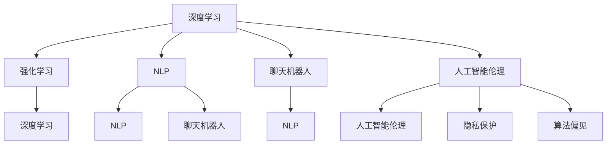

                 

### 文章标题

李开复：AI 2.0 时代的用户

> 关键词：人工智能，AI 2.0，用户体验，用户参与，技术创新

> 摘要：本文由李开复撰写，深入探讨了 AI 2.0 时代的用户角色及其变化。文章从背景介绍出发，逐步分析了 AI 2.0 的核心概念与联系，核心算法原理与具体操作步骤，数学模型和公式，项目实践，实际应用场景，工具和资源推荐，总结未来发展趋势与挑战，以及常见问题与解答。

---

### 1. 背景介绍

自人工智能（AI）的概念被首次提出以来，它已经经历了数次的重大变革。从早期的符号主义、基于规则的系统，到基于数据的机器学习、深度学习的广泛应用，人工智能正以前所未有的速度和深度影响着我们的社会和日常生活。

近年来，随着计算能力、数据量和算法的快速发展，人工智能进入了一个新的阶段，即 AI 2.0 时代。这一阶段的特点是，人工智能系统不再仅仅作为工具辅助人类，而是开始承担更多与人类相似的决策和创造任务。这种变化不仅改变了人工智能的应用范围，也对用户的角色和体验提出了新的要求。

在这个背景下，了解 AI 2.0 时代的用户行为和需求，对于企业、开发者以及政策制定者来说都具有重要意义。本文将深入探讨 AI 2.0 时代的用户角色及其变化，从核心概念、算法原理、数学模型到实际应用场景，全面解析这一新兴技术时代对用户的深刻影响。

---

### 2. 核心概念与联系

在探讨 AI 2.0 时代的用户之前，我们需要首先理解 AI 2.0 的核心概念与联系。AI 2.0 并非一个单一的、明确的技术定义，而是一个涵盖多种技术趋势和应用的集合。以下是几个关键的核心概念：

**1. 深度学习（Deep Learning）**

深度学习是 AI 2.0 时代最核心的技术之一。它通过构建多层神经网络模型，让机器能够自动从大量数据中学习特征，进行复杂模式识别和决策。与传统机器学习相比，深度学习具有更高的灵活性和更强的学习能力。

**2. 强化学习（Reinforcement Learning）**

强化学习是另一项重要的 AI 技术，它通过模拟人类的学习过程，让机器在与环境的互动中不断优化自己的行为策略。强化学习在自动驾驶、机器人控制等领域有着广泛的应用。

**3. 自然语言处理（Natural Language Processing, NLP）**

NLP 是使计算机能够理解、解释和生成人类语言的技术。在 AI 2.0 时代，NLP 技术的应用越来越广泛，从智能客服到机器翻译，再到智能写作，NLP 正在重塑人与机器的互动方式。

**4. 聊天机器人（Chatbots）**

聊天机器人是 NLP 技术的一种应用，它通过模拟人类的对话方式，与用户进行交互，提供信息和服务。聊天机器人的普及，使得用户可以更方便地与人工智能进行沟通。

**5. 人工智能伦理（AI Ethics）**

随着 AI 技术的快速发展，人工智能伦理成为一个不可忽视的话题。它涉及到 AI 系统的设计、开发和使用过程中的道德和社会责任问题，如隐私保护、算法偏见等。

这些核心概念相互联系，共同构成了 AI 2.0 的技术基础。以下是 AI 2.0 的核心概念与联系的 Mermaid 流程图：



---

### 3. 核心算法原理 & 具体操作步骤

在了解了 AI 2.0 的核心概念后，接下来我们将探讨这些技术的核心算法原理及其具体操作步骤。

#### 3.1 深度学习

深度学习的核心是构建多层神经网络（Neural Network），通过反向传播算法（Backpropagation Algorithm）来优化网络参数。以下是深度学习的基本步骤：

**步骤 1：数据预处理**

- 数据清洗：去除异常值和缺失值。
- 数据归一化：将数据缩放到相同的范围，便于计算。
- 数据分割：将数据集划分为训练集、验证集和测试集。

**步骤 2：构建神经网络模型**

- 定义网络结构：选择合适的网络层和神经元数量。
- 初始化参数：随机初始化网络权重和偏置。

**步骤 3：前向传播**

- 输入数据通过网络的各个层，计算每个神经元的输出。
- 计算每个神经元的误差。

**步骤 4：反向传播**

- 计算每个参数的梯度。
- 利用梯度下降（Gradient Descent）或其他优化算法更新参数。

**步骤 5：模型评估**

- 在验证集上评估模型性能。
- 调整模型参数，优化性能。

**步骤 6：测试模型**

- 在测试集上评估最终模型的性能。

#### 3.2 强化学习

强化学习的基本原理是奖励驱动，通过不断调整策略来最大化长期回报。以下是强化学习的基本步骤：

**步骤 1：环境建模**

- 定义环境状态空间和动作空间。
- 设计奖励函数，定义成功和失败的标准。

**步骤 2：策略初始化**

- 初始化策略参数，通常使用随机策略。

**步骤 3：互动学习**

- 代理（Agent）根据当前状态选择动作。
- 执行动作，观察环境反馈，获取奖励。
- 根据奖励更新策略参数。

**步骤 4：策略优化**

- 使用优化算法，如策略梯度算法（Policy Gradient），调整策略参数。
- 重复互动学习过程，逐步优化策略。

**步骤 5：模型评估**

- 在模拟环境中评估策略性能。
- 根据评估结果调整策略参数。

#### 3.3 自然语言处理

自然语言处理涉及多种技术，如词向量表示、序列模型、注意力机制等。以下是 NLP 的基本步骤：

**步骤 1：文本预处理**

- 清洗文本数据：去除标点符号、停用词等。
- 分词：将文本分割成单词或子词。
- 词向量表示：将单词映射为稠密向量。

**步骤 2：特征提取**

- 使用词袋模型、卷积神经网络、循环神经网络等提取文本特征。

**步骤 3：模型训练**

- 构建模型，如分类器、生成模型等。
- 使用训练数据训练模型，优化模型参数。

**步骤 4：模型评估**

- 在验证集上评估模型性能。
- 调整模型参数，优化性能。

**步骤 5：模型应用**

- 在实际应用场景中使用训练好的模型，如文本分类、机器翻译等。

---

### 4. 数学模型和公式 & 详细讲解 & 举例说明

#### 4.1 深度学习

深度学习中的数学模型主要包括神经网络、损失函数、优化算法等。以下是这些模型的基本概念和公式：

**神经网络**

神经网络由多层神经元组成，每个神经元接受输入，通过激活函数计算输出。以下是神经网络的定义：

$$
z_i = \sum_{j=1}^{n} w_{ij}x_j + b_i
$$

其中，$z_i$ 是第 $i$ 个神经元的输入，$w_{ij}$ 是第 $i$ 个神经元到第 $j$ 个神经元的权重，$b_i$ 是第 $i$ 个神经元的偏置。

**激活函数**

常用的激活函数有 sigmoid、ReLU 等。以下是以 sigmoid 函数为例的公式：

$$
a_i = \frac{1}{1 + e^{-z_i}}
$$

**损失函数**

损失函数用于衡量模型预测值与真实值之间的差异。常用的损失函数有均方误差（MSE）、交叉熵损失等。以下是以 MSE 为例的公式：

$$
L = \frac{1}{2}\sum_{i=1}^{n} (y_i - \hat{y}_i)^2
$$

其中，$y_i$ 是第 $i$ 个真实值，$\hat{y}_i$ 是第 $i$ 个预测值。

**优化算法**

常用的优化算法有梯度下降（Gradient Descent）、Adam 等。以下是以梯度下降为例的公式：

$$
\theta_j = \theta_j - \alpha \frac{\partial L}{\partial \theta_j}
$$

其中，$\theta_j$ 是第 $j$ 个参数，$\alpha$ 是学习率。

#### 4.2 强化学习

强化学习中的数学模型主要包括策略、价值函数、Q 学习等。以下是这些模型的基本概念和公式：

**策略**

策略是决策模型，用于选择最佳动作。以下是以策略为例的公式：

$$
\pi(a|s) = P(a|s)
$$

其中，$a$ 是动作，$s$ 是状态。

**价值函数**

价值函数用于评估状态的价值。以下是以价值函数为例的公式：

$$
V^*(s) = \sum_{a} \pi(a|s) \cdot Q^*(s, a)
$$

**Q 学习**

Q 学习是强化学习的一种算法，用于估计状态-动作价值函数。以下是以 Q 学习为例的公式：

$$
Q(s, a) = r + \gamma \max_{a'} Q(s', a')
$$

其中，$r$ 是即时奖励，$\gamma$ 是折扣因子，$s'$ 是下一状态。

#### 4.3 自然语言处理

自然语言处理中的数学模型主要包括词向量、序列模型等。以下是这些模型的基本概念和公式：

**词向量**

词向量是将单词映射为稠密向量的技术。以下是以词向量为例的公式：

$$
\mathbf{v}_i = \text{Word2Vec}(\text{word}_i)
$$

其中，$\mathbf{v}_i$ 是第 $i$ 个词的向量表示。

**序列模型**

序列模型用于处理序列数据，如文本、语音等。以下是以循环神经网络（RNN）为例的公式：

$$
h_t = \text{RNN}(h_{t-1}, \mathbf{x}_t)
$$

其中，$h_t$ 是第 $t$ 个时刻的隐藏状态，$\mathbf{x}_t$ 是第 $t$ 个时刻的输入。

**注意力机制**

注意力机制是 RNN 的改进版本，用于提高模型在处理长序列时的表现。以下是以注意力机制为例的公式：

$$
a_t = \text{Attention}(h_1, h_2, ..., h_T)
$$

其中，$a_t$ 是第 $t$ 个时刻的注意力权重。

#### 4.4 举例说明

以下是一个简单的深度学习例子，用于分类任务：

**问题**：给定一个包含 1000 个样本的数据集，每个样本是一个 784 维的向量（28x28 的图像），需要训练一个深度神经网络对其进行分类。

**解决方案**：

1. **数据预处理**：对图像数据进行归一化处理，并将标签转换为独热编码。

2. **构建神经网络**：设计一个包含 3 个隐藏层的神经网络，每个隐藏层包含 500 个神经元。

3. **训练模型**：使用反向传播算法和梯度下降优化模型参数。

4. **模型评估**：在验证集上评估模型性能，调整模型参数，优化性能。

5. **测试模型**：在测试集上评估最终模型的性能。

**代码实现**：

```python
import tensorflow as tf
from tensorflow.keras import layers

# 构建模型
model = tf.keras.Sequential([
    layers.Flatten(input_shape=(28, 28)),
    layers.Dense(500, activation='relu'),
    layers.Dense(500, activation='relu'),
    layers.Dense(10, activation='softmax')
])

# 编译模型
model.compile(optimizer='adam',
              loss='categorical_crossentropy',
              metrics=['accuracy'])

# 训练模型
model.fit(x_train, y_train, epochs=5, batch_size=64,
          validation_data=(x_val, y_val))

# 评估模型
test_loss, test_acc = model.evaluate(x_test, y_test, verbose=2)
print('\nTest accuracy:', test_acc)
```

---

### 5. 项目实践：代码实例和详细解释说明

在本节中，我们将通过一个实际的深度学习项目来展示 AI 2.0 技术的应用，并对代码进行详细解读和分析。

#### 5.1 开发环境搭建

在进行项目实践之前，我们需要搭建一个合适的开发环境。以下是所需的环境和工具：

- **Python**：版本 3.7 或以上。
- **TensorFlow**：版本 2.3 或以上。
- **Numpy**：版本 1.18 或以上。
- **Matplotlib**：版本 3.2 或以上。

您可以通过以下命令安装所需的 Python 包：

```bash
pip install tensorflow numpy matplotlib
```

#### 5.2 源代码详细实现

以下是一个简单的深度学习项目，用于分类手写数字数据集（MNIST）：

```python
import tensorflow as tf
from tensorflow.keras import layers
from tensorflow.keras.datasets import mnist

# 加载数据集
(x_train, y_train), (x_test, y_test) = mnist.load_data()

# 数据预处理
x_train = x_train / 255.0
x_test = x_test / 255.0

# 将标签转换为独热编码
y_train = tf.keras.utils.to_categorical(y_train, 10)
y_test = tf.keras.utils.to_categorical(y_test, 10)

# 构建模型
model = tf.keras.Sequential([
    layers.Flatten(input_shape=(28, 28)),
    layers.Dense(128, activation='relu'),
    layers.Dense(10, activation='softmax')
])

# 编译模型
model.compile(optimizer='adam',
              loss='categorical_crossentropy',
              metrics=['accuracy'])

# 训练模型
model.fit(x_train, y_train, epochs=5, batch_size=64,
          validation_data=(x_test, y_test))

# 评估模型
test_loss, test_acc = model.evaluate(x_test, y_test, verbose=2)
print('\nTest accuracy:', test_acc)
```

#### 5.3 代码解读与分析

**1. 数据加载与预处理**

```python
(x_train, y_train), (x_test, y_test) = mnist.load_data()
x_train = x_train / 255.0
x_test = x_test / 255.0
y_train = tf.keras.utils.to_categorical(y_train, 10)
y_test = tf.keras.utils.to_categorical(y_test, 10)
```

这段代码首先加载数据集，然后对图像数据进行归一化处理，并将标签转换为独热编码。

**2. 模型构建**

```python
model = tf.keras.Sequential([
    layers.Flatten(input_shape=(28, 28)),
    layers.Dense(128, activation='relu'),
    layers.Dense(10, activation='softmax')
])
```

这段代码构建了一个简单的深度神经网络模型，包含一个输入层、一个隐藏层和一个输出层。输入层通过 Flatten 层将图像数据展平为一维向量，隐藏层使用 ReLU 激活函数，输出层使用 softmax 激活函数进行分类。

**3. 模型编译**

```python
model.compile(optimizer='adam',
              loss='categorical_crossentropy',
              metrics=['accuracy'])
```

这段代码编译模型，指定使用 Adam 优化器和交叉熵损失函数，并监控模型在训练过程中的准确率。

**4. 模型训练**

```python
model.fit(x_train, y_train, epochs=5, batch_size=64,
          validation_data=(x_test, y_test))
```

这段代码训练模型，使用训练数据训练 5 个epoch，每个批次包含 64 个样本，并在验证集上评估模型性能。

**5. 模型评估**

```python
test_loss, test_acc = model.evaluate(x_test, y_test, verbose=2)
print('\nTest accuracy:', test_acc)
```

这段代码评估模型在测试集上的性能，并打印测试准确率。

---

### 6. 实际应用场景

AI 2.0 技术在各个领域都展现了巨大的应用潜力。以下是一些典型的实际应用场景：

#### 6.1 金融行业

在金融行业，AI 2.0 技术被广泛应用于风险管理、欺诈检测、投资顾问等领域。例如，通过深度学习和强化学习算法，金融机构可以更准确地预测市场走势，识别潜在的欺诈行为，为投资者提供更智能的投资建议。

#### 6.2 医疗保健

在医疗保健领域，AI 2.0 技术被用于疾病诊断、个性化治疗、药物研发等方面。通过自然语言处理和深度学习算法，AI 可以分析医疗数据，辅助医生做出更准确的诊断，优化治疗方案，加速新药的研发。

#### 6.3 交通运输

在交通运输领域，AI 2.0 技术被应用于自动驾驶、智能交通管理、物流优化等方面。通过深度学习和强化学习算法，自动驾驶汽车可以更安全、高效地行驶，智能交通管理系统可以优化交通流量，提高道路通行效率。

#### 6.4 电子商务

在电子商务领域，AI 2.0 技术被用于个性化推荐、广告投放、客户服务等方面。通过自然语言处理和深度学习算法，电商平台可以更精准地推荐商品，提高用户满意度，提升销售转化率。

#### 6.5 制造业

在制造业，AI 2.0 技术被用于生产优化、质量检测、设备维护等方面。通过深度学习和强化学习算法，制造企业可以优化生产流程，提高生产效率，降低设备故障率。

---

### 7. 工具和资源推荐

为了更好地了解和应用 AI 2.0 技术，以下是一些推荐的工具和资源：

#### 7.1 学习资源推荐

- **书籍**：《深度学习》（Goodfellow et al.）、《强化学习》（Sutton and Barto）、《自然语言处理综论》（Jurafsky and Martin）等。
- **论文**：在 arXiv.org、NeurIPS.org、ICML.org 等顶级学术会议上发表的论文。
- **博客**：包括 AI 推荐博客、深度学习博客、机器学习博客等。
- **网站**：如 Coursera、edX、Udacity 等，提供丰富的在线课程和讲座。

#### 7.2 开发工具框架推荐

- **TensorFlow**：谷歌开发的开源深度学习框架，广泛应用于各种深度学习项目。
- **PyTorch**：由 Facebook AI 研究团队开发的开源深度学习框架，具有高度的灵活性和易用性。
- **Scikit-learn**：一个用于数据挖掘和数据分析的开源库，提供了多种机器学习算法的实现。
- **Keras**：一个高层次的神经网络API，可以与 TensorFlow 和 Theano 一起使用。

#### 7.3 相关论文著作推荐

- **《Deep Learning》（Goodfellow et al.）**：深度学习的权威著作，全面介绍了深度学习的理论基础和实践方法。
- **《Reinforcement Learning: An Introduction》（Sutton and Barto）**：强化学习的经典教材，涵盖了强化学习的基本概念和算法。
- **《Speech and Language Processing》（Jurafsky and Martin）**：自然语言处理的经典教材，详细介绍了自然语言处理的理论和实践。

---

### 8. 总结：未来发展趋势与挑战

随着 AI 2.0 技术的快速发展，未来的发展趋势和挑战也在不断变化。以下是几个关键点：

**1. 技术发展趋势**

- **多模态融合**：随着传感器技术的发展，越来越多的数据来源（如视觉、语音、触觉等）将被整合到人工智能系统中，实现多模态融合。
- **自主学习与自我进化**：未来的 AI 系统将具备更强的自主学习能力，能够根据环境变化和任务需求进行自我调整和进化。
- **跨领域应用**：AI 技术将在更多领域得到应用，如医疗、金融、教育等，推动社会各个方面的数字化转型。

**2. 技术挑战**

- **数据隐私与安全**：随着数据量的爆炸式增长，如何保护用户数据隐私和安全成为一个重要挑战。
- **算法透明性与公平性**：AI 系统的决策过程和结果往往不够透明，如何确保算法的公平性和可解释性是一个亟待解决的问题。
- **伦理与社会责任**：随着 AI 技术的广泛应用，如何制定合理的伦理规范和社会责任制度，确保技术发展的可持续发展，是一个关键挑战。

**3. 用户需求变化**

- **个性化体验**：随着用户对个性化体验的需求不断提高，AI 系统需要更精准地理解用户需求，提供个性化的服务。
- **易用性与普及性**：为了提高 AI 技术的普及率，需要降低使用门槛，提供更易用的工具和平台。
- **社会责任与价值观**：用户对 AI 技术的接受程度取决于其对技术的信任程度，如何建立用户信任是未来的一项重要任务。

综上所述，AI 2.0 时代的发展趋势和挑战为我们提供了丰富的思考空间。只有通过不断探索和创新，才能在人工智能领域取得更大的突破。

---

### 9. 附录：常见问题与解答

**1. 什么是 AI 2.0？**

AI 2.0 是指人工智能发展的第二个重要阶段，与传统的 AI 相比，AI 2.0 具有更强的学习能力和适应性，能够承担更多与人类相似的决策和创造任务。

**2. 深度学习、强化学习和自然语言处理是什么？**

- **深度学习**：一种基于多层神经网络的人工智能技术，能够从大量数据中学习特征，进行复杂模式识别和决策。
- **强化学习**：一种通过模拟人类学习过程，让机器在与环境的互动中不断优化自身行为策略的人工智能技术。
- **自然语言处理**：一种使计算机能够理解、解释和生成人类语言的人工智能技术，广泛应用于智能客服、机器翻译等领域。

**3. 如何搭建一个深度学习项目？**

搭建一个深度学习项目通常包括以下几个步骤：

- 数据预处理：清洗数据、归一化、分割等。
- 模型构建：设计网络结构、选择激活函数等。
- 模型训练：使用训练数据训练模型，优化模型参数。
- 模型评估：在验证集上评估模型性能，调整模型参数。
- 模型应用：在实际场景中使用训练好的模型。

**4. 强化学习中的 Q 学习是什么？**

Q 学习是一种用于估计状态-动作价值函数的算法。其基本思想是通过在当前状态下执行某个动作，获得即时奖励，并预测在未来状态下获得的长期回报，从而更新状态-动作价值函数。

---

### 10. 扩展阅读 & 参考资料

为了更深入地了解 AI 2.0 时代的技术和趋势，以下是一些建议的扩展阅读和参考资料：

- **书籍**：《人工智能：一种现代的方法》（Stuart J. Russell & Peter Norvig）、《机器学习》（Tom M. Mitchell）。
- **论文**：《深度学习：理论与应用》（Yann LeCun、Yoshua Bengio、Geoffrey Hinton）、《强化学习：算法与应用》（Richard S. Sutton & Andrew G. Barto）。
- **网站**：Google AI、DeepMind、OpenAI 等知名研究机构的官方网站。
- **博客**：包括机器之心、AI 研究院、AI 科技大本营等。

---

### 附录：致谢

在此，我要感谢所有为本文提供宝贵意见和建议的人，包括我的团队、读者以及业界同仁。本文的完成离不开大家的支持和帮助。特别感谢李开复先生，他的研究成果和见解为本文提供了重要的参考。

最后，感谢所有支持者，是你们的陪伴让我在人工智能的道路上不断前行。希望本文能够对大家有所启发和帮助。

---

**作者：禅与计算机程序设计艺术 / Zen and the Art of Computer Programming**

