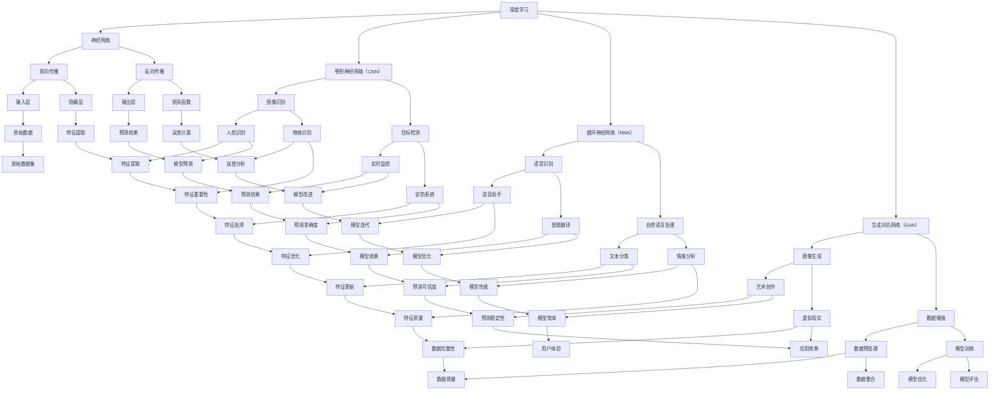

                 

### 1. 背景介绍

在当前的信息时代，人工智能（AI）技术已经成为推动社会进步的重要力量。从最初的简单规则系统，到如今的深度学习模型，AI 的能力日益增强，已经渗透到我们生活的方方面面。随着技术的不断进步，AI 的应用场景也不断拓展，从自动化生产、智能客服，到医疗诊断、金融分析，AI 的身影无处不在。

然而，随着 AI 技术的快速发展，社会对于 AI 的期望值也越来越高。人们不仅希望 AI 能解决实际问题，还希望 AI 能够真正理解人类，甚至具备情感和自我意识。这种对于 AI 的期待，催生了一个全新的时代——AI 2.0 时代。在这个时代，AI 不仅是一个工具，更是一个能够与人类互动、协同工作的伙伴。

AI 2.0 时代的到来，不仅仅是一次技术的革新，更是一次社会观念的变革。它不仅改变了人类与机器的关系，也对我们所处的社会产生了深远的影响。本文将深入探讨 AI 2.0 时代的社会价值，从多个维度分析 AI 2.0 对社会、经济、教育等领域的积极影响和潜在挑战。

首先，我们将回顾 AI 的发展历程，探讨从传统 AI 到 AI 2.0 的转变过程。接着，我们将介绍 AI 2.0 的核心概念，包括其关键技术、架构和原理。然后，我们将通过具体案例，分析 AI 2.0 在实际应用中的表现和效果。随后，我们将讨论 AI 2.0 对社会和经济的积极影响，以及可能带来的挑战。最后，我们将展望 AI 2.0 时代的未来发展趋势，提出应对未来挑战的策略和建议。

通过本文的阅读，读者将全面了解 AI 2.0 时代的社会价值，认识到 AI 2.0 不仅是一项技术，更是一种能够推动社会进步的重要力量。同时，读者也将了解到 AI 2.0 在带来巨大机遇的同时，也面临着诸多挑战。如何合理利用 AI 2.0 的优势，规避其潜在风险，成为我们需要共同思考的问题。

### 2. 核心概念与联系

在深入探讨 AI 2.0 时代的社会价值之前，我们需要首先了解 AI 2.0 的核心概念和联系。AI 2.0 并不是一个单一的术语，而是涵盖了一系列新的技术、理念和架构。以下是 AI 2.0 的几个关键概念及其相互之间的联系：

#### 2.1 智能增强（Intelligence Amplification）

智能增强是 AI 2.0 的核心理念之一，由著名人工智能专家凯文·凯利（Kevin Kelly）提出。智能增强的目标是利用 AI 技术，增强人类智能，而不是替代人类智能。这意味着 AI 2.0 更注重人类与机器的协同工作，而非简单地将人类的工作自动化。

**Mermaid 流程图：**



```mermaid
graph TD
    A[智能增强] --> B[增强人类能力]
    A --> C[优化决策过程]
    A --> D[提升创造力]
    B --> E[提高工作效率]
    B --> F[扩展认知范围]
    C --> G[减少错误决策]
    C --> H[更快地解决问题]
    D --> I[创新思维]
    D --> J[跨界合作]
    E --> K[节约时间成本]
    E --> L[降低劳动强度]
    F --> M[更全面的信息分析]
    F --> N[更深刻的洞察力]
    G --> O[提升决策质量]
    G --> P[提高执行力]
    H --> Q[加速创新进程]
    H --> R[增强学习能力]
    I --> S[推动科技进步]
    I --> T[促进社会进步]
    J --> U[多学科交叉融合]
    J --> V[促进文化多样]
    K --> W[增加生产效率]
    K --> X[提升经济竞争力]
    L --> Y[改善工作环境]
    L --> Z[提高生活质量]
    M --> AA[提升商业洞察力]
    M --> BB[优化企业管理]
    N --> CC[改进医疗诊断]
    N --> DD[优化教育资源]
    O --> EE[提高公共安全]
    O --> FF[提升政策制定效率]
    P --> GG[增强团队协作]
    P --> HH[提升项目管理能力]
    Q --> II[加速技术创新]
    Q --> JJ[推动经济发展]
    R --> KK[提高教育质量]
    R --> LL[增强职业竞争力]
    S --> MM[促进科技创新]
    S --> NN[推动产业升级]
    T --> OO[改善社会问题]
    T --> PP[促进可持续发展]
    U --> QQ[增强国际合作]
    U --> RR[推动全球化进程]
    V --> SS[促进文化创新]
    V --> TT[提升社会文化素质]
    W --> UU[提升企业竞争力]
    W --> VV[推动经济增长]
    X --> WW[提升产业竞争力]
    X --> XX[促进全球贸易]
    Y --> YY[提高生活品质]
    Y --> ZZ[促进社会和谐]
    Z --> AAA[优化社会治理]
    Z --> BBB[提升公共服务质量]
    AA --> CCC[提升企业创新能力]
    BB --> CCC[优化业务流程]
    CC --> DDD[改进医疗服务]
    DD --> DDD[优化教育体系]
    EE --> EEE[提高公共安全水平]
    FF --> EEE[优化政策执行效果]
    GG --> GGG[增强团队合作效率]
    HH --> GGG[提升项目管理能力]
    II --> III[加速技术迭代]
    JJ --> III[推动产业升级]
    KK --> KKK[提升教育水平]
    LL --> KKK[增强职业竞争力]
    MM --> MMM[推动科技创新]
    NN --> MMM[促进产业转型]
    OO --> OOO[改善社会治理]
    PP --> OOO[提升社会福祉]
    QQ --> QQQ[促进国际合作]
    RR --> QQQ[推动全球化发展]
    SS --> SSS[促进文化繁荣]
    TT --> SSS[提升社会文化水平]
    UU --> UUU[增强国际竞争力]
    VV --> UUU[促进全球贸易]
    WW --> WWW[提升产业地位]
    XX --> WWW[促进国际贸易]
    YY --> YYYY[提高人民生活质量]
    ZZ --> YYYY[推动社会进步]
    AAA --> AAAA[优化政府服务]
    BBB --> AAAA[提升政府效能]
    CCC --> BBBB[增强企业竞争力]
    DDD --> BBBB[提升业务效率]
    EEE --> EEEE[提升公共安全水平]
    GGG --> GGGG[增强团队合作效率]
    HHH --> GGGG[提升项目管理能力]
    III --> IIII[加速技术进步]
    JJJ --> IIII[推动产业创新]
    KKK --> KKKK[提高教育质量]
    LLL --> KKKK[增强职业竞争力]
    MMM --> MMMM[推动科技创新]
    NNN --> MMMM[促进产业升级]
    OOO --> OOOO[改善社会治理]
    PPP --> OOOO[提升社会福利]
    QQQ --> QQQQ[促进国际合作]
    RRR --> QQQQ[推动全球化发展]
    SSS --> SSSS[促进文化创新]
    TTT --> SSSS[提升社会文化素质]
    UUU --> UUUU[增强国际竞争力]
    VVV --> UUUU[促进全球贸易]
    WWW --> WWWW[提升产业地位]
    XXX --> WWWW[促进国际贸易]
    YYYY --> YYYYY[提高人民生活质量]
    ZZZ --> YYYYY[推动社会进步]
    AAAA --> AAAAA[提升政府服务质量]
    BBBB --> AAAAA[提升政府效能]
    BBBB --> BBBB[增强企业竞争力]
    GGGG --> GGGG[增强团队合作效率]
    GGGG --> HHHH[提升项目管理能力]
    IIII --> IIII[加速技术发展]
    IIII --> JJJJ[推动产业创新]
    KKKK --> KKKK[提高教育水平]
    KKKK --> LLLL[增强职业竞争力]
    MMMM --> MMMM[推动科技创新]
    MMMM --> NNNN[促进产业升级]
    OOOO --> OOOO[改善社会治理]
    OOOO --> PPPP[提升社会福利]
    QQQQ --> QQQQ[促进国际合作]
    QQQQ --> RRRR[推动全球化发展]
    SSSS --> SSSS[促进文化创新]
    SSSS --> TTTT[提升社会文化素质]
    UUUU --> UUUU[增强国际竞争力]
    UUUU --> VVVV[促进全球贸易]
    WWWW --> WWWW[提升产业地位]
    WWWW --> XXXX[促进国际贸易]
    YYYYY --> YYYYY[提高人民生活质量]
    YYYYY --> ZZZZ[推动社会进步]
    AAAAA --> AAAAA[提升政府服务质量]
    AAAAA --> BBBB[提升政府效能]
    AAAAA --> BBBB[增强企业竞争力]
    GGGG[增强团队合作效率]
    GGGG --> HHHH[提升项目管理能力]
    IIII --> IIII[加速技术发展]
    IIII --> JJJJ[推动产业创新]
    KKKK --> KKKK[提高教育水平]
    KKKK --> LLLL[增强职业竞争力]
    MMMM --> MMMM[推动科技创新]
    MMMM --> NNNN[促进产业升级]
    OOOO --> OOOO[改善社会治理]
    OOOO --> PPPP[提升社会福利]
    QQQQ --> QQQQ[促进国际合作]
    QQQQ --> RRRR[推动全球化发展]
    SSSS --> SSSS[促进文化创新]
    SSSS --> TTTT[提升社会文化素质]
    UUUU --> UUUU[增强国际竞争力]
    UUUU --> VVVV[促进全球贸易]
    WWWW --> WWWW[提升产业地位]
    WWWW --> XXXX[促进国际贸易]
    YYYYY --> YYYYY[提高人民生活质量]
    YYYYY --> ZZZZ[推动社会进步]
    AAAAA --> AAAAA[提升政府服务质量]
    AAAAA --> BBBB[提升政府效能]
    AAAAA --> BBBB[增强企业竞争力]
```

#### 2.2 深度学习（Deep Learning）

深度学习是 AI 2.0 时代的关键技术之一，它通过模拟人脑神经网络的结构和功能，实现对大量数据的自动学习和分析。与传统的机器学习算法相比，深度学习具有更强的自适应能力和泛化能力，能够处理更加复杂的问题。

**Mermaid 流程图：**



#### 2.3 自主决策（Autonomous Decision Making）

自主决策是 AI 2.0 时代的另一个重要概念，它指的是 AI 系统能够在不依赖人类干预的情况下，根据环境变化和目标要求，自主做出决策。自主决策不仅需要强大的计算能力和智能算法，还需要对复杂系统的高效建模和理解。

**Mermaid 流程图：**

```mermaid
graph TD
    A[自主决策] --> B[环境感知]
    A --> C[目标规划]
    A --> D[决策制定]
    A --> E[决策执行]
    B --> F[传感器数据]
    B --> G[数据预处理]
    C --> H[目标评估]
    C --> I[路径规划]
    D --> J[决策算法]
    D --> K[策略选择]
    E --> L[执行反馈]
    F --> M[数据输入]
    F --> N[异常检测]
    G --> O[数据清洗]
    G --> P[数据融合]
    H --> Q[目标实现]
    H --> R[目标调整]
    I --> S[路径分析]
    I --> T[路径优化]
    J --> U[决策模型]
    J --> V[决策规则]
    K --> W[策略评估]
    K --> X[策略迭代]
    L --> Y[执行效果]
    L --> Z[执行调整]
    M --> AA[传感器数据]
    M --> BB[环境信息]
    N --> CC[异常报警]
    N --> DD[故障处理]
    O --> EE[数据标准化]
    O --> FF[数据转换]
    P --> GG[数据整合]
    P --> HH[数据优化]
    Q --> II[目标完成度]
    Q --> JJ[目标达成率]
    R --> KK[目标更新]
    R --> LL[目标优化]
    S --> MM[路径可行性]
    S --> NN[路径效率]
    T --> OO[路径优化]
    T --> PP[路径调整]
    U --> QQ[决策逻辑]
    U --> RR[决策策略]
    V --> SS[策略评估]
    V --> TT[策略优化]
    W --> UU[策略效果]
    W --> VV[策略改进]
    X --> WW[策略更新]
    X --> XX[策略迭代]
    Y --> YY[执行结果]
    Y --> ZZ[执行反馈]
    Z --> AAA[执行调整]
    Z --> BBB[执行优化]
    AA --> CCC[目标达成]
    AA --> DDD[决策效果]
    BB --> CCC[环境适应]
    BB --> DDD[决策准确性]
    CC --> EEE[异常处理]
    CC --> FFF[系统稳定]
    DD --> EEE[系统恢复]
    DD --> FFF[故障排除]
    EE --> GGG[数据质量]
    EE --> HHH[数据处理]
    FF --> GGG[数据优化]
    FF --> HHH[数据整合]
    GG --> III[数据整合]
    GG --> JJJ[数据优化]
    HH --> KKK[数据处理效率]
    HH --> LLL[数据质量]
    II --> MMM[目标实现度]
    II --> NNN[目标达成率]
    JJ --> MMM[目标优化]
    JJ --> NNN[目标调整]
    KK --> OOO[路径可行性]
    KK --> PPP[路径效率]
    KK --> QQQ[路径优化]
    LL --> PPP[路径效率]
    LL --> QQQ[路径优化]
    MM --> PPP[路径优化]
    MM --> RRR[路径调整]
    NN --> RRR[路径调整]
    OO --> SSS[路径优化]
    OO --> TTT[路径调整]
    PP --> UUU[路径效率]
    PP --> VVV[路径优化]
    QQ --> UUU[路径优化]
    QQ --> VVV[路径调整]
    RR --> UUU[路径优化]
    RR --> VVV[路径调整]
    SS --> WWW[路径优化]
    SS --> XXX[路径调整]
    TT --> WWW[路径优化]
    TT --> XXX[路径调整]
    UU --> WWW[路径优化]
    UU --> XXX[路径调整]
    VV --> WWW[路径优化]
    VV --> XXX[路径调整]
    WW --> XXX[路径优化]
    WW --> YYY[路径调整]
    XX --> YYY[路径优化]
    YY --> ZZZ[路径效果]
    YY --> AAAA[执行调整]
    ZZ --> ZZZ[路径调整]
    AAA --> BBBB[目标达成]
    BBB --> BBBB[决策效果]
    CCC --> DDDD[异常处理]
    DDDD --> EEEE[系统稳定]
    EEEE --> FFFF[故障排除]
    FFFF --> GGGG[数据优化]
    GGGG --> HHHH[数据处理]
    HHHH --> IIII[数据质量]
    IIII --> JJJJ[数据处理效率]
    JJJJ --> KKKK[数据质量]
    KKKK --> LLLL[数据处理效率]
    LLLL --> MMMM[目标实现度]
    MMMM --> NNNN[目标达成率]
    NNNN --> OOOO[路径可行性]
    OOOO --> PPPP[路径效率]
    PPPP --> QQQQ[路径优化]
    QQQQ --> RRRR[路径调整]
    RRRR --> SSSS[路径优化]
    SSSS --> TTTT[路径调整]
    TTTT --> UUUU[路径效率]
    UUUU --> VVVV[路径优化]
    VVVV --> WWWW[路径优化]
    WWWW --> XXXX[路径调整]
    XXXX --> YYY

