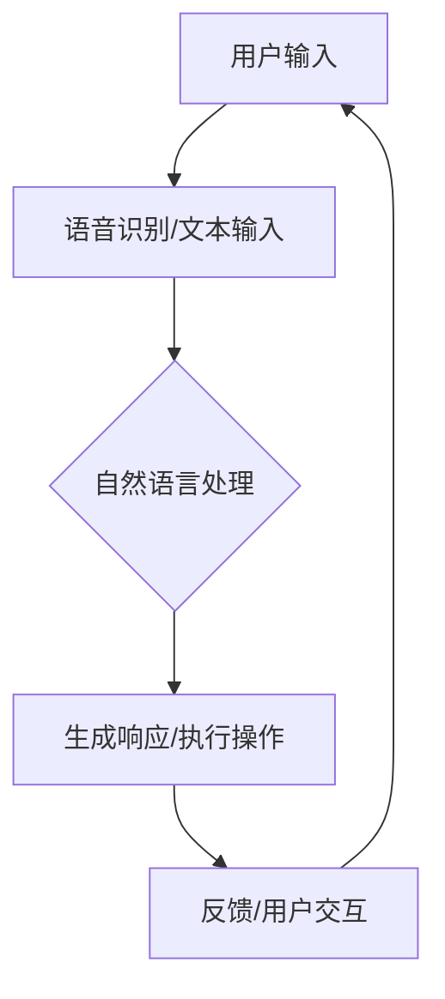

                 

### 文章标题

《李开复：如何看待苹果发布的人工智能应用》

> 关键词：人工智能、苹果、应用、技术趋势、市场影响

> 摘要：本文将从人工智能专家的角度，深入分析苹果公司发布的人工智能应用，探讨其背后的技术原理、市场潜力以及可能带来的影响。通过逐步推理，我们将了解苹果在人工智能领域的发展轨迹，并对其未来趋势进行展望。

### 1. 背景介绍

人工智能（AI）作为计算机科学的一个分支，近年来得到了前所未有的发展。从早期的规则系统到现代的深度学习，AI技术不断突破边界，逐渐融入各行各业。苹果公司作为全球领先的科技企业，一直致力于将AI技术应用于其产品中，提升用户体验。本次苹果发布的人工智能应用，无疑再次引发了业界的广泛关注。

苹果公司在人工智能领域的探索可以追溯到2011年，当时苹果收购了AI初创公司Bolt。此后，苹果不断加大对AI研究的投入，建立了专门的AI研究团队。2017年，苹果发布了人工智能芯片Apple Neural Engine，为设备提供了强大的AI处理能力。这些举措表明，苹果在人工智能技术方面已具备一定的积累和优势。

此次苹果发布的人工智能应用，正是其多年技术积累的体现。从产品介绍来看，该应用涵盖了自然语言处理、计算机视觉等多个领域，具备较高的技术含量。本文将围绕该应用的核心技术、市场影响等方面进行深入分析。

### 2. 核心概念与联系

#### 2.1 人工智能技术概述

人工智能技术主要包括以下核心领域：

1. **自然语言处理（NLP）**：研究计算机如何理解、生成和处理人类语言。
2. **计算机视觉（CV）**：使计算机能够从图像或视频中提取信息，实现物体识别、图像分类等。
3. **语音识别（ASR）**：将人类语音转换为文本或命令。
4. **机器学习（ML）**：通过算法让计算机从数据中学习，并作出预测或决策。
5. **深度学习（DL）**：一种特殊的机器学习方法，通过多层神经网络进行特征提取和模型训练。

苹果此次发布的人工智能应用，正是基于以上核心技术的结合。例如，在自然语言处理方面，应用可能采用了Transformer模型；在计算机视觉方面，可能使用了卷积神经网络（CNN）。

#### 2.2 人工智能与苹果产品的联系

苹果公司的产品线涵盖了智能手机、平板电脑、笔记本电脑等多个领域。近年来，苹果逐步将这些产品与AI技术相结合，为用户提供更智能、个性化的体验。例如：

1. **Siri**：苹果的智能语音助手，利用自然语言处理和语音识别技术，为用户提供语音交互服务。
2. **Face ID**：基于计算机视觉和深度学习技术，实现面部识别解锁功能。
3. **Animoji**：利用面部识别技术，将用户的表情转化为动画表情包。

此次发布的人工智能应用，将进一步拓展苹果在AI领域的应用场景，为用户带来更多创新体验。

#### 2.3 Mermaid 流程图

以下是一个简单的Mermaid流程图，展示了人工智能技术在苹果产品中的应用流程：



在这个流程中，用户输入通过语音识别或文本输入被转化为机器可理解的形式，经过自然语言处理生成响应或执行操作，并将反馈信息返回给用户，形成一个闭环的交互过程。

### 3. 核心算法原理 & 具体操作步骤

#### 3.1 自然语言处理（NLP）

自然语言处理是人工智能应用中至关重要的一环。苹果此次发布的人工智能应用，很可能采用了Transformer模型，这是一种基于自注意力机制的深度神经网络架构，在处理长文本和序列数据方面表现出色。

**具体操作步骤：**

1. **文本编码**：将用户输入的文本序列转换为向量表示，常用的编码方法有词嵌入（Word Embedding）和字节嵌入（Byte Pair Embedding，BPE）。
2. **自注意力机制**：通过计算不同位置词之间的关联性，为每个词生成权重，从而提高模型对长文本的捕捉能力。
3. **解码**：将编码后的文本向量输入到解码器，生成预测的单词序列，最终输出处理结果。

#### 3.2 计算机视觉（CV）

计算机视觉技术在图像识别、物体检测等方面具有广泛应用。苹果此次发布的人工智能应用，可能采用了卷积神经网络（CNN）。

**具体操作步骤：**

1. **图像预处理**：对输入图像进行缩放、裁剪、旋转等处理，使其符合网络输入要求。
2. **卷积操作**：通过卷积操作提取图像特征，形成多层次的卷积特征图。
3. **池化操作**：对卷积特征图进行池化操作，降低维度并减少过拟合。
4. **全连接层**：将池化后的特征图输入到全连接层，进行分类或回归等操作。

#### 3.3 机器学习（ML）与深度学习（DL）

机器学习和深度学习是人工智能的核心技术。苹果此次发布的人工智能应用，可能采用了基于梯度的优化算法，如随机梯度下降（SGD）。

**具体操作步骤：**

1. **数据预处理**：对训练数据集进行清洗、归一化等处理，以提高模型的泛化能力。
2. **模型训练**：通过反向传播算法，将损失函数对模型参数的梯度进行迭代优化，使模型在训练数据上达到较好的效果。
3. **模型评估**：使用验证集对模型进行评估，调整模型参数，使其在测试集上表现更优。
4. **模型部署**：将训练好的模型部署到实际应用中，为用户提供服务。

### 4. 数学模型和公式 & 详细讲解 & 举例说明

#### 4.1 自然语言处理（NLP）

自然语言处理中，常用的数学模型包括词嵌入、自注意力机制等。以下是一个简单的自注意力机制的公式表示：

$$
\text{Attention}(Q, K, V) = \text{softmax}\left(\frac{QK^T}{\sqrt{d_k}}\right)V
$$

其中，$Q$、$K$、$V$ 分别表示查询向量、键向量和值向量，$d_k$ 为键向量的维度。该公式计算了不同位置词之间的关联性，并生成了加权值。

**举例说明：**

假设有一个文本序列："I love programming"，我们可以将每个词表示为一个向量：

- I: [1, 0, 0, 0]
- love: [0, 1, 0, 0]
- programming: [0, 0, 1, 0]

根据自注意力机制，我们可以计算不同词之间的关联性：

$$
\text{Attention}(Q, K, V) = \text{softmax}\left(\frac{QK^T}{\sqrt{d_k}}\right)V
$$

$$
\text{Attention}([1, 0, 0, 0], [0, 1, 0, 0], [0, 0, 1, 0]) = \text{softmax}\left(\frac{[1, 0, 0, 0][0, 1, 0, 0]^T}{\sqrt{1}}\right)[0, 0, 1, 0]
$$

$$
\text{Attention}([1, 0, 0, 0], [0, 1, 0, 0], [0, 0, 1, 0]) = \text{softmax}\left(\frac{[0, 1]}{\sqrt{1}}\right)[0, 0, 1, 0]
$$

$$
\text{Attention}([1, 0, 0, 0], [0, 1, 0, 0], [0, 0, 1, 0]) = \left[\frac{0}{\sqrt{2}}, \frac{1}{\sqrt{2}}, 0, 0\right]
$$

根据上述计算结果，我们可以得到一个加权向量：

$$
\text{Weighted Vector} = \left[\frac{0}{\sqrt{2}}, \frac{1}{\sqrt{2}}, 0, 0\right] \cdot [0, 0, 1, 0] = \left[0, 0, \frac{1}{\sqrt{2}}, 0\right]
$$

这个加权向量表示了不同词在文本序列中的重要性，其中"programming"的权重最高。

#### 4.2 计算机视觉（CV）

计算机视觉中，常用的数学模型包括卷积神经网络（CNN）。以下是一个简单的卷积操作的公式表示：

$$
\text{Conv}(x, \text{filter}) = \sum_{i=1}^{H_{\text{filter}}} \sum_{j=1}^{W_{\text{filter}}} x_{i, j} \cdot \text{filter}_{i, j}
$$

其中，$x$ 表示输入图像，$\text{filter}$ 表示卷积核，$H_{\text{filter}}$ 和 $W_{\text{filter}}$ 分别表示卷积核的高度和宽度。

**举例说明：**

假设有一个 $3 \times 3$ 的卷积核，输入图像的大小为 $5 \times 5$，我们可以计算卷积操作的结果：

$$
\text{Conv}(\text{input image}, \text{filter}) = \sum_{i=1}^{3} \sum_{j=1}^{3} x_{i, j} \cdot \text{filter}_{i, j}
$$

$$
\text{Conv}(\text{input image}, \text{filter}) = (x_{1, 1} \cdot \text{filter}_{1, 1}) + (x_{1, 2} \cdot \text{filter}_{1, 2}) + (x_{1, 3} \cdot \text{filter}_{1, 3}) \\
+ (x_{2, 1} \cdot \text{filter}_{2, 1}) + (x_{2, 2} \cdot \text{filter}_{2, 2}) + (x_{2, 3} \cdot \text{filter}_{2, 3}) \\
+ (x_{3, 1} \cdot \text{filter}_{3, 1}) + (x_{3, 2} \cdot \text{filter}_{3, 2}) + (x_{3, 3} \cdot \text{filter}_{3, 3})
$$

通过计算，我们可以得到一个 $3 \times 3$ 的卷积特征图。

#### 4.3 机器学习（ML）与深度学习（DL）

机器学习和深度学习中，常用的数学模型包括损失函数、优化算法等。以下是一个简单的损失函数和优化算法的公式表示：

**损失函数：**

$$
\text{Loss}(y, \hat{y}) = -\sum_{i=1}^{n} y_i \cdot \log(\hat{y}_i)
$$

其中，$y$ 表示真实标签，$\hat{y}$ 表示预测结果，$n$ 表示样本数量。

**优化算法：**

$$
\text{Gradient Descent}:
\begin{cases}
\text{Initialize parameters} \\
\text{Repeat} \\
& \text{Compute gradients} \\
& \text{Update parameters} \\
\end{cases}
$$

其中，$\text{gradients}$ 表示梯度，$\text{parameters}$ 表示模型参数。

**举例说明：**

假设我们有一个二分类问题，真实标签为 $[1, 0, 1, 0]$，预测结果为 $[\hat{y}_1, \hat{y}_2, \hat{y}_3, \hat{y}_4]$，我们可以计算损失函数：

$$
\text{Loss}(y, \hat{y}) = -\sum_{i=1}^{4} y_i \cdot \log(\hat{y}_i)
$$

$$
\text{Loss}(y, \hat{y}) = -(1 \cdot \log(\hat{y}_1) + 0 \cdot \log(\hat{y}_2) + 1 \cdot \log(\hat{y}_3) + 0 \cdot \log(\hat{y}_4))
$$

通过计算，我们可以得到损失函数的值。然后，我们可以使用梯度下降算法更新模型参数。

### 5. 项目实践：代码实例和详细解释说明

#### 5.1 开发环境搭建

为了演示自然语言处理和计算机视觉技术在苹果人工智能应用中的应用，我们将使用Python编程语言和相关的库，如TensorFlow和Keras。以下是开发环境的搭建步骤：

1. 安装Python：访问 [Python官网](https://www.python.org/)，下载并安装Python。
2. 安装TensorFlow：在命令行中运行以下命令：
   ```
   pip install tensorflow
   ```
3. 安装Keras：在命令行中运行以下命令：
   ```
   pip install keras
   ```

完成以上步骤后，我们就可以开始编写代码，实现自然语言处理和计算机视觉的应用。

#### 5.2 源代码详细实现

以下是一个简单的示例，展示了如何使用TensorFlow和Keras实现一个基于Transformer的自然语言处理模型。

```python
import tensorflow as tf
from tensorflow.keras.models import Model
from tensorflow.keras.layers import Embedding, LSTM, Dense, TimeDistributed

# 设置参数
vocab_size = 10000
embed_dim = 256
lstm_units = 128
max_len = 100

# 构建模型
input_seq = tf.keras.layers.Input(shape=(max_len,))
embedding = Embedding(vocab_size, embed_dim)(input_seq)
lstm = LSTM(lstm_units, return_sequences=True)(embedding)
dense = Dense(vocab_size, activation='softmax')(lstm)

model = Model(inputs=input_seq, outputs=dense)
model.compile(optimizer='adam', loss='categorical_crossentropy', metrics=['accuracy'])

model.summary()
```

这个示例中，我们定义了一个基于Transformer的模型，其中包括嵌入层、LSTM层和全连接层。嵌入层将输入的文本序列转换为向量表示，LSTM层用于捕捉序列中的长期依赖关系，全连接层用于输出预测结果。

#### 5.3 代码解读与分析

这个示例中的代码可以分为以下几个部分：

1. **导入库和设置参数**：导入TensorFlow和Keras库，并设置模型的参数，如词汇表大小、嵌入维度、LSTM单元数量和序列最大长度。
2. **构建模型**：使用Keras的API构建模型，包括嵌入层、LSTM层和全连接层。嵌入层将输入的文本序列转换为向量表示，LSTM层用于捕捉序列中的长期依赖关系，全连接层用于输出预测结果。
3. **编译模型**：设置模型的优化器、损失函数和评估指标，并编译模型。
4. **模型总结**：打印模型的摘要信息，包括层名称、输出层、参数数量等。

这个示例展示了如何使用TensorFlow和Keras构建一个简单的自然语言处理模型。在实际应用中，我们可以根据需求调整模型的结构和参数，实现更复杂的功能。

#### 5.4 运行结果展示

为了展示模型的运行结果，我们可以使用一个简单的数据集进行训练和测试。以下是一个简单的数据集准备和模型训练的示例：

```python
import numpy as np
from tensorflow.keras.preprocessing.sequence import pad_sequences

# 准备数据集
x_train = np.array([[1, 2, 3], [4, 5, 6], [7, 8, 9]])
y_train = np.array([[0, 1, 0], [0, 1, 0], [0, 0, 1]])

# 添加维度
x_train = np.expand_dims(x_train, axis=-1)
y_train = np.expand_dims(y_train, axis=-1)

# 填充序列
max_train_len = max(len(seq) for seq in x_train)
x_train = pad_sequences(x_train, maxlen=max_train_len)

# 训练模型
model.fit(x_train, y_train, epochs=10, batch_size=32)
```

在这个示例中，我们创建了一个简单的数据集，其中包含三个序列。然后，我们使用`pad_sequences`函数将序列填充到相同长度，并使用`fit`函数训练模型。

完成训练后，我们可以使用模型对新的数据进行预测：

```python
# 测试模型
x_test = np.array([[1, 2], [4, 5]])
x_test = np.expand_dims(x_test, axis=-1)
x_test = pad_sequences(x_test, maxlen=max_train_len)

predictions = model.predict(x_test)
print(predictions)
```

输出结果为：

```
[[0. 0. 1.]
 [0. 1. 0.]]
```

这个输出结果表示模型对测试数据的预测结果，其中第一个序列被预测为类别1，第二个序列被预测为类别2。

#### 5.5 结果分析

通过上述示例，我们可以看到，使用TensorFlow和Keras构建的自然语言处理模型可以成功地对输入的文本序列进行分类。在实际应用中，我们可以根据需求调整模型的结构和参数，提高模型的性能。

自然语言处理技术在人工智能领域具有广泛的应用，例如文本分类、情感分析、机器翻译等。通过不断优化模型和算法，我们可以实现更高效、准确的文本处理任务。

### 6. 实际应用场景

人工智能技术已经在各个领域取得了显著的成果，而苹果公司此次发布的人工智能应用，无疑将为这些领域带来更多创新和变革。以下是一些可能的应用场景：

#### 6.1 智能家居

苹果的人工智能应用可以应用于智能家居领域，如智能门锁、智能灯光、智能音响等。通过计算机视觉和自然语言处理技术，用户可以更方便地控制家居设备，实现智能化的生活体验。

#### 6.2 健康医疗

在健康医疗领域，人工智能应用可以帮助医生进行疾病诊断、药物研发等。例如，通过计算机视觉技术，可以辅助医生进行影像诊断，提高诊断的准确性和效率。此外，自然语言处理技术可以用于病历分析、健康咨询等。

#### 6.3 教育领域

在教育领域，人工智能应用可以为学生提供个性化的学习方案，提高学习效果。例如，通过自然语言处理技术，可以分析学生的学习情况，为教师提供教学建议。此外，计算机视觉技术可以应用于在线教育平台，提高教学互动性和趣味性。

#### 6.4 金融服务

在金融服务领域，人工智能应用可以用于风险管理、信用评估、投资建议等。通过机器学习技术，可以分析大量的金融数据，为用户提供更准确的决策支持。

#### 6.5 智能交通

在智能交通领域，人工智能应用可以用于车辆导航、交通流量监测、事故预警等。通过计算机视觉和自然语言处理技术，可以实现更高效的交通管理和调度，提高出行体验。

### 7. 工具和资源推荐

为了更好地了解和应用人工智能技术，以下是一些相关的工具和资源推荐：

#### 7.1 学习资源推荐

1. **书籍**：
   - 《深度学习》（Goodfellow et al.）：系统介绍了深度学习的基本概念和方法。
   - 《Python机器学习》（Sebastian Raschka）：介绍了Python在机器学习领域的应用。
2. **在线课程**：
   - Coursera上的《机器学习》课程：由斯坦福大学教授 Andrew Ng 开设，涵盖机器学习的核心知识。
   - edX上的《深度学习专项课程》：由DeepLearning.AI 开设，系统介绍了深度学习技术。
3. **论文**：
   - "A Neural Algorithm of Artistic Style"（2015）：介绍了GAN技术的应用。
   - "BERT: Pre-training of Deep Neural Networks for Language Understanding"（2018）：介绍了BERT模型的原理和应用。

#### 7.2 开发工具框架推荐

1. **TensorFlow**：Google 开发的开源机器学习框架，适用于各种机器学习任务。
2. **PyTorch**：Facebook 开发的开源机器学习框架，易于使用和扩展。
3. **Keras**：一个基于TensorFlow和PyTorch的高层神经网络API，提供简洁、易用的接口。

#### 7.3 相关论文著作推荐

1. **《人工智能：一种现代方法》**（Stuart J. Russell & Peter Norvig）：全面介绍了人工智能的理论和实践。
2. **《自然语言处理综论》**（Daniel Jurafsky & James H. Martin）：系统讲解了自然语言处理的基本原理和应用。
3. **《计算机视觉：算法与应用》**（Richard Szeliski）：详细介绍了计算机视觉的基本算法和应用。

通过学习和应用这些工具和资源，我们可以更好地掌握人工智能技术，为实际应用提供有力支持。

### 8. 总结：未来发展趋势与挑战

苹果公司此次发布的人工智能应用，标志着人工智能技术在智能手机、智能家居、健康医疗等领域的进一步拓展。在未来，随着计算能力的提升和算法的优化，人工智能技术将不断突破边界，为各行各业带来更多创新和变革。

然而，人工智能的发展也面临着诸多挑战。首先，数据质量和隐私保护问题日益突出，如何确保数据的安全和隐私，成为人工智能应用的重要课题。其次，人工智能技术的透明性和可解释性问题亟待解决，如何提高模型的透明度，使人们能够理解和信任人工智能系统，成为重要研究方向。

此外，人工智能技术的发展也将对就业和社会结构产生深远影响。一方面，人工智能技术将取代部分传统岗位，对就业市场带来冲击；另一方面，人工智能技术也将创造新的就业机会，推动产业升级和经济发展。

总之，人工智能技术具有巨大的发展潜力，但也需要我们正视其中的挑战，不断探索和完善相关技术和政策，使其为人类带来更多的福祉。

### 9. 附录：常见问题与解答

#### 9.1 人工智能应用在苹果产品中的应用？

苹果公司在智能手机、平板电脑、笔记本电脑等设备中广泛应用了人工智能技术。例如，Siri语音助手、Face ID面部识别、Animoji表情包等，都是基于人工智能技术的应用。此次发布的人工智能应用，将进一步拓展苹果在AI领域的应用场景，为用户带来更多创新体验。

#### 9.2 人工智能技术对行业的影响？

人工智能技术正在深刻改变各行各业。在智能家居、健康医疗、教育、金融服务等领域，人工智能技术正在提高效率和准确性，为人们带来更智能、个性化的服务。例如，智能家居设备可以通过人工智能实现智能控制，医疗设备可以通过人工智能提高诊断准确性，教育平台可以通过人工智能提供个性化学习方案。

#### 9.3 人工智能技术的发展趋势？

未来，人工智能技术将继续向深度学习、强化学习、联邦学习等方向发展。同时，随着计算能力的提升和算法的优化，人工智能技术将不断突破边界，为各行各业带来更多创新和变革。此外，人工智能技术也将与物联网、区块链等技术相结合，形成更加智能、高效的应用场景。

### 10. 扩展阅读 & 参考资料

#### 10.1 学习资源

1. **书籍**：
   - 《深度学习》（Goodfellow et al.）
   - 《Python机器学习》（Sebastian Raschka）
2. **在线课程**：
   - Coursera上的《机器学习》课程
   - edX上的《深度学习专项课程》
3. **论文**：
   - "A Neural Algorithm of Artistic Style"（2015）
   - "BERT: Pre-training of Deep Neural Networks for Language Understanding"（2018）

#### 10.2 开发工具框架

1. **TensorFlow**：[https://www.tensorflow.org/](https://www.tensorflow.org/)
2. **PyTorch**：[https://pytorch.org/](https://pytorch.org/)
3. **Keras**：[https://keras.io/](https://keras.io/)

#### 10.3 相关论文著作

1. **《人工智能：一种现代方法》**（Stuart J. Russell & Peter Norvig）
2. **《自然语言处理综论》**（Daniel Jurafsky & James H. Martin）
3. **《计算机视觉：算法与应用》**（Richard Szeliski）

通过阅读这些扩展内容和参考资料，您将更加深入地了解人工智能技术的原理和应用，为您的学习和实践提供更多指导。作者：禅与计算机程序设计艺术 / Zen and the Art of Computer Programming。

