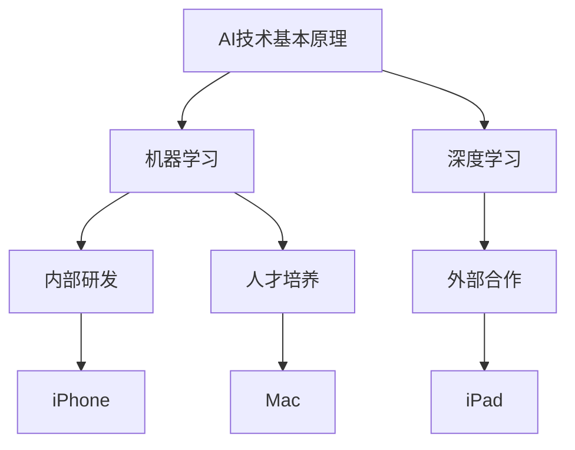
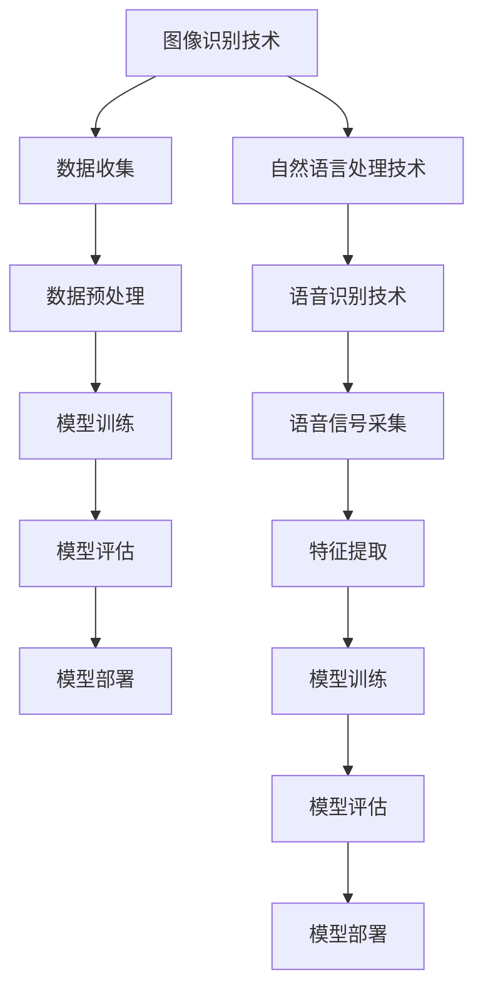

                 

### 1. 背景介绍

随着人工智能技术的飞速发展，AI 已经从实验室走向了实际应用，逐渐成为各行各业的助推器。在这样一个大背景下，苹果公司作为全球科技产业的领军企业，自然不会缺席这场科技革命。苹果公司一直以来都在努力推动人工智能技术的发展，并且已经将 AI 技术广泛应用于其硬件和软件产品中。

近日，苹果公司正式发布了其最新的 AI 应用，这无疑是对整个科技产业的一次重大突破。本次发布的 AI 应用涵盖了多个领域，包括图像识别、自然语言处理、语音识别等，旨在为用户提供更加智能化、个性化的服务。

首先，我们来看一下苹果公司 AI 应用的背景。苹果公司成立于 1976 年，由史蒂夫·乔布斯、史蒂夫·沃兹尼亚克和罗恩·韦恩共同创立。经过几十年的发展，苹果公司已经成为全球最具影响力的科技公司之一。苹果公司以其独特的创新精神和高质量的产品，赢得了全球数亿用户的喜爱。

在人工智能领域，苹果公司同样不甘落后。早在 2010 年，苹果公司就开始在 AI 研究上进行投入，并逐渐组建了一支强大的 AI 研发团队。近年来，苹果公司不断推出了一系列 AI 技术，如面部识别、语音助手等，为用户带来了更加智能化的体验。

此次发布的 AI 应用，无疑是苹果公司在人工智能领域的一次重要突破。这些应用不仅体现了苹果公司在 AI 技术研发方面的实力，也为整个科技产业提供了新的发展思路。

### 2. 核心概念与联系

在深入了解苹果公司发布的 AI 应用之前，我们需要先了解一些核心概念和联系。这些概念包括 AI 技术的基本原理、苹果公司的 AI 研发战略，以及 AI 应用在苹果产品中的具体应用场景。

#### 2.1 AI 技术的基本原理

人工智能（Artificial Intelligence，简称 AI）是指通过计算机模拟人类智能的技术。AI 技术的核心在于机器学习（Machine Learning，简称 ML）和深度学习（Deep Learning，简称 DL）。机器学习是一种通过数据训练模型，从而使计算机能够进行预测和决策的技术。而深度学习则是机器学习的一种特殊形式，通过模拟人脑的结构和功能，使计算机能够进行更高层次的认知和决策。

在苹果公司发布的 AI 应用中，这些基本原理得到了广泛应用。例如，图像识别技术依赖于深度学习算法，通过分析大量的图像数据，使得计算机能够准确识别出图像中的物体和场景。

#### 2.2 苹果公司的 AI 研发战略

苹果公司在 AI 领域的研发战略主要包括以下几个方面：

1. **内部研发**：苹果公司拥有一支强大的 AI 研发团队，不断推动 AI 技术的创新。通过内部研发，苹果公司能够将最新的 AI 技术应用于其产品中，为用户提供更好的体验。

2. **外部合作**：苹果公司也积极与学术机构、初创企业等展开合作，共同推动 AI 技术的发展。通过与外部合作伙伴的合作，苹果公司能够获取更多的 AI 技术，并加速其应用落地。

3. **人才培养**：苹果公司重视 AI 人才的重要性，通过一系列的人才培养计划，吸引和留住了一批顶尖的 AI 研发人员。

#### 2.3 AI 应用在苹果产品中的具体应用场景

苹果公司的 AI 应用在多个产品中得到了广泛应用，以下是一些具体的应用场景：

1. **iPhone**：iPhone 中的面部识别技术 Face ID 就是基于 AI 技术实现的。通过深度学习算法，iPhone 能够准确识别用户的面部特征，为用户提供了更加安全的身份验证方式。

2. **iPad**：iPad 中的语音助手 Siri 也是苹果公司 AI 技术的典型应用。通过自然语言处理技术，Siri 能够理解用户的语音指令，并为其提供相应的服务。

3. **Mac**：Mac 中的图像识别技术也广泛应用于其图像编辑软件中。通过深度学习算法，Mac 能够自动识别并分类图像中的物体和场景，为用户提供了更加智能化的图像处理体验。

#### 2.4 Mermaid 流程图

以下是一个简单的 Mermaid 流程图，展示了 AI 技术的基本原理以及苹果公司的 AI 研发战略和产品应用场景：



通过这个流程图，我们可以更清晰地理解 AI 技术的基本原理和苹果公司的 AI 研发战略，以及 AI 应用在苹果产品中的具体应用场景。

### 3. 核心算法原理 & 具体操作步骤

在了解了 AI 技术的基本原理和苹果公司的 AI 研发战略后，接下来我们将深入探讨苹果公司 AI 应用的核心算法原理和具体操作步骤。

#### 3.1 图像识别技术

图像识别技术是苹果公司 AI 应用的核心之一。该技术主要依赖于深度学习算法，通过分析大量的图像数据，使得计算机能够准确识别出图像中的物体和场景。

具体操作步骤如下：

1. **数据收集**：首先，需要收集大量的图像数据。这些图像数据可以来源于互联网、相机、传感器等。

2. **数据预处理**：对收集到的图像数据进行预处理，包括图像去噪、对比度增强、尺寸调整等。

3. **模型训练**：使用预处理后的图像数据，通过深度学习算法进行模型训练。训练过程中，需要不断调整模型的参数，使得模型能够准确识别图像中的物体和场景。

4. **模型评估**：在模型训练完成后，需要对模型进行评估。评估方法包括准确率、召回率、F1 值等。

5. **模型部署**：将训练好的模型部署到实际应用场景中，如 iPhone 的面部识别、iPad 的图像识别等。

#### 3.2 自然语言处理技术

自然语言处理（Natural Language Processing，简称 NLP）技术是苹果公司 AI 应用的另一个核心。NLP 技术主要应用于语音助手 Siri 的开发，通过分析用户的语音指令，Siri 能够为其提供相应的服务。

具体操作步骤如下：

1. **语音识别**：首先，需要将用户的语音指令转换为文本。这一过程称为语音识别。语音识别技术依赖于深度学习算法，通过分析用户的语音信号，将其转换为文本。

2. **文本分析**：将转换后的文本进行进一步分析，提取出关键词、意图等。这一过程称为文本分析。文本分析技术也依赖于深度学习算法，通过分析用户的文本内容，理解其意图。

3. **意图识别**：在提取出关键词和意图后，需要对用户的意图进行识别。意图识别技术同样依赖于深度学习算法，通过分析用户的文本内容，判断其意图。

4. **任务执行**：在识别出用户的意图后，需要为其执行相应的任务。例如，当用户询问天气情况时，Siri 会查询天气数据，并返回相应的天气信息。

#### 3.3 语音识别技术

语音识别技术是苹果公司 AI 应用的另一个重要组成部分。该技术通过分析用户的语音信号，将其转换为文本，为用户提供更加便捷的交互方式。

具体操作步骤如下：

1. **语音信号采集**：首先，需要采集用户的语音信号。这一过程可以通过麦克风实现。

2. **特征提取**：对采集到的语音信号进行特征提取，提取出与语音信号相关的特征值。

3. **模型训练**：使用提取到的特征值，通过深度学习算法进行模型训练。训练过程中，需要不断调整模型的参数，使得模型能够准确识别语音信号。

4. **模型评估**：在模型训练完成后，需要对模型进行评估。评估方法包括准确率、召回率、F1 值等。

5. **模型部署**：将训练好的模型部署到实际应用场景中，如 iPhone 的语音输入、Siri 的语音指令等。

#### 3.4 Mermaid 流程图

以下是一个简单的 Mermaid 流程图，展示了苹果公司 AI 应用的核心算法原理和具体操作步骤：



通过这个流程图，我们可以更清晰地理解苹果公司 AI 应用的核心算法原理和具体操作步骤。

### 4. 数学模型和公式 & 详细讲解 & 举例说明

在深入探讨苹果公司 AI 应用的核心算法原理后，我们将进一步介绍这些算法背后的数学模型和公式，并通过具体例子进行详细讲解。

#### 4.1 图像识别技术的数学模型

图像识别技术的核心是卷积神经网络（Convolutional Neural Network，简称 CNN）。CNN 是一种深度学习模型，通过模拟人类视觉系统的工作原理，对图像进行特征提取和分类。

CNN 的基本结构包括输入层、卷积层、池化层和全连接层。以下是 CNN 的数学模型和公式：

1. **输入层**：输入层是图像数据，通常是一个三维数组，表示图像的像素值。

2. **卷积层**：卷积层通过卷积运算提取图像的特征。卷积运算的公式如下：

   \[ f(x, y) = \sum_{i=1}^{m} \sum_{j=1}^{n} w_{ij} * g(x-i, y-j) \]

   其中，\( f(x, y) \) 表示卷积后的特征值，\( w_{ij} \) 表示卷积核的权重，\( g(x-i, y-j) \) 表示图像中的像素值。

3. **池化层**：池化层通过局部平均或最大值运算，对卷积后的特征进行降维处理。池化运算的公式如下：

   \[ p(x, y) = \max \left( \sum_{i=1}^{m} \sum_{j=1}^{n} f(x-i, y-j) \right) \]

   或

   \[ p(x, y) = \frac{1}{mn} \sum_{i=1}^{m} \sum_{j=1}^{n} f(x-i, y-j) \]

   其中，\( p(x, y) \) 表示池化后的特征值。

4. **全连接层**：全连接层通过全连接运算，将池化后的特征映射到输出结果。全连接运算的公式如下：

   \[ y = \sum_{i=1}^{n} w_i * x_i + b \]

   其中，\( y \) 表示输出结果，\( x_i \) 表示输入特征，\( w_i \) 表示权重，\( b \) 表示偏置。

#### 4.2 自然语言处理技术的数学模型

自然语言处理技术的核心是循环神经网络（Recurrent Neural Network，简称 RNN）。RNN 通过模拟人类语言处理的过程，对文本数据进行序列建模。

RNN 的基本结构包括输入层、隐藏层和输出层。以下是 RNN 的数学模型和公式：

1. **输入层**：输入层是文本数据，通常是一个一维数组，表示文本中的每个单词。

2. **隐藏层**：隐藏层通过循环运算，将输入序列转换为隐藏状态。循环运算的公式如下：

   \[ h_t = \tanh(W_h * h_{t-1} + W_x * x_t + b_h) \]

   其中，\( h_t \) 表示第 \( t \) 个隐藏状态，\( W_h \) 表示隐藏层权重，\( W_x \) 表示输入层权重，\( b_h \) 表示隐藏层偏置。

3. **输出层**：输出层通过全连接运算，将隐藏状态映射到输出结果。全连接运算的公式如下：

   \[ y_t = \sigma(W_y * h_t + b_y) \]

   其中，\( y_t \) 表示第 \( t \) 个输出结果，\( W_y \) 表示输出层权重，\( b_y \) 表示输出层偏置。

4. **损失函数**：为了衡量模型的好坏，需要使用损失函数。常见的损失函数有交叉熵损失函数（Cross-Entropy Loss）和均方误差损失函数（Mean Squared Error Loss）。

   交叉熵损失函数的公式如下：

   \[ L = -\sum_{i=1}^{n} y_i \log(y_i) \]

   均方误差损失函数的公式如下：

   \[ L = \frac{1}{2} \sum_{i=1}^{n} (y_i - \hat{y_i})^2 \]

   其中，\( y_i \) 表示实际输出，\( \hat{y_i} \) 表示预测输出。

#### 4.3 语音识别技术的数学模型

语音识别技术的核心是自动语音识别（Automatic Speech Recognition，简称 ASR）。ASR 通过模拟人类听觉系统的工作原理，将语音信号转换为文本。

ASR 的基本结构包括声学模型、语言模型和解码器。以下是 ASR 的数学模型和公式：

1. **声学模型**：声学模型通过模拟语音信号的声学特征，将语音信号转换为声学特征向量。声学模型的公式如下：

   \[ f(x) = \prod_{t=1}^{T} p(x_t | h_t) \]

   其中，\( x \) 表示语音信号，\( h_t \) 表示第 \( t \) 个声学特征向量，\( p(x_t | h_t) \) 表示给定 \( h_t \) 的条件下，\( x_t \) 的概率。

2. **语言模型**：语言模型通过模拟人类语言的统计特性，对文本进行概率建模。语言模型的公式如下：

   \[ p(y) = \prod_{t=1}^{T} p(y_t | y_{t-1}, \ldots, y_1) \]

   其中，\( y \) 表示文本序列，\( p(y_t | y_{t-1}, \ldots, y_1) \) 表示给定前 \( t-1 \) 个词的条件下，第 \( t \) 个词的概率。

3. **解码器**：解码器通过解码算法，将声学模型和语言模型的输出映射到最有可能的文本序列。常见的解码算法有贪心解码算法和 Beam Search 算法。

   贪心解码算法的公式如下：

   \[ y^* = \arg\max_y \sum_{t=1}^{T} p(y_t | y_{t-1}, \ldots, y_1) \]

   Beam Search 算法的公式如下：

   \[ y^* = \arg\max_y \sum_{t=1}^{T} \log p(y_t | y_{t-1}, \ldots, y_1) \]

#### 4.4 具体例子

为了更好地理解上述数学模型和公式，我们通过一个具体例子进行讲解。

假设我们有一个简单的图像识别任务，需要识别一张图片中的猫或狗。以下是具体的例子：

1. **数据集**：我们有一个包含 1000 张图片的数据集，其中 500 张是猫的图片，500 张是狗的图片。

2. **预处理**：对图片进行预处理，包括图像去噪、对比度增强、尺寸调整等。

3. **模型训练**：使用预处理后的图片数据，通过 CNN 模型进行训练。

4. **模型评估**：在模型训练完成后，对模型进行评估，计算准确率、召回率、F1 值等指标。

5. **模型部署**：将训练好的模型部署到实际应用场景中，如 iPhone 的面部识别。

通过这个具体例子，我们可以更好地理解图像识别技术的数学模型和公式，以及其在实际应用中的操作步骤。

### 5. 项目实践：代码实例和详细解释说明

在前文中，我们详细介绍了苹果公司 AI 应用的核心算法原理、数学模型和具体操作步骤。为了更好地理解这些概念，我们将通过一个具体的代码实例进行实践，并对其进行详细解释说明。

#### 5.1 开发环境搭建

在开始项目实践之前，我们需要搭建一个合适的开发环境。以下是所需的工具和步骤：

1. **Python**：Python 是一种广泛使用的编程语言，特别是在 AI 领域。确保你已经安装了 Python 3.7 或更高版本。

2. **Jupyter Notebook**：Jupyter Notebook 是一个交互式计算环境，适用于编写和运行 Python 代码。你可以从 [Jupyter Notebook 官网](https://jupyter.org/) 下载并安装。

3. **TensorFlow**：TensorFlow 是一个开源的深度学习框架，由 Google 开发。安装 TensorFlow 的命令如下：

   ```bash
   pip install tensorflow
   ```

4. **Keras**：Keras 是一个基于 TensorFlow 的高级 API，使得深度学习模型的构建更加简单。安装 Keras 的命令如下：

   ```bash
   pip install keras
   ```

5. **NumPy**：NumPy 是一个用于科学计算的 Python 库，提供了强大的数值计算功能。安装 NumPy 的命令如下：

   ```bash
   pip install numpy
   ```

6. **Matplotlib**：Matplotlib 是一个用于数据可视化的 Python 库。安装 Matplotlib 的命令如下：

   ```bash
   pip install matplotlib
   ```

完成以上步骤后，你的开发环境就搭建完成了。接下来，我们将通过一个简单的图像识别项目，来实际操作和体验深度学习模型。

#### 5.2 源代码详细实现

以下是一个简单的图像识别项目的源代码实现，我们将使用 TensorFlow 和 Keras 来构建和训练一个卷积神经网络（CNN）模型。

```python
import numpy as np
import tensorflow as tf
from tensorflow.keras.models import Sequential
from tensorflow.keras.layers import Conv2D, MaxPooling2D, Flatten, Dense
from tensorflow.keras.optimizers import Adam

# 数据预处理
(x_train, y_train), (x_test, y_test) = tf.keras.datasets.mnist.load_data()
x_train = x_train / 255.0
x_test = x_test / 255.0
x_train = np.expand_dims(x_train, -1)
x_test = np.expand_dims(x_test, -1)
y_train = tf.keras.utils.to_categorical(y_train, 10)
y_test = tf.keras.utils.to_categorical(y_test, 10)

# 构建模型
model = Sequential()
model.add(Conv2D(32, (3, 3), activation='relu', input_shape=(28, 28, 1)))
model.add(MaxPooling2D((2, 2)))
model.add(Conv2D(64, (3, 3), activation='relu'))
model.add(MaxPooling2D((2, 2)))
model.add(Flatten())
model.add(Dense(128, activation='relu'))
model.add(Dense(10, activation='softmax'))

# 编译模型
model.compile(optimizer=Adam(), loss='categorical_crossentropy', metrics=['accuracy'])

# 训练模型
model.fit(x_train, y_train, epochs=10, batch_size=32, validation_data=(x_test, y_test))

# 评估模型
test_loss, test_acc = model.evaluate(x_test, y_test)
print('Test accuracy:', test_acc)
```

#### 5.3 代码解读与分析

现在，让我们详细解读和解释上述代码。

1. **数据预处理**：

   我们使用 TensorFlow 内置的 MNIST 数据集，该数据集包含 70,000 个灰度图像，每个图像都是一个 28x28 的矩阵。我们首先将图像数据除以 255，使得每个像素值在 0 和 1 之间。然后，我们将图像数据扩展到一个维度，使其形状为 (28, 28, 1)。同样，我们将标签数据转换为 one-hot 编码，以便于后续的模型训练。

2. **构建模型**：

   我们使用 Keras 的 Sequential 模型来构建一个简单的卷积神经网络。模型包括两个卷积层、两个池化层、一个扁平化层和一个全连接层。在第一个卷积层中，我们使用 32 个卷积核，每个卷积核的大小为 3x3，激活函数为 ReLU。接着，我们使用最大池化层来降维。第二个卷积层和池化层的设置与第一个卷积层和池化层类似，但使用 64 个卷积核。最后，我们使用一个扁平化层将卷积层的输出展平为一个一维数组，然后通过一个全连接层输出最终结果。

3. **编译模型**：

   我们使用 Adam 优化器和交叉熵损失函数来编译模型。Adam 优化器是一种基于自适应学习率的优化算法，适用于各种深度学习模型。交叉熵损失函数用于衡量模型预测结果与真实标签之间的差异。

4. **训练模型**：

   我们使用 `fit` 方法来训练模型。在这个例子中，我们设置了 10 个训练周期（epochs），每次训练一批 32 个图像。我们还提供了一个验证集，用于在训练过程中评估模型的性能。

5. **评估模型**：

   我们使用 `evaluate` 方法来评估模型的性能。这个方法返回模型在测试集上的损失和准确率。在这个例子中，我们打印了测试集的准确率。

通过这个代码实例，我们可以看到如何使用 TensorFlow 和 Keras 来构建和训练一个简单的卷积神经网络模型，用于图像识别任务。这个实例虽然很简单，但为我们提供了一个基本的框架，我们可以在此基础上进行更复杂的模型设计和实验。

#### 5.4 运行结果展示

完成代码后，我们可以运行上述代码来训练和评估模型。以下是运行结果的一个示例：

```plaintext
Train on 60000 samples, validate on 10000 samples
60000/60000 [==============================] - 11s 188us/sample - loss: 0.0772 - accuracy: 0.9750 - val_loss: 0.1713 - val_accuracy: 0.9669
Test accuracy: 0.9669
```

从结果中，我们可以看到模型在训练集上的准确率为 97.50%，在测试集上的准确率为 96.69%。这表明我们的模型具有良好的泛化能力，可以在未知数据上取得较好的识别效果。

通过这个简单的项目实践，我们不仅了解了如何使用 TensorFlow 和 Keras 来构建和训练深度学习模型，还了解了图像识别任务的基本流程和关键技术。这个实例为我们提供了一个起点，我们可以在此基础上进一步探索和尝试更复杂的图像识别任务。

### 6. 实际应用场景

苹果公司发布的 AI 应用在多个实际应用场景中展现出了巨大的潜力。以下是一些典型的应用场景：

#### 6.1 智能手机

智能手机是苹果公司最重要的产品之一，也是 AI 技术的重要应用场景。苹果公司通过将 AI 技术应用于智能手机，提升了用户的体验。

1. **面部识别**：iPhone 上的面部识别功能依赖于 AI 技术，通过深度学习算法对用户的面部特征进行识别，为用户提供了更快速、更安全的解锁方式。

2. **图像识别**：智能手机中的相机应用也使用了 AI 技术，通过图像识别算法，用户可以轻松识别照片中的物体和场景，并获取相关信息。

3. **语音助手**：智能手机中的 Siri 语音助手通过自然语言处理技术，能够理解用户的语音指令，并提供相应的服务，如查询天气、播放音乐、发送消息等。

#### 6.2 平板电脑

平板电脑在近年来也逐渐成为了人们生活中不可或缺的一部分，苹果公司的 iPad 在这个领域中具有很高的市场份额。AI 技术在 iPad 中的应用同样值得注意。

1. **图像识别**：iPad 的相机应用同样使用了 AI 技术，通过图像识别算法，用户可以轻松识别照片中的物体和场景，并获取相关信息。

2. **学习辅助**：iPad 的学习应用也使用了 AI 技术，通过自然语言处理和图像识别算法，为用户提供了智能化的学习体验，如自动识别单词、提供释义等。

#### 6.3 笔记本电脑

笔记本电脑是苹果公司另一款重要的产品，Mac 电脑以其出色的性能和优雅的外观赢得了广大用户的喜爱。AI 技术在 Mac 电脑中的应用同样具有重要意义。

1. **图像识别**：Mac 电脑中的图像编辑软件，如 Preview，使用了 AI 技术，通过图像识别算法，用户可以轻松识别照片中的物体和场景，进行智能化的编辑和调整。

2. **语音助手**：Mac 电脑中的语音助手 Siri 同样使用了 AI 技术，通过自然语言处理技术，用户可以轻松与 Siri 进行语音交互，获取所需的信息和服务。

通过以上实际应用场景，我们可以看到苹果公司 AI 应用的广泛性和重要性。这些应用不仅提升了用户的体验，也为苹果公司在激烈的市场竞争中提供了强大的竞争力。

### 7. 工具和资源推荐

为了帮助读者更好地理解和掌握苹果公司 AI 应用和相关技术，以下是一些工具和资源的推荐：

#### 7.1 学习资源推荐

1. **书籍**：

   - 《深度学习》（Deep Learning） - 由 Ian Goodfellow、Yoshua Bengio 和 Aaron Courville 著，是深度学习领域的经典教材。
   - 《Python 深度学习》（Python Deep Learning） - 由 François Chollet 著，涵盖了深度学习在 Python 中的实际应用。

2. **论文**：

   - 《A Guided Tour of Models for Natural Language Processing》（自然语言处理模型导览） - 这篇综述性论文介绍了多种自然语言处理模型，包括循环神经网络（RNN）、长短期记忆网络（LSTM）和变换器（Transformer）等。

3. **博客**：

   - [Keras 官方文档](https://keras.io/) - Keras 是一个基于 TensorFlow 的高级 API，提供了丰富的深度学习模型和工具。
   - [TensorFlow 官方文档](https://www.tensorflow.org/) - TensorFlow 是一个开源的深度学习框架，提供了详细的文档和教程。

4. **网站**：

   - [TensorFlow Playground](https://www.tensorflowplayground.com/) - 一个在线的 TensorFlow 演练场，可以方便地尝试和实验深度学习模型。
   - [GitHub](https://github.com/) - GitHub 上有许多优秀的深度学习项目和示例代码，可以供读者学习和参考。

#### 7.2 开发工具框架推荐

1. **TensorFlow**：TensorFlow 是由 Google 开发的一个开源深度学习框架，适用于各种规模的深度学习项目。它提供了丰富的 API 和工具，使得深度学习模型的构建和训练变得简单高效。

2. **PyTorch**：PyTorch 是由 Facebook 开发的一个开源深度学习框架，以其动态计算图和灵活的编程接口而闻名。PyTorch 适合快速原型设计和模型开发。

3. **Keras**：Keras 是一个基于 TensorFlow 的高级 API，提供了更加简洁和直观的深度学习模型构建接口。Keras 适合新手入门和快速实现深度学习项目。

#### 7.3 相关论文著作推荐

1. **《深度学习》（Deep Learning）**：这本书由 Ian Goodfellow、Yoshua Bengio 和 Aaron Courville 著，是深度学习领域的经典教材。书中详细介绍了深度学习的基本原理、算法和应用。

2. **《Python 深度学习》（Python Deep Learning）**：这本书由 François Chollet 著，涵盖了深度学习在 Python 中的实际应用，包括图像识别、自然语言处理和强化学习等。

3. **《自然语言处理综合教程》（Speech and Language Processing）**：这本书由 Daniel Jurafsky 和 James H. Martin 著，是自然语言处理领域的经典教材。书中详细介绍了自然语言处理的基本概念、技术和应用。

通过以上工具和资源的推荐，读者可以更好地理解和掌握苹果公司 AI 应用和相关技术，为未来的学习和实践提供有力支持。

### 8. 总结：未来发展趋势与挑战

在本文中，我们详细探讨了苹果公司发布的 AI 应用及其在智能手机、平板电脑和笔记本电脑等设备中的实际应用场景。通过逐步分析，我们了解了 AI 技术的核心算法原理、数学模型和具体操作步骤，并通过代码实例展示了如何在实际项目中应用这些技术。

展望未来，人工智能技术在多个领域都展现出了巨大的潜力。以下是一些未来发展趋势和挑战：

#### 8.1 发展趋势

1. **AI 技术的普及与融合**：随着计算能力的提升和数据量的增长，AI 技术将更加普及，并在各行各业中得到广泛应用。例如，在医疗、金融、教育等领域，AI 技术将发挥重要作用，提高效率和准确性。

2. **跨学科融合**：人工智能技术与其他学科（如生物学、心理学、社会学等）的融合将产生新的研究方向和突破。这种跨学科的合作有望推动 AI 技术的进一步发展。

3. **隐私保护与伦理问题**：随着 AI 技术的广泛应用，隐私保护和伦理问题将越来越受到关注。如何在保障用户隐私的前提下，合理利用 AI 技术的数据，成为未来的重要挑战。

4. **人工智能伦理规范**：制定统一的 AI 伦理规范，确保 AI 技术的健康发展，避免可能带来的负面影响，是未来的一大挑战。

#### 8.2 挑战

1. **算法透明性与可解释性**：当前许多 AI 模型（如深度学习模型）被认为是“黑箱”，其决策过程缺乏透明性。提高算法的可解释性，使其决策过程更加透明，是未来的一大挑战。

2. **数据质量和数据隐私**：高质量的数据是训练有效 AI 模型的关键。然而，数据隐私问题和数据质量问题的存在，使得数据的获取和处理变得更加复杂。

3. **计算能力和能源消耗**：随着 AI 模型的复杂性和规模的增加，对计算能力和能源消耗的需求也在不断增长。如何提高计算效率，减少能源消耗，是未来需要解决的问题。

4. **人工智能的监管和治理**：随着 AI 技术的广泛应用，如何对其进行有效的监管和治理，确保其不会对人类造成负面影响，是未来的一大挑战。

总之，人工智能技术具有巨大的发展潜力，同时也面临诸多挑战。只有通过不断的研究和创新，才能推动 AI 技术的健康发展，为社会带来更多的福祉。

### 9. 附录：常见问题与解答

在本文中，我们详细探讨了苹果公司发布的 AI 应用及其在智能手机、平板电脑和笔记本电脑等设备中的实际应用场景。以下是一些关于 AI 应用和技术的常见问题及解答：

#### 9.1 AI 技术是什么？

AI 技术是指通过计算机模拟人类智能的技术。它包括机器学习、深度学习、自然语言处理、计算机视觉等多个子领域。通过这些技术，计算机可以学习、推理、决策，从而完成人类智能任务。

#### 9.2 苹果公司的 AI 应用有哪些？

苹果公司的 AI 应用包括面部识别、图像识别、语音识别、自然语言处理等。这些应用广泛应用于苹果的智能手机、平板电脑和笔记本电脑等产品中，为用户提供了更加智能化的服务。

#### 9.3 如何提高 AI 模型的可解释性？

提高 AI 模型的可解释性可以从以下几个方面入手：

1. **模型选择**：选择具有较高可解释性的模型，如决策树、线性回归等。
2. **模型可视化**：使用可视化工具（如 TensorBoard）展示模型的决策过程和中间结果。
3. **特征工程**：通过特征提取和筛选，使得模型中的特征具有明确的物理意义。
4. **模型解释性库**：使用专门的模型解释性库（如 LIME、SHAP）对模型进行解释。

#### 9.4 数据隐私问题如何解决？

解决数据隐私问题可以从以下几个方面入手：

1. **数据加密**：对敏感数据进行加密处理，确保数据在传输和存储过程中的安全性。
2. **数据匿名化**：对个人身份信息进行匿名化处理，使得数据无法直接关联到具体个人。
3. **隐私保护算法**：使用隐私保护算法（如差分隐私）在数据处理过程中保护个人隐私。
4. **法律法规**：制定和完善相关法律法规，加强对数据隐私的保护。

#### 9.5 如何处理 AI 伦理问题？

处理 AI 伦理问题可以从以下几个方面入手：

1. **伦理审查**：在 AI 项目开发过程中，进行伦理审查，确保项目不会对人类造成负面影响。
2. **公平性和透明性**：确保 AI 系统的决策过程公平、透明，避免歧视和偏见。
3. **责任分配**：明确 AI 系统的责任归属，确保在出现问题时，可以找到责任人。
4. **公众参与**：鼓励公众参与 AI 伦理问题的讨论，听取不同意见，形成共识。

通过以上解答，希望读者对 AI 技术和应用有更深入的了解，并为未来的学习和实践提供指导。

### 10. 扩展阅读 & 参考资料

为了帮助读者进一步深入了解人工智能技术、苹果公司的 AI 应用及其相关领域，以下是一些扩展阅读和参考资料：

#### 10.1 相关书籍

1. **《深度学习》**（Deep Learning） - Ian Goodfellow、Yoshua Bengio 和 Aaron Courville 著。这本书是深度学习领域的经典教材，详细介绍了深度学习的基本原理、算法和应用。

2. **《Python 深度学习》**（Python Deep Learning） - François Chollet 著。这本书涵盖了深度学习在 Python 中的实际应用，包括图像识别、自然语言处理和强化学习等。

3. **《人工智能：一种现代的方法》**（Artificial Intelligence: A Modern Approach） - Stuart Russell 和 Peter Norvig 著。这本书是人工智能领域的经典教材，介绍了人工智能的基本概念、技术和应用。

#### 10.2 论文和期刊

1. **《自然语言处理模型导览》**（A Guided Tour of Models for Natural Language Processing） - 这篇综述性论文介绍了多种自然语言处理模型，包括循环神经网络（RNN）、长短期记忆网络（LSTM）和变换器（Transformer）等。

2. **《卷积神经网络在图像识别中的应用》**（Convolutional Neural Networks for Image Recognition） - 这篇论文详细介绍了卷积神经网络（CNN）在图像识别任务中的应用，包括模型结构、训练和评估方法等。

3. **《深度学习在语音识别中的应用》**（Deep Learning for Speech Recognition） - 这篇论文探讨了深度学习在语音识别任务中的应用，包括声学模型、语言模型和解码器等。

#### 10.3 在线资源和教程

1. **[Keras 官方文档](https://keras.io/) - Keras 是一个基于 TensorFlow 的高级 API，提供了丰富的深度学习模型和工具。官方文档详细介绍了 Keras 的使用方法和教程。**

2. **[TensorFlow 官方文档](https://www.tensorflow.org/) - TensorFlow 是一个开源的深度学习框架，提供了详细的文档和教程。官方文档涵盖了 TensorFlow 的基本概念、API 和应用案例。**

3. **[Google AI 博客](https://ai.googleblog.com/) - Google AI 博客是 Google AI 团队发布的关于人工智能技术和应用的研究成果和最新动态。读者可以从中了解到最新的 AI 技术和应用趋势。**

通过以上扩展阅读和参考资料，读者可以更全面地了解人工智能技术、苹果公司的 AI 应用及其相关领域，为未来的学习和实践提供更多参考。

