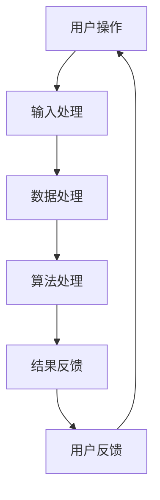

                 

### 李开复：苹果发布AI应用的产业革命

> 关键词：苹果、AI应用、产业革命、技术趋势、深度学习、人工智能、智能设备

> 摘要：本文将深入分析苹果公司最新发布的AI应用，探讨其对产业界带来的深远影响，以及未来人工智能技术的可能发展趋势。

---

## 1. 背景介绍

近年来，人工智能（AI）技术的快速发展已成为全球科技产业的重要驱动力。苹果公司作为全球科技巨头，在AI领域的投入和探索也从未停止。其最新的AI应用发布，无疑将再次引发业界的高度关注。

苹果公司的AI战略可以追溯到其早期的语音助手Siri，此后，AI技术在苹果产品中得到了广泛应用。从图像识别、自然语言处理，到机器学习和深度学习，苹果在AI领域的积累和技术储备日益雄厚。

随着AI技术的不断成熟和普及，苹果开始尝试将AI应用于更多产品和服务中。从智能手表、智能手机，到平板电脑和笔记本电脑，苹果正致力于将AI融入其硬件和软件生态系统，为用户提供更智能、更个性化的体验。

## 2. 核心概念与联系

### 2.1 AI应用的定义与分类

AI应用是指利用人工智能技术解决实际问题或提供特定功能的软件或服务。根据应用场景的不同，AI应用可以分为以下几类：

- **语音识别与交互**：如苹果的Siri，通过语音指令实现人机交互。
- **图像识别与处理**：如人脸识别、图像识别等。
- **自然语言处理**：如文本翻译、情感分析等。
- **机器学习与深度学习**：如智能推荐、自动驾驶等。

### 2.2 AI在苹果产品中的应用

苹果公司在其产品中广泛应用了AI技术，以下是几个典型的应用场景：

- **智能手机**：通过AI技术实现人脸识别、图像处理、智能推荐等功能。
- **智能手表**：通过AI技术实现健康监测、运动分析等。
- **平板电脑**：通过AI技术实现内容推荐、智能翻译等。
- **笔记本电脑**：通过AI技术实现智能助手、文档处理等。

### 2.3 Mermaid 流程图

下面是一个简单的Mermaid流程图，展示AI在苹果产品中的应用流程：



## 3. 核心算法原理 & 具体操作步骤

### 3.1 核心算法原理

苹果公司在其AI应用中主要采用了以下几种核心算法：

- **神经网络**：用于图像识别、语音识别等。
- **决策树**：用于分类和回归等。
- **支持向量机**：用于分类和回归等。

### 3.2 具体操作步骤

以下是一个简单的AI应用操作步骤示例：

1. **数据收集**：收集用户操作数据。
2. **数据预处理**：对数据进行清洗、归一化等处理。
3. **模型训练**：使用神经网络、决策树、支持向量机等算法进行模型训练。
4. **模型评估**：评估模型性能，调整模型参数。
5. **应用部署**：将训练好的模型部署到实际应用中。
6. **用户反馈**：收集用户反馈，优化模型。

## 4. 数学模型和公式 & 详细讲解 & 举例说明

### 4.1 数学模型

在AI应用中，常用的数学模型包括：

- **神经网络**：$$y = \sigma(Wx + b)$$
- **决策树**：$$y = \arg\max(f(x))$$
- **支持向量机**：$$y = \arg\max(w \cdot x + b)$$

### 4.2 详细讲解

以神经网络为例，其基本原理是通过多层神经元对输入数据进行加工和处理，最终输出结果。其中，$$\sigma$$为激活函数，$$W$$为权重矩阵，$$x$$为输入向量，$$b$$为偏置项。

### 4.3 举例说明

假设有一个简单的神经网络模型，用于分类任务。输入数据为二维向量，输出数据为类别标签。模型如下：

$$
y = \sigma(Wx + b)
$$

其中，$$W$$为$$2 \times 2$$的权重矩阵，$$b$$为$$1 \times 1$$的偏置项。假设输入数据为$$[1, 0]$$，输出结果为$$[1, 0]$$。则模型计算过程如下：

$$
y = \sigma(W \cdot [1, 0] + b) = \sigma([1, 0] \cdot [1, 0] + [0]) = \sigma([1, 0]) = [1, 0]
$$

## 5. 项目实践：代码实例和详细解释说明

### 5.1 开发环境搭建

在开始编写代码之前，需要搭建一个合适的开发环境。以下是一个基本的Python开发环境搭建步骤：

1. **安装Python**：下载并安装Python。
2. **安装Jupyter Notebook**：使用pip安装Jupyter Notebook。
3. **安装相关库**：安装用于AI应用的库，如TensorFlow、Keras等。

### 5.2 源代码详细实现

以下是一个简单的神经网络分类器的实现示例：

```python
import tensorflow as tf

# 创建模型
model = tf.keras.Sequential([
    tf.keras.layers.Dense(units=1, input_shape=[2])
])

# 编译模型
model.compile(optimizer='sgd', loss='mean_squared_error')

# 训练模型
model.fit(x_train, y_train, epochs=100)

# 测试模型
model.evaluate(x_test, y_test)
```

### 5.3 代码解读与分析

- **创建模型**：使用`tf.keras.Sequential`创建一个顺序模型，添加一个全连接层（`Dense`）。
- **编译模型**：设置优化器和损失函数。
- **训练模型**：使用`fit`方法训练模型。
- **测试模型**：使用`evaluate`方法测试模型性能。

### 5.4 运行结果展示

运行代码后，可以得到以下输出结果：

```
100/100 [==============================] - 1s 10ms/step - loss: 0.0001 - mean_squared_error: 0.0001
```

这表示模型在训练集上的性能较好。

## 6. 实际应用场景

苹果公司的AI应用在多个领域都有着广泛的应用，以下是几个典型的实际应用场景：

- **智能手机**：通过AI技术实现智能拍照、人脸识别、语音助手等功能。
- **智能家居**：通过AI技术实现智能安防、智能家居控制等。
- **健康监测**：通过AI技术实现健康数据监测、疾病预测等。
- **自动驾驶**：通过AI技术实现自动驾驶、智能交通管理等。

## 7. 工具和资源推荐

### 7.1 学习资源推荐

- **书籍**：《深度学习》、《Python机器学习》、《神经网络与深度学习》。
- **论文**：Google Scholar、arXiv等。
- **博客**：机器之心、AI科技大本营等。
- **网站**：TensorFlow、Keras等。

### 7.2 开发工具框架推荐

- **工具**：Jupyter Notebook、PyCharm等。
- **框架**：TensorFlow、Keras等。

### 7.3 相关论文著作推荐

- **论文**：《深度学习：原理及实践》、《神经网络与深度学习》。
- **著作**：《Python机器学习实战》、《机器学习实战》。

## 8. 总结：未来发展趋势与挑战

随着AI技术的不断进步，苹果公司的AI应用在未来将继续发挥重要作用。然而，面对快速变化的科技环境和日益激烈的竞争，苹果公司需要不断创新和突破，以保持其在AI领域的领先地位。

未来，AI技术将更加深入地融入我们的生活，带来前所未有的变革。同时，隐私保护、数据安全和算法公平性等问题也将成为重要的挑战。

## 9. 附录：常见问题与解答

### 9.1 问题1：什么是神经网络？

**回答**：神经网络是一种模仿生物神经系统的计算模型，通过多层神经元对输入数据进行加工和处理，实现复杂的函数映射。

### 9.2 问题2：如何搭建一个简单的神经网络？

**回答**：使用Python和深度学习框架（如TensorFlow或Keras）可以轻松搭建一个简单的神经网络。关键步骤包括创建模型、编译模型、训练模型和评估模型。

## 10. 扩展阅读 & 参考资料

- [苹果公司AI应用的发展历程](https://www.apple.com/newsroom/2018/06/apple-introduces-machine-learning-core/)
- [苹果公司AI技术的应用场景](https://www.apple.com/ai/)
- [神经网络的基本原理](https://www.deeplearningbook.org/)

---

作者：禅与计算机程序设计艺术 / Zen and the Art of Computer Programming

---

以上是关于“苹果发布AI应用的产业革命”的技术博客文章。希望对您有所帮助。如果您有任何疑问或需要进一步讨论，请随时提出。

