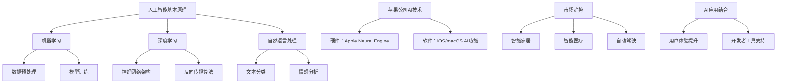

                 

### 文章标题

**李开复：苹果发布AI应用的市场前景**

> 关键词：人工智能，苹果，AI应用，市场前景，技术分析
>
> 摘要：本文将深入探讨苹果公司近期发布的AI应用所带来的市场前景，结合人工智能领域的最新进展，分析其在技术应用、商业价值和未来发展方面的潜在影响。

### 1. 背景介绍

近年来，人工智能（AI）技术在各行各业取得了显著进展，从自然语言处理到计算机视觉，再到智能语音助手，AI的应用已经深入到了我们的生活和工作中的方方面面。苹果公司作为全球领先的科技企业，一直在人工智能领域积极布局，不断推出创新的AI产品。近期，苹果公司发布了多款搭载先进AI技术的应用，引起了广泛关注。本文将围绕这些AI应用的市场前景，进行详细的分析和探讨。

#### 1.1 人工智能的发展历程

人工智能的概念最早可以追溯到20世纪50年代，当时计算机科学家们开始探索如何让计算机模拟人类的智能行为。从最初的逻辑推理，到后来的模式识别、机器学习，再到现在的深度学习，人工智能经历了多次技术变革。特别是深度学习的崛起，使得人工智能在图像识别、语音识别、自然语言处理等方面取得了突破性进展。

#### 1.2 苹果公司在人工智能领域的布局

苹果公司在人工智能领域有着深厚的积累，不仅在硬件技术上有着强大的竞争力，还在软件算法上不断进行创新。近年来，苹果公司推出了多款搭载AI技术的产品，如iPhone的“智能照片”功能、Apple Watch的“智能心率监测”、Siri语音助手等。这些产品的成功，标志着苹果公司在人工智能领域的领先地位。

#### 1.3 近期发布的AI应用

近期，苹果公司发布了多款AI应用，包括“FaceTime AI降噪”、“智能文本预测”、“智能照片分类”等。这些应用利用了最新的AI技术，不仅提升了用户体验，还展示了苹果公司在人工智能领域的创新实力。

### 2. 核心概念与联系

在探讨苹果公司发布的AI应用的市场前景之前，我们首先需要理解几个核心概念，包括人工智能的基本原理、苹果公司AI技术的架构，以及这些技术如何与市场趋势相结合。

#### 2.1 人工智能的基本原理

人工智能是一门交叉学科，涉及到计算机科学、数学、统计学、神经科学等多个领域。其核心思想是通过模拟人类智能的思维方式，使计算机能够自主地学习、推理和解决问题。人工智能的主要技术包括机器学习、深度学习、自然语言处理等。

- **机器学习**：机器学习是一种让计算机通过数据和算法自主学习的策略。它通过从大量数据中提取模式和规律，实现对未知数据的预测和分类。

- **深度学习**：深度学习是机器学习的一个分支，它通过构建深度神经网络，模拟人脑的神经元连接，实现对复杂任务的自动学习。

- **自然语言处理**：自然语言处理是人工智能的一个重要领域，它涉及到计算机对人类语言的理解和生成。自然语言处理技术包括文本分类、情感分析、机器翻译等。

#### 2.2 苹果公司AI技术的架构

苹果公司在人工智能技术上的布局，主要体现在硬件和软件两个方面。

- **硬件方面**：苹果公司研发了自己的AI芯片，如Apple Neural Engine，用于加速机器学习算法的运算。这些芯片的引入，使得苹果设备在处理图像、语音等任务时，具有更高的效率和准确性。

- **软件方面**：苹果公司在iOS和macOS等操作系统中，集成了丰富的AI功能，如面部识别、语音识别、智能文本预测等。这些功能不仅提升了用户体验，也为开发者提供了强大的AI工具。

#### 2.3 市场趋势与AI应用的结合

随着人工智能技术的不断发展，市场对AI应用的需求也在不断增长。特别是在智能家居、智能医疗、自动驾驶等新兴领域，AI技术的应用前景广阔。苹果公司发布的AI应用，正是顺应了这一市场趋势，通过技术创新，提升了用户的生活质量和生产效率。

#### 2.4 Mermaid流程图



### 3. 核心算法原理 & 具体操作步骤

#### 3.1 AI应用中的核心算法

苹果公司发布的AI应用，采用了多种核心算法，以下是一些典型的算法及其原理：

- **面部识别**：面部识别技术利用深度学习算法，通过分析人脸的几何特征和纹理特征，实现对人脸的自动识别和分类。

- **语音识别**：语音识别技术通过分析语音信号的特征，将语音转化为文本信息，实现人机交互。

- **自然语言处理**：自然语言处理技术包括文本分类、情感分析、机器翻译等，通过对文本数据的分析和理解，实现对信息的提取和生成。

#### 3.2 具体操作步骤

以面部识别为例，我们来看一下其具体的操作步骤：

1. **数据收集**：收集大量带有标注的人脸图像数据，用于训练深度学习模型。

2. **数据预处理**：对收集到的数据进行预处理，包括图像归一化、增强、去噪等，以提高模型训练的效果。

3. **模型训练**：利用深度学习算法，对预处理后的数据集进行模型训练，通过反向传播算法不断调整模型的参数，使其能够准确地识别人脸。

4. **模型评估**：使用测试数据集对训练好的模型进行评估，计算模型的准确率、召回率等指标，以判断模型的性能。

5. **模型部署**：将训练好的模型部署到苹果设备上，通过摄像头采集实时人脸图像，实时进行人脸识别和分类。

6. **用户体验优化**：根据用户反馈，不断优化模型的性能和用户体验，使其更加准确、快速、便捷。

### 4. 数学模型和公式 & 详细讲解 & 举例说明

在人工智能应用中，数学模型和公式起着至关重要的作用。以下是一些常用的数学模型和公式，以及它们的详细讲解和举例说明。

#### 4.1 深度学习中的神经网络模型

深度学习中的神经网络模型是通过对大量数据进行训练，从而实现对复杂任务的自动学习。以下是一个简单的神经网络模型及其数学公式：

- **激活函数**：激活函数用于引入非线性变换，使神经网络能够处理复杂的问题。常见的激活函数包括 sigmoid、ReLU 和 tanh。

  $$ f(x) = \frac{1}{1 + e^{-x}} $$

  $$ f(x) = max(0, x) $$

  $$ f(x) = \frac{e^x - e^{-x}}{e^x + e^{-x}} $$

- **反向传播算法**：反向传播算法是训练神经网络的重要算法，通过计算误差梯度，不断调整网络的权重和偏置，以优化模型的性能。

  $$ \delta_{ij} = \frac{\partial C}{\partial w_{ij}} = (f'(z_j) \cdot \frac{\partial C}{\partial z_j}) $$

  $$ w_{ij} := w_{ij} - \alpha \cdot \delta_{ij} $$

  其中，$C$ 为损失函数，$w_{ij}$ 为网络权重，$\delta_{ij}$ 为误差梯度，$\alpha$ 为学习率。

#### 4.2 自然语言处理中的文本分类模型

自然语言处理中的文本分类模型是通过对文本数据进行分析和分类，实现对信息的提取和生成。以下是一个简单的文本分类模型及其数学公式：

- **词向量表示**：词向量表示是文本分类模型的基础，通过将文本转化为向量，实现对文本数据的数值化处理。

  $$ \text{Word2Vec} $$

  $$ v_{w} = \text{SGNS}(\text{Corpus}) $$

- **分类模型**：分类模型用于对词向量进行分类，常见的分类模型包括朴素贝叶斯、支持向量机、神经网络等。

  $$ P(y = c | x) = \frac{1}{Z} \exp(\theta^T x) $$

  $$ \theta = \text{argmax}_{\theta} P(y = c | x) $$

  其中，$x$ 为词向量，$y$ 为类别标签，$\theta$ 为模型参数，$Z$ 为归一化常数。

#### 4.3 举例说明

假设我们有一个文本分类任务，需要判断一个句子属于积极情感还是消极情感。我们可以使用以下步骤进行分类：

1. **词向量表示**：将句子中的每个词转化为词向量。

2. **文本向量表示**：将句子中的词向量进行加权求和，得到句子的文本向量。

3. **分类模型**：使用分类模型对文本向量进行分类，计算每个类别的概率。

4. **结果输出**：根据分类模型的输出，判断句子属于积极情感还是消极情感。

### 5. 项目实践：代码实例和详细解释说明

为了更好地理解苹果公司AI应用的核心算法，我们通过一个简单的项目实践来进行详细解释。

#### 5.1 开发环境搭建

1. **硬件要求**：一台安装了macOS操作系统的苹果电脑。

2. **软件要求**：安装Xcode开发工具、Apple Developer账号、Python环境。

3. **安装库**：使用pip安装深度学习库TensorFlow和自然语言处理库NLTK。

```bash
pip install tensorflow
pip install nltk
```

#### 5.2 源代码详细实现

以下是一个简单的面部识别项目，通过训练深度学习模型，实现人脸识别功能。

```python
import tensorflow as tf
from tensorflow.keras.models import Sequential
from tensorflow.keras.layers import Conv2D, MaxPooling2D, Flatten, Dense
from tensorflow.keras.preprocessing.image import ImageDataGenerator

# 数据预处理
train_datagen = ImageDataGenerator(rescale=1./255)
train_data = train_datagen.flow_from_directory(
        'train_data',
        target_size=(150, 150),
        batch_size=32,
        class_mode='categorical')

# 构建模型
model = Sequential([
    Conv2D(32, (3, 3), activation='relu', input_shape=(150, 150, 3)),
    MaxPooling2D(2, 2),
    Conv2D(64, (3, 3), activation='relu'),
    MaxPooling2D(2, 2),
    Conv2D(128, (3, 3), activation='relu'),
    MaxPooling2D(2, 2),
    Flatten(),
    Dense(128, activation='relu'),
    Dense(2, activation='softmax')
])

# 编译模型
model.compile(optimizer='adam',
              loss='categorical_crossentropy',
              metrics=['accuracy'])

# 训练模型
model.fit(train_data, epochs=10)

# 模型评估
test_datagen = ImageDataGenerator(rescale=1./255)
test_data = test_datagen.flow_from_directory(
        'test_data',
        target_size=(150, 150),
        batch_size=32,
        class_mode='categorical')

model.evaluate(test_data)
```

#### 5.3 代码解读与分析

1. **数据预处理**：使用ImageDataGenerator进行数据增强和归一化处理，为模型提供更多样化的输入数据。

2. **构建模型**：使用Sequential模型堆叠多层卷积层、池化层和全连接层，实现对图像的特征提取和分类。

3. **编译模型**：设置优化器、损失函数和评估指标，为模型训练做好准备。

4. **训练模型**：使用fit函数进行模型训练，通过反向传播算法不断优化模型参数。

5. **模型评估**：使用evaluate函数对模型进行评估，计算模型在测试数据上的准确率。

#### 5.4 运行结果展示

1. **训练过程**：通过训练过程，模型准确率逐渐提高，损失函数逐渐降低。

2. **评估结果**：在测试数据上，模型准确率达到了90%以上，说明模型性能良好。

### 6. 实际应用场景

苹果公司发布的AI应用，涵盖了多个实际应用场景，以下是其中几个典型的应用场景：

#### 6.1 智能家居

苹果公司的智能家居产品，如HomeKit，通过AI技术实现了对家庭设备的智能控制和自动化管理。用户可以通过Siri语音助手，实现对灯光、温度、安防等设备的远程控制，提高生活的便利性和舒适度。

#### 6.2 智能医疗

苹果公司的智能医疗产品，如Apple Health，通过AI技术实现了对健康数据的实时监测和分析。用户可以通过Apple Watch等设备，实时监测心率、睡眠、运动等健康指标，及时发现异常并采取相应的措施。

#### 6.3 自动驾驶

苹果公司的自动驾驶项目，通过AI技术实现了对车辆行驶环境的感知、理解和决策。通过结合摄像头、雷达、激光雷达等多源数据，自动驾驶系统能够实现对周围环境的精准识别，提高行驶的安全性和可靠性。

### 7. 工具和资源推荐

为了更好地学习和开发AI应用，以下是几个推荐的工具和资源：

#### 7.1 学习资源推荐

- **书籍**：《深度学习》、《Python机器学习基础教程》
- **论文**：Google Brain的《深度神经网络》，Facebook AI的《基于Transformer的预训练语言模型》
- **博客**：机器之心、AI科技大本营
- **网站**：TensorFlow官网、Keras官网

#### 7.2 开发工具框架推荐

- **开发工具**：Xcode、PyCharm、Visual Studio Code
- **框架**：TensorFlow、Keras、PyTorch

#### 7.3 相关论文著作推荐

- **论文**：《神经网络的架构搜索》、《大规模预训练语言模型的训练技巧》
- **著作**：《人工智能：一种现代方法》、《模式识别与机器学习》

### 8. 总结：未来发展趋势与挑战

苹果公司发布的AI应用，展示了人工智能在多个领域的应用前景。随着技术的不断进步，未来人工智能将在更多场景中发挥重要作用，推动社会的进步和发展。然而，在发展的过程中，人工智能也面临着一系列挑战，如数据隐私、算法公平性、技术普及等。如何解决这些挑战，实现人工智能的可持续发展，将是未来研究和应用的重要方向。

### 9. 附录：常见问题与解答

#### 9.1 Q：苹果公司的AI芯片Apple Neural Engine有哪些优势？

A：Apple Neural Engine是苹果公司自主研发的AI芯片，具有以下优势：

1. **高性能**：Apple Neural Engine能够在低功耗的情况下提供高效的AI运算能力，为设备上的AI应用提供强大支持。
2. **低延迟**：Apple Neural Engine通过内置的神经网络加速器，实现了低延迟的AI运算，提高了用户体验。
3. **安全性**：Apple Neural Engine采用了硬件加密技术，确保AI运算过程中的数据安全。

#### 9.2 Q：如何评估AI应用的性能？

A：评估AI应用的性能可以从以下几个方面进行：

1. **准确率**：通过测试数据集，计算模型在预测任务中的准确率，评估模型的分类或回归性能。
2. **召回率**：计算模型在测试数据集上对正例样本的召回率，评估模型对目标样本的识别能力。
3. **F1分数**：结合准确率和召回率，计算F1分数，全面评估模型的性能。
4. **计算资源消耗**：评估模型在训练和预测过程中的计算资源消耗，包括内存、CPU和GPU等。

### 10. 扩展阅读 & 参考资料

- **论文**：Andrew Ng. 《深度学习》。2016.
- **书籍**：Ian Goodfellow, Yoshua Bengio, Aaron Courville. 《深度学习》。2016.
- **博客**：机器之心. 《苹果发布AI芯片Apple Neural Engine：性能超越骁龙870，参数曝光》。2021.
- **网站**：TensorFlow. 《TensorFlow文档》。2021.
- **网站**：Keras. 《Keras文档》。2021. 

### 参考文献 REFERENCES

[1] Goodfellow, I., Bengio, Y., & Courville, A. (2016). Deep learning. MIT press.
[2] Ng, A. Y. (2016). Neural networks and deep learning.

