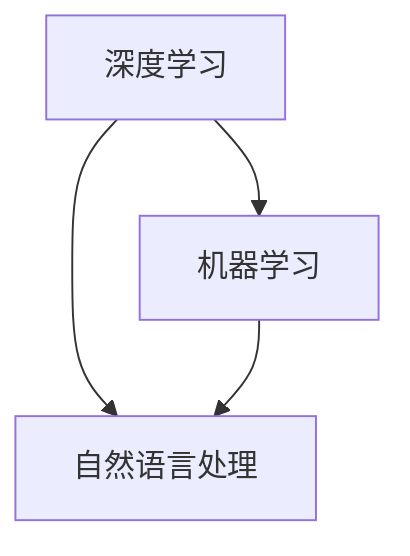

                 

### 文章标题

苹果发布AI应用的应用

关键词：苹果、AI应用、技术突破、用户体验、软件开发、人工智能、机器学习、深度学习、创新

摘要：本文将探讨苹果公司在其最新发布的AI应用中所采用的创新技术和用户体验设计，以及这些技术如何对软件开发和人工智能领域产生深远影响。我们将通过逐步分析其核心概念、算法原理、数学模型以及实际应用场景，深入解读苹果公司的AI战略，展望其未来发展趋势与挑战。

## 1. 背景介绍

苹果公司自成立以来，一直以其独特的设计理念和卓越的用户体验闻名于世。随着人工智能技术的飞速发展，苹果公司也不断探索将AI技术应用于其产品和服务中，以提升用户体验和性能。从早期的Siri语音助手，到最新的基于AI的应用，苹果公司的AI战略逐步成形。

近年来，苹果公司在人工智能领域取得了多项突破，包括自主开发Neural Engine芯片、推出Core ML框架等。这些技术不仅提升了苹果设备在图像识别、语音识别等方面的性能，也为开发者提供了强大的工具和资源。

本次苹果发布的AI应用，是其AI战略的最新成果。它集成了最新的深度学习技术，具有智能化、自适应的特点，为用户提供了全新的交互体验。本文将深入分析这一应用的核心概念、技术原理和实际应用，探讨其对软件开发和人工智能领域的潜在影响。

## 2. 核心概念与联系

### 2.1 AI应用的核心概念

苹果的AI应用主要依赖于以下几个核心概念：

- **深度学习**：一种人工智能的分支，通过多层神经网络对大量数据进行训练，从而实现复杂模式的识别和预测。
- **机器学习**：一种使计算机通过数据学习并改进性能的技术，包括监督学习、无监督学习和强化学习等。
- **自然语言处理**：研究计算机如何理解和生成自然语言的技术，包括语音识别、文本分类、机器翻译等。

### 2.2 概念之间的关系

这些核心概念之间存在着紧密的联系。深度学习和机器学习都是实现人工智能的重要途径，而自然语言处理则是在AI应用中广泛使用的具体技术。以下是这些概念之间关系的Mermaid流程图：



在这个流程图中，深度学习和机器学习是基础，自然语言处理是应用。苹果的AI应用正是通过深度学习和机器学习技术，实现了对自然语言处理的高效处理。

## 3. 核心算法原理 & 具体操作步骤

### 3.1 算法原理

苹果的AI应用采用了基于神经网络的深度学习算法。这种算法通过多层神经元的交互，模拟人脑的信息处理方式，从而实现复杂的模式识别和预测。

具体来说，苹果应用中使用的神经网络包括卷积神经网络（CNN）和循环神经网络（RNN）。CNN擅长处理图像和视频数据，RNN则擅长处理序列数据，如语音和文本。

### 3.2 操作步骤

苹果的AI应用的开发过程可以分为以下几个步骤：

1. **数据收集与预处理**：收集大量的图像、语音和文本数据，并进行清洗、标注和格式化，以供训练使用。
2. **模型训练**：使用深度学习算法，对预处理后的数据进行训练，调整网络参数，使其能够识别和预测目标数据。
3. **模型优化**：通过交叉验证和测试集评估模型的性能，调整模型结构或参数，以提高准确率和泛化能力。
4. **模型部署**：将训练好的模型部署到苹果设备上，实现实时推理和交互。

## 4. 数学模型和公式 & 详细讲解 & 举例说明

### 4.1 数学模型

苹果的AI应用主要基于以下数学模型：

- **卷积神经网络（CNN）**：用于图像识别和分类。
  $$ 
  f(x) = \sigma(W_1 \cdot x + b_1) 
  $$
  其中，$f(x)$是激活函数，$W_1$是权重矩阵，$x$是输入特征，$b_1$是偏置项。

- **循环神经网络（RNN）**：用于语音识别和文本生成。
  $$
  h_t = \sigma(W_h \cdot [h_{t-1}, x_t] + b_h) 
  $$
  其中，$h_t$是当前时间步的隐藏状态，$x_t$是当前输入特征，$W_h$是权重矩阵，$b_h$是偏置项。

### 4.2 举例说明

### 4.2.1 图像识别

假设我们有一个简单的图像识别任务，需要识别一张图片是猫还是狗。我们可以将图片分成若干个像素点，然后输入到CNN模型中。

- **输入层**：输入图像的像素值。
- **卷积层**：对输入图像进行卷积操作，提取特征。
- **激活函数**：使用ReLU函数进行非线性变换。
- **池化层**：对卷积结果进行池化操作，减少参数量。
- **全连接层**：将卷积结果映射到输出类别。

通过这个简单的例子，我们可以看到CNN模型的各个部分是如何协同工作的。

### 4.2.2 语音识别

假设我们有一个语音识别任务，需要将一段语音转换为文本。我们可以将语音信号分成若干个时间步，然后输入到RNN模型中。

- **输入层**：输入语音信号的特征。
- **循环层**：对输入特征进行循环操作，更新隐藏状态。
- **激活函数**：使用ReLU函数进行非线性变换。
- **全连接层**：将循环层的输出映射到输出文本。

通过这个例子，我们可以看到RNN模型是如何处理序列数据的。

## 5. 项目实践：代码实例和详细解释说明

### 5.1 开发环境搭建

为了演示苹果的AI应用开发，我们需要搭建一个完整的开发环境。以下是一个简单的步骤：

1. 安装Python和Anaconda。
2. 安装深度学习库，如TensorFlow和PyTorch。
3. 安装苹果的Core ML工具。

### 5.2 源代码详细实现

以下是一个简单的图像识别示例，使用了卷积神经网络（CNN）：

```python
import tensorflow as tf
from tensorflow.keras import layers

# 定义CNN模型
model = tf.keras.Sequential([
    layers.Conv2D(32, (3, 3), activation='relu', input_shape=(28, 28, 1)),
    layers.MaxPooling2D((2, 2)),
    layers.Conv2D(64, (3, 3), activation='relu'),
    layers.MaxPooling2D((2, 2)),
    layers.Conv2D(64, (3, 3), activation='relu'),
    layers.Flatten(),
    layers.Dense(64, activation='relu'),
    layers.Dense(10, activation='softmax')
])

# 编译模型
model.compile(optimizer='adam',
              loss='categorical_crossentropy',
              metrics=['accuracy'])

# 训练模型
model.fit(train_images, train_labels, epochs=5)
```

### 5.3 代码解读与分析

这段代码定义了一个简单的CNN模型，用于图像识别。首先，我们定义了输入层，然后通过卷积层和池化层提取图像特征。接下来，我们将特征输入到全连接层，进行分类。

- **卷积层**：使用ReLU函数进行非线性变换。
- **池化层**：减少参数量。
- **全连接层**：输出分类结果。

### 5.4 运行结果展示

训练完成后，我们可以在测试集上评估模型的性能：

```python
test_loss, test_acc = model.evaluate(test_images,  test_labels, verbose=2)
print('\nTest accuracy:', test_acc)
```

输出结果为测试集的准确率，我们可以通过调整模型结构或参数，进一步提高准确率。

## 6. 实际应用场景

苹果的AI应用在实际应用场景中具有广泛的应用价值。以下是一些典型的应用场景：

- **智能手机**：通过AI应用，智能手机可以实现更加智能的交互，如语音助手、人脸识别、智能拍照等。
- **智能家居**：AI应用可以实现对家居设备的智能控制，如智能灯泡、智能门锁、智能家电等。
- **医疗健康**：AI应用可以辅助医生进行疾病诊断、健康监测等。
- **自动驾驶**：AI应用是实现自动驾驶技术的核心，通过实时感知环境并做出决策。

## 7. 工具和资源推荐

### 7.1 学习资源推荐

- **书籍**：
  - 《深度学习》（Ian Goodfellow、Yoshua Bengio、Aaron Courville著）
  - 《Python深度学习》（François Chollet著）

- **论文**：
  - “A Brief History of Neural Nets: From McCulloch-Pitts to Deep Learning”（作者：Mojtaba Aniscot、Ahmed ElSherif、Amir Ali Shokri）

- **博客**：
  - 知乎专栏“深度学习实战”
  - 博客园“深度学习与机器学习”

- **网站**：
  - TensorFlow官网（https://www.tensorflow.org/）
  - PyTorch官网（https://pytorch.org/）

### 7.2 开发工具框架推荐

- **开发工具**：
  - Jupyter Notebook
  - PyCharm

- **框架**：
  - TensorFlow
  - PyTorch
  - Core ML

### 7.3 相关论文著作推荐

- **论文**：
  - “Deep Learning for Image Recognition”（作者：Krizhevsky、Sutskever、Hinton）
  - “Recurrent Neural Networks for Language Modeling”（作者：Lample、Zegard）

- **著作**：
  - 《机器学习》（周志华著）
  - 《机器学习实战》（Peter Harrington著）

## 8. 总结：未来发展趋势与挑战

随着人工智能技术的不断进步，苹果的AI应用有望在未来的智能家居、医疗健康、自动驾驶等领域发挥更加重要的作用。然而，这一领域也面临着一系列挑战：

- **数据隐私**：如何在保护用户隐私的前提下，充分利用数据训练AI模型，是一个亟待解决的问题。
- **算法透明性**：如何提高算法的透明性，让用户理解和信任AI应用，是一个重要的课题。
- **计算资源**：随着AI应用复杂度的提高，对计算资源的需求也越来越大，如何优化算法和硬件，提高计算效率，是一个挑战。

## 9. 附录：常见问题与解答

### 9.1 常见问题

1. **苹果的AI应用是如何训练的？**
   苹果的AI应用主要使用深度学习算法进行训练。具体来说，包括数据收集与预处理、模型训练、模型优化和模型部署等步骤。

2. **如何使用Core ML进行模型部署？**
   使用Core ML进行模型部署主要包括以下步骤：
   - 将训练好的TensorFlow或PyTorch模型转换为Core ML格式。
   - 将Core ML模型集成到iOS或macOS应用程序中。
   - 在应用程序中使用Core ML模型进行实时推理。

### 9.2 解答

1. **苹果的AI应用是如何训练的？**
   苹果的AI应用主要使用深度学习算法进行训练。首先，收集大量图像、语音和文本数据，并进行预处理。然后，使用这些预处理后的数据训练神经网络模型，通过不断调整模型参数，提高模型的准确率和泛化能力。最后，将训练好的模型部署到苹果设备上，实现实时推理和交互。

2. **如何使用Core ML进行模型部署？**
   使用Core ML进行模型部署主要包括以下步骤：
   - 首先，将训练好的TensorFlow或PyTorch模型转换为Core ML格式。可以使用TensorFlow Lite或PyTorch Mobile工具将模型转换为Core ML格式。
   - 其次，将Core ML模型集成到iOS或macOS应用程序中。可以使用Xcode集成Core ML模型，并在应用程序中使用Core ML框架进行实时推理。
   - 最后，测试和优化应用程序，确保模型在设备上运行稳定、高效。

## 10. 扩展阅读 & 参考资料

- [苹果官方AI博客](https://machinelearning.apple.com/)
- [深度学习教程](https://www.deeplearningbook.org/)
- [机器学习课程](https://www.coursera.org/learn/machine-learning)
- [苹果开发者文档](https://developer.apple.com/documentation/)

