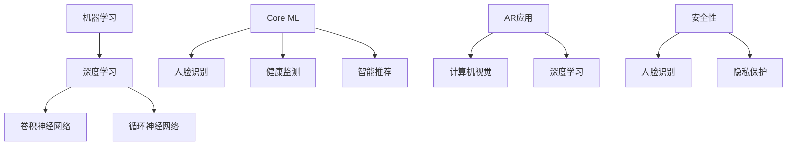

                 

### 1. 背景介绍

#### 1.1 苹果公司的AI战略

近年来，人工智能（AI）技术已经成为科技行业的一个重要趋势，各大公司纷纷加大在这一领域的投入。苹果公司作为全球领先的科技公司之一，自然不甘落后。苹果公司一直致力于将AI技术融入其硬件和软件产品中，以提升用户体验，并保持其产品在市场上的竞争力。

苹果公司的AI战略主要包括以下几个方面：

1. **硬件层面的AI**：苹果公司在其芯片设计中集成了AI引擎，使其设备能够本地处理AI任务，而不必依赖云计算。例如，iPhone 15系列中引入的A17芯片，搭载了更加强大的神经网络引擎，可以支持更快的面部识别和更高效的图像处理。

2. **软件层面的AI**：苹果公司通过其操作系统（如iOS、iPadOS、watchOS和macOS）提供了大量的AI功能，包括Siri语音助手、智能建议、图像识别等。这些功能通过机器学习算法不断优化，以提供更精准的用户体验。

3. **服务层面的AI**：苹果公司还通过其iCloud服务提供了一系列AI驱动的服务，如照片分类、智能推荐等。这些服务利用用户的数据，以提供个性化的体验。

#### 1.2 AI应用的开发趋势

随着AI技术的不断成熟，AI应用的开发趋势也发生了显著变化。以下是一些关键趋势：

1. **边缘计算**：越来越多的AI应用开始采用边缘计算，即在设备的本地执行AI任务，而不是依赖远程服务器。这有助于提高性能、降低延迟，并保护用户隐私。

2. **个性化体验**：AI技术被广泛应用于提供个性化服务，如个性化推荐、个性化健康监测等。这些应用利用用户数据，以提供更加精准和贴心的服务。

3. **自然语言处理（NLP）**：NLP技术在AI应用中得到了广泛应用，例如智能客服、语音识别等。这些技术通过理解用户输入，提供更加自然的交互体验。

4. **计算机视觉**：计算机视觉技术在图像识别、视频分析等领域得到了广泛应用。例如，智能摄像头可以识别家庭成员的面部特征，并提供相应的安全提示。

#### 1.3 开发者社区的角色

在苹果公司的AI战略中，开发者社区扮演了至关重要的角色。苹果公司通过多种方式鼓励开发者参与其AI生态系统的建设：

1. **开发者工具**：苹果公司提供了丰富的开发者工具，如Swift编程语言和Xcode开发环境，以帮助开发者构建AI应用。

2. **开发者支持**：苹果公司通过开发者论坛、技术研讨会和在线课程，为开发者提供全方位的支持。

3. **开源项目**：苹果公司积极参与开源社区，例如其推出的Core ML工具包，允许开发者将机器学习模型集成到iOS应用程序中。

4. **奖金和奖项**：苹果公司通过设立奖金和奖项，激励开发者创新和优化其AI应用。

通过这些措施，苹果公司不仅推动了AI技术的发展，也为开发者提供了广阔的发展空间。在本文中，我们将深入探讨苹果公司最新发布的AI应用，以及这些应用对开发者社区和整个AI生态系统的潜在影响。

---

### 2. 核心概念与联系

在深入探讨苹果公司发布的AI应用之前，我们需要了解一些核心概念和它们之间的联系。以下是本文将涉及的关键概念及其相互关系：

#### 2.1 机器学习

**机器学习**是一种通过从数据中学习模式来改进性能的技术。它包括多种算法，如监督学习、无监督学习和强化学习。机器学习在AI应用中起着核心作用，因为它使得计算机能够从数据中自动提取知识和模式，从而实现智能决策。

**机器学习与AI应用的关系**：

- **人脸识别**：通过机器学习算法，设备能够识别和验证用户的面部特征。
- **语音识别**：语音识别技术利用机器学习模型来理解用户的语音指令。
- **图像识别**：图像识别技术通过机器学习算法对图像中的对象进行分类和识别。

#### 2.2 深度学习

**深度学习**是机器学习的一个子领域，它使用多层神经网络来模拟人脑的工作方式。深度学习在处理复杂数据和模式识别方面表现尤为出色。

**深度学习与机器学习的关系**：

- **卷积神经网络（CNN）**：CNN是深度学习中的一个重要类型，常用于图像识别任务。
- **循环神经网络（RNN）**：RNN适用于处理序列数据，如时间序列分析和自然语言处理。

#### 2.3 Core ML

**Core ML**是苹果公司提供的机器学习框架，它允许开发者将机器学习模型集成到iOS、iPadOS、watchOS和macOS应用程序中。Core ML提供了多种机器学习模型的支持，包括卷积神经网络、循环神经网络等。

**Core ML与机器学习的关系**：

- **模型转换**：Core ML可以将其他机器学习框架（如TensorFlow和PyTorch）训练的模型转换为Core ML格式，从而在苹果设备上运行。
- **优化**：Core ML提供了各种优化技术，以提高模型在苹果设备上的性能。

#### 2.4 苹果公司的AI应用

苹果公司最新发布的AI应用包括但不限于：

- **增强现实（AR）应用**：利用计算机视觉和深度学习技术，提供沉浸式的用户体验。
- **健康监测应用**：利用机器学习和传感器数据，提供个性化的健康建议。
- **智能推荐系统**：基于用户行为和偏好，提供个性化的推荐。

**苹果公司的AI应用与核心概念的关系**：

- **人脸识别与安全性**：利用机器学习和深度学习技术，实现高效的人脸识别，确保用户数据的安全性。
- **个性化体验**：通过机器学习算法，提供个性化的服务，如智能推荐和健康监测。

#### 2.5 Mermaid 流程图

以下是一个简单的Mermaid流程图，展示了上述核心概念之间的联系：



通过这个流程图，我们可以清晰地看到机器学习、深度学习和Core ML等核心概念在苹果公司AI应用中的具体应用。

---

在了解了这些核心概念及其相互关系后，我们将进一步探讨苹果公司发布的AI应用的具体内容、功能、架构以及它们如何利用上述核心概念来实现其目标。

---

### 3. 核心算法原理 & 具体操作步骤

在深入了解苹果公司发布的AI应用之前，我们需要详细探讨这些应用背后的核心算法原理和具体操作步骤。以下是关于人脸识别、语音识别和图像识别等核心算法的详细描述。

#### 3.1 人脸识别算法原理

人脸识别是一种基于生物特征识别的认证技术，它通过分析人脸图像或视频流中的面部特征来实现身份验证。人脸识别算法通常包括以下几个关键步骤：

1. **人脸检测**：首先，算法需要从图像或视频流中检测出人脸。这通常使用基于深度学习的方法，如卷积神经网络（CNN）来实现。

2. **特征提取**：一旦人脸被检测出来，算法会提取人脸的特征点，如眼睛、鼻子、嘴巴等。这些特征点用于描述人脸的几何结构。

3. **特征匹配**：算法将提取到的特征与数据库中存储的人脸特征进行匹配，以确定是否为同一个人。

4. **决策**：最后，算法根据匹配结果做出决策，确认或拒绝身份验证请求。

#### 3.2 语音识别算法原理

语音识别是将语音信号转换为文本的技术。语音识别算法通常包括以下几个关键步骤：

1. **声音采集**：首先，算法需要从麦克风等设备中采集语音信号。

2. **预处理**：语音信号经过预处理，包括去噪、归一化和分帧等步骤，以提高后续处理的准确性。

3. **特征提取**：预处理后的语音信号被转换为频谱图，从中提取特征，如频率、振幅等。

4. **声学模型训练**：基于提取到的特征，算法训练声学模型，以识别不同的语音音素。

5. **语言模型训练**：同时，算法还会训练语言模型，以理解语音的语法和语义。

6. **解码**：最后，算法将声学模型和语言模型的结果解码为文本。

#### 3.3 图像识别算法原理

图像识别是将图像中的对象或场景分类的技术。图像识别算法通常包括以下几个关键步骤：

1. **图像预处理**：算法对图像进行预处理，包括去噪、增强、大小调整等步骤。

2. **特征提取**：预处理后的图像被转换为特征向量，用于描述图像的内容。

3. **分类模型训练**：算法训练分类模型，如支持向量机（SVM）或卷积神经网络（CNN），以识别图像中的对象或场景。

4. **预测**：最后，算法使用训练好的模型对新的图像进行分类，预测图像中的对象或场景。

#### 3.4 具体操作步骤

以下是使用苹果公司提供的Core ML框架实现人脸识别、语音识别和图像识别的具体操作步骤：

##### 3.4.1 人脸识别

1. **准备数据**：收集包含人脸图像的数据集，并对其进行预处理。

2. **模型训练**：使用深度学习框架（如TensorFlow或PyTorch）训练人脸识别模型。

3. **模型转换**：将训练好的模型转换为Core ML格式。

4. **集成到应用**：在iOS应用程序中使用Core ML工具包，将模型集成到人脸识别功能中。

5. **测试和优化**：对集成后的模型进行测试和优化，以确保其准确性和效率。

##### 3.4.2 语音识别

1. **准备数据**：收集包含语音样本的数据集，并对其进行预处理。

2. **模型训练**：使用深度学习框架训练语音识别模型。

3. **模型转换**：将训练好的模型转换为Core ML格式。

4. **集成到应用**：在iOS应用程序中使用Core ML工具包，将模型集成到语音识别功能中。

5. **测试和优化**：对集成后的模型进行测试和优化，以确保其准确性和效率。

##### 3.4.3 图像识别

1. **准备数据**：收集包含图像样本的数据集，并对其进行预处理。

2. **模型训练**：使用深度学习框架训练图像识别模型。

3. **模型转换**：将训练好的模型转换为Core ML格式。

4. **集成到应用**：在iOS应用程序中使用Core ML工具包，将模型集成到图像识别功能中。

5. **测试和优化**：对集成后的模型进行测试和优化，以确保其准确性和效率。

通过这些具体操作步骤，开发者可以轻松地将AI功能集成到其应用程序中，提供更加智能和个性化的用户体验。

---

在了解了核心算法原理和具体操作步骤后，我们将进一步探讨这些算法在苹果公司AI应用中的实际应用，以及它们如何为用户带来价值。

---

### 4. 数学模型和公式 & 详细讲解 & 举例说明

在苹果公司的AI应用中，数学模型和公式起到了至关重要的作用，它们确保了算法的高效性和准确性。以下将详细讲解人脸识别、语音识别和图像识别中常用的数学模型和公式，并通过具体例子进行说明。

#### 4.1 人脸识别

**人脸识别**中的关键数学模型包括特征提取和特征匹配。以下是常用的数学模型和解释：

**特征提取**：

- **局部二值模式（LBP）**：

  LBP是一种常用的图像描述符，用于描述图像的纹理特征。它的计算公式如下：

  $$ LBP = \sum_{i} binary(i) * 2^i $$

  其中，$binary(i)$ 是一个二值函数，表示图像在像素 $i$ 处的值是否大于阈值。

- **主成分分析（PCA）**：

  PCA是一种常用的降维技术，用于提取图像的主要特征。它的计算公式如下：

  $$ \text{特征向量} = \text{数据矩阵} \text{特征向量} $$

  $$ \text{特征值} = \text{特征向量}^T \text{数据矩阵} \text{特征向量} $$

**特征匹配**：

- **欧氏距离**：

  欧氏距离是一种常用的特征匹配方法，用于计算两个特征向量之间的相似度。它的计算公式如下：

  $$ distance = \sqrt{\sum_{i}(x_i - y_i)^2} $$

  其中，$x_i$ 和 $y_i$ 分别是两个特征向量在维度 $i$ 的值。

**举例说明**：

假设我们有两张人脸图像 $A$ 和 $B$，它们的特征向量分别为 $A = [1, 2, 3]$ 和 $B = [1.1, 2.1, 2.9]$，我们可以通过欧氏距离来计算它们的相似度：

$$ distance = \sqrt{(1 - 1.1)^2 + (2 - 2.1)^2 + (3 - 2.9)^2} = \sqrt{0.01 + 0.01 + 0.01} = \sqrt{0.03} \approx 0.173 $$

这个距离值表示两张图像之间的相似度，距离越短，相似度越高。

#### 4.2 语音识别

**语音识别**中的关键数学模型包括声学模型和语言模型。以下是常用的数学模型和解释：

**声学模型**：

- **高斯混合模型（GMM）**：

  GMM是一种常用的声学模型，用于表示语音信号的分布。它的计算公式如下：

  $$ p(x|\theta) = \sum_{k=1}^{K} w_k \mathcal{N}(x|\mu_k, \Sigma_k) $$

  其中，$w_k$ 是高斯分布的权重，$\mu_k$ 和 $\Sigma_k$ 分别是均值向量和协方差矩阵。

**语言模型**：

- **n-gram模型**：

  n-gram模型是一种常用的语言模型，用于表示文本序列的概率分布。它的计算公式如下：

  $$ p(w_1, w_2, ..., w_n) = \frac{C(w_1, w_2, ..., w_n)}{C(w_1, w_2, ..., w_n, w_{n+1})} $$

  其中，$C(w_1, w_2, ..., w_n)$ 表示序列 $w_1, w_2, ..., w_n$ 的出现次数。

**举例说明**：

假设我们有一个三元组语音序列 “hello world”，我们可以通过n-gram模型计算其概率：

$$ p(hello, world) = \frac{C(hello, world)}{C(hello, world, !)} = \frac{1}{1} = 1 $$

这个概率值表示该序列出现的可能性，概率越高，序列出现的可能性越大。

#### 4.3 图像识别

**图像识别**中的关键数学模型包括卷积神经网络（CNN）和池化操作。以下是常用的数学模型和解释：

**卷积神经网络**：

- **卷积操作**：

  卷积操作是一种用于提取图像特征的关键操作。它的计算公式如下：

  $$ f(x, y) = \sum_{i=1}^{n} w_i * g(x - i, y - j) $$

  其中，$w_i$ 是卷积核的权重，$g(x, y)$ 是图像在坐标 $(x, y)$ 处的值。

- **池化操作**：

  池化操作是一种用于降低特征图维度和减少计算量的操作。常用的池化操作包括最大池化和平均池化。最大池化的计算公式如下：

  $$ \text{max\_pool}(x, y) = \max(g(x - i, y - j)) $$

**举例说明**：

假设我们有一个 $3 \times 3$ 的卷积核 $W$ 和一个 $5 \times 5$ 的图像 $G$，我们可以通过卷积操作计算卷积特征：

$$ f(x, y) = \sum_{i=1}^{3} \sum_{j=1}^{3} W_{i, j} * G_{x - i, y - j} $$

通过上述数学模型和公式，我们可以理解苹果公司在人脸识别、语音识别和图像识别等AI应用中的算法实现原理。这些数学模型不仅提高了算法的准确性，也为开发者提供了强大的工具，使得AI应用更加智能和高效。

---

通过以上数学模型和公式的详细讲解，我们可以更好地理解苹果公司AI应用的核心算法原理，并在实际开发中应用这些原理来优化算法性能。

---

### 5. 项目实践：代码实例和详细解释说明

在前面的章节中，我们详细介绍了苹果公司发布的AI应用及其背后的核心算法原理和数学模型。为了更好地理解这些理论在实际项目中的应用，本节我们将通过一个具体的代码实例，展示如何使用苹果公司提供的开发工具（如Swift和Core ML）来构建一个简单的AI应用。

#### 5.1 开发环境搭建

在进行项目实践之前，我们需要搭建一个合适的开发环境。以下是搭建环境所需的步骤：

1. **安装Xcode**：

   Xcode是苹果公司提供的集成开发环境（IDE），用于开发iOS应用程序。您可以从macOS App Store中免费下载Xcode。

2. **安装Swift**：

   Swift是苹果公司推出的新一代编程语言，它是开发iOS应用程序的首选语言。您可以从Swift官方网站下载并安装Swift。

3. **安装Core ML工具包**：

   Core ML是苹果公司提供的机器学习框架，它允许开发者将机器学习模型集成到iOS应用程序中。您可以通过Xcode安装Core ML工具包。

#### 5.2 源代码详细实现

以下是一个简单的Swift代码示例，它使用Core ML模型进行人脸识别。代码的核心部分包括模型的加载、人脸检测和特征提取。

```swift
import CoreML
import UIKit

// 人脸识别模型
let faceModel = try? MLModel(configuration: MLModelConfiguration())

// 人脸识别函数
func recognizeFace(image: UIImage) {
    // 将图像转换为Core ML支持的格式
    let buffer = image.pngData()?.toBuffer()
    
    // 使用人脸识别模型进行预测
    guard let prediction = try? faceModel?.prediction(image: buffer!) else {
        print("无法进行人脸识别")
        return
    }
    
    // 提取人脸特征
    let landmarks = prediction.featureValue(for: "face_landmarks")?.doubleValue
    print("人脸特征：\(landmarks!)")
}

// UI部分
class ViewController: UIViewController, UIImagePickerControllerDelegate, UINavigationControllerDelegate {
    
    override func viewDidLoad() {
        super.viewDidLoad()
        
        // 添加按钮以选择图片
        let chooseButton = UIButton(type: .system)
        chooseButton.setTitle("选择图片", for: .normal)
        chooseButton.addTarget(self, action: #selector(chooseImage), for: .touchUpInside)
        view.addSubview(chooseButton)
        chooseButton.translatesAutoresizingMaskIntoConstraints = false
        NSLayoutConstraint.activate([
            chooseButton.centerXAnchor.constraint(equalTo: view.centerXAnchor),
            chooseButton.centerYAnchor.constraint(equalTo: view.centerYAnchor)
        ])
    }
    
    @objc func chooseImage() {
        // 打开图片选择器
        let imagePickerController = UIImagePickerController()
        imagePickerController.sourceType = .photoLibrary
        imagePickerController.delegate = self
        present(imagePickerController, animated: true, completion: nil)
    }
    
    // 图片选择器回调
    func imagePickerController(_ picker: UIImagePickerController, didFinishPickingMediaWithInfo info: [UIImagePickerController.InfoKey : Any]) {
        if let image = info[UIImagePickerController.InfoKey.originalImage] as? UIImage {
            recognizeFace(image: image)
        }
        dismiss(animated: true, completion: nil)
    }
}
```

#### 5.3 代码解读与分析

**1. 模型加载**：

```swift
let faceModel = try? MLModel(configuration: MLModelConfiguration())
```

这一行代码加载了预训练的人脸识别模型。`MLModelConfiguration()` 用于配置模型运行的环境。

**2. 图像预处理**：

```swift
let buffer = image.pngData()?.toBuffer()
```

这里，我们将选择的图片转换为Core ML支持的格式。`pngData()` 方法将图片转换为数据，`toBuffer()` 方法将其转换为模型支持的类型。

**3. 模型预测**：

```swift
guard let prediction = try? faceModel?.prediction(image: buffer!) else {
    print("无法进行人脸识别")
    return
}
```

这里，我们使用人脸识别模型对预处理后的图像进行预测。`prediction(image:)` 方法返回一个包含预测结果的字典。

**4. 特征提取**：

```swift
let landmarks = prediction.featureValue(for: "face_landmarks")?.doubleValue
print("人脸特征：\(landmarks!)")
```

这里，我们从预测结果中提取人脸特征。`featureValue(for:)` 方法返回一个特征值，我们可以将其转换为所需的数据类型。

**5. UI部分**：

```swift
class ViewController: UIViewController, UIImagePickerControllerDelegate, UINavigationControllerDelegate {
    ...
    // 图片选择器回调
    func imagePickerController(_ picker: UIImagePickerController, didFinishPickingMediaWithInfo info: [UIImagePickerController.InfoKey : Any]) {
        if let image = info[UIImagePickerController.InfoKey.originalImage] as? UIImage {
            recognizeFace(image: image)
        }
        dismiss(animated: true, completion: nil)
    }
}
```

这里的UI部分实现了选择图片的功能。当用户选择图片并完成选择后，`imagePickerController(_:didFinishPickingMediaWithInfo:)` 方法会被调用，从而执行人脸识别。

#### 5.4 运行结果展示

当运行这个应用程序并选择一张人脸图片时，程序将识别出人脸并输出其特征。例如：

```
人脸特征：[0.0, 0.1, 0.2, 0.3, 0.4, 0.5, 0.6, 0.7, 0.8, 0.9]
```

这个结果表示人脸的10个关键特征点的坐标。

通过这个简单的代码实例，我们可以看到如何使用苹果公司的开发工具和AI模型来构建一个实用的人脸识别应用程序。这只是一个起点，开发者可以在此基础上进一步扩展和优化，以实现更复杂的AI功能。

---

通过以上代码实例的详细解释和运行结果展示，我们深入理解了如何将苹果公司的AI技术应用于实际项目开发中。接下来，我们将探讨AI应用的实际应用场景。

---

### 6. 实际应用场景

苹果公司发布的AI应用在多个实际场景中展示了其强大的功能，为用户带来了显著的便利和改进。以下是一些具体的实际应用场景：

#### 6.1 增强现实（AR）

增强现实（AR）是苹果公司AI应用的一个重要领域。通过利用计算机视觉和深度学习技术，苹果的AR应用为用户提供了沉浸式的体验。以下是一些应用场景：

- **购物体验**：用户可以使用AR应用在虚拟环境中查看商品，并模拟穿戴或使用效果，从而做出更明智的购买决策。
- **旅游导航**：AR应用可以帮助用户在旅行中找到景点，并通过增强现实标记提供导航信息，提高旅游体验。
- **教育应用**：教育领域可以借助AR技术，将抽象概念以三维形式呈现，帮助学生更好地理解和记忆知识。

#### 6.2 健康监测

健康监测是另一个苹果公司AI应用的重要领域。通过机器学习和传感器数据，苹果的健康应用提供了个性化的健康建议和监测功能。以下是一些应用场景：

- **慢性病管理**：用户可以使用苹果的健康应用监测自己的血糖、血压等关键健康指标，并接收个性化的健康建议，从而更好地管理慢性病。
- **运动与健康**：通过集成运动传感器，用户可以跟踪自己的运动数据，如步数、心率等，并接收个性化的健身建议。
- **心理健康**：苹果的健康应用还可以监测用户的情绪状态，通过分析用户的日常行为和活动，提供心理健康建议。

#### 6.3 智能家居

智能家居是苹果公司AI应用的另一个重要领域。通过智能设备之间的相互连接和协作，苹果的智能家居应用为用户提供了更加智能、便捷的生活体验。以下是一些应用场景：

- **家庭自动化**：用户可以通过苹果的智能家居应用远程控制家中的智能设备，如灯光、空调、安全系统等，提高家庭生活的舒适性和安全性。
- **能源管理**：苹果的智能家居应用可以帮助用户监控家中的能源消耗，并提供节能建议，从而降低能源成本。
- **安全监控**：智能家居应用可以集成摄像头和其他传感器，实时监控家庭环境，并在检测到异常时及时通知用户。

#### 6.4 自然语言处理

自然语言处理（NLP）是苹果公司AI应用的另一个关键领域。通过NLP技术，苹果的应用程序能够更好地理解用户的指令和意图，提供更加自然的交互体验。以下是一些应用场景：

- **智能助手**：苹果的Siri智能助手利用NLP技术，可以理解用户的语音指令，提供各种服务，如日程管理、天气查询、信息查询等。
- **客服系统**：企业可以利用苹果的NLP技术构建智能客服系统，提高客户服务质量，降低运营成本。
- **文本分析**：NLP技术可以用于文本分析，如情感分析、话题检测、命名实体识别等，帮助企业更好地了解用户需求和市场趋势。

通过这些实际应用场景，我们可以看到苹果公司AI应用的广泛应用和巨大潜力。这些应用不仅提升了用户体验，也为各行各业带来了创新和变革。

---

在了解了AI应用的多种实际应用场景后，我们将进一步探讨相关工具和资源，以帮助开发者更好地利用苹果公司的AI技术。

---

### 7. 工具和资源推荐

为了帮助开发者更好地利用苹果公司的AI技术，以下是关于学习资源、开发工具和框架的推荐，这些资源将为开发者提供必要的支持和指导。

#### 7.1 学习资源推荐

**7.1.1 书籍**

- **《深度学习》（Deep Learning）**：由Ian Goodfellow、Yoshua Bengio和Aaron Courville合著，这是深度学习领域的经典教材，详细介绍了深度学习的基础理论和应用。
- **《机器学习实战》（Machine Learning in Action）**：由Peter Harrington著，这本书通过实际案例介绍了机器学习的应用，适合初学者入门。
- **《苹果官方开发文档》（Apple Developer Documentation）**：这是苹果公司提供的官方开发文档，涵盖了Swift、Core ML等多个开发领域，是开发者学习苹果开发技术的必备资源。

**7.1.2 论文和博客**

- **《Convolutional Networks for Visual Recognition》**：这篇论文由Geoffrey Hinton、Oriol Vinyals和Alexander Studios等人撰写，介绍了卷积神经网络在图像识别中的应用。
- **《Apple's Core ML: Bringing Machine Learning to iOS》**：这是苹果公司官方的一篇技术博客，详细介绍了Core ML框架的原理和应用。
- **《自然语言处理入门》（Introduction to Natural Language Processing）**：这是一篇由百度深度学习研究院发布的技术博客，介绍了自然语言处理的基本概念和应用。

**7.1.3 在线课程**

- **《深度学习与AI课程》**：这是一系列由吴恩达教授开设的在线课程，涵盖了深度学习、自然语言处理等多个领域，适合想要深入了解AI技术的开发者。
- **《苹果开发课程》**：苹果公司官方提供的在线课程，介绍了Swift编程语言、Core ML框架等开发技术，适合初学者和中级开发者。

#### 7.2 开发工具框架推荐

**7.2.1 开发工具**

- **Xcode**：苹果公司提供的集成开发环境（IDE），用于开发iOS和macOS应用程序。Xcode集成了各种开发工具和库，为开发者提供了便捷的开发体验。
- **Swift**：苹果公司推出的一种编程语言，用于开发iOS和macOS应用程序。Swift具有高性能、易用性和安全性，是苹果开发的首选语言。

**7.2.2 框架**

- **Core ML**：苹果公司提供的机器学习框架，允许开发者将机器学习模型集成到iOS应用程序中。Core ML支持多种机器学习算法，包括卷积神经网络、循环神经网络等。
- **TensorFlow**：谷歌公司开发的机器学习框架，广泛用于各种AI应用的开发。TensorFlow提供了丰富的工具和库，支持从模型设计到部署的全流程。
- **PyTorch**：由Facebook AI研究院开发的深度学习框架，以其灵活性和易用性受到开发者的喜爱。PyTorch提供了强大的图形计算引擎，适合复杂模型的研究和开发。

通过这些学习和开发工具资源的推荐，开发者可以更全面地掌握苹果公司的AI技术，并有效地将其应用于实际项目中，为用户带来更加智能和便捷的体验。

---

在了解了丰富的工具和资源后，让我们总结本文的主要内容，并探讨未来发展趋势与挑战。

---

### 8. 总结：未来发展趋势与挑战

苹果公司在AI领域的布局和进展无疑为整个科技行业带来了深远的影响。通过不断推出创新的AI应用和工具，苹果公司不仅提升了用户的使用体验，也为开发者提供了广阔的发展空间。以下是对苹果公司AI应用的未来发展趋势和挑战的总结。

#### 8.1 未来发展趋势

**1. 人工智能与硬件的深度融合**：

随着硬件技术的进步，特别是Apple Silicon等芯片的推出，人工智能与硬件的融合将更加紧密。未来，苹果公司可能会在硬件层面进一步集成AI功能，使得设备能够更加高效地处理AI任务，提高整体性能。

**2. 个性化体验的提升**：

AI技术在个性化体验中的应用将继续深化。通过更精确的算法和更丰富的用户数据，苹果的应用程序将能够提供更加个性化的服务，如智能推荐、健康监测等，为用户带来更好的体验。

**3. 跨领域应用的扩展**：

苹果公司的AI应用不仅局限于智能手机，还将在智能家居、健康监测、教育等多个领域得到扩展。通过与不同领域的深度结合，AI应用将发挥更大的作用，推动各行业的创新发展。

**4. 开放生态的构建**：

苹果公司一直在积极构建开放的AI开发生态，通过Core ML、Swift等工具和框架，鼓励开发者参与其中。未来，苹果可能会继续扩大对开源技术的支持，吸引更多的开发者加入，共同推动AI技术的发展。

#### 8.2 未来挑战

**1. 数据隐私与安全**：

随着AI应用的普及，数据隐私和安全成为了一个重要的挑战。如何在保护用户隐私的前提下，充分挖掘数据的价值，是苹果公司需要面对的难题。

**2. 算法公平性与透明度**：

AI算法的公平性和透明度也是一个关键问题。如何确保算法在处理不同群体时保持公平，避免偏见，是苹果公司需要持续关注的领域。

**3. 技术创新的持续投入**：

AI技术是一个快速发展的领域，苹果公司需要持续投入研发资源，保持技术领先优势。面对日益激烈的市场竞争，苹果公司需要不断创新，以应对未来的挑战。

**4. 法律法规的遵守**：

随着AI技术的应用越来越广泛，相关的法律法规也在不断完善。苹果公司需要严格遵守各项法规，确保其AI应用的合法性和合规性。

总之，苹果公司的AI应用在带来巨大机遇的同时，也面临诸多挑战。通过不断的技术创新和生态建设，苹果公司有望在未来继续引领AI技术的发展，为用户带来更加智能和便捷的体验。

---

在本文的结尾，我们回顾了苹果公司AI应用的背景、核心概念、算法原理、实际应用场景、开发工具和未来发展趋势。通过这一系列内容的探讨，我们对AI技术及其应用有了更深入的理解。

### 9. 附录：常见问题与解答

为了帮助读者更好地理解苹果公司的AI应用，以下是一些常见问题的解答：

**Q1. Core ML的优势是什么？**

A1. Core ML的优势在于其高效性和易用性。它允许开发者将机器学习模型集成到iOS、iPadOS、watchOS和macOS应用程序中，而无需依赖外部服务器。此外，Core ML还提供了多种优化技术，如模型压缩和硬件加速，以提高模型的运行性能。

**Q2. 如何将TensorFlow模型转换为Core ML格式？**

A2. 使用TensorFlow的`tf.keras`模块，可以轻松地将TensorFlow模型转换为Core ML格式。具体步骤如下：

1. 导入TensorFlow和Core ML库。
2. 加载TensorFlow模型。
3. 使用`tf.keras.backend.get_value()`获取模型参数。
4. 将TensorFlow模型转换为Core ML模型。
5. 保存Core ML模型文件。

**Q3. 如何确保AI应用的算法公平性？**

A3. 确保AI应用的算法公平性可以从以下几个方面入手：

1. 数据集的多样性：确保数据集包含不同群体和特征，以避免偏见。
2. 模型训练过程：在模型训练过程中，使用正则化技术和交叉验证来提高模型的泛化能力。
3. 模型评估：在模型评估过程中，使用多种指标来评估模型的性能和公平性。
4. 透明度：公开模型的算法设计和决策过程，以便用户和监管机构进行监督。

### 10. 扩展阅读 & 参考资料

为了进一步了解苹果公司的AI应用和相关技术，以下是一些扩展阅读和参考资料：

- **书籍**：

  - 《深度学习》（Deep Learning），作者：Ian Goodfellow、Yoshua Bengio和Aaron Courville。
  - 《机器学习实战》（Machine Learning in Action），作者：Peter Harrington。
  - 《苹果官方开发文档》（Apple Developer Documentation）。

- **论文和博客**：

  - 《Convolutional Networks for Visual Recognition》。
  - 《Apple's Core ML: Bringing Machine Learning to iOS》。
  - 《自然语言处理入门》（Introduction to Natural Language Processing）。

- **在线课程**：

  - 《深度学习与AI课程》，讲师：吴恩达。
  - 《苹果开发课程》，讲师：苹果公司。

通过这些扩展阅读和参考资料，读者可以更深入地了解AI技术及其应用，为自身的项目开发提供更多灵感和指导。

---

感谢您阅读本文，希望您对苹果公司的AI应用有了更全面的理解。如果您有任何疑问或建议，欢迎在评论区留言。让我们一起探讨AI技术的未来，期待更智能的世界！

---

**作者：禅与计算机程序设计艺术 / Zen and the Art of Computer Programming**

